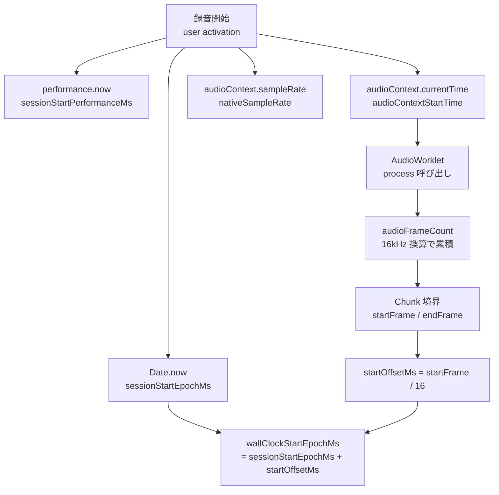
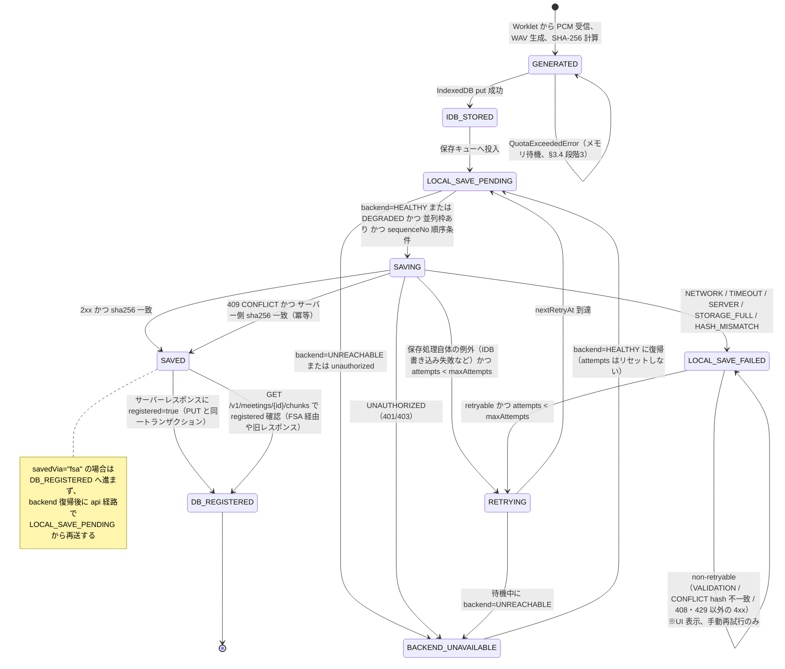
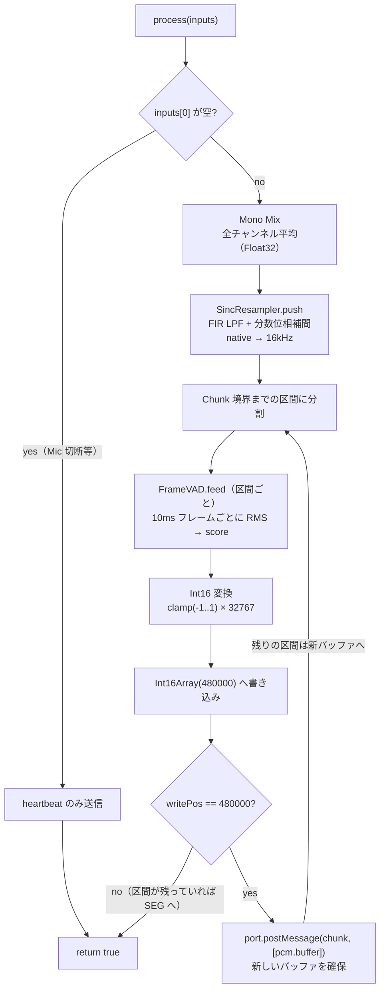
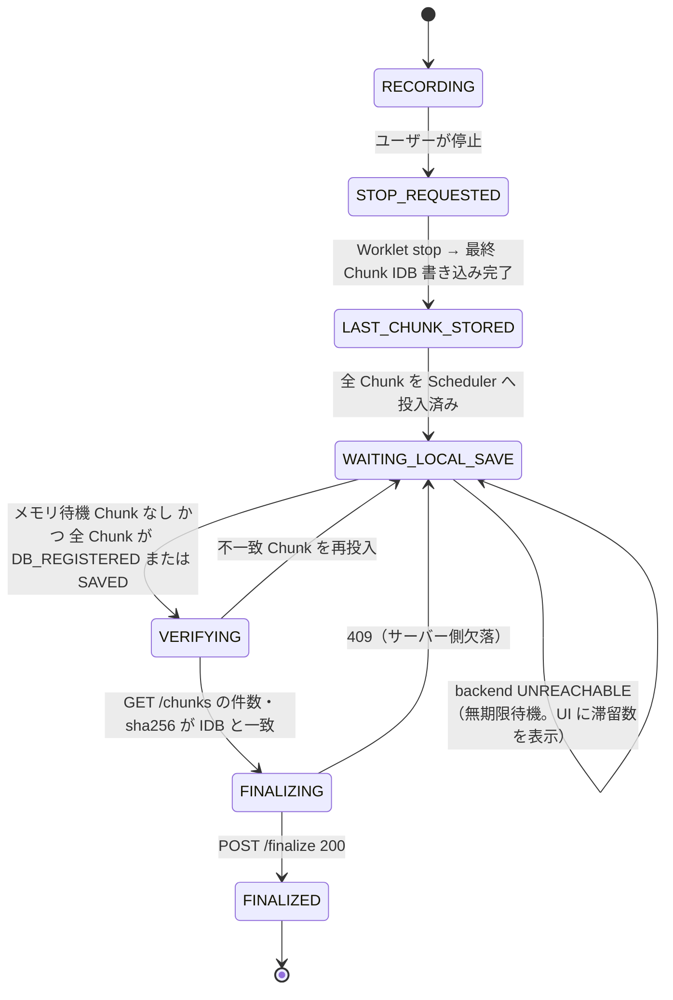
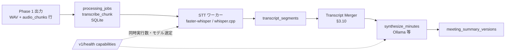

# 議事録Webアプリケーション Phase 1 詳細設計書（完全ローカル処理版）

**対象フェーズ:** Phase 1 ── Mic → AudioWorklet → 30秒Standalone WAV → IndexedDB → ローカル常駐サーバーへのPUT（File System Access APIによる手動エクスポートをフォールバック）
**設計方針:** Local-First / Zero External Data Egress / Recording-First / Fault-Tolerant / At-Least-Once / Hardware-Aware Degradation
**上位文書:** 議事録Webアプリケーション システム設計書 v4.0（設計レビュー版）。本書は v4.0 の「Recording is Source of Truth」原則と Invariant 1〜10 を変更せずに継承する。
**位置づけ:** 本書だけを見て Phase 1 のコーディングと結合テストに着手できることを目的とする。

---

# 1. エグゼクティブサマリー

本書は、v4.0 設計書のクラウド依存部分（Cloudflare R2 / Cloudflare Queues / Supabase / Groq / Gemini）をすべて利用者のマシン上で動作する構成に置き換えたうえで、実装フェーズ 1 を実装着手可能な粒度まで落とし込んだものである。

最重要原則は v4.0 と同じである。

> **Recording is Source of Truth.**

そのうえで、本書では次の4方針を追加する。

| 方針 | 意味 | v4.0 からの差分 |
| --- | --- | --- |
| Local-First / Zero External Data Egress | 音声・文字起こし・要約は、いかなる処理段階でも利用者のマシン（または利用者が管理するLAN内サーバー）の外へ出ない | Free-Tier-First を置き換える |
| No Cloud Quota / No Cloud Billing | クラウドの無料枠・レートリミット・課金という制約は存在しない前提に立つ | v4.0 §20〜§37, §99〜§105 のクォータ設計は本書では扱わない |
| Hardware-Aware Degradation | GPU の有無・VRAM・CPUコア数に応じてモデルサイズと同時実行数を段階的に落とす | クラウドのRPD/RPS上限を、ローカルGPU/CPUスループット上限に読み替える |
| Backend-Optional Recording | ローカル常駐サーバーが未起動・クラッシュ・ポート競合の状態でも、録音と IndexedDB 保存は継続する | Network断（v4.0 §91）を「ローカル常駐サーバーの起動断」に読み替える |

Phase 1 で「壊れても録音を失わない」ことを保証する障害は次の通り。

* ローカル常駐サーバー未起動 / クラッシュ / ポート競合
* ローカル常駐サーバーのディスクフル
* ブラウザタブの非表示・最小化
* ブラウザクラッシュ
* AudioContext の suspended / closed 遷移
* IndexedDB クォータ逼迫
* ユーザーによる意図しないタブクローズ・リロード（完全保護は不可能。§20 で範囲を明示）

---

# 2. v4.0 からの読み替え表

v4.0 の各構成要素をローカル構成へ機械的に読み替えたうえで、「読み替えるだけでは成立しない箇所」を右列に示す。

| v4.0 の構成要素 | 本書での置き換え | 単純読み替えでは不成立な点（本書での対処セクション） |
| --- | --- | --- |
| Cloudflare R2（Presigned PUT） | localhost 常駐APIサーバーへの `fetch` PUT | Presigned URL という「URL自体が短命Bearer Token」の仕組みは存在しない。セッショントークン方式で代替（§4.3） |
| R2 Object Key | ローカルファイルシステム上のパス規約 `{dataDir}/recordings/{meetingId}/{source}/{seq}.wav` | `userId` 階層を廃止（§3.1、§13） |
| Supabase（Postgres + Auth + RLS） | 常駐サーバー内の SQLite。Auth / RLS は廃止 | 単一ユーザー前提のため RLS の代替は不要。ただしローカルAPIへの第三者アクセス防止は必要（§4.3） |
| Cloudflare Queues + DLQ | SQLite 上のジョブテーブル（Phase 2） | 24h retention / 10,000 ops/day の制約は消える。代わりに GPU/CPU スループット上限がキュー詰まりの原因になる（§3.7） |
| Groq（STT） | faster-whisper / whisper.cpp（Phase 2） | 25MB上限・RPM/RPD は消える。モデルサイズによる精度・速度差とHallucination頻度が新たな論点（§3.7、§3.8） |
| Gemini（要約） | Ollama 等でホストするローカルLLM（Phase 2） | Structured Output の保証度がモデルにより異なる（§3.8） |
| Network断（v4.0 §91） | ローカル常駐サーバーの起動断 | Wi-Fi断と違い「利用者がサーバーを起動していない」状態が長時間続きうる。IndexedDB滞留量の上限設計が必要（§3.4、§21） |
| Wi-Fi断5分テスト（v4.0 §117） | ローカル常駐サーバー停止5分テスト | §24.2 |
| 容量見積もり（v4.0 §107） | ローカルディスク容量見積もり | IndexedDB とサーバー側ファイルの二重保持期間を設計する（§26） |

読み替えの対象外（Phase 1 のクライアント側に変更なし）：AudioWorklet / Standalone WAV / IndexedDB / Session Clock / Chunk Timing Metadata / VAD の位置づけ。

---

# 3. 未解決論点への結論

依頼プロンプトに列挙された 10 個の論点それぞれについて、Phase 1 での結論を示す。「採用」は Phase 1 の実装対象、「方針のみ」は本書で方針を確定し実装は後続フェーズ、「先送り」は理由付きで次フェーズへ持ち越すことを意味する。

## 3.1 単一ユーザー / 単一マシン前提の明示 ── 採用

**結論：Phase 1 は「1台のマシンを利用者本人だけが使う個人ツール」として割り切る。** ブラウザと常駐サーバーは同一ホスト（`127.0.0.1`）で動作することを前提とし、LAN 内の別端末からのアクセスは Phase 1 のサポート範囲外とする。

理由は次の3点である。第一に、LAN 共有を前提にすると、v4.0 の `meetings.user_id` と RLS に相当する認可モデルをローカルで再構築する必要があり、Phase 1 の目的（録音パイプラインの堅牢性確認）から逸脱する。第二に、GPU/CPU は単一の物理リソースであり、複数端末からの同時録音・同時 STT は Phase 2 のジョブテーブルによる直列化（同時実行数 = ハードウェア検出結果に依存、§3.7）で捌く必要があるが、Phase 1 にはそのジョブテーブルが存在しない。第三に、`127.0.0.1` 限定にすることで、ローカルAPIの認証を「同一マシン上の他プロセス・他ブラウザプロファイルからの誤アクセス防止」に絞れる（§4.3）。

将来 LAN 共有へ拡張する場合に備え、DB スキーマの `user_id` 列は削除せず、Phase 1 では固定値 `local` を格納する `local_user_id text not null default 'local'` に読み替える。ファイルパスからは `{userId}` 階層を外す（§13）。LAN 共有時は、常駐サーバーの bind アドレスを `0.0.0.0` に変更し、TLS とユーザー別トークンを追加する設計拡張点として §29 に記録する。

## 3.2 VAD アルゴリズムの未定義 ── 採用（簡易実装）＋先送り（高精度化）

**結論：Phase 1 では、フレームごとの RMS エネルギーを対数スケールで正規化した値を `vadScore` とし、ハングオーバー付きのしきい値判定で `hasVoice` を決める。** Silero VAD 等の学習済みモデルは Phase 2 で常駐サーバー側に置き、ブラウザ側 VAD は「STT スキップ候補のヒント」に格下げする。

Phase 1 で軽量な RMS 方式を採る理由は、v4.0 §10 の通り VAD は録音削除に使わず STT スキップ判定にしか使わないため、false negative があっても原音は失われない（Invariant 7）からである。AudioWorklet 内で動かす以上、1 レンダ量子（128 フレーム）あたりの処理は数マイクロ秒に収める必要があり、ONNX 推論をワークレット内で回す選択肢は Phase 1 では取らない。

false negative 率の評価方法は次の通りとする。Phase 1 では各 Chunk の `vadScore` と `hasVoice` を IndexedDB とサーバーへ記録するのみとし、Phase 2 で STT を導入した時点で「`hasVoice=false` だったが STT が非空テキストを返した Chunk」の割合を false negative の実測指標として集計する。しきい値（初期値 0.15、v4.0 §11）はこの実測値で調整する設定値であり、固定仕様ではない。

## 3.3 リサンプリングの DSP 品質 ── 採用

**結論：ナイーブな間引きは禁止し、windowed-sinc FIR ローパスフィルタを畳み込んでから出力レート 16kHz で標本化する「FIR + 分数位相補間」方式を採用する。** カットオフは出力ナイキスト周波数 8kHz より下の 7.2kHz（0.9 × 8kHz）、Kaiser 窓ではなく実装が単純な Blackman 窓、タップ数はネイティブレートに応じて動的に決める（48kHz → 16kHz で 64 タップ程度）。

AudioContext のネイティブ sample rate は 44.1kHz / 48kHz / 96kHz など環境依存であり（v4.0 §4）、48kHz のような整数比（3:1）と 44.1kHz のような非整数比（2.75625:1）の両方を扱う必要がある。整数比のときだけ多相分解して高速化する最適化は Phase 1 では行わず、すべてのレートを「FIR 後の連続時間補間」として統一的に扱う。128 フレームごとに約 42 サンプル出力するだけなので、CPU 負荷は問題にならない。

品質の担保はテストで行う。8kHz を超える正弦波（例：12kHz）を入力したとき、出力 16kHz 信号に折り返し成分（4kHz）が -40dB 以下で現れることをテスト §24.5 で検証する。「-40dB」は STT 精度への影響を実測で確認するまでの暫定基準であり、Phase 2 で faster-whisper の認識結果と突き合わせて見直す。

## 3.4 IndexedDB ストレージクォータ超過時の挙動 ── 採用

**結論：三段階の縮退を設計し、いずれの段階でも録音を停止しない。**

1. **監視**：録音開始時に `navigator.storage.persist()` を要求し、Chunk 保存ごとに `navigator.storage.estimate()` で `usage / quota` を確認する（§21）。
2. **段階1（使用率 ≥ 80%）**：状態が `DB_REGISTERED`（サーバー側で SHA-256 が検証済み）の Chunk から、`sequenceNo` 昇順に WAV Blob 本体を IndexedDB から削除し、メタデータのみ残す。サーバー側ファイルが Source of Truth の座を引き継いでいるため、録音データは失われない。
3. **段階2（使用率 ≥ 95% かつ削除対象なし＝サーバー未起動で全 Chunk が滞留）**：File System Access API による緊急エクスポート（§4.5）を UI で促す。エクスポート成功後、当該 Chunk は `SAVED`（保存先 = `fsa`）として扱い、段階1 と同様に Blob 本体を削除できる。
4. **段階3（それでも `put` が `QuotaExceededError` で失敗）**：Chunk はメモリ上の待機キューに保持し、UI に「保存領域が不足しています。サーバーを起動するかエクスポートしてください」と表示する。録音は継続する。メモリ待機キューはブラウザクラッシュで失われるため、この状態は `RecordingHealth.degradedReasons` に `IDB_QUOTA_EXHAUSTED` として記録し、UI が最上位警告として表示する。クォータ以外の理由で `put` が失敗した場合も同じくメモリ待機に回し、`IDB_WRITE_FAILED` として記録する（§15）。この場合は IndexedDB の回復を待たずにサーバーへ直接送り、サーバーにも届かなければ WAV として書き出せるようにする（§15 `drainMemoryBacklog()` / `exportMemoryBacklog()`）。

`persist()` の結果が `false` でも録音を止めない。永続化許可はブラウザのヒューリスティクスに依存し、断定できない事項である（§5）。

## 3.5 タブの明示的クローズへの保護 ── 採用（範囲限定）

**結論：`beforeunload` で離脱確認ダイアログを出し、`pagehide` で AudioWorklet に flush を要求して直近の未満 Chunk を IndexedDB へ書き込む。ただし「タブを閉じた後に非同期処理が完了する」ことはブラウザ仕様上保証されないため、完全保護とは位置づけず、IndexedDB 復旧（§23）で補完する。**

具体的には、`beforeunload` ハンドラで `event.preventDefault()` と `returnValue` 設定を行う（ブラウザによりダイアログ文言はカスタマイズできない）。`pagehide` では Worklet に `flush` メッセージを送り、返ってきた PCM を同期的に取り出せる範囲で IndexedDB へ `put` する。IndexedDB のトランザクションはページ破棄までに commit されるとは限らないため、最大 30 秒分の音声が失われる可能性は残る。この損失上限を UI の設定画面に明記する（§20）。

Phase 1 で `chunkDurationMs` を 30 秒より短くして損失上限を縮める案は採らない。Chunk 数が増えると IndexedDB とサーバーのオーバーヘッドが増え、v4.0 §8 の固定値（480,000 サンプル）が Phase 2 の STT 前提と結び付いているためである。

## 3.6 ローカル常駐バックエンドの存在と可用性管理 ── 採用

**結論：常駐サーバーの状態を `LocalBackendHealth` 型で表し、`GET /v1/health` を短いタイムアウト付きで定期ポーリングして `UNKNOWN / HEALTHY / DEGRADED / UNREACHABLE` を判定する。サーバーが `UNREACHABLE` の間も録音と IndexedDB 保存は継続し、保存 State Machine は `BACKEND_UNAVAILABLE` で待機して、`HEALTHY` に戻った時点で `sequenceNo` 昇順に再開する。**

検知方法は「ポーリング」と「PUT 失敗」の二経路とする。ポーリングは録音中 10 秒間隔、`UNREACHABLE` 中は 5 秒間隔で、`AbortController` により 2 秒でタイムアウトさせる。ポーリング間隔は `setTimeout` に依存するが、これは可用性の「表示」用であり、録音の継続性には関与しない（Invariant 8 と同じ構造）。PUT が `TypeError`（fetch の接続失敗）または 5xx で失敗した場合も即座に `UNREACHABLE` へ遷移させ、ポーリング結果を待たない。

ポート競合は、常駐サーバー側が起動時に固定ポート（既定 `43117`）を bind できなければ即座に終了しエラーを標準出力へ出す設計とし、ブラウザ側は「`/v1/health` が応答しない」または「応答したが `service` フィールドが `minutes-local` でない」場合を `UNREACHABLE` として扱う。別のプロセスが同じポートで HTTP を返しているケースを `service` 識別子で弾く。

利用者への通知は、録音画面ヘッダに「サーバー未接続 ── 録音は継続中。N 個の Chunk をブラウザ内に保持しています」と表示し、滞留 Chunk 数と IndexedDB 使用率を並べて出す（§18）。

## 3.7 ハードウェア制約に応じたモデル・同時実行数のスケーリングパス ── 方針のみ

**結論：Phase 1 のブラウザ側はハードウェア検出を行わない。常駐サーバーが `GET /v1/health` のレスポンスに `capabilities`（GPU 有無、VRAM 量、CPU コア数、空きディスク容量、推奨 STT モデル、推奨 LLM モデル、同時実行数）を含めて返す API 契約だけを Phase 1 で確定し、ブラウザは表示するのみとする。**

フォールバック順序の方針は次の表の通りとする。数値は暫定であり、Phase 2 で実測して確定する。

| ハードウェア区分 | 検出条件（サーバー側） | STT モデル候補（優先順） | LLM モデル候補（優先順） | STT 同時実行数 |
| --- | --- | --- | --- | --- |
| GPU 大 | VRAM ≥ 12GB | large-v3 → medium → small | 13B 級 → 8B 級 | 2 |
| GPU 中 | 6GB ≤ VRAM < 12GB | medium → small → base | 8B 級 → 7B 級 | 1 |
| GPU 小 | VRAM < 6GB | small → base → tiny | 7B 級（量子化） → 3B 級 | 1 |
| CPU のみ | GPU なし | base → tiny（int8 量子化） | 3B 級（量子化） | 1 |

「複数会議を同時録音・同時処理する場合のキュー詰まり」は、クラウドの RPD/RPS の代わりにローカル GPU/CPU のスループットが上限になる。Phase 2 のジョブテーブルは、上表の同時実行数を超えるジョブを `pending` のまま保持し、録音側には影響させない（Invariant 3, 4, 10 の構造をローカルで維持する）。Phase 1 では、同時録音そのものは複数タブで可能だが、サーバー側の書き込み競合は「同一 `chunkKey` への PUT は同一ハッシュなら冪等」（§11）で吸収する。

## 3.8 ローカル LLM / ローカル STT の Hallucination 対応 ── 方針のみ

**結論：`sourceSegmentIds` の実在チェックに失敗した項目は「再生成」ではなく「該当項目を除外し、除外した旨と件数を UI に警告表示する」ことを Phase 2 の採用方針とする。** 再生成を選ばない理由は、軽量ローカルモデルでは再生成しても同種の幻覚を再現する可能性が高く、ハードウェアによっては再生成に数分かかるためである。除外された項目は `meeting_summary_versions.result` に `rejected` 配列として保持し、利用者が元発言を確認して手動で採用できるようにする。

精度限界の明示は、Phase 2 で `/v1/health` の `capabilities.sttModel` / `capabilities.llmModel` を UI に常時表示し、モデル名ごとの「既知の弱点」（例：tiny/base は日本語の固有名詞に弱い、3B 級 LLM は担当者・期限の抽出を誤りやすい）を静的な注記テーブルとして表示する方針とする。信頼度スコアは faster-whisper のセグメント `avg_logprob` / `no_speech_prob` を `transcript_segments.confidence` に格納し、しきい値未満のセグメントを UI で薄く表示する。これらは Phase 1 では実装しないが、Phase 1 の `ChunkTimingMetadata` に `vadScore` を残すことで、Phase 2 が「VAD スコアが低い Chunk の STT 結果は幻覚を疑う」というヒューリスティクスを組み込める接続点を確保する。

## 3.9 他の会議参加者のプライバシー・同意設計 ── 採用（分離記述）

**結論：ゼロ外部送信によって解消されるリスクと、解消されないリスクを分けて記述し、後者に対して Phase 1 で「録音開始時の同意確認 UI」を実装する。**

解消されるリスク：音声・文字起こし・要約が第三者（クラウド事業者）へ送信されることによる漏洩、事業者側の学習利用、越境移転。本書の設計では、CSP と URL allowlist（§4.4）により、ブラウザから `127.0.0.1` / `localhost` 以外への通信は技術的に遮断される。

解消されないリスク：「録音していること自体」への同意。法域によっては会議参加者全員の同意、または少なくとも一方当事者の同意が必要であり、ローカル処理であってもこの要件は変わらない。また、ローカルディスク上の録音ファイルはマシンの物理的な盗難・マルウェア・バックアップの外部同期（クラウドバックアップ設定など）によって外部に出る可能性がある。これは本アプリの通信設計では防げないため、利用者の責任範囲として UI の初回起動時に明示する。

Phase 1 の実装要件：録音開始ボタン押下時に「この会議の参加者に録音の同意を得ましたか」の確認ダイアログを表示し、確認済みフラグを `meetings.consent_confirmed_at` に記録する。同意確認をスキップするオプションは提供しない。System Audio が入る Phase 2 では、この確認文言に「画面共有中の相手の音声も録音される」旨を追加する。

## 3.10 Transcript Merger の重複排除アルゴリズム ── 先送り（接続点のみ）

**結論：Phase 1 では実装しない。** マージアルゴリズム（表記ゆれ・部分重複の扱い）は STT の出力形式（faster-whisper のセグメント境界の癖）に強く依存し、Phase 2 で実際の STT 結果を得てから設計するべきものである。

Phase 1 が Phase 2 以降に渡す接続点は次の通り。`ChunkTimingMetadata.startOffsetMs` / `endOffsetMs` は Session Clock（§8）上の絶対オフセットであり、Chunk 境界で切れた発話を隣接 Chunk と突き合わせる際の時間軸になる。`sequenceNo` の連続性と `sha256` は「STT 入力が録音 Chunk と一致している」ことの検証に使う。STT の Overlap（v4.0 §38）はサーバー側が WAV を読み込む際に前 Chunk の末尾 3 秒を連結して行う想定であり、録音ファイル自体は Overlap させない（v4.0 と同じ）。

---

# 4. Phase 1 出力の引き渡し先 ── ローカル保存方式の選定

## 4.1 選定結果

**主経路：ブラウザから `fetch` で `http://127.0.0.1:43117` 上の常駐 API サーバーへ WAV を PUT する。**
**フォールバック：File System Access API による利用者操作でのディレクトリ書き出し（Chromium 系のみ、手動エクスポート用途に限定）。**

## 4.2 選定理由

| 観点 | localhost API 主経路 | File System Access API 単独 | 評価 |
| --- | --- | --- | --- |
| ローカル完結性 | 同一ホスト内の HTTP 通信のみ。CSP で保証可能 | ブラウザ → ディスクの直接書き込み。通信ゼロ | 両者とも満たす |
| Phase 2 との接続 | 同一プロセスが SQLite ジョブテーブルと STT/LLM をホストでき、PUT 完了 = ジョブ登録の契機にできる | サーバーがディレクトリを監視してファイル出現を検知する必要があり、書き込み途中のファイルを読む競合が生じる | API 主経路が優位 |
| ブラウザ互換性 | `fetch` は全主要ブラウザで利用可能 | Chromium 系のみ。Safari / Firefox では `showDirectoryPicker` が存在しない | API 主経路が優位 |
| パーミッション | トークン設定 1 回のみ | ページ再読み込みごとにディレクトリハンドルの権限再取得が必要になりうる | API 主経路が優位 |
| 利用者環境の再現性 | 常駐サーバーのインストールと起動が必要 | サーバー不要 | FSA が優位 |
| 検証可能性 | サーバーが SHA-256 を検証してレスポンスで返せる（v4.0 §93 相当） | 書き込み後に読み戻して検証する必要がある | API 主経路が優位 |
| サーバー未起動時 | IndexedDB に滞留。滞留量に上限（§3.4） | 影響なし | FSA が優位 |

Phase 2 でローカル STT / LLM を動かす以上、常駐サーバーは必ず存在する。したがって「サーバーがある前提で API 主経路を採り、サーバー未起動時の逃げ道として FSA を持つ」構成が、実装コストと再現性のバランスで最も合理的である。FSA 単独を採らないのは、Safari / Firefox が Best Effort 対象（v4.0 §113）であっても「録音そのものができない」状態にはしたくないためである。

## 4.3 Presigned PUT の代替 ── 認証方式

v4.0 §19 の Presigned URL は「URL 自体が短命の Bearer Token で、単一オブジェクト・単一操作に限定される」仕組みである。ローカルでは次のように代替する。

| Presigned URL の性質 | ローカルでの代替 |
| --- | --- |
| 発行者がサーバー | 常駐サーバーが起動時に 32 バイトのランダムトークンを生成し、`{dataDir}/token` に 0600 で書き出す。標準出力にも 1 回だけ表示する |
| ブラウザへの受け渡し | 利用者がアプリ設定画面にトークンを貼り付ける（初回のみ）。ブラウザは `localStorage` ではなく IndexedDB の `settings` ストアに保存する。常駐サーバー自身が静的ファイルとしてアプリを配信する構成では、`/` へのアクセス時に `Set-Cookie: HttpOnly; SameSite=Strict` でトークンを渡してもよい |
| 短命性 | サーバー再起動でトークンが再生成される。ブラウザは `401` を受けたら設定画面へ誘導し、State Machine は `BACKEND_UNAVAILABLE` で待機する |
| 単一オブジェクト限定 | エンドポイントが `PUT /v1/meetings/{meetingId}/chunks/{source}/{sequenceNo}` と論理キーそのものになっているため、トークンが漏れても書き込める先は本アプリのデータディレクトリ配下に限定される |
| URL をログへ出力しない | トークンはヘッダ（`Authorization: Bearer`）で送り、URL には含めない。ブラウザ側ロガーは `Authorization` ヘッダを出力しない |

`127.0.0.1` 限定であっても認証を省略しないのは、同一マシン上の別ブラウザプロファイル・別ユーザーアカウント・悪意あるローカルプロセスからの書き込みを防ぐためである。CORS は `Access-Control-Allow-Origin` にアプリの配信元のみを設定し、`Access-Control-Allow-Credentials` は Cookie 方式のときだけ有効にする。

## 4.4 外部クラウドへの通信が発生しないことの設計上の保証

3 層で保証する。

1. **CSP（配信側）**：アプリの HTML に次のヘッダ（または `<meta http-equiv>`）を付与する。

```text
Content-Security-Policy:
  default-src 'self';
  connect-src 'self' http://127.0.0.1:43117 http://localhost:43117;
  worker-src 'self';
  script-src 'self';
  img-src 'self' data:;
  style-src 'self' 'unsafe-inline';
  frame-ancestors 'none';
```

   `connect-src` により、`fetch` / `XMLHttpRequest` / `WebSocket` / `EventSource` の接続先が列挙したホストに限定される。`worker-src 'self'` で AudioWorklet モジュールも同一オリジンに限定する。

2. **アプリケーション側 allowlist（§17）**：`LocalSaver` は URL を組み立てる直前に `assertLocalHost(url)` を呼び、ホスト名が `127.0.0.1` / `localhost` / `[::1]` 以外なら例外を投げる。設定画面でサーバー URL を変更できる場合でも、この関数がゲートになる。`assertLocalHost()` が検証するのは最初の URL だけなので、`fetch` は `redirect: "error"` で送り（`LocalSaver` の PUT に加え、Finalizer の `GET /chunks`・`POST /finalize`、`BackendHealthMonitor` の `GET /health` も同じ）、リダイレクト応答に従って音声本文や `Authorization` を別ホストへ再送しない（`fetch` は `TypeError` で reject し、`NETWORK` として扱う）。CSP が何らかの理由で効かない配信経路（ローカルファイルから開いた場合など）への二重防御である。

3. **常駐サーバー側**：`127.0.0.1` にのみ bind し、`0.0.0.0` への bind はコマンドライン引数で明示した場合だけ許可する。サーバー自体が外部へ通信する経路（モデルの自動ダウンロード等）は Phase 2 の論点であり、本書では「モデルファイルは利用者が事前に配置する」前提に立つ（§25）。

## 4.5 フォールバック ── File System Access API

`window.showDirectoryPicker` が存在するブラウザでのみ、設定画面に「エクスポート先フォルダを選択」を表示する。取得した `FileSystemDirectoryHandle` は IndexedDB の `settings` ストアに保存できる（構造化クローン可能）が、再読み込み後は `queryPermission` / `requestPermission` で権限を再確認する必要がある。

フォールバックの発動条件は次の 2 つに限定する。

* 利用者が明示的に「エクスポート」を押した場合（任意の Chunk 集合を書き出す）
* IndexedDB 使用率が 95% を超え、かつ `DB_REGISTERED` の Chunk が存在しない場合（§3.4 段階2）に UI が促す

自動フォールバックとして無条件に FSA へ書くことはしない。ディレクトリハンドルの権限は利用者操作（クリック等の user activation）内でしか要求できず、録音中のバックグラウンド処理から確実には取得できないためである。

FSA で書き出した Chunk は `LocalSaveState` の `savedVia: "fsa"` で区別し、`DB_REGISTERED` には遷移させない（サーバー側 SQLite に登録されていないため）。サーバーが起動したら、通常の PUT 経路で改めて `DB_REGISTERED` まで進める。二重に保存されることになるが、v4.0 の At-Least-Once 方針の範囲内であり、`sha256` による冪等性（§11）で重複は無害化される。

---

# 5. 断定してはいけない箇所と実測・監視で担保する箇所

v4.0 で明確に否定された 3 つの誤った前提を本書でも採用しない。

| 誤った前提（採用しない） | 本書の立場 | 担保方法 |
| --- | --- | --- |
| AudioContext の sample rate は常に 16kHz である | `AudioContext` は sampleRate を指定せずに生成し、実際の値は `audioContext.sampleRate` から実行時に取得する。AudioWorklet 内では `sampleRate` グローバルを参照する（§14） | Worklet 起動時にネイティブレートをメインスレッドへ通知し、`meetings.native_sample_rate` に記録する |
| 共通 AudioContext 使用でクロックドリフトは数学的にゼロになる | 共通 AudioContext は同期「基準」であり、物理デバイスのクロック差は消えない。Phase 1 は Mic 単系統だが、Session Clock の `audioFrameCount` と `performance.now()` の差分を記録し、Phase 2 の System Audio 追加時にドリフト実測の土台にする（§8） | `RecordingHealth.frameClockDriftMs` を 30 秒ごとに記録 |
| Web Worker + 無音 Audio ループでバックグラウンド録音を保証できる | 録音時間は AudioWorklet のフレーム数を正とし、`setInterval` / `setTimeout` は表示とヘルスチェックの補助にのみ使う（§19） | `visibilitychange` で hidden になった後も `lastAudioFrameAt` が進んでいることを監視 |

加えて、本書で新たに「断定しない」事項を次に列挙する。

| 事項 | 断定しない理由 | 実測・監視での担保 |
| --- | --- | --- |
| `navigator.storage.persist()` が `true` を返す | ブラウザのヒューリスティクス（サイトのエンゲージメント等）に依存する | 結果を `RecordingHealth.storagePersisted` に記録し、`false` なら UI で注意表示 |
| IndexedDB のクォータ実値 | ブラウザ・ディスク空き容量・プロファイル設定で変わる | `navigator.storage.estimate()` を Chunk 保存ごとに記録 |
| `pagehide` 後に IndexedDB トランザクションが commit される | 仕様上保証されない | 損失上限 30 秒を UI に明記。復旧テスト（§24.3）で「中途状態からの再開」を検証 |
| AudioWorklet の `process()` が 128 フレームで呼ばれる | 現行の主要ブラウザでは 128 だが、将来変更されうる（`renderQuantumSize` の仕様検討がある） | 実装は `input[0].length` を毎回参照し、128 を定数として仮定しない |
| 常駐サーバーの `/v1/health` が 2 秒以内に応答する | GPU 初期化中やモデルロード中は遅延しうる | タイムアウトを設定値にし、`DEGRADED`（応答は返るが遅い）を `UNREACHABLE` と区別 |
| FIR ローパスの -40dB 減衰で STT 精度が十分 | STT モデルの周波数感度に依存する | Phase 2 で faster-whisper の認識結果と突き合わせて基準を見直す |
| `beforeunload` で確認ダイアログが必ず表示される | ユーザー操作なしのページではブラウザがダイアログを抑制する | 表示されない場合も `pagehide` の flush と IndexedDB 復旧で補う |


---

# 6. 全体アーキテクチャ（Phase 1）

```mermaid
flowchart LR
    subgraph Browser["ブラウザ（同一オリジン）"]
        MIC[MediaStream<br/>getUserMedia] --> AC[AudioContext<br/>sampleRate 指定なし]
        AC --> AW[AudioWorkletProcessor<br/>pcm-chunker]
        AW -->|"native sampleRate"| RS[FIR LPF + 16kHz<br/>Resampler]
        RS --> MM[Mono Mix]
        MM --> I16[Int16 変換]
        I16 --> VAD[RMS VAD]
        VAD --> ACC[480,000 サンプル蓄積]
        ACC -->|"postMessage<br/>Transferable"| MT[Main Thread<br/>ChunkAssembler]
        MT --> WAV[WAV Builder<br/>44byte header]
        WAV --> SHA[SHA-256<br/>crypto.subtle]
        SHA --> IDB[(IndexedDB<br/>minutes-local)]
        IDB --> SM[LocalSave<br/>State Machine]
        SM --> LS[LocalSaver<br/>fetch PUT]
        SM -.->|"手動 / 緊急"| FSA[File System<br/>Access API]
        HM[BackendHealthMonitor] --> SM
    end
    subgraph Local["127.0.0.1:43117（利用者マシン内）"]
        LS -->|"PUT /v1/meetings/{id}/chunks/mic/{seq}"| API[常駐 API サーバー]
        API --> FS[("{dataDir}/recordings/<br/>{meetingId}/mic/000000.wav")]
        API --> SQL[(SQLite<br/>meetings / audio_chunks)]
        SQL -.->|"Phase 2"| JOB[processing_jobs]
        JOB -.->|"Phase 2"| STT[faster-whisper /<br/>whisper.cpp]
        JOB -.->|"Phase 2"| LLM[Ollama 等<br/>ローカル LLM]
    end
    FSA -.-> FS2[("利用者選択<br/>ディレクトリ")]
    HM -->|"GET /v1/health"| API
```



Phase 1 の実装対象は Browser サブグラフ全体と、常駐 API サーバーとの間の API 契約（§12）である。常駐 API サーバーの実装コード、SQLite スキーマの DDL、STT / LLM の接続は Phase 2 の対象であり、本書では接続点（§25）としてのみ扱う。

## 6.1 スレッド構成

| 実行コンテキスト | 責務 | 持たないもの |
| --- | --- | --- |
| AudioWorkletGlobalScope | リサンプリング、モノミックス、Int16 変換、VAD、480,000 サンプル蓄積 | IndexedDB、fetch、WAV ヘッダ生成（Worklet は PCM だけを返す） |
| Main Thread | WAV ヘッダ付与、SHA-256、IndexedDB 書き込み、State Machine、fetch、UI | 音声処理（1 サンプルも触らない） |

Worklet が WAV ヘッダを付けない理由は、ヘッダ生成に必要な情報（`sequenceNo` の確定、SHA-256）をメインスレッドで一元管理し、Worklet の責務を「PCM を作って渡す」に限定するためである。Worklet 内で `crypto.subtle` は使えない。

---

# 7. TypeScript インターフェース定義一式

以下は `src/types/recording.ts` として単一ファイルに置く。すべて `export` し、実装コード（§14〜§23）はこのファイルを `import` する。

```typescript
// src/types/recording.ts
// Phase 1 の型定義一式。v4.0 §4.1 / §6 / §7 / §11 / §89 を継承し、ローカル保存向けに拡張する。

/** 音声パイプラインの固定仕様。値はリテラル型で固定し、実行時に変更できない。 */
export interface AudioPipelineConfig {
  /** 出力サンプルレート。AudioContext のネイティブレートとは独立に固定する。 */
  readonly targetSampleRate: 16000;
  readonly channels: 1;
  readonly bitDepth: 16;
  readonly chunkDurationMs: 30000;
  /** targetSampleRate * chunkDurationMs / 1000 = 480,000 */
  readonly samplesPerChunk: 480000;
}

export const AUDIO_PIPELINE_CONFIG: AudioPipelineConfig = {
  targetSampleRate: 16000,
  channels: 1,
  bitDepth: 16,
  chunkDurationMs: 30000,
  samplesPerChunk: 480000,
};

/** 録音セッションの時刻基準。audioFrameCount を正とし、他は対応付けと表示のために保持する。 */
export interface SessionClock {
  /** 録音開始時の Date.now() */
  readonly sessionStartEpochMs: number;
  /** performance.timeOrigin */
  readonly performanceTimeOrigin: number;
  /** 録音開始時の performance.now() */
  readonly sessionStartPerformanceMs: number;
  /** 録音開始時の audioContext.currentTime（秒） */
  readonly audioContextStartTime: number;
  /** AudioContext のネイティブ sample rate。実行時に取得した値で、16000 とは限らない。 */
  readonly nativeSampleRate: number;
  /** Worklet が出力した 16kHz サンプルの累計。録音時間の唯一の正。 */
  audioFrameCount: number;
}

export type AudioSource = "mic" | "system";

/** 各 Chunk に付与するメタデータ。v4.0 §7 を継承し、sha256 を必須にする。 */
export interface ChunkTimingMetadata {
  readonly meetingId: string;
  readonly source: AudioSource;
  readonly sequenceNo: number;
  /** 16kHz サンプル単位の Session Clock 上の開始・終了位置 */
  readonly startFrame: number;
  readonly endFrame: number;
  /** startFrame / 16000 * 1000 */
  readonly startOffsetMs: number;
  readonly endOffsetMs: number;
  /** sessionStartEpochMs + startOffsetMs（表示用。時刻の正ではない） */
  readonly wallClockStartEpochMs: number;
  readonly sampleRate: 16000;
  readonly channels: 1;
  /** 通常 30000。最終 Chunk のみ短くなりうる。 */
  readonly durationMs: number;
  /** この Chunk に含まれる実サンプル数。通常 480000。最終 Chunk のみ少なくなりうる。 */
  readonly sampleCount: number;
  readonly vadScore: number;
  readonly hasVoice: boolean;
  /** WAV ファイル全体（ヘッダ含む）の SHA-256（小文字 hex 64 文字） */
  readonly sha256: string;
  readonly sizeBytes: number;
}

/** VAD の設定値。v4.0 §11 を継承。threshold は固定仕様ではなく設定値。 */
export interface VADConfig {
  /** vadScore がこの値以上のフレームを音声候補とみなす。初期値 0.15 */
  readonly threshold: number;
  /** 音声候補がこの時間以上続いたら hasVoice=true。初期値 200 */
  readonly minSpeechMs: number;
  /** 音声候補が途切れてからこの時間は音声とみなし続ける。初期値 300 */
  readonly hangoverMs: number;
  /** RMS を正規化する際の下限（dBFS）。初期値 -60 */
  readonly floorDbfs: number;
}

export const DEFAULT_VAD_CONFIG: VADConfig = {
  threshold: 0.15,
  minSpeechMs: 200,
  hangoverMs: 300,
  floorDbfs: -60,
};

/** Chunk 単位の VAD 結果。score は 0..1 の正規化値。 */
export interface VADResult {
  readonly score: number;
  readonly hasVoice: boolean;
  /** Chunk 内で音声と判定されたサンプル数 */
  readonly voicedSamples: number;
}

/** 録音の健全性。タイマーではなくイベント発生時刻を保持し、UI と監視が差分を評価する。 */
export interface RecordingHealth {
  /** Worklet から最後に PCM を受信した performance.now() */
  lastAudioFrameAt: number;
  /** 最後に Chunk を IndexedDB へ書き込んだ performance.now() */
  lastChunkAt: number;
  /** 最後にローカル保存（PUT または FSA）が成功した performance.now() */
  lastSuccessfulLocalSaveAt: number;
  /** 最後にサーバーのヘルスチェックを実施した performance.now() */
  lastBackendHealthCheckAt: number;
  /** audioFrameCount から算出した経過時間と performance.now() 経過時間の差（ms）。正なら音声時計が遅れている。 */
  frameClockDriftMs: number;
  /** navigator.storage.persist() の結果。未要求は null */
  storagePersisted: boolean | null;
  /** IndexedDB 使用率（0..1）。estimate() 未対応は null */
  storageUsageRatio: number | null;
  /** サーバーへ未送信のまま IndexedDB に滞留している Chunk 数 */
  pendingChunkCount: number;
  audioContextState: AudioContextState;
  degradedReasons: ReadonlyArray<DegradedReason>;
}

export type DegradedReason =
  | "AUDIO_CONTEXT_SUSPENDED"
  | "AUDIO_CONTEXT_CLOSED"
  | "NO_AUDIO_FRAMES"
  | "BACKEND_UNREACHABLE"
  | "BACKEND_DEGRADED"
  | "BACKEND_UNAUTHORIZED"
  | "IDB_QUOTA_WARNING"
  | "IDB_QUOTA_EXHAUSTED"
  | "IDB_WRITE_FAILED"
  | "STORAGE_NOT_PERSISTED"
  | "MIC_TRACK_ENDED";

/** ローカル保存 State Machine の状態。§9 の遷移図と 1 対 1 に対応する。 */
export type LocalSaveStatus =
  | "GENERATED"
  | "IDB_STORED"
  | "LOCAL_SAVE_PENDING"
  | "SAVING"
  | "SAVED"
  | "DB_REGISTERED"
  | "LOCAL_SAVE_FAILED"
  | "RETRYING"
  | "BACKEND_UNAVAILABLE";

export type SavedVia = "api" | "fsa";

/** Chunk ごとの保存状態。IndexedDB の audio_chunks レコードに埋め込む。 */
export interface LocalSaveState {
  status: LocalSaveStatus;
  /** 保存経路。SAVED 以降で確定 */
  savedVia: SavedVia | null;
  attempts: number;
  /** 次回リトライ予定の performance.now()。RETRYING 以外は null */
  nextRetryAt: number | null;
  /** 最後のエラー分類。成功時は null */
  lastError: LocalSaveError | null;
  /** サーバーが返した保存先パス。DB_REGISTERED で確定 */
  serverPath: string | null;
  updatedAt: number;
}

export interface LocalSaveError {
  readonly kind: LocalSaveErrorKind;
  readonly message: string;
  readonly httpStatus: number | null;
  readonly at: number;
}

export type LocalSaveErrorKind =
  | "NETWORK"        // fetch が TypeError（接続不能）
  | "TIMEOUT"        // AbortController によるタイムアウト
  | "UNAUTHORIZED"   // 401 / 403
  | "CONFLICT"       // 409（同一キー・異なるハッシュ）
  | "HASH_MISMATCH"  // サーバーが計算した sha256 が一致しない
  | "SERVER"         // 5xx
  | "STORAGE_FULL"   // 507 Insufficient Storage
  | "VALIDATION"     // 400 / 422
  | "UNKNOWN";

/** ローカル常駐サーバーの可用性。§3.6 */
export type LocalBackendStatus = "UNKNOWN" | "HEALTHY" | "DEGRADED" | "UNREACHABLE";

export interface LocalBackendHealth {
  status: LocalBackendStatus;
  /** 最後にヘルスチェックを試みた performance.now() */
  lastCheckedAt: number;
  /** 最後に HEALTHY だった performance.now()。一度も成功していなければ null */
  lastHealthyAt: number | null;
  /** 直近のヘルスチェック応答時間（ms）。UNREACHABLE のときは null */
  latencyMs: number | null;
  /** 連続失敗回数 */
  consecutiveFailures: number;
  /** サーバーが自己申告する能力。UNREACHABLE のときは null */
  capabilities: LocalBackendCapabilities | null;
  /** 401 を受けた場合 true。UI は設定画面へ誘導する */
  unauthorized: boolean;
}

/** GET /v1/health のレスポンス。ハードウェア検出はサーバー側の責務（§3.7）。 */
export interface LocalBackendCapabilities {
  readonly service: "minutes-local";
  readonly version: string;
  readonly dataDir: string;
  readonly freeDiskBytes: number;
  readonly gpu: { readonly available: boolean; readonly name: string | null; readonly vramBytes: number | null };
  readonly cpuCores: number;
  readonly totalMemoryBytes: number;
  readonly sttModel: string | null;
  readonly llmModel: string | null;
  readonly maxConcurrentStt: number;
}

/** IndexedDB クォータの観測値。§21 */
export interface LocalStorageQuota {
  readonly usageBytes: number;
  readonly quotaBytes: number;
  readonly ratio: number;
  readonly checkedAt: number;
}

/** Meeting の Phase 1 状態。v4.0 §42 の Phase 1 部分のみ。 */
export type MeetingStatus = "created" | "recording" | "stop_requested" | "finalizing" | "finalized";

/** IndexedDB の meetings レコード */
export interface MeetingRecord {
  readonly meetingId: string;
  title: string;
  status: MeetingStatus;
  readonly sessionClock: SessionClock;
  readonly consentConfirmedAt: number;
  createdAt: number;
  updatedAt: number;
  endedAt: number | null;
  /** Finalization Barrier 通過時に確定する Chunk 総数 */
  finalChunkCount: number | null;
}

/** IndexedDB の audio_chunks レコード。メタデータと WAV 本体を同一レコードに置く（§10.3）。 */
export interface AudioChunkRecord {
  /** `${meetingId}:${source}:${sequenceNo.toString().padStart(6, "0")}` */
  readonly chunkKey: string;
  readonly meta: ChunkTimingMetadata;
  save: LocalSaveState;
  /** WAV 本体。DB_REGISTERED 後にクォータ縮退で null になりうる（§3.4）。 */
  wav: Blob | null;
  readonly createdAt: number;
}

// ---- AudioWorklet ↔ Main Thread メッセージ（discriminated union） ----

/** Main → Worklet */
export type WorkletCommand =
  | { readonly type: "configure"; readonly vad: VADConfig }
  | { readonly type: "start" }
  /** requestId は flushed で同じ値が返る。応答と要求を対応付け、タイムアウトした要求への遅れた応答を捨てるために使う。 */
  | { readonly type: "flush"; readonly requestId: number }
  | { readonly type: "stop"; readonly requestId: number };

/** Worklet → Main */
export type WorkletEvent =
  | {
      readonly type: "ready";
      readonly nativeSampleRate: number;
      readonly renderQuantum: number;
    }
  | {
      readonly type: "chunk";
      /** 16kHz PCM16 mono。Transferable として所有権を移す。 */
      readonly pcm: ArrayBuffer;
      readonly sampleCount: number;
      readonly startFrame: number;
      readonly endFrame: number;
      readonly vad: VADResult;
      /** flush / stop によって生成された部分 Chunk なら true */
      readonly partial: boolean;
    }
  | {
      /** 生存確認。process() が呼ばれるたびではなく、16kHz 換算で 1 秒ごとに送る。 */
      readonly type: "heartbeat";
      readonly audioFrameCount: number;
      readonly currentTime: number;
    }
  | { readonly type: "flushed"; readonly requestId: number; readonly audioFrameCount: number };

function isRecord(value: unknown): value is Record<string, unknown> {
  return typeof value === "object" && value !== null;
}

function isVADResult(value: unknown): value is VADResult {
  return (
    isRecord(value) &&
    typeof value.score === "number" &&
    typeof value.hasVoice === "boolean" &&
    typeof value.voicedSamples === "number"
  );
}

/** type だけでなく各バリアントの必須フィールドまで確かめる。欠けたイベントを通すと handler 側で例外になる。 */
export function isWorkletEvent(value: unknown): value is WorkletEvent {
  if (!isRecord(value)) return false;
  switch (value.type) {
    case "ready":
      return typeof value.nativeSampleRate === "number" && typeof value.renderQuantum === "number";
    case "chunk":
      return (
        value.pcm instanceof ArrayBuffer &&
        typeof value.sampleCount === "number" &&
        typeof value.startFrame === "number" &&
        typeof value.endFrame === "number" &&
        isVADResult(value.vad) &&
        typeof value.partial === "boolean"
      );
    case "heartbeat":
      return typeof value.audioFrameCount === "number" && typeof value.currentTime === "number";
    case "flushed":
      return typeof value.requestId === "number" && typeof value.audioFrameCount === "number";
    default:
      return false;
  }
}
```

## 7.1 v4.0 からの型の差分

| 型 | v4.0 | 本書 | 理由 |
| --- | --- | --- | --- |
| `SessionClock` | `audioFrameCount` のみ可変 | `nativeSampleRate` を追加 | 誤った前提「常に 16kHz」を排除した証跡を残す |
| `ChunkTimingMetadata` | `sha256` あり | `sampleCount` / `sizeBytes` を追加 | 最終 Chunk（部分）を扱うため。WAV ヘッダの `data` サイズ検証にも使う |
| `RecordingHealth` | 3 フィールド | `lastSuccessfulUploadAt` → `lastSuccessfulLocalSaveAt`、`lastBackendHealthCheckAt` / `frameClockDriftMs` / `storage*` / `pendingChunkCount` / `degradedReasons` を追加 | ローカルサーバー起動断と IDB クォータを可視化する |
| Upload State | 文字列列挙 | `LocalSaveState`（状態 + 試行回数 + エラー分類 + 保存経路） | リトライと FSA 経路を状態に含める |
| `LocalBackendHealth` | 存在しない | 新設 | 論点 §3.6 |

---

# 8. Session Clock 設計

## 8.1 時刻の正

録音時間の正は `SessionClock.audioFrameCount`（Worklet が出力した 16kHz サンプルの累計）である。`Date.now()` / `performance.now()` / `audioContext.currentTime` は対応付けと表示にのみ使う。



## 8.2 フレームからオフセットへの変換

```typescript
// src/recording/session-clock.ts
import type { SessionClock } from "../types/recording";

const TARGET_RATE = 16000;

export function createSessionClock(audioContext: AudioContext): SessionClock {
  return {
    sessionStartEpochMs: Date.now(),
    performanceTimeOrigin: performance.timeOrigin,
    sessionStartPerformanceMs: performance.now(),
    audioContextStartTime: audioContext.currentTime,
    // 実行時に取得する。16000 と仮定しない（v4.0 §4）。
    nativeSampleRate: audioContext.sampleRate,
    audioFrameCount: 0,
  };
}

export function frameToOffsetMs(frame: number): number {
  // 480,000 サンプル = 30,000ms なので整数で割り切れる。端数は最終 Chunk のみ。
  return Math.round((frame / TARGET_RATE) * 1000);
}

/** 音声時計と performance 時計の差（ms）。正なら音声時計が遅れている。 */
export function computeFrameClockDriftMs(clock: SessionClock, nowPerformanceMs: number): number {
  const audioElapsedMs = frameToOffsetMs(clock.audioFrameCount);
  const wallElapsedMs = nowPerformanceMs - clock.sessionStartPerformanceMs;
  return wallElapsedMs - audioElapsedMs;
}
```

## 8.3 ドリフトの扱い

`computeFrameClockDriftMs` の値は Phase 1 では**記録するだけ**で補正しない。Mic 単系統の Phase 1 ではドリフトが Chunk 境界の整合性に影響しないためである。AudioContext が suspended になった期間はフレームが進まないため、この値は suspended の累計時間を近似する副次的な意味も持つ。Phase 2 で System Audio を追加したとき、Mic と System それぞれの `audioFrameCount` の差が同期誤差の実測値になる（v4.0 §123 の受入基準 P95 < 100ms はそこで適用する）。

---

# 9. ローカル保存 State Machine

## 9.1 状態遷移図



## 9.2 遷移条件表

| 遷移 | 条件 | 副作用 |
| --- | --- | --- |
| `GENERATED → IDB_STORED` | `audio_chunks.put` の `complete` イベント | `RecordingHealth.lastChunkAt` 更新 |
| `IDB_STORED → LOCAL_SAVE_PENDING` | 即時 | `pendingChunkCount` +1 |
| `LOCAL_SAVE_PENDING → SAVING` | (a) `LocalBackendHealth.status` が `"HEALTHY"` または `"DEGRADED"`（DEGRADED は応答が遅いだけで PUT は試みる。§18）、(b) 実行中の PUT が `maxConcurrency`（既定 2）未満、(c) 同一 `meetingId`・`source` で自分より小さい `sequenceNo` が `LOCAL_SAVE_FAILED`（non-retryable）でない | `attempts` +1 |
| `SAVING → SAVED` | HTTP 2xx かつレスポンス JSON の `sha256` が送信前に計算した値と一致 | `lastSuccessfulLocalSaveAt` 更新、`pendingChunkCount` −1 |
| `SAVING → LOCAL_SAVE_FAILED` | 上記以外の失敗 | `lastError` 記録 |
| `SAVING → RETRYING` | PUT の結果ではなく保存処理自体が例外で終わった（IndexedDB の書き込み失敗など）かつ `attempts < 8`。上限到達なら `LOCAL_SAVE_FAILED` | `lastError`（`kind: "UNKNOWN"`）記録、`nextRetryAt = now + backoff(attempts)` |
| `LOCAL_SAVE_FAILED → RETRYING` | `kind ∈ {NETWORK, TIMEOUT, SERVER, STORAGE_FULL, HASH_MISMATCH, UNKNOWN}` かつ HTTP 4xx（408 / 429 を除く）でない かつ `attempts < 8`。同じリクエストを送り直しても結果が変わらない 4xx は `kind` が `UNKNOWN` でも再試行しない | `nextRetryAt = now + backoff(attempts)` |
| `RETRYING → LOCAL_SAVE_PENDING` | `now >= nextRetryAt` | なし |
| `* → BACKEND_UNAVAILABLE` | `status ∈ {UNREACHABLE}` または `unauthorized` | `degradedReasons` に追加。PUT の NETWORK / TIMEOUT 失敗は `onBackendUnreachable`、401 / 403 は `onBackendUnauthorized` で Monitor へ即時通知する（§18）。401 / 403 の Chunk は保存キューに戻さず、`resumeAll()` まで待機する |
| `BACKEND_UNAVAILABLE → LOCAL_SAVE_PENDING` | `HEALTHY` 復帰 | `sequenceNo` 昇順で再投入 |
| `SAVED → DB_REGISTERED` | サーバーが SQLite 登録まで済ませたことを `registered: true` で返す | `serverPath` 確定。クォータ縮退で Blob 削除可能になる |

順序条件 (c) の意図は、v4.0 §91 の「`sequenceNo` 順に upload」を保ちつつ、単一 Chunk の恒久的失敗（non-retryable）で後続がすべて詰まる事態を避けることである。retryable 失敗中の Chunk があっても後続は先に進める（At-Least-Once、順序はサーバー側が `sequenceNo` で復元できる）。

## 9.3 バックオフ

```typescript
// src/recording/backoff.ts
const BASE_DELAYS_MS: ReadonlyArray<number> = [2_000, 5_000, 10_000, 30_000, 60_000, 120_000, 300_000, 600_000];

/** attempts 回目の失敗後に待つ時間。±20% のジッターを加える。 */
export function backoffMs(attempts: number, random: () => number = Math.random): number {
  const idx = Math.min(Math.max(attempts - 1, 0), BASE_DELAYS_MS.length - 1);
  const base = BASE_DELAYS_MS[idx];
  const jitter = (random() * 2 - 1) * 0.2 * base;
  return Math.round(base + jitter);
}

export const MAX_SAVE_ATTEMPTS = 8;
```

クラウド版の 30s 起点（v4.0 §51）より短い 2s 起点にしているのは、ローカルサーバーの一時的な失敗（起動直後のディスク同期など）は数秒で回復することが多く、また外部レートリミットへの配慮が不要なためである。上限 600s は変更しない。retryable な失敗でも `attempts` が上限に達した Chunk は `LOCAL_SAVE_FAILED` に留まり、UI の手動再試行または `BACKEND_UNAVAILABLE → HEALTHY` 復帰時の一括再投入（`resumeAll()`。`attempts` は保持、上限判定はスキップ）で再開する。non-retryable な失敗（`lastError` が `isRetryableError()` を満たさない）の `LOCAL_SAVE_FAILED` は `resumeAll()` の対象外で、手動再試行のみで再開する。送り直しても結果が変わらない 4xx を、backend 復帰や Barrier の再試行のたびに再送しないためである。判定は `LocalSaver.fail()` と同じ `isRetryableError()` を使う。

---

# 10. IndexedDB スキーマ

## 10.1 概要

| 項目 | 値 |
| --- | --- |
| データベース名 | `minutes-local` |
| バージョン | `1` |
| object store | `meetings` / `audio_chunks` / `settings` |

## 10.2 object store 定義

| store | keyPath | index 名 | keyPath | unique | 用途 |
| --- | --- | --- | --- | --- | --- |
| `meetings` | `meetingId` | `by_status` | `status` | no | 復旧時に `recording` / `stop_requested` / `finalizing` の会議を検出 |
| `audio_chunks` | `chunkKey` | `by_meeting` | `meta.meetingId` | no | 会議単位の一覧 |
| | | `by_meeting_seq` | `["meta.meetingId", "meta.source", "meta.sequenceNo"]` | yes | 順序保証と重複防止（v4.0 §17 の論理一意キー） |
| | | `by_status` | `save.status` | no | 復旧時に未完了 Chunk を走査 |
| | | `by_meeting_status` | `["meta.meetingId", "save.status"]` | no | Finalization Barrier の集計 |
| `settings` | `key` | なし | | | サーバー URL、トークン、FSA ディレクトリハンドル |

`chunkKey` は `${meetingId}:${source}:${sequenceNo を 6 桁ゼロ埋め}` とし、文字列比較でも `sequenceNo` 順に並ぶようにする。`by_meeting_seq` は数値の複合キーによる順序走査用で、`chunkKey` の重複防止と二重の役割を持たせる。

## 10.3 Blob 本体とメタデータを同一レコードに置く理由

別 store に分ける設計（`chunk_meta` と `chunk_blob`）は採らない。理由は、2 store への書き込みを 1 トランザクションにまとめることは可能だが、復旧時に「メタデータはあるが Blob がない」「Blob はあるがメタデータがない」という中途状態の判定が増えるためである。同一レコードに置けば、`put` の原子性がそのまま「Chunk が存在するか否か」の原子性になる。クォータ縮退（§3.4）で Blob だけを消す場合は `wav: null` に更新する。

## 10.4 バージョン管理

```typescript
// src/storage/idb.ts
import type { AudioChunkRecord, MeetingRecord } from "../types/recording";

export const DB_NAME = "minutes-local";
export const DB_VERSION = 1;

export const STORE_MEETINGS = "meetings";
export const STORE_CHUNKS = "audio_chunks";
export const STORE_SETTINGS = "settings";

export interface SettingsRecord {
  readonly key: string;
  readonly value: unknown;
}

/** バージョンごとのマイグレーション。新バージョン追加時はこの配列に追記する。 */
type Migration = (db: IDBDatabase, tx: IDBTransaction) => void;

const MIGRATIONS: ReadonlyArray<{ readonly toVersion: number; readonly run: Migration }> = [
  {
    toVersion: 1,
    run: (db) => {
      const meetings = db.createObjectStore(STORE_MEETINGS, { keyPath: "meetingId" });
      meetings.createIndex("by_status", "status", { unique: false });

      const chunks = db.createObjectStore(STORE_CHUNKS, { keyPath: "chunkKey" });
      chunks.createIndex("by_meeting", "meta.meetingId", { unique: false });
      chunks.createIndex("by_meeting_seq", ["meta.meetingId", "meta.source", "meta.sequenceNo"], { unique: true });
      chunks.createIndex("by_status", "save.status", { unique: false });
      chunks.createIndex("by_meeting_status", ["meta.meetingId", "save.status"], { unique: false });

      db.createObjectStore(STORE_SETTINGS, { keyPath: "key" });
    },
  },
];

export function openDatabase(indexedDbFactory: IDBFactory = indexedDB): Promise<IDBDatabase> {
  return new Promise((resolve, reject) => {
    const request = indexedDbFactory.open(DB_NAME, DB_VERSION);
    // blocked で reject した後に別タブが閉じると onsuccess が来る。その接続は呼び出し元に渡らないので閉じる
    let blockedRejected = false;

    request.onupgradeneeded = (event) => {
      const db = request.result;
      const tx = request.transaction;
      if (tx === null) {
        reject(new Error("upgrade transaction is null"));
        return;
      }
      const oldVersion = event.oldVersion;
      for (const migration of MIGRATIONS) {
        if (migration.toVersion > oldVersion) {
          migration.run(db, tx);
        }
      }
    };

    request.onblocked = () => {
      // 別タブが旧バージョンを開いたまま。閉じるまで待つ（UI で通知）。
      blockedRejected = true;
      reject(new Error("IndexedDB upgrade blocked by another tab"));
    };

    request.onsuccess = () => {
      const db = request.result;
      if (blockedRejected) {
        // 開いたままだと、次の openDatabase のアップグレードをこの接続が塞ぐ
        db.close();
        return;
      }
      db.onversionchange = () => {
        // 別タブがアップグレードを要求した。自タブは接続を閉じて再読み込みを促す。
        db.close();
      };
      resolve(db);
    };

    request.onerror = () => {
      reject(request.error ?? new Error("IndexedDB open failed"));
    };
  });
}

function requestToPromise<T>(request: IDBRequest<T>): Promise<T> {
  return new Promise((resolve, reject) => {
    request.onsuccess = () => resolve(request.result);
    request.onerror = () => reject(request.error ?? new Error("IDBRequest failed"));
  });
}

function transactionDone(tx: IDBTransaction): Promise<void> {
  return new Promise((resolve, reject) => {
    tx.oncomplete = () => resolve();
    tx.onerror = () => reject(tx.error ?? new Error("IDBTransaction failed"));
    tx.onabort = () => reject(tx.error ?? new Error("IDBTransaction aborted"));
  });
}

export function isQuotaExceeded(error: unknown): boolean {
  return error instanceof DOMException && error.name === "QuotaExceededError";
}

export class ChunkStore {
  constructor(private readonly db: IDBDatabase) {}

  /** put は complete を待ってから resolve する。resolve = ディスクへの永続化要求が受理された状態。 */
  async putChunk(record: AudioChunkRecord): Promise<void> {
    const tx = this.db.transaction(STORE_CHUNKS, "readwrite");
    tx.objectStore(STORE_CHUNKS).put(record);
    await transactionDone(tx);
  }

  async getChunk(chunkKey: string): Promise<AudioChunkRecord | undefined> {
    const tx = this.db.transaction(STORE_CHUNKS, "readonly");
    const result = await requestToPromise(tx.objectStore(STORE_CHUNKS).get(chunkKey));
    return isAudioChunkRecord(result) ? result : undefined;
  }

  async updateSaveState(chunkKey: string, mutate: (record: AudioChunkRecord) => void): Promise<void> {
    const tx = this.db.transaction(STORE_CHUNKS, "readwrite");
    const store = tx.objectStore(STORE_CHUNKS);
    const current = await requestToPromise(store.get(chunkKey));
    if (!isAudioChunkRecord(current)) {
      throw new Error(`chunk not found: ${chunkKey}`);
    }
    mutate(current);
    current.save.updatedAt = performance.now();
    store.put(current);
    await transactionDone(tx);
  }

  /** 会議の Chunk を sequenceNo 昇順で返す。 */
  async listByMeeting(meetingId: string, source: "mic" | "system"): Promise<AudioChunkRecord[]> {
    const tx = this.db.transaction(STORE_CHUNKS, "readonly");
    const index = tx.objectStore(STORE_CHUNKS).index("by_meeting_seq");
    const range = IDBKeyRange.bound([meetingId, source, 0], [meetingId, source, Number.MAX_SAFE_INTEGER]);
    const results = await requestToPromise(index.getAll(range));
    return results.filter(isAudioChunkRecord);
  }

  /** 復旧用：DB_REGISTERED 以外の Chunk をすべて返す。 */
  async listUnfinished(): Promise<AudioChunkRecord[]> {
    const tx = this.db.transaction(STORE_CHUNKS, "readonly");
    const index = tx.objectStore(STORE_CHUNKS).index("by_status");
    // 完了済み（DB_REGISTERED）の WAV まで読み込まないよう、索引の範囲でその前後だけを取る
    const [before, after] = await Promise.all([
      requestToPromise(index.getAll(IDBKeyRange.upperBound("DB_REGISTERED", true))),
      requestToPromise(index.getAll(IDBKeyRange.lowerBound("DB_REGISTERED", true))),
    ]);
    return [...before, ...after].filter(isAudioChunkRecord).filter((r) => r.save.status !== "DB_REGISTERED");
  }

  /** クォータ縮退（§3.4 段階1）：DB_REGISTERED の Chunk だけ Blob 本体を削除しメタデータのみ残す。未検証の Chunk は再送のため残す。 */
  async dropBlob(chunkKey: string): Promise<void> {
    await this.updateSaveState(chunkKey, (record) => {
      if (record.save.status !== "DB_REGISTERED") return;
      record.wav = null;
    });
  }

  async countByStatus(meetingId: string, status: AudioChunkRecord["save"]["status"]): Promise<number> {
    const tx = this.db.transaction(STORE_CHUNKS, "readonly");
    const index = tx.objectStore(STORE_CHUNKS).index("by_meeting_status");
    return requestToPromise(index.count(IDBKeyRange.only([meetingId, status])));
  }
}

export class MeetingStore {
  constructor(private readonly db: IDBDatabase) {}

  async put(record: MeetingRecord): Promise<void> {
    const tx = this.db.transaction(STORE_MEETINGS, "readwrite");
    tx.objectStore(STORE_MEETINGS).put(record);
    await transactionDone(tx);
  }

  async get(meetingId: string): Promise<MeetingRecord | undefined> {
    const tx = this.db.transaction(STORE_MEETINGS, "readonly");
    const result = await requestToPromise(tx.objectStore(STORE_MEETINGS).get(meetingId));
    return isMeetingRecord(result) ? result : undefined;
  }

  async listByStatus(status: MeetingRecord["status"]): Promise<MeetingRecord[]> {
    const tx = this.db.transaction(STORE_MEETINGS, "readonly");
    const results = await requestToPromise(tx.objectStore(STORE_MEETINGS).index("by_status").getAll(status));
    return results.filter(isMeetingRecord);
  }
}

export class SettingsStore {
  constructor(private readonly db: IDBDatabase) {}

  async get(key: string): Promise<unknown> {
    const tx = this.db.transaction(STORE_SETTINGS, "readonly");
    const result = await requestToPromise(tx.objectStore(STORE_SETTINGS).get(key));
    if (typeof result !== "object" || result === null || !("value" in result)) return undefined;
    return (result as SettingsRecord).value;
  }

  async set(key: string, value: unknown): Promise<void> {
    const tx = this.db.transaction(STORE_SETTINGS, "readwrite");
    const record: SettingsRecord = { key, value };
    tx.objectStore(STORE_SETTINGS).put(record);
    await transactionDone(tx);
  }
}

// ---- 型ガード（IndexedDB から読んだ値は unknown として扱う） ----

export function isAudioChunkRecord(value: unknown): value is AudioChunkRecord {
  if (typeof value !== "object" || value === null) return false;
  const v = value as Record<string, unknown>;
  return typeof v.chunkKey === "string" && typeof v.meta === "object" && v.meta !== null && typeof v.save === "object" && v.save !== null;
}

export function isMeetingRecord(value: unknown): value is MeetingRecord {
  if (typeof value !== "object" || value === null) return false;
  const v = value as Record<string, unknown>;
  if (typeof v.meetingId !== "string" || typeof v.status !== "string") return false;
  // Finalizer と復旧が sessionClock.audioFrameCount を読むため、null や欠落を通さない
  if (typeof v.sessionClock !== "object" || v.sessionClock === null) return false;
  return typeof (v.sessionClock as Record<string, unknown>).audioFrameCount === "number";
}
```

将来のバージョン 2 で `by_meeting_seq` に `vadScore` を追加するような変更は、`MIGRATIONS` に `{ toVersion: 2, run: (db, tx) => { tx.objectStore(STORE_CHUNKS).createIndex(...) } }` を追記し `DB_VERSION` を上げるだけで、既存データを壊さずに適用できる。`onblocked` は別タブが旧バージョンを開いたままのケースで発生し、UI で「他のタブを閉じてください」と案内する。`onblocked` で reject した後に別タブが閉じると `onsuccess` が遅れて届くが、その接続は呼び出し元に渡らないため、開いたまま残さずに閉じる（残すと次回のアップグレードをその接続が塞ぐ）。

---

# 11. 重複保存対策

v4.0 §17 を継承する。論理一意キーは `meetingId + source + sequenceNo` で、Chunk の UUID ではない。

| 層 | 仕組み |
| --- | --- |
| ブラウザ IndexedDB | `by_meeting_seq` の `unique: true`。同一キーの `put` は上書き（同一 Chunk の状態更新）であり、別の音声内容が同じキーで生成されることは Worklet の `sequenceNo` 採番が単調増加であることから起きない |
| PUT リクエスト | URL 自体が論理キー。`X-Chunk-SHA256` ヘッダで送信前ハッシュを申告する |
| 常駐サーバー | 同一キーの既存ファイルがあり、その SHA-256 が申告値と一致すれば `200` を返し本体を破棄する（冪等）。不一致なら `409 Conflict` を返し、既存ファイルを**上書きしない**（v4.0 の「録音は最重要資産」。どちらが正しいかはブラウザ側 IndexedDB のレコードで利用者が判断する） |
| レスポンス検証 | ブラウザは `2xx` だけでなく、レスポンス JSON の `sha256` と `sizeBytes` が送信前の値と一致することを確認する（v4.0 §93 の `Content-Length` / `sha256` 検証に相当） |

409 の発生シナリオは「ブラウザクラッシュ後の復旧で、IndexedDB が失われ同じ `meetingId` で録音を再開した」ような異常時に限られる。`meetingId` は UUID v4 で生成するため、通常運用で衝突することはない。

---

# 12. ローカル常駐サーバー API 契約（Phase 1 で必要な範囲）

サーバー実装は Phase 2 の対象であり、本書はブラウザ側が依存する契約のみ定義する。ベース URL は既定 `http://127.0.0.1:43117`、すべて `Authorization: Bearer {token}` 必須（`/v1/health` は認証なしでも `status` と `service` のみ返す）。

| メソッド | パス | リクエスト | 成功レスポンス | 失敗 |
| --- | --- | --- | --- | --- |
| `GET` | `/v1/health` | なし | `200` `HealthResponse` | 接続不能 = `UNREACHABLE` |
| `POST` | `/v1/meetings` | `CreateMeetingRequest` | `201` `MeetingResponse`（既存なら `200`） | `401`, `422`, `507` |
| `PUT` | `/v1/meetings/{meetingId}/chunks/{source}/{sequenceNo}` | body: WAV バイト列、`Content-Type: audio/wav`、`X-Chunk-SHA256`、`X-Chunk-Meta`（`ChunkTimingMetadata` を JSON 化し Base64URL 化） | `201` `ChunkResponse`（冪等再送は `200`） | `401`, `409`, `422`, `507`, `5xx` |
| `GET` | `/v1/meetings/{meetingId}/chunks` | なし | `200` `ChunkListResponse` | `401`, `404` |
| `POST` | `/v1/meetings/{meetingId}/finalize` | `FinalizeRequest` | `200` `FinalizeResponse` | `401`, `409`（Chunk 欠落）, `422` |

```typescript
// src/api/contracts.ts
import type { AudioSource, ChunkTimingMetadata, LocalBackendCapabilities } from "../types/recording";

export interface HealthResponse {
  readonly status: "ok" | "degraded";
  readonly service: "minutes-local";
  /** 認証済みのときだけ含まれる */
  readonly capabilities?: LocalBackendCapabilities;
}

export interface CreateMeetingRequest {
  readonly meetingId: string;
  readonly title: string;
  readonly sessionStartEpochMs: number;
  readonly nativeSampleRate: number;
  readonly consentConfirmedAt: number;
}

export interface MeetingResponse {
  readonly meetingId: string;
  readonly status: "created" | "recording" | "finalizing" | "finalized";
  readonly dataPath: string;
}

export interface ChunkResponse {
  readonly meetingId: string;
  readonly source: AudioSource;
  readonly sequenceNo: number;
  /** サーバーが受信バイト列から再計算した値。ブラウザはこれを送信前の値と比較する。 */
  readonly sha256: string;
  readonly sizeBytes: number;
  readonly path: string;
  /** SQLite audio_chunks への登録が同一トランザクションで完了したら true */
  readonly registered: boolean;
}

export interface ChunkListResponse {
  readonly meetingId: string;
  readonly chunks: ReadonlyArray<{
    readonly source: AudioSource;
    readonly sequenceNo: number;
    readonly sha256: string;
    readonly sizeBytes: number;
    readonly registered: boolean;
  }>;
}

export interface FinalizeRequest {
  readonly expectedChunkCounts: Readonly<Record<AudioSource, number>>;
  readonly endedAtEpochMs: number;
  readonly totalAudioFrames: number;
}

export interface FinalizeResponse {
  readonly meetingId: string;
  readonly status: "finalized";
  readonly registeredChunkCounts: Readonly<Record<AudioSource, number>>;
}

export interface ApiErrorBody {
  readonly error: string;
  readonly code:
    | "UNAUTHORIZED"
    | "NOT_FOUND"
    | "CONFLICT_HASH_MISMATCH"
    | "CONFLICT_CHUNKS_MISSING"
    | "VALIDATION"
    | "INSUFFICIENT_STORAGE"
    | "INTERNAL";
  readonly detail?: string;
}

/**
 * 検証するのは全経路で共通して必要な 3 フィールドに限る。`meetingId` / `source` / `sequenceNo` /
 * `path` は一覧応答（`ChunkListResponse.chunks`、Phase 3 §6）では省かれうるため、
 * ここで必須にはしない。送信応答の同一性と `path` の型は §18 の `interpret()` が確かめる。
 */
export function isChunkResponse(value: unknown): value is ChunkResponse {
  if (typeof value !== "object" || value === null) return false;
  const v = value as Record<string, unknown>;
  return typeof v.sha256 === "string" && typeof v.sizeBytes === "number" && typeof v.registered === "boolean";
}

export function isHealthResponse(value: unknown): value is HealthResponse {
  if (typeof value !== "object" || value === null) return false;
  const v = value as Record<string, unknown>;
  // capabilities は認証済みのときだけ含まれる（省略可）。null などを通すと unauthorized の解除判定を誤る
  const capsOk = v.capabilities === undefined || (typeof v.capabilities === "object" && v.capabilities !== null);
  return (v.status === "ok" || v.status === "degraded") && v.service === "minutes-local" && capsOk;
}

/** ChunkTimingMetadata を X-Chunk-Meta ヘッダ用に Base64URL 化する（ヘッダに非 ASCII を載せない）。 */
export function encodeChunkMetaHeader(meta: ChunkTimingMetadata): string {
  const json = JSON.stringify(meta);
  const bytes = new TextEncoder().encode(json);
  let binary = "";
  for (const b of bytes) binary += String.fromCharCode(b);
  return btoa(binary).replace(/\+/g, "-").replace(/\//g, "_").replace(/=+$/, "");
}

/** GET /v1/meetings/{id}/chunks の応答。各要素は isChunkResponse の 3 フィールドに加え、照合キー（source / sequenceNo）を必須にする。 */
export function isChunkListResponse(value: unknown): value is ChunkListResponse {
  if (typeof value !== "object" || value === null) return false;
  const { meetingId, chunks } = value as { meetingId?: unknown; chunks?: unknown };
  if (typeof meetingId !== "string" || !Array.isArray(chunks)) return false;
  return chunks.every((c: unknown) => {
    if (!isChunkResponse(c)) return false;
    const v = c as unknown as Record<string, unknown>;
    return (v.source === "mic" || v.source === "system") && typeof v.sequenceNo === "number";
  });
}
```

`PUT` が `registered: true` を返す設計（ファイル書き込みと SQLite 登録を同一リクエストで完了）にしているため、v4.0 の `UPLOADED → DB_REGISTERED` が別リクエストだった構造より単純になる。サーバーが何らかの理由でファイル書き込みだけ成功し登録に失敗した場合は `registered: false` を返し、ブラウザは `SAVED` で止まって `GET /chunks` で後から確認する。

## 12.1 サーバー側の書き込み原子性（契約として要求）

サーバーは受信バイト列を `{path}.part` に書き、SHA-256 を検証してから `rename` で `{path}` に置き換えること。Phase 2 の STT ワーカーが `.part` を読まないことで、書き込み途中のファイルを処理する競合を避ける。この契約は本書のサーバー実装要件として §25 に再掲する。

---

# 13. ファイル配置規約

```text
{dataDir}/
  token                              # 0600、サーバー起動時に生成
  minutes.sqlite                     # Phase 2 で meetings / audio_chunks / processing_jobs
  recordings/
    {meetingId}/
      meeting.json                   # CreateMeetingRequest + finalize 情報のスナップショット
      mic/
        000000.wav
        000001.wav
        ...
      system/                        # Phase 2
        000000.wav
```

v4.0 §18 の `{userId}` 階層は §3.1 の単一ユーザー前提により省略する。LAN 共有拡張時は `recordings/{userId}/{meetingId}/` に一段追加する。`{dataDir}` の既定値は OS ごとの利用者データディレクトリ（macOS: `~/Library/Application Support/minutes-local`、Linux: `$XDG_DATA_HOME/minutes-local`、Windows: `%LOCALAPPDATA%\minutes-local`）とし、クラウド同期対象になりやすい `~/Documents` や `~/Desktop` は既定にしない（§3.9 の外部同期リスク）。


---

# 14. AudioWorkletProcessor 実装

## 14.1 処理フロー



## 14.2 断定しない事項の実装への反映

* `sampleRate` はグローバル変数から取得し、16000 と仮定しない
* レンダ量子は `input[0].length` を毎回参照し、128 を定数として使わない
* `process()` の呼び出し間隔をタイマーとして使わない。時間は出力サンプル数の累計（`audioFrameCount`）でのみ数える

## 14.3 コード

```typescript
// src/worklet/pcm-chunker.worklet.ts
// AudioWorkletGlobalScope で動作する。DOM / IndexedDB / fetch は使えない。
// ビルド時は別エントリとしてバンドルし、audioContext.audioWorklet.addModule() で読み込む。

// ---- AudioWorkletGlobalScope の最小宣言（lib.dom には含まれないため自前で宣言） ----
declare const sampleRate: number;
declare const currentTime: number;
declare function registerProcessor(
  name: string,
  processorCtor: new (options?: AudioWorkletNodeOptions) => AudioWorkletProcessorLike,
): void;
declare abstract class AudioWorkletProcessor {
  readonly port: MessagePort;
  constructor(options?: AudioWorkletNodeOptions);
}
interface AudioWorkletProcessorLike {
  process(inputs: Float32Array[][], outputs: Float32Array[][], parameters: Record<string, Float32Array>): boolean;
}

// ---- 型（src/types/recording.ts と同じ定義。Worklet は別バンドルなので import せず再掲する） ----
interface VADConfig {
  readonly threshold: number;
  readonly minSpeechMs: number;
  readonly hangoverMs: number;
  readonly floorDbfs: number;
}
interface VADResult {
  readonly score: number;
  readonly hasVoice: boolean;
  readonly voicedSamples: number;
}
type WorkletCommand =
  | { readonly type: "configure"; readonly vad: VADConfig }
  | { readonly type: "start" }
  | { readonly type: "flush"; readonly requestId: number }
  | { readonly type: "stop"; readonly requestId: number };

const TARGET_RATE = 16000;
const SAMPLES_PER_CHUNK = 480000;
const VAD_FRAME_SAMPLES = 160; // 10ms @ 16kHz
const HEARTBEAT_INTERVAL_SAMPLES = TARGET_RATE; // 1 秒

// ---- リサンプラ：windowed-sinc FIR ローパス + 分数位相補間 ----

class SincResampler {
  private readonly ratio: number;          // 入力サンプル / 出力サンプル
  private readonly halfTaps: number;
  private readonly phases: number;
  private readonly table: Float32Array;    // [phases + 1][taps]
  private history: Float32Array;           // 直近入力（タップ幅 + 未消費分）
  private historyLen = 0;
  private position = 0;                    // 次の出力サンプルに対応する history 内の実数インデックス
  private out = new Float32Array(0);       // 出力バッファ（オーディオスレッドで毎回確保しないよう再利用）

  constructor(inputRate: number, outputRate: number) {
    if (inputRate <= 0 || outputRate <= 0) throw new Error("invalid sample rate");
    this.ratio = inputRate / outputRate;
    // タップ数は入力レートに比例させる（48kHz → 64、96kHz → 128）。
    this.halfTaps = Math.max(16, Math.ceil(32 * this.ratio / 3));
    this.phases = 32;
    const taps = this.halfTaps * 2;
    // カットオフ：出力ナイキスト（outputRate/2）の 0.9 倍を入力レートで正規化（cycles/sample）。
    const cutoffHz = 0.9 * Math.min(outputRate, inputRate) / 2;
    const fc = cutoffHz / inputRate;
    this.table = new Float32Array((this.phases + 1) * taps);
    for (let p = 0; p <= this.phases; p++) {
      const frac = p / this.phases;
      let sum = 0;
      for (let t = 0; t < taps; t++) {
        const n = t - this.halfTaps + 1 - frac; // 中心からの距離
        const x = 2 * Math.PI * fc * n;
        const sinc = n === 0 ? 1 : Math.sin(x) / x;
        // Blackman 窓
        const w = 0.42 - 0.5 * Math.cos((2 * Math.PI * (t + 1 - frac)) / taps) + 0.08 * Math.cos((4 * Math.PI * (t + 1 - frac)) / taps);
        const v = 2 * fc * sinc * w;
        this.table[p * taps + t] = v;
        sum += v;
      }
      // DC ゲインを 1 に正規化
      for (let t = 0; t < taps; t++) this.table[p * taps + t] /= sum;
    }
    this.history = new Float32Array(taps + 4096);
    this.position = this.halfTaps;
  }

  /** 入力を追加し、生成できる出力サンプルをすべて返す。戻り値は内部バッファのビューで、次の push まで有効。 */
  push(input: Float32Array): Float32Array {
    // history に追記（必要なら拡張）
    if (this.historyLen + input.length > this.history.length) {
      const grown = new Float32Array(Math.max(this.history.length * 2, this.historyLen + input.length));
      grown.set(this.history.subarray(0, this.historyLen));
      this.history = grown;
    }
    this.history.set(input, this.historyLen);
    this.historyLen += input.length;

    const taps = this.halfTaps * 2;
    const maxOutputs = Math.floor((this.historyLen - this.halfTaps - this.position) / this.ratio) + 1;
    if (maxOutputs > this.out.length) this.out = new Float32Array(maxOutputs);
    const out = this.out;
    let produced = 0;

    while (this.position + this.halfTaps <= this.historyLen - 1) {
      const idx = Math.floor(this.position);
      const frac = this.position - idx;
      const phaseF = frac * this.phases;
      const p0 = Math.floor(phaseF);
      const pw = phaseF - p0;
      const base0 = p0 * taps;
      const base1 = Math.min(p0 + 1, this.phases) * taps;
      const start = idx - this.halfTaps + 1;
      let acc = 0;
      for (let t = 0; t < taps; t++) {
        const s = this.history[start + t];
        const h = this.table[base0 + t] * (1 - pw) + this.table[base1 + t] * pw;
        acc += s * h;
      }
      out[produced++] = acc;
      this.position += this.ratio;
    }

    // 消費済み入力を捨て、タップ幅ぶんの履歴を残す
    const keepFrom = Math.max(0, Math.floor(this.position) - this.halfTaps);
    if (keepFrom > 0) {
      this.history.copyWithin(0, keepFrom, this.historyLen);
      this.historyLen -= keepFrom;
      this.position -= keepFrom;
    }
    return out.subarray(0, produced);
  }
}

// ---- VAD：10ms フレーム RMS + ハングオーバー ----

class FrameVAD {
  private config: VADConfig;
  private frameBuf = new Float32Array(VAD_FRAME_SAMPLES);
  private frameFill = 0;
  private scoreSum = 0;
  private frameCount = 0;
  private voicedSamples = 0;
  private speechRun = 0;     // 連続して threshold 以上だったサンプル数
  private hangoverLeft = 0;  // ハングオーバー残りサンプル数

  constructor(config: VADConfig) {
    this.config = config;
  }

  configure(config: VADConfig): void {
    this.config = config;
  }

  feed(samples: Float32Array): void {
    for (let i = 0; i < samples.length; i++) {
      this.frameBuf[this.frameFill++] = samples[i];
      if (this.frameFill === VAD_FRAME_SAMPLES) {
        this.consumeFrame();
        this.frameFill = 0;
      }
    }
  }

  private consumeFrame(): void {
    let sumSq = 0;
    for (let i = 0; i < VAD_FRAME_SAMPLES; i++) sumSq += this.frameBuf[i] * this.frameBuf[i];
    const rms = Math.sqrt(sumSq / VAD_FRAME_SAMPLES);
    const dbfs = rms > 0 ? 20 * Math.log10(rms) : this.config.floorDbfs;
    const score = Math.min(1, Math.max(0, (dbfs - this.config.floorDbfs) / (0 - this.config.floorDbfs)));
    this.scoreSum += score;
    this.frameCount++;

    const minSpeechSamples = (this.config.minSpeechMs / 1000) * TARGET_RATE;
    const hangoverSamples = (this.config.hangoverMs / 1000) * TARGET_RATE;

    if (score >= this.config.threshold) {
      this.speechRun += VAD_FRAME_SAMPLES;
      if (this.speechRun >= minSpeechSamples) {
        this.voicedSamples += VAD_FRAME_SAMPLES;
        this.hangoverLeft = hangoverSamples;
      }
    } else {
      this.speechRun = 0;
      if (this.hangoverLeft > 0) {
        this.voicedSamples += VAD_FRAME_SAMPLES;
        this.hangoverLeft = Math.max(0, this.hangoverLeft - VAD_FRAME_SAMPLES);
      }
    }
  }

  /** Chunk 境界で呼び、集計値を返してリセットする。 */
  takeResult(): VADResult {
    const minSpeechSamples = (this.config.minSpeechMs / 1000) * TARGET_RATE;
    const result: VADResult = {
      score: this.frameCount > 0 ? this.scoreSum / this.frameCount : 0,
      hasVoice: this.voicedSamples >= minSpeechSamples,
      voicedSamples: this.voicedSamples,
    };
    this.scoreSum = 0;
    this.frameCount = 0;
    this.voicedSamples = 0;
    // speechRun / hangoverLeft も Chunk 単位の集計状態として落とす。持ち越すと、直前 Chunk 末尾の
    // 発話で立った hangover（300ms）が無音だけの Chunk に voicedSamples を積み、minSpeechMs（200ms）を
    // 超えて hasVoice=true になる。無音 Chunk を STT / Live ジョブに流す誤判定は、境界をまたぐ発話の
    // 先頭 200ms を数え直す代償より高くつく。frameBuf / frameFill は 160 サンプル境界の連続性を
    // 保つためリセットしない（ここで捨てるとフレーム位相が Chunk ごとにずれる）。
    this.speechRun = 0;
    this.hangoverLeft = 0;
    return result;
  }
}

// ---- Processor 本体 ----

class PcmChunkerProcessor extends AudioWorkletProcessor implements AudioWorkletProcessorLike {
  private readonly resampler: SincResampler;
  private readonly vad: FrameVAD;
  private buffer = new Int16Array(SAMPLES_PER_CHUNK);
  private writePos = 0;
  private chunkStartFrame = 0;
  private audioFrameCount = 0;
  private nextHeartbeatAt = HEARTBEAT_INTERVAL_SAMPLES;
  private running = false;
  private stopped = false;
  private monoScratch = new Float32Array(0);

  constructor(options?: AudioWorkletNodeOptions) {
    super(options);
    // sampleRate はこの AudioWorkletGlobalScope のネイティブレート。16000 とは限らない。
    this.resampler = new SincResampler(sampleRate, TARGET_RATE);
    this.vad = new FrameVAD({ threshold: 0.15, minSpeechMs: 200, hangoverMs: 300, floorDbfs: -60 });

    this.port.onmessage = (event: MessageEvent<unknown>) => {
      const cmd = event.data;
      if (!isWorkletCommand(cmd)) return;
      switch (cmd.type) {
        case "configure":
          this.vad.configure(cmd.vad);
          break;
        case "start":
          this.running = true;
          break;
        case "flush":
          this.emitChunk(true);
          this.port.postMessage({ type: "flushed", requestId: cmd.requestId, audioFrameCount: this.audioFrameCount });
          break;
        case "stop":
          this.emitChunk(true);
          this.running = false;
          this.stopped = true;
          this.port.postMessage({ type: "flushed", requestId: cmd.requestId, audioFrameCount: this.audioFrameCount });
          break;
      }
    };

    this.port.postMessage({ type: "ready", nativeSampleRate: sampleRate, renderQuantum: 128 });
  }

  process(inputs: Float32Array[][]): boolean {
    if (this.stopped) return false; // false を返すと Processor は破棄される
    if (!this.running) return true;

    const input = inputs[0];
    if (input === undefined || input.length === 0 || input[0].length === 0) {
      // Mic トラック終了などで入力が来ない。heartbeat だけ送り、Processor は維持する。
      return true;
    }

    const frames = input[0].length; // 128 を仮定しない
    if (this.monoScratch.length !== frames) this.monoScratch = new Float32Array(frames);
    const mono = this.monoScratch;
    const channels = input.length;
    for (let i = 0; i < frames; i++) {
      let sum = 0;
      for (let c = 0; c < channels; c++) sum += input[c][i];
      mono[i] = sum / channels;
    }

    const resampled = this.resampler.push(mono);

    // VAD は Chunk 境界で区切って渡す。quantum ごとまとめて渡すと、境界後のサンプルの VAD 結果が前の Chunk に入る
    let offset = 0;
    while (offset < resampled.length) {
      const count = Math.min(resampled.length - offset, SAMPLES_PER_CHUNK - this.writePos);
      this.vad.feed(resampled.subarray(offset, offset + count));
      for (let i = offset; i < offset + count; i++) {
        const s = Math.max(-1, Math.min(1, resampled[i]));
        this.buffer[this.writePos++] = s < 0 ? Math.round(s * 32768) : Math.round(s * 32767);
      }
      this.audioFrameCount += count;
      offset += count;
      if (this.writePos === SAMPLES_PER_CHUNK) {
        this.emitChunk(false);
      }
    }

    if (this.audioFrameCount >= this.nextHeartbeatAt) {
      this.port.postMessage({ type: "heartbeat", audioFrameCount: this.audioFrameCount, currentTime });
      this.nextHeartbeatAt += HEARTBEAT_INTERVAL_SAMPLES;
    }
    return true;
  }

  private emitChunk(partial: boolean): void {
    if (this.writePos === 0) return;
    const pcm = partial ? this.buffer.slice(0, this.writePos) : this.buffer;
    const vadResult = this.vad.takeResult();
    const startFrame = this.chunkStartFrame;
    const endFrame = startFrame + this.writePos;
    this.port.postMessage(
      {
        type: "chunk",
        pcm: pcm.buffer,
        sampleCount: this.writePos,
        startFrame,
        endFrame,
        vad: vadResult,
        partial,
      },
      [pcm.buffer],
    );
    // Transferable で所有権を移したので新しいバッファを確保する
    this.buffer = new Int16Array(SAMPLES_PER_CHUNK);
    this.writePos = 0;
    this.chunkStartFrame = endFrame;
  }
}

function isWorkletCommand(value: unknown): value is WorkletCommand {
  if (typeof value !== "object" || value === null) return false;
  const t = (value as { type?: unknown }).type;
  if (t === "flush" || t === "stop") return typeof (value as { requestId?: unknown }).requestId === "number";
  return t === "configure" || t === "start";
}

registerProcessor("pcm-chunker", PcmChunkerProcessor);

// テストから dynamic import できるようモジュールとして扱う（バンドル結果には影響しない）
export {};
```

## 14.4 設計上の注記

| 項目 | 内容 |
| --- | --- |
| Transferable | `pcm.buffer` の所有権をメインスレッドへ移す。コピーを避けるため、Worklet 側は転送後に新しい `Int16Array` を確保する。`partial` のときは `slice` で必要長だけ切り出す |
| 480,000 サンプル境界 | 1 回の `process()` で生成される出力（約 42 サンプル）が境界を跨ぐ場合、出力を境界までの区間に分けて処理し、`writePos === SAMPLES_PER_CHUNK` で即座に `emitChunk` し、残りは新バッファに書く。境界でサンプルを落とさない。VAD にも区間ごとに渡すため、境界後のサンプルの判定が前の Chunk の `vad` に入ることはない（`takeResult()` は PCM と同じ境界で集計をリセットする）。10ms フレームが境界をまたぐ場合は、そのフレームが完成した側の Chunk に数える |
| flush / stop | `stop` は `emitChunk(true)` 後に `process()` が `false` を返し Processor が破棄される。`flush` は録音を継続したまま部分 Chunk を吐く（`pagehide` 用）。flush 後の次 Chunk は `partial=false` で 480,000 サンプルまで蓄積する。したがって flush が挟まった会議では途中に短い Chunk が存在しうる。`startFrame` / `endFrame` が連続していれば Phase 2 の STT はそれを結合して扱える |
| VAD の位置 | リサンプリング後（16kHz）で評価する。ネイティブレートで評価すると `minSpeechMs` のサンプル換算がレート依存になるため |
| リサンプラの遅延 | FIR の群遅延（`halfTaps` サンプル、48kHz で約 0.7ms）ぶん出力が遅れる。Session Clock は出力サンプル数で数えるため、この遅延は全 Chunk に一様にかかり、Chunk 間の相対時刻には影響しない |
| 44.1kHz 入力 | `ratio = 2.75625`。整数比ではないが、分数位相補間で位相誤差 1/32 サンプル以下に収まる。位相誤差による歪みは -50dB 以下で、§24.5 のエイリアシング検証基準（-40dB）に含めて確認する |

---

# 15. メインスレッド：RecordingController

Worklet から受け取った PCM に WAV ヘッダを付け、SHA-256 を計算し、IndexedDB へ書き、State Machine に投入するまでを担う。

```typescript
// src/recording/recording-controller.ts
import {
  AUDIO_PIPELINE_CONFIG,
  DEFAULT_VAD_CONFIG,
  isWorkletEvent,
  type AudioChunkRecord,
  type ChunkTimingMetadata,
  type MeetingRecord,
  type RecordingHealth,
  type SessionClock,
  type WorkletCommand,
  type WorkletEvent,
} from "../types/recording";
import { createSessionClock, frameToOffsetMs } from "./session-clock";
import { buildStandaloneWav } from "../audio/wav";
import { ChunkStore, MeetingStore, isQuotaExceeded } from "../storage/idb";
import { tryAcquireMeetingLock, type MeetingLockManager } from "./meeting-lock";
import type { SaveOutcome } from "../api/local-saver";

/** Chunk を保存 State Machine に投入する口。LocalSaveScheduler が構造的に満たす（テストでは差し替える）。 */
export interface ChunkEnqueuer {
  enqueue(chunkKey: string): Promise<void>;
}

/** IDB を経由せずサーバーへ Chunk を送る口。LocalSaver が構造的に満たす（テストでは差し替える）。 */
export interface DirectChunkSaver {
  put(record: AudioChunkRecord): Promise<SaveOutcome>;
}

/** メモリ待機中の Chunk を利用者の手元へ書き出すためのファイル（exportMemoryBacklog）。 */
export interface MemoryBacklogFile {
  readonly fileName: string;
  readonly wav: Blob;
  readonly meta: ChunkTimingMetadata;
}

export interface RecordingControllerDeps {
  readonly audioContext: AudioContext;
  readonly mediaStream: MediaStream;
  readonly chunkStore: ChunkStore;
  readonly meetingStore: MeetingStore;
  readonly scheduler: ChunkEnqueuer;
  readonly health: RecordingHealth;
  readonly workletModuleUrl: string;
  readonly onError: (error: Error) => void;
  /** flush / stop の応答待ちタイムアウト用。既定は setTimeout（テストでは差し替える） */
  readonly setTimer?: (fn: () => void, ms: number) => unknown;
  /** 録音中の会議ロック（本番は navigator.locks）。§23 の復旧はロック保持中の会議に触らない */
  readonly locks: MeetingLockManager;
  /** IDB に書けない Chunk をサーバーへ直接送る（drainMemoryBacklog）。省略時は直接送らない */
  readonly directSaver?: DirectChunkSaver;
}

/** Worklet が flush / stop に応答しない（AudioContext が閉じられた等）ときに待機を打ち切るまでの時間 */
const FLUSH_TIMEOUT_MS = 5_000;

export function makeChunkKey(meetingId: string, source: "mic" | "system", sequenceNo: number): string {
  return `${meetingId}:${source}:${sequenceNo.toString().padStart(6, "0")}`;
}

export async function sha256Hex(data: ArrayBuffer): Promise<string> {
  const digest = await crypto.subtle.digest("SHA-256", data);
  return Array.from(new Uint8Array(digest), (b) => b.toString(16).padStart(2, "0")).join("");
}

export class RecordingController {
  private node: AudioWorkletNode | null = null;
  private sourceNode: MediaStreamAudioSourceNode | null = null;
  private clock: SessionClock | null = null;
  private meeting: MeetingRecord | null = null;
  private nextSequenceNo = 0;
  /** QuotaExceededError で IDB に書けなかった Chunk（§3.4 段階3） */
  private readonly memoryBacklog: AudioChunkRecord[] = [];
  /** Chunk 処理の直列化。Worklet からの chunk イベントは順序どおりに IDB へ書く。 */
  private chunkQueue: Promise<void> = Promise.resolve();
  /** requestId → flushed 待機。応答は要求 ID で対応付ける（タイムアウト後の遅れた応答が別の要求を解放しないように） */
  private readonly flushWaiters = new Map<number, () => void>();
  private nextRequestId = 0;
  /** 会議ロックの解放。start で取得し、stop の完了で解放する */
  private releaseLock: (() => void) | null = null;

  constructor(private readonly deps: RecordingControllerDeps) {}

  get sessionClock(): SessionClock | null {
    return this.clock;
  }

  async start(meetingId: string, title: string, consentConfirmedAt: number): Promise<void> {
    const { audioContext, mediaStream, workletModuleUrl } = this.deps;

    // recording を書く前にロックを取る。先に書くと、別タブの復旧がロックのない recording を中断扱いにできてしまう
    const release = await tryAcquireMeetingLock(this.deps.locks, meetingId);
    if (release === null) throw new Error(`meeting ${meetingId} is already being recorded`);
    this.releaseLock = release;
    try {
      await this.setUp(meetingId, title, consentConfirmedAt);
    } catch (error) {
      this.unlock();
      throw error;
    }
  }

  private async setUp(meetingId: string, title: string, consentConfirmedAt: number): Promise<void> {
    const { audioContext, mediaStream, workletModuleUrl } = this.deps;

    let meeting: MeetingRecord;
    try {
      // AudioContext は sampleRate を指定せずに生成されている前提。実際の値はここで取得する。
      await audioContext.audioWorklet.addModule(workletModuleUrl);
      this.clock = createSessionClock(audioContext);

      meeting = {
        meetingId,
        title,
        status: "recording",
        sessionClock: this.clock,
        consentConfirmedAt,
        createdAt: Date.now(),
        updatedAt: Date.now(),
        endedAt: null,
        finalChunkCount: null,
      };
      await this.deps.meetingStore.put(meeting);
    } catch (error) {
      // recording はまだ保存されていないので会議は巻き戻さない。stop() は Worklet がないと何もしないため、マイクだけここで止める
      for (const track of mediaStream.getAudioTracks()) track.stop();
      this.clock = null;
      throw error;
    }
    this.meeting = meeting;
    // 連番は会議ごと。同じインスタンスで次の会議を録ると前の会議の続きから採番され、Finalizer の連番チェックが通らなくなる
    this.nextSequenceNo = 0;

    try {
      const node = new AudioWorkletNode(audioContext, "pcm-chunker", {
        numberOfInputs: 1,
        numberOfOutputs: 0,
        channelCount: 1,
        channelCountMode: "explicit",
      });
      node.port.onmessage = (event: MessageEvent<unknown>) => {
        if (!isWorkletEvent(event.data)) return;
        this.handleWorkletEvent(event.data);
      };
      this.node = node;
      this.sourceNode = audioContext.createMediaStreamSource(mediaStream);
      this.sourceNode.connect(node);

      this.post({ type: "configure", vad: DEFAULT_VAD_CONFIG });
      this.post({ type: "start" });
    } catch (error) {
      await this.rollBackStart(meeting);
      throw error;
    }

    for (const track of mediaStream.getAudioTracks()) {
      track.addEventListener("ended", () => {
        // stop 後（node === null）に届いた ended は次の録音の健全性判定を汚すため無視する
        if (this.node === null) return;
        if (this.deps.health.degradedReasons.includes("MIC_TRACK_ENDED")) return;
        this.deps.health.degradedReasons = [...this.deps.health.degradedReasons, "MIC_TRACK_ENDED"];
      });
    }
  }

  /**
   * recording を保存した後の start 失敗を巻き戻す。Worklet を切り離し、会議を created に戻す。
   * recording のまま残すと、次回起動の復旧が stop_requested に落として Chunk のない会議を finalize しうる。
   * 巻き戻しの保存失敗は onError に通知し、呼び出し元には元の例外を返す。
   * stop() は Worklet がないと何もしないため、マイクのトラックもここで止める。
   */
  private async rollBackStart(meeting: MeetingRecord): Promise<void> {
    this.sourceNode?.disconnect();
    this.sourceNode = null;
    if (this.node !== null) this.node.port.onmessage = null;
    this.node = null;
    for (const track of this.deps.mediaStream.getAudioTracks()) track.stop();
    this.meeting = null;
    this.clock = null;
    meeting.status = "created";
    meeting.updatedAt = Date.now();
    try {
      await this.deps.meetingStore.put(meeting);
    } catch (rollbackError) {
      this.deps.onError(rollbackError instanceof Error ? rollbackError : new Error(String(rollbackError)));
    }
  }

  /** pagehide 用。Worklet に flush を要求し、部分 Chunk の IDB 書き込みまで待つ。 */
  async flush(): Promise<void> {
    if (this.node === null) return;
    await this.requestFlush("flush");
    await this.chunkQueue;
  }

  /** stop_requested → 最終 Chunk 生成 → IDB 書き込み完了まで待つ。Finalization Barrier は §22。 */
  async stop(): Promise<void> {
    if (this.node === null || this.meeting === null) return;
    const meeting = this.meeting;
    try {
      meeting.status = "stop_requested";
      await this.deps.meetingStore.put(meeting);

      await this.requestFlush("stop");
      await this.chunkQueue;
      // flush 後の最終 audioFrameCount を永続化する（Finalizer が totalAudioFrames として送る値）
      meeting.updatedAt = Date.now();
      await this.deps.meetingStore.put(meeting);
    } finally {
      // 途中で reject してもマイクと Worklet を解放する
      this.sourceNode?.disconnect();
      if (this.node !== null) this.node.port.onmessage = null;
      this.node = null;
      for (const track of this.deps.mediaStream.getAudioTracks()) track.stop();
      this.unlock();
    }
  }

  private unlock(): void {
    this.releaseLock?.();
    this.releaseLock = null;
  }

  /**
   * IDB クォータが回復したとき、または IDB_WRITE_FAILED のときに UI / QuotaMonitor から呼ぶ。
   * クォータ以外の失敗（別タブの versionchange で接続が閉じた等）は再オープンしても直らないため、
   * サーバーへ直接送る。直接送った Chunk は IDB に残らないが、Finalizer はサーバーの登録で連番を埋める（§22）。
   * 直接送信も失敗したら元の例外を投げ、Chunk はメモリ待機に残す（exportMemoryBacklog で書き出せる）。
   */
  async drainMemoryBacklog(): Promise<number> {
    let drained = 0;
    while (this.memoryBacklog.length > 0) {
      const record = this.memoryBacklog[0];
      try {
        await this.deps.chunkStore.putChunk(record);
      } catch (error) {
        if (isQuotaExceeded(error)) break;
        if (!(await this.sendDirect(record))) throw error;
        this.memoryBacklog.shift();
        drained++;
        continue;
      }
      this.memoryBacklog.shift();
      record.save.status = "IDB_STORED";
      await this.deps.scheduler.enqueue(record.chunkKey);
      drained++;
    }
    return drained;
  }

  get memoryBacklogCount(): number {
    return this.memoryBacklog.length;
  }

  /**
   * メモリ待機中の Chunk を WAV として書き出す（ダウンロードは UI が行う）。IDB にもサーバーにも保存できないとき、
   * 再読み込みやタブを閉じる前に利用者の手元へ残すための経路。書き出してもメモリ待機からは外さない（後で drain できる）。
   */
  exportMemoryBacklog(): MemoryBacklogFile[] {
    const files: MemoryBacklogFile[] = [];
    for (const record of this.memoryBacklog) {
      if (record.wav === null) continue;
      const { meetingId, source, sequenceNo } = record.meta;
      // chunkKey の ":" はファイル名に使えない OS があるため、"_" で区切る
      files.push({ fileName: `${meetingId}_${source}_${sequenceNo.toString().padStart(6, "0")}.wav`, wav: record.wav, meta: record.meta });
    }
    return files;
  }

  private async sendDirect(record: AudioChunkRecord): Promise<boolean> {
    if (this.deps.directSaver === undefined) return false;
    const outcome = await this.deps.directSaver.put(record);
    return outcome.ok;
  }

  /** flush / stop を送り、同じ requestId の flushed を待つ。応答がなければタイムアウトで onError を通知して待機を打ち切る。 */
  private requestFlush(type: "flush" | "stop"): Promise<void> {
    const requestId = ++this.nextRequestId;
    const setTimer = this.deps.setTimer ?? ((fn: () => void, ms: number) => setTimeout(fn, ms));
    return new Promise<void>((resolve) => {
      this.flushWaiters.set(requestId, resolve);
      setTimer(() => {
        // 応答済みなら何もしない。自分の待機だけを外し、遅れて届いた flushed は対応する待機がないので無視される
        if (!this.flushWaiters.delete(requestId)) return;
        this.deps.onError(new Error(`worklet did not respond to ${type} within ${FLUSH_TIMEOUT_MS}ms`));
        resolve();
      }, FLUSH_TIMEOUT_MS);
      this.post({ type, requestId });
    });
  }

  private post(cmd: WorkletCommand): void {
    this.node?.port.postMessage(cmd);
  }

  private handleWorkletEvent(event: WorkletEvent): void {
    const now = performance.now();
    switch (event.type) {
      case "ready":
        // nativeSampleRate は createSessionClock で取得済み。ここでは一致確認のみ。
        if (this.clock !== null && this.clock.nativeSampleRate !== event.nativeSampleRate) {
          this.deps.onError(new Error(`sampleRate mismatch: main=${this.clock.nativeSampleRate} worklet=${event.nativeSampleRate}`));
        }
        break;
      case "heartbeat":
        this.deps.health.lastAudioFrameAt = now;
        if (this.clock !== null) this.clock.audioFrameCount = event.audioFrameCount;
        break;
      case "chunk":
        this.deps.health.lastAudioFrameAt = now;
        if (this.clock !== null) this.clock.audioFrameCount = event.endFrame;
        this.chunkQueue = this.chunkQueue
          .then(() => this.persistChunk(event))
          .catch((error: unknown) => this.deps.onError(error instanceof Error ? error : new Error(String(error))));
        break;
      case "flushed":
        if (this.clock !== null) this.clock.audioFrameCount = event.audioFrameCount;
        // chunk イベントは flushed より先に届く（同一 MessagePort は順序保証）。
        // 要求した requestId の待機だけを解放する。後続コマンドの待機は自分の flushed まで残す。
        this.chunkQueue = this.chunkQueue.then(() => {
          const resolve = this.flushWaiters.get(event.requestId);
          this.flushWaiters.delete(event.requestId);
          resolve?.();
        });
        break;
    }
  }

  private async persistChunk(event: Extract<WorkletEvent, { type: "chunk" }>): Promise<void> {
    if (this.meeting === null || this.clock === null) throw new Error("recording not started");

    const sequenceNo = this.nextSequenceNo++;
    const pcm = new Int16Array(event.pcm, 0, event.sampleCount);
    const wavBuffer = buildStandaloneWav(pcm);
    const sha256 = await sha256Hex(wavBuffer);

    const startOffsetMs = frameToOffsetMs(event.startFrame);
    const endOffsetMs = frameToOffsetMs(event.endFrame);
    const meta: ChunkTimingMetadata = {
      meetingId: this.meeting.meetingId,
      source: "mic",
      sequenceNo,
      startFrame: event.startFrame,
      endFrame: event.endFrame,
      startOffsetMs,
      endOffsetMs,
      wallClockStartEpochMs: this.clock.sessionStartEpochMs + startOffsetMs,
      sampleRate: AUDIO_PIPELINE_CONFIG.targetSampleRate,
      channels: AUDIO_PIPELINE_CONFIG.channels,
      durationMs: endOffsetMs - startOffsetMs,
      sampleCount: event.sampleCount,
      vadScore: event.vad.score,
      hasVoice: event.vad.hasVoice,
      sha256,
      sizeBytes: wavBuffer.byteLength,
    };

    const record: AudioChunkRecord = {
      chunkKey: makeChunkKey(meta.meetingId, meta.source, sequenceNo),
      meta,
      save: {
        status: "GENERATED",
        savedVia: null,
        attempts: 0,
        nextRetryAt: null,
        lastError: null,
        serverPath: null,
        updatedAt: performance.now(),
      },
      wav: new Blob([wavBuffer], { type: "audio/wav" }),
      createdAt: Date.now(),
    };

    try {
      await this.deps.chunkStore.putChunk(record);
    } catch (error) {
      // 失敗理由を問わずメモリ待機に残す。sequenceNo は採番済みなので、捨てると欠番になり Finalizer が進めなくなる
      this.memoryBacklog.push(record);
      // §3.4 段階3：メモリ待機。録音は止めない。メモリ待機はクラッシュで失われるため、理由を問わず UI に出す
      const reason = isQuotaExceeded(error) ? "IDB_QUOTA_EXHAUSTED" : "IDB_WRITE_FAILED";
      if (!this.deps.health.degradedReasons.includes(reason)) {
        this.deps.health.degradedReasons = [...this.deps.health.degradedReasons, reason];
      }
      if (reason === "IDB_QUOTA_EXHAUSTED") return;
      throw error;
    }

    record.save.status = "IDB_STORED";
    await this.deps.chunkStore.updateSaveState(record.chunkKey, (r) => {
      r.save.status = "IDB_STORED";
    });
    this.deps.health.lastChunkAt = performance.now();
    await this.deps.scheduler.enqueue(record.chunkKey);
  }
}
```

`sequenceNo` の採番はメインスレッドで行う。Worklet 側で採番すると flush で生じる部分 Chunk との整合を Worklet が知る必要が出るためである。Worklet からの `chunk` イベントは同一 `MessagePort` 上で順序が保証されるので、`chunkQueue` による直列化と合わせて `sequenceNo` と `startFrame` の単調増加が保たれる。連番は会議ごとに 0 から始める（`setUp` で会議を確定したときにリセットする）。同じインスタンスで `stop()` 後に別の会議を `start()` しても、前の会議の続きから採番しない。

IndexedDB への書き込みに失敗した Chunk は、失敗の理由を問わずメモリ待機キュー（`memoryBacklog`）に残す。`sequenceNo` は採番済みなので、捨てると欠番になり、Finalization Barrier（§22）の連続性検査を永久に通過できなくなるためである。`QuotaExceededError` は §3.4 段階3として `IDB_QUOTA_EXHAUSTED` を記録し、録音を継続する。それ以外のエラー（別タブのアップグレードで接続が閉じられた後の `InvalidStateError` など）は `IDB_WRITE_FAILED` を記録し、`onError` に通知したうえで同じく待機キューに残し、`drainMemoryBacklog()` で再書き込みする。なお、待機キューに残ったのが末尾の Chunk だけだと、IndexedDB 上は欠番なしに見えて連続性検査では検出できない。そのため Finalizer は `memoryBacklogCount` が 0 になるまで Barrier を通さない（§22）。

`drainMemoryBacklog()` は、クォータ以外の理由で再書き込みにも失敗した Chunk を、`directSaver`（本番は `LocalSaver`）でサーバーへ直接 PUT し、成功したらメモリ待機から外す。別タブが `DB_VERSION` を上げた後は、古いコードで開き直しても `VersionError` になり、このタブは二度と IndexedDB に書けないためである。直接送った Chunk は IndexedDB に残らないが、Finalizer はサーバーに登録済みの連番を「揃っている」とみなす（§22）。直接送信も失敗した場合（サーバー停止中など）は IndexedDB の例外をそのまま投げ、Chunk はメモリ待機に残す。このとき UI は `exportMemoryBacklog()` で WAV を書き出させ、再読み込みやタブを閉じる前に利用者の手元へ残す（ファイル名は `<meetingId>_<source>_<6 桁の sequenceNo>.wav`。書き出してもメモリ待機からは外さない）。書き出したファイルをサーバーへ取り込む経路は Phase 1 の範囲外である。`directSaver` を省略すると直接送信は行わない。

`stop()` は `stop_requested` を先に永続化し、最終 Chunk の書き込み完了を待ってから会議レコードをもう一度保存する。最終 flush で確定した `sessionClock.audioFrameCount` を IndexedDB に残すためで、Finalizer はこの値を `totalAudioFrames` として送る。これらの処理全体を try/finally で包み、途中で IndexedDB 書き込みなどが reject しても、ソースノードの切断・`onmessage` の解除・マイクトラックの停止は必ず行う。

`flush` / `stop` コマンドには要求ごとに一意の `requestId` を付け、Worklet は同じ `requestId` を `flushed` に載せて返す。`flushWaiters` は `requestId` をキーにした `Map` で、`flushed` を受けたらその `requestId` の待機だけを解放する。pagehide の `flush()` と `stop()` が重なった場合に、先の `flushed` で `stop()` の待機まで解放され、最終 Chunk の書き込みを待たずに進むのを防ぐためである。

Worklet が応答しない場合（AudioContext が閉じられた、Processor が破棄された等）に備え、待機には `FLUSH_TIMEOUT_MS`（5 秒）のタイムアウトを付ける。タイムアウトしたら自分の待機だけを `Map` から外し、`onError` に通知して待機を打ち切る。`stop()` はそのまま進んで finally でマイクと Worklet を解放する。遅れて届いた `flushed` は対応する待機がないので無視され、後続の要求を誤って解放しない。応答を順番（FIFO）で対応付けると、タイムアウトで外した待機の分だけ対応がずれるため、`requestId` で対応付けている。タイマーは `setTimer` で依存注入できる（既定は `setTimeout`）。`stop()` がタイムアウトすると最終の部分 Chunk は失われ、Worklet は切り離されるので取り戻せない。会議の状態は増やさず、Finalizer が確定時に末尾の欠けを `missingTailMs` として返し、UI が警告する（§22）。

Scheduler への依存は `enqueue()` だけを持つ `ChunkEnqueuer` インターフェースに絞っている。`LocalSaveScheduler` はこのインターフェースを構造的に満たすため、呼び出し側の配線は変わらない。

録音中の会議は、会議ごとの Web Lock（会議ロック）で示す。Phase 1 は複数タブでの同時録音を許すため、あとから開いたタブの起動時復旧（§23）が、別タブで録音中の `recording` を中断と誤認して `stop_requested` に落とさないようにするためである。`start()` は `recording` を書く**前**にロックを取り（先に書くと、ロックのない `recording` を他タブの復旧が拾える）、取れなければ失敗する。ロックは `stop()` の finally、または `start()` が途中で失敗したときに解放する。`recording` を保存した後に失敗した場合（Worklet ノードの生成失敗など）は、`rollBackStart()` が Worklet を切り離してマイクのトラックを止め、会議を `created` に戻してから例外を返す。`stop()` は Worklet がなければ何もしないため、ここで止めないとマイクを取得したままになる。`recording` を保存する前に失敗した場合（`addModule()` や `meetingStore.put()` の失敗）も、同じ理由でマイクのトラックを止めてから例外を返す（会議は保存されていないので巻き戻しは不要）。`recording` のまま残すと、ロックの解放後に次回起動の復旧（§23）が `stop_requested` に落とし、Chunk のない会議を finalize しうるためである。`created` は復旧の対象外である。タブが閉じたり落ちたりした場合はブラウザが自動で解放するので、クラッシュした会議は従来どおり復旧の対象になる。ロックマネージャは `locks` で依存注入する（本番は `navigator.locks`。`LockManager` は `MeetingLockManager` を構造的に満たす）。

```typescript
// src/recording/meeting-lock.ts

/** navigator.locks のうち、会議ロックで使う部分。LockManager が構造的に満たす（テストでは差し替える）。 */
export interface MeetingLockManager {
  request(name: string, options: { ifAvailable: true }, callback: (lock: Lock | null) => Promise<void>): Promise<void>;
}

/** 録音中の会議を示す Web Lock の名前。保持しているタブが閉じる・落ちるとブラウザが自動で解放する。 */
export function meetingLockName(meetingId: string): string {
  return `minutes:recording:${meetingId}`;
}

/**
 * 会議ロックを待たずに取りにいく。取れたら解放関数を、他（別タブの録音など）が保持中なら null を返す。
 * 解放関数を呼ぶまでロックを保持し続ける。
 */
export function tryAcquireMeetingLock(locks: MeetingLockManager, meetingId: string): Promise<(() => void) | null> {
  return new Promise((resolve, reject) => {
    locks
      .request(meetingLockName(meetingId), { ifAvailable: true }, (lock) => {
        if (lock === null) {
          resolve(null);
          return Promise.resolve();
        }
        // コールバックの Promise が解決するまでロックは保持される
        return new Promise<void>((release) => resolve(() => release()));
      })
      .catch(reject);
  });
}
```

---

# 16. WAV エンコーダ

PCM16 / Mono / 16kHz 固定。44 バイトヘッダ、Little Endian。`parseWavHeader` は Chunk 単体再生可能性テスト（§24.4）と、IndexedDB から読み戻した Blob の整合確認に使う。

```typescript
// src/audio/wav.ts

export const WAV_HEADER_BYTES = 44;
export const WAV_SAMPLE_RATE = 16000;
export const WAV_CHANNELS = 1;
export const WAV_BITS_PER_SAMPLE = 16;

/** PCM16 mono 16kHz の Int16Array から Standalone WAV（ヘッダ付き ArrayBuffer）を生成する。 */
export function buildStandaloneWav(pcm: Int16Array): ArrayBuffer {
  const dataBytes = pcm.length * 2;
  const buffer = new ArrayBuffer(WAV_HEADER_BYTES + dataBytes);
  const view = new DataView(buffer);
  const blockAlign = (WAV_CHANNELS * WAV_BITS_PER_SAMPLE) / 8; // 2
  const byteRate = WAV_SAMPLE_RATE * blockAlign;               // 32000

  writeAscii(view, 0, "RIFF");
  view.setUint32(4, 36 + dataBytes, true);      // ChunkSize = 4 + (8 + 16) + (8 + dataBytes)
  writeAscii(view, 8, "WAVE");

  writeAscii(view, 12, "fmt ");
  view.setUint32(16, 16, true);                  // Subchunk1Size (PCM)
  view.setUint16(20, 1, true);                   // AudioFormat = 1 (PCM)
  view.setUint16(22, WAV_CHANNELS, true);
  view.setUint32(24, WAV_SAMPLE_RATE, true);
  view.setUint32(28, byteRate, true);
  view.setUint16(32, blockAlign, true);
  view.setUint16(34, WAV_BITS_PER_SAMPLE, true);

  writeAscii(view, 36, "data");
  view.setUint32(40, dataBytes, true);

  // PCM 本体。DataView 経由で LE を明示する（プラットフォームのエンディアンに依存しない）。
  let offset = WAV_HEADER_BYTES;
  for (let i = 0; i < pcm.length; i++, offset += 2) {
    view.setInt16(offset, pcm[i], true);
  }
  return buffer;
}

export interface WavHeader {
  readonly riffChunkSize: number;
  readonly audioFormat: number;
  readonly channels: number;
  readonly sampleRate: number;
  readonly byteRate: number;
  readonly blockAlign: number;
  readonly bitsPerSample: number;
  readonly dataBytes: number;
  readonly sampleCount: number;
}

export type WavParseResult =
  | { readonly ok: true; readonly header: WavHeader }
  | { readonly ok: false; readonly reason: string };

/** 44 バイトヘッダを検証しつつ解析する。Result 型で失敗理由を返す。 */
export function parseWavHeader(buffer: ArrayBuffer): WavParseResult {
  if (buffer.byteLength < WAV_HEADER_BYTES) {
    return { ok: false, reason: `too short: ${buffer.byteLength} bytes` };
  }
  const view = new DataView(buffer);
  if (readAscii(view, 0, 4) !== "RIFF") return { ok: false, reason: "missing RIFF" };
  if (readAscii(view, 8, 4) !== "WAVE") return { ok: false, reason: "missing WAVE" };
  if (readAscii(view, 12, 4) !== "fmt ") return { ok: false, reason: "missing fmt " };
  if (readAscii(view, 36, 4) !== "data") return { ok: false, reason: "missing data" };

  const header: WavHeader = {
    riffChunkSize: view.getUint32(4, true),
    audioFormat: view.getUint16(20, true),
    channels: view.getUint16(22, true),
    sampleRate: view.getUint32(24, true),
    byteRate: view.getUint32(28, true),
    blockAlign: view.getUint16(32, true),
    bitsPerSample: view.getUint16(34, true),
    dataBytes: view.getUint32(40, true),
    sampleCount: view.getUint32(40, true) / 2,
  };

  if (header.audioFormat !== 1) return { ok: false, reason: `audioFormat ${header.audioFormat} is not PCM` };
  if (header.channels !== WAV_CHANNELS) return { ok: false, reason: `channels ${header.channels}` };
  if (header.sampleRate !== WAV_SAMPLE_RATE) return { ok: false, reason: `sampleRate ${header.sampleRate}` };
  if (header.bitsPerSample !== WAV_BITS_PER_SAMPLE) return { ok: false, reason: `bits ${header.bitsPerSample}` };
  if (header.blockAlign !== 2 || header.byteRate !== 32000) return { ok: false, reason: "blockAlign/byteRate mismatch" };
  if (header.riffChunkSize !== 36 + header.dataBytes) return { ok: false, reason: "riff size mismatch" };
  if (WAV_HEADER_BYTES + header.dataBytes !== buffer.byteLength) {
    return { ok: false, reason: `data size ${header.dataBytes} != actual ${buffer.byteLength - WAV_HEADER_BYTES}` };
  }
  return { ok: true, header };
}

/** WAV から PCM 本体を Int16Array として取り出す（コピー）。 */
export function extractPcm(buffer: ArrayBuffer): Int16Array {
  const view = new DataView(buffer);
  const count = (buffer.byteLength - WAV_HEADER_BYTES) / 2;
  const pcm = new Int16Array(count);
  for (let i = 0; i < count; i++) pcm[i] = view.getInt16(WAV_HEADER_BYTES + i * 2, true);
  return pcm;
}

function writeAscii(view: DataView, offset: number, text: string): void {
  for (let i = 0; i < text.length; i++) view.setUint8(offset + i, text.charCodeAt(i));
}

function readAscii(view: DataView, offset: number, length: number): string {
  let s = "";
  for (let i = 0; i < length; i++) s += String.fromCharCode(view.getUint8(offset + i));
  return s;
}
```

## 16.1 ヘッダのバイトレイアウト

| オフセット | 長さ | フィールド | 値（固定仕様） |
| --- | --- | --- | --- |
| 0 | 4 | ChunkID | `"RIFF"` |
| 4 | 4 | ChunkSize | `36 + dataBytes`（LE） |
| 8 | 4 | Format | `"WAVE"` |
| 12 | 4 | Subchunk1ID | `"fmt "` |
| 16 | 4 | Subchunk1Size | `16` |
| 20 | 2 | AudioFormat | `1`（PCM） |
| 22 | 2 | NumChannels | `1` |
| 24 | 4 | SampleRate | `16000` |
| 28 | 4 | ByteRate | `32000` |
| 32 | 2 | BlockAlign | `2` |
| 34 | 2 | BitsPerSample | `16` |
| 36 | 4 | Subchunk2ID | `"data"` |
| 40 | 4 | Subchunk2Size | `dataBytes`（通常 `960000`） |
| 44 | n | PCM データ | Int16 LE |

30 秒 Chunk の総バイト数は `44 + 960,000 = 960,044` で v4.0 §8.1 と一致する。


---

# 17. LocalSaver と LocalSaveScheduler

## 17.1 LocalSaver（単一 Chunk の PUT）

```typescript
// src/api/local-saver.ts
import { encodeChunkMetaHeader, isChunkResponse, type ApiErrorBody } from "./contracts";
import type { AudioChunkRecord, LocalSaveError, LocalSaveErrorKind } from "../types/recording";

const ALLOWED_HOSTS: ReadonlySet<string> = new Set(["127.0.0.1", "localhost", "[::1]"]);

/** 外部ホストへの通信を実装レベルで遮断する（CSP の二重防御、§4.4）。 */
export function assertLocalHost(url: URL): void {
  if (url.protocol !== "http:" && url.protocol !== "https:") {
    throw new Error(`disallowed protocol: ${url.protocol}`);
  }
  if (!ALLOWED_HOSTS.has(url.hostname)) {
    throw new Error(`disallowed host: ${url.hostname}`);
  }
}

export interface LocalSaverConfig {
  readonly baseUrl: string;      // 例: "http://127.0.0.1:43117"
  readonly token: string;
  readonly requestTimeoutMs: number; // 既定 30000。1MB のローカル書き込みには十分
}

export type SaveOutcome =
  | { readonly ok: true; readonly registered: boolean; readonly serverPath: string; readonly idempotent: boolean }
  | { readonly ok: false; readonly error: LocalSaveError; readonly retryable: boolean };

const RETRYABLE: ReadonlySet<LocalSaveErrorKind> = new Set(["NETWORK", "TIMEOUT", "SERVER", "STORAGE_FULL", "HASH_MISMATCH", "UNKNOWN"]);

export class LocalSaver {
  private readonly base: URL;

  constructor(private readonly config: LocalSaverConfig, private readonly fetchImpl: typeof fetch = fetch) {
    this.base = new URL(config.baseUrl);
    assertLocalHost(this.base);
  }

  async put(record: AudioChunkRecord): Promise<SaveOutcome> {
    if (record.wav === null) {
      return this.fail("VALIDATION", "wav blob already dropped", null);
    }
    const { meetingId, source, sequenceNo } = record.meta;
    const url = new URL(`/v1/meetings/${encodeURIComponent(meetingId)}/chunks/${source}/${sequenceNo}`, this.base);
    assertLocalHost(url);

    const controller = new AbortController();
    const timer = setTimeout(() => controller.abort(), this.config.requestTimeoutMs);
    try {
      const response = await this.fetchImpl(url, {
        method: "PUT",
        headers: {
          Authorization: `Bearer ${this.config.token}`,
          "Content-Type": "audio/wav",
          "X-Chunk-SHA256": record.meta.sha256,
          "X-Chunk-Meta": encodeChunkMetaHeader(record.meta),
        },
        body: record.wav,
        signal: controller.signal,
        // ローカルサーバーなので credentials は不要。Cookie 方式（§4.3）の場合のみ "include"。
        credentials: "omit",
        // リダイレクト先は assertLocalHost を通らないため追従しない（録音データを外部へ再送させない、§4.4）
        redirect: "error",
      });
      return await this.interpret(response, record);
    } catch (error) {
      if (error instanceof DOMException && error.name === "AbortError") {
        return this.fail("TIMEOUT", `timeout after ${this.config.requestTimeoutMs}ms`, null);
      }
      // fetch の接続失敗は TypeError。サーバー未起動・ポート閉塞・CSP 拒否がここに来る。
      if (error instanceof TypeError) {
        return this.fail("NETWORK", error.message, null);
      }
      return this.fail("UNKNOWN", error instanceof Error ? error.message : String(error), null);
    } finally {
      clearTimeout(timer);
    }
  }

  private async interpret(response: Response, record: AudioChunkRecord): Promise<SaveOutcome> {
    const status = response.status;
    const { meetingId, source, sequenceNo } = record.meta;
    if (status === 200 || status === 201) {
      const body: unknown = await response.json().catch(() => null);
      if (!isChunkResponse(body)) {
        return this.fail("SERVER", "malformed ChunkResponse", status);
      }
      // 応答が「いま送った Chunk のもの」であることを先に確かめる。別の会議・別トラック・別 seq の
      // 応答を受けると、他 Chunk の path を registered として記録することになる。
      // isChunkResponse は 3 フィールドしか見ないので、serverPath に使う path の型もここで確定させる
      if (body.meetingId !== meetingId || body.source !== source || body.sequenceNo !== sequenceNo || typeof body.path !== "string") {
        return this.fail("SERVER", `ChunkResponse mismatch: server=${body.meetingId}/${body.source}/${body.sequenceNo} local=${meetingId}/${source}/${sequenceNo}`, status);
      }
      // v4.0 §93 相当：2xx だけでなくハッシュとサイズを照合する
      if (body.sha256 !== record.meta.sha256 || body.sizeBytes !== record.meta.sizeBytes) {
        return this.fail("HASH_MISMATCH", `server=${body.sha256}/${body.sizeBytes} local=${record.meta.sha256}/${record.meta.sizeBytes}`, status);
      }
      return { ok: true, registered: body.registered, serverPath: body.path, idempotent: status === 200 };
    }
    const errBody: unknown = await response.json().catch(() => null);
    const detail = isApiErrorBody(errBody) ? `${errBody.code}: ${errBody.error}` : `HTTP ${status}`;
    if (status === 401 || status === 403) return this.fail("UNAUTHORIZED", detail, status);
    if (status === 409) return this.fail("CONFLICT", detail, status);
    if (status === 400 || status === 422) return this.fail("VALIDATION", detail, status);
    if (status === 507) return this.fail("STORAGE_FULL", detail, status);
    if (status >= 500) return this.fail("SERVER", detail, status);
    return this.fail("UNKNOWN", detail, status);
  }

  private fail(kind: LocalSaveErrorKind, message: string, httpStatus: number | null): SaveOutcome {
    return {
      ok: false,
      error: { kind, message, httpStatus, at: performance.now() },
      retryable: isRetryableError({ kind, httpStatus }),
    };
  }
}

/** 同じリクエストを送り直せば結果が変わりうる失敗か。LocalSaver.fail と Scheduler の再投入判定（resumeAll）で共有する。 */
export function isRetryableError(error: Pick<LocalSaveError, "kind" | "httpStatus">): boolean {
  return RETRYABLE.has(error.kind) && !isNonRetryableClientError(error.httpStatus);
}

/** 408 / 429 を除く 4xx は同じリクエストを送り直しても結果が変わらない（kind が UNKNOWN でも再試行しない）。 */
function isNonRetryableClientError(httpStatus: number | null): boolean {
  if (httpStatus === null || httpStatus < 400 || httpStatus >= 500) return false;
  return httpStatus !== 408 && httpStatus !== 429;
}

function isApiErrorBody(value: unknown): value is ApiErrorBody {
  if (typeof value !== "object" || value === null) return false;
  const v = value as Record<string, unknown>;
  return typeof v.error === "string" && typeof v.code === "string";
}
```

## 17.2 LocalSaveScheduler（State Machine の駆動）

§9 の遷移を実行する。並列数は既定 2、順序は `sequenceNo` 昇順。

```typescript
// src/recording/local-save-scheduler.ts
import { isRetryableError, type LocalSaver } from "../api/local-saver";
import type { ChunkStore } from "../storage/idb";
import type { AudioChunkRecord, LocalBackendHealth, RecordingHealth } from "../types/recording";
import { backoffMs, MAX_SAVE_ATTEMPTS } from "./backoff";

export interface SchedulerDeps {
  readonly chunkStore: ChunkStore;
  readonly saver: () => LocalSaver | null; // 設定未完了なら null
  readonly backend: () => LocalBackendHealth;
  readonly health: RecordingHealth;
  readonly maxConcurrency: number;
  readonly now: () => number;
  readonly setTimer: (fn: () => void, ms: number) => unknown;
  /** PUT が NETWORK / TIMEOUT で失敗したとき呼ぶ。配線先は BackendHealthMonitor.reportUnreachable()（§18） */
  readonly onBackendUnreachable: () => void;
  /** PUT が 401/403 で失敗したとき呼ぶ。配線先は BackendHealthMonitor.reportUnauthorized()（§18） */
  readonly onBackendUnauthorized: () => void;
}

export class LocalSaveScheduler {
  /** LOCAL_SAVE_PENDING / RETRYING / BACKEND_UNAVAILABLE の chunkKey。sequenceNo 順を保つため sorted に保持。 */
  private readonly pending: string[] = [];
  /** PUT 実行中の chunkKey。同じ Chunk を並行して二重送信しないために使う。 */
  private readonly inFlight = new Set<string>();
  private pumping = false;
  /** pump 実行中に再度 pump が要求されたら true。実行終了後にもう一度回す。 */
  private pumpRequested = false;
  /** BACKEND_UNAVAILABLE を書き込み済みの pending キー。backend 停止中の enqueue ごとに全件を書き直さないために使う。 */
  private readonly markedUnavailable = new Set<string>();

  constructor(private readonly deps: SchedulerDeps) {}

  async enqueue(chunkKey: string): Promise<void> {
    await this.deps.chunkStore.updateSaveState(chunkKey, (r) => {
      r.save.status = "LOCAL_SAVE_PENDING";
    });
    // 状態を LOCAL_SAVE_PENDING に書き戻したので、停止中なら再度 BACKEND_UNAVAILABLE を書く必要がある
    this.markedUnavailable.delete(chunkKey);
    this.insertSorted(chunkKey);
    this.deps.health.pendingChunkCount = this.pendingCount;
    void this.pump();
  }

  /**
   * backend が HEALTHY に戻ったとき、BACKEND_UNAVAILABLE / 上限到達 LOCAL_SAVE_FAILED（retryable のみ）を一括再投入する。
   * skipMeetingIds の会議（別タブで録音中）の Chunk は、そのタブのスケジューラに任せて触らない。
   */
  async resumeAll(skipMeetingIds: ReadonlySet<string> = new Set()): Promise<void> {
    const unfinished = await this.deps.chunkStore.listUnfinished();
    for (const r of unfinished) {
      if (skipMeetingIds.has(r.meta.meetingId)) continue;
      if (isResumable(r) && !this.pending.includes(r.chunkKey) && !this.inFlight.has(r.chunkKey)) {
        await this.deps.chunkStore.updateSaveState(r.chunkKey, (x) => {
          // 一覧取得後に別経路で保存が進んでいたら書き戻さない
          if (!isResumable(x)) return;
          x.save.status = "LOCAL_SAVE_PENDING";
          x.save.nextRetryAt = null;
        });
        this.insertSorted(r.chunkKey);
      }
    }
    this.deps.health.pendingChunkCount = this.pendingCount;
    void this.pump();
  }

  get pendingCount(): number {
    // runOne 中の再投入で pending と inFlight の両方に同じキーが一時的に載りうるため、重複を数えない
    return this.pending.filter((k) => !this.inFlight.has(k)).length + this.inFlight.size;
  }

  private insertSorted(chunkKey: string): void {
    // 同じ Chunk の二重投入（enqueue / resumeAll / リトライタイマーの競合）を排除する
    if (this.pending.includes(chunkKey)) return;
    // chunkKey は sequenceNo ゼロ埋めなので文字列順 = sequenceNo 順
    let i = 0;
    while (i < this.pending.length && this.pending[i] < chunkKey) i++;
    this.pending.splice(i, 0, chunkKey);
  }

  private async pump(): Promise<void> {
    if (this.pumping) {
      // backend 復帰通知や enqueue が pump 中に来た場合、終了後に必ずもう一周する
      this.pumpRequested = true;
      return;
    }
    this.pumping = true;
    try {
      while (this.inFlight.size < this.deps.maxConcurrency && this.pending.length > 0) {
        const backend = this.deps.backend();
        const saver = this.deps.saver();
        // DEGRADED（応答は返るが遅い）は HEALTHY と同様に PUT を試みる（§18）
        const available = backend.status === "HEALTHY" || backend.status === "DEGRADED";
        if (!available || backend.unauthorized || saver === null) {
          await this.markAllPendingUnavailable();
          return;
        }
        // 実行中の Chunk は完了後の pump で拾う（runOne 自身が再投入したキーもここで待たせる）
        const index = this.pending.findIndex((k) => !this.inFlight.has(k));
        if (index === -1) return;
        const [chunkKey] = this.pending.splice(index, 1);
        this.markedUnavailable.delete(chunkKey);
        this.inFlight.add(chunkKey);
        void this.runOne(chunkKey, saver)
          .catch((error: unknown) => this.recoverFailedRun(chunkKey, error))
          .finally(() => {
            this.inFlight.delete(chunkKey);
            this.deps.health.pendingChunkCount = this.pendingCount;
            void this.pump();
          });
      }
    } finally {
      this.pumping = false;
      if (this.pumpRequested) {
        this.pumpRequested = false;
        void this.pump();
      }
    }
  }

  private async markAllPendingUnavailable(): Promise<void> {
    // 保存済みのキーを pending から外すため、コピーを走査する
    for (const key of [...this.pending]) {
      if (this.markedUnavailable.has(key)) continue;
      let settled = false;
      await this.deps.chunkStore.updateSaveState(key, (r) => {
        // リトライタイマーが resumeAll 後に遅れて再投入したキーなど、別経路で保存済み・送信中なら書き戻さない
        settled = r.save.status === "DB_REGISTERED" || r.save.status === "SAVED" || r.save.status === "SAVING";
        if (settled) return;
        r.save.status = "BACKEND_UNAVAILABLE";
      });
      if (settled) {
        this.pending.splice(this.pending.indexOf(key), 1);
        continue;
      }
      this.markedUnavailable.add(key);
    }
    this.deps.health.pendingChunkCount = this.pendingCount;
    // pending 配列は保持する。resumeAll() または backend 復帰時の pump() で再開する。
  }

  /**
   * runOne が例外（IDB の書き込み失敗など）で終わった Chunk を再開可能な状態に戻す。
   * SAVING のまま残すと runOne が「送信中」とみなして永久に送らないため、RETRYING に戻してバックオフ後に再投入する。
   */
  private async recoverFailedRun(chunkKey: string, error: unknown): Promise<void> {
    const at = this.deps.now();
    // nextRetryAt より前にタイマーが発火すると runOne が再投入だけして空回りするため、遅延は 1 回だけ決める
    let delay = backoffMs(1);
    let exhausted = false;
    try {
      await this.deps.chunkStore.updateSaveState(chunkKey, (r) => {
        const attempts = Math.max(r.save.attempts, 1);
        delay = backoffMs(attempts);
        // 例外より前に保存が終わっていた・別経路で状態が進んでいた場合は書き戻さない
        if (r.save.status !== "SAVING") return;
        exhausted = attempts >= MAX_SAVE_ATTEMPTS;
        r.save.status = exhausted ? "LOCAL_SAVE_FAILED" : "RETRYING";
        r.save.lastError = { kind: "UNKNOWN", message: errorMessage(error), httpStatus: null, at };
        r.save.nextRetryAt = exhausted ? null : at + delay;
      });
    } catch (restoreError: unknown) {
      // 状態も書き戻せない（IDB が使えない）。バックオフ後に復旧処理ごとやり直す
      this.deps.setTimer(() => void this.recoverFailedRun(chunkKey, restoreError), delay);
      return;
    }
    if (exhausted) return;
    this.deps.setTimer(() => {
      this.insertSorted(chunkKey);
      void this.pump();
    }, delay);
  }

  private async runOne(chunkKey: string, saver: LocalSaver): Promise<void> {
    const record = await this.deps.chunkStore.getChunk(chunkKey);
    if (record === undefined) return;
    // リトライタイマーが遅れて発火した場合など、別経路で保存済み・送信中なら送らない
    // SAVED（ファイル保存済み・DB 未登録）の登録確認は Finalizer のサーバー一覧照合に任せる
    if (record.save.status === "DB_REGISTERED" || record.save.status === "SAVED" || record.save.status === "SAVING") return;
    if (record.save.status === "RETRYING" && record.save.nextRetryAt !== null && record.save.nextRetryAt > this.deps.now()) {
      this.insertSorted(chunkKey);
      return;
    }

    await this.deps.chunkStore.updateSaveState(chunkKey, (r) => {
      r.save.status = "SAVING";
      r.save.attempts += 1;
    });

    const outcome = await saver.put(record);

    if (outcome.ok) {
      await this.deps.chunkStore.updateSaveState(chunkKey, (r) => {
        r.save.status = outcome.registered ? "DB_REGISTERED" : "SAVED";
        r.save.savedVia = "api";
        r.save.serverPath = outcome.serverPath;
        r.save.lastError = null;
        r.save.nextRetryAt = null;
      });
      this.deps.health.lastSuccessfulLocalSaveAt = this.deps.now();
      return;
    }

    const { error, retryable } = outcome;
    if (error.kind === "UNAUTHORIZED") {
      // Monitor が unauthorized を知らないままだと再投入 → 即 401 の連打になる。通知して resumeAll() まで待機させる
      this.deps.onBackendUnauthorized();
      await this.deps.chunkStore.updateSaveState(chunkKey, (r) => {
        r.save.status = "BACKEND_UNAVAILABLE";
        r.save.lastError = error;
      });
      return;
    }
    if (error.kind === "NETWORK" || error.kind === "TIMEOUT") {
      // ポーリングを待たず即座に UNREACHABLE 扱いにする（§3.6）。BackendHealthMonitor 側も同じ判定を行う。
      // backend() が HEALTHY のままだと再投入 → 即 pump → 再失敗の連打になるため、先に Monitor へ通知する。
      this.deps.onBackendUnreachable();
      await this.deps.chunkStore.updateSaveState(chunkKey, (r) => {
        r.save.status = "BACKEND_UNAVAILABLE";
        r.save.lastError = error;
      });
      this.insertSorted(chunkKey);
      return;
    }

    const attempts = record.save.attempts + 1;
    if (retryable && attempts < MAX_SAVE_ATTEMPTS) {
      const delay = backoffMs(attempts);
      await this.deps.chunkStore.updateSaveState(chunkKey, (r) => {
        r.save.status = "RETRYING";
        r.save.lastError = error;
        r.save.nextRetryAt = this.deps.now() + delay;
      });
      this.deps.setTimer(() => {
        this.insertSorted(chunkKey);
        void this.pump();
      }, delay);
      return;
    }

    await this.deps.chunkStore.updateSaveState(chunkKey, (r) => {
      r.save.status = "LOCAL_SAVE_FAILED";
      r.save.lastError = error;
      r.save.nextRetryAt = null;
    });
  }
}

export function isResumable(record: AudioChunkRecord): boolean {
  const { status, lastError } = record.save;
  // non-retryable（VALIDATION / CONFLICT / 408・429 以外の 4xx）は送り直しても結果が変わらないため、手動再試行のみ（§17）
  if (status === "LOCAL_SAVE_FAILED") return lastError === null || isRetryableError(lastError);
  return status === "BACKEND_UNAVAILABLE" || status === "RETRYING" || status === "LOCAL_SAVE_PENDING" || status === "IDB_STORED";
}

function errorMessage(error: unknown): string {
  return error instanceof Error ? error.message : String(error);
}

export function isTerminal(record: AudioChunkRecord): boolean {
  return record.save.status === "DB_REGISTERED";
}
```

`setTimer` を依存注入しているのは、テストで仮想時間を使うためと、バックグラウンドタブでの `setTimeout` throttle が「リトライが遅れる」以上の影響を持たないことを明示するためである。リトライが遅れても Chunk は IndexedDB にあり、録音は継続する。

同じ Chunk の二重送信は 3 段で防ぐ。`enqueue()` / `resumeAll()` / リトライタイマーは同時に同じ Chunk を投入しうるため、第一に `insertSorted()` が `pending` 内の重複を排除する。第二に、PUT 実行中の `chunkKey` を `inFlight`（`Set`）で持ち、`pump()` は実行中のキーを取り出さない。`runOne()` が自分自身を再投入した場合も、完了後の `pump()` で拾われる。第三に、`runOne()` は送信直前に IndexedDB の状態を読み、`DB_REGISTERED` または `SAVING` なら送らない。これにより、`resumeAll()` で保存が完了した後に遅れて発火したリトライタイマーが再送することはない。backend 停止中にそのタイマーが発火した場合も、`markAllPendingUnavailable()` が同じ状態（`DB_REGISTERED` / `SAVED` / `SAVING`）を確かめ、`BACKEND_UNAVAILABLE` に書き戻さずに `pending` から外す。`resumeAll()` は一覧取得後に別経路で状態が進んでいた Chunk を `LOCAL_SAVE_PENDING` に書き戻さない。

backend が利用できない間、`pump()` は `enqueue()` のたびに `markAllPendingUnavailable()` を呼ぶ。`pending` 全件を毎回書き直すと、停止中の滞留 Chunk 数に比例した IndexedDB 書き込みが Chunk ごとに発生する。そこで `BACKEND_UNAVAILABLE` を書き込み済みのキーを `markedUnavailable` に記録し、2 回目以降は書き込まない。`pump()` がキーを `pending` から取り出したとき、および `enqueue()` が状態を `LOCAL_SAVE_PENDING` に書き戻したときは記録を消し、再び滞留したら改めて書き込む。

`runOne()` は PUT の失敗を Result で扱うが、IndexedDB の書き込み失敗などで例外が出ることがある。そのまま放置すると未処理の reject になるうえ、Chunk が `SAVING` のまま残る。`runOne()` は `SAVING` を「送信中」とみなして送らないため、その Chunk は二度と保存されない。そこで `pump()` は `runOne()` の reject を `recoverFailedRun()` で受け、`SAVING` なら `RETRYING`（`attempts` が上限に達していれば `LOCAL_SAVE_FAILED`）に書き戻し、`lastError` に `kind: "UNKNOWN"` を記録する。そのうえでバックオフ後に再投入する。即時に再投入しないのは、IndexedDB が失敗し続けたときに再試行の連打になるのを避けるためである。遅延は 1 回だけ計算し、`nextRetryAt` とタイマーの両方に使う（別々に計算すると、`nextRetryAt` より前にタイマーが発火して `runOne()` が再投入だけを繰り返す）。書き戻し自体も失敗した場合は、バックオフ後に `recoverFailedRun()` をやり直す。

---

# 18. BackendHealthMonitor

```typescript
// src/api/backend-health-monitor.ts
import { isHealthResponse } from "./contracts";
import { assertLocalHost } from "./local-saver";
import type { DegradedReason, LocalBackendHealth, RecordingHealth } from "../types/recording";

export interface BackendHealthMonitorConfig {
  readonly baseUrl: string;
  readonly token: () => string | null;
  readonly healthyIntervalMs: number;     // 既定 10000
  readonly unreachableIntervalMs: number; // 既定 5000
  readonly timeoutMs: number;             // 既定 2000
  readonly degradedLatencyMs: number;     // 既定 1000。これを超える応答は DEGRADED
}

export class BackendHealthMonitor {
  readonly state: LocalBackendHealth = {
    status: "UNKNOWN",
    lastCheckedAt: 0,
    lastHealthyAt: null,
    latencyMs: null,
    consecutiveFailures: 0,
    capabilities: null,
    unauthorized: false,
  };
  private timer: ReturnType<typeof setTimeout> | null = null;
  /** start() 〜 stop() の間だけ true。実行中のチェックが stop() 後にポーリングを再開しないための判定に使う。 */
  private polling = false;
  /** start()/stop() ごとに進める世代番号。stop() → start() を挟んだ古いチェックが 2 本目のループを作らないために使う。 */
  private generation = 0;
  /** 最後に onChange で通知した (status, unauthorized)。どちらかが変わったら通知する。 */
  private notified: { status: LocalBackendHealth["status"]; unauthorized: boolean } = { status: "UNKNOWN", unauthorized: false };
  private readonly listeners = new Set<(state: LocalBackendHealth) => void>();
  private readonly healthUrl: URL;

  constructor(
    private readonly config: BackendHealthMonitorConfig,
    private readonly recordingHealth: RecordingHealth,
    private readonly fetchImpl: typeof fetch = fetch,
  ) {
    this.healthUrl = new URL("/v1/health", config.baseUrl);
    assertLocalHost(this.healthUrl);
  }

  onChange(listener: (state: LocalBackendHealth) => void): () => void {
    this.listeners.add(listener);
    return () => this.listeners.delete(listener);
  }

  start(): void {
    if (this.polling) return;
    this.polling = true;
    this.generation++;
    void this.checkAndSchedule(this.generation);
  }

  stop(): void {
    this.polling = false;
    this.generation++;
    if (this.timer !== null) clearTimeout(this.timer);
    this.timer = null;
  }

  /** PUT 失敗時に Scheduler から呼ばれる。ポーリングを待たず UNREACHABLE にする。 */
  reportUnreachable(): void {
    this.transition("UNREACHABLE", null, null);
  }

  /** PUT が 401/403 を受けたときに Scheduler から呼ばれる。認証付きのヘルス応答が返るまで unauthorized を保持する。 */
  reportUnauthorized(): void {
    this.state.unauthorized = true;
    this.transition("UNREACHABLE", null, null);
  }

  async checkOnce(): Promise<LocalBackendHealth> {
    const started = performance.now();
    const controller = new AbortController();
    const timer = setTimeout(() => controller.abort(), this.config.timeoutMs);
    try {
      const token = this.config.token();
      const headers: Record<string, string> = {};
      if (token !== null) headers.Authorization = `Bearer ${token}`;
      const response = await this.fetchImpl(this.healthUrl, { method: "GET", headers, signal: controller.signal, credentials: "omit", redirect: "error" });
      const latency = performance.now() - started;

      if (response.status === 401 || response.status === 403) {
        this.state.unauthorized = true;
        this.transition("UNREACHABLE", latency, null);
        return this.state;
      }
      const body: unknown = await response.json().catch(() => null);
      if (!response.ok || !isHealthResponse(body)) {
        // 別プロセスが同じポートで HTTP を返しているケースは service 識別子で弾く
        this.transition("UNREACHABLE", latency, null);
        return this.state;
      }
      // capabilities は認証済みのときだけ返る（§12）。認証なしの応答ではトークンの正しさを判断できないので unauthorized を解除しない
      if (body.capabilities !== undefined) this.state.unauthorized = false;
      const status = body.status === "degraded" || latency > this.config.degradedLatencyMs ? "DEGRADED" : "HEALTHY";
      this.transition(status, latency, body.capabilities ?? null);
      return this.state;
    } catch {
      // AbortError（タイムアウト）/ TypeError（接続不能）いずれも UNREACHABLE
      this.transition("UNREACHABLE", null, null);
      return this.state;
    } finally {
      clearTimeout(timer);
      this.state.lastCheckedAt = performance.now();
      this.recordingHealth.lastBackendHealthCheckAt = this.state.lastCheckedAt;
    }
  }

  private transition(status: LocalBackendHealth["status"], latency: number | null, caps: LocalBackendHealth["capabilities"]): void {
    const reachable = status === "HEALTHY" || status === "DEGRADED";
    this.state.status = status;
    // UNREACHABLE では応答時間・能力を持たない（LocalBackendHealth の契約）。401 応答の latency も残さない
    this.state.latencyMs = reachable ? latency : null;
    this.state.capabilities = reachable ? caps ?? this.state.capabilities : null;
    if (reachable) {
      this.state.lastHealthyAt = performance.now();
      this.state.consecutiveFailures = 0;
    } else {
      this.state.consecutiveFailures += 1;
    }
    this.syncDegradedReasons();
    // unauthorized の解除は status が HEALTHY のまま起こりうる。保存再開の契機を逃さないよう両方の変化を通知する
    if (this.notified.status !== status || this.notified.unauthorized !== this.state.unauthorized) {
      this.notified = { status, unauthorized: this.state.unauthorized };
      for (const l of this.listeners) l(this.state);
    }
  }

  private syncDegradedReasons(): void {
    const reasons: DegradedReason[] = this.recordingHealth.degradedReasons.filter(
      (r) => r !== "BACKEND_UNREACHABLE" && r !== "BACKEND_DEGRADED" && r !== "BACKEND_UNAUTHORIZED",
    );
    if (this.state.unauthorized) reasons.push("BACKEND_UNAUTHORIZED");
    else if (this.state.status === "UNREACHABLE") reasons.push("BACKEND_UNREACHABLE");
    else if (this.state.status === "DEGRADED") reasons.push("BACKEND_DEGRADED");
    this.recordingHealth.degradedReasons = reasons;
  }

  private async checkAndSchedule(generation: number): Promise<void> {
    await this.checkOnce();
    if (!this.polling || generation !== this.generation) return;
    const interval = this.state.status === "UNREACHABLE" ? this.config.unreachableIntervalMs : this.config.healthyIntervalMs;
    // バックグラウンドタブで throttle されても可用性「表示」が遅れるだけで、録音には影響しない（Invariant 8 と同じ構造）。
    this.timer = setTimeout(() => void this.checkAndSchedule(generation), interval);
  }
}
```

配線：アプリ初期化時に `monitor.onChange((s) => { if (s.status === "HEALTHY" || s.status === "DEGRADED") void scheduler.resumeAll(); })` を登録し、復帰時に `BACKEND_UNAVAILABLE` の Chunk を一括再投入する。あわせて Scheduler の `onBackendUnreachable` に `() => monitor.reportUnreachable()` を渡し、Scheduler の `backend` には `() => monitor.state` を渡す。PUT が NETWORK / TIMEOUT で失敗した時点で Monitor の状態が `UNREACHABLE` になるため、次のポーリングまで Scheduler が失敗 PUT を連打することはない。サーバーが復帰すると、次のポーリングで `HEALTHY` への変化が `onChange` に通知され、`resumeAll()` で再開する。Scheduler の `pump()` は実行中の再要求を `pumpRequested` で取りこぼさないため、復帰通知と `enqueue` が重なっても再開が漏れない。

`DEGRADED`（応答は返るが遅い、またはサーバーが自己申告）は Scheduler 上 `HEALTHY` と同様に PUT を試みる。区別するのは UI 表示（「サーバーが高負荷です。保存は継続中」）のためである。

`transition()` は `UNREACHABLE` に遷移するとき、経路（接続不能・タイムアウト・401 / 403・service 不一致・Scheduler からの通知）を問わず `latencyMs` と `capabilities` を `null` にする。`LocalBackendHealth` の型定義が「UNREACHABLE のときは null」と定めているためで、401 応答の応答時間や、直前の `HEALTHY` で得た `capabilities` を残さない。`HEALTHY` / `DEGRADED` では、認証なしの応答（`capabilities` なし）でも直前の `capabilities` を保持する。

認証エラーも同じ構造で配線する。Scheduler の `onBackendUnauthorized` に `() => monitor.reportUnauthorized()` を渡すと、PUT が 401 / 403 を受けた時点で `unauthorized` が立ち、Scheduler は PUT を止める。`/v1/health` は認証なしでも `status` と `service` だけを返す（§12）ため、`capabilities` を含まない応答ではトークンの正しさを判断できない。そのため `unauthorized` は、`capabilities` を含む認証済みの応答でだけ解除する。解除は `status` が `HEALTHY` のまま起こりうるので、`onChange` は `status` と `unauthorized` のどちらかが変わったときに通知する。これにより、トークン修正後の最初のポーリングで `resumeAll()` が呼ばれる。

`start()` は多重に呼んでもポーリングを 1 系統しか作らない。`stop()` はポーリング中フラグを下ろしてタイマーを解除する。フラグだけでは、`checkOnce()` の実行中に `stop()` → `start()` が挟まると、古いチェックが完了後に再びフラグが立っているのを見て 2 系統目のループを作ってしまう。そこで `start()` / `stop()` のたびに世代番号 `generation` を進め、各ループは開始時の世代を持ち回る。`checkOnce()` の完了後、ポーリング中かつ世代が一致するときだけ次のタイマーを仕掛ける。

---

# 19. RecordingHealthMonitor

v4.0 §89 の方針通り、タイマー「で」健全性を判定するのではなく、Worklet の heartbeat が更新する `lastAudioFrameAt` を「読む」。読む契機は `requestAnimationFrame`（表示中）と `visibilitychange`、および Chunk 生成イベントである。

```typescript
// src/recording/recording-health-monitor.ts
import type { RecordingHealth, SessionClock, DegradedReason } from "../types/recording";
import { computeFrameClockDriftMs } from "./session-clock";

export interface HealthAssessment {
  readonly healthy: boolean;
  readonly reasons: ReadonlyArray<DegradedReason>;
  readonly msSinceLastAudioFrame: number;
  readonly msSinceLastChunk: number;
}

export const NO_AUDIO_FRAMES_THRESHOLD_MS = 5_000;

export function createInitialHealth(audioContextState: AudioContextState): RecordingHealth {
  const now = performance.now();
  return {
    lastAudioFrameAt: now,
    lastChunkAt: now,
    lastSuccessfulLocalSaveAt: 0,
    lastBackendHealthCheckAt: 0,
    frameClockDriftMs: 0,
    storagePersisted: null,
    storageUsageRatio: null,
    pendingChunkCount: 0,
    audioContextState,
    degradedReasons: [],
  };
}

/** 純関数。UI と監視はこれを任意のタイミングで呼ぶ。 */
export function assessHealth(health: RecordingHealth, clock: SessionClock | null, now: number): HealthAssessment {
  const msSinceLastAudioFrame = now - health.lastAudioFrameAt;
  const msSinceLastChunk = now - health.lastChunkAt;
  const reasons: DegradedReason[] = [...health.degradedReasons];

  if (health.audioContextState === "suspended" && !reasons.includes("AUDIO_CONTEXT_SUSPENDED")) reasons.push("AUDIO_CONTEXT_SUSPENDED");
  if (health.audioContextState === "closed" && !reasons.includes("AUDIO_CONTEXT_CLOSED")) reasons.push("AUDIO_CONTEXT_CLOSED");
  if (msSinceLastAudioFrame > NO_AUDIO_FRAMES_THRESHOLD_MS && !reasons.includes("NO_AUDIO_FRAMES")) reasons.push("NO_AUDIO_FRAMES");
  if (health.storagePersisted === false && !reasons.includes("STORAGE_NOT_PERSISTED")) reasons.push("STORAGE_NOT_PERSISTED");

  if (clock !== null) {
    health.frameClockDriftMs = computeFrameClockDriftMs(clock, now);
  }

  // 録音の健全性は音声フレームが進んでいることだけで判定する。backend の状態は「保存」の健全性であり、録音とは分ける。
  const recordingCritical: ReadonlySet<DegradedReason> = new Set(["AUDIO_CONTEXT_CLOSED", "NO_AUDIO_FRAMES", "MIC_TRACK_ENDED"]);
  const healthy = !reasons.some((r) => recordingCritical.has(r));
  return { healthy, reasons, msSinceLastAudioFrame, msSinceLastChunk };
}

export function attachAudioContextMonitor(audioContext: AudioContext, health: RecordingHealth): () => void {
  const handler = () => {
    health.audioContextState = audioContext.state;
    if (audioContext.state === "suspended") {
      // ユーザー操作起点でなければ resume は拒否されうる。試みるが結果に依存しない。
      void audioContext.resume().catch(() => undefined);
    }
  };
  audioContext.addEventListener("statechange", handler);
  return () => audioContext.removeEventListener("statechange", handler);
}
```

「録音の健全性」と「保存の健全性」を分けて判定するのが要点である。サーバー未起動は保存の問題であり、録音は健全なままである（Invariant 3, 10 のローカル版）。

---

# 20. ページライフサイクル（beforeunload / pagehide / visibilitychange）

```typescript
// src/recording/page-lifecycle.ts
import type { RecordingController } from "./recording-controller";

export interface PageLifecycleHandles {
  readonly detach: () => void;
}

/**
 * - beforeunload: 録音中は離脱確認ダイアログを要求する（表示されるかはブラウザ依存、§5）
 * - pagehide: Worklet に flush を要求し、部分 Chunk を IndexedDB へ書き込む。完了は保証されない（損失上限 30 秒）
 * - visibilitychange: hidden になったら Health の監視間隔を詰める（判定はフレーム基準のまま）
 */
export function attachPageLifecycle(controller: RecordingController, isRecording: () => boolean, onHidden: () => void): PageLifecycleHandles {
  const onBeforeUnload = (event: BeforeUnloadEvent) => {
    if (!isRecording()) return;
    event.preventDefault();
    // 文言はブラウザが固定するため任意文字列でよい。空文字はブラウザによって無視される。
    event.returnValue = "recording";
  };

  const onPageHide = () => {
    if (!isRecording()) return;
    // await できない（ページは即座に破棄されうる）。IndexedDB への put 要求を発行するところまでが限界。
    void controller.flush();
  };

  const onVisibility = () => {
    if (document.visibilityState === "hidden") onHidden();
  };

  window.addEventListener("beforeunload", onBeforeUnload);
  window.addEventListener("pagehide", onPageHide);
  document.addEventListener("visibilitychange", onVisibility);

  return {
    detach: () => {
      window.removeEventListener("beforeunload", onBeforeUnload);
      window.removeEventListener("pagehide", onPageHide);
      document.removeEventListener("visibilitychange", onVisibility);
    },
  };
}
```

UI 上の明示事項：設定画面と録音画面のヘルプに「タブを閉じる・リロードすると、直近最大 30 秒の音声が失われる可能性があります。録音停止ボタンで終了してください」と記載する。

---

# 21. IndexedDB クォータ監視と縮退

```typescript
// src/storage/quota-monitor.ts
import type { ChunkStore } from "./idb";
import type { LocalStorageQuota, RecordingHealth } from "../types/recording";

export const QUOTA_WARN_RATIO = 0.8;
export const QUOTA_CRITICAL_RATIO = 0.95;

export async function requestPersistence(health: RecordingHealth): Promise<boolean | null> {
  if (typeof navigator.storage?.persist !== "function") {
    health.storagePersisted = null;
    return null;
  }
  const granted = await navigator.storage.persist();
  health.storagePersisted = granted;
  return granted;
}

export async function estimateQuota(): Promise<LocalStorageQuota | null> {
  if (typeof navigator.storage?.estimate !== "function") return null;
  const est = await navigator.storage.estimate();
  const usage = est.usage ?? 0;
  const quota = est.quota ?? 0;
  return { usageBytes: usage, quotaBytes: quota, ratio: quota > 0 ? usage / quota : 0, checkedAt: performance.now() };
}

export type QuotaAction = "none" | "dropped_registered_blobs" | "export_required";

/**
 * Chunk 保存ごとに呼ぶ。
 * 段階1: ratio >= 0.8 → DB_REGISTERED の Blob を sequenceNo 昇順に削除
 * 段階2: ratio >= 0.95 かつ削除対象なし → エクスポートを要求
 */
export async function enforceQuota(chunkStore: ChunkStore, meetingId: string, health: RecordingHealth): Promise<QuotaAction> {
  const quota = await estimateQuota();
  if (quota === null) return "none";
  health.storageUsageRatio = quota.ratio;

  const reasons = health.degradedReasons.filter((r) => r !== "IDB_QUOTA_WARNING");
  if (quota.ratio < QUOTA_WARN_RATIO) {
    health.degradedReasons = reasons;
    return "none";
  }
  health.degradedReasons = [...reasons, "IDB_QUOTA_WARNING"];

  const chunks = await chunkStore.listByMeeting(meetingId, "mic");
  const droppable = chunks.filter((c) => c.save.status === "DB_REGISTERED" && c.wav !== null);
  if (droppable.length > 0) {
    // 古いものから、使用率が閾値を下回るまで削除する
    for (const c of droppable) {
      await chunkStore.dropBlob(c.chunkKey);
      const again = await estimateQuota();
      if (again !== null && again.ratio < QUOTA_WARN_RATIO) break;
    }
    return "dropped_registered_blobs";
  }
  return quota.ratio >= QUOTA_CRITICAL_RATIO ? "export_required" : "none";
}
```

`estimate()` の値はブラウザの推定であり、実際の書き込み可否と一致しない場合がある（§5）。したがって `QuotaExceededError` の捕捉（§15 `persistChunk`）を最終防衛線として残す。

---

# 22. 録音終了と Finalization Barrier

v4.0 §43 / §95 をローカル版に読み替える。



```typescript
// src/recording/finalizer.ts
import type { ChunkStore, MeetingStore } from "../storage/idb";
import type { LocalSaveScheduler } from "./local-save-scheduler";
import { isChunkListResponse, type FinalizeRequest } from "../api/contracts";
import { assertLocalHost } from "../api/local-saver";
import type { AudioChunkRecord } from "../types/recording";
import { frameToOffsetMs } from "./session-clock";

export interface FinalizerDeps {
  readonly chunkStore: ChunkStore;
  readonly meetingStore: MeetingStore;
  readonly scheduler: LocalSaveScheduler;
  readonly baseUrl: string;
  readonly token: string;
  readonly fetchImpl?: typeof fetch;
  /** GET /chunks と POST /finalize それぞれのタイムアウト。既定 30000ms */
  readonly timeoutMs?: number;
  /** IDB に書けずメモリ待機中の Chunk 数（RecordingController.memoryBacklogCount）。0 でない限り Barrier を通さない。 */
  readonly unpersistedChunkCount: () => number;
}

const DEFAULT_TIMEOUT_MS = 30_000;

export type FinalizeResult =
  /** missingTailMs：末尾の Chunk が欠けたまま確定した長さ（ms）。欠けがなければ省く（T1-e） */
  | { readonly ok: true; readonly missingTailMs?: number }
  | { readonly ok: false; readonly stage: "waiting_local_save" | "verify" | "finalize"; readonly detail: string };

/**
 * Finalization Barrier：
 *   1. 最終 Chunk が IDB にある（呼び出し前提：RecordingController.stop() 完了）かつメモリ待機中の Chunk がない
 *   2. IDB 上の全 Chunk が DB_REGISTERED（SAVED はサーバー一覧で登録確認できれば DB_REGISTERED に進める）
 *   3. サーバーの一覧と件数・sha256 が一致（IDB にない連番は、サーバーに登録済みなら揃っているとみなす）
 *   4. POST /finalize
 * 1〜3 を満たさない限り finalizing へ遷移しない。
 */
export function finalizeMeeting(deps: FinalizerDeps, meetingId: string): Promise<FinalizeResult> {
  // 同じ会議への呼び出しが重なると、両方が stop_requested を読んで二重に POST し、
  // 後から失敗した側が finalized を stop_requested で上書きしうる。実行中の Promise を共有して 1 本にする
  const running = inProgress.get(meetingId);
  if (running !== undefined) return running;
  const promise = finalizeMeetingOnce(deps, meetingId).finally(() => inProgress.delete(meetingId));
  inProgress.set(meetingId, promise);
  return promise;
}

/** meetingId → 実行中の finalize。同じタブ内の重複呼び出しだけを束ねる */
const inProgress = new Map<string, Promise<FinalizeResult>>();

async function finalizeMeetingOnce(deps: FinalizerDeps, meetingId: string): Promise<FinalizeResult> {
  const fetchImpl = deps.fetchImpl ?? fetch;
  const timeoutMs = deps.timeoutMs ?? DEFAULT_TIMEOUT_MS;
  const meeting = await deps.meetingStore.get(meetingId);
  if (meeting === undefined) return { ok: false, stage: "verify", detail: "meeting not found" };
  // 二重に POST /finalize して endedAt を書き換えない
  if (meeting.status === "finalized") return { ok: true };
  // recording 中は最終 Chunk が IDB にある前提（stop() 完了）を満たさない。finalizing は POST 中に中断された会議の再試行
  if (meeting.status !== "stop_requested" && meeting.status !== "finalizing") {
    return { ok: false, stage: "verify", detail: `meeting status is ${meeting.status}` };
  }

  // 末尾の Chunk がメモリ待機中だと IDB 上は欠番なしに見えるため、件数不足のまま finalize しないよう先に弾く
  const unpersisted = deps.unpersistedChunkCount();
  if (unpersisted > 0) {
    return { ok: false, stage: "waiting_local_save", detail: `${unpersisted} chunks not persisted to IDB` };
  }

  const chunks = await deps.chunkStore.listByMeeting(meetingId, "mic");
  // SAVED（ファイル保存済み・DB 未登録）は再送しても registered: false が続きうるため、サーバー一覧で確認する
  const notRegistered = chunks.filter((c) => c.save.status !== "DB_REGISTERED" && c.save.status !== "SAVED");
  if (notRegistered.length > 0) {
    await deps.scheduler.resumeAll();
    return { ok: false, stage: "waiting_local_save", detail: `${notRegistered.length} chunks not registered` };
  }

  const listUrl = new URL(`/v1/meetings/${encodeURIComponent(meetingId)}/chunks`, deps.baseUrl);
  assertLocalHost(listUrl);
  // タイムアウトで abort すると fetch / json() が reject し、既存のエラー経路で Result になる
  const listAbort = new AbortController();
  const listTimer = setTimeout(() => listAbort.abort(), timeoutMs);
  let listRes: Response;
  let list: unknown;
  try {
    listRes = await fetchImpl(listUrl, { headers: { Authorization: `Bearer ${deps.token}` }, credentials: "omit", redirect: "error", signal: listAbort.signal });
    // サーバー応答は外部入力。型ガードを通してから使う（壊れた JSON も Result で返す）
    list = listRes.ok ? await listRes.json().catch(() => null) : null;
  } catch (error) {
    return { ok: false, stage: "verify", detail: `list request failed: ${errorMessage(error)}` };
  } finally {
    clearTimeout(listTimer);
  }
  if (!listRes.ok) return { ok: false, stage: "verify", detail: `list HTTP ${listRes.status}` };
  if (!isChunkListResponse(list)) return { ok: false, stage: "verify", detail: "malformed ChunkListResponse" };
  // 別会議の一覧で照合すると、同一内容（無音など）の Chunk を誤って DB_REGISTERED にしうる
  if (list.meetingId !== meetingId) return { ok: false, stage: "verify", detail: `list meetingId mismatch: ${list.meetingId}` };

  // sequenceNo の連続性（欠番なし）。IDB に書けずサーバーへ直接送った Chunk（§15 drainMemoryBacklog）は IDB に残らないので、
  // IDB にない連番はサーバーに登録済みなら揃っているとみなす。IDB の件数で送ると、サーバーは件数不一致の 409 を返し続ける
  const localSeqs = new Set(chunks.map((c) => c.meta.sequenceNo));
  const serverOnlySeqs = new Set(
    list.chunks.filter((c) => c.source === "mic" && c.registered && !localSeqs.has(c.sequenceNo)).map((c) => c.sequenceNo),
  );
  const chunkCount = Math.max(-1, ...localSeqs, ...serverOnlySeqs) + 1;
  for (let i = 0; i < chunkCount; i++) {
    if (!localSeqs.has(i) && !serverOnlySeqs.has(i)) {
      return { ok: false, stage: "verify", detail: `sequence gap at ${i}` };
    }
  }

  const serverByKey = new Map(list.chunks.map((c) => [`${c.source}:${c.sequenceNo}`, c]));
  // 不一致を 1 件ずつ直すと Barrier の再試行が件数分かかるため、すべて洗い出してから一度に再投入する
  const mismatched: number[] = [];
  for (const c of chunks) {
    const s = serverByKey.get(`${c.meta.source}:${c.meta.sequenceNo}`);
    if (s === undefined || s.sha256 !== c.meta.sha256 || !s.registered) {
      await deps.chunkStore.updateSaveState(c.chunkKey, (r) => {
        r.save.status = "LOCAL_SAVE_PENDING";
      });
      mismatched.push(c.meta.sequenceNo);
      continue;
    }
    if (c.save.status === "SAVED") {
      await deps.chunkStore.updateSaveState(c.chunkKey, (r) => {
        r.save.status = "DB_REGISTERED";
      });
    }
  }
  if (mismatched.length > 0) {
    await deps.scheduler.resumeAll();
    return { ok: false, stage: "verify", detail: `server mismatch at seq ${mismatched.join(", ")}` };
  }

  // finalizing へ進める前の値を控える。POST が失敗・タイムアウトしたら status と一緒にここへ戻す
  const before = { finalChunkCount: meeting.finalChunkCount };
  const restore = async (): Promise<void> => {
    meeting.status = "stop_requested";
    meeting.finalChunkCount = before.finalChunkCount;
    await deps.meetingStore.put(meeting);
  };

  meeting.status = "finalizing";
  meeting.finalChunkCount = chunkCount;
  // 再試行で終了時刻を書き換えない（前回の POST がサーバーに届いていた場合と値を揃える）
  meeting.endedAt ??= Date.now();
  await deps.meetingStore.put(meeting);

  const body: FinalizeRequest = {
    expectedChunkCounts: { mic: chunkCount, system: 0 },
    endedAtEpochMs: meeting.endedAt,
    totalAudioFrames: meeting.sessionClock.audioFrameCount,
  };
  const finUrl = new URL(`/v1/meetings/${encodeURIComponent(meetingId)}/finalize`, deps.baseUrl);
  assertLocalHost(finUrl);
  const finAbort = new AbortController();
  const finTimer = setTimeout(() => finAbort.abort(), timeoutMs);
  let finRes: Response;
  try {
    finRes = await fetchImpl(finUrl, {
      method: "POST",
      headers: { Authorization: `Bearer ${deps.token}`, "Content-Type": "application/json" },
      body: JSON.stringify(body),
      credentials: "omit",
      // リダイレクト先は assertLocalHost を通らないため追従しない（§4.4）
      redirect: "error",
      signal: finAbort.signal,
    });
  } catch (error) {
    // finalizing のまま残さない。次回の Barrier 再試行は stop_requested から行う
    await restore();
    return { ok: false, stage: "finalize", detail: `finalize request failed: ${errorMessage(error)}` };
  } finally {
    clearTimeout(finTimer);
  }
  if (!finRes.ok) {
    await restore();
    return { ok: false, stage: "finalize", detail: `finalize HTTP ${finRes.status}` };
  }
  meeting.status = "finalized";
  await deps.meetingStore.put(meeting);
  // 欠けた音声は取り戻せないので確定は止めず、UI が警告できるよう長さを返す（T1-e）
  const missingTailMs = measureMissingTailMs(meeting.sessionClock.audioFrameCount, chunks, chunkCount);
  return missingTailMs > 0 ? { ok: true, missingTailMs } : { ok: true };
}

/**
 * 末尾の欠け（ms）。stop() が Worklet の応答を待てずに打ち切ると、最終の部分 Chunk がないまま会議が確定する。
 * audioFrameCount は heartbeat（1 秒ごと）でも進むので、最後の Chunk の endFrame より大きければ末尾が欠けている
 * （最後の heartbeat より後の 1 秒未満の欠けは検出できない）。
 * 最後の連番が IDB にない（サーバーへ直接送った）ときは endFrame が分からないので 0 を返す。
 */
export function measureMissingTailMs(audioFrameCount: number, chunks: ReadonlyArray<AudioChunkRecord>, chunkCount: number): number {
  const last = chunks.length > 0 ? chunks[chunks.length - 1] : undefined;
  if (last === undefined || last.meta.sequenceNo !== chunkCount - 1) return 0;
  return frameToOffsetMs(Math.max(0, audioFrameCount - last.meta.endFrame));
}

function errorMessage(error: unknown): string {
  return error instanceof Error ? error.message : String(error);
}
```

サーバー未起動のまま利用者が停止した場合、Meeting は `stop_requested` で IndexedDB に残り、次回起動時の復旧（§23）でサーバーが `HEALTHY` になった時点から自動的に Barrier を再試行する。「最後の Chunk を保存する前に finalizing へ遷移してはいけない」（v4.0 §43）は、`finalizeMeeting` が `RecordingController.stop()` の完了後にしか呼ばれない呼び出し規約、会議の `status` が `stop_requested`（または POST 中に中断された `finalizing`）でなければ `verify` で失敗させる検査、`unpersistedChunkCount() > 0` および `notRegistered.length > 0` の早期リターンで担保する。`unpersistedChunkCount` には `() => controller.memoryBacklogCount` を渡す。同じ会議への呼び出しが重なった場合は実行中の Promise を共有し、POST は 1 回だけにする（後から失敗した側が `finalized` を `stop_requested` で上書きしないため）。すでに `finalized` の会議に対しては POST せずに成功を返し、二重の finalize で `endedAt` を書き換えない。POST が失敗して `stop_requested` に戻った会議を再試行するときも、最初に記録した `endedAt` をそのまま送る。IndexedDB に書けずメモリ待機中の末尾 Chunk は IndexedDB の一覧に現れず、連続性検査をすり抜けるためである。

`SAVED`（サーバーがファイル書き込みだけ成功し `registered: false` を返した Chunk）は Scheduler の再開対象ではない（`resumeAll`・起動時の復旧・遅れて発火したリトライタイマーのいずれも送らない）。PUT を再送しても `registered: false` が続きうるため、`notRegistered` からは除外してサーバー一覧の照合へ進める。一覧で `registered: true` かつ sha256 一致が確認できたら `DB_REGISTERED` に更新する。確認できなければ他の不一致と同様に `LOCAL_SAVE_PENDING` に戻して再投入する。

サーバー一覧との照合は、最初の不一致で打ち切らずに全 Chunk を確かめる。不一致の Chunk はすべて `LOCAL_SAVE_PENDING` に戻し、`resumeAll()` を 1 回だけ呼んでから、不一致の `sequenceNo` をすべて `detail` に並べて `verify` の失敗を返す（例: `server mismatch at seq 0, 2`）。1 件ずつ直すと、不一致の件数だけ Barrier の再試行が必要になるためである。

連続性検査はサーバー一覧を取得した後に行う。IndexedDB にない `sequenceNo` でも、サーバー一覧に `registered: true` で載っていれば揃っているとみなし、送る件数（`expectedChunkCounts.mic` と `finalChunkCount`）は「IndexedDB とサーバーのどちらかにある最大の `sequenceNo` + 1」とする。IndexedDB に書けずサーバーへ直接送った Chunk（§15 `drainMemoryBacklog()`）は IndexedDB に残らないため、IndexedDB の件数で送るとサーバーが件数不一致の 409 を返し続けるからである。サーバーにだけある Chunk は手元にコピーがないので SHA-256 を照合できないが、サーバーが finalize 時にファイルの SHA-256 を検証する。

確定に成功したら、会議の `sessionClock.audioFrameCount`（`totalAudioFrames`）と最後の Chunk の `endFrame` を比べ、差があれば `{ ok: true, missingTailMs }` を返す（`measureMissingTailMs()`）。`stop()` が Worklet の応答を待てずに打ち切ると、最終の部分 Chunk がないまま確定するためである。失った音声は取り戻せないので確定は止めず、UI が「末尾 約◯秒が保存されていません」と警告する。`audioFrameCount` は heartbeat（1 秒ごと）でも進むので、最後の heartbeat より後の 1 秒未満の欠けは検出できない。最後の `sequenceNo` が IndexedDB になくサーバーにだけある場合は `endFrame` が分からないので、欠けなしとして扱う。クラッシュ復旧した会議は `audioFrameCount` を保存済み Chunk の最大 `endFrame` から復元する（§23）ため、欠けとは判定されない。

`finalizeMeeting` は失敗を例外ではなく `FinalizeResult` で返す。`GET /chunks` の応答は外部入力なので `isChunkListResponse` で検証し、契約に合わなければ `verify` の失敗とする。応答の `meetingId` が要求した会議と異なる場合も `verify` の失敗とし、ローカルの Chunk を `DB_REGISTERED` にしない（無音など同一内容の Chunk は別会議でも SHA-256 が一致しうるため）。`GET /chunks` と `POST /finalize` にはそれぞれ `timeoutMs`（既定 30 秒）の `AbortController` を付ける。応答しないサーバーに対しても、接続失敗と同じ経路で失敗結果を返す。`POST /finalize` が失敗した場合（HTTP エラー、接続失敗、タイムアウトのいずれも）は会議を `stop_requested` に戻し、`finalizing` のまま残さない。`finalChunkCount` も POST 前の値へ戻す（失敗した POST の件数を記録として残さない）。

---

# 23. ブラウザクラッシュ後の IndexedDB 復旧

```typescript
// src/recording/recovery.ts
import type { ChunkStore, MeetingStore } from "../storage/idb";
import { isResumable, type LocalSaveScheduler } from "./local-save-scheduler";
import { tryAcquireMeetingLock, type MeetingLockManager } from "./meeting-lock";
import type { AudioChunkRecord, MeetingRecord } from "../types/recording";

export interface RecoveryReport {
  readonly interruptedMeetings: ReadonlyArray<{ readonly meetingId: string; readonly status: MeetingRecord["status"]; readonly chunkCount: number }>;
  readonly requeuedChunks: number;
}

/**
 * アプリ起動時に 1 回呼ぶ。
 * - status が recording / stop_requested / finalizing の会議を「中断された会議」として列挙
 * - 保存の途中で止まった Chunk（GENERATED / SAVING）を LOCAL_SAVE_PENDING に書き戻し、resumeAll で再投入する（冪等 PUT なので安全）
 *   non-retryable の LOCAL_SAVE_FAILED は resumeAll の判定に任せ、SAVED は Finalizer のサーバー一覧照合に任せる
 * - recording のまま残っていた会議は stop_requested に落とす（音声はもう来ない）
 *   audioFrameCount は stop() でしか永続化されないため、保存済み Chunk の最大 endFrame から復元する
 * - 会議ロック（§15）が保持中の会議は別タブで録音中なので、会議も Chunk も触らない
 */
export async function recoverOnStartup(
  meetingStore: MeetingStore,
  chunkStore: ChunkStore,
  scheduler: LocalSaveScheduler,
  locks: MeetingLockManager,
): Promise<RecoveryReport> {
  const interrupted: Array<{ meetingId: string; status: MeetingRecord["status"]; chunkCount: number }> = [];
  const seen = new Set<string>();
  const active = new Set<string>();
  for (const status of ["recording", "stop_requested", "finalizing"] as const) {
    for (const m of await meetingStore.listByStatus(status)) {
      // recording → stop_requested に更新した会議を次の status で二重に拾わない
      if (seen.has(m.meetingId)) continue;
      seen.add(m.meetingId);
      // 復旧中もロックを持ち、録音タブと同時に会議を書き換えない
      const release = await tryAcquireMeetingLock(locks, m.meetingId);
      if (release === null) {
        active.add(m.meetingId);
        continue;
      }
      try {
        const chunks = await chunkStore.listByMeeting(m.meetingId, "mic");
        if (m.status === "recording") {
          // Finalizer が totalAudioFrames として送る値。既に大きい値があれば維持する
          const lastEndFrame = chunks.reduce((max, c) => Math.max(max, c.meta.endFrame), 0);
          m.sessionClock.audioFrameCount = Math.max(m.sessionClock.audioFrameCount, lastEndFrame);
          m.status = "stop_requested";
          m.updatedAt = Date.now();
          await meetingStore.put(m);
        }
        interrupted.push({ meetingId: m.meetingId, status: m.status, chunkCount: chunks.length });
      } finally {
        release();
      }
    }
  }

  const unfinished = await chunkStore.listUnfinished();
  let requeued = 0;
  for (const c of unfinished) {
    // 録音中のタブが PUT している最中の Chunk。書き戻すと SAVING が PENDING に巻き戻る
    if (active.has(c.meta.meetingId)) continue;
    if (isInterrupted(c)) {
      // SAVING のまま落ちた Chunk はサーバー側に届いているかもしれない。冪等 PUT で再送し、200/201 どちらでも SAVED にする。
      await chunkStore.updateSaveState(c.chunkKey, (r) => {
        if (!isInterrupted(r)) return;
        r.save.status = "LOCAL_SAVE_PENDING";
        r.save.nextRetryAt = null;
      });
    } else if (!isResumable(c)) {
      continue;
    }
    requeued++;
  }
  // 録音中の会議の Chunk は録音タブのスケジューラが送る。ここで再投入すると二重に PUT する
  await scheduler.resumeAll(active);
  return { interruptedMeetings: interrupted, requeuedChunks: requeued };
}

/** IDB 書き込み直後（GENERATED）や PUT 中（SAVING）に落ちた Chunk。どの経路からも再開されないため復旧で書き戻す。 */
function isInterrupted(record: AudioChunkRecord): boolean {
  return record.save.status === "GENERATED" || record.save.status === "SAVING";
}
```

会議ロック（§15）が保持されている会議は、別タブで録音中なので中断とみなさず、会議レコードも Chunk も書き換えない（`SAVING` を書き戻すと、そのタブの PUT 中に状態が巻き戻る）。最後の `resumeAll()` にもこれらの会議 ID を渡し、そのタブのスケジューラが待機させている `BACKEND_UNAVAILABLE` などの Chunk を再投入しない（二重に PUT するため）。ロックが取れた会議は、処理のあいだロックを保持してから解放する。

`recording` のまま残っていた会議は、`stop_requested` に落とす前に `sessionClock.audioFrameCount` を保存済み Chunk の最大 `endFrame` から復元する。この値は `stop()` でしか永続化されないため、録音中のクラッシュでは初期値のまま残り、Finalizer が誤った `totalAudioFrames` を送ることになる。すでに大きい値が保存されていれば維持する。

Chunk の状態を書き戻すのは、保存の途中で落ちた `GENERATED`（IDB 書き込み直後）と `SAVING`（PUT 中）だけである。どちらも `resumeAll` の再開対象ではなく、復旧で `LOCAL_SAVE_PENDING` に戻さないと送られない。non-retryable の `LOCAL_SAVE_FAILED` を書き戻すと `resumeAll` の分類を迂回して結果の変わらない PUT を繰り返すため残し、`SAVED` は Finalizer のサーバー一覧照合に任せる。`requeuedChunks` は書き戻した Chunk と `resumeAll` が再開する Chunk の合計である。

復旧の前提は「IndexedDB の `put` が `complete` した Chunk は、ブラウザプロセスの異常終了後も残る」ことである。これは IndexedDB の永続性保証に依存しており、OS のクラッシュやディスク障害までは保証しない。`navigator.storage.persist()` はブラウザによる自動削除（ストレージ逼迫時の LRU eviction）を防ぐためのもので、これも保証ではなく要求である（§5）。


---

# 24. テストコード

## 24.1 テスト環境と共通ハーネス

| 項目 | 選定 |
| --- | --- |
| ランナー | Vitest（`environment: "node"`。`page-lifecycle.ts` 以外は DOM 不要。`Blob` / `Response` / `MessageChannel` / `crypto.subtle` は Node 18 以降の組み込みを使う） |
| IndexedDB | `fake-indexeddb`（`import "fake-indexeddb/auto"`） |
| fetch | 手書きの `FakeLocalServer`（下記）。実サーバー不要 |
| AudioWorklet | `AudioWorkletGlobalScope` のグローバルをスタブし、Worklet モジュールを動的 import して Processor クラスを取り出す |
| 時間 | `vi.useFakeTimers()`。Scheduler の `setTimer` / `now` は依存注入 |
| 合成音声 | 正弦波ジェネレータ（`makeSine`）。実マイクは使わない |

```typescript
// test/harness.ts
import "fake-indexeddb/auto";
import { vi } from "vitest";
import type { ChunkListResponse, ChunkResponse, HealthResponse } from "../src/api/contracts";
import type { AudioChunkRecord, LocalBackendHealth, RecordingHealth } from "../src/types/recording";
import { ChunkStore, MeetingStore, openDatabase } from "../src/storage/idb";
import { LocalSaveScheduler } from "../src/recording/local-save-scheduler";
import { LocalSaver } from "../src/api/local-saver";
import { createInitialHealth } from "../src/recording/recording-health-monitor";
import { buildStandaloneWav } from "../src/audio/wav";
import { makeChunkKey, sha256Hex } from "../src/recording/recording-controller";
import type { MeetingLockManager } from "../src/recording/meeting-lock";

export const BASE_URL = "http://127.0.0.1:43117";
export const TOKEN = "test-token";

/** 常駐サーバーの振る舞いを最小限で模倣する fetch 実装。 */
export class FakeLocalServer {
  up = true;
  readonly stored = new Map<string, { sha256: string; sizeBytes: number }>();
  /** PUT がサーバーに到達した順（sequenceNo 順序保証の検証用） */
  readonly arrivalOrder: string[] = [];
  putCount = 0;

  readonly fetch: typeof fetch = async (input, init) => {
    const url = new URL(typeof input === "string" ? input : input instanceof URL ? input.href : input.url);
    if (!this.up) throw new TypeError("Failed to fetch");
    if (url.pathname === "/v1/health") {
      const body: HealthResponse = { status: "ok", service: "minutes-local" };
      return new Response(JSON.stringify(body), { status: 200 });
    }
    const auth = new Headers(init?.headers).get("Authorization");
    if (auth !== `Bearer ${TOKEN}`) return new Response(JSON.stringify({ error: "unauthorized", code: "UNAUTHORIZED" }), { status: 401 });

    const putMatch = url.pathname.match(/^\/v1\/meetings\/([^/]+)\/chunks\/(mic|system)\/(\d+)$/);
    if (putMatch !== null && init?.method === "PUT") {
      this.putCount++;
      this.arrivalOrder.push(`${putMatch[1]}:${putMatch[2]}:${putMatch[3]}`);
      const body = init.body;
      const bytes = body instanceof Blob ? await body.arrayBuffer() : new ArrayBuffer(0);
      const sha = await sha256Hex(bytes);
      const key = `${putMatch[1]}:${putMatch[2]}:${putMatch[3]}`;
      const existing = this.stored.get(key);
      if (existing !== undefined && existing.sha256 !== sha) {
        return new Response(JSON.stringify({ error: "hash mismatch", code: "CONFLICT_HASH_MISMATCH" }), { status: 409 });
      }
      this.stored.set(key, { sha256: sha, sizeBytes: bytes.byteLength });
      const res: ChunkResponse = {
        meetingId: putMatch[1],
        source: putMatch[2] as "mic" | "system",
        sequenceNo: Number(putMatch[3]),
        sha256: sha,
        sizeBytes: bytes.byteLength,
        path: `recordings/${putMatch[1]}/${putMatch[2]}/${putMatch[3].padStart(6, "0")}.wav`,
        registered: true,
      };
      return new Response(JSON.stringify(res), { status: existing === undefined ? 201 : 200 });
    }

    const listMatch = url.pathname.match(/^\/v1\/meetings\/([^/]+)\/chunks$/);
    if (listMatch !== null) {
      const chunks = [...this.stored.entries()]
        .filter(([k]) => k.startsWith(`${listMatch[1]}:`))
        .map(([k, v]) => {
          const [, source, seq] = k.split(":");
          return { source: source as "mic" | "system", sequenceNo: Number(seq), sha256: v.sha256, sizeBytes: v.sizeBytes, registered: true };
        });
      const res: ChunkListResponse = { meetingId: listMatch[1], chunks };
      return new Response(JSON.stringify(res), { status: 200 });
    }

    if (url.pathname.endsWith("/finalize") && init?.method === "POST") {
      return new Response(JSON.stringify({ meetingId: "x", status: "finalized", registeredChunkCounts: { mic: this.stored.size, system: 0 } }), { status: 200 });
    }
    return new Response("not found", { status: 404 });
  };
}

/** navigator.locks の ifAvailable 付き排他ロックだけを模倣する。インスタンスごとに別ブラウザ（クラッシュ後の再起動）とみなす。 */
export class FakeLockManager implements MeetingLockManager {
  readonly held = new Set<string>();

  async request(name: string, _options: { ifAvailable: true }, callback: (lock: Lock | null) => Promise<void>): Promise<void> {
    if (this.held.has(name)) return callback(null);
    this.held.add(name);
    try {
      await callback({ name, mode: "exclusive" });
    } finally {
      this.held.delete(name);
    }
  }
}

export interface Harness {
  readonly db: IDBDatabase;
  readonly chunkStore: ChunkStore;
  readonly meetingStore: MeetingStore;
  readonly server: FakeLocalServer;
  readonly backend: LocalBackendHealth;
  readonly health: RecordingHealth;
  readonly scheduler: LocalSaveScheduler;
  readonly locks: FakeLockManager;
  readonly timers: Array<{ fn: () => void; at: number }>;
  now: number;
  readonly advance: (ms: number) => Promise<void>;
}

export async function createHarness(): Promise<Harness> {
  const db = await openDatabase();
  const server = new FakeLocalServer();
  const backend: LocalBackendHealth = { status: "HEALTHY", lastCheckedAt: 0, lastHealthyAt: 0, latencyMs: 5, consecutiveFailures: 0, capabilities: null, unauthorized: false };
  const health = createInitialHealth("running");
  const timers: Array<{ fn: () => void; at: number }> = [];
  const h: Harness = {
    db,
    chunkStore: new ChunkStore(db),
    meetingStore: new MeetingStore(db),
    server,
    backend,
    health,
    locks: new FakeLockManager(),
    timers,
    now: 0,
    scheduler: new LocalSaveScheduler({
      chunkStore: new ChunkStore(db),
      saver: () => new LocalSaver({ baseUrl: BASE_URL, token: TOKEN, requestTimeoutMs: 1000 }, server.fetch),
      backend: () => backend,
      health,
      maxConcurrency: 2,
      now: () => h.now,
      setTimer: (fn, ms) => timers.push({ fn, at: h.now + ms }),
      // 本番では BackendHealthMonitor.reportUnreachable() に配線する（§18）
      onBackendUnreachable: () => {
        backend.status = "UNREACHABLE";
      },
      // 本番では BackendHealthMonitor.reportUnauthorized() に配線する（§18）
      onBackendUnauthorized: () => {
        backend.unauthorized = true;
      },
    }),
    advance: async (ms) => {
      h.now += ms;
      const due = timers.filter((t) => t.at <= h.now);
      for (const t of due) {
        timers.splice(timers.indexOf(t), 1);
        t.fn();
      }
      // fake-indexeddb と crypto.subtle はマクロタスクで完了するため、setTimeout(0) で数周回す
      for (let i = 0; i < 10; i++) await new Promise((r) => setTimeout(r, 0));
    },
  };
  return h;
}

export function makeSine(freqHz: number, sampleRate: number, samples: number, amplitude = 0.5): Float32Array {
  const out = new Float32Array(samples);
  for (let i = 0; i < samples; i++) out[i] = amplitude * Math.sin((2 * Math.PI * freqHz * i) / sampleRate);
  return out;
}

export async function makeChunkRecord(meetingId: string, sequenceNo: number, sampleCount = 480000): Promise<AudioChunkRecord> {
  const pcm = new Int16Array(sampleCount);
  for (let i = 0; i < sampleCount; i++) pcm[i] = Math.round(8000 * Math.sin((2 * Math.PI * 440 * i) / 16000)) + sequenceNo; // seq でハッシュを変える
  const wav = buildStandaloneWav(pcm);
  const sha256 = await sha256Hex(wav);
  const startFrame = sequenceNo * 480000;
  return {
    chunkKey: makeChunkKey(meetingId, "mic", sequenceNo),
    meta: {
      meetingId,
      source: "mic",
      sequenceNo,
      startFrame,
      endFrame: startFrame + sampleCount,
      startOffsetMs: sequenceNo * 30000,
      endOffsetMs: sequenceNo * 30000 + Math.round((sampleCount / 16000) * 1000),
      wallClockStartEpochMs: 1_700_000_000_000 + sequenceNo * 30000,
      sampleRate: 16000,
      channels: 1,
      durationMs: Math.round((sampleCount / 16000) * 1000),
      sampleCount,
      vadScore: 0.5,
      hasVoice: true,
      sha256,
      sizeBytes: wav.byteLength,
    },
    save: { status: "GENERATED", savedVia: null, attempts: 0, nextRetryAt: null, lastError: null, serverPath: null, updatedAt: 0 },
    wav: new Blob([wav], { type: "audio/wav" }),
    createdAt: Date.now(),
  };
}

/**
 * AudioWorkletGlobalScope をスタブして Processor クラスを取り出す。
 * processor.port は Worklet 側の端なので、テストは nodePort（AudioWorkletNode 側に相当）から送る。
 */
export async function loadWorkletProcessor(nativeSampleRate: number): Promise<{
  processor: { process(inputs: Float32Array[][]): boolean; port: MessagePort };
  nodePort: MessagePort;
  received: unknown[];
}> {
  const received: unknown[] = [];
  type ProcessorCtor = new () => { process(inputs: Float32Array[][]): boolean; port: MessagePort };
  const holder: { ctor: ProcessorCtor | null } = { ctor: null };
  const channel = new MessageChannel();
  channel.port2.onmessage = (e) => received.push(e.data);

  const g = globalThis as Record<string, unknown>;
  g.sampleRate = nativeSampleRate;
  g.currentTime = 0;
  g.registerProcessor = (_name: string, ctor: ProcessorCtor) => {
    holder.ctor = ctor;
  };
  g.AudioWorkletProcessor = class {
    readonly port = channel.port1;
  };
  vi.resetModules();
  await import("../src/worklet/pcm-chunker.worklet");
  if (holder.ctor === null) throw new Error("registerProcessor not called");
  const processor = new holder.ctor();
  return { processor, nodePort: channel.port2, received };
}

/** port に条件を満たすメッセージが届くまで待つ（タイマーに頼らずメッセージ順序で同期する）。 */
export function nextMessage<T>(port: MessagePort, match: (data: unknown) => data is T): Promise<T> {
  return new Promise((resolve) => {
    const onMessage = (e: MessageEvent): void => {
      if (!match(e.data)) return;
      port.removeEventListener("message", onMessage);
      resolve(e.data);
    };
    port.addEventListener("message", onMessage);
  });
}

/** start を送り、Processor 側の onmessage が処理し終えるまで待つ。Processor は ack を返さないため、後から登録したリスナーの発火で完了を知る。 */
export async function startProcessor(processorPort: MessagePort, nodePort: MessagePort): Promise<void> {
  const handled = nextMessage(processorPort, (d): d is { type: "start" } => typeof d === "object" && d !== null && (d as { type?: unknown }).type === "start");
  nodePort.postMessage({ type: "start" });
  await handled;
}

/** 指定 requestId の flushed を待つ。同一 port は順序保証なので、これより前に送られた chunk はすべて届いている。 */
export function nextFlushed(nodePort: MessagePort, requestId: number): Promise<{ type: "flushed"; requestId: number }> {
  return nextMessage(nodePort, (d): d is { type: "flushed"; requestId: number } =>
    typeof d === "object" && d !== null && (d as { type?: unknown }).type === "flushed" && (d as { requestId?: unknown }).requestId === requestId,
  );
}

/** n 個目の chunk が届くまで待つ。 */
export function nthChunk(nodePort: MessagePort, n: number): Promise<unknown> {
  let seen = 0;
  return nextMessage(nodePort, (d): d is unknown => typeof d === "object" && d !== null && (d as { type?: unknown }).type === "chunk" && ++seen === n);
}
```

## 24.2 60 分連続録音

```typescript
// test/long-recording.test.ts
import { describe, expect, it } from "vitest";
import { loadWorkletProcessor, makeSine, nextFlushed, nthChunk, startProcessor } from "./harness";
import { buildStandaloneWav, parseWavHeader } from "../src/audio/wav";

interface ChunkEvent {
  type: "chunk";
  pcm: ArrayBuffer;
  sampleCount: number;
  startFrame: number;
  endFrame: number;
  partial: boolean;
}

function isChunkEvent(v: unknown): v is ChunkEvent {
  return typeof v === "object" && v !== null && (v as { type?: unknown }).type === "chunk";
}

describe("60 分連続録音（48kHz ネイティブ → 16kHz、120 Chunk）", () => {
  it("120 個の完全な Chunk が連番・連続フレームで生成される", async () => {
    const native = 48000;
    const { processor, nodePort, received } = await loadWorkletProcessor(native);
    await startProcessor(processor.port, nodePort);
    const lastChunk = nthChunk(nodePort, 120);

    const quantum = 128;
    // 60 分 + 1 秒。FIR の群遅延ぶん末尾が不足するので、120 個目を完全 Chunk にするため 1 秒余分に流す
    const totalNativeSamples = native * (60 * 60 + 1);
    const signal = makeSine(440, native, quantum);
    for (let done = 0; done < totalNativeSamples; done += quantum) {
      processor.process([[signal, signal]]); // ステレオ入力 → モノミックス
    }
    await lastChunk;

    const chunks = received.filter(isChunkEvent);
    expect(chunks.length).toBeGreaterThanOrEqual(120);
    for (let i = 0; i < 120; i++) {
      const c = chunks[i];
      expect(c.sampleCount).toBe(480000);
      expect(c.partial).toBe(false);
      expect(c.startFrame).toBe(i * 480000);
      expect(c.endFrame).toBe((i + 1) * 480000);
      const wav = buildStandaloneWav(new Int16Array(c.pcm, 0, c.sampleCount));
      const parsed = parseWavHeader(wav);
      expect(parsed.ok).toBe(true);
      expect(wav.byteLength).toBe(960044);
    }
  }, 120_000);

  it("44.1kHz（非整数比）でも出力サンプル数が理論値と群遅延分（64 サンプル）以内で一致する", async () => {
    const native = 44100;
    const { processor, nodePort, received } = await loadWorkletProcessor(native);
    await startProcessor(processor.port, nodePort);
    const quantum = 128;
    const seconds = 600; // 10 分
    const signal = makeSine(300, native, quantum);
    let fed = 0;
    while (fed < native * seconds) {
      processor.process([[signal]]);
      fed += quantum;
    }
    const flushed = nextFlushed(nodePort, 1);
    nodePort.postMessage({ type: "flush", requestId: 1 });
    // requestId 1 の flushed より前の chunk はすべて届いている（同一 port の順序保証）
    await flushed;
    const total = received.filter(isChunkEvent).reduce((acc, c) => acc + c.sampleCount, 0);
    const expected = Math.floor((fed / native) * 16000);
    // FIR の群遅延ぶん（halfTaps）だけ末尾が未出力になる。それ以外の累積誤差は 1 以内。
    expect(Math.abs(total - expected)).toBeLessThanOrEqual(64);
  }, 60_000);
});
```

## 24.3 ローカル常駐サーバー停止 5 分からの復旧

```typescript
// test/backend-outage.test.ts
import { describe, expect, it } from "vitest";
import { createHarness, makeChunkRecord } from "./harness";

describe("常駐サーバー停止 5 分 → 復旧", () => {
  it("停止中は BACKEND_UNAVAILABLE で IDB に滞留し、復旧後 sequenceNo 順に DB_REGISTERED になる", async () => {
    const h = await createHarness();
    const meetingId = "m-outage";

    // 最初の 2 Chunk はサーバー稼働中に保存
    for (let seq = 0; seq < 2; seq++) {
      const r = await makeChunkRecord(meetingId, seq);
      await h.chunkStore.putChunk(r);
      await h.scheduler.enqueue(r.chunkKey);
    }
    await h.advance(100);
    expect((await h.chunkStore.getChunk(`${meetingId}:mic:000000`))?.save.status).toBe("DB_REGISTERED");
    expect((await h.chunkStore.getChunk(`${meetingId}:mic:000001`))?.save.status).toBe("DB_REGISTERED");

    // サーバー停止（5 分 = 10 Chunk 分）
    h.server.up = false;
    h.backend.status = "UNREACHABLE";
    for (let seq = 2; seq < 12; seq++) {
      const r = await makeChunkRecord(meetingId, seq);
      await h.chunkStore.putChunk(r);
      await h.scheduler.enqueue(r.chunkKey);
      await h.advance(30_000);
    }
    const stalled = await h.chunkStore.listByMeeting(meetingId, "mic");
    const stalledStatuses = stalled.slice(2).map((c) => c.save.status);
    expect(stalledStatuses.every((s) => s === "BACKEND_UNAVAILABLE" || s === "LOCAL_SAVE_PENDING")).toBe(true);
    expect(h.server.putCount).toBe(2); // 停止中は PUT が到達していない
    // 録音側の健全性：pendingChunkCount が増えるだけで、録音を止める理由（recordingCritical）は立たない
    expect(h.health.pendingChunkCount).toBe(10);

    // 復旧
    h.server.up = true;
    h.backend.status = "HEALTHY";
    await h.scheduler.resumeAll();
    for (let i = 0; i < 30; i++) await h.advance(100);

    const after = await h.chunkStore.listByMeeting(meetingId, "mic");
    expect(after.map((c) => c.save.status)).toEqual(Array<string>(12).fill("DB_REGISTERED"));
    // サーバー側は 12 個、PUT の到達順が sequenceNo 昇順
    expect(h.server.arrivalOrder).toEqual(Array.from({ length: 12 }, (_, i) => `${meetingId}:mic:${i}`));
    expect(h.health.pendingChunkCount).toBe(0);
  });

  it("401 は BACKEND_UNAVAILABLE（unauthorized）になり、トークン修正後に再開できる", async () => {
    const h = await createHarness();
    const r = await makeChunkRecord("m-auth", 0);
    await h.chunkStore.putChunk(r);
    h.backend.unauthorized = true;
    await h.scheduler.enqueue(r.chunkKey);
    await h.advance(100);
    expect((await h.chunkStore.getChunk(r.chunkKey))?.save.status).toBe("BACKEND_UNAVAILABLE");
    h.backend.unauthorized = false;
    await h.scheduler.resumeAll();
    await h.advance(100);
    expect((await h.chunkStore.getChunk(r.chunkKey))?.save.status).toBe("DB_REGISTERED");
  });
});
```

## 24.4 ブラウザクラッシュ後の IndexedDB 復旧

```typescript
// test/crash-recovery.test.ts
import { describe, expect, it } from "vitest";
import { createHarness, makeChunkRecord } from "./harness";
import { recoverOnStartup } from "../src/recording/recovery";
import { tryAcquireMeetingLock } from "../src/recording/meeting-lock";
import type { MeetingRecord } from "../src/types/recording";

describe("ブラウザクラッシュ後の復旧", () => {
  it("recording 中に落ちた会議は stop_requested になり、SAVING で止まった Chunk も再送される", async () => {
    // --- クラッシュ前の状態を IDB に作る ---
    const before = await createHarness();
    const meetingId = "m-crash";
    const meeting: MeetingRecord = {
      meetingId,
      title: "crash",
      status: "recording",
      sessionClock: { sessionStartEpochMs: 0, performanceTimeOrigin: 0, sessionStartPerformanceMs: 0, audioContextStartTime: 0, nativeSampleRate: 48000, audioFrameCount: 480000 * 3 },
      consentConfirmedAt: 1,
      createdAt: 1,
      updatedAt: 1,
      endedAt: null,
      finalChunkCount: null,
    };
    await before.meetingStore.put(meeting);
    const statuses = ["DB_REGISTERED", "SAVING", "IDB_STORED"] as const;
    for (let seq = 0; seq < 3; seq++) {
      const r = await makeChunkRecord(meetingId, seq);
      r.save.status = statuses[seq];
      await before.chunkStore.putChunk(r);
      if (statuses[seq] === "DB_REGISTERED") {
        // サーバー側にも存在する状態を再現
        const wav = r.wav;
        if (wav === null) throw new Error("wav is null");
        await before.server.fetch(`http://127.0.0.1:43117/v1/meetings/${meetingId}/chunks/mic/${seq}`, {
          method: "PUT",
          headers: { Authorization: "Bearer test-token" },
          body: wav,
        });
      }
    }
    // Scheduler のメモリ状態は失われる（クラッシュ）。IDB と server だけが残る。
    before.db.close();

    // --- 再起動 ---
    const after = await createHarness();
    after.server.stored.clear();
    for (const [k, v] of before.server.stored) after.server.stored.set(k, v);
    const report = await recoverOnStartup(after.meetingStore, after.chunkStore, after.scheduler, after.locks);
    expect(report.interruptedMeetings).toEqual([{ meetingId, status: "stop_requested", chunkCount: 3 }]);
    expect(report.requeuedChunks).toBe(2); // SAVING と IDB_STORED

    for (let i = 0; i < 20; i++) await after.advance(100);
    const chunks = await after.chunkStore.listByMeeting(meetingId, "mic");
    expect(chunks.map((c) => c.save.status)).toEqual(["DB_REGISTERED", "DB_REGISTERED", "DB_REGISTERED"]);
    expect((await after.meetingStore.get(meetingId))?.status).toBe("stop_requested");
  });

  it("recording 中に落ちた会議は、保存済み Chunk の最大 endFrame から audioFrameCount を復元する", async () => {
    // Arrange：audioFrameCount は stop() でしか永続化されないため、録音中のクラッシュでは初期値のまま残る
    const h = await createHarness();
    const meetingId = "m-crash-frames";
    const stale: MeetingRecord = {
      meetingId,
      title: "frames",
      status: "recording",
      sessionClock: { sessionStartEpochMs: 0, performanceTimeOrigin: 0, sessionStartPerformanceMs: 0, audioContextStartTime: 0, nativeSampleRate: 48000, audioFrameCount: 0 },
      consentConfirmedAt: 1,
      createdAt: 1,
      updatedAt: 1,
      endedAt: null,
      finalChunkCount: null,
    };
    await h.meetingStore.put(stale);
    for (let seq = 0; seq < 2; seq++) {
      const r = await makeChunkRecord(meetingId, seq, 1600);
      r.save.status = "DB_REGISTERED";
      await h.chunkStore.putChunk(r);
    }
    // Act
    await recoverOnStartup(h.meetingStore, h.chunkStore, h.scheduler, h.locks);
    // Assert：seq 1 の endFrame = 480000 + 1600
    expect((await h.meetingStore.get(meetingId))?.sessionClock.audioFrameCount).toBe(481600);
  });

  it("保存済みの audioFrameCount が Chunk の最大 endFrame より大きければ維持する", async () => {
    const h = await createHarness();
    const meetingId = "m-crash-frames-keep";
    await h.meetingStore.put({
      meetingId,
      title: "frames",
      status: "recording",
      sessionClock: { sessionStartEpochMs: 0, performanceTimeOrigin: 0, sessionStartPerformanceMs: 0, audioContextStartTime: 0, nativeSampleRate: 48000, audioFrameCount: 999_999 },
      consentConfirmedAt: 1,
      createdAt: 1,
      updatedAt: 1,
      endedAt: null,
      finalChunkCount: null,
    });
    const r = await makeChunkRecord(meetingId, 0, 1600);
    r.save.status = "DB_REGISTERED";
    await h.chunkStore.putChunk(r);
    await recoverOnStartup(h.meetingStore, h.chunkStore, h.scheduler, h.locks);
    expect((await h.meetingStore.get(meetingId))?.sessionClock.audioFrameCount).toBe(999_999);
  });

  it("finalizing の会議は中断扱いで列挙し、created / finalized は対象外", async () => {
    const h = await createHarness();
    const base = (meetingId: string, status: MeetingRecord["status"]): MeetingRecord => ({
      meetingId,
      title: meetingId,
      status,
      sessionClock: { sessionStartEpochMs: 0, performanceTimeOrigin: 0, sessionStartPerformanceMs: 0, audioContextStartTime: 0, nativeSampleRate: 48000, audioFrameCount: 0 },
      consentConfirmedAt: 1,
      createdAt: 1,
      updatedAt: 1,
      endedAt: null,
      finalChunkCount: null,
    });
    await h.meetingStore.put(base("r-fin", "finalizing"));
    await h.meetingStore.put(base("r-done", "finalized"));
    await h.meetingStore.put(base("r-new", "created"));
    const report = await recoverOnStartup(h.meetingStore, h.chunkStore, h.scheduler, h.locks);
    // 同一ファイルの前テストの会議（グローバル IDB を共有）を除外して検証する
    expect(report.interruptedMeetings.map((m) => m.meetingId).filter((id) => id.startsWith("r-"))).toEqual(["r-fin"]);
    expect(report.requeuedChunks).toBe(0);
  });

  it("中断状態（GENERATED / SAVING）だけを書き戻し、non-retryable の LOCAL_SAVE_FAILED と SAVED は再送しない", async () => {
    // Arrange
    const h = await createHarness();
    const meetingId = "m-crash-terminal";
    const statuses = ["LOCAL_SAVE_FAILED", "SAVED", "GENERATED", "SAVING"] as const;
    for (let seq = 0; seq < statuses.length; seq++) {
      const r = await makeChunkRecord(meetingId, seq, 160);
      r.save.status = statuses[seq];
      if (statuses[seq] === "LOCAL_SAVE_FAILED") r.save.lastError = { kind: "VALIDATION", message: "422", httpStatus: 422, at: 0 };
      await h.chunkStore.putChunk(r);
    }
    // Act
    const report = await recoverOnStartup(h.meetingStore, h.chunkStore, h.scheduler, h.locks);
    for (let i = 0; i < 20; i++) await h.advance(100);
    // Assert：再投入は GENERATED と SAVING の 2 件だけ
    expect(report.requeuedChunks).toBe(2);
    expect(h.server.putCount).toBe(2);
    const chunks = await h.chunkStore.listByMeeting(meetingId, "mic");
    expect(chunks.map((c) => c.save.status)).toEqual(["LOCAL_SAVE_FAILED", "SAVED", "DB_REGISTERED", "DB_REGISTERED"]);
  });

  it("会議ロックが保持中（別タブで録音中）の会議は stop_requested に変えず、Chunk も書き戻さない", async () => {
    // Arrange：別タブが録音中。会議は recording、PUT 中の Chunk は SAVING
    const h = await createHarness();
    const meetingId = "m-crash-active";
    await h.meetingStore.put({
      meetingId,
      title: "active",
      status: "recording",
      sessionClock: { sessionStartEpochMs: 0, performanceTimeOrigin: 0, sessionStartPerformanceMs: 0, audioContextStartTime: 0, nativeSampleRate: 48000, audioFrameCount: 0 },
      consentConfirmedAt: 1,
      createdAt: 1,
      updatedAt: 1,
      endedAt: null,
      finalChunkCount: null,
    });
    const r = await makeChunkRecord(meetingId, 0, 160);
    r.save.status = "SAVING";
    await h.chunkStore.putChunk(r);
    const release = await tryAcquireMeetingLock(h.locks, meetingId);
    // Act
    const report = await recoverOnStartup(h.meetingStore, h.chunkStore, h.scheduler, h.locks);
    // Assert
    const meeting = await h.meetingStore.get(meetingId);
    expect(meeting?.status).toBe("recording");
    expect(meeting?.updatedAt).toBe(1);
    expect(report.interruptedMeetings.map((m) => m.meetingId)).not.toContain(meetingId);
    expect((await h.chunkStore.getChunk(r.chunkKey))?.save.status).toBe("SAVING");
    release?.();
  });

  it("会議ロックが解放済み（録音タブが落ちた）なら、従来どおり stop_requested に落とす", async () => {
    // Arrange
    const h = await createHarness();
    const meetingId = "m-crash-released";
    await h.meetingStore.put({
      meetingId,
      title: "released",
      status: "recording",
      sessionClock: { sessionStartEpochMs: 0, performanceTimeOrigin: 0, sessionStartPerformanceMs: 0, audioContextStartTime: 0, nativeSampleRate: 48000, audioFrameCount: 0 },
      consentConfirmedAt: 1,
      createdAt: 1,
      updatedAt: 1,
      endedAt: null,
      finalChunkCount: null,
    });
    const release = await tryAcquireMeetingLock(h.locks, meetingId);
    release?.();
    // Act
    await recoverOnStartup(h.meetingStore, h.chunkStore, h.scheduler, h.locks);
    // Assert：復旧中に取ったロックも解放されている
    expect((await h.meetingStore.get(meetingId))?.status).toBe("stop_requested");
    expect(h.locks.held.size).toBe(0);
  });
});
```

## 24.5 Chunk 単体再生可能性

```typescript
// test/chunk-standalone.test.ts
import { describe, expect, it } from "vitest";
import { buildStandaloneWav, extractPcm, parseWavHeader, WAV_HEADER_BYTES } from "../src/audio/wav";
import { createHarness, makeChunkRecord } from "./harness";

describe("Chunk 単体再生可能性", () => {
  it("44 バイトヘッダの全フィールドが固定仕様と一致する", () => {
    const pcm = new Int16Array(480000);
    const wav = buildStandaloneWav(pcm);
    const view = new DataView(wav);
    expect(wav.byteLength).toBe(960044);
    expect(String.fromCharCode(...new Uint8Array(wav, 0, 4))).toBe("RIFF");
    expect(view.getUint32(4, true)).toBe(36 + 960000);
    expect(String.fromCharCode(...new Uint8Array(wav, 8, 4))).toBe("WAVE");
    expect(String.fromCharCode(...new Uint8Array(wav, 12, 4))).toBe("fmt ");
    expect(view.getUint32(16, true)).toBe(16);
    expect(view.getUint16(20, true)).toBe(1);
    expect(view.getUint16(22, true)).toBe(1);
    expect(view.getUint32(24, true)).toBe(16000);
    expect(view.getUint32(28, true)).toBe(32000);
    expect(view.getUint16(32, true)).toBe(2);
    expect(view.getUint16(34, true)).toBe(16);
    expect(String.fromCharCode(...new Uint8Array(wav, 36, 4))).toBe("data");
    expect(view.getUint32(40, true)).toBe(960000);
  });

  it("IndexedDB から読み戻した Blob を単独でパースでき、PCM がラウンドトリップする", async () => {
    const h = await createHarness();
    const r = await makeChunkRecord("m-standalone", 7);
    await h.chunkStore.putChunk(r);
    const loaded = await h.chunkStore.getChunk(r.chunkKey);
    if (loaded === undefined || loaded.wav === null) throw new Error("chunk missing");
    const buf = await loaded.wav.arrayBuffer();
    const parsed = parseWavHeader(buf);
    expect(parsed.ok).toBe(true);
    if (!parsed.ok) return;
    expect(parsed.header.sampleCount).toBe(480000);
    expect(parsed.header.dataBytes).toBe(buf.byteLength - WAV_HEADER_BYTES);
    const pcm = extractPcm(buf);
    expect(pcm.length).toBe(480000);
    expect(pcm[0]).toBe(7); // makeChunkRecord は seq をオフセットとして加えている
  });

  it("部分 Chunk（flush 由来）も単体で整合したヘッダを持つ", () => {
    const pcm = new Int16Array(12345);
    const wav = buildStandaloneWav(pcm);
    const parsed = parseWavHeader(wav);
    expect(parsed.ok).toBe(true);
    if (parsed.ok) expect(parsed.header.sampleCount).toBe(12345);
  });

  it("壊れたヘッダは Result 型で拒否される", () => {
    const wav = buildStandaloneWav(new Int16Array(10));
    new DataView(wav).setUint32(24, 44100, true); // sampleRate を書き換え
    const parsed = parseWavHeader(wav);
    expect(parsed.ok).toBe(false);
    if (!parsed.ok) expect(parsed.reason).toContain("sampleRate");
  });
});
```

## 24.6 リサンプラのエイリアシング検証

```typescript
// test/resampler-aliasing.test.ts
import { describe, expect, it } from "vitest";
import { loadWorkletProcessor, makeSine } from "./harness";

interface ChunkEvent {
  type: "chunk";
  pcm: ArrayBuffer;
  sampleCount: number;
}

/** 単一周波数の振幅を Goertzel で求める（dBFS）。 */
function toneLevelDb(pcm: Int16Array, freqHz: number, sampleRate: number): number {
  const n = pcm.length;
  const k = Math.round((n * freqHz) / sampleRate);
  const w = (2 * Math.PI * k) / n;
  const c = 2 * Math.cos(w);
  let s0 = 0;
  let s1 = 0;
  let s2 = 0;
  for (let i = 0; i < n; i++) {
    s0 = pcm[i] / 32768 + c * s1 - s2;
    s2 = s1;
    s1 = s0;
  }
  const power = s1 * s1 + s2 * s2 - c * s1 * s2;
  const amplitude = (2 * Math.sqrt(Math.max(power, 1e-30))) / n;
  return 20 * Math.log10(amplitude);
}

describe("リサンプラのアンチエイリアシング", () => {
  it("12kHz 入力（48kHz）は 16kHz 出力で 4kHz に折り返さず -40dB 以下に抑えられる", async () => {
    const native = 48000;
    const { processor, nodePort, received } = await loadWorkletProcessor(native);
    nodePort.postMessage({ type: "start" });
    await new Promise((r) => setTimeout(r, 0));
    const quantum = 128;
    // 12kHz は 16kHz のナイキスト 8kHz を超える。ナイーブ間引きなら 16k - 12k = 4kHz に折り返す。
    const sig = makeSine(12000, native, native * 40); // 40 秒
    for (let i = 0; i + quantum <= sig.length; i += quantum) processor.process([[sig.subarray(i, i + quantum)]]);
    await new Promise((r) => setTimeout(r, 0));
    const chunk = received.find((v): v is ChunkEvent => typeof v === "object" && v !== null && (v as { type?: unknown }).type === "chunk");
    if (chunk === undefined) throw new Error("no chunk");
    const pcm = new Int16Array(chunk.pcm, 0, chunk.sampleCount);
    const aliasDb = toneLevelDb(pcm, 4000, 16000);
    expect(aliasDb).toBeLessThan(-40);
  }, 60_000);

  it("1kHz 入力は通過帯域として -1dB 以内で保持される", async () => {
    const native = 48000;
    const { processor, nodePort, received } = await loadWorkletProcessor(native);
    nodePort.postMessage({ type: "start" });
    await new Promise((r) => setTimeout(r, 0));
    const sig = makeSine(1000, native, native * 40, 0.5);
    for (let i = 0; i + 128 <= sig.length; i += 128) processor.process([[sig.subarray(i, i + 128)]]);
    await new Promise((r) => setTimeout(r, 0));
    const chunk = received.find((v): v is ChunkEvent => typeof v === "object" && v !== null && (v as { type?: unknown }).type === "chunk");
    if (chunk === undefined) throw new Error("no chunk");
    const pcm = new Int16Array(chunk.pcm, 0, chunk.sampleCount);
    const level = toneLevelDb(pcm, 1000, 16000);
    expect(level).toBeGreaterThan(20 * Math.log10(0.5) - 1);
  }, 60_000);
});
```

## 24.7 テストと完了条件の対応

| 完了条件⑥の必須パターン | テストファイル | 検証内容 |
| --- | --- | --- |
| 60 分連続録音 | `long-recording.test.ts` | 120 Chunk の連番・フレーム連続・960,044 バイト・ヘッダ整合。44.1kHz での累積誤差 |
| ローカル常駐サーバー停止 5 分からの復旧 | `backend-outage.test.ts` | 停止中の滞留、PUT 未到達、復旧後の順序保証と全件 `DB_REGISTERED`、401 経路 |
| ブラウザクラッシュ後の IndexedDB 復旧 | `crash-recovery.test.ts` | `recording` → `stop_requested`、`SAVING` 中断 Chunk の冪等再送、会議ロック保持中（別タブで録音中）の会議は触らない |
| Chunk 単体再生可能性 | `chunk-standalone.test.ts` | 44 バイトヘッダの全フィールド、IDB 読み戻しのラウンドトリップ、部分 Chunk、壊れたヘッダの拒否 |
| （追加）DSP 品質 | `resampler-aliasing.test.ts` | 折り返し成分 -40dB 以下、通過帯域 -1dB 以内 |

本書のコードブロック 22 個は `tsc --noEmit`（strict）を通過し、§24 の 5 ファイル 17 テストは Node 22 + Vitest 2 + fake-indexeddb 6 で全件通過することを設計時点で確認している（60 分相当の合成入力で約 13 秒）。

「ブラウザで実際に再生できる」ことは Node 上のテストでは検証できない。結合テストとして、生成した WAV を `<audio src>` と `AudioContext.decodeAudioData` の両方で再生・デコードできることを Chrome / Edge で手動確認し、DoD（§28）に記録する。

---

# 25. Phase 2 への接続点

Phase 1 の出力は「常駐サーバーのデータディレクトリに置かれた Standalone WAV」と「SQLite `audio_chunks` に登録されたメタデータ」である。Phase 2 は次のように接続する（実装コードは Phase 2 の対象）。



| 接続点 | Phase 1 が提供するもの | Phase 2 が守るべき契約 |
| --- | --- | --- |
| ジョブ生成の契機 | `POST /finalize` の成功 | `finalize` トランザクション内で `audio_chunks` 全行に対し `transcribe_chunk` ジョブを `ON CONFLICT DO NOTHING` で生成（v4.0 §47 の部分一意インデックスを SQLite の `CREATE UNIQUE INDEX ... WHERE` で再現） |
| ファイル読み取り | `{path}.part` → `rename` の原子的書き込み（§12.1） | `.part` を読まない。`audio_chunks.sha256` とファイルの SHA-256 を STT 前に照合する |
| VAD スキップ | `has_voice` 列 | `has_voice=false` は STT を `skipped` にする。録音は削除しない（Invariant 7） |
| Overlap | Chunk は Overlap しない | STT 入力を組む際に前 Chunk 末尾 3 秒を連結する。`start_offset_ms` はそのぶん補正する |
| ハードウェア制約 | `/v1/health.capabilities` | `maxConcurrentStt` を超えるジョブは `pending` のまま待たせる。GPU OOM は retryable として `sttModel` を一段下げて再試行 |
| DB スキーマ | `meetings.user_id` → `local_user_id`、`audio_chunks.r2_key` → `local_path` | それ以外の列は v4.0 §73〜§76 を維持 |
| モデル取得 | 本書の範囲外 | モデルファイルは利用者が事前配置する。自動ダウンロードを実装する場合は明示的な利用者操作を必須にし、CSP と同等の allowlist をサーバー側にも設ける（Zero External Data Egress の例外として設定画面に明記） |

SQLite への読み替えで注意する点：`processing_jobs` の Job Lock（v4.0 §49）は `UPDATE ... RETURNING` を SQLite 3.35 以降でそのまま使える。`lease_until` によるスイーパー（v4.0 §55〜§56）は単一プロセス内のタイマーで代替できるが、ワーカープロセスが別の場合は同じ設計を維持する。

---

# 26. ローカルディスク容量見積もり

| 項目 | 値 |
| --- | --- |
| 30 秒 Chunk | 960,044 バイト（約 0.92 MiB） |
| 1 時間（Mic のみ、Phase 1） | 約 110 MiB |
| 1 時間（Mic + System、Phase 2） | 約 220 MiB |
| IndexedDB 側の保持期間 | Chunk が `DB_REGISTERED` になるまで。クォータ縮退（§21）が動くまでは `DB_REGISTERED` 後も保持 |
| サーバー側の保持期間 | 無期限（v4.0 §106 の lifecycle 削除は利用者設定として Phase 2 以降） |

IndexedDB とサーバー側ファイルの二重保持は、通常運用では「Chunk 生成から数秒」で解消する。常駐サーバーが停止したまま 1 時間録音すると IndexedDB に約 110 MiB が滞留するため、ブラウザのクォータ（一般にディスク空き容量の一定割合）には収まる想定だが、断定はしない。§21 の監視で実測する。

`DB_REGISTERED` 後に IndexedDB 側の Blob を即座に削除しない理由は、サーバー側ディスクの障害（ディスクフル後の破損など）に対する二重化と、利用者が「録音直後にブラウザから再生する」操作をサーバー往復なしで行えるようにするためである。既定では会議 `finalized` から 24 時間後に Blob を削除する（メタデータは残す）。この値は設定値とする。

---

# 27. Invariant 1〜10 の担保箇所

v4.0 §125 の 10 個をローカル構成に対応付け、Phase 1 の設計上どこで担保するかを示す。Phase 1 の範囲外の Invariant は「Phase 1 が壊さないこと」と「Phase 2 への接続点で維持する構造」を示す。

| Invariant | 内容 | ローカル版での意味 | Phase 1 での担保箇所 |
| --- | --- | --- | --- |
| 1 | Live STT failure ≠ Recording failure | Phase 3 の Live STT はローカル STT のストリーミング。録音とは無関係 | Phase 1 に Live STT はない。§6.1 の責務分離により、録音パイプライン（Worklet → IDB）は STT を一切参照しない |
| 2 | AI failure ≠ Transcript loss | ローカル LLM の失敗・幻覚 ≠ transcript_segments の消失 | Phase 1 対象外。§3.8 で除外方針を確定。§25 で `transcript_segments` を LLM 入力の原本として維持 |
| 3 | STT failure ≠ Recording loss | ローカル STT の失敗（GPU OOM 等） ≠ WAV の消失 | §12.1 の原子的書き込みと `audio_chunks.sha256`。STT はファイルを読むだけで書き換えない（§25） |
| 4 | Queue failure ≠ Job metadata loss | SQLite ジョブテーブルは常駐サーバーと同居し、Queue と DB の分離自体がなくなる | Phase 1 対象外。§25 で `processing_jobs` を SQLite に置き、同一トランザクションで生成する構造を指定 |
| 5 | Duplicate Queue delivery ≠ Duplicate transcript | ジョブの二重実行 ≠ 二重セグメント | Phase 1 対象外。§25 で部分一意インデックスの SQLite 再現を指定 |
| 6 | AI regeneration ≠ Manual note overwrite | 同左 | Phase 1 対象外（エディタなし）。本書は v4.0 §69〜§71 を変更しない |
| 7 | VAD false negative ≠ Original audio loss | 同左 | §3.2、§14.3（VAD は `hasVoice` を付与するだけで Chunk 生成を抑止しない）、§25（`has_voice=false` は `skipped` であり削除ではない） |
| 8 | Browser tab hidden ≠ timer-based recording failure | 同左 | §8（時間は `audioFrameCount`）、§14.2（`process()` 間隔をタイマーに使わない）、§19（健全性はフレーム基準で判定）、§17.2 / §18（タイマーは保存・表示の補助のみ） |
| 9 | Speaker source ≠ Speaker identity | 同左 | §7 `AudioSource = "mic" \| "system"` は入力経路であり話者ではない。Phase 1 は `mic` 固定。話者 ID 列は追加しない |
| 10 | Queue ≠ Source of Truth | ローカルでは「常駐サーバー ≠ Source of Truth」と読み替える。Source of Truth 階層は Worklet → IndexedDB → サーバー側ファイル → SQLite | §1（Backend-Optional Recording）、§3.6、§9（`BACKEND_UNAVAILABLE` で録音は継続）、§23（IDB から復旧） |

追加で、本書が Recording is Source of Truth を守る構造を Source of Truth 階層として明示する（v4.0 §15.1 の読み替え）。

```text
1. Browser AudioWorklet（生成中の 480,000 サンプル）
2. IndexedDB（Standalone WAV + メタデータ）
3. 常駐サーバーのファイルシステム（{dataDir}/recordings/...）
4. SQLite metadata（audio_chunks）
5. processing_jobs（Phase 2）
6. ローカル STT 出力（Phase 2）
7. ローカル LLM 出力（Phase 2）
```

---

# 28. Definition of Done 対応状況

v4.0 §116（Audio）、§117（Network → ローカル起動断に読み替え）、§121（Browser）に対する Phase 1 の対応状況。「設計済」は本書に担保箇所がある、「テスト済」は §24 の自動テストで検証される、「手動」は結合テストで確認する項目。

## 28.1 Audio（v4.0 §116）

| 項目 | 状況 | 担保箇所 |
| --- | --- | --- |
| 30 秒 Chunk が完全な WAV | 設計済・テスト済 | §16、§24.5 |
| 任意 Chunk 単体で再生可能 | 設計済・テスト済（パース）・手動（ブラウザ再生） | §16、§24.5、§24.7 |
| PCM sample count 検証済み | テスト済 | §24.2（480,000 × 120）、§24.5 |
| WAV header 検証済み | テスト済 | §24.5（全 13 フィールド） |
| 60 分連続録音成功 | テスト済（合成入力）・手動（実マイク） | §24.2、v4.0 §122 の耐久テストは実機で実施 |
| Mic/System 同期誤差測定済み | Phase 2 | §8.3 で `frameClockDriftMs` の記録のみ Phase 1 で行う |

## 28.2 Network → ローカル常駐サーバー起動断（v4.0 §117 読み替え）

| v4.0 項目 | 読み替え | 状況 | 担保箇所 |
| --- | --- | --- | --- |
| Wi-Fi 断 5 分 | 常駐サーバー停止 5 分 | テスト済 | §24.3 |
| IndexedDB 保持 | 同左 | テスト済 | §24.3（停止中の滞留）、§24.4 |
| 再接続後順序保証 | サーバー復帰後 `sequenceNo` 順 | テスト済 | §17.2（`insertSorted`）、§24.3 |
| 重複 Upload 防止 | 重複 PUT の冪等化 | 設計済・テスト済 | §11、§24.4（`SAVING` 中断 Chunk の再送で 200） |
| SHA-256 検証 | 同左 | 設計済・テスト済 | §17.1（レスポンス照合）、§22（finalize 前の一覧照合） |
| R2 Object 存在確認 | `GET /v1/meetings/{id}/chunks` での存在・ハッシュ確認 | 設計済 | §22 |

## 28.3 Browser（v4.0 §121）

| 項目 | 状況 | 担保箇所 |
| --- | --- | --- |
| tab switch | 設計済・手動 | §19、§20 |
| minimize | 設計済・手動 | §19 |
| screen lock | 手動 | OS 依存。AudioContext が suspended になる場合は §19 で検知し UI 表示。断定しない（§5） |
| network offline | 該当なし（ローカル通信のみ）。サーバー停止として §24.3 で代替 | §3.6 |
| permission denied | 設計済・手動 | `getUserMedia` 拒否は録音開始前のエラーとして UI 表示。録音中の取り消しは `MIC_TRACK_ENDED`（§15） |
| mic disconnected | 設計済・手動 | §15（`track.ended`）、§14.3（入力なしでも Processor は維持） |
| system audio unavailable | Phase 2 | — |
| AudioContext statechange | 設計済・手動 | §19 `attachAudioContextMonitor` |
| browser crash | 設計済・テスト済 | §23、§24.4 |

## 28.4 Phase 1 固有の追加項目

| 項目 | 状況 | 担保箇所 |
| --- | --- | --- |
| 外部ホストへの通信ゼロ | 設計済・手動（DevTools Network で確認） | §4.4（CSP + allowlist + bind） |
| IndexedDB クォータ逼迫 | 設計済・手動 | §3.4、§21 |
| タブクローズ・リロード | 設計済・手動 | §3.5、§20 |
| 録音同意の確認 | 設計済 | §3.9（`consentConfirmedAt`） |
| 401 からの復帰 | テスト済 | §24.3 |
| エイリアシング | テスト済 | §24.6 |

---

# 29. 未解決事項と次フェーズへの持ち越し

| 事項 | 持ち越し先 | 理由 |
| --- | --- | --- |
| LAN 内複数端末からの共有（bind `0.0.0.0`、TLS、ユーザー別トークン、`recordings/{userId}/` 階層） | Phase 2 以降 | §3.1。GPU/CPU の同時アクセス競合はジョブテーブル導入後でないと設計できない |
| Silero VAD 等による高精度 VAD | Phase 2（サーバー側） | §3.2。false negative 率の実測には STT 結果が必要 |
| リサンプラの -40dB 基準の妥当性 | Phase 2 | §3.3。STT 精度との突き合わせが必要 |
| FLAC への移行 | Phase 3 | v4.0 §108。ローカルディスクではクラウドより容量圧が低いため優先度を下げる |
| Hallucination 除外項目の UI（`rejected` 配列の表示） | Phase 2 | §3.8 |
| モデル別「既知の弱点」注記テーブルの内容 | Phase 2 | §3.8。採用モデルの確定後 |
| Transcript Merger のアルゴリズム | Phase 2 | §3.10 |
| モデルファイルの自動ダウンロード（Zero External Data Egress の唯一の例外候補） | Phase 2 | §25。利用者の明示操作を必須にする方針のみ確定 |
| `DB_REGISTERED` 後の IndexedDB Blob 保持期間（既定 24 時間）の妥当性 | Phase 1 実装後の運用で調整 | §26 |
| System Audio 追加時の Mic/System ドリフト実測（P95 < 100ms） | Phase 2 | §8.3、v4.0 §123 |
| Live STT（ローカル STT のストリーミング） | Phase 3 | v4.0 §81〜§83 の位置づけを変更しない |

---

# 30. 実装順序（Phase 1 内）

v4.0 §115 Step 1〜2 を本書の構成で細分化する。各ステップは前のステップのテストが通ってから着手する。

| Step | 内容 | 完了判定 |
| --- | --- | --- |
| 1-a | §16 WAV エンコーダ + §24.5 | `chunk-standalone.test.ts` 通過 |
| 1-b | §14 Worklet（リサンプラ・VAD・蓄積）+ §24.2 / §24.6 | `long-recording.test.ts`、`resampler-aliasing.test.ts` 通過 |
| 1-c | §10 IndexedDB + §15 RecordingController | 実マイクで 5 分録音し、IndexedDB に 10 Chunk が並ぶ。各 Chunk を `<audio>` で再生できる |
| 1-d | §17 LocalSaver / Scheduler + §18 BackendHealthMonitor + §24.3 | `backend-outage.test.ts` 通過。実サーバー（Phase 2 の最小スタブでよい）へ PUT が届く |
| 1-e | §22 Finalizer + §23 Recovery + §24.4 | `crash-recovery.test.ts` 通過。タブ強制終了 → 再起動で Chunk が再送される |
| 1-f | §19 / §20 / §21（ヘルス・ライフサイクル・クォータ）+ UI | §28.3 の手動項目を実施 |
| 1-g | 60 分実録音（v4.0 §122） | Chunk 120 個、欠番なし、全件 `DB_REGISTERED`、DevTools Network に外部ホストなし |

---

*本書は v4.0 の「理論上動くことを Definition of Done にしない」方針を継承する。§28 の手動項目と §30 Step 1-g を通過したものだけを Phase 1 完了として認定する。*
