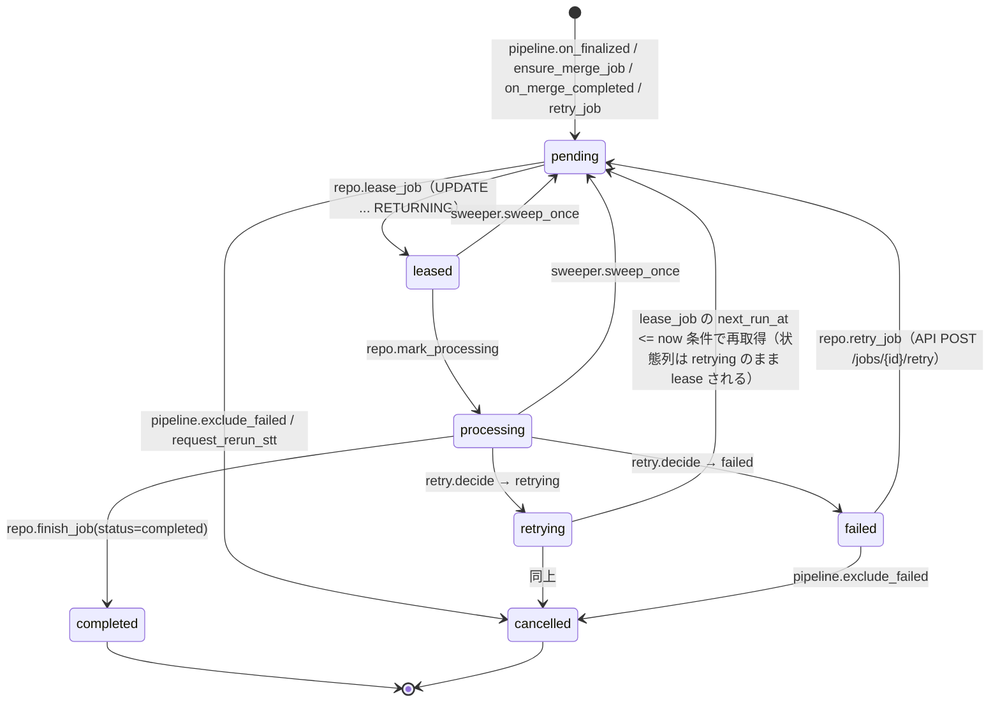

# 議事録Webアプリケーション Phase 2 詳細設計書 ── サーバー側（Python）

**対象:** 常駐サーバー `minutes-local`（FastAPI + SQLite + faster-whisper + Silero VAD + Ollama HTTP）の実装コードとテストコード。
**上位文書:** Phase 2 基本設計書（`design-local-phase2.md`）。本書は基本設計の §7〜§15 を実装粒度に展開する。基本設計の DDL（§8）・API 契約（§14）・状態遷移（§9）は変更せず再掲する。
**対となる文書:** Phase 2 詳細設計書 ── ブラウザ側（`design-local-phase2-client.md`）。
**設計方針:** Local-First / Zero External Call / Recording-First / Fault-Tolerant / At-Least-Once / Hardware-Aware Degradation。v4.0 の Recording is Source of Truth と Invariant 1〜10 を継承する。
**検証状態:** 本書の全 `python` コードブロック（54 ファイル）はパッケージとして抽出でき、Fake Provider による pytest 9 ファイル 34 テストが Python 3.12 + FastAPI + pydantic v2 で全件通過することを設計時点で確認している（§23）。実モデル（faster-whisper / Silero / Ollama）は設計時点では実行していない。

---

# 1. 目的と範囲

基本設計 §1 のゴール「finalize 済み会議が、外部への通信なしに、利用者のマシン上だけで確定 transcript と AI 議事録になる」を、サーバー側で実装着手可能な粒度に落とす。

| 範囲 | 内容 |
| --- | --- |
| 含む | `minutes_local` パッケージ全体：設定、DB 接続とマイグレーション、リポジトリ、ハードウェア検出、ファイル入出力、ジョブ実行基盤、STT / VAD / Merger / LLM の各パイプライン、API、CLI、テスト |
| 含む | Phase 1 §12 の API 契約の本実装（Phase 1 では最小スタブだった） |
| 含まない | ブラウザ側コード（対となる文書）、Phase 3（Live STT / 話者分離 / FLAC / LAN 共有） |
| 含まない | 実モデルの精度・速度の評価（基本設計 §6 の実測項目） |

## 1.1 本書が確定するもの

* Python モジュールごとの公開インターフェース（関数シグネチャ・pydantic モデル）
* SQLite への読み書きの経路（書き込みは 1 接続、ワーカーは DB を触らない）
* ジョブ実行のループ・lease・heartbeat・Sweeper の具体的なコード
* Provider 抽象と Fake Provider（テストの決定性を担保する）
* 7 段の要約検証のコード
* pytest による受入テスト

---

# 2. 依存ライブラリと `pyproject.toml`

```toml
# pyproject.toml
[project]
name = "minutes-local"
version = "0.2.0"
description = "議事録アプリ ローカル常駐サーバー（Phase 2）"
requires-python = ">=3.11"
dependencies = [
  "fastapi>=0.115",
  "uvicorn[standard]>=0.30",
  "httpx>=0.27",
  "pydantic>=2.7",
  "psutil>=5.9",
]

[project.optional-dependencies]
stt = ["faster-whisper>=1.0", "onnxruntime>=1.17"]
cuda = ["faster-whisper>=1.0", "onnxruntime-gpu>=1.17"]
dev = ["pytest>=8", "pytest-asyncio>=0.23", "anyio>=4"]

[project.scripts]
minutes-local = "minutes_local.__main__:main"

[tool.pytest.ini_options]
asyncio_mode = "auto"
testpaths = ["tests"]
```

| 依存 | 用途 | 外部通信 |
| --- | --- | --- |
| fastapi / uvicorn | API サーバー（`127.0.0.1` bind） | なし |
| httpx | Ollama（`127.0.0.1:11434`）とモデルダウンロード（§10.2、明示操作のみ） | **この 2 モジュールに限定** |
| pydantic v2 | リクエスト／レスポンス／LLM 出力の検証 | なし |
| psutil | メモリ・CPU 検出 | なし |
| faster-whisper | STT（extras。テストでは import しない） | なし（モデルは事前配置） |
| onnxruntime | Silero VAD（extras） | なし |

---

# 3. 断定してはいけない箇所と実測・監視で担保する箇所

基本設計 §6 に加え、実装固有の事項。

| 事項 | 断定しない理由 | 担保 |
| --- | --- | --- |
| `ProcessPoolExecutor` の spawn とモデルロードの所要時間 | OS・モデルサイズ・ディスク速度で数秒〜数十秒 | プールは起動時に生成しモデルは初回ジョブで遅延ロード。ロード時間を `usage_metrics(stt_model_load_ms)` に記録 |
| SQLite の `RETURNING` | 3.35.0 以降でのみ使える | 起動時に `sqlite3.sqlite_version_info >= (3, 35, 0)` を検査し、未満なら起動失敗（`doctor` が案内） |
| 同期 `sqlite3` を asyncio ループ内で呼ぶことによるブロッキング | 1 トランザクションは数 ms だが、`VACUUM INTO` 等は長い | 書き込みは短いトランザクションに限定。長い処理（バックアップ）は `asyncio.to_thread` |
| Ollama の `format` パラメータに JSON Schema を渡せる | Ollama のバージョンに依存（0.5 以降） | `GET /api/version` を起動時に記録。古い場合は `format: "json"` にフォールバックし、Schema Validation で吸収 |
| faster-whisper の `word_timestamps=True` が全モデルで動く | CTranslate2 のアラインメントヘッドに依存 | 例外時は `word_timestamps=False` で再試行（同一ジョブ内） |
| CUDA OOM が `RuntimeError` として捕捉できる | CTranslate2 / torch のバージョンで例外型が異なる | メッセージに `out of memory` / `CUDA` を含む例外を `OOMError` に正規化（§13） |

---

# 4. 設計原則（コードに反映する規則）

| 原則 | 実装上の規則 | 検査方法 |
| --- | --- | --- |
| SQLite 書き込みは 1 接続 | `Database.write()` のみが `BEGIN IMMEDIATE` を発行。`asyncio.Lock` で直列化 | `grep -r "BEGIN" minutes_local/` が `db/connection.py` のみ |
| ワーカーは DB を触らない | `stt/worker.py` は `minutes_local.db` を import しない。結果は dataclass で返す | import 検査テスト（§23.1） |
| Provider 抽象 + Fake | STT / VAD / LLM は `Protocol` で定義し、実 Provider と Fake Provider を差し替え可能にする | テストは Fake のみ使う |
| 外部通信は 2 モジュールのみ | `httpx` の import は `llm/ollama_provider.py` と `storage/models_dir.py` に限定 | import 検査テスト（§23.1） |
| 例外を握りつぶさない | ジョブハンドラの例外は `JobError` 階層に正規化して `processing_jobs.error_class` に記録。`except Exception: pass` を書かない | コードレビュー |
| 早期リターン | 判定の入れ子を避ける | — |

---

# 5. 設定 `config.py`

```python
# minutes_local/config.py
"""サーバー設定。既定値 → 環境変数 → settings テーブル の順で上書きする。"""
from __future__ import annotations

import os
import sys
from dataclasses import dataclass, field, replace
from pathlib import Path
from typing import Any


def default_data_dir() -> Path:
    """OS 別の利用者データディレクトリ（Phase 1 §13）。クラウド同期対象になりやすい場所は避ける。"""
    if sys.platform == "darwin":
        return Path.home() / "Library" / "Application Support" / "minutes-local"
    if sys.platform.startswith("win"):
        base = os.environ.get("LOCALAPPDATA")
        return Path(base) / "minutes-local" if base else Path.home() / "minutes-local"
    xdg = os.environ.get("XDG_DATA_HOME")
    return Path(xdg) / "minutes-local" if xdg else Path.home() / ".local" / "share" / "minutes-local"


@dataclass(frozen=True)
class Thresholds:
    """基本設計 §11〜§13 のしきい値。固定仕様ではなく設定値。"""
    vad_threshold: float = 0.5
    vad_min_speech_ms: int = 250
    vad_min_voiced_ms: int = 500
    overlap_ms: int = 3000
    merge_window_ms: int = 3500
    merge_time_overlap_ratio: float = 0.5
    merge_text_similarity: float = 0.8
    merge_containment_min_ratio: float = 0.3
    merge_containment_max_ratio: float = 0.95
    confidence_dim_below: float = 0.4
    stt_timeout_factor_gpu: int = 10
    stt_timeout_factor_cpu: int = 60
    llm_connect_timeout_s: float = 10.0
    llm_read_timeout_s: float = 600.0
    llm_ctx_fill_ratio: float = 0.6


@dataclass(frozen=True)
class Settings:
    data_dir: Path = field(default_factory=default_data_dir)
    bind_host: str = "127.0.0.1"
    port: int = 43117
    ollama_base_url: str = "http://127.0.0.1:11434"
    language: str = "ja"              # "ja" | "en" | "auto"
    stt_model: str | None = None      # None = ハードウェア検出の推奨
    llm_model: str | None = None
    max_concurrent_stt: int | None = None
    live_stt_enabled: bool = False    # Phase 3
    vad_sampling_ratio: float = 0.0   # §13.2 無音 Chunk のサンプリング STT（既定オフ）
    thresholds: Thresholds = field(default_factory=Thresholds)

    @property
    def db_path(self) -> Path:
        return self.data_dir / "minutes.sqlite"

    @property
    def recordings_dir(self) -> Path:
        return self.data_dir / "recordings"

    @property
    def models_dir(self) -> Path:
        return self.data_dir / "models"

    @property
    def token_path(self) -> Path:
        return self.data_dir / "token"

    def with_overrides(self, values: dict[str, Any]) -> "Settings":
        """settings テーブルの値で上書きする。未知キーは無視し、型が合わないものは捨てる。"""
        allowed = {
            "language": str, "stt_model": (str, type(None)), "llm_model": (str, type(None)),
            "max_concurrent_stt": (int, type(None)), "live_stt_enabled": bool,
            "vad_sampling_ratio": float, "ollama_base_url": str,
        }
        kwargs: dict[str, Any] = {}
        for key, expected in allowed.items():
            if key in values and isinstance(values[key], expected):
                kwargs[key] = values[key]
        return replace(self, **kwargs)


def settings_from_env(base: Settings | None = None) -> Settings:
    s = base or Settings()
    data_dir = os.environ.get("MINUTES_DATA_DIR")
    port = os.environ.get("MINUTES_PORT")
    kwargs: dict[str, Any] = {}
    if data_dir:
        kwargs["data_dir"] = Path(data_dir)
    if port and port.isdigit():
        kwargs["port"] = int(port)
    return replace(s, **kwargs)
```

---

# 6. DB 接続 `db/connection.py`

基本設計 §8.1 の PRAGMA を適用し、書き込みを 1 接続 + `asyncio.Lock` に直列化する。

```python
# minutes_local/db/connection.py
"""SQLite 接続。書き込みは write() のみ、読み取りは read() を使う。"""
from __future__ import annotations

import asyncio
import sqlite3
import time
from collections.abc import AsyncIterator, Iterator
from contextlib import asynccontextmanager, contextmanager
from pathlib import Path

MIN_SQLITE_VERSION = (3, 35, 0)  # RETURNING


class SqliteVersionError(RuntimeError):
    pass


def _apply_pragmas(conn: sqlite3.Connection) -> None:
    conn.execute("PRAGMA journal_mode = WAL")
    conn.execute("PRAGMA synchronous = NORMAL")
    conn.execute("PRAGMA foreign_keys = ON")
    conn.execute("PRAGMA busy_timeout = 5000")


def now_ms() -> int:
    return int(time.time() * 1000)


class Database:
    """プロセス内で 1 インスタンス。write() は asyncio.Lock で直列化される。"""

    def __init__(self, path: Path) -> None:
        if sqlite3.sqlite_version_info < MIN_SQLITE_VERSION:
            raise SqliteVersionError(f"SQLite {sqlite3.sqlite_version} < 3.35.0 (RETURNING required)")
        self.path = path
        path.parent.mkdir(parents=True, exist_ok=True)
        self._write_conn = sqlite3.connect(path, check_same_thread=False, isolation_level=None)
        self._write_conn.row_factory = sqlite3.Row
        _apply_pragmas(self._write_conn)
        self._read_conn = sqlite3.connect(path, check_same_thread=False, isolation_level=None)
        self._read_conn.row_factory = sqlite3.Row
        _apply_pragmas(self._read_conn)
        self._lock = asyncio.Lock()
        self.busy_count = 0  # SQLITE_BUSY の観測回数（基本設計 §6）

    def close(self) -> None:
        self._write_conn.close()
        self._read_conn.close()

    @contextmanager
    def read(self) -> Iterator[sqlite3.Connection]:
        """読み取り専用。トランザクションを張らない（WAL の読み取りスナップショット）。"""
        yield self._read_conn

    @asynccontextmanager
    async def write(self) -> AsyncIterator[sqlite3.Connection]:
        """BEGIN IMMEDIATE で書き込みロックを先に取る（基本設計 §12.1）。例外時は ROLLBACK。"""
        async with self._lock:
            conn = self._write_conn
            try:
                conn.execute("BEGIN IMMEDIATE")
            except sqlite3.OperationalError as e:
                if "locked" in str(e) or "busy" in str(e):
                    self.busy_count += 1
                raise
            try:
                yield conn
            except BaseException:
                conn.execute("ROLLBACK")
                raise
            else:
                conn.execute("COMMIT")

    def write_sync(self) -> "SyncWrite":
        """テストとマイグレーション用の同期版。asyncio ループ外でのみ使う。"""
        return SyncWrite(self._write_conn)


class SyncWrite:
    def __init__(self, conn: sqlite3.Connection) -> None:
        self._conn = conn

    def __enter__(self) -> sqlite3.Connection:
        self._conn.execute("BEGIN IMMEDIATE")
        return self._conn

    def __exit__(self, exc_type: object, exc: object, tb: object) -> None:
        if exc_type is None:
            self._conn.execute("COMMIT")
        else:
            self._conn.execute("ROLLBACK")
```

---

# 7. マイグレーション `db/migrate.py`

基本設計 §8 の DDL を番号付きの文字列定数として保持する。基本設計では `migrations/*.sql` としていたが、パッケージ配布時のファイル同梱を単純にするため Python 定数に変更する（**基本設計 §8.2 からの変更**。DDL の内容は同一）。

```python
# minutes_local/db/migrate.py
"""schema_version テーブルと番号付き DDL。基本設計 §8 の DDL をそのまま保持する。"""
from __future__ import annotations

import sqlite3

from .connection import Database, now_ms

MIGRATIONS: list[tuple[int, str]] = [
    (1, """
CREATE TABLE IF NOT EXISTS schema_version (
  version    INTEGER PRIMARY KEY,
  applied_at INTEGER NOT NULL
);
"""),
    (2, """
CREATE TABLE IF NOT EXISTS meetings (
  id                     TEXT PRIMARY KEY,
  local_user_id          TEXT NOT NULL DEFAULT 'local',
  title                  TEXT NOT NULL DEFAULT '無題の会議',
  status                 TEXT NOT NULL
                           CHECK (status IN ('created','recording','finalizing','finalized',
                                             'transcribing','transcribed',
                                             'summarizing','completed','failed')),
  session_start_epoch_ms INTEGER NOT NULL,
  native_sample_rate     INTEGER NOT NULL,
  consent_confirmed_at   INTEGER NOT NULL,
  ended_at               INTEGER,
  total_audio_frames     INTEGER,
  transcript_version     INTEGER NOT NULL DEFAULT 0,
  stt_model_used         TEXT,
  llm_model_used         TEXT,
  created_at             INTEGER NOT NULL,
  updated_at             INTEGER NOT NULL
);
CREATE INDEX IF NOT EXISTS idx_meetings_status ON meetings(status);
"""),
    (3, """
CREATE TABLE IF NOT EXISTS audio_chunks (
  id               TEXT PRIMARY KEY,
  meeting_id       TEXT NOT NULL REFERENCES meetings(id) ON DELETE CASCADE,
  source           TEXT NOT NULL CHECK (source IN ('mic','system')),
  sequence_no      INTEGER NOT NULL,
  start_offset_ms  INTEGER NOT NULL,
  end_offset_ms    INTEGER NOT NULL,
  duration_ms      INTEGER NOT NULL,
  sample_count     INTEGER NOT NULL,
  local_path       TEXT NOT NULL,
  size_bytes       INTEGER NOT NULL,
  sha256           TEXT NOT NULL,
  vad_score        REAL NOT NULL DEFAULT 0,
  has_voice        INTEGER NOT NULL DEFAULT 1,
  vad_source       TEXT NOT NULL DEFAULT 'browser_rms'
                     CHECK (vad_source IN ('browser_rms','server_silero')),
  server_vad_score REAL,
  save_status      TEXT NOT NULL DEFAULT 'registered'
                     CHECK (save_status IN ('registered','verified','missing')),
  stt_status       TEXT NOT NULL DEFAULT 'pending'
                     CHECK (stt_status IN ('pending','queued','processing','completed','skipped','failed')),
  created_at       INTEGER NOT NULL,
  UNIQUE (meeting_id, source, sequence_no)
);
CREATE INDEX IF NOT EXISTS idx_chunks_meeting_stt ON audio_chunks(meeting_id, stt_status);
"""),
    (4, """
CREATE TABLE IF NOT EXISTS processing_jobs (
  id            TEXT PRIMARY KEY,
  meeting_id    TEXT NOT NULL REFERENCES meetings(id) ON DELETE CASCADE,
  chunk_id      TEXT REFERENCES audio_chunks(id) ON DELETE CASCADE,
  job_type      TEXT NOT NULL
                  CHECK (job_type IN ('vad_chunk','transcribe_chunk','merge_transcript','synthesize_minutes')),
  status        TEXT NOT NULL DEFAULT 'pending'
                  CHECK (status IN ('pending','leased','processing','retrying','completed','failed','cancelled')),
  priority      INTEGER NOT NULL DEFAULT 100,
  attempts      INTEGER NOT NULL DEFAULT 0,
  max_attempts  INTEGER NOT NULL DEFAULT 5,
  lease_until   INTEGER,
  lease_owner   TEXT,
  next_run_at   INTEGER NOT NULL DEFAULT 0,
  model_name    TEXT,
  error_class   TEXT
                  CHECK (error_class IS NULL OR error_class IN
                    ('OOM','MODEL_MISSING','INVALID_AUDIO','PROVIDER_UNREACHABLE',
                     'SCHEMA_VALIDATION','BUSINESS_VALIDATION','TIMEOUT','INTERNAL')),
  last_error    TEXT,
  duration_ms   INTEGER,
  created_at    INTEGER NOT NULL,
  updated_at    INTEGER NOT NULL
);
CREATE UNIQUE INDEX IF NOT EXISTS uq_transcribe_job
  ON processing_jobs(meeting_id, chunk_id) WHERE job_type = 'transcribe_chunk';
CREATE UNIQUE INDEX IF NOT EXISTS uq_vad_job
  ON processing_jobs(meeting_id, chunk_id) WHERE job_type = 'vad_chunk';
CREATE UNIQUE INDEX IF NOT EXISTS uq_merge_job
  ON processing_jobs(meeting_id) WHERE job_type = 'merge_transcript';
CREATE UNIQUE INDEX IF NOT EXISTS uq_summary_job
  ON processing_jobs(meeting_id) WHERE job_type = 'synthesize_minutes';
CREATE INDEX IF NOT EXISTS idx_jobs_runnable
  ON processing_jobs(status, next_run_at, priority, created_at);
CREATE INDEX IF NOT EXISTS idx_jobs_lease ON processing_jobs(status, lease_until);
"""),
    (5, """
CREATE TABLE IF NOT EXISTS transcript_segments (
  id              TEXT PRIMARY KEY,
  meeting_id      TEXT NOT NULL REFERENCES meetings(id) ON DELETE CASCADE,
  chunk_id        TEXT NOT NULL REFERENCES audio_chunks(id) ON DELETE CASCADE,
  source          TEXT NOT NULL CHECK (source IN ('mic','system')),
  segment_index   INTEGER NOT NULL,
  start_ms        INTEGER NOT NULL,
  end_ms          INTEGER NOT NULL,
  text            TEXT NOT NULL,
  normalized_text TEXT,
  language        TEXT,
  confidence      REAL,
  no_speech_prob  REAL,
  merged_version  INTEGER,
  merge_reason    TEXT,
  speaker_id         TEXT,
  speaker_confidence REAL,
  created_at      INTEGER NOT NULL,
  UNIQUE (chunk_id, segment_index)
);
CREATE INDEX IF NOT EXISTS idx_segments_meeting_time ON transcript_segments(meeting_id, start_ms);
CREATE INDEX IF NOT EXISTS idx_segments_merged ON transcript_segments(meeting_id, merged_version);
"""),
    (6, """
CREATE TABLE IF NOT EXISTS meeting_summary_versions (
  id                    TEXT PRIMARY KEY,
  meeting_id            TEXT NOT NULL REFERENCES meetings(id) ON DELETE CASCADE,
  version               INTEGER NOT NULL,
  transcript_version    INTEGER NOT NULL,
  model_name            TEXT NOT NULL,
  prompt_version        TEXT NOT NULL,
  result_json           TEXT NOT NULL,
  raw_response_json     TEXT,
  validation_json       TEXT NOT NULL,
  generated_at          INTEGER NOT NULL,
  UNIQUE (meeting_id, version)
);
CREATE TABLE IF NOT EXISTS meeting_notes (
  meeting_id            TEXT PRIMARY KEY REFERENCES meetings(id) ON DELETE CASCADE,
  blocknote_json        TEXT NOT NULL,
  revision              INTEGER NOT NULL DEFAULT 0,
  last_applied_summary_version INTEGER,
  updated_at            INTEGER NOT NULL
);
"""),
    (7, """
CREATE TABLE IF NOT EXISTS settings (
  key        TEXT PRIMARY KEY,
  value_json TEXT NOT NULL,
  updated_at INTEGER NOT NULL
);
CREATE TABLE IF NOT EXISTS usage_metrics (
  id           INTEGER PRIMARY KEY AUTOINCREMENT,
  metric       TEXT NOT NULL,
  model_name   TEXT,
  meeting_id   TEXT,
  amount       REAL NOT NULL,
  recorded_at  INTEGER NOT NULL
);
CREATE INDEX IF NOT EXISTS idx_metrics_metric_time ON usage_metrics(metric, recorded_at);
"""),
]


def current_version(conn: sqlite3.Connection) -> int:
    row = conn.execute(
        "SELECT name FROM sqlite_master WHERE type='table' AND name='schema_version'"
    ).fetchone()
    if row is None:
        return 0
    v = conn.execute("SELECT MAX(version) AS v FROM schema_version").fetchone()
    return int(v["v"]) if v is not None and v["v"] is not None else 0


def migrate(db: Database) -> int:
    """未適用のマイグレーションを番号順に、それぞれ 1 トランザクションで適用する。"""
    applied = 0
    for version, ddl in MIGRATIONS:
        with db.write_sync() as conn:
            if current_version(conn) >= version:
                continue
            _exec_multi(conn, ddl)
            conn.execute("INSERT INTO schema_version(version, applied_at) VALUES (?, ?)", (version, now_ms()))
            applied += 1
    return applied


def _exec_multi(conn: sqlite3.Connection, ddl: str) -> None:
    """executescript は暗黙 COMMIT を発行するため、文単位で execute する。"""
    for stmt in ddl.split(";"):
        s = stmt.strip()
        if s:
            conn.execute(s)
```

`executescript` を使わない理由は、`sqlite3` モジュールの `executescript` が実行前に暗黙 `COMMIT` を発行し、`BEGIN IMMEDIATE` で開いたトランザクションを壊すためである。DDL は `;` で分割しても安全な文だけで構成している（トリガーや文字列内の `;` を含まない）。

---

# 8. リポジトリ `db/models.py` と `db/repo.py`

テーブルごとの pydantic モデルと、`sqlite3.Connection` を受け取る関数群。API 層とジョブ層はこの関数だけを通して SQL に触れる。

```python
# minutes_local/db/models.py
"""SQLite 行に対応する pydantic モデル。"""
from __future__ import annotations

from typing import Literal

from pydantic import BaseModel

Source = Literal["mic", "system"]
MeetingStatus = Literal[
    "created", "recording", "finalizing", "finalized",
    "transcribing", "transcribed", "summarizing", "completed", "failed",
]
SttStatus = Literal["pending", "queued", "processing", "completed", "skipped", "failed"]
JobType = Literal["vad_chunk", "transcribe_chunk", "merge_transcript", "synthesize_minutes"]
JobStatus = Literal["pending", "leased", "processing", "retrying", "completed", "failed", "cancelled"]
ErrorClass = Literal[
    "OOM", "MODEL_MISSING", "INVALID_AUDIO", "PROVIDER_UNREACHABLE",
    "SCHEMA_VALIDATION", "BUSINESS_VALIDATION", "TIMEOUT", "INTERNAL",
]

JOB_PRIORITY: dict[str, int] = {
    "vad_chunk": 50, "transcribe_chunk": 100, "merge_transcript": 200, "synthesize_minutes": 300,
}


class Meeting(BaseModel):
    id: str
    local_user_id: str = "local"
    title: str
    status: MeetingStatus
    session_start_epoch_ms: int
    native_sample_rate: int
    consent_confirmed_at: int
    ended_at: int | None = None
    total_audio_frames: int | None = None
    transcript_version: int = 0
    stt_model_used: str | None = None
    llm_model_used: str | None = None
    created_at: int
    updated_at: int


class AudioChunk(BaseModel):
    id: str
    meeting_id: str
    source: Source
    sequence_no: int
    start_offset_ms: int
    end_offset_ms: int
    duration_ms: int
    sample_count: int
    local_path: str
    size_bytes: int
    sha256: str
    vad_score: float = 0.0
    has_voice: bool = True
    vad_source: Literal["browser_rms", "server_silero"] = "browser_rms"
    server_vad_score: float | None = None
    save_status: Literal["registered", "verified", "missing"] = "registered"
    stt_status: SttStatus = "pending"
    created_at: int


class Job(BaseModel):
    id: str
    meeting_id: str
    chunk_id: str | None
    job_type: JobType
    status: JobStatus
    priority: int
    attempts: int
    max_attempts: int
    lease_until: int | None = None
    lease_owner: str | None = None
    next_run_at: int = 0
    model_name: str | None = None
    error_class: ErrorClass | None = None
    last_error: str | None = None
    duration_ms: int | None = None
    created_at: int
    updated_at: int


class Segment(BaseModel):
    id: str
    meeting_id: str
    chunk_id: str
    source: Source
    segment_index: int
    start_ms: int
    end_ms: int
    text: str
    normalized_text: str | None = None
    language: str | None = None
    confidence: float | None = None
    no_speech_prob: float | None = None
    merged_version: int | None = None
    merge_reason: str | None = None
    speaker_id: str | None = None
    speaker_confidence: float | None = None
    created_at: int


class SummaryVersion(BaseModel):
    id: str
    meeting_id: str
    version: int
    transcript_version: int
    model_name: str
    prompt_version: str
    result_json: str
    raw_response_json: str | None = None
    validation_json: str
    generated_at: int


class Notes(BaseModel):
    meeting_id: str
    blocknote_json: str
    revision: int
    last_applied_summary_version: int | None = None
    updated_at: int
```

```python
# minutes_local/db/repo.py
"""テーブルごとのクエリ関数。すべて conn を引数に取り、トランザクション管理は呼び出し側（Database.write/read）が行う。"""
from __future__ import annotations

import json
import sqlite3
import uuid
from typing import Any

from .connection import now_ms
from .models import (
    JOB_PRIORITY, AudioChunk, Job, JobStatus, JobType, Meeting, MeetingStatus, Notes, Segment, Source,
    SummaryVersion,
)


def new_id() -> str:
    return str(uuid.uuid4())


def _row(model: type, row: sqlite3.Row | None) -> Any:
    if row is None:
        return None
    d = dict(row)
    if "has_voice" in d:
        d["has_voice"] = bool(d["has_voice"])
    return model.model_validate(d)


# ---- meetings ----

def insert_meeting(conn: sqlite3.Connection, m: Meeting) -> bool:
    """既存なら False（冪等）。"""
    cur = conn.execute(
        """INSERT OR IGNORE INTO meetings
           (id, local_user_id, title, status, session_start_epoch_ms, native_sample_rate,
            consent_confirmed_at, ended_at, total_audio_frames, transcript_version,
            stt_model_used, llm_model_used, created_at, updated_at)
           VALUES (?,?,?,?,?,?,?,?,?,?,?,?,?,?)""",
        (m.id, m.local_user_id, m.title, m.status, m.session_start_epoch_ms, m.native_sample_rate,
         m.consent_confirmed_at, m.ended_at, m.total_audio_frames, m.transcript_version,
         m.stt_model_used, m.llm_model_used, m.created_at, m.updated_at),
    )
    return cur.rowcount == 1


def get_meeting(conn: sqlite3.Connection, meeting_id: str) -> Meeting | None:
    return _row(Meeting, conn.execute("SELECT * FROM meetings WHERE id = ?", (meeting_id,)).fetchone())


def list_meetings(conn: sqlite3.Connection) -> list[Meeting]:
    rows = conn.execute("SELECT * FROM meetings ORDER BY created_at DESC").fetchall()
    return [_row(Meeting, r) for r in rows]


def set_meeting_status(conn: sqlite3.Connection, meeting_id: str, status: MeetingStatus) -> None:
    conn.execute("UPDATE meetings SET status = ?, updated_at = ? WHERE id = ?", (status, now_ms(), meeting_id))


def update_meeting(conn: sqlite3.Connection, meeting_id: str, **fields: Any) -> None:
    if not fields:
        return
    cols = ", ".join(f"{k} = ?" for k in fields)
    conn.execute(f"UPDATE meetings SET {cols}, updated_at = ? WHERE id = ?", (*fields.values(), now_ms(), meeting_id))


def delete_meeting(conn: sqlite3.Connection, meeting_id: str) -> None:
    conn.execute("DELETE FROM meetings WHERE id = ?", (meeting_id,))


# ---- audio_chunks ----

def upsert_chunk(conn: sqlite3.Connection, c: AudioChunk) -> AudioChunk:
    """同一 (meeting, source, seq) が既にあればその行を返す（冪等 PUT、基本設計 §11）。"""
    existing = get_chunk_by_key(conn, c.meeting_id, c.source, c.sequence_no)
    if existing is not None:
        return existing
    conn.execute(
        """INSERT INTO audio_chunks
           (id, meeting_id, source, sequence_no, start_offset_ms, end_offset_ms, duration_ms, sample_count,
            local_path, size_bytes, sha256, vad_score, has_voice, vad_source, server_vad_score,
            save_status, stt_status, created_at)
           VALUES (?,?,?,?,?,?,?,?,?,?,?,?,?,?,?,?,?,?)""",
        (c.id, c.meeting_id, c.source, c.sequence_no, c.start_offset_ms, c.end_offset_ms, c.duration_ms,
         c.sample_count, c.local_path, c.size_bytes, c.sha256, c.vad_score, int(c.has_voice), c.vad_source,
         c.server_vad_score, c.save_status, c.stt_status, c.created_at),
    )
    return c


def get_chunk(conn: sqlite3.Connection, chunk_id: str) -> AudioChunk | None:
    return _row(AudioChunk, conn.execute("SELECT * FROM audio_chunks WHERE id = ?", (chunk_id,)).fetchone())


def get_chunk_by_key(conn: sqlite3.Connection, meeting_id: str, source: str, seq: int) -> AudioChunk | None:
    row = conn.execute(
        "SELECT * FROM audio_chunks WHERE meeting_id = ? AND source = ? AND sequence_no = ?",
        (meeting_id, source, seq),
    ).fetchone()
    return _row(AudioChunk, row)


def list_chunks(conn: sqlite3.Connection, meeting_id: str, source: Source | None = None) -> list[AudioChunk]:
    if source is None:
        rows = conn.execute(
            "SELECT * FROM audio_chunks WHERE meeting_id = ? ORDER BY source, sequence_no", (meeting_id,)
        ).fetchall()
    else:
        rows = conn.execute(
            "SELECT * FROM audio_chunks WHERE meeting_id = ? AND source = ? ORDER BY sequence_no",
            (meeting_id, source),
        ).fetchall()
    return [_row(AudioChunk, r) for r in rows]


def update_chunk(conn: sqlite3.Connection, chunk_id: str, **fields: Any) -> None:
    if not fields:
        return
    if "has_voice" in fields:
        fields["has_voice"] = int(bool(fields["has_voice"]))
    cols = ", ".join(f"{k} = ?" for k in fields)
    conn.execute(f"UPDATE audio_chunks SET {cols} WHERE id = ?", (*fields.values(), chunk_id))


def count_chunks_by_stt(conn: sqlite3.Connection, meeting_id: str) -> dict[str, int]:
    rows = conn.execute(
        "SELECT stt_status, COUNT(*) AS n FROM audio_chunks WHERE meeting_id = ? GROUP BY stt_status", (meeting_id,)
    ).fetchall()
    counts = {k: 0 for k in ("pending", "queued", "processing", "completed", "skipped", "failed")}
    for r in rows:
        counts[r["stt_status"]] = int(r["n"])
    return counts


# ---- processing_jobs ----

def insert_job(conn: sqlite3.Connection, meeting_id: str, job_type: JobType, chunk_id: str | None = None,
               model_name: str | None = None, max_attempts: int = 5) -> str | None:
    """部分一意インデックスにより既存なら None（冪等）。"""
    jid = new_id()
    t = now_ms()
    cur = conn.execute(
        """INSERT OR IGNORE INTO processing_jobs
           (id, meeting_id, chunk_id, job_type, status, priority, attempts, max_attempts, next_run_at,
            model_name, created_at, updated_at)
           VALUES (?,?,?,?,'pending',?,0,?,0,?,?,?)""",
        (jid, meeting_id, chunk_id, job_type, JOB_PRIORITY[job_type], max_attempts, model_name, t, t),
    )
    return jid if cur.rowcount == 1 else None


def get_job(conn: sqlite3.Connection, job_id: str) -> Job | None:
    return _row(Job, conn.execute("SELECT * FROM processing_jobs WHERE id = ?", (job_id,)).fetchone())


def list_jobs(conn: sqlite3.Connection, meeting_id: str) -> list[Job]:
    rows = conn.execute(
        "SELECT * FROM processing_jobs WHERE meeting_id = ? ORDER BY priority, created_at", (meeting_id,)
    ).fetchall()
    return [_row(Job, r) for r in rows]


def lease_job(conn: sqlite3.Connection, owner: str, allowed_types: list[str], now: int,
              lease_ms: int = 300_000) -> Job | None:
    """基本設計 §9.2。RETURNING で 1 件取得。0 件なら None。"""
    if not allowed_types:
        return None
    placeholders = ",".join("?" for _ in allowed_types)
    row = conn.execute(
        f"""UPDATE processing_jobs
            SET status = 'leased', lease_until = ?, lease_owner = ?, attempts = attempts + 1, updated_at = ?
            WHERE id = (
              SELECT id FROM processing_jobs
              WHERE status IN ('pending','retrying') AND next_run_at <= ? AND job_type IN ({placeholders})
              ORDER BY priority ASC, created_at ASC LIMIT 1
            )
            RETURNING *""",
        (now + lease_ms, owner, now, now, *allowed_types),
    ).fetchone()
    return _row(Job, row)


def heartbeat_job(conn: sqlite3.Connection, job_id: str, owner: str, now: int, lease_ms: int = 300_000) -> bool:
    cur = conn.execute(
        "UPDATE processing_jobs SET lease_until = ?, updated_at = ? WHERE id = ? AND lease_owner = ? AND status IN ('leased','processing')",
        (now + lease_ms, now, job_id, owner),
    )
    return cur.rowcount == 1


def mark_processing(conn: sqlite3.Connection, job_id: str, owner: str, model_name: str | None) -> bool:
    cur = conn.execute(
        "UPDATE processing_jobs SET status = 'processing', model_name = COALESCE(?, model_name), updated_at = ? WHERE id = ? AND lease_owner = ? AND status = 'leased'",
        (model_name, now_ms(), job_id, owner),
    )
    return cur.rowcount == 1


def finish_job(conn: sqlite3.Connection, job_id: str, owner: str, status: JobStatus, *,
               error_class: str | None = None, last_error: str | None = None,
               next_run_at: int | None = None, duration_ms: int | None = None) -> bool:
    """lease_owner が一致する場合だけ更新する（Sweeper で回収済みの旧ワーカー報告を無視、基本設計 §9.3）。"""
    cur = conn.execute(
        """UPDATE processing_jobs
           SET status = ?, error_class = ?, last_error = ?, next_run_at = COALESCE(?, next_run_at),
               duration_ms = COALESCE(?, duration_ms), lease_until = NULL, lease_owner = NULL, updated_at = ?
           WHERE id = ? AND lease_owner = ?""",
        (status, error_class, last_error, next_run_at, duration_ms, now_ms(), job_id, owner),
    )
    return cur.rowcount == 1


def sweep_expired(conn: sqlite3.Connection, now: int) -> int:
    cur = conn.execute(
        """UPDATE processing_jobs
           SET status = 'pending', lease_until = NULL, lease_owner = NULL, last_error = 'lease expired', updated_at = ?
           WHERE status IN ('leased','processing') AND lease_until IS NOT NULL AND lease_until < ?""",
        (now, now),
    )
    return cur.rowcount


def count_jobs(conn: sqlite3.Connection, meeting_id: str | None, job_type: str, statuses: list[str]) -> int:
    ph = ",".join("?" for _ in statuses)
    if meeting_id is None:
        row = conn.execute(
            f"SELECT COUNT(*) AS n FROM processing_jobs WHERE job_type = ? AND status IN ({ph})", (job_type, *statuses)
        ).fetchone()
    else:
        row = conn.execute(
            f"SELECT COUNT(*) AS n FROM processing_jobs WHERE meeting_id = ? AND job_type = ? AND status IN ({ph})",
            (meeting_id, job_type, *statuses),
        ).fetchone()
    return int(row["n"])


def retry_job(conn: sqlite3.Connection, job_id: str) -> bool:
    cur = conn.execute(
        "UPDATE processing_jobs SET status = 'pending', attempts = 0, error_class = NULL, last_error = NULL, next_run_at = 0, updated_at = ? WHERE id = ? AND status = 'failed'",
        (now_ms(), job_id),
    )
    return cur.rowcount == 1


def reset_job_for_rerun(conn: sqlite3.Connection, meeting_id: str, job_type: JobType) -> None:
    """merge / summary の再実行：同じ行を pending に戻す（基本設計 §8.5）。"""
    conn.execute(
        "UPDATE processing_jobs SET status = 'pending', attempts = 0, error_class = NULL, last_error = NULL, next_run_at = 0, updated_at = ? WHERE meeting_id = ? AND job_type = ?",
        (now_ms(), meeting_id, job_type),
    )


# ---- transcript_segments ----

def insert_segments(conn: sqlite3.Connection, segments: list[Segment]) -> int:
    """UNIQUE (chunk_id, segment_index) + INSERT OR IGNORE（Invariant 5）。"""
    n = 0
    for s in segments:
        cur = conn.execute(
            """INSERT OR IGNORE INTO transcript_segments
               (id, meeting_id, chunk_id, source, segment_index, start_ms, end_ms, text, normalized_text,
                language, confidence, no_speech_prob, merged_version, merge_reason, speaker_id, speaker_confidence, created_at)
               VALUES (?,?,?,?,?,?,?,?,?,?,?,?,?,?,?,?,?)""",
            (s.id, s.meeting_id, s.chunk_id, s.source, s.segment_index, s.start_ms, s.end_ms, s.text,
             s.normalized_text, s.language, s.confidence, s.no_speech_prob, s.merged_version, s.merge_reason,
             s.speaker_id, s.speaker_confidence, s.created_at),
        )
        n += cur.rowcount
    return n


def list_segments(conn: sqlite3.Connection, meeting_id: str, merged_version: int | None = None) -> list[Segment]:
    if merged_version is None:
        rows = conn.execute(
            "SELECT * FROM transcript_segments WHERE meeting_id = ? ORDER BY source, start_ms, segment_index", (meeting_id,)
        ).fetchall()
    else:
        rows = conn.execute(
            "SELECT * FROM transcript_segments WHERE meeting_id = ? AND merged_version = ? ORDER BY start_ms, source",
            (meeting_id, merged_version),
        ).fetchall()
    return [_row(Segment, r) for r in rows]


def delete_segments_of_chunk(conn: sqlite3.Connection, chunk_id: str) -> None:
    conn.execute("DELETE FROM transcript_segments WHERE chunk_id = ?", (chunk_id,))


def set_merge_result(conn: sqlite3.Connection, segment_id: str, merged_version: int | None, reason: str) -> None:
    conn.execute(
        "UPDATE transcript_segments SET merged_version = ?, merge_reason = ? WHERE id = ?",
        (merged_version, reason, segment_id),
    )


# ---- summaries / notes ----

def insert_summary(conn: sqlite3.Connection, s: SummaryVersion) -> None:
    conn.execute(
        """INSERT INTO meeting_summary_versions
           (id, meeting_id, version, transcript_version, model_name, prompt_version, result_json,
            raw_response_json, validation_json, generated_at) VALUES (?,?,?,?,?,?,?,?,?,?)""",
        (s.id, s.meeting_id, s.version, s.transcript_version, s.model_name, s.prompt_version, s.result_json,
         s.raw_response_json, s.validation_json, s.generated_at),
    )


def latest_summary(conn: sqlite3.Connection, meeting_id: str, version: int | None = None) -> SummaryVersion | None:
    if version is None:
        row = conn.execute(
            "SELECT * FROM meeting_summary_versions WHERE meeting_id = ? ORDER BY version DESC LIMIT 1", (meeting_id,)
        ).fetchone()
    else:
        row = conn.execute(
            "SELECT * FROM meeting_summary_versions WHERE meeting_id = ? AND version = ?", (meeting_id, version)
        ).fetchone()
    return _row(SummaryVersion, row)


def next_summary_version(conn: sqlite3.Connection, meeting_id: str) -> int:
    row = conn.execute(
        "SELECT COALESCE(MAX(version), 0) AS v FROM meeting_summary_versions WHERE meeting_id = ?", (meeting_id,)
    ).fetchone()
    return int(row["v"]) + 1


def get_notes(conn: sqlite3.Connection, meeting_id: str) -> Notes | None:
    return _row(Notes, conn.execute("SELECT * FROM meeting_notes WHERE meeting_id = ?", (meeting_id,)).fetchone())


def put_notes(conn: sqlite3.Connection, meeting_id: str, blocknote_json: str, expected_revision: int | None,
              last_applied_summary_version: int | None) -> Notes | None:
    """楽観ロック。expected_revision が現在値と一致しなければ None（呼び出し側が 409）。"""
    current = get_notes(conn, meeting_id)
    t = now_ms()
    if current is None:
        if expected_revision not in (None, 0):
            return None
        conn.execute(
            "INSERT INTO meeting_notes (meeting_id, blocknote_json, revision, last_applied_summary_version, updated_at) VALUES (?,?,1,?,?)",
            (meeting_id, blocknote_json, last_applied_summary_version, t),
        )
        return get_notes(conn, meeting_id)
    if expected_revision is not None and expected_revision != current.revision:
        return None
    conn.execute(
        "UPDATE meeting_notes SET blocknote_json = ?, revision = revision + 1, last_applied_summary_version = COALESCE(?, last_applied_summary_version), updated_at = ? WHERE meeting_id = ?",
        (blocknote_json, last_applied_summary_version, t, meeting_id),
    )
    return get_notes(conn, meeting_id)


# ---- settings / metrics ----

def get_settings(conn: sqlite3.Connection) -> dict[str, Any]:
    rows = conn.execute("SELECT key, value_json FROM settings").fetchall()
    return {r["key"]: json.loads(r["value_json"]) for r in rows}


def put_setting(conn: sqlite3.Connection, key: str, value: Any) -> None:
    conn.execute(
        "INSERT INTO settings (key, value_json, updated_at) VALUES (?,?,?) ON CONFLICT(key) DO UPDATE SET value_json = excluded.value_json, updated_at = excluded.updated_at",
        (key, json.dumps(value), now_ms()),
    )


def record_metric(conn: sqlite3.Connection, metric: str, amount: float, *, model_name: str | None = None,
                  meeting_id: str | None = None) -> None:
    conn.execute(
        "INSERT INTO usage_metrics (metric, model_name, meeting_id, amount, recorded_at) VALUES (?,?,?,?,?)",
        (metric, model_name, meeting_id, amount, now_ms()),
    )
```

---

# 9. ハードウェア検出 `hw/detect.py` と区分 `hw/tiers.py`

基本設計 §7.1〜§7.2 の実装。検出は失敗しても例外を上げず、保守的な区分（`cpu_only`）に落ちる。

```python
# minutes_local/hw/detect.py
"""起動時のハードウェア検出。すべての検出は失敗時にフォールバック値を返す。"""
from __future__ import annotations

import os
import platform
import shutil
import subprocess
import sys
from dataclasses import dataclass
from pathlib import Path


@dataclass(frozen=True)
class GpuInfo:
    available: bool
    name: str | None
    vram_bytes: int | None
    backend: str | None  # "cuda" | "apple" | None


@dataclass(frozen=True)
class Hardware:
    gpu: GpuInfo
    cpu_cores: int
    total_memory_bytes: int
    free_disk_bytes: int


def _detect_cuda() -> GpuInfo | None:
    try:
        import ctranslate2  # type: ignore[import-not-found]
        if ctranslate2.get_cuda_device_count() <= 0:
            return None
    except Exception:
        return None
    name: str | None = None
    vram: int | None = None
    smi = shutil.which("nvidia-smi")
    if smi is not None:
        try:
            out = subprocess.run(
                [smi, "--query-gpu=name,memory.total", "--format=csv,noheader,nounits"],
                capture_output=True, text=True, timeout=5, check=False,
            ).stdout.strip().splitlines()
            if out:
                n, mem = out[0].split(",")
                name = n.strip()
                vram = int(float(mem.strip())) * 1024 * 1024
        except (subprocess.SubprocessError, ValueError, OSError):
            pass
    return GpuInfo(available=True, name=name, vram_bytes=vram, backend="cuda")


def _detect_apple(total_memory: int) -> GpuInfo | None:
    if sys.platform != "darwin" or platform.machine() != "arm64":
        return None
    # 統合メモリ：物理メモリの 50% を暫定 VRAM 相当とする（基本設計 §7.1）
    return GpuInfo(available=True, name="apple-silicon", vram_bytes=total_memory // 2, backend="apple")


def _total_memory() -> int:
    try:
        import psutil
        return int(psutil.virtual_memory().total)
    except Exception:
        return 0


def detect(data_dir: Path) -> Hardware:
    total_mem = _total_memory()
    gpu = _detect_cuda() or _detect_apple(total_mem) or GpuInfo(False, None, None, None)
    try:
        cores = os.cpu_count() or 1
    except Exception:
        cores = 1
    try:
        data_dir.mkdir(parents=True, exist_ok=True)
        free = shutil.disk_usage(data_dir).free
    except OSError:
        free = 0
    return Hardware(gpu=gpu, cpu_cores=cores, total_memory_bytes=total_mem, free_disk_bytes=free)
```

```python
# minutes_local/hw/tiers.py
"""基本設計 §7.2 の区分表とモデル選定規則。数値は候補を絞る閾値であり精度の保証ではない。"""
from __future__ import annotations

from dataclasses import dataclass
from typing import Literal

from .detect import Hardware

Tier = Literal["gpu_large", "gpu_medium", "gpu_small", "cpu_only"]
GIB = 1024 ** 3


@dataclass(frozen=True)
class SttCandidate:
    name: str
    compute_type: str
    estimated_memory_bytes: int


@dataclass(frozen=True)
class LlmCandidate:
    pattern: str            # Ollama モデル名に含まれる文字列（"13b" / "8b" / "7b" / "3b"）
    estimated_memory_bytes: int


# 優先順。installed かつ予算内の最初のものを採用する。
STT_CANDIDATES: dict[Tier, tuple[SttCandidate, ...]] = {
    "gpu_large": (
        SttCandidate("large-v3", "float16", 3 * GIB),
        SttCandidate("medium", "float16", int(1.5 * GIB)),
        SttCandidate("small", "float16", int(0.6 * GIB)),
    ),
    "gpu_medium": (
        SttCandidate("medium", "int8_float16", 1 * GIB),
        SttCandidate("small", "int8_float16", int(0.5 * GIB)),
        SttCandidate("base", "int8_float16", int(0.3 * GIB)),
    ),
    "gpu_small": (
        SttCandidate("small", "int8", int(0.5 * GIB)),
        SttCandidate("base", "int8", int(0.3 * GIB)),
        SttCandidate("tiny", "int8", int(0.15 * GIB)),
    ),
    "cpu_only": (
        SttCandidate("base", "int8", int(0.3 * GIB)),
        SttCandidate("tiny", "int8", int(0.15 * GIB)),
    ),
}

LLM_CANDIDATES: dict[Tier, tuple[LlmCandidate, ...]] = {
    "gpu_large": (LlmCandidate("13b", 8 * GIB), LlmCandidate("8b", 5 * GIB)),
    "gpu_medium": (LlmCandidate("8b", 5 * GIB), LlmCandidate("7b", int(4.5 * GIB))),
    "gpu_small": (LlmCandidate("7b", int(4.5 * GIB)), LlmCandidate("3b", 2 * GIB)),
    "cpu_only": (LlmCandidate("3b", 2 * GIB), LlmCandidate("1.5b", int(1.2 * GIB))),
}

# 同一区分内でのダウングレード順（§13）。
STT_DOWNGRADE_ORDER: tuple[str, ...] = ("large-v3", "medium", "small", "base", "tiny")


def classify(hw: Hardware) -> Tier:
    if not hw.gpu.available:
        return "cpu_only"
    if hw.gpu.backend == "apple":
        mem = hw.total_memory_bytes
        if mem >= 32 * GIB:
            return "gpu_large"
        if mem >= 16 * GIB:
            return "gpu_medium"
        return "gpu_small"
    vram = hw.gpu.vram_bytes or 0
    if vram >= 12 * GIB:
        return "gpu_large"
    if vram >= 6 * GIB:
        return "gpu_medium"
    return "gpu_small"


def max_concurrent_stt(tier: Tier, cpu_cores: int) -> int:
    if tier == "gpu_large":
        return 2
    if tier == "cpu_only" and cpu_cores >= 8:
        return 2
    return 1


def select_stt(tier: Tier, installed: set[str], budget_bytes: int | None, forced: str | None) -> SttCandidate | None:
    """installed かつ予算内の最初の候補。forced は予算を無視して採用（警告は呼び出し側）。"""
    candidates = STT_CANDIDATES[tier]
    if forced is not None:
        for c in candidates:
            if c.name == forced and forced in installed:
                return c
        # 区分外のモデルが強制指定された場合も候補として返す
        if forced in installed:
            return SttCandidate(forced, candidates[-1].compute_type, 0)
        return None
    for c in candidates:
        if c.name not in installed:
            continue
        if budget_bytes is not None and c.estimated_memory_bytes > budget_bytes:
            continue
        return c
    return None


def select_llm(tier: Tier, available: list[str], forced: str | None) -> str | None:
    if forced is not None:
        return forced if forced in available else None
    for cand in LLM_CANDIDATES[tier]:
        for name in available:
            if cand.pattern in name.lower():
                return name
    return available[0] if available else None


def downgrade_stt(current: str) -> str | None:
    """1 段小さいモデル名。これ以上落とせなければ None。"""
    if current not in STT_DOWNGRADE_ORDER:
        return None
    i = STT_DOWNGRADE_ORDER.index(current)
    return STT_DOWNGRADE_ORDER[i + 1] if i + 1 < len(STT_DOWNGRADE_ORDER) else None


def allow_concurrent_stt_and_llm(tier: Tier, hw: Hardware, stt: SttCandidate | None, llm_bytes: int | None) -> bool:
    """基本設計 §5.2 の VRAM 予算判定。"""
    if tier == "cpu_only":
        return True
    if tier == "gpu_small":
        return False
    vram = hw.gpu.vram_bytes or 0
    used = stt.estimated_memory_bytes if stt is not None else 0
    need = llm_bytes if llm_bytes is not None else 5 * GIB
    return vram - used >= need
```

---

# 10. ファイル入出力 `storage/files.py` と `storage/models_dir.py`

## 10.1 録音ファイル

Phase 1 §12.1 の原子的書き込みと、Phase 1 §16 の WAV ヘッダ検証の Python 版。

```python
# minutes_local/storage/files.py
"""録音ファイルの原子的書き込み、sha256、WAV ヘッダ検証。"""
from __future__ import annotations

import hashlib
import os
import struct
from dataclasses import dataclass
from pathlib import Path

WAV_HEADER_BYTES = 44
WAV_SAMPLE_RATE = 16000
WAV_CHANNELS = 1
WAV_BITS = 16


class InvalidWavError(ValueError):
    pass


@dataclass(frozen=True)
class WavHeader:
    data_bytes: int
    sample_count: int


def sha256_hex(data: bytes) -> str:
    return hashlib.sha256(data).hexdigest()


def sha256_file(path: Path) -> str:
    h = hashlib.sha256()
    with path.open("rb") as f:
        for block in iter(lambda: f.read(1024 * 1024), b""):
            h.update(block)
    return h.hexdigest()


def parse_wav_header(data: bytes) -> WavHeader:
    """PCM16 / mono / 16kHz 固定仕様に準拠していなければ InvalidWavError。"""
    if len(data) < WAV_HEADER_BYTES:
        raise InvalidWavError(f"too short: {len(data)} bytes")
    if data[0:4] != b"RIFF" or data[8:12] != b"WAVE" or data[12:16] != b"fmt " or data[36:40] != b"data":
        raise InvalidWavError("missing RIFF/WAVE/fmt/data markers")
    riff_size, = struct.unpack_from("<I", data, 4)
    fmt_size, audio_format, channels, sample_rate, byte_rate, block_align, bits = struct.unpack_from("<IHHIIHH", data, 16)
    data_bytes, = struct.unpack_from("<I", data, 40)
    if fmt_size != 16 or audio_format != 1:
        raise InvalidWavError(f"not PCM (fmt_size={fmt_size}, format={audio_format})")
    if channels != WAV_CHANNELS or sample_rate != WAV_SAMPLE_RATE or bits != WAV_BITS:
        raise InvalidWavError(f"unexpected format ch={channels} sr={sample_rate} bits={bits}")
    if block_align != 2 or byte_rate != 32000:
        raise InvalidWavError("blockAlign/byteRate mismatch")
    if riff_size != 36 + data_bytes:
        raise InvalidWavError("riff size mismatch")
    if WAV_HEADER_BYTES + data_bytes != len(data):
        raise InvalidWavError(f"data size {data_bytes} != actual {len(data) - WAV_HEADER_BYTES}")
    return WavHeader(data_bytes=data_bytes, sample_count=data_bytes // 2)


def build_wav(pcm: bytes) -> bytes:
    """テストと FLAC 復元用。PCM16 LE バイト列に 44 バイトヘッダを付ける。"""
    data_bytes = len(pcm)
    header = b"RIFF" + struct.pack("<I", 36 + data_bytes) + b"WAVE" + b"fmt " + struct.pack(
        "<IHHIIHH", 16, 1, WAV_CHANNELS, WAV_SAMPLE_RATE, 32000, 2, WAV_BITS
    ) + b"data" + struct.pack("<I", data_bytes)
    return header + pcm


def chunk_relative_path(meeting_id: str, source: str, sequence_no: int) -> str:
    return f"recordings/{meeting_id}/{source}/{sequence_no:06d}.wav"


def write_atomic(data_dir: Path, relative_path: str, data: bytes) -> Path:
    """{path}.part に書き、fsync 後に rename する（Phase 1 §12.1）。"""
    final = data_dir / relative_path
    final.parent.mkdir(parents=True, exist_ok=True)
    part = final.with_suffix(final.suffix + ".part")
    with part.open("wb") as f:
        f.write(data)
        f.flush()
        os.fsync(f.fileno())
    os.replace(part, final)
    return final


def read_pcm(data_dir: Path, relative_path: str, expected_sha256: str | None = None) -> bytes:
    """WAV を読み、ヘッダ検証と sha256 照合を行い、PCM 本体を返す。"""
    path = data_dir / relative_path
    if not path.exists():
        raise InvalidWavError(f"file missing: {relative_path}")
    data = path.read_bytes()
    if expected_sha256 is not None and sha256_hex(data) != expected_sha256:
        raise InvalidWavError(f"sha256 mismatch: {relative_path}")
    parse_wav_header(data)
    return data[WAV_HEADER_BYTES:]
```

## 10.2 モデル配置と明示ダウンロード

基本設計 §7.4。`httpx` を使う 2 モジュールのうちの 1 つ。allowlist 外のホストには接続しない。

```python
# minutes_local/storage/models_dir.py
"""モデルファイルの配置確認と、明示操作によるダウンロード（Zero External Call の唯一の例外）。"""
from __future__ import annotations

from collections.abc import Callable
from pathlib import Path
from urllib.parse import urlparse

import httpx

WHISPER_MODELS = ("tiny", "base", "small", "medium", "large-v3")
# faster-whisper の CTranslate2 モデル配布元。実装時に配布元 CDN の変更を確認する（基本設計 §28）。
DOWNLOAD_ALLOWLIST: frozenset[str] = frozenset({"huggingface.co", "cdn-lfs.huggingface.co", "cdn-lfs-us-1.huggingface.co"})


class DisallowedHostError(RuntimeError):
    pass


def whisper_model_dir(models_dir: Path, name: str) -> Path:
    return models_dir / "whisper" / name


def installed_whisper_models(models_dir: Path) -> set[str]:
    """model.bin が存在するモデルを配置済みとみなす。"""
    found: set[str] = set()
    for name in WHISPER_MODELS:
        if (whisper_model_dir(models_dir, name) / "model.bin").exists():
            found.add(name)
    return found


def silero_model_path(models_dir: Path) -> Path | None:
    p = models_dir / "vad" / "silero_vad.onnx"
    return p if p.exists() else None


def assert_allowed_host(url: str) -> None:
    host = urlparse(url).hostname or ""
    if host not in DOWNLOAD_ALLOWLIST:
        raise DisallowedHostError(f"download host not allowed: {host}")


def download_file(url: str, dest: Path, *, client: httpx.Client | None = None,
                  progress: Callable[[int, int | None], None] | None = None) -> Path:
    """allowlist 検査 → .part にストリーム書き込み → rename。会議データは一切送らない。"""
    assert_allowed_host(url)
    dest.parent.mkdir(parents=True, exist_ok=True)
    part = dest.with_suffix(dest.suffix + ".part")
    own_client = client is None
    c = client or httpx.Client(follow_redirects=True, timeout=60.0)
    try:
        with c.stream("GET", url) as r:
            r.raise_for_status()
            # リダイレクト先も allowlist に含まれることを確認する
            assert_allowed_host(str(r.url))
            total = int(r.headers.get("content-length", "0")) or None
            done = 0
            with part.open("wb") as f:
                for block in r.iter_bytes(1024 * 1024):
                    f.write(block)
                    done += len(block)
                    if progress is not None:
                        progress(done, total)
        part.replace(dest)
        return dest
    finally:
        if own_client:
            c.close()
```

---

# 11. 例外階層と Retry `jobs/retry.py`

基本設計 §9.4 の表をコードにする。ハンドラは `JobError` の派生を送出し、Runner がそれを `processing_jobs.error_class` に記録して次の状態を決める。

```python
# minutes_local/jobs/retry.py
"""JobError 階層、retryable 判定、backoff。基本設計 §9.4。"""
from __future__ import annotations

import random
from dataclasses import dataclass

from ..db.models import ErrorClass


class JobError(Exception):
    error_class: ErrorClass = "INTERNAL"
    retryable: bool = True
    counts_attempt: bool = True   # False = attempts を消費しない（無期限 retry）

    def __init__(self, message: str) -> None:
        super().__init__(message)
        self.message = message


class OOMError(JobError):
    error_class = "OOM"


class ModelMissingError(JobError):
    error_class = "MODEL_MISSING"
    counts_attempt = False


class InvalidAudioError(JobError):
    error_class = "INVALID_AUDIO"
    retryable = False


class ProviderUnreachableError(JobError):
    error_class = "PROVIDER_UNREACHABLE"
    counts_attempt = False


class SchemaValidationError(JobError):
    error_class = "SCHEMA_VALIDATION"


class BusinessValidationError(JobError):
    error_class = "BUSINESS_VALIDATION"
    retryable = False


class JobTimeoutError(JobError):
    error_class = "TIMEOUT"


BASE_DELAYS_MS: tuple[int, ...] = (2_000, 5_000, 10_000, 30_000, 60_000, 120_000, 300_000, 600_000)
INDEFINITE_RETRY_DELAY_MS = 5 * 60_000
SCHEMA_VALIDATION_MAX_ATTEMPTS = 2  # 基本設計 §9.4：1 回だけ再生成


def backoff_ms(attempts: int, rng: random.Random | None = None) -> int:
    """attempts 回目の失敗後の待ち時間（±20% ジッター）。Phase 1 §9.3 と同系列。"""
    r = rng or random.Random()
    idx = min(max(attempts - 1, 0), len(BASE_DELAYS_MS) - 1)
    base = BASE_DELAYS_MS[idx]
    return int(base + (r.random() * 2 - 1) * 0.2 * base)


def normalize_exception(exc: BaseException) -> JobError:
    """任意の例外を JobError に正規化する。CUDA OOM はメッセージで判定（§3）。"""
    if isinstance(exc, JobError):
        return exc
    msg = str(exc)
    lowered = msg.lower()
    if "out of memory" in lowered or "cuda error" in lowered or "cublas" in lowered:
        return OOMError(msg)
    if isinstance(exc, TimeoutError):
        return JobTimeoutError(msg or "timeout")
    return JobError(f"{type(exc).__name__}: {msg}")


@dataclass(frozen=True)
class RetryDecision:
    next_status: str          # "retrying" | "failed"
    next_run_at: int | None
    consume_attempt: bool


def decide(err: JobError, attempts: int, max_attempts: int, now: int, rng: random.Random | None = None) -> RetryDecision:
    if not err.retryable:
        return RetryDecision("failed", None, True)
    if not err.counts_attempt:
        return RetryDecision("retrying", now + INDEFINITE_RETRY_DELAY_MS, False)
    limit = SCHEMA_VALIDATION_MAX_ATTEMPTS if err.error_class == "SCHEMA_VALIDATION" else max_attempts
    if attempts >= limit:
        return RetryDecision("failed", None, True)
    return RetryDecision("retrying", now + backoff_ms(attempts, rng), True)
```

---

# 12. ジョブ生成規則 `jobs/pipeline.py`

基本設計 §9.5 の依存関係。すべての関数は `Database.write()` で開かれたトランザクション内で呼ばれる前提（`conn` を受け取る）。

```python
# minutes_local/jobs/pipeline.py
"""finalize → vad → transcribe → merge → summary のジョブ生成規則。基本設計 §9.5 / §12.1。"""
from __future__ import annotations

import sqlite3

from ..db import repo
from ..db.models import AudioChunk, Job

BLOCKING_STT = ("pending", "queued", "processing")


def on_finalized(conn: sqlite3.Connection, meeting_id: str) -> int:
    """全 Chunk に vad_chunk を生成し、meeting を transcribing にする。戻り値は新規ジョブ数。"""
    created = 0
    for chunk in repo.list_chunks(conn, meeting_id):
        if repo.insert_job(conn, meeting_id, "vad_chunk", chunk_id=chunk.id) is not None:
            created += 1
    repo.set_meeting_status(conn, meeting_id, "transcribing")
    return created


def on_vad_completed(conn: sqlite3.Connection, chunk: AudioChunk, has_voice: bool, model_name: str | None) -> None:
    """has_voice なら transcribe_chunk を生成、そうでなければ skipped。"""
    if has_voice:
        repo.update_chunk(conn, chunk.id, stt_status="queued")
        repo.insert_job(conn, chunk.meeting_id, "transcribe_chunk", chunk_id=chunk.id, model_name=model_name)
    else:
        repo.update_chunk(conn, chunk.id, stt_status="skipped")
    ensure_merge_job(conn, chunk.meeting_id)


def on_transcribe_completed(conn: sqlite3.Connection, chunk: AudioChunk) -> None:
    repo.update_chunk(conn, chunk.id, stt_status="completed")
    ensure_merge_job(conn, chunk.meeting_id)


def on_transcribe_failed(conn: sqlite3.Connection, chunk: AudioChunk) -> None:
    """failed は merge をブロックする。利用者が retry か exclude_failed を選ぶまで待つ（v4.0 §97〜§98）。"""
    repo.update_chunk(conn, chunk.id, stt_status="failed")


def ensure_merge_job(conn: sqlite3.Connection, meeting_id: str) -> bool:
    """全 Chunk が終端（completed / skipped / 除外承認済み failed）かつ vad が残っていなければ merge を生成。"""
    counts = repo.count_chunks_by_stt(conn, meeting_id)
    if any(counts[s] > 0 for s in BLOCKING_STT):
        return False
    if repo.count_jobs(conn, meeting_id, "vad_chunk", ["pending", "leased", "processing", "retrying"]) > 0:
        return False
    # 未承認の failed transcribe ジョブがあれば待つ
    if repo.count_jobs(conn, meeting_id, "transcribe_chunk", ["failed"]) > 0:
        return False
    return repo.insert_job(conn, meeting_id, "merge_transcript") is not None


def exclude_failed(conn: sqlite3.Connection, meeting_id: str) -> int:
    """failed の transcribe ジョブを cancelled にし、merge を進める。戻り値は除外数。"""
    rows = conn.execute(
        "SELECT id FROM processing_jobs WHERE meeting_id = ? AND job_type = 'transcribe_chunk' AND status = 'failed'",
        (meeting_id,),
    ).fetchall()
    for r in rows:
        conn.execute("UPDATE processing_jobs SET status = 'cancelled' WHERE id = ?", (r["id"],))
    ensure_merge_job(conn, meeting_id)
    return len(rows)


def on_merge_completed(conn: sqlite3.Connection, meeting_id: str) -> None:
    """基本設計 §12.1：transcribed にし、summary ジョブを生成（INSERT OR IGNORE）。"""
    repo.set_meeting_status(conn, meeting_id, "transcribed")
    repo.insert_job(conn, meeting_id, "synthesize_minutes")


def on_summary_started(conn: sqlite3.Connection, meeting_id: str) -> None:
    repo.set_meeting_status(conn, meeting_id, "summarizing")


def on_summary_completed(conn: sqlite3.Connection, meeting_id: str) -> None:
    repo.set_meeting_status(conn, meeting_id, "completed")


def on_summary_deferred(conn: sqlite3.Connection, meeting_id: str) -> None:
    """要約が retrying に戻った：transcribed に戻し、transcript の閲覧を妨げない。"""
    repo.set_meeting_status(conn, meeting_id, "transcribed")


def on_summary_failed(conn: sqlite3.Connection, meeting_id: str) -> None:
    """transcript は残る（Invariant 2）。meeting は failed だが transcribed 版の閲覧は可能。"""
    repo.set_meeting_status(conn, meeting_id, "failed")


def request_regenerate_summary(conn: sqlite3.Connection, meeting_id: str) -> None:
    repo.reset_job_for_rerun(conn, meeting_id, "synthesize_minutes")
    repo.insert_job(conn, meeting_id, "synthesize_minutes")


def request_rerun_stt(conn: sqlite3.Connection, meeting_id: str, stt_model: str | None) -> int:
    """STT 再実行：segments を消し、chunk を pending に戻し、vad からやり直す（基本設計 §10.5）。"""
    conn.execute(
        "UPDATE processing_jobs SET status = 'cancelled' WHERE meeting_id = ? AND status IN ('pending','retrying','failed','leased','processing')",
        (meeting_id,),
    )
    conn.execute("DELETE FROM processing_jobs WHERE meeting_id = ?", (meeting_id,))
    n = 0
    for chunk in repo.list_chunks(conn, meeting_id):
        repo.delete_segments_of_chunk(conn, chunk.id)
        repo.update_chunk(conn, chunk.id, stt_status="pending")
        n += 1
    repo.update_meeting(conn, meeting_id, stt_model_used=stt_model, status="transcribing")
    return on_finalized(conn, meeting_id)


def job_of_chunk(conn: sqlite3.Connection, job: Job) -> AudioChunk:
    if job.chunk_id is None:
        raise ValueError(f"job {job.id} has no chunk")
    chunk = repo.get_chunk(conn, job.chunk_id)
    if chunk is None:
        raise ValueError(f"chunk {job.chunk_id} not found")
    return chunk
```

---

# 13. 実行コンテキストと Runner `jobs/context.py` / `jobs/runner.py`

## 13.1 実行コンテキスト

ハンドラが必要とする依存をまとめる。テストでは Fake Provider を注入する。

```python
# minutes_local/jobs/context.py
"""ジョブハンドラと API が共有する依存。"""
from __future__ import annotations

from dataclasses import dataclass, field

from ..config import Settings
from ..db.connection import Database
from ..hw.detect import Hardware
from ..hw.tiers import SttCandidate, Tier
from ..llm.provider import SummaryProvider
from ..stt.executor import STTExecutor
from ..vad.provider import VADProvider
from .events import EventBroker


@dataclass
class ModelSelection:
    tier: Tier
    stt: SttCandidate | None
    llm: str | None
    installed_stt: set[str]
    available_llm: list[str]
    ollama_reachable: bool
    max_concurrent_stt: int
    allow_concurrent_stt_and_llm: bool


@dataclass
class AppContext:
    settings: Settings
    db: Database
    hardware: Hardware
    models: ModelSelection
    stt: STTExecutor
    vad: VADProvider | None
    llm: SummaryProvider
    events: EventBroker = field(default_factory=lambda: EventBroker())
    server_version: str = "0.2.0"
```

```python
# minutes_local/jobs/events.py
"""SSE 用のプロセス内イベント配信。購読者ごとに asyncio.Queue を持つ。"""
from __future__ import annotations

import asyncio
from collections.abc import AsyncIterator
from typing import Any


class EventBroker:
    def __init__(self, max_queue: int = 256) -> None:
        self._subs: dict[str, set[asyncio.Queue[dict[str, Any]]]] = {}
        self._max_queue = max_queue

    def publish(self, meeting_id: str, event: dict[str, Any]) -> None:
        for q in list(self._subs.get(meeting_id, ())):
            if q.full():
                # 遅い購読者は古いイベントを落とす。再接続時に GET /jobs で補完する（基本設計 §14）。
                try:
                    q.get_nowait()
                except asyncio.QueueEmpty:
                    pass
            q.put_nowait(event)

    async def subscribe(self, meeting_id: str) -> AsyncIterator[dict[str, Any]]:
        q: asyncio.Queue[dict[str, Any]] = asyncio.Queue(self._max_queue)
        self._subs.setdefault(meeting_id, set()).add(q)
        try:
            while True:
                yield await q.get()
        finally:
            self._subs[meeting_id].discard(q)

    def subscriber_count(self, meeting_id: str) -> int:
        return len(self._subs.get(meeting_id, ()))
```

## 13.2 Runner

```python
# minutes_local/jobs/runner.py
"""lease 取得 → ハンドラ実行 → 完了/retry/failed の記録。基本設計 §9.1〜§9.4。"""
from __future__ import annotations

import asyncio
import os
import time
from collections.abc import Awaitable, Callable

from ..db import repo
from ..db.connection import now_ms
from ..db.models import Job
from . import pipeline
from .context import AppContext
from .retry import JobError, decide, normalize_exception

Handler = Callable[[AppContext, Job], Awaitable[str | None]]
"""ハンドラは成功時に None（または使用モデル名）を返し、失敗時に JobError を送出する。"""

HEARTBEAT_INTERVAL_S = 60.0
LEASE_MS = 300_000


class JobRunner:
    def __init__(self, ctx: AppContext, handlers: dict[str, Handler], worker_index: int = 0) -> None:
        self.ctx = ctx
        self.handlers = handlers
        self.owner = f"{os.getpid()}:{worker_index}"
        self._stop = asyncio.Event()

    # ---- 排他規則（基本設計 §5.2） ----

    def allowed_types(self) -> list[str]:
        types = ["vad_chunk", "transcribe_chunk", "merge_transcript"]
        with self.ctx.db.read() as conn:
            stt_running = repo.count_jobs(conn, None, "transcribe_chunk", ["leased", "processing"])
        if stt_running == 0 or self.ctx.models.allow_concurrent_stt_and_llm:
            types.append("synthesize_minutes")
        return types

    # ---- 1 件実行 ----

    async def run_once(self) -> bool:
        """1 件 lease して実行する。実行したら True、対象なしなら False。"""
        now = now_ms()
        async with self.ctx.db.write() as conn:
            job = repo.lease_job(conn, self.owner, self.allowed_types(), now, LEASE_MS)
        if job is None:
            return False
        await self._execute(job)
        return True

    async def run_until_idle(self, max_jobs: int = 10_000) -> int:
        """テストと finalize 直後の同期実行用。対象がなくなるまで回す。"""
        n = 0
        while n < max_jobs and await self.run_once():
            n += 1
        return n

    async def run_forever(self, idle_sleep_s: float = 1.0) -> None:
        while not self._stop.is_set():
            ran = await self.run_once()
            if not ran:
                try:
                    await asyncio.wait_for(self._stop.wait(), timeout=idle_sleep_s)
                except asyncio.TimeoutError:
                    pass

    def stop(self) -> None:
        self._stop.set()

    # ---- 内部 ----

    async def _execute(self, job: Job) -> None:
        handler = self.handlers.get(job.job_type)
        if handler is None:
            async with self.ctx.db.write() as conn:
                repo.finish_job(conn, job.id, self.owner, "failed", error_class="INTERNAL",
                                last_error=f"no handler for {job.job_type}")
            return

        async with self.ctx.db.write() as conn:
            if not repo.mark_processing(conn, job.id, self.owner, job.model_name):
                return  # Sweeper に回収済み
            if job.job_type == "synthesize_minutes":
                pipeline.on_summary_started(conn, job.meeting_id)
        self._publish_job(job.id)

        hb = asyncio.create_task(self._heartbeat(job.id))
        started = time.monotonic()
        try:
            model_used = await handler(self.ctx, job)
        except BaseException as exc:  # noqa: BLE001 - JobError に正規化して記録する
            hb.cancel()
            if isinstance(exc, asyncio.CancelledError):
                raise
            await self._on_failure(job, normalize_exception(exc), int((time.monotonic() - started) * 1000))
            return
        hb.cancel()
        duration = int((time.monotonic() - started) * 1000)
        async with self.ctx.db.write() as conn:
            ok = repo.finish_job(conn, job.id, self.owner, "completed", duration_ms=duration)
            if ok and model_used is not None:
                conn.execute("UPDATE processing_jobs SET model_name = ? WHERE id = ?", (model_used, job.id))
            if ok and job.job_type in ("vad_chunk", "transcribe_chunk"):
                # 自分自身が processing のままではハンドラ内の ensure_merge_job が成立しないため、完了確定後に再判定する
                pipeline.ensure_merge_job(conn, job.meeting_id)
        self._publish_job(job.id)

    async def _on_failure(self, job: Job, err: JobError, duration_ms: int) -> None:
        now = now_ms()
        d = decide(err, job.attempts, job.max_attempts, now)
        async with self.ctx.db.write() as conn:
            ok = repo.finish_job(conn, job.id, self.owner, d.next_status, error_class=err.error_class,
                                 last_error=err.message[:2000], next_run_at=d.next_run_at, duration_ms=duration_ms)
            if not ok:
                return  # 旧ワーカーの報告は無視（基本設計 §9.3）
            if not d.consume_attempt:
                conn.execute("UPDATE processing_jobs SET attempts = attempts - 1 WHERE id = ?", (job.id,))
            if err.error_class == "OOM" and job.job_type == "transcribe_chunk":
                self._downgrade_stt(conn, job.meeting_id)
            if d.next_status == "failed":
                if job.job_type == "transcribe_chunk":
                    pipeline.on_transcribe_failed(conn, pipeline.job_of_chunk(conn, job))
                elif job.job_type == "synthesize_minutes":
                    pipeline.on_summary_failed(conn, job.meeting_id)
            elif job.job_type == "synthesize_minutes":
                # Ollama 未起動等で待機に戻る：transcript は閲覧可能な transcribed に戻す（基本設計 §26.4）
                pipeline.on_summary_deferred(conn, job.meeting_id)
            repo.record_metric(conn, f"job_error_{err.error_class.lower()}", 1, meeting_id=job.meeting_id)
        self._publish_job(job.id)

    def _downgrade_stt(self, conn, meeting_id: str) -> None:  # type: ignore[no-untyped-def]
        """会議単位でモデルを 1 段落とす（基本設計 §7.3）。"""
        from ..hw.tiers import downgrade_stt
        m = repo.get_meeting(conn, meeting_id)
        current = (m.stt_model_used if m and m.stt_model_used else (self.ctx.models.stt.name if self.ctx.models.stt else None))
        if current is None:
            return
        nxt = downgrade_stt(current)
        if nxt is None:
            return
        repo.update_meeting(conn, meeting_id, stt_model_used=nxt)
        conn.execute(
            "UPDATE processing_jobs SET model_name = ? WHERE meeting_id = ? AND job_type = 'transcribe_chunk' AND status IN ('pending','retrying')",
            (nxt, meeting_id),
        )
        repo.record_metric(conn, "stt_downgrade", 1, model_name=nxt, meeting_id=meeting_id)

    async def _heartbeat(self, job_id: str) -> None:
        try:
            while True:
                await asyncio.sleep(HEARTBEAT_INTERVAL_S)
                async with self.ctx.db.write() as conn:
                    repo.heartbeat_job(conn, job_id, self.owner, now_ms(), LEASE_MS)
        except asyncio.CancelledError:
            return

    def _publish_job(self, job_id: str) -> None:
        with self.ctx.db.read() as conn:
            job = repo.get_job(conn, job_id)
            meeting = repo.get_meeting(conn, job.meeting_id) if job else None
        if job is None:
            return
        self.ctx.events.publish(job.meeting_id, {"type": "job", "job": job.model_dump()})
        if meeting is not None:
            self.ctx.events.publish(job.meeting_id, {"type": "meeting_status", "status": meeting.status})
```

`_execute` の `except BaseException` は `CancelledError` を再送出し、それ以外を `JobError` に正規化して記録するためのもので、握りつぶしではない。

---

# 14. Sweeper `jobs/sweeper.py`

```python
# minutes_local/jobs/sweeper.py
"""lease 期限切れジョブの回収。起動時と 30 秒ごと。基本設計 §9.3。"""
from __future__ import annotations

import asyncio

from ..db import repo
from ..db.connection import Database, now_ms

SWEEP_INTERVAL_S = 30.0


async def sweep_once(db: Database) -> int:
    async with db.write() as conn:
        n = repo.sweep_expired(conn, now_ms())
        if n:
            repo.record_metric(conn, "lease_expired", n)
    return n


async def run_forever(db: Database, stop: asyncio.Event, interval_s: float = SWEEP_INTERVAL_S) -> None:
    while not stop.is_set():
        await sweep_once(db)
        try:
            await asyncio.wait_for(stop.wait(), timeout=interval_s)
        except asyncio.TimeoutError:
            pass
```

---

# 15. 状態遷移とコードの対応

基本設計 §9.1 の遷移図を再掲し、各遷移を実装する関数を対応付ける。



| 遷移 | 実装 | 補足 |
| --- | --- | --- |
| `retrying → pending` | 明示的な UPDATE はない。`lease_job` が `status IN ('pending','retrying') AND next_run_at <= now` で直接 `leased` にする | 基本設計 §9.1 の `retrying → pending` は論理遷移。DB 上は `retrying → leased` |
| `OOM` 時のダウングレード | `JobRunner._downgrade_stt` | `meetings.stt_model_used` と、未実行 `transcribe_chunk` の `model_name` を一括更新 |
| `MODEL_MISSING` / `PROVIDER_UNREACHABLE` | `retry.decide` が `consume_attempt=False`。Runner が `attempts` を戻す | 無期限 retry。5 分間隔 |
| 旧ワーカーの完了報告 | `repo.finish_job` の `lease_owner` 条件が 0 行 | Sweeper で回収後の二重完了を防ぐ |

---

# 16. STT `stt/`

## 16.1 Provider 抽象と Fake

```python
# minutes_local/stt/provider.py
"""STT Provider 抽象（v4.0 §79 の Provider Adapter）。ワーカープロセスでも import されるため DB に依存しない。"""
from __future__ import annotations

from dataclasses import dataclass, field
from typing import Protocol


@dataclass(frozen=True)
class STTSegment:
    start_s: float
    end_s: float
    text: str
    avg_logprob: float
    no_speech_prob: float


@dataclass(frozen=True)
class STTRequest:
    pcm: bytes                      # PCM16 LE mono 16kHz
    model_name: str
    compute_type: str
    models_dir: str                 # Path は pickle 可能だが文字列で統一
    language: str | None            # None = 自動判定
    beam_size: int = 5
    word_timestamps: bool = True
    initial_prompt: str | None = None


@dataclass(frozen=True)
class STTResult:
    segments: tuple[STTSegment, ...]
    language: str | None
    model_name: str
    model_load_ms: int = 0
    words_available: bool = True
    extra: dict[str, float] = field(default_factory=dict)


class STTProvider(Protocol):
    def transcribe(self, req: STTRequest) -> STTResult: ...
```

```python
# minutes_local/stt/fake_provider.py
"""テスト用 STT。決定的で、PCM のエネルギーに基づいて 5 秒ごとのセグメントを返す。"""
from __future__ import annotations

import struct
from collections.abc import Callable

from ..jobs.retry import JobError
from .provider import STTProvider, STTRequest, STTResult, STTSegment

SegmentScript = Callable[[STTRequest], list[STTSegment]]


def rms_of(pcm: bytes, start: int, end: int) -> float:
    n = (end - start) // 2
    if n <= 0:
        return 0.0
    samples = struct.unpack_from(f"<{n}h", pcm, start)
    return (sum(s * s for s in samples) / n) ** 0.5 / 32768.0


class FakeSTTProvider(STTProvider):
    def __init__(self, script: SegmentScript | None = None, fail_first: JobError | None = None,
                 segment_s: float = 5.0) -> None:
        self.script = script
        self.fail_first = fail_first
        self.segment_s = segment_s
        self.calls: list[STTRequest] = []

    def transcribe(self, req: STTRequest) -> STTResult:
        self.calls.append(req)
        if self.fail_first is not None:
            err, self.fail_first = self.fail_first, None
            raise err
        if self.script is not None:
            segs = self.script(req)
        else:
            segs = self._energy_segments(req)
        return STTResult(segments=tuple(segs), language=req.language or "ja", model_name=req.model_name)

    def _energy_segments(self, req: STTRequest) -> list[STTSegment]:
        step = int(self.segment_s * 16000) * 2
        out: list[STTSegment] = []
        for i, start in enumerate(range(0, len(req.pcm), step)):
            end = min(start + step, len(req.pcm))
            if rms_of(req.pcm, start, end) < 0.01:
                continue
            out.append(STTSegment(start / 32000, end / 32000, f"{req.model_name}-seg{i}", -0.2, 0.05))
        return out
```

## 16.2 Executor（プロセスプールと inline）

```python
# minutes_local/stt/executor.py
"""STT の実行先。本番は ProcessPoolExecutor、テストは InlineExecutor。"""
from __future__ import annotations

import asyncio
from concurrent.futures import ProcessPoolExecutor
from typing import Protocol

from .provider import STTProvider, STTRequest, STTResult


class STTExecutor(Protocol):
    async def transcribe(self, req: STTRequest, timeout_s: float) -> STTResult: ...
    def shutdown(self) -> None: ...


class InlineExecutor:
    """provider を同一プロセスのスレッドで実行する。Fake Provider 用。"""

    def __init__(self, provider: STTProvider) -> None:
        self.provider = provider

    async def transcribe(self, req: STTRequest, timeout_s: float) -> STTResult:
        return await asyncio.wait_for(asyncio.to_thread(self.provider.transcribe, req), timeout=timeout_s)

    def shutdown(self) -> None:
        return None


class PoolExecutor:
    """faster-whisper をワーカープロセスで実行する（基本設計 §5.1）。ワーカーは DB を触らない。"""

    def __init__(self, max_workers: int) -> None:
        import multiprocessing as mp
        from .worker import transcribe_in_worker
        self._fn = transcribe_in_worker
        self._pool = ProcessPoolExecutor(max_workers=max_workers, mp_context=mp.get_context("spawn"))

    async def transcribe(self, req: STTRequest, timeout_s: float) -> STTResult:
        loop = asyncio.get_running_loop()
        fut = loop.run_in_executor(self._pool, self._fn, req)
        return await asyncio.wait_for(fut, timeout=timeout_s)

    def shutdown(self) -> None:
        self._pool.shutdown(wait=False, cancel_futures=True)
```

```python
# minutes_local/stt/worker.py
"""ProcessPool 側のエントリ。モデルをプロセス内でキャッシュし、OOM を OOMError に正規化する。DB を import しない。"""
from __future__ import annotations

from .faster_whisper_provider import FasterWhisperProvider
from .provider import STTRequest, STTResult

_provider: FasterWhisperProvider | None = None


def transcribe_in_worker(req: STTRequest) -> STTResult:
    global _provider
    if _provider is None:
        _provider = FasterWhisperProvider()
    return _provider.transcribe(req)
```

## 16.3 faster-whisper Provider

```python
# minutes_local/stt/faster_whisper_provider.py
"""faster-whisper の実 Provider。import はメソッド内で行い、extras 未導入環境でもモジュール自体は読み込める。"""
from __future__ import annotations

import time
from pathlib import Path
from typing import Any

from ..jobs.retry import ModelMissingError, OOMError
from .provider import STTProvider, STTRequest, STTResult, STTSegment


class FasterWhisperProvider(STTProvider):
    def __init__(self) -> None:
        self._models: dict[tuple[str, str], Any] = {}

    def _load(self, req: STTRequest) -> tuple[Any, int]:
        key = (req.model_name, req.compute_type)
        if key in self._models:
            return self._models[key], 0
        model_dir = Path(req.models_dir) / "whisper" / req.model_name
        if not (model_dir / "model.bin").exists():
            raise ModelMissingError(f"whisper model not installed: {req.model_name}")
        try:
            from faster_whisper import WhisperModel  # type: ignore[import-not-found]
        except ImportError as e:
            raise ModelMissingError(f"faster-whisper not installed: {e}") from e
        started = time.monotonic()
        device = "cuda" if req.compute_type in ("float16", "int8_float16") else "cpu"
        try:
            model = WhisperModel(str(model_dir), device=device, compute_type=req.compute_type)
        except Exception as e:  # noqa: BLE001 - OOM とその他を分類する
            if "out of memory" in str(e).lower():
                raise OOMError(str(e)) from e
            raise
        self._models[key] = model
        return model, int((time.monotonic() - started) * 1000)

    def transcribe(self, req: STTRequest) -> STTResult:
        model, load_ms = self._load(req)
        import numpy as np  # type: ignore[import-not-found]
        audio = np.frombuffer(req.pcm, dtype=np.int16).astype(np.float32) / 32768.0
        kwargs: dict[str, Any] = {
            "language": req.language,
            "beam_size": req.beam_size,
            "vad_filter": False,                      # VAD は vad_chunk で済ませている
            "condition_on_previous_text": False,      # Chunk 独立性
            "word_timestamps": req.word_timestamps,
            "initial_prompt": req.initial_prompt,
        }
        words_available = req.word_timestamps
        try:
            segments_iter, info = model.transcribe(audio, **kwargs)
            segments = list(segments_iter)
        except Exception as e:  # noqa: BLE001
            msg = str(e).lower()
            if "out of memory" in msg or "cuda" in msg:
                raise OOMError(str(e)) from e
            if req.word_timestamps:
                # アラインメント非対応モデル：word_timestamps なしで 1 回だけ再試行（§3）
                kwargs["word_timestamps"] = False
                words_available = False
                segments_iter, info = model.transcribe(audio, **kwargs)
                segments = list(segments_iter)
            else:
                raise
        out = tuple(
            STTSegment(float(s.start), float(s.end), s.text.strip(), float(s.avg_logprob), float(s.no_speech_prob))
            for s in segments
            if s.text and s.text.strip()
        )
        return STTResult(segments=out, language=getattr(info, "language", None), model_name=req.model_name,
                         model_load_ms=load_ms, words_available=words_available)
```

## 16.4 Overlap `stt/overlap.py`

基本設計 §10.3。前 Chunk 末尾 3 秒を連結し、結果の先頭 3 秒に完全に収まるセグメントを捨て、残りを絶対時刻に補正する。

```python
# minutes_local/stt/overlap.py
"""Overlap 連結と時刻補正。純関数。"""
from __future__ import annotations

from dataclasses import dataclass

from .provider import STTSegment

BYTES_PER_MS = 32  # 16kHz × 2 bytes / 1000


@dataclass(frozen=True)
class AbsoluteSegment:
    start_ms: int
    end_ms: int
    text: str
    avg_logprob: float
    no_speech_prob: float


def build_input(prev_pcm: bytes | None, cur_pcm: bytes, overlap_ms: int) -> tuple[bytes, int]:
    """(STT 入力 PCM, 先頭に付いた Overlap の長さ ms)。前 Chunk が短ければあるだけ付ける。"""
    if prev_pcm is None or overlap_ms <= 0:
        return cur_pcm, 0
    tail_bytes = min(len(prev_pcm), overlap_ms * BYTES_PER_MS)
    tail_bytes -= tail_bytes % 2
    return prev_pcm[len(prev_pcm) - tail_bytes:] + cur_pcm, tail_bytes // BYTES_PER_MS


def to_absolute(segments: tuple[STTSegment, ...] | list[STTSegment], chunk_start_ms: int,
                prefix_ms: int) -> list[AbsoluteSegment]:
    """prefix_ms に完全に収まるセグメントは捨て、残りを Session Clock 上の絶対 ms に変換する。"""
    out: list[AbsoluteSegment] = []
    for s in segments:
        start_ms = int(round(s.start_s * 1000))
        end_ms = int(round(s.end_s * 1000))
        if end_ms <= prefix_ms:
            continue  # 前 Chunk が担当済み（基本設計 §10.3）
        out.append(AbsoluteSegment(
            start_ms=chunk_start_ms - prefix_ms + start_ms,
            end_ms=chunk_start_ms - prefix_ms + end_ms,
            text=s.text, avg_logprob=s.avg_logprob, no_speech_prob=s.no_speech_prob,
        ))
    return out
```

## 16.5 confidence `stt/confidence.py`

```python
# minutes_local/stt/confidence.py
"""基本設計 §10.4：confidence = clamp(exp(avg_logprob)) × (1 − no_speech_prob)。相対指標であり保証値ではない。"""
from __future__ import annotations

import math


def confidence(avg_logprob: float, no_speech_prob: float) -> float:
    p = math.exp(avg_logprob) if avg_logprob <= 0 else 1.0
    p = min(1.0, max(0.0, p))
    return round(p * (1.0 - min(1.0, max(0.0, no_speech_prob))), 4)
```

---

# 17. VAD `vad/`

```python
# minutes_local/vad/provider.py
from __future__ import annotations

from dataclasses import dataclass
from typing import Protocol


@dataclass(frozen=True)
class VADResult:
    has_voice: bool
    voiced_ratio: float   # Chunk 内の音声区間の割合（server_vad_score）


class VADProvider(Protocol):
    def detect(self, pcm: bytes) -> VADResult: ...
```

```python
# minutes_local/vad/fake_provider.py
"""テスト用 VAD。10ms フレームの RMS がしきい値以上なら音声とみなす（決定的）。"""
from __future__ import annotations

import struct

from .provider import VADProvider, VADResult

FRAME_BYTES = 320  # 10ms @ 16kHz PCM16


class FakeVADProvider(VADProvider):
    def __init__(self, rms_threshold: float = 0.01, min_voiced_ms: int = 500) -> None:
        self.rms_threshold = rms_threshold
        self.min_voiced_ms = min_voiced_ms

    def detect(self, pcm: bytes) -> VADResult:
        frames = len(pcm) // FRAME_BYTES
        if frames == 0:
            return VADResult(False, 0.0)
        voiced = 0
        for i in range(frames):
            samples = struct.unpack_from("<160h", pcm, i * FRAME_BYTES)
            rms = (sum(s * s for s in samples) / 160) ** 0.5 / 32768.0
            if rms >= self.rms_threshold:
                voiced += 1
        ratio = voiced / frames
        return VADResult(voiced * 10 >= self.min_voiced_ms, round(ratio, 4))
```

```python
# minutes_local/vad/silero_provider.py
"""Silero VAD（ONNX）。基本設計 §13.1。CPU で実行し、モデル未配置なら呼び出し側が skipped 扱いにする。"""
from __future__ import annotations

from pathlib import Path
from typing import Any

from .provider import VADProvider, VADResult

WINDOW = 512          # Silero v5 の 16kHz 窓
CONTEXT = 64


class SileroVADProvider(VADProvider):
    def __init__(self, model_path: Path, threshold: float = 0.5, min_speech_ms: int = 250, min_voiced_ms: int = 500) -> None:
        import onnxruntime as ort  # type: ignore[import-not-found]
        opts = ort.SessionOptions()
        opts.intra_op_num_threads = 1
        self._sess: Any = ort.InferenceSession(str(model_path), opts, providers=["CPUExecutionProvider"])
        self.threshold = threshold
        self.min_speech_ms = min_speech_ms
        self.min_voiced_ms = min_voiced_ms

    def detect(self, pcm: bytes) -> VADResult:
        import numpy as np  # type: ignore[import-not-found]
        audio = np.frombuffer(pcm, dtype=np.int16).astype(np.float32) / 32768.0
        state = np.zeros((2, 1, 128), dtype=np.float32)
        context = np.zeros((1, CONTEXT), dtype=np.float32)
        sr = np.array(16000, dtype=np.int64)
        probs: list[float] = []
        for start in range(0, len(audio) - WINDOW + 1, WINDOW):
            frame = audio[start:start + WINDOW][None, :]
            x = np.concatenate([context, frame], axis=1)
            out, state = self._sess.run(None, {"input": x, "state": state, "sr": sr})
            context = frame[:, -CONTEXT:]
            probs.append(float(out[0][0]))
        window_ms = WINDOW * 1000 / 16000
        min_run = max(1, int(self.min_speech_ms / window_ms))
        voiced_windows = 0
        run = 0
        for p in probs:
            if p >= self.threshold:
                run += 1
                if run >= min_run:
                    voiced_windows += 1
            else:
                run = 0
        ratio = voiced_windows / len(probs) if probs else 0.0
        return VADResult(voiced_windows * window_ms >= self.min_voiced_ms, round(ratio, 4))
```

Silero の ONNX 入出力名（`input` / `state` / `sr`）と窓長はモデルのバージョンに依存する。上記は v5 系を前提としており、配置したモデルのバージョンを `doctor` で確認する（§3 の「断定しない」事項に追加）。

---

# 18. Transcript Merger `merge/`

## 18.1 正規化 `merge/normalize.py`

```python
# minutes_local/merge/normalize.py
"""基本設計 §11.2 の正規化。比較にのみ使い、表示は text を使う。"""
from __future__ import annotations

import re
import unicodedata

_PUNCT = re.compile(r"[。、，．,.!?！？「」()（）\[\]【】…・\s　]+")


def _hiragana_to_katakana(s: str) -> str:
    return "".join(chr(ord(c) + 0x60) if "ぁ" <= c <= "ゖ" else c for c in s)


def normalize(text: str) -> str:
    s = unicodedata.normalize("NFKC", text)       # 全角英数 → 半角、半角カナ → 全角カナ
    s = _PUNCT.sub("", s)
    s = s.lower()
    return s


def is_mostly_latin(s: str) -> bool:
    """英語判定（Levenshtein を単語単位で取るかの切り替え）。"""
    if not s:
        return False
    latin = sum(1 for c in s if c.isascii() and c.isalpha())
    return latin / len(s) > 0.6
```

## 18.2 重複判定 `merge/dedupe.py`

```python
# minutes_local/merge/dedupe.py
"""基本設計 §11.3 の判定。純関数。"""
from __future__ import annotations

from dataclasses import dataclass
from typing import Literal

from .normalize import is_mostly_latin

Decision = Literal["keep_both", "keep_a", "keep_b"]


@dataclass(frozen=True)
class Candidate:
    id: str
    chunk_id: str
    start_ms: int
    end_ms: int
    norm: str
    confidence: float


def levenshtein(a: list[str] | str, b: list[str] | str) -> int:
    if len(a) < len(b):
        a, b = b, a
    prev = list(range(len(b) + 1))
    for i, ca in enumerate(a, 1):
        cur = [i]
        for j, cb in enumerate(b, 1):
            cur.append(min(prev[j] + 1, cur[j - 1] + 1, prev[j - 1] + (ca != cb)))
        prev = cur
    return prev[-1]


def similarity(norm_a: str, norm_b: str) -> float:
    if not norm_a and not norm_b:
        return 1.0
    if is_mostly_latin(norm_a) and is_mostly_latin(norm_b):
        ua, ub = norm_a.split(), norm_b.split()
    else:
        ua, ub = list(norm_a), list(norm_b)
    denom = max(len(ua), len(ub))
    return 1.0 - levenshtein(ua, ub) / denom if denom else 1.0


def time_overlap_ratio(a: Candidate, b: Candidate) -> float:
    overlap = min(a.end_ms, b.end_ms) - max(a.start_ms, b.start_ms)
    shortest = min(a.end_ms - a.start_ms, b.end_ms - b.start_ms)
    if shortest <= 0:
        return 0.0
    return max(0.0, overlap / shortest)


def containment(norm_a: str, norm_b: str, min_ratio: float, max_ratio: float) -> Literal["a_in_b", "b_in_a", None]:
    if not norm_a or not norm_b:
        return None
    if norm_a in norm_b and min_ratio <= len(norm_a) / len(norm_b) <= max_ratio:
        return "a_in_b"
    if norm_b in norm_a and min_ratio <= len(norm_b) / len(norm_a) <= max_ratio:
        return "b_in_a"
    return None


def decide_pair(a: Candidate, b: Candidate, *, overlap_ratio: float, text_similarity: float,
                containment_min: float, containment_max: float) -> Decision:
    """a は時間的に先行する側（前 Chunk）。"""
    if a.chunk_id == b.chunk_id:
        return "keep_both"
    if time_overlap_ratio(a, b) < overlap_ratio:
        return "keep_both"
    c = containment(a.norm, b.norm, containment_min, containment_max)
    if c == "a_in_b":
        return "keep_b"   # 部分重複：長い方を残す
    if c == "b_in_a":
        return "keep_a"
    if similarity(a.norm, b.norm) < text_similarity:
        return "keep_both"  # 別発話とみなす（取りこぼしより二重残しを選ぶ）
    if b.confidence > a.confidence:
        return "keep_b"
    return "keep_a"          # 同点は先行 Chunk 側
```

## 18.3 Merger 本体 `merge/merger.py`

```python
# minutes_local/merge/merger.py
"""同一 source 内の隣接 Chunk 境界で重複を解決し、merged_version を更新する。決定的・冪等。基本設計 §11。"""
from __future__ import annotations

import sqlite3
from dataclasses import dataclass

from ..config import Thresholds
from ..db import repo
from ..db.models import Segment
from .dedupe import Candidate, decide_pair
from .normalize import normalize


@dataclass(frozen=True)
class MergeReport:
    transcript_version: int
    kept: int
    dropped: int


def _candidates(segments: list[Segment]) -> list[Candidate]:
    return [
        Candidate(s.id, s.chunk_id, s.start_ms, s.end_ms, s.normalized_text or normalize(s.text), s.confidence or 0.0)
        for s in segments
    ]


def resolve_source(segments: list[Segment], th: Thresholds) -> dict[str, str]:
    """1 source 分。戻り値は segment_id → merge_reason（'kept' または 'dup_of:<id>'）。"""
    cands = sorted(_candidates(segments), key=lambda c: (c.start_ms, c.end_ms, c.id))
    reason: dict[str, str] = {c.id: "kept" for c in cands}
    for i, a in enumerate(cands):
        if reason[a.id] != "kept":
            continue
        for b in cands[i + 1:]:
            if b.start_ms > a.end_ms + th.merge_window_ms:
                break
            if reason[b.id] != "kept":
                continue
            d = decide_pair(a, b, overlap_ratio=th.merge_time_overlap_ratio, text_similarity=th.merge_text_similarity,
                            containment_min=th.merge_containment_min_ratio, containment_max=th.merge_containment_max_ratio)
            if d == "keep_a":
                reason[b.id] = f"dup_of:{a.id}"
            elif d == "keep_b":
                reason[a.id] = f"dup_of:{b.id}"
                break
    return reason


def run_merge(conn: sqlite3.Connection, meeting_id: str, th: Thresholds) -> MergeReport:
    meeting = repo.get_meeting(conn, meeting_id)
    if meeting is None:
        raise ValueError(f"meeting not found: {meeting_id}")
    new_version = meeting.transcript_version + 1
    all_segments = repo.list_segments(conn, meeting_id)
    kept = dropped = 0
    for source in ("mic", "system"):
        segs = [s for s in all_segments if s.source == source]
        for s in segs:
            if s.normalized_text is None:
                conn.execute("UPDATE transcript_segments SET normalized_text = ? WHERE id = ?", (normalize(s.text), s.id))
        reasons = resolve_source(segs, th)
        for sid, r in reasons.items():
            if r == "kept":
                repo.set_merge_result(conn, sid, new_version, "kept")
                kept += 1
            else:
                repo.set_merge_result(conn, sid, None, r)
                dropped += 1
    repo.update_meeting(conn, meeting_id, transcript_version=new_version)
    return MergeReport(new_version, kept, dropped)


@dataclass(frozen=True)
class TranscriptLine:
    segment_id: str
    source: str
    start_ms: int
    end_ms: int
    text: str


@dataclass(frozen=True)
class Gap:
    source: str
    start_ms: int
    end_ms: int


def render_lines(conn: sqlite3.Connection, meeting_id: str, version: int) -> tuple[list[TranscriptLine], list[Gap]]:
    """確定 transcript を時系列に並べ、stt_status='failed' の Chunk を gap として返す。"""
    segs = repo.list_segments(conn, meeting_id, merged_version=version)
    lines = [TranscriptLine(s.id, s.source, s.start_ms, s.end_ms, s.text) for s in segs]
    gaps = [Gap(c.source, c.start_offset_ms, c.end_offset_ms)
            for c in repo.list_chunks(conn, meeting_id) if c.stt_status == "failed"]
    return lines, gaps


def format_for_llm(lines: list[TranscriptLine], gaps: list[Gap], id_len: int = 8) -> str:
    """基本設計 §11.5 の行形式。gap は失敗区間として明示する（v4.0 §98）。"""
    rows: list[tuple[int, str]] = []
    for ln in lines:
        rows.append((ln.start_ms, f"[{_mmss(ln.start_ms)}] [{ln.source}] [seg:{ln.segment_id[:id_len]}] {ln.text}"))
    for g in gaps:
        rows.append((g.start_ms, f"[{_mmss(g.start_ms)}] [{g.source}] [seg:—] （この区間は文字起こしに失敗しました）"))
    rows.sort(key=lambda r: r[0])
    return "\n".join(r[1] for r in rows)


def _mmss(ms: int) -> str:
    s = ms // 1000
    return f"{s // 60:02d}:{s % 60:02d}"
```

---

# 19. 要約 `llm/`

## 19.1 Provider 抽象・Fake・Ollama

```python
# minutes_local/llm/provider.py
from __future__ import annotations

from dataclasses import dataclass
from typing import Any, Protocol


@dataclass(frozen=True)
class LLMRequest:
    model: str
    system: str
    user: str
    json_schema: dict[str, Any]
    temperature: float
    num_ctx: int


@dataclass(frozen=True)
class LLMResponse:
    content: str          # JSON 文字列（検証前）
    model: str
    duration_ms: int


class SummaryProvider(Protocol):
    async def generate(self, req: LLMRequest) -> LLMResponse: ...
```

```python
# minutes_local/llm/fake_provider.py
"""テスト用 LLM。応答を順に返す。文字列または呼び出し可能で指定する。"""
from __future__ import annotations

from collections.abc import Callable

from .provider import LLMRequest, LLMResponse, SummaryProvider

Responder = str | Callable[[LLMRequest], str] | BaseException


class FakeSummaryProvider(SummaryProvider):
    def __init__(self, responses: list[Responder]) -> None:
        self._responses = list(responses)
        self.requests: list[LLMRequest] = []

    async def generate(self, req: LLMRequest) -> LLMResponse:
        self.requests.append(req)
        if not self._responses:
            raise AssertionError("FakeSummaryProvider: no more responses")
        r = self._responses.pop(0)
        if isinstance(r, BaseException):
            raise r
        content = r(req) if callable(r) else r
        return LLMResponse(content=content, model=req.model, duration_ms=1)
```

```python
# minutes_local/llm/ollama_provider.py
"""Ollama /api/chat。httpx を使う 2 モジュールのうちの 1 つ。接続先は allowlist で 127.0.0.1 に限定。基本設計 §12.2。"""
from __future__ import annotations

import json
import time
from urllib.parse import urlparse

import httpx

from ..jobs.retry import JobTimeoutError, OOMError, ProviderUnreachableError
from .provider import LLMRequest, LLMResponse, SummaryProvider

ALLOWED_HOSTS = frozenset({"127.0.0.1", "localhost", "::1"})


def assert_local(url: str) -> None:
    host = urlparse(url).hostname or ""
    if host not in ALLOWED_HOSTS:
        raise ProviderUnreachableError(f"ollama host not allowed: {host}")


class OllamaProvider(SummaryProvider):
    def __init__(self, base_url: str, connect_timeout_s: float, read_timeout_s: float,
                 keep_alive: str = "5m", supports_schema_format: bool = True) -> None:
        assert_local(base_url)
        self.base_url = base_url.rstrip("/")
        self.keep_alive = keep_alive
        self.supports_schema_format = supports_schema_format
        self._timeout = httpx.Timeout(connect=connect_timeout_s, read=read_timeout_s, write=30.0, pool=10.0)

    async def list_models(self) -> list[str]:
        try:
            async with httpx.AsyncClient(timeout=httpx.Timeout(2.0)) as c:
                r = await c.get(f"{self.base_url}/api/tags")
                r.raise_for_status()
                return [m["name"] for m in r.json().get("models", []) if "name" in m]
        except (httpx.HTTPError, ValueError, KeyError):
            return []

    async def generate(self, req: LLMRequest) -> LLMResponse:
        body = {
            "model": req.model,
            "messages": [{"role": "system", "content": req.system}, {"role": "user", "content": req.user}],
            "format": req.json_schema if self.supports_schema_format else "json",
            "stream": False,
            "keep_alive": self.keep_alive,
            "options": {"temperature": req.temperature, "num_ctx": req.num_ctx},
        }
        started = time.monotonic()
        try:
            async with httpx.AsyncClient(timeout=self._timeout) as c:
                r = await c.post(f"{self.base_url}/api/chat", json=body)
        except httpx.TimeoutException as e:
            raise JobTimeoutError(f"ollama timeout: {e}") from e
        except httpx.HTTPError as e:
            raise ProviderUnreachableError(f"ollama unreachable: {e}") from e
        if r.status_code >= 500:
            text = r.text.lower()
            if "memory" in text or "oom" in text:
                raise OOMError(f"ollama {r.status_code}: {r.text[:200]}")
            raise ProviderUnreachableError(f"ollama {r.status_code}: {r.text[:200]}")
        if r.status_code >= 400:
            raise ProviderUnreachableError(f"ollama {r.status_code}: {r.text[:200]}")
        try:
            content = r.json()["message"]["content"]
        except (ValueError, KeyError) as e:
            raise ProviderUnreachableError(f"ollama malformed response: {e}") from e
        return LLMResponse(content=content if isinstance(content, str) else json.dumps(content),
                           model=req.model, duration_ms=int((time.monotonic() - started) * 1000))
```

## 19.2 出力スキーマ `llm/schema.py`

基本設計 §12.4 の TypeScript 型と 1 対 1。

```python
# minutes_local/llm/schema.py
from __future__ import annotations

from typing import Any, Literal

from pydantic import BaseModel, ConfigDict, Field


class SummaryTopic(BaseModel):
    model_config = ConfigDict(extra="ignore")
    title: str
    description: str
    sourceSegmentIds: list[str] = Field(default_factory=list)


class SummaryDecision(BaseModel):
    model_config = ConfigDict(extra="ignore")
    text: str
    sourceSegmentIds: list[str] = Field(default_factory=list)


class SummaryActionItem(BaseModel):
    model_config = ConfigDict(extra="ignore")
    task: str
    assignee: str | None = None
    deadline: str | None = None
    sourceSegmentIds: list[str] = Field(default_factory=list)


class MeetingSummaryDraft(BaseModel):
    """LLM が生成する形。format に渡す JSON Schema はここから生成する。"""
    model_config = ConfigDict(extra="ignore")
    summary: str
    topics: list[SummaryTopic] = Field(default_factory=list)
    decisions: list[SummaryDecision] = Field(default_factory=list)
    actionItems: list[SummaryActionItem] = Field(default_factory=list)


RejectionReason = Literal[
    "SEGMENT_ID_NOT_FOUND", "SEGMENT_ID_EMPTY", "ASSIGNEE_NOT_IN_TRANSCRIPT", "DEADLINE_NOT_IN_TRANSCRIPT", "DUPLICATE",
]


class RejectedItem(BaseModel):
    kind: Literal["topic", "decision", "actionItem"]
    item: dict[str, Any]
    reasons: list[RejectionReason]


class MeetingSummary(MeetingSummaryDraft):
    rejected: list[RejectedItem] = Field(default_factory=list)
    modelName: str
    promptVersion: str
    transcriptVersion: int
    generatedAt: int
    modelCaveats: list[str] = Field(default_factory=list)


class SummaryValidationReport(BaseModel):
    schemaValid: bool
    schemaRetries: int
    mapWindows: int
    totalItems: int
    rejectedItems: int
    unresolvedSegmentIds: list[str] = Field(default_factory=list)


def draft_json_schema() -> dict[str, Any]:
    return MeetingSummaryDraft.model_json_schema()
```

## 19.3 プロンプト `llm/prompts.py`

```python
# minutes_local/llm/prompts.py
"""prompt_version ごとのテンプレート。v1。"""
from __future__ import annotations

PROMPT_VERSION = "v1"

SYSTEM_JA = (
    "あなたは会議の文字起こしから議事録を作成するアシスタントです。"
    "出力は必ず指定された JSON スキーマに従ってください。"
    "文字起こしに書かれていない決定事項・担当者・期限を作ってはいけません。"
    "各項目の sourceSegmentIds には、根拠となる行の [seg:XXXXXXXX] の XXXXXXXX を必ず 1 つ以上入れてください。"
    "話者名を推測してはいけません。担当者は文字起こしに名前が明示されている場合のみ記入し、なければ null にしてください。"
)

SYSTEM_EN = (
    "You create meeting minutes from a transcript. Output must follow the given JSON schema. "
    "Never invent decisions, assignees, or deadlines that are not in the transcript. "
    "Every item must cite at least one [seg:XXXXXXXX] id in sourceSegmentIds. "
    "Do not guess speaker names; set assignee to null unless the name appears explicitly."
)


def system_prompt(language: str) -> str:
    return SYSTEM_EN if language == "en" else SYSTEM_JA


def map_prompt(transcript_text: str, window_index: int, window_total: int) -> str:
    head = "" if window_total == 1 else f"（これは会議の {window_index + 1}/{window_total} 番目の区間です）\n"
    return f"{head}以下の文字起こしから議事録 JSON を作成してください。\n\n{transcript_text}"


def reduce_prompt(partials_json: list[str]) -> str:
    joined = "\n\n".join(f"--- 区間 {i + 1} ---\n{p}" for i, p in enumerate(partials_json))
    return (
        "以下は同じ会議を区間ごとに要約した JSON です。重複を統合し、会議全体の議事録 JSON を 1 つ作成してください。"
        "sourceSegmentIds は元の値をそのまま引き継いでください。\n\n" + joined
    )
```

## 19.4 検証 `llm/validate.py`

基本設計 §12.5 の 7 段。段 1〜2 は `SchemaValidationError`（1 回だけ再生成）、段 3〜6 は該当項目を `rejected` へ、段 7 は `BusinessValidationError`。

```python
# minutes_local/llm/validate.py
from __future__ import annotations

import json
import re
from typing import Any

from pydantic import ValidationError

from ..jobs.retry import BusinessValidationError, SchemaValidationError
from ..merge.normalize import normalize
from .schema import MeetingSummaryDraft, RejectedItem, RejectionReason, SummaryActionItem, SummaryDecision, SummaryTopic

# 期限らしい表現（日本語・英語）。網羅性は基本設計 §28 の持ち越し事項。
_DEADLINE_HINTS = re.compile(
    r"(\d{1,2}月\d{1,2}日|\d{1,2}/\d{1,2}|\d{4}-\d{2}-\d{2}|月曜|火曜|水曜|木曜|金曜|土曜|日曜|"
    r"今週|来週|再来週|今月|来月|月末|週末|明日|明後日|年内|上旬|中旬|下旬|"
    r"monday|tuesday|wednesday|thursday|friday|saturday|sunday|next week|this week|end of|tomorrow|eod|eow)",
    re.IGNORECASE,
)


def parse_draft(content: str) -> MeetingSummaryDraft:
    """段 1〜2。"""
    try:
        data = json.loads(content)
    except json.JSONDecodeError as e:
        raise SchemaValidationError(f"not JSON: {e}") from e
    try:
        return MeetingSummaryDraft.model_validate(data)
    except ValidationError as e:
        raise SchemaValidationError(f"schema mismatch: {e.errors()[:3]}") from e


class SegmentIndex:
    """短縮 ID（先頭 8 桁）→ 完全 ID と正規化テキスト。衝突時は 12 桁に伸ばす（基本設計 §11.5）。"""

    def __init__(self, segments: dict[str, str], id_len: int = 8) -> None:
        self.id_len = id_len
        self.full_by_short: dict[str, str] = {}
        self.norm_by_full: dict[str, str] = {}
        for full, text in segments.items():
            self.norm_by_full[full] = normalize(text)
            short = full[:id_len]
            if short in self.full_by_short and self.full_by_short[short] != full:
                self.full_by_short[full[:12]] = full
                other = self.full_by_short.pop(short)
                self.full_by_short[other[:12]] = other
            else:
                self.full_by_short[short] = full

    def resolve(self, ref: str) -> str | None:
        if ref in self.norm_by_full:
            return ref
        return self.full_by_short.get(ref) or self.full_by_short.get(ref[:12]) or self.full_by_short.get(ref[:self.id_len])

    def text_of(self, ids: list[str]) -> str:
        return " ".join(self.norm_by_full.get(i, "") for i in ids)


def _check_ids(ids: list[str], index: SegmentIndex, unresolved: list[str]) -> tuple[list[str], list[RejectionReason]]:
    if not ids:
        return [], ["SEGMENT_ID_EMPTY"]
    resolved: list[str] = []
    reasons: list[RejectionReason] = []
    for ref in ids:
        full = index.resolve(ref)
        if full is None:
            unresolved.append(ref)
            if "SEGMENT_ID_NOT_FOUND" not in reasons:
                reasons.append("SEGMENT_ID_NOT_FOUND")
        else:
            resolved.append(full)
    return resolved, reasons


def validate(draft: MeetingSummaryDraft, index: SegmentIndex) -> tuple[MeetingSummaryDraft, list[RejectedItem], list[str]]:
    """段 3〜7。戻り値は (採用分, rejected, unresolved ids)。"""
    unresolved: list[str] = []
    rejected: list[RejectedItem] = []
    seen: set[tuple[str, str]] = set()

    topics: list[SummaryTopic] = []
    for t in draft.topics:
        ids, reasons = _check_ids(t.sourceSegmentIds, index, unresolved)
        key = ("topic", normalize(t.title))
        if key in seen:
            reasons.append("DUPLICATE")
        seen.add(key)
        if reasons:
            rejected.append(RejectedItem(kind="topic", item=t.model_dump(), reasons=reasons))
        else:
            topics.append(SummaryTopic(title=t.title, description=t.description, sourceSegmentIds=ids))

    decisions: list[SummaryDecision] = []
    for d in draft.decisions:
        ids, reasons = _check_ids(d.sourceSegmentIds, index, unresolved)
        key = ("decision", normalize(d.text))
        if key in seen:
            reasons.append("DUPLICATE")
        seen.add(key)
        if reasons:
            rejected.append(RejectedItem(kind="decision", item=d.model_dump(), reasons=reasons))
        else:
            decisions.append(SummaryDecision(text=d.text, sourceSegmentIds=ids))

    actions: list[SummaryActionItem] = []
    for a in draft.actionItems:
        ids, reasons = _check_ids(a.sourceSegmentIds, index, unresolved)
        evidence = index.text_of(ids)
        if a.assignee and normalize(a.assignee) not in evidence:
            reasons.append("ASSIGNEE_NOT_IN_TRANSCRIPT")            # 段 4（v4.0 §63）
        if a.deadline and not (_DEADLINE_HINTS.search(evidence) or normalize(a.deadline) in evidence):
            reasons.append("DEADLINE_NOT_IN_TRANSCRIPT")            # 段 5
        key = ("action", normalize(a.task))
        if key in seen:
            reasons.append("DUPLICATE")                             # 段 6
        seen.add(key)
        if reasons:
            rejected.append(RejectedItem(kind="actionItem", item=a.model_dump(), reasons=reasons))
        else:
            actions.append(SummaryActionItem(task=a.task, assignee=a.assignee, deadline=a.deadline, sourceSegmentIds=ids))

    if not draft.summary.strip():                                   # 段 7
        raise BusinessValidationError("summary is empty")
    accepted = MeetingSummaryDraft(summary=draft.summary, topics=topics, decisions=decisions, actionItems=actions)
    return accepted, rejected, unresolved


def to_dict(obj: Any) -> dict[str, Any]:
    return obj.model_dump() if hasattr(obj, "model_dump") else dict(obj)
```

## 19.5 Map-Reduce `llm/map_reduce.py`

```python
# minutes_local/llm/map_reduce.py
"""長い会議の分割（基本設計 §12.3）。窓が 1 つなら Reduce を省く。"""
from __future__ import annotations

import json
from dataclasses import dataclass

from ..jobs.retry import SchemaValidationError
from .prompts import map_prompt, reduce_prompt, system_prompt
from .provider import LLMRequest, SummaryProvider
from .schema import MeetingSummaryDraft, draft_json_schema
from .validate import parse_draft

CHARS_PER_TOKEN = 3          # 日本語混じりの保守的な換算
OUTPUT_RESERVE_TOKENS = 2048


@dataclass(frozen=True)
class SynthesisResult:
    draft: MeetingSummaryDraft
    raw: str
    map_windows: int
    schema_retries: int


def split_windows(lines: list[str], max_chars: int) -> list[list[str]]:
    """発話境界（行）で切る。1 行が max_chars を超えても分割しない。"""
    windows: list[list[str]] = []
    cur: list[str] = []
    size = 0
    for ln in lines:
        if cur and size + len(ln) + 1 > max_chars:
            windows.append(cur)
            cur, size = [], 0
        cur.append(ln)
        size += len(ln) + 1
    if cur:
        windows.append(cur)
    return windows


async def _generate_with_retry(provider: SummaryProvider, model: str, system: str, user: str,
                               num_ctx: int) -> tuple[MeetingSummaryDraft, str, int]:
    retries = 0
    temperature = 0.2
    while True:
        resp = await provider.generate(LLMRequest(model, system, user, draft_json_schema(), temperature, num_ctx))
        try:
            return parse_draft(resp.content), resp.content, retries
        except SchemaValidationError:
            if retries >= 1:
                raise
            retries += 1
            temperature = 0.0


async def synthesize(provider: SummaryProvider, model: str, language: str, transcript_text: str,
                     model_ctx_tokens: int, fill_ratio: float) -> SynthesisResult:
    budget_chars = int((model_ctx_tokens - OUTPUT_RESERVE_TOKENS) * fill_ratio * CHARS_PER_TOKEN)
    lines = transcript_text.splitlines()
    windows = split_windows(lines, max(budget_chars, 200))
    sys_p = system_prompt(language)
    num_ctx = model_ctx_tokens
    retries = 0

    if len(windows) == 1:
        draft, raw, r = await _generate_with_retry(provider, model, sys_p, map_prompt("\n".join(windows[0]), 0, 1), num_ctx)
        return SynthesisResult(draft, raw, 1, r)

    partials: list[str] = []
    for i, w in enumerate(windows):
        draft, raw, r = await _generate_with_retry(provider, model, sys_p, map_prompt("\n".join(w), i, len(windows)), num_ctx)
        retries += r
        partials.append(json.dumps(draft.model_dump(), ensure_ascii=False))
    draft, raw, r = await _generate_with_retry(provider, model, sys_p, reduce_prompt(partials), num_ctx)
    return SynthesisResult(draft, raw, len(windows), retries + r)
```

## 19.6 モデル注記 `llm/caveats.py`

```python
# minutes_local/llm/caveats.py
"""基本設計 §12.6。モデル名のパターンで引く静的テーブル。実測で更新する。"""
from __future__ import annotations

import re

STT_CAVEATS: list[tuple[str, str]] = [
    (r"^(tiny|base)$", "STT: 日本語の固有名詞・数字の誤認識が多いモデルです。専門用語は用語リストに登録してください。"),
    (r"^(small|medium)$", "STT: 話者交代の直後の単語を落とすことがあります。"),
]
LLM_CAVEATS: list[tuple[str, str]] = [
    (r"(1\.5b|3b)", "LLM: 担当者・期限の抽出精度が低く、除外率が高くなります。決定事項は要約より信頼できます。"),
    (r"(7b|8b)", "LLM: 長い会議では区間をまたぐ話題の統合が弱いことがあります。"),
]
GENERAL = "各項目の根拠（sourceSegmentIds）を必ず確認してください。"


def caveats_for(stt_model: str | None, llm_model: str | None) -> list[str]:
    out: list[str] = []
    for pat, msg in STT_CAVEATS:
        if stt_model and re.search(pat, stt_model):
            out.append(msg)
    for pat, msg in LLM_CAVEATS:
        if llm_model and re.search(pat, llm_model.lower()):
            out.append(msg)
    out.append(GENERAL)
    return out
```

---

# 20. ジョブハンドラ `jobs/handlers.py`

4 種のジョブの本体。ML 処理は `db.write()` の外で行い、結果の書き込みだけをトランザクションに入れる。

```python
# minutes_local/jobs/handlers.py
"""vad_chunk / transcribe_chunk / merge_transcript / synthesize_minutes。"""
from __future__ import annotations

import asyncio

from ..db import repo
from ..db.connection import now_ms
from ..db.models import Job, Segment, SummaryVersion
from ..llm.caveats import caveats_for
from ..llm.map_reduce import synthesize
from ..llm.prompts import PROMPT_VERSION
from ..llm.schema import MeetingSummary, SummaryValidationReport
from ..llm.validate import SegmentIndex, validate
from ..merge.merger import format_for_llm, render_lines, run_merge
from ..merge.normalize import normalize
from ..stt.confidence import confidence
from ..stt.overlap import build_input, to_absolute
from ..stt.provider import STTRequest
from ..storage.files import InvalidWavError, read_pcm
from . import pipeline
from .context import AppContext
from .retry import InvalidAudioError, JobTimeoutError, ModelMissingError, ProviderUnreachableError

DEFAULT_LLM_CTX_TOKENS = 8192


async def handle_vad(ctx: AppContext, job: Job) -> str | None:
    with ctx.db.read() as conn:
        chunk = pipeline.job_of_chunk(conn, job)
    if ctx.vad is None:
        # モデル未配置：ブラウザ側判定をそのまま使う（基本設計 §13.1）
        async with ctx.db.write() as conn:
            pipeline.on_vad_completed(conn, chunk, chunk.has_voice, _stt_model_for(ctx, job.meeting_id, conn))
        return None
    try:
        pcm = read_pcm(ctx.settings.data_dir, chunk.local_path, chunk.sha256)
    except InvalidWavError as e:
        async with ctx.db.write() as conn:
            repo.update_chunk(conn, chunk.id, save_status="missing")
        raise InvalidAudioError(str(e)) from e
    result = await asyncio.to_thread(ctx.vad.detect, pcm)
    async with ctx.db.write() as conn:
        repo.update_chunk(conn, chunk.id, has_voice=result.has_voice, server_vad_score=result.voiced_ratio,
                          vad_source="server_silero")
        pipeline.on_vad_completed(conn, chunk, result.has_voice, _stt_model_for(ctx, job.meeting_id, conn))
    return None


def _stt_model_for(ctx: AppContext, meeting_id: str, conn) -> str | None:  # type: ignore[no-untyped-def]
    m = repo.get_meeting(conn, meeting_id)
    if m is not None and m.stt_model_used:
        return m.stt_model_used
    return ctx.models.stt.name if ctx.models.stt else None


async def handle_transcribe(ctx: AppContext, job: Job) -> str | None:
    with ctx.db.read() as conn:
        chunk = pipeline.job_of_chunk(conn, job)
        meeting = repo.get_meeting(conn, job.meeting_id)
        prev = repo.get_chunk_by_key(conn, chunk.meeting_id, chunk.source, chunk.sequence_no - 1)
    if meeting is None:
        raise InvalidAudioError("meeting missing")
    model_name = job.model_name or meeting.stt_model_used or (ctx.models.stt.name if ctx.models.stt else None)
    if model_name is None:
        raise ModelMissingError("no STT model available")
    compute = ctx.models.stt.compute_type if ctx.models.stt else "int8"

    try:
        pcm = read_pcm(ctx.settings.data_dir, chunk.local_path, chunk.sha256)
        prev_pcm = read_pcm(ctx.settings.data_dir, prev.local_path, prev.sha256) if prev is not None else None
    except InvalidWavError as e:
        async with ctx.db.write() as conn:
            repo.update_chunk(conn, chunk.id, save_status="missing")
        raise InvalidAudioError(str(e)) from e

    th = ctx.settings.thresholds
    stt_input, prefix_ms = build_input(prev_pcm, pcm, th.overlap_ms)
    language = None if ctx.settings.language == "auto" else ctx.settings.language
    factor = th.stt_timeout_factor_cpu if ctx.models.tier == "cpu_only" else th.stt_timeout_factor_gpu
    timeout_s = max(30.0, chunk.duration_ms / 1000 * factor)
    req = STTRequest(pcm=stt_input, model_name=model_name, compute_type=compute, models_dir=str(ctx.settings.models_dir),
                     language=language, beam_size=1 if ctx.models.tier == "cpu_only" else 5)
    try:
        result = await ctx.stt.transcribe(req, timeout_s)
    except asyncio.TimeoutError as e:
        raise JobTimeoutError(f"stt timeout after {timeout_s:.0f}s") from e

    absolute = to_absolute(result.segments, chunk.start_offset_ms, prefix_ms)
    t = now_ms()
    segments = [
        Segment(id=repo.new_id(), meeting_id=chunk.meeting_id, chunk_id=chunk.id, source=chunk.source, segment_index=i,
                start_ms=a.start_ms, end_ms=a.end_ms, text=a.text, normalized_text=normalize(a.text),
                language=result.language, confidence=confidence(a.avg_logprob, a.no_speech_prob),
                no_speech_prob=a.no_speech_prob, created_at=t)
        for i, a in enumerate(absolute)
    ]
    async with ctx.db.write() as conn:
        repo.insert_segments(conn, segments)
        if meeting.stt_model_used is None:
            repo.update_meeting(conn, chunk.meeting_id, stt_model_used=model_name)
        repo.record_metric(conn, "stt_seconds", chunk.duration_ms / 1000, model_name=model_name, meeting_id=chunk.meeting_id)
        if result.model_load_ms:
            repo.record_metric(conn, "stt_model_load_ms", result.model_load_ms, model_name=model_name)
        pipeline.on_transcribe_completed(conn, chunk)
    return model_name


async def handle_merge(ctx: AppContext, job: Job) -> str | None:
    async with ctx.db.write() as conn:
        report = run_merge(conn, job.meeting_id, ctx.settings.thresholds)
        pipeline.on_merge_completed(conn, job.meeting_id)
    ctx.events.publish(job.meeting_id, {"type": "transcript_version", "transcriptVersion": report.transcript_version})
    return None


async def handle_summary(ctx: AppContext, job: Job) -> str | None:
    llm_model = ctx.models.llm
    if llm_model is None:
        if not ctx.models.ollama_reachable:
            raise ProviderUnreachableError("ollama not reachable")
        raise ModelMissingError("no LLM model available")
    with ctx.db.read() as conn:
        meeting = repo.get_meeting(conn, job.meeting_id)
        if meeting is None:
            raise InvalidAudioError("meeting missing")
        lines, gaps = render_lines(conn, job.meeting_id, meeting.transcript_version)
        seg_texts = {ln.segment_id: ln.text for ln in lines}
    text = format_for_llm(lines, gaps)
    th = ctx.settings.thresholds
    synth = await synthesize(ctx.llm, llm_model, ctx.settings.language, text, DEFAULT_LLM_CTX_TOKENS, th.llm_ctx_fill_ratio)

    index = SegmentIndex(seg_texts)
    accepted, rejected, unresolved = validate(synth.draft, index)
    total = len(synth.draft.topics) + len(synth.draft.decisions) + len(synth.draft.actionItems)
    t = now_ms()
    summary = MeetingSummary(
        **accepted.model_dump(), rejected=rejected, modelName=llm_model, promptVersion=PROMPT_VERSION,
        transcriptVersion=meeting.transcript_version, generatedAt=t,
        modelCaveats=caveats_for(meeting.stt_model_used, llm_model),
    )
    report = SummaryValidationReport(schemaValid=True, schemaRetries=synth.schema_retries, mapWindows=synth.map_windows,
                                     totalItems=total, rejectedItems=len(rejected), unresolvedSegmentIds=unresolved)
    async with ctx.db.write() as conn:
        version = repo.next_summary_version(conn, job.meeting_id)
        repo.insert_summary(conn, SummaryVersion(
            id=repo.new_id(), meeting_id=job.meeting_id, version=version, transcript_version=meeting.transcript_version,
            model_name=llm_model, prompt_version=PROMPT_VERSION, result_json=summary.model_dump_json(),
            raw_response_json=synth.raw, validation_json=report.model_dump_json(), generated_at=t,
        ))
        repo.update_meeting(conn, job.meeting_id, llm_model_used=llm_model)
        repo.record_metric(conn, "llm_schema_fail", synth.schema_retries, model_name=llm_model, meeting_id=job.meeting_id)
        pipeline.on_summary_completed(conn, job.meeting_id)
    ctx.events.publish(job.meeting_id, {"type": "summary_version", "version": version})
    return llm_model


HANDLERS = {
    "vad_chunk": handle_vad,
    "transcribe_chunk": handle_transcribe,
    "merge_transcript": handle_merge,
    "synthesize_minutes": handle_summary,
}
```

`raw_response_json` には LLM の生出力（`synth.raw`）をそのまま保存する。PII を含むためエクスポート対象外（基本設計 §8.7）。

---

# 21. API `api/`

## 21.1 共通ヘルパーとアプリ生成 `api/common.py` / `api/app.py`

ルータ群と `app.py` の循環 import を避けるため、エラー本文と `AppContext` 取得は `common.py` に置く。

```python
# minutes_local/api/common.py
"""ルータが共有するヘルパー。app.py を import しない。"""
from __future__ import annotations

from fastapi import Request

from ..jobs.context import AppContext


def error_body(code: str, error: str, detail: str | None = None) -> dict[str, str]:
    body = {"error": error, "code": code}
    if detail:
        body["detail"] = detail
    return body


def get_ctx(request: Request) -> AppContext:
    ctx = request.app.state.ctx
    if not isinstance(ctx, AppContext):
        raise RuntimeError("app context not initialised")
    return ctx
```

```python
# minutes_local/api/app.py
"""FastAPI アプリ。Bearer 認証、CSP ヘッダ。127.0.0.1 bind は __main__ が行う。"""
from __future__ import annotations

import hmac
from collections.abc import Awaitable, Callable

from fastapi import FastAPI, Request, Response
from fastapi.responses import JSONResponse

from ..jobs.context import AppContext
from .common import error_body

CSP = (
    "default-src 'self'; connect-src 'self' http://127.0.0.1:43117 http://localhost:43117; "
    "worker-src 'self'; script-src 'self'; img-src 'self' data:; style-src 'self' 'unsafe-inline'; frame-ancestors 'none'"
)


def create_app(ctx: AppContext, token: str) -> FastAPI:
    from . import routes_jobs, routes_meetings, routes_models, routes_phase1, sse

    app = FastAPI(title="minutes-local", version=ctx.server_version, docs_url=None, redoc_url=None)
    app.state.ctx = ctx
    app.state.token = token

    @app.middleware("http")
    async def auth_and_headers(request: Request, call_next: Callable[[Request], Awaitable[Response]]) -> Response:
        path = request.url.path
        request.state.authenticated = _check_token(request, token)
        if path.startswith("/v1/") and path != "/v1/health" and not request.state.authenticated:
            return JSONResponse(error_body("UNAUTHORIZED", "invalid or missing token"), status_code=401)
        response = await call_next(request)
        response.headers["Content-Security-Policy"] = CSP
        response.headers["X-Content-Type-Options"] = "nosniff"
        response.headers["Cache-Control"] = "no-store"
        return response

    app.include_router(routes_phase1.router)
    app.include_router(routes_meetings.router)
    app.include_router(routes_jobs.router)
    app.include_router(routes_models.router)
    app.include_router(sse.router)
    return app


def _check_token(request: Request, token: str) -> bool:
    header = request.headers.get("authorization", "")
    if header.startswith("Bearer "):
        return hmac.compare_digest(header[7:].strip(), token)
    cookie = request.cookies.get("minutes_token")
    return cookie is not None and hmac.compare_digest(cookie, token)
```

CORS ミドルウェアは付けない。ブラウザアプリは同一オリジン（サーバーが `/` で配信）で動く前提であり、別オリジン配信は Phase 1 §4.3 の Cookie 方式と併せて `doctor` の設定項目にする。

## 21.2 Phase 1 互換ルート `api/routes_phase1.py`

Phase 1 §12 の 5 エンドポイント。リクエスト／レスポンス形状は変更しない。

```python
# minutes_local/api/routes_phase1.py
"""Phase 1 §12 の契約。変更禁止（基本設計 §2）。"""
from __future__ import annotations

import base64
import errno
import json
from typing import Any

from fastapi import APIRouter, Header, Request, Response
from fastapi.responses import JSONResponse
from pydantic import BaseModel, ValidationError

from ..db import repo
from ..db.connection import now_ms
from ..db.models import AudioChunk, Meeting
from ..jobs import pipeline
from ..storage.files import InvalidWavError, chunk_relative_path, parse_wav_header, sha256_file, sha256_hex, write_atomic
from .common import error_body, get_ctx

router = APIRouter(prefix="/v1")


class CreateMeetingRequest(BaseModel):
    meetingId: str
    title: str
    sessionStartEpochMs: int
    nativeSampleRate: int
    consentConfirmedAt: int


class FinalizeRequest(BaseModel):
    expectedChunkCounts: dict[str, int]
    endedAtEpochMs: int
    totalAudioFrames: int


def _capabilities(request: Request) -> dict[str, Any]:
    ctx = get_ctx(request)
    hw, m, s = ctx.hardware, ctx.models, ctx.settings
    return {
        "service": "minutes-local", "version": ctx.server_version, "dataDir": str(s.data_dir),
        "freeDiskBytes": hw.free_disk_bytes,
        "gpu": {"available": hw.gpu.available, "name": hw.gpu.name, "vramBytes": hw.gpu.vram_bytes},
        "cpuCores": hw.cpu_cores, "totalMemoryBytes": hw.total_memory_bytes,
        "sttModel": m.stt.name if m.stt else None, "llmModel": m.llm, "maxConcurrentStt": m.max_concurrent_stt,
        "tier": m.tier,
        "availableSttModels": [
            {"name": n, "computeType": m.stt.compute_type if m.stt else "int8", "estimatedMemoryBytes": 0, "installed": True}
            for n in sorted(m.installed_stt)
        ],
        "availableLlmModels": [{"name": n, "parameterSizeB": None, "quantization": None, "estimatedMemoryBytes": None}
                               for n in m.available_llm],
        "ollamaReachable": m.ollama_reachable, "allowConcurrentSttAndLlm": m.allow_concurrent_stt_and_llm,
    }


@router.get("/health")
async def health(request: Request) -> dict[str, Any]:
    body: dict[str, Any] = {"status": "ok", "service": "minutes-local"}
    if getattr(request.state, "authenticated", False):
        body["capabilities"] = _capabilities(request)
    return body


@router.post("/meetings")
async def create_meeting(req: CreateMeetingRequest, request: Request) -> JSONResponse:
    ctx = get_ctx(request)
    t = now_ms()
    m = Meeting(id=req.meetingId, title=req.title, status="recording", session_start_epoch_ms=req.sessionStartEpochMs,
                native_sample_rate=req.nativeSampleRate, consent_confirmed_at=req.consentConfirmedAt, created_at=t, updated_at=t)
    async with ctx.db.write() as conn:
        created = repo.insert_meeting(conn, m)
        current = repo.get_meeting(conn, req.meetingId)
    assert current is not None
    body = {"meetingId": current.id, "status": current.status, "dataPath": f"recordings/{current.id}"}
    return JSONResponse(body, status_code=201 if created else 200)


def _decode_meta(header: str | None) -> dict[str, Any]:
    if not header:
        return {}
    padded = header + "=" * (-len(header) % 4)
    try:
        return json.loads(base64.urlsafe_b64decode(padded).decode("utf-8"))
    except (ValueError, UnicodeDecodeError):
        return {}


@router.put("/meetings/{meeting_id}/chunks/{source}/{sequence_no}")
async def put_chunk(meeting_id: str, source: str, sequence_no: int, request: Request,
                    x_chunk_sha256: str | None = Header(default=None),
                    x_chunk_meta: str | None = Header(default=None)) -> JSONResponse:
    ctx = get_ctx(request)
    if source not in ("mic", "system"):
        return JSONResponse(error_body("VALIDATION", "source must be mic or system"), status_code=422)
    data = await request.body()
    try:
        header = parse_wav_header(data)
    except InvalidWavError as e:
        return JSONResponse(error_body("VALIDATION", "invalid wav", str(e)), status_code=422)
    sha = sha256_hex(data)
    if x_chunk_sha256 and x_chunk_sha256.lower() != sha:
        return JSONResponse(error_body("VALIDATION", "sha256 header mismatch"), status_code=422)

    with ctx.db.read() as conn:
        if repo.get_meeting(conn, meeting_id) is None:
            return JSONResponse(error_body("NOT_FOUND", "meeting not found"), status_code=404)
        existing = repo.get_chunk_by_key(conn, meeting_id, source, sequence_no)
    if existing is not None:
        if existing.sha256 != sha:
            return JSONResponse(error_body("CONFLICT_HASH_MISMATCH", "chunk exists with different content"), status_code=409)
        return JSONResponse(_chunk_response(existing), status_code=200)   # 冪等再送（基本設計 §11）

    rel = chunk_relative_path(meeting_id, source, sequence_no)
    try:
        write_atomic(ctx.settings.data_dir, rel, data)
    except OSError as e:
        if e.errno == errno.ENOSPC:
            return JSONResponse(error_body("INSUFFICIENT_STORAGE", "disk full"), status_code=507)
        raise
    meta = _decode_meta(x_chunk_meta)
    duration_ms = int(header.sample_count / 16)
    start = int(meta.get("startOffsetMs", sequence_no * 30000))
    chunk = AudioChunk(
        id=repo.new_id(), meeting_id=meeting_id, source=source, sequence_no=sequence_no,  # type: ignore[arg-type]
        start_offset_ms=start, end_offset_ms=int(meta.get("endOffsetMs", start + duration_ms)),
        duration_ms=duration_ms, sample_count=header.sample_count, local_path=rel, size_bytes=len(data), sha256=sha,
        vad_score=float(meta.get("vadScore", 0.0)), has_voice=bool(meta.get("hasVoice", True)), created_at=now_ms(),
    )
    async with ctx.db.write() as conn:
        stored = repo.upsert_chunk(conn, chunk)
    return JSONResponse(_chunk_response(stored), status_code=201 if stored.id == chunk.id else 200)


def _chunk_response(c: AudioChunk) -> dict[str, Any]:
    return {"meetingId": c.meeting_id, "source": c.source, "sequenceNo": c.sequence_no, "sha256": c.sha256,
            "sizeBytes": c.size_bytes, "path": c.local_path, "registered": True}


@router.get("/meetings/{meeting_id}/chunks")
async def list_chunks(meeting_id: str, request: Request) -> Any:
    ctx = get_ctx(request)
    with ctx.db.read() as conn:
        if repo.get_meeting(conn, meeting_id) is None:
            return JSONResponse(error_body("NOT_FOUND", "meeting not found"), status_code=404)
        chunks = repo.list_chunks(conn, meeting_id)
    return {"meetingId": meeting_id, "chunks": [
        {"source": c.source, "sequenceNo": c.sequence_no, "sha256": c.sha256, "sizeBytes": c.size_bytes, "registered": True}
        for c in chunks]}


@router.post("/meetings/{meeting_id}/finalize")
async def finalize(meeting_id: str, req: FinalizeRequest, request: Request) -> Any:
    """Finalization Barrier のサーバー側：件数一致 + ファイル存在 + sha256 照合 → finalized → ジョブ生成。"""
    ctx = get_ctx(request)
    with ctx.db.read() as conn:
        meeting = repo.get_meeting(conn, meeting_id)
        chunks = repo.list_chunks(conn, meeting_id)
    if meeting is None:
        return JSONResponse(error_body("NOT_FOUND", "meeting not found"), status_code=404)
    counts = {"mic": 0, "system": 0}
    missing: list[str] = []
    for c in chunks:
        path = ctx.settings.data_dir / c.local_path
        if not path.exists() or sha256_file(path) != c.sha256:
            missing.append(f"{c.source}/{c.sequence_no}")
            continue
        counts[c.source] += 1
    for source, expected in req.expectedChunkCounts.items():
        if counts.get(source, 0) != expected:
            return JSONResponse(error_body("CONFLICT_CHUNKS_MISSING", f"{source}: have {counts.get(source, 0)}, expected {expected}",
                                           ", ".join(missing) or None), status_code=409)
    async with ctx.db.write() as conn:
        for c in chunks:
            repo.update_chunk(conn, c.id, save_status="missing" if f"{c.source}/{c.sequence_no}" in missing else "verified")
        repo.update_meeting(conn, meeting_id, status="finalized", ended_at=req.endedAtEpochMs, total_audio_frames=req.totalAudioFrames)
        if meeting.status != "finalized":
            pipeline.on_finalized(conn, meeting_id)
    ctx.events.publish(meeting_id, {"type": "meeting_status", "status": "transcribing"})
    return {"meetingId": meeting_id, "status": "finalized", "registeredChunkCounts": counts}
```

`finalize` は冪等である。2 回目の呼び出しはジョブを生成しない（`INSERT OR IGNORE` でも安全だが、`meeting.status` の確認で明示的に避ける）。

## 21.3 Phase 2 ルート `api/routes_meetings.py`

```python
# minutes_local/api/routes_meetings.py
"""基本設計 §14 の会議・transcript・summary・notes・settings。"""
from __future__ import annotations

import json
import shutil
from typing import Any

from fastapi import APIRouter, Header, Request
from fastapi.responses import JSONResponse, Response
from pydantic import BaseModel

from ..db import repo
from ..jobs import pipeline
from .common import error_body, get_ctx

router = APIRouter(prefix="/v1")


class RerunRequest(BaseModel):
    sttModel: str | None = None


class NotesPutRequest(BaseModel):
    blocknoteJson: Any
    lastAppliedSummaryVersion: int | None = None


class SettingsPutRequest(BaseModel):
    language: str | None = None
    sttModel: str | None = None
    llmModel: str | None = None
    vadSamplingRatio: float | None = None


@router.get("/meetings")
async def list_meetings(request: Request) -> Any:
    ctx = get_ctx(request)
    with ctx.db.read() as conn:
        ms = repo.list_meetings(conn)
    return {"meetings": [{"meetingId": m.id, "title": m.title, "status": m.status, "createdAt": m.created_at,
                          "transcriptVersion": m.transcript_version} for m in ms]}


@router.get("/meetings/{meeting_id}")
async def meeting_detail(meeting_id: str, request: Request) -> Any:
    ctx = get_ctx(request)
    with ctx.db.read() as conn:
        m = repo.get_meeting(conn, meeting_id)
        if m is None:
            return JSONResponse(error_body("NOT_FOUND", "meeting not found"), status_code=404)
        chunks = repo.list_chunks(conn, meeting_id)
        stt_counts = repo.count_chunks_by_stt(conn, meeting_id)
        latest = repo.latest_summary(conn, meeting_id)
    return {
        "meetingId": m.id, "title": m.title, "status": m.status,
        "chunkCounts": {"mic": sum(1 for c in chunks if c.source == "mic"), "system": sum(1 for c in chunks if c.source == "system")},
        "sttStatusCounts": stt_counts, "transcriptVersion": m.transcript_version,
        "latestSummaryVersion": latest.version if latest else None,
        "sttModelUsed": m.stt_model_used, "llmModelUsed": m.llm_model_used, "syncDriftMs": None,
    }


@router.delete("/meetings/{meeting_id}", status_code=204)
async def delete_meeting(meeting_id: str, request: Request) -> Response:
    ctx = get_ctx(request)
    async with ctx.db.write() as conn:
        if repo.get_meeting(conn, meeting_id) is None:
            return JSONResponse(error_body("NOT_FOUND", "meeting not found"), status_code=404)
        repo.delete_meeting(conn, meeting_id)
    shutil.rmtree(ctx.settings.recordings_dir / meeting_id, ignore_errors=True)
    return Response(status_code=204)


@router.get("/meetings/{meeting_id}/transcript")
async def transcript(meeting_id: str, request: Request, version: int | None = None) -> Any:
    from ..merge.merger import render_lines
    ctx = get_ctx(request)
    with ctx.db.read() as conn:
        m = repo.get_meeting(conn, meeting_id)
        if m is None:
            return JSONResponse(error_body("NOT_FOUND", "meeting not found"), status_code=404)
        v = version if version is not None else m.transcript_version
        segs = repo.list_segments(conn, meeting_id, merged_version=v)
        chunks = {c.id: c for c in repo.list_chunks(conn, meeting_id)}
        _, gaps = render_lines(conn, meeting_id, v)
    return {
        "meetingId": meeting_id, "transcriptVersion": v,
        "segments": [{"id": s.id, "source": s.source, "startMs": s.start_ms, "endMs": s.end_ms, "text": s.text,
                      "confidence": s.confidence, "language": s.language,
                      "chunkSequenceNo": chunks[s.chunk_id].sequence_no if s.chunk_id in chunks else -1,
                      "speakerId": s.speaker_id} for s in segs],
        "gaps": [{"source": g.source, "startMs": g.start_ms, "endMs": g.end_ms} for g in gaps],
    }


@router.get("/meetings/{meeting_id}/segments")
async def segments(meeting_id: str, request: Request, includeRejected: bool = False) -> Any:
    ctx = get_ctx(request)
    with ctx.db.read() as conn:
        segs = repo.list_segments(conn, meeting_id)
    if not includeRejected:
        segs = [s for s in segs if s.merged_version is not None]
    return {"meetingId": meeting_id, "segments": [s.model_dump() for s in segs]}


@router.get("/meetings/{meeting_id}/summary")
async def summary(meeting_id: str, request: Request, version: int | None = None) -> Any:
    ctx = get_ctx(request)
    with ctx.db.read() as conn:
        s = repo.latest_summary(conn, meeting_id, version)
    if s is None:
        return JSONResponse(error_body("NOT_FOUND", "summary not found"), status_code=404)
    return {"meetingId": meeting_id, "version": s.version, "summary": json.loads(s.result_json),
            "validation": json.loads(s.validation_json)}


@router.post("/meetings/{meeting_id}/summary/regenerate", status_code=202)
async def regenerate(meeting_id: str, request: Request) -> Any:
    ctx = get_ctx(request)
    async with ctx.db.write() as conn:
        m = repo.get_meeting(conn, meeting_id)
        if m is None or m.transcript_version == 0:
            return JSONResponse(error_body("VALIDATION", "transcript not ready"), status_code=422)
        pipeline.request_regenerate_summary(conn, meeting_id)
        jobs = [j for j in repo.list_jobs(conn, meeting_id) if j.job_type == "synthesize_minutes"]
    return {"jobId": jobs[0].id if jobs else None}


@router.post("/meetings/{meeting_id}/transcript/rerun", status_code=202)
async def rerun(meeting_id: str, req: RerunRequest, request: Request) -> Any:
    ctx = get_ctx(request)
    async with ctx.db.write() as conn:
        if repo.get_meeting(conn, meeting_id) is None:
            return JSONResponse(error_body("NOT_FOUND", "meeting not found"), status_code=404)
        n = pipeline.request_rerun_stt(conn, meeting_id, req.sttModel)
    return {"jobsCreated": n}


@router.get("/meetings/{meeting_id}/notes")
async def get_notes(meeting_id: str, request: Request) -> Any:
    ctx = get_ctx(request)
    with ctx.db.read() as conn:
        n = repo.get_notes(conn, meeting_id)
    if n is None:
        return {"meetingId": meeting_id, "blocknoteJson": None, "revision": 0, "lastAppliedSummaryVersion": None}
    return {"meetingId": meeting_id, "blocknoteJson": json.loads(n.blocknote_json), "revision": n.revision,
            "lastAppliedSummaryVersion": n.last_applied_summary_version}


@router.put("/meetings/{meeting_id}/notes")
async def put_notes(meeting_id: str, req: NotesPutRequest, request: Request,
                    if_match: str | None = Header(default=None)) -> Any:
    ctx = get_ctx(request)
    expected = int(if_match) if if_match and if_match.isdigit() else None
    async with ctx.db.write() as conn:
        if repo.get_meeting(conn, meeting_id) is None:
            return JSONResponse(error_body("NOT_FOUND", "meeting not found"), status_code=404)
        n = repo.put_notes(conn, meeting_id, json.dumps(req.blocknoteJson, ensure_ascii=False), expected, req.lastAppliedSummaryVersion)
    if n is None:
        return JSONResponse(error_body("CONFLICT_HASH_MISMATCH", "revision mismatch"), status_code=409)
    return {"meetingId": meeting_id, "blocknoteJson": json.loads(n.blocknote_json), "revision": n.revision,
            "lastAppliedSummaryVersion": n.last_applied_summary_version}


@router.post("/meetings/{meeting_id}/chunks/{source}/{sequence_no}/transcribe", status_code=202)
async def transcribe_silent_chunk(meeting_id: str, source: str, sequence_no: int, request: Request) -> Any:
    """has_voice=0 の Chunk を手動で STT（基本設計 §13.2）。"""
    ctx = get_ctx(request)
    async with ctx.db.write() as conn:
        c = repo.get_chunk_by_key(conn, meeting_id, source, sequence_no)
        if c is None:
            return JSONResponse(error_body("NOT_FOUND", "chunk not found"), status_code=404)
        repo.update_chunk(conn, c.id, stt_status="queued", has_voice=True)
        job_id = repo.insert_job(conn, meeting_id, "transcribe_chunk", chunk_id=c.id)
        repo.record_metric(conn, "vad_manual_transcribe", 1, meeting_id=meeting_id)
    return {"jobId": job_id}


@router.put("/settings")
async def put_settings(req: SettingsPutRequest, request: Request) -> Any:
    ctx = get_ctx(request)
    values = {k: v for k, v in {"language": req.language, "stt_model": req.sttModel, "llm_model": req.llmModel,
                                "vad_sampling_ratio": req.vadSamplingRatio}.items() if v is not None}
    async with ctx.db.write() as conn:
        for k, v in values.items():
            repo.put_setting(conn, k, v)
    ctx.settings = ctx.settings.with_overrides(values)
    return {"updated": sorted(values)}
```

## 21.4 ジョブとモデル `api/routes_jobs.py` / `api/routes_models.py`

```python
# minutes_local/api/routes_jobs.py
from __future__ import annotations

from typing import Any

from fastapi import APIRouter, Request
from fastapi.responses import JSONResponse

from ..db import repo
from ..jobs import pipeline
from .common import error_body, get_ctx

router = APIRouter(prefix="/v1")

STATUSES = ("pending", "leased", "processing", "retrying", "completed", "failed", "cancelled")


def job_view(j: Any) -> dict[str, Any]:
    return {"jobId": j.id, "jobType": j.job_type, "status": j.status, "chunkId": j.chunk_id, "attempts": j.attempts,
            "errorClass": j.error_class, "lastError": j.last_error, "modelName": j.model_name,
            "durationMs": j.duration_ms, "updatedAt": j.updated_at}


@router.get("/meetings/{meeting_id}/jobs")
async def list_jobs(meeting_id: str, request: Request) -> Any:
    ctx = get_ctx(request)
    with ctx.db.read() as conn:
        jobs = repo.list_jobs(conn, meeting_id)
    counts = {s: 0 for s in STATUSES}
    for j in jobs:
        counts[j.status] += 1
    return {"meetingId": meeting_id, "jobs": [job_view(j) for j in jobs], "counts": counts}


@router.post("/jobs/{job_id}/retry")
async def retry(job_id: str, request: Request) -> Any:
    ctx = get_ctx(request)
    async with ctx.db.write() as conn:
        ok = repo.retry_job(conn, job_id)
        job = repo.get_job(conn, job_id)
        if ok and job is not None and job.chunk_id is not None:
            repo.update_chunk(conn, job.chunk_id, stt_status="queued")
    if not ok:
        return JSONResponse(error_body("VALIDATION", "job is not failed"), status_code=422)
    return {"jobId": job_id, "status": "pending"}


@router.post("/meetings/{meeting_id}/jobs/exclude-failed")
async def exclude_failed(meeting_id: str, request: Request) -> Any:
    ctx = get_ctx(request)
    async with ctx.db.write() as conn:
        n = pipeline.exclude_failed(conn, meeting_id)
    return {"meetingId": meeting_id, "excluded": n}
```

```python
# minutes_local/api/routes_models.py
from __future__ import annotations

import asyncio
from typing import Any

from fastapi import APIRouter, Request
from fastapi.responses import JSONResponse
from pydantic import BaseModel

from ..storage.models_dir import WHISPER_MODELS, DisallowedHostError, download_file, whisper_model_dir
from .common import error_body, get_ctx

router = APIRouter(prefix="/v1")

# CTranslate2 変換済みモデルの配布元（実装時に URL を確認する。基本設計 §28）
WHISPER_DOWNLOAD_BASE = "https://huggingface.co/Systran/faster-whisper-{name}/resolve/main/"
WHISPER_FILES = ("model.bin", "config.json", "tokenizer.json", "vocabulary.txt")


class DownloadRequest(BaseModel):
    kind: str          # "stt"
    name: str


@router.get("/models")
async def models(request: Request) -> Any:
    ctx = get_ctx(request)
    m = ctx.models
    return {
        "stt": [{"name": n, "installed": n in m.installed_stt, "selected": bool(m.stt and m.stt.name == n),
                 "recommended": bool(m.stt and m.stt.name == n)} for n in WHISPER_MODELS],
        "llm": [{"name": n, "selected": n == m.llm, "recommended": n == m.llm} for n in m.available_llm],
        "ollamaReachable": m.ollama_reachable,
    }


@router.post("/models/download", status_code=202)
async def download(req: DownloadRequest, request: Request) -> Any:
    """Zero External Call の唯一の例外。明示操作でのみ呼ばれる（基本設計 §7.4）。会議データは送信しない。"""
    ctx = get_ctx(request)
    if req.kind != "stt" or req.name not in WHISPER_MODELS:
        return JSONResponse(error_body("VALIDATION", "unknown model"), status_code=422)
    dest_dir = whisper_model_dir(ctx.settings.models_dir, req.name)

    async def run() -> None:
        try:
            for fname in WHISPER_FILES:
                await asyncio.to_thread(download_file, WHISPER_DOWNLOAD_BASE.format(name=req.name) + fname, dest_dir / fname)
            ctx.models.installed_stt.add(req.name)
        except DisallowedHostError:
            raise
        except Exception as e:  # noqa: BLE001 - 進捗イベントとして通知し、握りつぶさない
            ctx.events.publish("_models", {"type": "download_failed", "name": req.name, "error": str(e)})
            return
        ctx.events.publish("_models", {"type": "download_completed", "name": req.name})

    asyncio.create_task(run())
    return {"accepted": True, "name": req.name}
```

## 21.5 SSE `api/sse.py`

```python
# minutes_local/api/sse.py
"""GET /v1/meetings/{id}/events。event: に type、data: に JSON。"""
from __future__ import annotations

import asyncio
import json
from collections.abc import AsyncIterator

from fastapi import APIRouter, Request
from fastapi.responses import StreamingResponse

from .common import get_ctx

router = APIRouter(prefix="/v1")
KEEPALIVE_S = 15.0


def format_event(event: dict[str, object]) -> str:
    return f"event: {event.get('type', 'message')}\ndata: {json.dumps(event, ensure_ascii=False)}\n\n"


@router.get("/meetings/{meeting_id}/events")
async def events(meeting_id: str, request: Request) -> StreamingResponse:
    ctx = get_ctx(request)

    async def stream() -> AsyncIterator[bytes]:
        gen = ctx.events.subscribe(meeting_id)
        try:
            while True:
                if await request.is_disconnected():
                    break
                try:
                    ev = await asyncio.wait_for(gen.__anext__(), timeout=KEEPALIVE_S)
                except asyncio.TimeoutError:
                    yield b": keepalive\n\n"
                    continue
                yield format_event(ev).encode("utf-8")
        finally:
            await gen.aclose()

    return StreamingResponse(stream(), media_type="text/event-stream",
                             headers={"Cache-Control": "no-store", "X-Accel-Buffering": "no"})
```

---

# 22. 起動処理 `bootstrap.py` と CLI `__main__.py`

```python
# minutes_local/bootstrap.py
"""AppContext の組み立て。テストは Provider を差し替えて同じ関数を使う。基本設計 §5.3。"""
from __future__ import annotations

import secrets
from pathlib import Path

from .config import Settings
from .db import repo
from .db.connection import Database
from .db.migrate import migrate
from .hw import tiers
from .hw.detect import Hardware, detect
from .jobs.context import AppContext, ModelSelection
from .llm.provider import SummaryProvider
from .stt.executor import InlineExecutor, PoolExecutor, STTExecutor
from .stt.provider import STTProvider
from .storage.models_dir import installed_whisper_models, silero_model_path
from .vad.provider import VADProvider


def load_or_create_token(path: Path) -> str:
    if path.exists():
        return path.read_text(encoding="utf-8").strip()
    path.parent.mkdir(parents=True, exist_ok=True)
    token = secrets.token_urlsafe(32)
    path.write_text(token, encoding="utf-8")
    path.chmod(0o600)
    return token


def select_models(settings: Settings, hw: Hardware, available_llm: list[str], ollama_reachable: bool) -> ModelSelection:
    tier = tiers.classify(hw)
    installed = installed_whisper_models(settings.models_dir)
    budget = hw.gpu.vram_bytes if hw.gpu.available else hw.total_memory_bytes // 2
    stt = tiers.select_stt(tier, installed, budget, settings.stt_model)
    llm = tiers.select_llm(tier, available_llm, settings.llm_model)
    return ModelSelection(
        tier=tier, stt=stt, llm=llm, installed_stt=installed, available_llm=available_llm,
        ollama_reachable=ollama_reachable,
        max_concurrent_stt=settings.max_concurrent_stt or tiers.max_concurrent_stt(tier, hw.cpu_cores),
        allow_concurrent_stt_and_llm=tiers.allow_concurrent_stt_and_llm(tier, hw, stt, None),
    )


async def build_context(settings: Settings, *, stt_provider: STTProvider | None = None,
                        vad_provider: VADProvider | None = None, llm_provider: SummaryProvider | None = None,
                        hardware: Hardware | None = None) -> AppContext:
    settings.data_dir.mkdir(parents=True, exist_ok=True)
    db = Database(settings.db_path)
    migrate(db)
    with db.read() as conn:
        settings = settings.with_overrides(repo.get_settings(conn))

    hw = hardware or detect(settings.data_dir)

    if llm_provider is None:
        from .llm.ollama_provider import OllamaProvider
        th = settings.thresholds
        ollama = OllamaProvider(settings.ollama_base_url, th.llm_connect_timeout_s, th.llm_read_timeout_s)
        available_llm = await ollama.list_models()
        llm_provider = ollama
        ollama_reachable = bool(available_llm)
    else:
        available_llm, ollama_reachable = ["fake-llm"], True

    models = select_models(settings, hw, available_llm, ollama_reachable)

    stt: STTExecutor = InlineExecutor(stt_provider) if stt_provider is not None else PoolExecutor(models.max_concurrent_stt)

    vad: VADProvider | None = vad_provider
    if vad is None:
        p = silero_model_path(settings.models_dir)
        if p is not None:
            from .vad.silero_provider import SileroVADProvider
            th = settings.thresholds
            vad = SileroVADProvider(p, th.vad_threshold, th.vad_min_speech_ms, th.vad_min_voiced_ms)

    return AppContext(settings=settings, db=db, hardware=hw, models=models, stt=stt, vad=vad, llm=llm_provider)
```

```python
# minutes_local/__main__.py
"""CLI：serve / token / doctor。"""
from __future__ import annotations

import argparse
import asyncio
import sys

from .bootstrap import build_context, load_or_create_token
from .config import settings_from_env


def _cmd_token(args: argparse.Namespace) -> int:
    s = settings_from_env()
    print(load_or_create_token(s.token_path))
    return 0


def _cmd_doctor(args: argparse.Namespace) -> int:
    s = settings_from_env()
    ctx = asyncio.run(build_context(s))
    m, hw = ctx.models, ctx.hardware
    print(f"dataDir      : {s.data_dir}")
    print(f"sqlite       : {ctx.db.path}")
    print(f"tier         : {m.tier} (gpu={hw.gpu.name or 'none'}, vram={hw.gpu.vram_bytes}, cores={hw.cpu_cores})")
    print(f"stt          : {m.stt.name + '/' + m.stt.compute_type if m.stt else 'NOT AVAILABLE'} installed={sorted(m.installed_stt)}")
    print(f"vad          : {'silero' if ctx.vad else 'NOT INSTALLED (browser VAD only)'}")
    print(f"ollama       : {'reachable' if m.ollama_reachable else 'unreachable'} llm={m.llm}")
    print(f"concurrency  : stt={m.max_concurrent_stt} stt+llm={'yes' if m.allow_concurrent_stt_and_llm else 'no'}")
    ctx.stt.shutdown()
    ctx.db.close()
    return 0


def _cmd_serve(args: argparse.Namespace) -> int:
    import uvicorn
    from .api.app import create_app
    from .jobs import sweeper
    from .jobs.handlers import HANDLERS
    from .jobs.runner import JobRunner

    s = settings_from_env()
    if args.bind != "127.0.0.1":
        print("WARNING: binding to a non-loopback address is a Phase 3 feature; TLS and per-user tokens are not implemented.", file=sys.stderr)

    async def main() -> None:
        ctx = await build_context(s)
        token = load_or_create_token(s.token_path)
        print(f"token: {token}")
        app = create_app(ctx, token)
        stop = asyncio.Event()
        await sweeper.sweep_once(ctx.db)
        runners = [JobRunner(ctx, HANDLERS, i) for i in range(ctx.models.max_concurrent_stt)]
        tasks = [asyncio.create_task(r.run_forever()) for r in runners]
        tasks.append(asyncio.create_task(sweeper.run_forever(ctx.db, stop)))
        config = uvicorn.Config(app, host=args.bind, port=s.port, log_level="info")
        server = uvicorn.Server(config)
        try:
            await server.serve()
        finally:
            stop.set()
            for r in runners:
                r.stop()
            for t in tasks:
                t.cancel()
            ctx.stt.shutdown()
            ctx.db.close()

    asyncio.run(main())
    return 0


def main(argv: list[str] | None = None) -> int:
    parser = argparse.ArgumentParser(prog="minutes-local")
    sub = parser.add_subparsers(dest="cmd", required=True)
    p_serve = sub.add_parser("serve")
    p_serve.add_argument("--bind", default="127.0.0.1")
    p_serve.set_defaults(fn=_cmd_serve)
    sub.add_parser("token").set_defaults(fn=_cmd_token)
    sub.add_parser("doctor").set_defaults(fn=_cmd_doctor)
    args = parser.parse_args(argv)
    return int(args.fn(args))


if __name__ == "__main__":
    sys.exit(main())
```

起動シーケンスと基本設計 §5.3 の対応：`build_context` が「migrate → HW 検出 → モデル配置確認 → Ollama 到達確認 → プール生成」を、`_cmd_serve` が「Sweeper 起動時実行 → bind → token 表示」を担う。bind 失敗は uvicorn の例外で即終了する。

---

# 23. テストコード

## 23.1 環境とハーネス

| 項目 | 内容 |
| --- | --- |
| ランナー | pytest + pytest-asyncio（`asyncio_mode = "auto"`） |
| DB | `tmp_path` 配下のファイル SQLite（WAL と `RETURNING` を実際に使う） |
| Provider | `FakeSTTProvider` / `FakeVADProvider` / `FakeSummaryProvider` を `build_context` に注入。実モデル・実 Ollama は使わない |
| HTTP | `httpx.AsyncClient` + `ASGITransport`（サーバープロセスを立てない） |
| 合成音声 | 440Hz 正弦波（音声あり）と無音の PCM16 を `build_wav` で WAV 化 |
| パッケージ構成 | `minutes_local/` と各サブディレクトリ（`api`, `db`, `hw`, `jobs`, `llm`, `merge`, `storage`, `stt`, `vad`）に空の `__init__.py` を置く |

```python
# tests/conftest.py
from __future__ import annotations

import json
import math
import re
import struct
from collections.abc import AsyncIterator, Callable
from pathlib import Path

import httpx
import pytest

from minutes_local.api.app import create_app
from minutes_local.bootstrap import build_context
from minutes_local.config import Settings
from minutes_local.hw.detect import GpuInfo, Hardware
from minutes_local.hw.tiers import SttCandidate
from minutes_local.jobs.context import AppContext
from minutes_local.jobs.handlers import HANDLERS
from minutes_local.jobs.runner import JobRunner
from minutes_local.llm.fake_provider import FakeSummaryProvider
from minutes_local.llm.provider import LLMRequest
from minutes_local.stt.fake_provider import FakeSTTProvider
from minutes_local.storage.files import build_wav, sha256_hex
from minutes_local.vad.fake_provider import FakeVADProvider

TOKEN = "test-token"
BASE = "http://127.0.0.1:43117"
CPU_HW = Hardware(gpu=GpuInfo(False, None, None, None), cpu_cores=4, total_memory_bytes=16 * 1024 ** 3, free_disk_bytes=10 * 1024 ** 3)


def sine_pcm(seconds: float, freq: float = 440.0, amplitude: float = 0.3) -> bytes:
    n = int(seconds * 16000)
    return struct.pack(f"<{n}h", *(int(amplitude * 32767 * math.sin(2 * math.pi * freq * i / 16000)) for i in range(n)))


def silence_pcm(seconds: float) -> bytes:
    return b"\x00\x00" * int(seconds * 16000)


def valid_summary_response(req: LLMRequest) -> str:
    """transcript 中の [seg:xxxxxxxx] を根拠として引用する、検証を通る応答。"""
    ids = re.findall(r"\[seg:([0-9a-f]{8,12})\]", req.user)
    first = ids[:1]
    return json.dumps({
        "summary": "テスト会議の要約",
        "topics": [{"title": "話題A", "description": "説明", "sourceSegmentIds": first}],
        "decisions": [{"text": "決定1", "sourceSegmentIds": first}],
        "actionItems": [{"task": "タスク1", "assignee": None, "deadline": None, "sourceSegmentIds": first}],
    }, ensure_ascii=False)


@pytest.fixture
def settings(tmp_path: Path) -> Settings:
    return Settings(data_dir=tmp_path / "data")


@pytest.fixture
def stt_provider() -> FakeSTTProvider:
    return FakeSTTProvider()


@pytest.fixture
def llm_provider() -> FakeSummaryProvider:
    return FakeSummaryProvider([valid_summary_response] * 10)


@pytest.fixture
async def ctx(settings: Settings, stt_provider: FakeSTTProvider, llm_provider: FakeSummaryProvider) -> AsyncIterator[AppContext]:
    c = await build_context(settings, stt_provider=stt_provider, vad_provider=FakeVADProvider(), llm_provider=llm_provider, hardware=CPU_HW)
    c.models.stt = SttCandidate("small", "int8", 0)   # モデル未配置環境でも STT ジョブを流すため
    c.models.installed_stt = {"small", "base", "tiny"}
    try:
        yield c
    finally:
        c.stt.shutdown()
        c.db.close()


@pytest.fixture
def runner(ctx: AppContext) -> JobRunner:
    return JobRunner(ctx, HANDLERS)


@pytest.fixture
async def client(ctx: AppContext) -> AsyncIterator[httpx.AsyncClient]:
    app = create_app(ctx, TOKEN)
    async with httpx.AsyncClient(transport=httpx.ASGITransport(app=app), base_url=BASE) as c:
        c.headers["Authorization"] = f"Bearer {TOKEN}"
        yield c


async def create_meeting(client: httpx.AsyncClient, meeting_id: str = "m-1") -> None:
    r = await client.post("/v1/meetings", json={"meetingId": meeting_id, "title": "t", "sessionStartEpochMs": 0,
                                                "nativeSampleRate": 48000, "consentConfirmedAt": 1})
    assert r.status_code in (200, 201)


async def put_chunk(client: httpx.AsyncClient, meeting_id: str, seq: int, pcm: bytes, source: str = "mic") -> httpx.Response:
    wav = build_wav(pcm)
    duration = len(pcm) // 32
    meta = {"startOffsetMs": seq * 30000, "endOffsetMs": seq * 30000 + duration, "vadScore": 0.5, "hasVoice": True}
    import base64
    meta_b64 = base64.urlsafe_b64encode(json.dumps(meta).encode()).decode().rstrip("=")
    return await client.put(f"/v1/meetings/{meeting_id}/chunks/{source}/{seq}", content=wav,
                            headers={"Content-Type": "audio/wav", "X-Chunk-SHA256": sha256_hex(wav), "X-Chunk-Meta": meta_b64})


async def finalize(client: httpx.AsyncClient, meeting_id: str, mic: int, system: int = 0) -> httpx.Response:
    return await client.post(f"/v1/meetings/{meeting_id}/finalize",
                             json={"expectedChunkCounts": {"mic": mic, "system": system}, "endedAtEpochMs": 1, "totalAudioFrames": mic * 480000})


ChunkFactory = Callable[[float], bytes]
```

## 23.2 依存規則の検査

```python
# tests/test_imports.py
"""§4 の規則：httpx は 2 モジュールのみ、STT ワーカー系は DB を import しない。"""
from __future__ import annotations

import ast
from pathlib import Path

import minutes_local

ROOT = Path(minutes_local.__file__).parent
HTTPX_ALLOWED = {"llm/ollama_provider.py", "storage/models_dir.py"}
NO_DB = {"stt/worker.py", "stt/faster_whisper_provider.py", "stt/provider.py", "stt/fake_provider.py"}


def _imports(path: Path) -> set[str]:
    tree = ast.parse(path.read_text(encoding="utf-8"))
    names: set[str] = set()
    for node in ast.walk(tree):
        if isinstance(node, ast.Import):
            names.update(a.name for a in node.names)
        elif isinstance(node, ast.ImportFrom):
            names.add(("." * node.level) + (node.module or ""))
    return names


def test_httpx_only_in_allowed_modules() -> None:
    offenders = []
    for p in ROOT.rglob("*.py"):
        rel = p.relative_to(ROOT).as_posix()
        if "httpx" in _imports(p) and rel not in HTTPX_ALLOWED:
            offenders.append(rel)
    assert offenders == []


def test_stt_worker_does_not_import_db() -> None:
    for rel in NO_DB:
        names = _imports(ROOT / rel)
        assert not any(n.endswith("db") or ".db." in n or n.startswith("..db") for n in names), rel


def test_begin_only_in_connection() -> None:
    offenders = [p.relative_to(ROOT).as_posix() for p in ROOT.rglob("*.py")
                 if "BEGIN IMMEDIATE" in p.read_text(encoding="utf-8") and p.name != "connection.py"]
    assert offenders == []
```

## 23.3 Phase 1 契約の回帰

```python
# tests/test_phase1_contract.py
from __future__ import annotations

import httpx

from minutes_local.db import repo
from minutes_local.jobs.context import AppContext
from tests.conftest import BASE, TOKEN, create_meeting, finalize, put_chunk, silence_pcm, sine_pcm


async def test_health_without_token_has_no_capabilities(ctx: AppContext) -> None:
    from minutes_local.api.app import create_app
    app = create_app(ctx, TOKEN)
    async with httpx.AsyncClient(transport=httpx.ASGITransport(app=app), base_url=BASE) as c:
        r = await c.get("/v1/health")
        assert r.status_code == 200
        assert r.json()["service"] == "minutes-local"
        assert "capabilities" not in r.json()
        assert (await c.get("/v1/meetings")).status_code == 401


async def test_health_with_token(client: httpx.AsyncClient) -> None:
    r = await client.get("/v1/health")
    caps = r.json()["capabilities"]
    assert caps["tier"] == "cpu_only" and caps["sttModel"] == "small"


async def test_create_meeting_idempotent(client: httpx.AsyncClient) -> None:
    body = {"meetingId": "m-x", "title": "t", "sessionStartEpochMs": 0, "nativeSampleRate": 44100, "consentConfirmedAt": 1}
    assert (await client.post("/v1/meetings", json=body)).status_code == 201
    assert (await client.post("/v1/meetings", json=body)).status_code == 200


async def test_put_chunk_idempotent_and_conflict(client: httpx.AsyncClient, ctx: AppContext) -> None:
    await create_meeting(client)
    pcm = sine_pcm(30)
    r1 = await put_chunk(client, "m-1", 0, pcm)
    assert r1.status_code == 201 and r1.json()["registered"] is True and r1.json()["sizeBytes"] == 960044
    r2 = await put_chunk(client, "m-1", 0, pcm)
    assert r2.status_code == 200 and r2.json()["sha256"] == r1.json()["sha256"]
    r3 = await put_chunk(client, "m-1", 0, sine_pcm(30, freq=880))
    assert r3.status_code == 409 and r3.json()["code"] == "CONFLICT_HASH_MISMATCH"
    assert (ctx.settings.data_dir / "recordings/m-1/mic/000000.wav").exists()
    assert not (ctx.settings.data_dir / "recordings/m-1/mic/000000.wav.part").exists()


async def test_put_chunk_rejects_invalid_wav_and_bad_hash(client: httpx.AsyncClient) -> None:
    await create_meeting(client)
    r = await client.put("/v1/meetings/m-1/chunks/mic/0", content=b"RIFFxxxx", headers={"Content-Type": "audio/wav"})
    assert r.status_code == 422
    from minutes_local.storage.files import build_wav
    r = await client.put("/v1/meetings/m-1/chunks/mic/0", content=build_wav(sine_pcm(1)),
                         headers={"Content-Type": "audio/wav", "X-Chunk-SHA256": "0" * 64})
    assert r.status_code == 422


async def test_list_and_finalize(client: httpx.AsyncClient, ctx: AppContext) -> None:
    await create_meeting(client)
    for seq in range(3):
        await put_chunk(client, "m-1", seq, sine_pcm(30) if seq != 1 else silence_pcm(30))
    r = await client.get("/v1/meetings/m-1/chunks")
    assert [c["sequenceNo"] for c in r.json()["chunks"]] == [0, 1, 2]
    bad = await finalize(client, "m-1", mic=4)
    assert bad.status_code == 409 and bad.json()["code"] == "CONFLICT_CHUNKS_MISSING"
    ok = await finalize(client, "m-1", mic=3)
    assert ok.status_code == 200 and ok.json()["registeredChunkCounts"] == {"mic": 3, "system": 0}
    with ctx.db.read() as conn:
        assert repo.get_meeting(conn, "m-1").status == "transcribing"
        assert repo.count_jobs(conn, "m-1", "vad_chunk", ["pending"]) == 3
        assert all(c.save_status == "verified" for c in repo.list_chunks(conn, "m-1"))
    again = await finalize(client, "m-1", mic=3)
    assert again.status_code == 200
    with ctx.db.read() as conn:
        assert repo.count_jobs(conn, "m-1", "vad_chunk", ["pending"]) == 3  # 冪等
```

## 23.4 ジョブ基盤

```python
# tests/test_jobs.py
from __future__ import annotations

import httpx

from minutes_local.db import repo
from minutes_local.db.connection import now_ms
from minutes_local.jobs.context import AppContext
from minutes_local.jobs.retry import OOMError, decide, InvalidAudioError, ModelMissingError, normalize_exception
from minutes_local.jobs.runner import JobRunner
from minutes_local.jobs.sweeper import sweep_once
from minutes_local.stt.fake_provider import FakeSTTProvider
from tests.conftest import create_meeting, finalize, put_chunk, sine_pcm


async def _seed(client: httpx.AsyncClient, n: int = 2) -> None:
    await create_meeting(client)
    for seq in range(n):
        await put_chunk(client, "m-1", seq, sine_pcm(30))
    assert (await finalize(client, "m-1", mic=n)).status_code == 200


async def test_lease_is_exclusive(client: httpx.AsyncClient, ctx: AppContext) -> None:
    await _seed(client, 1)
    now = now_ms()
    async with ctx.db.write() as conn:
        a = repo.lease_job(conn, "w1", ["vad_chunk"], now)
        b = repo.lease_job(conn, "w1", ["vad_chunk"], now)
    assert a is not None and a.status == "leased" and a.attempts == 1
    assert b is None


async def test_sweeper_recovers_expired_lease_and_ignores_stale_owner(client: httpx.AsyncClient, ctx: AppContext) -> None:
    await _seed(client, 1)
    async with ctx.db.write() as conn:
        job = repo.lease_job(conn, "dead-worker", ["vad_chunk"], now_ms() - 600_000, lease_ms=1)
    assert job is not None
    assert await sweep_once(ctx.db) == 1
    async with ctx.db.write() as conn:
        assert repo.get_job(conn, job.id).status == "pending"
        # 旧ワーカーの完了報告は無視される（基本設計 §9.3）
        assert repo.finish_job(conn, job.id, "dead-worker", "completed") is False
        assert repo.get_job(conn, job.id).status == "pending"


def test_retry_decisions() -> None:
    now = 1_000_000
    d = decide(OOMError("cuda out of memory"), attempts=1, max_attempts=5, now=now)
    assert d.next_status == "retrying" and d.consume_attempt and d.next_run_at > now
    d = decide(OOMError("x"), attempts=5, max_attempts=5, now=now)
    assert d.next_status == "failed"
    d = decide(InvalidAudioError("bad"), attempts=1, max_attempts=5, now=now)
    assert d.next_status == "failed"
    d = decide(ModelMissingError("none"), attempts=99, max_attempts=5, now=now)
    assert d.next_status == "retrying" and not d.consume_attempt and d.next_run_at == now + 300_000
    assert normalize_exception(RuntimeError("CUDA error: out of memory")).error_class == "OOM"
    assert normalize_exception(ValueError("boom")).error_class == "INTERNAL"


async def test_oom_downgrades_model_per_meeting(client: httpx.AsyncClient, ctx: AppContext, stt_provider: FakeSTTProvider) -> None:
    await _seed(client, 2)
    stt_provider.fail_first = OOMError("CUDA out of memory")
    runner = JobRunner(ctx, {**__import__("minutes_local.jobs.handlers", fromlist=["HANDLERS"]).HANDLERS})
    await runner.run_until_idle()
    with ctx.db.read() as conn:
        m = repo.get_meeting(conn, "m-1")
        jobs = [j for j in repo.list_jobs(conn, "m-1") if j.job_type == "transcribe_chunk"]
    assert m.stt_model_used == "base"                         # small → base（会議単位）
    statuses = sorted(j.status for j in jobs)
    assert "retrying" in statuses                              # OOM した方は backoff 待ち
    assert all(j.model_name == "base" for j in jobs if j.status in ("pending", "retrying"))
    # backoff を待たずに再実行
    async with ctx.db.write() as conn:
        conn.execute("UPDATE processing_jobs SET next_run_at = 0 WHERE meeting_id = 'm-1'")
    await runner.run_until_idle()
    with ctx.db.read() as conn:
        assert repo.get_meeting(conn, "m-1").status == "completed"
    assert all(c.model_name == "base" for c in stt_provider.calls[1:])


async def test_allowed_types_excludes_summary_while_stt_running(ctx: AppContext) -> None:
    runner = JobRunner(ctx, {})
    ctx.models.allow_concurrent_stt_and_llm = False
    assert "synthesize_minutes" in runner.allowed_types()
    async with ctx.db.write() as conn:
        t = now_ms()
        conn.execute("INSERT INTO meetings (id,title,status,session_start_epoch_ms,native_sample_rate,consent_confirmed_at,created_at,updated_at) VALUES ('m','t','transcribing',0,16000,1,?,?)", (t, t))
        conn.execute("INSERT INTO processing_jobs (id,meeting_id,job_type,status,priority,created_at,updated_at) VALUES ('j','m','transcribe_chunk','processing',100,?,?)", (t, t))
    assert "synthesize_minutes" not in runner.allowed_types()
```

## 23.5 パイプライン全体

```python
# tests/test_pipeline.py
from __future__ import annotations

import httpx

from minutes_local.db import repo
from minutes_local.jobs.context import AppContext
from minutes_local.jobs.retry import InvalidAudioError
from minutes_local.jobs.runner import JobRunner
from minutes_local.stt.fake_provider import FakeSTTProvider
from tests.conftest import create_meeting, finalize, put_chunk, silence_pcm, sine_pcm


async def test_full_pipeline_with_silent_chunk(client: httpx.AsyncClient, ctx: AppContext, runner: JobRunner) -> None:
    await create_meeting(client)
    for seq, pcm in enumerate([sine_pcm(30), silence_pcm(30), sine_pcm(30)]):
        await put_chunk(client, "m-1", seq, pcm)
    await finalize(client, "m-1", mic=3)
    n = await runner.run_until_idle()
    assert n == 3 + 2 + 1 + 1   # vad×3, transcribe×2, merge, summary
    with ctx.db.read() as conn:
        m = repo.get_meeting(conn, "m-1")
        chunks = repo.list_chunks(conn, "m-1")
        segs = repo.list_segments(conn, "m-1", merged_version=1)
        summary = repo.latest_summary(conn, "m-1")
    assert m.status == "completed" and m.transcript_version == 1 and m.stt_model_used == "small"
    assert [c.stt_status for c in chunks] == ["completed", "skipped", "completed"]
    assert all(c.vad_source == "server_silero" for c in chunks)
    # Chunk 0: 6 セグメント。Chunk 2: 前 Chunk 末尾 3 秒を連結した 33 秒入力から 7 セグメント（先頭は境界を跨ぐため保持）
    assert len(segs) == 13
    assert segs[0].start_ms == 0 and segs[-1].end_ms == 90000
    boundary = [x for x in segs if x.start_ms == 57000]
    assert len(boundary) == 1 and boundary[0].end_ms == 62000     # 60000 − 3000 + 0 〜 60000 − 3000 + 5000
    assert summary is not None and summary.version == 1
    detail = (await client.get("/v1/meetings/m-1")).json()
    assert detail["status"] == "completed" and detail["latestSummaryVersion"] == 1
    tr = (await client.get("/v1/meetings/m-1/transcript")).json()
    assert tr["transcriptVersion"] == 1 and len(tr["segments"]) == 13 and tr["gaps"] == []
    sm = (await client.get("/v1/meetings/m-1/summary")).json()
    assert sm["summary"]["rejected"] == [] and sm["validation"]["mapWindows"] == 1


async def test_all_silent_meeting_still_completes(client: httpx.AsyncClient, ctx: AppContext, runner: JobRunner) -> None:
    await create_meeting(client)
    await put_chunk(client, "m-1", 0, silence_pcm(30))
    await finalize(client, "m-1", mic=1)
    await runner.run_until_idle()
    with ctx.db.read() as conn:
        assert repo.get_meeting(conn, "m-1").status == "completed"


async def test_failed_chunk_blocks_until_excluded(client: httpx.AsyncClient, ctx: AppContext, runner: JobRunner,
                                                  stt_provider: FakeSTTProvider) -> None:
    await create_meeting(client)
    for seq in range(2):
        await put_chunk(client, "m-1", seq, sine_pcm(30))
    await finalize(client, "m-1", mic=2)
    stt_provider.fail_first = InvalidAudioError("corrupt")     # non-retryable
    await runner.run_until_idle()
    with ctx.db.read() as conn:
        m = repo.get_meeting(conn, "m-1")
        counts = repo.count_chunks_by_stt(conn, "m-1")
    assert m.status == "transcribing" and counts["failed"] == 1 and counts["completed"] == 1
    jobs = (await client.get("/v1/meetings/m-1/jobs")).json()
    assert jobs["counts"]["failed"] == 1
    r = await client.post("/v1/meetings/m-1/jobs/exclude-failed")
    assert r.json()["excluded"] == 1
    await runner.run_until_idle()
    with ctx.db.read() as conn:
        assert repo.get_meeting(conn, "m-1").status == "completed"
    tr = (await client.get("/v1/meetings/m-1/transcript")).json()
    assert len(tr["gaps"]) == 1                                # 失敗区間は gap として明示


async def test_retry_failed_job_via_api(client: httpx.AsyncClient, ctx: AppContext, runner: JobRunner,
                                        stt_provider: FakeSTTProvider) -> None:
    await create_meeting(client)
    await put_chunk(client, "m-1", 0, sine_pcm(30))
    await finalize(client, "m-1", mic=1)
    stt_provider.fail_first = InvalidAudioError("corrupt")
    await runner.run_until_idle()
    jobs = (await client.get("/v1/meetings/m-1/jobs")).json()["jobs"]
    failed = [j for j in jobs if j["status"] == "failed"][0]
    assert failed["errorClass"] == "INVALID_AUDIO"
    assert (await client.post(f"/v1/jobs/{failed['jobId']}/retry")).status_code == 200
    await runner.run_until_idle()
    with ctx.db.read() as conn:
        assert repo.get_meeting(conn, "m-1").status == "completed"


async def test_regenerate_creates_new_version_and_keeps_notes(client: httpx.AsyncClient, ctx: AppContext, runner: JobRunner) -> None:
    await create_meeting(client)
    await put_chunk(client, "m-1", 0, sine_pcm(30))
    await finalize(client, "m-1", mic=1)
    await runner.run_until_idle()
    r = await client.put("/v1/meetings/m-1/notes", json={"blocknoteJson": [{"type": "p", "content": "手動"}]}, headers={"If-Match": "0"})
    assert r.status_code == 200 and r.json()["revision"] == 1
    assert (await client.post("/v1/meetings/m-1/summary/regenerate")).status_code == 202
    await runner.run_until_idle()
    assert (await client.get("/v1/meetings/m-1/summary")).json()["version"] == 2
    assert (await client.get("/v1/meetings/m-1/summary", params={"version": 1})).json()["version"] == 1
    notes = (await client.get("/v1/meetings/m-1/notes")).json()
    assert notes["blocknoteJson"] == [{"type": "p", "content": "手動"}] and notes["revision"] == 1   # Invariant 6
    stale = await client.put("/v1/meetings/m-1/notes", json={"blocknoteJson": []}, headers={"If-Match": "0"})
    assert stale.status_code == 409
```

## 23.6 Overlap と Merger

```python
# tests/test_overlap_and_merge.py
from __future__ import annotations

from minutes_local.config import Thresholds
from minutes_local.db.models import Segment
from minutes_local.merge.dedupe import Candidate, decide_pair, similarity
from minutes_local.merge.merger import resolve_source
from minutes_local.merge.normalize import normalize
from minutes_local.stt.overlap import build_input, to_absolute
from minutes_local.stt.provider import STTSegment


def test_build_input_prepends_tail_and_reports_prefix() -> None:
    prev = bytes(range(256)) * 400       # 102,400 bytes = 3,200 ms
    cur = b"\x01\x00" * 16000
    joined, prefix_ms = build_input(prev, cur, 3000)
    assert prefix_ms == 3000 and len(joined) == 3000 * 32 + len(cur)
    assert joined[:3000 * 32] == prev[-3000 * 32:]
    short_prev = b"\x00\x00" * 8000      # 500 ms
    joined, prefix_ms = build_input(short_prev, cur, 3000)
    assert prefix_ms == 500
    assert build_input(None, cur, 3000) == (cur, 0)


def test_to_absolute_drops_prefix_only_segments_and_shifts() -> None:
    segs = [STTSegment(0.5, 2.5, "前 Chunk 担当", -0.1, 0.0),
            STTSegment(2.0, 4.0, "境界跨ぎ", -0.1, 0.0),
            STTSegment(5.0, 7.0, "本体", -0.1, 0.0)]
    out = to_absolute(segs, chunk_start_ms=30000, prefix_ms=3000)
    assert [s.text for s in out] == ["境界跨ぎ", "本体"]
    assert out[0].start_ms == 29000 and out[0].end_ms == 31000
    assert out[1].start_ms == 32000


def test_normalize_and_similarity() -> None:
    assert normalize("仕様について、確認します。") == normalize("仕様について確認します")
    assert normalize("ＡＢＣ 123") == "abc123"
    assert similarity("仕様について確認します", "仕様について確認しました") > 0.8
    assert similarity("the quick brown fox", "the quick brown dog") == 0.75
    assert similarity("全く別の話", "予算の見直し") < 0.5


def _cand(i: str, chunk: str, s: int, e: int, text: str, conf: float = 0.5) -> Candidate:
    return Candidate(i, chunk, s, e, normalize(text), conf)


def test_decide_pair_rules() -> None:
    th = dict(overlap_ratio=0.5, text_similarity=0.8, containment_min=0.3, containment_max=0.95)
    a = _cand("a", "c0", 28000, 30000, "来週までに対応します")
    b = _cand("b", "c1", 28100, 30100, "来週までに対応します。")
    assert decide_pair(a, b, **th) == "keep_a"                                   # ほぼ同一 → 先行側
    b_hi = _cand("b", "c1", 28100, 30100, "来週までに対応します", conf=0.9)
    assert decide_pair(a, b_hi, **th) == "keep_b"                                # confidence が高い方
    part = _cand("a", "c0", 28000, 30000, "来週までに")
    full = _cand("b", "c1", 27500, 31000, "来週までに対応します")
    assert decide_pair(part, full, **th) == "keep_b"                             # 部分重複 → 長い方
    other = _cand("b", "c1", 28100, 30100, "予算は据え置きです")
    assert decide_pair(a, other, **th) == "keep_both"                            # 別発話
    far = _cand("b", "c1", 31000, 33000, "来週までに対応します")
    assert decide_pair(a, far, **th) == "keep_both"                              # 時間が重ならない
    same_chunk = _cand("b", "c0", 28100, 30100, "来週までに対応します")
    assert decide_pair(a, same_chunk, **th) == "keep_both"


def _seg(i: str, chunk: str, s: int, e: int, text: str, conf: float = 0.5) -> Segment:
    return Segment(id=i, meeting_id="m", chunk_id=chunk, source="mic", segment_index=0, start_ms=s, end_ms=e,
                   text=text, normalized_text=normalize(text), confidence=conf, created_at=0)


def test_resolve_source_is_deterministic_and_marks_dups() -> None:
    th = Thresholds()
    segs = [
        _seg("s1", "c0", 0, 5000, "はじめに"),
        _seg("s2", "c0", 27000, 30500, "来週までに対応"),
        _seg("s3", "c1", 27200, 31000, "来週までに対応します"),      # s2 を包含 → s2 が dup
        _seg("s4", "c1", 31000, 36000, "次の議題です"),
        _seg("s5", "c1", 57000, 60000, "以上です"),
        _seg("s6", "c2", 57100, 60100, "以上です。"),                 # ほぼ同一 → 後続が dup
    ]
    r1 = resolve_source(segs, th)
    r2 = resolve_source(list(reversed(segs)), th)
    assert r1 == r2
    assert r1["s2"] == "dup_of:s3" and r1["s3"] == "kept"
    assert r1["s6"] == "dup_of:s5" and r1["s5"] == "kept"
    assert r1["s1"] == "kept" and r1["s4"] == "kept"
```

## 23.7 要約の検証と Map-Reduce

```python
# tests/test_summary.py
from __future__ import annotations

import json

import pytest

from minutes_local.jobs.retry import BusinessValidationError, SchemaValidationError
from minutes_local.llm.fake_provider import FakeSummaryProvider
from minutes_local.llm.map_reduce import split_windows, synthesize
from minutes_local.llm.schema import MeetingSummaryDraft
from minutes_local.llm.validate import SegmentIndex, parse_draft, validate
from tests.conftest import valid_summary_response

SEGS = {
    "aaaaaaaa-1111-4000-8000-000000000001": "田中さんが来週までに仕様書を更新します",
    "bbbbbbbb-2222-4000-8000-000000000002": "予算は据え置きで決定しました",
}
A, B = list(SEGS)


def _draft(**over: object) -> MeetingSummaryDraft:
    base = {"summary": "要約", "topics": [], "decisions": [], "actionItems": []}
    base.update(over)
    return MeetingSummaryDraft.model_validate(base)


def test_parse_draft_stage1_and_2() -> None:
    with pytest.raises(SchemaValidationError):
        parse_draft("not json")
    with pytest.raises(SchemaValidationError):
        parse_draft(json.dumps({"topics": []}))            # summary 欠落
    d = parse_draft(json.dumps({"summary": "s", "topics": [{"title": "t", "description": "d", "sourceSegmentIds": ["x"]}], "extra": 1}))
    assert d.topics[0].title == "t"


def test_validate_stage3_to_7() -> None:
    index = SegmentIndex(SEGS)
    draft = _draft(
        topics=[{"title": "仕様", "description": "d", "sourceSegmentIds": [A[:8]]},
                {"title": "幻覚", "description": "d", "sourceSegmentIds": ["deadbeef"]},
                {"title": "空", "description": "d", "sourceSegmentIds": []},
                {"title": "仕様", "description": "dup", "sourceSegmentIds": [A[:8]]}],
        decisions=[{"text": "予算据え置き", "sourceSegmentIds": [B[:8]]}],
        actionItems=[{"task": "仕様書更新", "assignee": "田中", "deadline": "来週", "sourceSegmentIds": [A[:8]]},
                     {"task": "捏造担当", "assignee": "佐藤", "deadline": None, "sourceSegmentIds": [A[:8]]},
                     {"task": "捏造期限", "assignee": None, "deadline": "月末", "sourceSegmentIds": [B[:8]]}],
    )
    accepted, rejected, unresolved = validate(draft, index)
    assert [t.title for t in accepted.topics] == ["仕様"]
    assert accepted.topics[0].sourceSegmentIds == [A]                     # 短縮 ID → 完全 ID
    assert len(accepted.decisions) == 1
    assert [a.task for a in accepted.actionItems] == ["仕様書更新"]
    reasons = {(r.kind, r.item.get("title") or r.item.get("task")): r.reasons for r in rejected}
    assert reasons[("topic", "幻覚")] == ["SEGMENT_ID_NOT_FOUND"]
    assert reasons[("topic", "空")] == ["SEGMENT_ID_EMPTY"]
    assert reasons[("topic", "仕様")] == ["DUPLICATE"]
    assert reasons[("actionItem", "捏造担当")] == ["ASSIGNEE_NOT_IN_TRANSCRIPT"]
    assert reasons[("actionItem", "捏造期限")] == ["DEADLINE_NOT_IN_TRANSCRIPT"]
    assert unresolved == ["deadbeef"]
    with pytest.raises(BusinessValidationError):
        validate(_draft(summary="   "), index)


def test_split_windows_respects_line_boundaries() -> None:
    lines = [f"[00:{i:02d}] [mic] [seg:{i:08x}] 発言{i}" for i in range(20)]
    w = split_windows(lines, max_chars=120)
    assert len(w) > 1 and sum(len(x) for x in w) == 20
    assert all(len("\n".join(x)) <= 120 or len(x) == 1 for x in w)


async def test_synthesize_single_window_retries_schema_once() -> None:
    fake = FakeSummaryProvider(["{broken", valid_summary_response])
    text = "[00:00] [mic] [seg:aaaaaaaa] こんにちは"
    r = await synthesize(fake, "fake", "ja", text, model_ctx_tokens=8192, fill_ratio=0.6)
    assert r.map_windows == 1 and r.schema_retries == 1
    assert fake.requests[0].temperature == 0.2 and fake.requests[1].temperature == 0.0


async def test_synthesize_schema_failure_twice_raises() -> None:
    fake = FakeSummaryProvider(["{broken", "{still broken"])
    with pytest.raises(SchemaValidationError):
        await synthesize(fake, "fake", "ja", "[00:00] [mic] [seg:aaaaaaaa] x", 8192, 0.6)


async def test_synthesize_map_reduce_for_long_transcript() -> None:
    fake = FakeSummaryProvider([valid_summary_response] * 40)
    lines = [f"[00:{i:02d}] [mic] [seg:{i:08x}] " + "長い発言" * 40 for i in range(30)]
    # 予算 = (4096 − 2048) × 0.6 × 3 ≈ 3,686 文字 → 1 行約 175 文字なので 2 窓以上に分かれる
    r = await synthesize(fake, "fake", "ja", "\n".join(lines), model_ctx_tokens=4096, fill_ratio=0.6)
    assert 1 < r.map_windows < 10
    assert len(fake.requests) == r.map_windows + 1                        # Map × n + Reduce
    assert "区間 1" in fake.requests[-1].user
```

## 23.8 SSE と Ollama 停止

```python
# tests/test_sse_and_outage.py
from __future__ import annotations

import asyncio

import httpx

from minutes_local.api.sse import format_event
from minutes_local.db import repo
from minutes_local.jobs.context import AppContext
from minutes_local.jobs.events import EventBroker
from minutes_local.jobs.retry import ProviderUnreachableError
from minutes_local.jobs.runner import JobRunner
from minutes_local.llm.fake_provider import FakeSummaryProvider
from tests.conftest import create_meeting, finalize, put_chunk, sine_pcm, valid_summary_response


async def test_event_broker_delivers_and_drops_when_full() -> None:
    broker = EventBroker(max_queue=2)
    gen = broker.subscribe("m")
    task = asyncio.create_task(gen.__anext__())
    await asyncio.sleep(0)
    broker.publish("m", {"type": "job", "n": 1})
    assert (await task)["n"] == 1
    for n in (2, 3, 4):
        broker.publish("m", {"type": "job", "n": n})
    assert (await gen.__anext__())["n"] == 3                              # 古い 2 は落ちる
    assert (await gen.__anext__())["n"] == 4
    await gen.aclose()
    assert broker.subscriber_count("m") == 0


def test_format_event() -> None:
    assert format_event({"type": "meeting_status", "status": "completed"}) == 'event: meeting_status\ndata: {"type": "meeting_status", "status": "completed"}\n\n'


async def test_runner_publishes_job_events(client: httpx.AsyncClient, ctx: AppContext, runner: JobRunner) -> None:
    await create_meeting(client)
    await put_chunk(client, "m-1", 0, sine_pcm(30))
    await finalize(client, "m-1", mic=1)
    received: list[dict] = []

    async def collect() -> None:
        async for ev in ctx.events.subscribe("m-1"):
            received.append(ev)
            if ev.get("type") == "summary_version":
                break

    t = asyncio.create_task(collect())
    await asyncio.sleep(0)
    await runner.run_until_idle()
    await asyncio.wait_for(t, 5)
    types = [e["type"] for e in received]
    assert "job" in types and "transcript_version" in types and types[-1] == "summary_version"


async def test_ollama_outage_leaves_transcribed_then_completes(client: httpx.AsyncClient, ctx: AppContext,
                                                             runner: JobRunner, llm_provider: FakeSummaryProvider) -> None:
    await create_meeting(client)
    await put_chunk(client, "m-1", 0, sine_pcm(30))
    await finalize(client, "m-1", mic=1)
    llm_provider._responses = [ProviderUnreachableError("connection refused")]
    await runner.run_until_idle()
    with ctx.db.read() as conn:
        m = repo.get_meeting(conn, "m-1")
        job = [j for j in repo.list_jobs(conn, "m-1") if j.job_type == "synthesize_minutes"][0]
        segs = repo.list_segments(conn, "m-1", merged_version=1)
    assert m.status == "transcribed" and len(segs) == 6                     # transcript は残る（Invariant 2）
    assert job.status == "retrying" and job.error_class == "PROVIDER_UNREACHABLE" and job.attempts == 0
    # Ollama 復帰
    llm_provider._responses = [valid_summary_response]
    async with ctx.db.write() as conn:
        conn.execute("UPDATE processing_jobs SET next_run_at = 0 WHERE id = ?", (job.id,))
    await runner.run_until_idle()
    with ctx.db.read() as conn:
        assert repo.get_meeting(conn, "m-1").status == "completed"
```

## 23.9 テストと基本設計 §26 の対応

| 基本設計 §26 の項目 | テスト |
| --- | --- |
| faster-whisper 正常処理 | `test_full_pipeline_with_silent_chunk` |
| GPU OOM retry + ダウングレード | `test_oom_downgrades_model_per_meeting` |
| ワーカークラッシュ → Sweeper → 再 lease | `test_sweeper_recovers_expired_lease_and_ignores_stale_owner` |
| invalid audio no-retry | `test_failed_chunk_blocks_until_excluded`、`test_retry_decisions` |
| duplicate job / duplicate segment | `test_lease_is_exclusive`、`test_list_and_finalize`（finalize 冪等） |
| DLQ = failed + 再試行 | `test_retry_failed_job_via_api`、`test_failed_chunk_blocks_until_excluded` |
| Structured Output / sourceSegmentIds / assignee 検出 | `test_validate_stage3_to_7`、`test_synthesize_single_window_retries_schema_once` |
| AI 再生成 / Manual Notes 保護 | `test_regenerate_creates_new_version_and_keeps_notes` |
| Ollama 停止中に transcript まで完了 | `test_ollama_outage_leaves_transcribed_then_completes` |
| STT 実行中は要約を lease しない | `test_allowed_types_excludes_summary_while_stt_running` |
| 外部通信ゼロ（モジュール規則） | `test_httpx_only_in_allowed_modules` |

---

# 24. Invariant / DoD 対応（コード箇所）

| Invariant | 担保するコード |
| --- | --- |
| 1 Live STT failure ≠ Recording failure | Phase 3。Phase 2 のサーバーは録音経路（Phase 1 §12 の PUT）をジョブ状態と独立に受け付ける（`routes_phase1.put_chunk` はジョブを参照しない） |
| 2 AI failure ≠ Transcript loss | `handlers.handle_summary` は `transcript_segments` に書かない。`runner._on_failure` → `pipeline.on_summary_deferred / on_summary_failed` は `meetings.status` のみ変更 |
| 3 STT failure ≠ Recording loss | `handle_transcribe` は `read_pcm` のみ。`InvalidAudioError` 時は `save_status='missing'` を記録するだけ |
| 4 Queue failure ≠ Job metadata loss | `processing_jobs` が唯一の Job Store。`sweeper.sweep_once` で再起動後に回収 |
| 5 Duplicate delivery ≠ Duplicate transcript | `repo.finish_job` の `lease_owner` 条件、`repo.insert_segments` の `INSERT OR IGNORE`、部分一意インデックス |
| 6 AI regeneration ≠ Manual note overwrite | `routes_meetings.put_notes` のみが `meeting_notes` を書く。`jobs/` に `put_notes` 呼び出しなし |
| 7 VAD false negative ≠ Original audio loss | `pipeline.on_vad_completed` は `stt_status='skipped'` にするだけ。`transcribe_silent_chunk` で救済 |
| 8 Browser tab hidden ≠ timer-based recording failure | サーバー側の該当なし。Sweeper / heartbeat のタイマーは処理進捗にのみ影響し、録音には関与しない |
| 9 Speaker source ≠ Speaker identity | `validate` 段 4（担当者は transcript 出現時のみ）、`prompts.SYSTEM_*`（話者名を推測しない） |
| 10 Queue ≠ Source of Truth | `request_rerun_stt` が `processing_jobs` を消して WAV から再生成できることを示す |

---

# 25. 実装順序

基本設計 §29 の Step 2-a〜2-i に本書のセクションを対応付ける。

| Step | 本書のセクション | 通過すべきテスト |
| --- | --- | --- |
| 2-a | §5〜§8、§21.2 | `test_phase1_contract.py`、`test_imports.py` |
| 2-b | §9、§21.4、§22 | `doctor` の出力確認 |
| 2-c | §11〜§15、§17 | `test_jobs.py` |
| 2-d | §16、§20（`handle_transcribe`）、§21.3、§21.5 | `test_pipeline.py`、`test_sse_and_outage.py` |
| 2-e | §18 | `test_overlap_and_merge.py` |
| 2-f | §19、§20（`handle_summary`） | `test_summary.py` |
| 2-g | §21.3（notes） | `test_regenerate_creates_new_version_and_keeps_notes` |
| 2-h〜2-i | ブラウザ側文書 | 実機 |

---

*本書のコードは Fake Provider によるテストで検証済みだが、faster-whisper / Silero / Ollama との結合は実モデルを配置した実機でのみ確認できる。基本設計 §26.4 の実機項目を通過したものだけを Phase 2 サーバー側の完了とする。*
