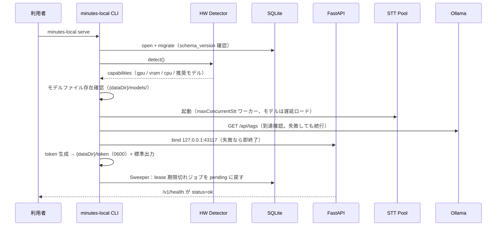
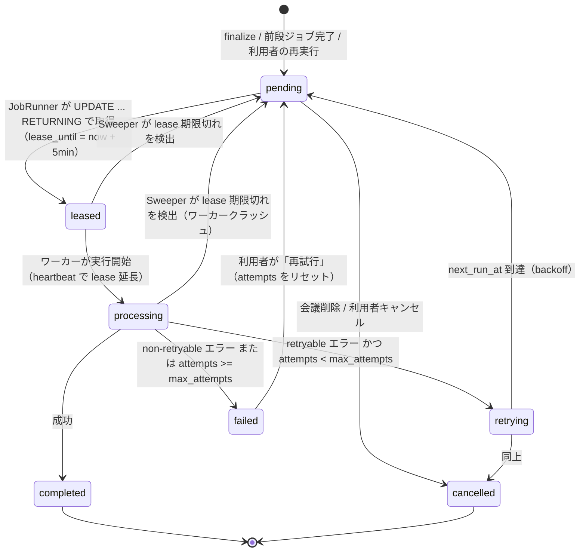
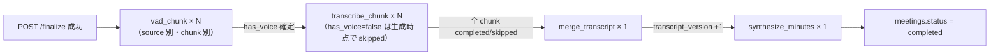
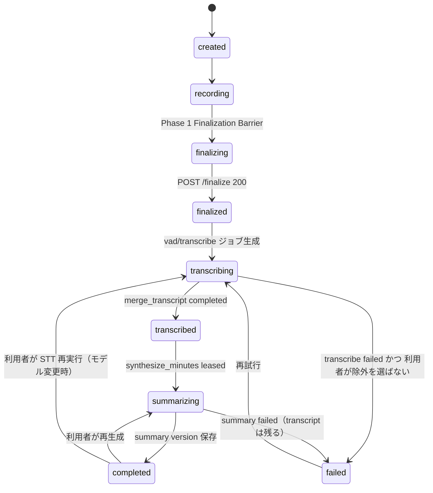
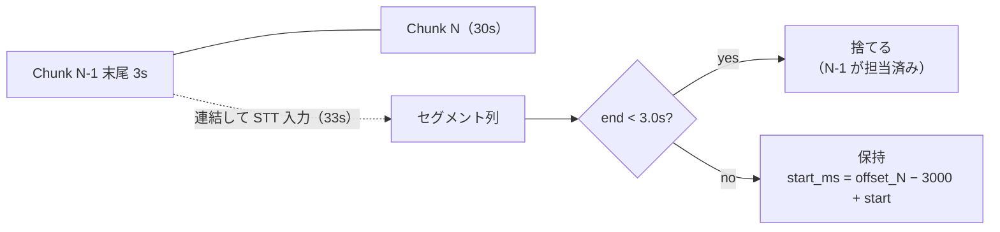
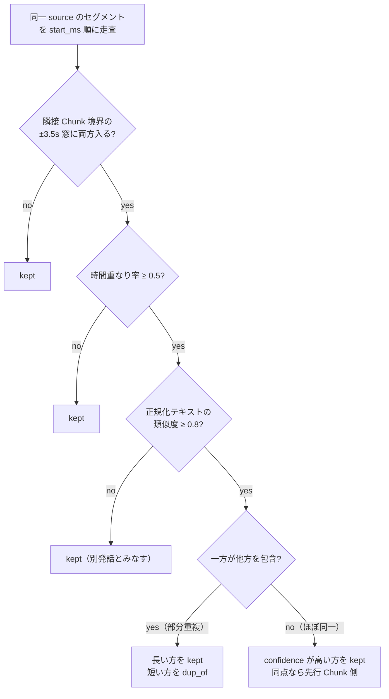
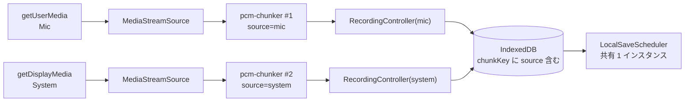

# 議事録Webアプリケーション Phase 2 / Phase 3 基本設計書（完全ローカル処理版）

**対象フェーズ:** Phase 2 ── finalize 済み会議を、利用者のマシン上だけで「確定 transcript → AI 議事録 → 手動編集」まで処理する。System Audio の追加を含む。
**Phase 3:** Live STT / 話者分離 / FLAC / 高度な復旧 / LAN 共有 ── 方針と接続点のみ（概要レベル）。
**設計方針:** Local-First / Zero External Call / Recording-First / Fault-Tolerant / At-Least-Once / Hardware-Aware Degradation
**上位文書:** システム設計書 v4.0、Phase 1 詳細設計書（`design-local-phase1.md`）。本書は両者の「Recording is Source of Truth」原則と Invariant 1〜10 を変更せずに継承する。
**粒度:** 基本設計。アーキテクチャ・API 契約・SQLite スキーマ・状態遷移・アルゴリズム方針までを確定し、実装コードは TypeScript 型定義と SQL DDL に限る。Python 側はモジュール構成と責務の記述にとどめる。
**技術選定（確定）:** 常駐サーバーは Python（FastAPI + SQLite + faster-whisper + Ollama HTTP API）。

---

# 1. エグゼクティブサマリー

Phase 1 は「Mic 音声を 30 秒 Standalone WAV として IndexedDB と常駐サーバーに保存し、finalize する」までを詳細設計した。Phase 2 のゴールは次の一文で表す。

> **finalize 済み会議が、外部への通信なしに、利用者のマシン上だけで確定 transcript と AI 議事録になる。**

そのために Phase 2 で追加する要素は 3 群に分かれる。

| 群 | 要素 | v4.0 / Phase 1 での位置づけ |
| --- | --- | --- |
| 録音の拡張（ブラウザ） | System Audio（2 系統目の `pcm-chunker`）、Mic/System ドリフト実測 | v4.0 §12〜§13、Phase 1 §8.3・§29 |
| 処理基盤（サーバー） | ハードウェア検出、SQLite ジョブテーブル（Queue の代替）、Retry / Sweeper / failed（DLQ の代替）、STT ワーカー、サーバー側 VAD | v4.0 §20〜§27・§44〜§56、Phase 1 §3.7・§25 |
| 成果物の生成（サーバー + ブラウザ） | Transcript Merger、要約（ローカル LLM）、Hallucination 対応、`meeting_summary_versions`、BlockNote 手動編集 | v4.0 §38〜§41・§57〜§72、Phase 1 §3.8・§3.10 |

Phase 2 で「壊れても録音と transcript を失わない」ことを保証する障害は次の通り。

* STT ワーカーのクラッシュ、GPU OOM、モデルファイル未配置
* Ollama 未起動、応答不正（JSON schema 不一致）、幻覚
* SQLite の一時的ロック競合（`SQLITE_BUSY`）
* サーバープロセスの再起動（lease 中のジョブ）
* System Audio の取得不可（ブラウザ・OS・共有対象依存）

---

# 2. Phase 1 からの継承事項と変更禁止事項

| 区分 | 内容 | 根拠 |
| --- | --- | --- |
| 変更禁止 | Invariant 1〜10、Recording is Source of Truth | v4.0 §125 |
| 変更禁止 | Phase 1 §12 の API 契約（`/v1/health`、`POST /v1/meetings`、`PUT chunk`、`GET chunks`、`POST finalize`）。Phase 2 は**追加のみ**で、既存エンドポイントのリクエスト／レスポンス形状を変えない | 後方互換。Phase 1 クライアントが Phase 2 サーバーに対してそのまま動く |
| 変更禁止 | ブラウザ側の Standalone WAV 生成（PCM16 / Mono / 16kHz、30 秒）。FLAC 化はサーバー側の事後処理に限定（§22） | Phase 1 §14〜§16 |
| 変更禁止 | ファイル配置規約 `{dataDir}/recordings/{meetingId}/{source}/{seq}.wav` と `.part` → `rename` の原子的書き込み | Phase 1 §12.1・§13 |
| 継承（追記可） | SQLite `audio_chunks` の列。Phase 2 は `stt_status` / `vad_source` / `server_vad_score` を追加する | v4.0 §74 |
| 継承 | ハードウェア区分とモデルフォールバック表（Phase 1 §3.7）。本書 §7 で確定 | — |
| 継承 | Hallucination 対応方針「除外 + `rejected` 保持 + 警告」（Phase 1 §3.8）。本書 §12 で確定 | — |
| 継承 | Zero External Call の唯一の例外候補「モデルファイルの明示操作によるダウンロード」（Phase 1 §25）。本書 §7.4 で確定 | — |

---

# 3. Phase 2 / Phase 3 のスコープ表

v4.0 §114 の Phase 分けと、Phase 1 §29 の持ち越し一覧を突き合わせた結果。

| 項目 | 出典 | 配置 | 本書のセクション |
| --- | --- | --- | --- |
| System Audio | v4.0 Phase 2 | Phase 2 | §16 |
| VAD（サーバー側高精度化） | v4.0 Phase 2、Phase 1 §3.2 | Phase 2 | §13 |
| Queue → SQLite ジョブテーブル | v4.0 Phase 2 | Phase 2 | §9 |
| Retry / DLQ | v4.0 Phase 2 | Phase 2 | §9 |
| STT（faster-whisper） | v4.0 Phase 1 Step 3（Groq）の読み替え | Phase 2 | §10 |
| Transcript Merger | Phase 1 §3.10 | Phase 2 | §11 |
| 要約（ローカル LLM） | v4.0 Phase 1 Step 5（Gemini）の読み替え | Phase 2 | §12 |
| Hallucination 除外 UI | Phase 1 §3.8 | Phase 2 | §12、§18 |
| BlockNote エディタ | v4.0 Phase 1 | Phase 2 | §19 |
| ハードウェア検出 | Phase 1 §3.7 | Phase 2 | §7 |
| Mic/System ドリフト実測 | Phase 1 §8.3、v4.0 §123 | Phase 2 | §16.3 |
| モデルファイルの配置・取得 | Phase 1 §25 | Phase 2 | §7.4 |
| Live STT | v4.0 Phase 3 | Phase 3 | §20 |
| 話者分離 | v4.0 Phase 3 | Phase 3 | §21 |
| FLAC | v4.0 Phase 3 | Phase 3 | §22 |
| 高度な復旧 | v4.0 Phase 3 | Phase 3 | §23 |
| LAN 共有 | Phase 1 §3.1 | Phase 3 | §24 |
| リサンプラ -40dB 基準の見直し | Phase 1 §3.3 | Phase 2（STT 導入時に実測） | §27 |

---

# 4. 全体アーキテクチャ

```mermaid
flowchart TB
    subgraph Browser["ブラウザ（同一オリジン、Phase 1 + 拡張）"]
        MIC[Mic<br/>pcm-chunker #1<br/>source=mic] --> IDB[(IndexedDB)]
        SYS[System Audio<br/>pcm-chunker #2<br/>source=system] --> IDB
        IDB --> SAVER[LocalSaveScheduler]
        UI[UI<br/>Transcript / Summary / BlockNote<br/>ジョブ進捗 / モデル表示]
    end

    subgraph Server["常駐サーバー（127.0.0.1:43117、Python 単一プロセス）"]
        API[FastAPI<br/>api/]
        DB[(SQLite WAL<br/>minutes.sqlite)]
        JOBS[JobRunner<br/>jobs/<br/>lease / retry / sweeper]
        STT[STT Worker<br/>stt/<br/>ProcessPoolExecutor × 1..N]
        VAD[Silero VAD<br/>stt/vad]
        MERGE[Transcript Merger<br/>merge/]
        LLMAD[LLM Adapter<br/>llm/]
        HW[HW Detector<br/>hw/]
        FS[("{dataDir}/recordings/")]
        SSE[SSE<br/>/v1/meetings/{id}/events]
    end

    subgraph External["同一マシン上の別プロセス"]
        OLLAMA[Ollama<br/>127.0.0.1:11434]
        MODELS[("モデルファイル<br/>{dataDir}/models/")]
    end

    SAVER -->|PUT chunk / finalize| API
    UI -->|GET transcript / summary<br/>PUT notes / retry| API
    API --> DB
    API --> FS
    API --> SSE --> UI
    API -.->|finalize 時にジョブ生成| JOBS
    JOBS --> DB
    JOBS --> STT
    STT --> VAD
    STT --> FS
    STT --> MODELS
    STT --> DB
    JOBS --> MERGE --> DB
    JOBS --> LLMAD -->|HTTP| OLLAMA
    LLMAD --> DB
    HW --> API
    HW --> STT
```

データの流れは v4.0 §41 の Source of Truth 順序をローカルに読み替えたものである。

```text
{dataDir}/recordings/*.wav（原音）
      ↓ STT Worker
transcript_segments（chunk 単位、Overlap 込み）
      ↓ Transcript Merger
transcript_segments.merged_version = N（確定 transcript）
      ↓ LLM Adapter
meeting_summary_versions（版管理された AI 議事録）
      ↓ 利用者操作のみ
meeting_notes（BlockNote JSON、利用者所有）
```

ローカル LLM の出力を transcript の原本にしない点、AI 議事録が手動ノートを上書きしない点は v4.0 §41・§69 と同じである。

---

# 5. 常駐サーバーのプロセス構成

## 5.1 選定

**単一 Python プロセス（FastAPI + asyncio）に、STT 実行専用の `ProcessPoolExecutor` を持たせる構成を採る。Ollama は別プロセスとして利用者が起動する（またはサーバーが子プロセスとして起動を試みる）。**

| 構成案 | 利点 | 欠点 | 判断 |
| --- | --- | --- | --- |
| A. 単一プロセス + ProcessPool（STT） | インストール・起動が 1 コマンド。SQLite への書き込み主体が 1 プロセスに集約され、ロック競合が単純 | STT がクラッシュしても API は生き残るが、プールの再生成が必要 | **採用** |
| B. API プロセスとワーカープロセスを分離 | ワーカー再起動が独立。LAN 共有時に GPU マシンだけワーカーにできる | 利用者が 2 プロセス管理する。SQLite の複数プロセス書き込みで `SQLITE_BUSY` の頻度が上がる | Phase 3 の LAN 共有拡張点として §24 に残す |
| C. STT をスレッドで実行 | 最も単純 | faster-whisper（CTranslate2）は GIL を解放するが、モデルロードと OOM の隔離ができない | 不採用 |

## 5.2 GPU 占有の原則

GPU（CUDA / Metal）を握るのは STT ワーカープロセスだけとし、API プロセスは GPU を初期化しない。Ollama は自身で GPU を使うため、STT と LLM が同時に走ると VRAM を奪い合う。この競合は次の規則で捌く。

| 規則 | 内容 |
| --- | --- |
| 同時実行の排他 | `synthesize_minutes` ジョブは、同一時刻に `processing` の `transcribe_chunk` が 0 件のときだけ lease する（ジョブ種別間の優先度：STT > 要約） |
| VRAM 予算 | HW Detector が `vramBytes` から STT モデルの必要量（§7.2 の表）を引いた残りを Ollama 用として見積もり、残りが LLM モデルの必要量を下回る場合は「STT 完了後に要約」を強制する |
| OOM 時 | STT の OOM は retryable。1 段小さいモデルに落として再試行（§9.4）。LLM の OOM（Ollama が 5xx を返す）も retryable で、`num_ctx` を縮めるか 1 段小さい LLM に落とす |

「GPU を同時に使っても壊れない」ことは断定しない。上記は競合を減らす規則であり、OOM は必ず起きうる前提で retryable にしている（§6）。

## 5.3 起動シーケンス



Ollama 未到達・モデル未配置は起動失敗にしない。`/v1/health` の `capabilities.sttModel` / `llmModel` が `null` になり、該当ジョブは `pending` のまま待つ（Invariant 3, 4 のローカル版）。

---

# 6. 断定してはいけない箇所と実測・監視で担保する箇所

Phase 1 §5 に加えて、Phase 2 で新たに「断定しない」事項。

| 事項 | 断定しない理由 | 実測・監視での担保 |
| --- | --- | --- |
| faster-whisper のモデルサイズ別の精度・速度 | ハードウェア・言語・話者・音質で大きく変わる | `processing_jobs.duration_ms` と `transcript_segments.confidence` を全件記録し、モデル別に集計する UI を持つ（§18） |
| Ollama の Structured Output（`format` に JSON schema）がスキーマに常に準拠する | モデル・量子化・プロンプト長で準拠率が変わる | Schema Validation 失敗率を `provider_usage` 相当のテーブル（§8.8）に記録。失敗時は 1 回だけ再生成し、再失敗は `failed` |
| GPU を STT と Ollama が共有しても OOM しない | VRAM の空き・断片化・他アプリの使用に依存 | §5.2 の排他規則 + OOM を retryable にする。OOM 回数を記録 |
| `getDisplayMedia({ audio: true })` で System Audio が取れる | ブラウザ・OS・共有対象（画面全体 / ウィンドウ / タブ）で可否が異なる | 取得不可は Mic-only で継続（v4.0 §13）。取得可否をブラウザ・OS 別に記録 |
| Silero VAD の false negative 率 | 言語・小声・BGM で変わる | `has_voice=false` だが STT が非空を返した Chunk の割合を集計（Phase 1 §3.2 の指標） |
| Transcript Merger の重複排除しきい値 | STT のセグメント境界の癖に依存 | しきい値は設定値。重複排除の判定ログを残し、誤結合・取りこぼしを利用者が UI で確認できるようにする |
| SQLite の WAL モードで単一プロセス内の同時読み書きが `SQLITE_BUSY` にならない | 長い読み取りトランザクション中のチェックポイントで発生しうる | `busy_timeout=5000`、書き込みは短いトランザクションに限定、`SQLITE_BUSY` 回数を記録 |
| 1 時間会議の STT 所要時間 | 上記すべてに依存 | §27 の見積もり式で目安を出し、実測で置き換える |

---

# 7. ハードウェア検出とモデル選定

## 7.1 検出手順（起動時、`hw/` モジュール）

| 順 | 検出項目 | 方法 | 失敗時 |
| --- | --- | --- | --- |
| 1 | CUDA GPU | `ctranslate2.get_cuda_device_count()` と `torch.cuda`（torch がある場合のみ）。VRAM は `nvidia-smi --query-gpu=memory.total` の出力を解析 | `gpu.available=false` |
| 2 | Apple Silicon | `platform.machine() == "arm64"` かつ macOS。統合メモリのため `vramBytes` は「物理メモリの 50%」を暫定値とし、`gpu.name="apple-silicon"` を返す | 同上 |
| 3 | CPU コア数 | `os.cpu_count()`（物理コアが取れる場合は物理コア） | 1 |
| 4 | 物理メモリ | `psutil.virtual_memory().total` | 0（区分 CPU 小） |
| 5 | 空きディスク | `shutil.disk_usage(dataDir).free` | 0 |
| 6 | Ollama 到達性 | `GET http://127.0.0.1:11434/api/tags`、タイムアウト 2 秒 | `llmModel=null` |
| 7 | モデルファイル | `{dataDir}/models/whisper/{name}/` の存在。Ollama のモデルは `/api/tags` の一覧 | 未配置は候補から除外 |

検出結果は `capabilities`（Phase 1 §7 の `LocalBackendCapabilities`）として `/v1/health` で返す。Phase 2 では次を追加する。

```typescript
// src/api/contracts-phase2.ts（Phase 1 の contracts.ts に追加する型。既存型は変更しない）
import type { LocalBackendCapabilities } from "../types/recording";

export type HardwareTier = "gpu_large" | "gpu_medium" | "gpu_small" | "cpu_only";

export interface LocalBackendCapabilitiesV2 extends LocalBackendCapabilities {
  readonly tier: HardwareTier;
  /** 検出済み・配置済みで実際に選べる STT モデル */
  readonly availableSttModels: ReadonlyArray<SttModelInfo>;
  /** Ollama /api/tags から得た LLM モデル */
  readonly availableLlmModels: ReadonlyArray<LlmModelInfo>;
  readonly ollamaReachable: boolean;
  readonly maxConcurrentStt: number;
  /** STT と LLM を同時に走らせてよいか（§5.2 の VRAM 予算判定） */
  readonly allowConcurrentSttAndLlm: boolean;
}

export interface SttModelInfo {
  readonly name: string;                 // "large-v3" | "medium" | "small" | "base" | "tiny"
  readonly computeType: "float16" | "int8_float16" | "int8";
  readonly estimatedMemoryBytes: number; // §7.2 の表から
  readonly installed: boolean;
}

export interface LlmModelInfo {
  readonly name: string;                 // Ollama のモデル名（例: "qwen2.5:7b-instruct-q4_K_M"）
  readonly parameterSizeB: number | null;
  readonly quantization: string | null;
  readonly estimatedMemoryBytes: number | null;
}
```

## 7.2 ハードウェア区分とフォールバック順序（確定）

Phase 1 §3.7 の表を、必要メモリの目安を添えて確定する。数値は「起動時に候補を絞るための閾値」であり、精度・速度の保証値ではない（§6）。

| 区分 `tier` | 条件 | STT 候補（優先順）と目安メモリ | LLM 候補（優先順） | `maxConcurrentStt` | STT/LLM 同時実行 |
| --- | --- | --- | --- | --- | --- |
| `gpu_large` | VRAM ≥ 12 GiB | large-v3 float16（約 3 GiB）→ medium float16（約 1.5 GiB）→ small | 13B 級 q4（約 8 GiB）→ 8B 級 q4（約 5 GiB） | 2 | 可（VRAM 残 ≥ LLM 目安） |
| `gpu_medium` | 6 ≤ VRAM < 12 GiB | medium int8_float16（約 1 GiB）→ small → base | 8B 級 q4 → 7B 級 q4 | 1 | 条件付き |
| `gpu_small` | VRAM < 6 GiB | small int8（約 0.5 GiB）→ base → tiny | 7B 級 q4（約 4.5 GiB）→ 3B 級 q4（約 2 GiB） | 1 | 不可（STT 完了後に要約） |
| `cpu_only` | GPU なし | base int8（約 0.3 GiB）→ tiny int8 | 3B 級 q4 → 1.5B 級 | 1（コア数 ≥ 8 なら 2） | 可（CPU/RAM は共有だが排他不要。ただし RAM 合計を確認） |

Apple Silicon は統合メモリのため `tier` は物理メモリで判定する（32 GiB 以上 = `gpu_large` 相当、16 GiB = `gpu_medium` 相当、8 GiB = `gpu_small` 相当）。faster-whisper は Metal を直接使わず CPU（Accelerate）で動くため、Apple Silicon では `computeType=int8` を既定にする。

選定規則：区分ごとの候補を優先順に走査し、**配置済み（installed）かつ目安メモリが予算内**の最初のモデルを採用する。利用者が設定画面で明示的に選んだモデルは、予算超過であっても採用する（警告表示のみ）。

## 7.3 ダウングレード

GPU OOM で STT ジョブが失敗した場合、次の候補に落として再試行する（§9.4）。ダウングレードは**ジョブ単位ではなく会議単位**で記録し（`meetings.stt_model_used`）、同一会議内で Chunk ごとにモデルが混在する事態を避ける。一度落としたら、その会議の残りジョブは落とした後のモデルで処理する。

## 7.4 モデルファイルの配置と取得 ── Zero External Call の唯一の例外

| 方式 | 内容 | 採否 |
| --- | --- | --- |
| 手動配置 | 利用者が `{dataDir}/models/whisper/{name}/` に CTranslate2 形式のモデルを置く。Ollama は `ollama pull` を利用者が実行する | **既定** |
| 明示操作によるダウンロード | 設定画面の「モデルを取得」ボタン → `POST /v1/models/download`。サーバーは Hugging Face（faster-whisper の公式配布元）へ通信する | 採用（例外として明記） |
| 起動時の自動ダウンロード | — | **不採用** |

例外の設計上の扱い：

* サーバーの外向き通信はこのエンドポイントの処理中に限り、接続先ホストを `huggingface.co` / `cdn-lfs.huggingface.co` の allowlist に固定する（Phase 1 §4.4 のサーバー側 allowlist を実装する初めての箇所）
* ダウンロード中は `/v1/health.status = "degraded"` とし、理由を `downloading_model` として返す
* 音声・transcript・要約のいかなるデータも、この通信に含まれない。送信するのはモデル名だけである
* ブラウザ側の CSP `connect-src` は変更しない（ブラウザは Hugging Face と通信しない）
* 設定画面に「この操作はモデル配布元へ通信します。会議データは送信されません」と表示し、既定はオフ

---

# 8. SQLite スキーマ DDL

v4.0 §73〜§76 の Postgres DDL を SQLite に翻訳し、Phase 2 のテーブルを追加する。Phase 1 のサーバー実装（最小スタブ）が `meetings` / `audio_chunks` を既に持っている場合、`CREATE TABLE IF NOT EXISTS` は既存テーブルをそのまま残すため列は増えない。§8.2 の列補完ステップで不足列を追加し、既存データを保持したまま Phase 2 のスキーマへ上げる。

## 8.1 接続設定

```sql
-- 接続ごとに実行する PRAGMA
PRAGMA journal_mode = WAL;
PRAGMA synchronous = NORMAL;
PRAGMA foreign_keys = ON;
PRAGMA busy_timeout = 5000;
```

`synchronous = NORMAL` は WAL モードで「プロセスクラッシュでは失われないが OS クラッシュでは直近トランザクションを失いうる」設定である。録音の原本は WAV ファイルと IndexedDB にあり、SQLite は再構築可能なメタデータであるため許容する（§23 の高度な復旧で WAV からの `audio_chunks` 再構築を扱う）。

## 8.2 マイグレーション方式

```sql
-- 001_schema_version.sql
CREATE TABLE IF NOT EXISTS schema_version (
  version    INTEGER PRIMARY KEY,
  applied_at INTEGER NOT NULL          -- epoch ms
);
```

`db/migrations/NNN_*.sql` を番号順に適用し、`schema_version` に記録する。各ファイルは 1 トランザクションで適用する。ロールバック用 SQL は書かない（ローカルの単一利用者環境では、失敗時は起動前に `minutes.sqlite` のバックアップ（§23）から戻す方が単純）。

### 8.2.1 既存 DB（Phase 1 スタブ）からのアップグレード

`CREATE TABLE IF NOT EXISTS` は既存テーブルの列を検査しない。Phase 1 の `meetings` / `audio_chunks` を持つ DB に 002 / 003 を適用しても `transcript_version` や `stt_status` は増えず、Phase 2 のクエリが列不在で失敗する。そのため `migrate.py` は各マイグレーションの SQL を適用した後、同じトランザクション内で `PRAGMA table_info` を検査して不足列を追加する。

```python
# migrate.py（抜粋）
# 各マイグレーションで「あるべき列」を宣言する。NOT NULL 列は必ず DEFAULT を持つ（ALTER TABLE ADD COLUMN の制約）。
REQUIRED_COLUMNS: dict[str, dict[str, str]] = {
    "meetings": {
        "local_user_id": "TEXT NOT NULL DEFAULT 'local'",
        "native_sample_rate": "INTEGER NOT NULL DEFAULT 48000",
        "total_audio_frames": "INTEGER",
        "transcript_version": "INTEGER NOT NULL DEFAULT 0",
        "stt_model_used": "TEXT",
        "llm_model_used": "TEXT",
    },
    "audio_chunks": {
        "vad_source": "TEXT NOT NULL DEFAULT 'browser_rms'",
        "server_vad_score": "REAL",
        "save_status": "TEXT NOT NULL DEFAULT 'registered'",
        "stt_status": "TEXT NOT NULL DEFAULT 'pending'",
    },
}

def ensure_columns(conn: sqlite3.Connection, table: str, required: dict[str, str]) -> list[str]:
    existing = {row[1] for row in conn.execute(f"PRAGMA table_info({table})")}
    added: list[str] = []
    for name, ddl in required.items():
        if name in existing:
            continue
        conn.execute(f"ALTER TABLE {table} ADD COLUMN {name} {ddl}")
        added.append(name)
    return added
```

| 規則 | 内容 |
| --- | --- |
| 追加のみ | 不足列は `ALTER TABLE ADD COLUMN` で追加する。既存行には DEFAULT が入る。列名は上の宣言以外を動的に組み立てない（SQL 文字列連結の対象を定数に限定する） |
| 再構築が必要な変更 | 既存列の CHECK 制約の変更（Phase 1 の `meetings.status` に `transcribing` 以降の状態を加える等）や NOT NULL 化は ADD COLUMN で表現できない。この場合は `CREATE TABLE meetings_new` → `INSERT INTO meetings_new (...) SELECT ... FROM meetings` → `DROP TABLE meetings` → `ALTER TABLE meetings_new RENAME TO meetings` → インデックス再作成の順（SQLite 公式の再構築手順）で行い、既存行を保持する。外部キーを持つ表の再構築は `PRAGMA foreign_keys = OFF` をトランザクションの外で先に実行し、終了後 `PRAGMA foreign_key_check` で検証する |
| schema_version | SQL 適用と列補完（または再構築）を 1 トランザクションでコミットし、その後に `schema_version` を記録する。列補完だけが先に走って途中で落ちた状態を作らない |
| 起動時の検査 | `schema_version` が最新でも `ensure_columns` は毎回実行する（差分なしなら no-op）。手動で触られた DB や中断されたアップグレードからの復帰を単純にする |
| テスト | `transcript_version` / `stt_status` を持たない Phase 1 相当の `meetings` / `audio_chunks` を作り行を入れた DB に対し、マイグレーション後に (1) 両列が `PRAGMA table_info` に現れる、(2) 既存行が残り DEFAULT 値が入っている、(3) `schema_version` が最新である、(4) 同じ DB にもう一度適用しても何も変わらない、を検証する |

## 8.3 meetings

```sql
-- 002_meetings.sql
CREATE TABLE IF NOT EXISTS meetings (
  id                     TEXT PRIMARY KEY,                 -- UUID v4（ブラウザ生成）
  local_user_id          TEXT NOT NULL DEFAULT 'local',    -- v4.0 user_id の読み替え（Phase 1 §3.1）
  title                  TEXT NOT NULL DEFAULT '無題の会議',
  status                 TEXT NOT NULL
                           CHECK (status IN ('created','recording','finalizing','finalized',
                                             'transcribing','transcribed',
                                             'summarizing','completed','failed')),
  session_start_epoch_ms INTEGER NOT NULL,
  native_sample_rate     INTEGER NOT NULL,                 -- Phase 1 §5：16000 と仮定しない証跡
  consent_confirmed_at   INTEGER NOT NULL,                 -- Phase 1 §3.9
  ended_at               INTEGER,
  total_audio_frames     INTEGER,                          -- finalize 時に確定
  transcript_version     INTEGER NOT NULL DEFAULT 0,       -- Merger 実行ごとに +1
  stt_model_used         TEXT,                             -- §7.3 会議単位で固定
  llm_model_used         TEXT,
  created_at             INTEGER NOT NULL,
  updated_at             INTEGER NOT NULL
);
CREATE INDEX IF NOT EXISTS idx_meetings_status ON meetings(status);
```

Meeting State Machine（v4.0 §42）は Phase 1 の `finalized` の後に `transcribing → transcribed → summarizing → completed` を追加した形になる（§9.6）。

## 8.4 audio_chunks

```sql
-- 003_audio_chunks.sql
CREATE TABLE IF NOT EXISTS audio_chunks (
  id               TEXT PRIMARY KEY,                       -- UUID v4（サーバー生成）
  meeting_id       TEXT NOT NULL REFERENCES meetings(id) ON DELETE CASCADE,
  source           TEXT NOT NULL CHECK (source IN ('mic','system')),
  sequence_no      INTEGER NOT NULL,
  start_offset_ms  INTEGER NOT NULL,
  end_offset_ms    INTEGER NOT NULL,
  duration_ms      INTEGER NOT NULL,
  sample_count     INTEGER NOT NULL,
  local_path       TEXT NOT NULL,                          -- v4.0 r2_key の読み替え。{dataDir} からの相対パス
  size_bytes       INTEGER NOT NULL,
  sha256           TEXT NOT NULL,
  -- VAD：ブラウザ RMS 値とサーバー Silero 値を両方保持（§13）
  vad_score        REAL NOT NULL DEFAULT 0,                -- ブラウザ側 RMS スコア
  has_voice        INTEGER NOT NULL DEFAULT 1,             -- 最終判定（サーバー側で上書きされうる）
  vad_source       TEXT NOT NULL DEFAULT 'browser_rms'
                     CHECK (vad_source IN ('browser_rms','server_silero')),
  server_vad_score REAL,
  -- 状態
  save_status      TEXT NOT NULL DEFAULT 'registered'
                     CHECK (save_status IN ('registered','verified','missing')),
  stt_status       TEXT NOT NULL DEFAULT 'pending'
                     CHECK (stt_status IN ('pending','queued','processing','completed','skipped','failed')),
  created_at       INTEGER NOT NULL,
  UNIQUE (meeting_id, source, sequence_no)                 -- v4.0 §17 の論理一意キー
);
CREATE INDEX IF NOT EXISTS idx_chunks_meeting_stt ON audio_chunks(meeting_id, stt_status);
```

v4.0 §74 との差分：`upload_status` は「サーバーに届いた時点で registered」のためローカルでは `save_status`（`verified` = finalize 時の sha256 照合済み、`missing` = §23 の復旧で検出したファイル欠落）に読み替える。

## 8.5 processing_jobs

```sql
-- 004_processing_jobs.sql
CREATE TABLE IF NOT EXISTS processing_jobs (
  id            TEXT PRIMARY KEY,
  meeting_id    TEXT NOT NULL REFERENCES meetings(id) ON DELETE CASCADE,
  chunk_id      TEXT REFERENCES audio_chunks(id) ON DELETE CASCADE,
  job_type      TEXT NOT NULL
                  CHECK (job_type IN ('vad_chunk','transcribe_chunk','merge_transcript','synthesize_minutes')),
  status        TEXT NOT NULL DEFAULT 'pending'
                  CHECK (status IN ('pending','leased','processing','retrying','completed','failed','cancelled')),
  priority      INTEGER NOT NULL DEFAULT 100,              -- 小さいほど先。STT=100, VAD=50, merge=200, summary=300
  attempts      INTEGER NOT NULL DEFAULT 0,
  max_attempts  INTEGER NOT NULL DEFAULT 5,
  lease_until   INTEGER,                                   -- epoch ms。processing 中のハートビートで延長
  lease_owner   TEXT,                                      -- ワーカー識別子（pid:index）
  next_run_at   INTEGER NOT NULL DEFAULT 0,                -- retrying の再実行時刻
  model_name    TEXT,                                      -- 実行に使ったモデル（ダウングレード追跡）
  error_class   TEXT
                  CHECK (error_class IS NULL OR error_class IN
                    ('OOM','MODEL_MISSING','INVALID_AUDIO','PROVIDER_UNREACHABLE',
                     'SCHEMA_VALIDATION','BUSINESS_VALIDATION','TIMEOUT','INTERNAL')),
  last_error    TEXT,
  duration_ms   INTEGER,                                   -- 実測記録（§6）
  created_at    INTEGER NOT NULL,
  updated_at    INTEGER NOT NULL
);
-- v4.0 §47 / §58 の部分一意インデックスは SQLite でもそのまま書ける
CREATE UNIQUE INDEX IF NOT EXISTS uq_transcribe_job
  ON processing_jobs(meeting_id, chunk_id) WHERE job_type = 'transcribe_chunk';
CREATE UNIQUE INDEX IF NOT EXISTS uq_vad_job
  ON processing_jobs(meeting_id, chunk_id) WHERE job_type = 'vad_chunk';
CREATE UNIQUE INDEX IF NOT EXISTS uq_merge_job
  ON processing_jobs(meeting_id) WHERE job_type = 'merge_transcript';
CREATE UNIQUE INDEX IF NOT EXISTS uq_summary_job
  ON processing_jobs(meeting_id) WHERE job_type = 'synthesize_minutes';
-- lease 取得用：pending/retrying を priority, created_at 順に取る
CREATE INDEX IF NOT EXISTS idx_jobs_runnable
  ON processing_jobs(status, next_run_at, priority, created_at);
CREATE INDEX IF NOT EXISTS idx_jobs_lease ON processing_jobs(status, lease_until);
```

`merge_transcript` と `synthesize_minutes` は会議につき 1 行だが、再実行（利用者の「再生成」）は同じ行を `pending` に戻して `attempts` をリセットする。版は `transcript_version` / `meeting_summary_versions.version` で追跡するため、ジョブ行を増やす必要はない。

## 8.6 transcript_segments

```sql
-- 005_transcript_segments.sql
CREATE TABLE IF NOT EXISTS transcript_segments (
  id              TEXT PRIMARY KEY,
  meeting_id      TEXT NOT NULL REFERENCES meetings(id) ON DELETE CASCADE,
  chunk_id        TEXT NOT NULL REFERENCES audio_chunks(id) ON DELETE CASCADE,
  source          TEXT NOT NULL CHECK (source IN ('mic','system')),
  segment_index   INTEGER NOT NULL,                        -- chunk 内の連番
  start_ms        INTEGER NOT NULL,                        -- Session Clock 上の絶対 ms（Overlap 補正済み）
  end_ms          INTEGER NOT NULL,
  text            TEXT NOT NULL,
  normalized_text TEXT,                                    -- §11.2 の正規化結果
  language        TEXT,                                    -- faster-whisper の判定（"ja" / "en"）
  confidence      REAL,                                    -- §10.4
  no_speech_prob  REAL,
  -- Merger の結果
  merged_version  INTEGER,                                 -- この行が採用された transcript_version。NULL = 未マージ or 重複として除外
  merge_reason    TEXT,                                    -- 'kept' / 'dup_of:<id>' / 'overlap_trim'
  -- Phase 3 拡張点（v4.0 §14）。Phase 2 では常に NULL
  speaker_id         TEXT,
  speaker_confidence REAL,
  created_at      INTEGER NOT NULL,
  UNIQUE (chunk_id, segment_index)                         -- v4.0 §48 の冪等キー
);
CREATE INDEX IF NOT EXISTS idx_segments_meeting_time ON transcript_segments(meeting_id, start_ms);
CREATE INDEX IF NOT EXISTS idx_segments_merged ON transcript_segments(meeting_id, merged_version);
```

## 8.7 meeting_summary_versions / meeting_notes

```sql
-- 006_summary_and_notes.sql
CREATE TABLE IF NOT EXISTS meeting_summary_versions (
  id                    TEXT PRIMARY KEY,
  meeting_id            TEXT NOT NULL REFERENCES meetings(id) ON DELETE CASCADE,
  version               INTEGER NOT NULL,
  transcript_version    INTEGER NOT NULL,                  -- どの確定 transcript から生成したか
  model_name            TEXT NOT NULL,
  prompt_version        TEXT NOT NULL,
  result_json           TEXT NOT NULL,                     -- MeetingSummary（検証後、rejected 込み）
  raw_response_json     TEXT,                              -- LLM の生出力（デバッグ用。PII を含むためエクスポート対象外）
  validation_json       TEXT NOT NULL,                     -- §12.5 の検証結果
  generated_at          INTEGER NOT NULL,
  UNIQUE (meeting_id, version)
);

-- 利用者所有の手動ノート（v4.0 §69〜§72）。AI は書き込まない。
CREATE TABLE IF NOT EXISTS meeting_notes (
  meeting_id            TEXT PRIMARY KEY REFERENCES meetings(id) ON DELETE CASCADE,
  blocknote_json        TEXT NOT NULL,
  -- 楽観ロック：ブラウザは PUT 時に取得時の revision を送り、不一致なら 409
  revision              INTEGER NOT NULL DEFAULT 0,
  -- 「先頭に追加」等で取り込んだ AI 議事録の版。差分表示の起点
  last_applied_summary_version INTEGER,
  updated_at            INTEGER NOT NULL
);
```

## 8.8 settings / usage_metrics

```sql
-- 007_settings_and_metrics.sql
CREATE TABLE IF NOT EXISTS settings (
  key        TEXT PRIMARY KEY,
  value_json TEXT NOT NULL,
  updated_at INTEGER NOT NULL
);

-- v4.0 §101 provider_usage のローカル読み替え。クォータ監視ではなく、§6 の実測担保のための記録。
CREATE TABLE IF NOT EXISTS usage_metrics (
  id           INTEGER PRIMARY KEY AUTOINCREMENT,
  metric       TEXT NOT NULL,      -- 'stt_seconds' | 'stt_duration_ms' | 'stt_oom' | 'llm_duration_ms' | 'llm_schema_fail' | 'sqlite_busy' | 'vad_false_negative'
  model_name   TEXT,
  meeting_id   TEXT,
  amount       REAL NOT NULL,
  recorded_at  INTEGER NOT NULL
);
CREATE INDEX IF NOT EXISTS idx_metrics_metric_time ON usage_metrics(metric, recorded_at);
```

## 8.9 v4.0 スキーマからの読み替え一覧

| v4.0 | 本書 | 理由 |
| --- | --- | --- |
| `uuid` / `gen_random_uuid()` | `TEXT`、アプリ側で UUID v4 生成 | SQLite に UUID 型がない |
| `timestamptz` / `now()` | `INTEGER` epoch ms、アプリ側で付与 | ブラウザ側の `Date.now()` と単位を揃える |
| `references auth.users` | `local_user_id TEXT DEFAULT 'local'` | Phase 1 §3.1 |
| `r2_key` | `local_path` | ローカルファイル |
| `upload_status` | `save_status` | 到達 = 登録のため意味が変わる |
| RLS | なし | 単一利用者。API のトークン認証で代替 |
| `provider_usage` | `usage_metrics` | クォータ監視ではなく実測記録 |
| Queue 本体 | `processing_jobs` がそのままキュー | §9 |

---

# 9. ジョブ実行基盤（Queue の代替）

v4.0 §20〜§27・§44〜§56 で Cloudflare Queues + DB の二層だった構造を、SQLite `processing_jobs` の一層に畳む。Queue と DB の順序問題（v4.0 §44〜§45）、24 時間 retention（§54）、operation 課金（§20〜§21）は前提ごと消える。代わりに「単一プロセス内でジョブを取り合う」設計になる。

## 9.1 状態遷移図



## 9.2 lease 取得

v4.0 §49 の Job Lock を SQLite で書くと次になる（SQLite 3.35 以降の `RETURNING`）。

```sql
-- JobRunner が 1 件取得する。:now は epoch ms、:owner はワーカー識別子
UPDATE processing_jobs
SET status = 'leased',
    lease_until = :now + 300000,
    lease_owner = :owner,
    attempts = attempts + 1,
    updated_at = :now
WHERE id = (
  SELECT id FROM processing_jobs
  WHERE status IN ('pending', 'retrying')
    AND next_run_at <= :now
    AND job_type IN (:allowed_types)      -- §5.2 の排他規則で許可された種別
  ORDER BY priority ASC, created_at ASC
  LIMIT 1
)
RETURNING id, meeting_id, chunk_id, job_type, attempts, model_name;
```

`RETURNING` が 0 行なら「取得できるジョブがない」。同一プロセス内で複数ワーカーが同時に呼んでも、SQLite の書き込みロックで直列化される。

## 9.3 heartbeat と Sweeper

| 仕組み | 内容 |
| --- | --- |
| heartbeat | `processing` 中のワーカーは 60 秒ごとに `UPDATE ... SET lease_until = now + 300000 WHERE id = ? AND lease_owner = ?` を発行する。STT 1 Chunk は通常 5 分未満だが、CPU-only の large モデルなど長時間の場合に備える |
| Sweeper | 30 秒ごとに `status IN ('leased','processing') AND lease_until < now` を `pending` に戻し、`last_error = 'lease expired'` を記録する。起動時にも 1 回実行する（§5.3） |
| 二重実行 | Sweeper で戻された後に旧ワーカーが完了報告を送ってきた場合、`UPDATE ... WHERE id = :id AND lease_owner = :owner AND attempts = :attempts` が 0 行になるため無視される。§9.2 の `RETURNING` が返す `attempts` を fencing token としてワーカーが持ち回り、完了報告と結果の書き込みの両方に付ける |
| 結果の書き込み | `transcript_segments` への INSERT は完了報告と同じトランザクションで行い、先に `SELECT 1 FROM processing_jobs WHERE id = :id AND lease_owner = :owner AND attempts = :attempts AND status = 'processing'` を検証して 0 行なら INSERT せずに結果を破棄する。lease 失効後の旧ワーカーが `INSERT OR IGNORE` で `UNIQUE (chunk_id, segment_index)` を先に埋め、正規の再試行（`attempts` が進んだ側）の結果が無視される事態を防ぐ。検証を通った同一 attempt の重複報告は `UNIQUE` + `INSERT OR IGNORE` で冪等のまま（Invariant 5） |

## 9.4 Retry 分類とバックオフ

v4.0 §50〜§51 をローカルの障害種別に読み替える。

| `error_class` | 発生源 | retryable | 追加動作 |
| --- | --- | --- | --- |
| `OOM` | CUDA OOM、Ollama 5xx（メモリ） | yes | STT：会議単位でモデルを 1 段ダウングレード（§7.3）。LLM：`num_ctx` を半減、次に 1 段小さいモデル |
| `MODEL_MISSING` | モデル未配置 | yes（無期限） | `next_run_at = now + 5min`。`attempts` は増やさない。UI に「モデルを配置してください」 |
| `PROVIDER_UNREACHABLE` | Ollama 未起動 | yes（無期限） | 同上 |
| `TIMEOUT` | STT / LLM が上限時間を超過 | yes | backoff |
| `INVALID_AUDIO` | WAV ヘッダ不正、sha256 不一致 | **no** | `audio_chunks.save_status = 'missing'`、UI で該当 Chunk を表示。録音原本はブラウザ IndexedDB から再送可能（Phase 1 §23） |
| `SCHEMA_VALIDATION` | LLM 出力が JSON schema 不一致 | yes（1 回のみ） | 再生成時は temperature を下げる。2 回目失敗で `failed` |
| `BUSINESS_VALIDATION` | `sourceSegmentIds` 全滅など | **no** | §12.5。除外後に残る項目が 0 の場合のみ `failed` |
| `INTERNAL` | その他例外 | yes | backoff |

バックオフは Phase 1 §9.3 と同じ系列（2s, 5s, 10s, 30s, 60s …）に ±20% ジッター。`max_attempts` 既定 5。上限到達は `failed` とし、v4.0 §52〜§53 の DLQ に相当する扱い（UI に「文字起こしに失敗しました [再試行]」）。DLQ という別キューは作らない。`failed` 行そのものが DLQ である。

## 9.5 ジョブの生成順序と依存関係



| 遷移 | 生成条件（すべて同一トランザクション内で判定） | v4.0 対応 |
| --- | --- | --- |
| finalize → `vad_chunk` | `audio_chunks` 全行に対し `INSERT OR IGNORE` | §44（DB → Queue の順序は不要） |
| `vad_chunk` 完了 → `transcribe_chunk` | `has_voice=1` なら `pending`、`0` なら `audio_chunks.stt_status='skipped'` にしてジョブを作らない | §32 |
| `transcribe_chunk` 完了 → `merge_transcript` | `SELECT COUNT(*) FROM audio_chunks WHERE meeting_id=? AND stt_status NOT IN ('completed','skipped')` が 0 | §57〜§60 |
| `merge_transcript` 完了 → `synthesize_minutes` | 即時。ただし §5.2 の排他規則で lease は STT 完了後 | §61 |
| いずれかが `failed` | 後続を生成しない。UI で「失敗 Chunk を再試行 / 除外して生成」を選ばせる | §97〜§98 |

「除外して生成」を選んだ場合、`failed` の `transcribe_chunk` を `cancelled` にし、`audio_chunks.stt_status='failed'` のまま `merge_transcript` を生成する。要約の入力には「この区間は文字起こしに失敗しました」を明示的に挿入する（v4.0 §98：AI に黙って欠落データを渡さない）。

## 9.6 Meeting State Machine（Phase 2 拡張）



`failed` は「会議データの消失」ではない（v4.0 §105）。`transcribed` まで到達していれば transcript は閲覧・編集できる。

---

# 10. STT パイプライン（`transcribe_chunk`）

## 10.1 入出力

| 項目 | 内容 |
| --- | --- |
| 入力 | `audio_chunks` 1 行（`local_path`、`sha256`、`start_offset_ms`、`source`）と、同一 `source` の直前 Chunk（Overlap 用、存在すれば） |
| 前処理 | (1) ファイルの SHA-256 を再計算し `sha256` と照合。不一致は `INVALID_AUDIO`（non-retryable）。(2) WAV ヘッダ検証（Phase 1 §16 と同じ 13 フィールド）。(3) 直前 Chunk の末尾 3 秒（48,000 サンプル）を先頭に連結 |
| 実行 | faster-whisper `WhisperModel.transcribe()`。モデルは `meetings.stt_model_used`（未設定なら `capabilities` の推奨）。プール内でモデルはプロセスごとに 1 回ロードしキャッシュする |
| 後処理 | Overlap 分のセグメントを除去（§10.3）、絶対時刻へ補正、`confidence` 算出（§10.4）、`transcript_segments` へ `INSERT OR IGNORE` |
| 出力 | `audio_chunks.stt_status = 'completed'`、`processing_jobs.duration_ms`、`usage_metrics(stt_seconds, stt_duration_ms)` |

## 10.2 faster-whisper のパラメータ方針

| パラメータ | 方針 | 理由 |
| --- | --- | --- |
| `language` | 既定は会議設定の `language`（`ja` / `en` / `auto`）。`auto` は最初の `has_voice=1` Chunk で判定し、会議単位で固定する | Chunk ごとに自動判定すると短い Chunk で誤判定しやすい。日英混在会議は `auto` を選ばせず、主言語を指定させる |
| `vad_filter` | `False` | VAD は §13 で別ジョブとして実行済み。二重に掛けると `skipped` 判定と食い違う |
| `beam_size` | `gpu_*` は 5、`cpu_only` は 1 | 速度と精度のトレード。設定値 |
| `word_timestamps` | `True` | Merger（§11）が Overlap 境界を単語単位で切るため |
| `condition_on_previous_text` | `False` | Chunk 独立性を保つ。前 Chunk の幻覚が伝播するのを防ぐ |
| `initial_prompt` | 会議設定の用語リスト（任意） | 固有名詞の認識補助。利用者入力のみ、AI 生成しない |
| `compute_type` | §7.2 の区分による | — |
| タイムアウト | Chunk 実時間（30 秒）× 係数（`gpu_*`=10、`cpu_only`=60）。超過は `TIMEOUT` retryable | 無限待ちを避ける。係数は設定値 |

## 10.3 Overlap の扱い

v4.0 §38 の通り、録音ファイルは Overlap しない。STT 入力を組む際に前 Chunk 末尾 3 秒を連結し、結果から先頭 3 秒に**完全に収まる**セグメントを捨てる。境界を跨ぐセグメントは保持し、`start_ms` を `chunk.start_offset_ms - 3000 + segment.start` で絶対時刻に補正する。



境界を跨ぐセグメントは Chunk N-1 の末尾セグメントと重複しうる。この重複は STT 段階では除去せず、Merger（§11）が `merge_reason='dup_of:<id>'` で解決する。理由は、STT ジョブは Chunk 単位で独立・冪等であるべきで、隣接 Chunk の結果を参照して自分の出力を変えると再実行時の結果が順序依存になるためである。

## 10.4 confidence

faster-whisper のセグメントは `avg_logprob`（対数確率の平均）と `no_speech_prob` を持つ。`confidence` は次で 0..1 に写像する。

```text
confidence = clamp(exp(avg_logprob), 0, 1) × (1 − no_speech_prob)
```

これは正規化された指標ではなく、モデル間・言語間で比較可能な値でもない（§6）。UI（§18）では会議内の相対値として「薄く表示するしきい値」（既定 0.4、設定値）にのみ使う。`word_timestamps=True` のとき単語ごとの `probability` も得られるが、Phase 2 ではセグメント単位のみ保存する。

## 10.5 冪等性

`transcript_segments` の `UNIQUE (chunk_id, segment_index)` と `INSERT OR IGNORE` により、同一ジョブが二重実行されても行は増えない。ただし**モデルを変えて再実行**する場合は既存行を消す必要がある。これは「STT 再実行」操作（§14）が `DELETE FROM transcript_segments WHERE chunk_id = ?` を先に発行することで対応し、`merged_version` の整合は次の `merge_transcript` が `transcript_version` を進めることで回復する。

---

# 11. Transcript Merger（`merge_transcript`）

Phase 1 §3.10 で先送りした重複排除アルゴリズムを確定する。

## 11.1 入力と出力

| 項目 | 内容 |
| --- | --- |
| 入力 | 会議の全 `transcript_segments`（`merged_version IS NULL` または前回版）。`source` 別に `start_ms` 順 |
| 出力 | 各行の `merged_version` と `merge_reason` を更新。`meetings.transcript_version` を +1。除外行は `merged_version = NULL`、`merge_reason = 'dup_of:<id>'` |
| 冪等性 | 同じ入力集合に対して同じ結果を出す（決定的）。再実行は `transcript_version` を進めるだけで、行を削除しない |

## 11.2 正規化

`normalized_text` は次の順で生成し、比較にのみ使う（表示は `text`）。

1. Unicode NFKC 正規化
2. 全角英数字 → 半角、カタカナは全角に統一
3. 句読点・記号（`。、，．,.!?！？「」()（）`）と空白を除去
4. 英字を小文字化
5. 日本語の長音・促音のゆれは扱わない（Phase 2 では過剰な同一視を避ける）

## 11.3 Overlap 重複排除（同一 source 内）

隣接 Chunk 境界（`chunk N-1` の末尾 3 秒と `chunk N` の先頭 3 秒に相当する時間窓）にあるセグメント対だけを比較対象にする。会議全体で総当たりはしない。



| 判定 | 定義 | 既定値（設定値） |
| --- | --- | --- |
| 時間重なり率 | `overlap_ms / min(dur_a, dur_b)` | 0.5 |
| 類似度 | `1 − levenshtein(norm_a, norm_b) / max(len_a, len_b)`。日本語は文字単位、英語は単語単位。正規化後に `norm_a` または `norm_b` が空（記号やフィラーだけの発話）なら類似度 0 として扱い、この式を評価しない（`max(len_a, len_b) = 0` での除算を起こさない） | 0.8 |
| 包含 | `norm_a` が `norm_b` の部分文字列（またはその逆）で、長さ比が 0.3〜0.95 | — |

「部分重複」は Chunk 境界で発話が切れ、N-1 側が前半だけ、N 側が全文を拾ったケースである。長い方を残すことで文が復元される。「表記ゆれ」は類似度しきい値 0.8 で吸収する範囲にとどめ、しきい値未満は別発話として両方残す（取りこぼしより二重残しを選ぶ。利用者が UI で削除できる）。

## 11.4 mic / system の時系列統合

mic と system は別々の話者経路であり、内容の重複排除は行わない（同じ発言が両方に入ることは、スピーカー出力をマイクが拾うエコー以外では起きない）。統合は単純に `start_ms` 順のマージであり、Session Clock（Phase 1 §8）が両 source で共通の基準であることが前提になる。Mic/System のドリフトが §16.3 の受入基準を超えた場合、Merger は補正を行わず、UI に「同期誤差が大きい会議」と表示する。

エコー（system の音声を mic が拾う）は Phase 2 では扱わない。Phase 3 の話者分離（§21）で「mic 側の system 由来音声」を検出する可能性を接続点として残す。

## 11.5 出力フォーマット（要約への入力）

v4.0 §62 に従い、確定 transcript は次の行形式で要約ジョブに渡す。

```text
[00:12] [mic] [seg:3f1a…] 仕様について確認します。
[00:18] [system] [seg:9c02…] 来週までに対応します。
[05:30] [mic] [seg:—] （この区間は文字起こしに失敗しました）
```

`[seg:<id 先頭 8 桁>]` を含めるのは、`sourceSegmentIds` の実在チェック（§12.5）で LLM が参照できる ID を与えるためである。8 桁への短縮は、ローカル LLM のコンテキスト長を節約するためで、サーバー側で完全 ID に復元する（衝突時は 12 桁に伸ばす）。

---

# 12. 要約（`synthesize_minutes`）

## 12.1 起動条件

v4.0 §57〜§60 の Summary Trigger Transaction を SQLite で再現する。

```sql
-- merge_transcript 完了時、同一トランザクション内で実行
BEGIN IMMEDIATE;
  -- 全 chunk が completed / skipped / (除外承認済みの) failed であることを確認
  SELECT COUNT(*) FROM audio_chunks
   WHERE meeting_id = :meeting_id
     AND stt_status IN ('pending','queued','processing');
  -- 0 件のときのみ
  INSERT OR IGNORE INTO processing_jobs
    (id, meeting_id, job_type, status, priority, created_at, updated_at)
  VALUES (:job_id, :meeting_id, 'synthesize_minutes', 'pending', 300, :now, :now);
  UPDATE meetings SET status = 'transcribed', updated_at = :now WHERE id = :meeting_id;
COMMIT;
```

`BEGIN IMMEDIATE` で書き込みロックを先に取るため、v4.0 §60 の `SELECT ... FOR UPDATE` と同じ効果を得る。

## 12.2 Ollama 呼び出し契約

| 項目 | 内容 |
| --- | --- |
| エンドポイント | `POST http://127.0.0.1:11434/api/chat` |
| `model` | `meetings.llm_model_used`（未設定なら `capabilities` の推奨） |
| `format` | `MeetingSummary` の JSON Schema（§12.4）。Ollama は `format` に JSON Schema オブジェクトを受け付ける |
| `stream` | `false` |
| `options.temperature` | 初回 0.2、Schema Validation 失敗後の再生成は 0.0 |
| `options.num_ctx` | transcript のトークン数 + 出力余裕（2,048）。モデル上限を超える場合は §12.3 の分割 |
| `keep_alive` | `"5m"`。要約完了後に VRAM を解放し STT と競合しないようにする |
| タイムアウト | 接続 10 秒、応答 600 秒（`cpu_only` は 1,800 秒）。設定値 |
| 接続先の allowlist | `127.0.0.1` / `localhost` のみ。Ollama の URL は設定可能だが Phase 1 §4.4 の allowlist を通す |

## 12.3 長い会議の分割

ローカル LLM のコンテキスト長は 4k〜32k トークン程度であり、2 時間会議の transcript（日本語で 3〜5 万文字）は収まらないことがある。方針は Map-Reduce とする。

1. transcript を `num_ctx` の 60% 以内に収まる時間窓に分割（発話境界で切る）
2. 各窓で「窓内の要約 + 決定事項 + アクションアイテム」を `MeetingSummary` と同じスキーマで生成（Map）
3. 窓ごとの結果を連結し、再度 LLM に「統合」させる（Reduce）。`sourceSegmentIds` は Map 段階の値を保持させる
4. Reduce の出力に対して §12.5 の検証を行う

窓が 1 つで済む会議は Map = 最終出力とし Reduce を省く。分割数は `meeting_summary_versions.validation_json` に記録する。

## 12.4 出力スキーマ

v4.0 §64 を継承し、除外項目を保持する `rejected` を追加する。

```typescript
// src/api/contracts-summary.ts
export interface SummaryTopic {
  readonly title: string;
  readonly description: string;
  readonly sourceSegmentIds: ReadonlyArray<string>;
}

export interface SummaryActionItem {
  readonly task: string;
  readonly assignee: string | null;
  readonly deadline: string | null;
  readonly sourceSegmentIds: ReadonlyArray<string>;
}

export interface SummaryDecision {
  readonly text: string;
  readonly sourceSegmentIds: ReadonlyArray<string>;
}

/** LLM が生成する形（format に渡す JSON Schema はこの型から生成する） */
export interface MeetingSummaryDraft {
  readonly summary: string;
  readonly topics: ReadonlyArray<SummaryTopic>;
  readonly decisions: ReadonlyArray<SummaryDecision>;
  readonly actionItems: ReadonlyArray<SummaryActionItem>;
}

export type RejectionReason =
  | "SEGMENT_ID_NOT_FOUND"      // sourceSegmentIds に実在しない ID
  | "SEGMENT_ID_EMPTY"          // sourceSegmentIds が空
  | "ASSIGNEE_NOT_IN_TRANSCRIPT" // 担当者名が transcript に出現しない
  | "DEADLINE_NOT_IN_TRANSCRIPT" // 期限表現が transcript に出現しない
  | "DUPLICATE";

export interface RejectedItem {
  readonly kind: "topic" | "decision" | "actionItem";
  readonly item: SummaryTopic | SummaryDecision | SummaryActionItem;
  readonly reasons: ReadonlyArray<RejectionReason>;
}

/** 検証後に保存・表示する形 */
export interface MeetingSummary extends MeetingSummaryDraft {
  readonly rejected: ReadonlyArray<RejectedItem>;
  readonly modelName: string;
  readonly promptVersion: string;
  readonly transcriptVersion: number;
  readonly generatedAt: number;
  /** モデル別の既知の弱点注記（§12.6）。UI に常時表示 */
  readonly modelCaveats: ReadonlyArray<string>;
}

export interface SummaryValidationReport {
  readonly schemaValid: boolean;
  readonly schemaRetries: number;
  readonly mapWindows: number;
  readonly totalItems: number;
  readonly rejectedItems: number;
  readonly unresolvedSegmentIds: ReadonlyArray<string>;
}
```

## 12.5 検証と Hallucination 対応（確定）

v4.0 §65〜§66 の Schema Validation + Business Validation を次の順で実行する。

| 段 | 検証 | 失敗時 |
| --- | --- | --- |
| 1 | JSON としてパース可能 | `SCHEMA_VALIDATION`。temperature 0 で 1 回再生成。再失敗は `failed` |
| 2 | JSON Schema 準拠（必須キー・型・配列） | 同上 |
| 3 | 各項目の `sourceSegmentIds` が非空で、全 ID が `transcript_segments`（`merged_version = 現在版`）に実在 | **該当項目を `rejected` へ移す**（`SEGMENT_ID_NOT_FOUND` / `SEGMENT_ID_EMPTY`）。再生成しない |
| 4 | `assignee` が非 null なら、その文字列（正規化後）が参照セグメントのテキストに出現 | 該当項目を `rejected`（`ASSIGNEE_NOT_IN_TRANSCRIPT`）。v4.0 §63「AI に話者名を推定させない」の実装 |
| 5 | `deadline` が非 null なら、日付・曜日・相対表現（「来週」「月末」等）のいずれかが参照セグメントに出現 | 該当項目を `rejected`（`DEADLINE_NOT_IN_TRANSCRIPT`） |
| 6 | `topics` / `decisions` / `actionItems` 内の正規化テキスト重複 | 後続を `rejected`（`DUPLICATE`） |
| 7 | `summary` が空でない | `BUSINESS_VALIDATION`（non-retryable）。ただし 3〜6 で全項目が除外されても `summary` があれば成功扱い |

「再生成ではなく除外」を採る理由は Phase 1 §3.8 の通り（軽量モデルは再生成でも同種の幻覚を再現しやすく、時間もかかる）。除外された項目は UI（§18）で「AI が生成したが根拠を確認できなかった項目」として折りたたみ表示し、利用者が元発言を見て手動で採用できる。採用操作は `meeting_notes` への書き込みであり、`meeting_summary_versions` は変更しない。

## 12.6 モデル別の既知の弱点注記

Phase 1 §3.8 で先送りした注記テーブルを、静的な設定ファイル `llm/caveats.json` として持つ。内容の例（実測で更新する）。

| モデル区分 | 注記 |
| --- | --- |
| STT tiny / base | 日本語の固有名詞・数字の誤認識が多い。専門用語は `initial_prompt` に登録することを推奨 |
| STT small / medium | 話者交代の直後の単語を落としやすい |
| LLM 3B 級 | 担当者・期限の抽出精度が低く、除外率が高くなる。決定事項は要約より信頼できる |
| LLM 7〜8B 級 | 長い会議（Map-Reduce 適用時）で窓をまたぐ話題の統合が弱い |
| 全般 | `sourceSegmentIds` の根拠表示を必ず確認すること |

注記はモデル名のパターン（`tiny|base` 等）で引き、`MeetingSummary.modelCaveats` に含める。

## 12.7 版管理と再生成

v4.0 §67〜§68 を継承する。再生成は新しい `version` 行を追加し、旧版を削除しない。`transcript_version` が進んだ後の再生成は自動では起動せず、UI の「再生成」操作でのみ起動する（利用者が transcript を修正した直後に AI が勝手に上書きする体験を避ける）。

---

# 13. サーバー側 VAD（`vad_chunk`）

## 13.1 方針

**Silero VAD をサーバー側で全 Chunk に対して実行し、`has_voice` を上書きする。ブラウザ側の RMS 値は `vad_score` に残し、`vad_source` で由来を記録する。**

ブラウザ VAD を「ヒント」に格下げする理由は、RMS 方式は環境ノイズ（空調・キーボード）を音声と誤判定しやすく（false positive）、STT スキップの効果が薄いためである。false negative の方向（小声を無音扱い）は Silero でも起きうるため、録音は削除しない（Invariant 7）。

| 項目 | 内容 |
| --- | --- |
| モデル | Silero VAD（ONNX、約 2 MB）。`{dataDir}/models/vad/` に配置。CPU で実行（GPU 不要） |
| 入力 | Chunk の WAV（16kHz mono。Silero の要求と一致） |
| 判定 | 512 サンプル窓の確率列から、`threshold`（既定 0.5）以上が `min_speech_ms`（既定 250ms）以上続く区間を音声とし、Chunk 内の音声区間合計が `min_voiced_ms`（既定 500ms）以上なら `has_voice=1` |
| 出力 | `audio_chunks.has_voice`、`server_vad_score`（音声区間の割合 0..1）、`vad_source='server_silero'` |
| 優先度 | STT より先（`priority=50`）。VAD は軽いので全 Chunk の VAD を先に終わらせ、STT ジョブ数を確定させる |
| モデル未配置 | VAD を実行せず、ブラウザ側の `has_voice` をそのまま採用して `vad_source='browser_rms'` のまま `processing_jobs.status = 'completed'` にし、§9.5 の `transcribe_chunk` 生成へ進む（VAD 不在で処理を止めない）。`skipped` は `audio_chunks.stt_status` にのみ使う値であり、`processing_jobs.status` に `skipped` は存在しない。モデル配置を待って再試行する設定（既定オフ）では §9.4 の `MODEL_MISSING` として `retrying` にし、`attempts` を増やさない |

## 13.2 false negative 率の実測

Phase 1 §3.2 の指標を実装する。`has_voice=0` の Chunk も利用者が UI で「この区間を文字起こし」を選べるようにし、その結果が非空だった件数を `usage_metrics(vad_false_negative)` に記録する。加えて、設定で「無音判定 Chunk の 10% をサンプリングして STT にかける」オプションを持ち、`skipped` の妥当性を継続的に測る。この設定は既定オフ（CPU/GPU 時間を消費するため）。

---

# 14. API 契約の拡張

Phase 1 §12 のエンドポイントは変更しない。以下を追加する。すべて `Authorization: Bearer` 必須。

| メソッド | パス | 用途 | 成功 |
| --- | --- | --- | --- |
| `GET` | `/v1/health` | Phase 1 と同じ。`capabilities` が `LocalBackendCapabilitiesV2` になる（フィールド追加のみ） | `200` |
| `GET` | `/v1/models` | STT / LLM の候補一覧と選択状態 | `200 ModelsResponse` |
| `POST` | `/v1/models/download` | §7.4 の明示ダウンロード。`{ kind: "stt", name }` | `202` |
| `PUT` | `/v1/settings` | 言語、モデル選択、しきい値等 | `200` |
| `GET` | `/v1/meetings` | 一覧（status、作成日時） | `200` |
| `GET` | `/v1/meetings/{id}` | 詳細（status、chunk 数、ジョブ集計、モデル） | `200 MeetingDetailResponse` |
| `DELETE` | `/v1/meetings/{id}` | 会議と録音ファイルの削除（確認付き） | `204` |
| `GET` | `/v1/meetings/{id}/transcript?version=` | 確定 transcript（既定は最新版） | `200 TranscriptResponse` |
| `GET` | `/v1/meetings/{id}/segments?includeRejected=` | Merger 前の全セグメント（デバッグ・重複確認用） | `200` |
| `GET` | `/v1/meetings/{id}/summary?version=` | AI 議事録 | `200 SummaryResponse` |
| `POST` | `/v1/meetings/{id}/summary/regenerate` | 再生成（新 version） | `202 { jobId }` |
| `POST` | `/v1/meetings/{id}/transcript/rerun` | STT 再実行（モデル変更時）。`{ sttModel?: string }` | `202` |
| `GET` | `/v1/meetings/{id}/jobs` | ジョブ一覧と状態 | `200 JobListResponse` |
| `POST` | `/v1/jobs/{jobId}/retry` | `failed` → `pending` | `200` |
| `POST` | `/v1/meetings/{id}/jobs/exclude-failed` | 失敗 Chunk を除外して続行（§9.5） | `200` |
| `GET` | `/v1/meetings/{id}/notes` | BlockNote JSON | `200 NotesResponse` |
| `PUT` | `/v1/meetings/{id}/notes` | 保存。`If-Match: <revision>` 必須 | `200` / `409` |
| `POST` | `/v1/meetings/{id}/chunks/{source}/{seq}/transcribe` | `has_voice=0` の Chunk を手動で STT（§13.2） | `202` |
| `GET` | `/v1/meetings/{id}/events` | SSE。ジョブ状態変化・進捗 | `text/event-stream` |

```typescript
// src/api/contracts-phase2.ts（続き）
import type { MeetingSummary, SummaryValidationReport } from "./contracts-summary";

export type JobType = "vad_chunk" | "transcribe_chunk" | "merge_transcript" | "synthesize_minutes";
export type JobStatus = "pending" | "leased" | "processing" | "retrying" | "completed" | "failed" | "cancelled";
export type JobErrorClass =
  | "OOM" | "MODEL_MISSING" | "INVALID_AUDIO" | "PROVIDER_UNREACHABLE"
  | "SCHEMA_VALIDATION" | "BUSINESS_VALIDATION" | "TIMEOUT" | "INTERNAL";

export type MeetingStatusV2 =
  | "created" | "recording" | "finalizing" | "finalized"
  | "transcribing" | "transcribed" | "summarizing" | "completed" | "failed";

export interface JobSummary {
  readonly jobId: string;
  readonly jobType: JobType;
  readonly status: JobStatus;
  readonly chunkId: string | null;
  readonly attempts: number;
  readonly errorClass: JobErrorClass | null;
  readonly lastError: string | null;
  readonly modelName: string | null;
  readonly durationMs: number | null;
  readonly updatedAt: number;
}

export interface JobListResponse {
  readonly meetingId: string;
  readonly jobs: ReadonlyArray<JobSummary>;
  readonly counts: Readonly<Record<JobStatus, number>>;
}

export interface MeetingDetailResponse {
  readonly meetingId: string;
  readonly title: string;
  readonly status: MeetingStatusV2;
  readonly chunkCounts: Readonly<Record<"mic" | "system", number>>;
  readonly sttStatusCounts: Readonly<Record<"pending" | "queued" | "processing" | "completed" | "skipped" | "failed", number>>;
  readonly transcriptVersion: number;
  readonly latestSummaryVersion: number | null;
  readonly sttModelUsed: string | null;
  readonly llmModelUsed: string | null;
  /** §16.3 で実測した mic/system 同期誤差（system なしなら null） */
  readonly syncDriftMs: { readonly p95: number; readonly p99: number } | null;
}

export interface TranscriptSegmentView {
  readonly id: string;
  readonly source: "mic" | "system";
  readonly startMs: number;
  readonly endMs: number;
  readonly text: string;
  readonly confidence: number | null;
  readonly language: string | null;
  readonly chunkSequenceNo: number;
  /** Phase 3 拡張点 */
  readonly speakerId: string | null;
}

export interface TranscriptResponse {
  readonly meetingId: string;
  readonly transcriptVersion: number;
  readonly segments: ReadonlyArray<TranscriptSegmentView>;
  /** stt_status='failed' で除外された区間 */
  readonly gaps: ReadonlyArray<{ readonly source: "mic" | "system"; readonly startMs: number; readonly endMs: number }>;
}

export interface SummaryResponse {
  readonly meetingId: string;
  readonly version: number;
  readonly summary: MeetingSummary;
  readonly validation: SummaryValidationReport;
}

export interface NotesResponse {
  readonly meetingId: string;
  readonly blocknoteJson: unknown;
  readonly revision: number;
  readonly lastAppliedSummaryVersion: number | null;
}

export interface ModelsResponse {
  readonly stt: ReadonlyArray<{ readonly name: string; readonly installed: boolean; readonly selected: boolean; readonly recommended: boolean }>;
  readonly llm: ReadonlyArray<{ readonly name: string; readonly selected: boolean; readonly recommended: boolean }>;
  readonly ollamaReachable: boolean;
}

/** SSE のイベント。event: フィールドに type、data: に JSON */
export type MeetingEvent =
  | { readonly type: "job"; readonly job: JobSummary }
  | { readonly type: "meeting_status"; readonly status: MeetingStatusV2 }
  | { readonly type: "transcript_version"; readonly transcriptVersion: number }
  | { readonly type: "summary_version"; readonly version: number }
  | { readonly type: "progress"; readonly jobType: JobType; readonly done: number; readonly total: number };
```

SSE を選ぶ理由：進捗はサーバー → ブラウザの一方向で十分であり、WebSocket より CSP と実装が単純。`connect-src` に既に `127.0.0.1:43117` が含まれるため追加設定は不要。

ただしブラウザ標準の `EventSource` は使わず、`fetch` + `ReadableStream` で読む。`EventSource` はリクエストヘッダを付けられず、トークンを IndexedDB に置く本設計（Phase 1 §4.3 の `Set-Cookie` は任意扱い）では `Authorization: Bearer` を送れないためである。Phase 3 のマルチユーザーは利用者ごとに別トークンを持つため、Cookie 1 本での代替も成立しない。`EventSource` の自動再接続が失われるぶんは指数バックオフ（1s → 最大 30s）を自前で持つ。切断中の取りこぼしは、再接続時に `GET /meetings/{id}`（`status` と `transcriptVersion` / `latestSummaryVersion`）と `GET /jobs` で埋める。transcript / summary の本文は取りに行かず版だけを反映し、UI が必要とした時点で取得する。

---

# 15. Python モジュール構成

実装コードは書かない。パッケージ名を `minutes_local` とし、責務と依存方向を定める。

```text
minutes_local/
  __main__.py          # CLI エントリ（serve / token / models / doctor）
  config.py            # dataDir、ポート、しきい値の既定値と settings テーブルの読み書き
  api/
    app.py             # FastAPI アプリ生成、認証ミドルウェア、CORS、CSP ヘッダ
    routes_phase1.py   # Phase 1 §12 のエンドポイント（変更禁止）
    routes_meetings.py # §14 の会議・transcript・summary・notes
    routes_jobs.py     # §14 のジョブ操作
    routes_models.py   # §14 のモデル一覧・ダウンロード
    sse.py             # /events
  db/
    connection.py      # PRAGMA 適用、接続プール（プロセス内 1 書き込み接続 + 読み取り接続）
    migrate.py         # schema_version と migrations/*.sql の適用
    migrations/        # 001_〜008_ の SQL（§8、§16.3.1）
    repo_*.py          # テーブルごとのクエリ（meetings / chunks / jobs / segments / summaries / notes / metrics）
  jobs/
    runner.py          # lease 取得ループ（§9.2）、種別ごとの handler ディスパッチ、heartbeat
    sweeper.py         # §9.3
    retry.py           # error_class → retryable / backoff / downgrade（§9.4）
    pipeline.py        # §9.5 のジョブ生成規則（finalize → vad → transcribe → merge → summary）
  hw/
    detect.py          # §7.1
    tiers.py           # §7.2 の表と選定規則
  stt/
    provider.py        # STTProvider 抽象（v4.0 §79）
    faster_whisper_provider.py
    worker.py          # ProcessPoolExecutor 側のエントリ。モデルキャッシュ、OOM 捕捉
    overlap.py         # §10.3
    confidence.py      # §10.4
  vad/
    silero.py          # §13
  merge/
    normalize.py       # §11.2
    dedupe.py          # §11.3
    merger.py          # §11.1 / §11.4 / §11.5
  llm/
    provider.py        # SummaryProvider 抽象
    ollama_provider.py # §12.2
    prompts/           # prompt_version ごとのテンプレート
    schema.py          # MeetingSummaryDraft の JSON Schema 生成
    validate.py        # §12.5
    map_reduce.py      # §12.3
    caveats.json       # §12.6
  storage/
    files.py           # {dataDir}/recordings の読み書き、.part → rename、sha256
    models_dir.py      # モデル配置確認、§7.4 のダウンロード（allowlist 付き）
```

| 依存方向の規則 | 内容 |
| --- | --- |
| `api/` → `db/`, `jobs/pipeline`, `storage/` | ルータはジョブを直接実行しない。生成するだけ |
| `jobs/` → `stt/`, `vad/`, `merge/`, `llm/`, `db/` | ハンドラは Provider 抽象経由で呼ぶ |
| `stt/worker.py` | 別プロセスで動くため、`db/` を import しない。結果は戻り値で返し、書き込みは `jobs/runner.py` が行う（SQLite 書き込み主体を 1 プロセスに保つ、§5.1） |
| `hw/` | 他モジュールに依存しない |
| 外部通信 | `storage/models_dir.py` の allowlist 付きダウンロードと `llm/ollama_provider.py` の `127.0.0.1` のみ。それ以外のモジュールは `httpx` / `urllib` を import しない（lint で検査） |

| パッケージング | 内容 |
| --- | --- |
| 配布 | `pipx install minutes-local`（PyPI または wheel ファイル）。GPU 向けは `minutes-local[cuda]` extra で CTranslate2 の CUDA ビルドを引く |
| Python | 3.11 以上 |
| 主要依存 | fastapi, uvicorn, faster-whisper, onnxruntime（Silero）, httpx（Ollama）, psutil |
| 起動 | `minutes-local serve`。初回は `minutes-local doctor` でハードウェア・モデル配置・Ollama 到達性を診断 |
| 静的ファイル | ブラウザアプリのビルド成果物を同梱し `GET /` で配信する（Phase 1 §4.3 の Cookie 方式が使える） |

---

# 16. System Audio 取得（ブラウザ）

## 16.1 取得と制約

| 項目 | 内容 |
| --- | --- |
| API | `navigator.mediaDevices.getDisplayMedia({ video: true, audio: true })`。`audio` だけの要求は多くのブラウザで拒否されるため `video` を同時に要求し、video トラックは取得直後に `stop()` する |
| 可否 | ブラウザ・OS・共有対象で異なる。Chrome/Edge（Windows）は画面全体・タブで音声取得可、macOS は画面全体の音声取得に OS 側の制限があり、タブ共有のみ確実。Firefox / Safari は Best Effort（v4.0 §113） |
| 断定しない | 「System Audio が取れる」ことを前提にしない。取得失敗・音声トラックなし・利用者が共有ダイアログで音声を外した場合はすべて **Mic-only mode** で継続（v4.0 §13） |
| 同意 | 録音開始前の同意確認（Phase 1 §3.9）に「画面共有中の相手の音声も録音されます」を追加する。System Audio を有効にする操作自体が user activation を要するため、同意ダイアログと同じクリックで `getDisplayMedia` を呼ぶ |
| 共有停止 | 利用者がブラウザの「共有を停止」を押すと `track.ended` が発火する。System 系統だけ停止し、Mic は継続。`RecordingHealth.degradedReasons` に `SYSTEM_TRACK_ENDED` を追加 |

## 16.2 パイプライン構成

Mic と同一 `AudioContext` に流し、2 本目の `pcm-chunker` を `source="system"` で動かす。Phase 1 のコードは変更せず、インスタンス化を 2 回行う。



| 拡張点（Phase 1 §17 参照） | 内容 |
| --- | --- |
| `RecordingController` | `source` をコンストラクタ引数に追加（Phase 1 は `"mic"` 固定で `persistChunk` 内にリテラルがある）。2 インスタンスは `audioFrameCount` が source ごとに独立するため同じ `SessionClock` オブジェクトを共有せず、それぞれ `createSessionClock` を呼ぶ。ただし `startOffsetMs` / `endOffsetMs` は会議タイムライン（Mic の `sessionStartEpochMs`）基準に正規化する：System 側は `start()` の `StartOptions.timelineOriginEpochMs` に Mic の `sessionStartEpochMs` を受け取り、`persistChunk` は `frameToOffsetMs(startFrame) + (clock.sessionStartEpochMs − timelineOriginEpochMs)` を `startOffsetMs` とする（Mic は差 0 で Phase 1 と同じ値）。これにより `audio_chunks.start_offset_ms` が両 source で同じ原点を持ち、§11.4 の `start_ms` 順マージが成立する。`meetings.session_start_epoch_ms` には Mic 側の値を記録する |
| `sequenceNo` | source ごとに 0 から採番。`chunkKey` が source を含むため IndexedDB 上で衝突しない |
| `finalizeMeeting` | `expectedChunkCounts.system` に実数を入れる。System が途中で止まった会議は、その時点までの Chunk 数 |
| `LocalSaveScheduler` | 共有。`insertSorted` は `chunkKey` の文字列順なので `mic:*` が `system:*` より先に並ぶが、順序保証は source 内で十分（サーバーは source 別に `sequence_no` を見る） |
| IndexedDB | スキーマ変更なし（`by_meeting_seq` は既に `source` を含む）。`DB_VERSION` は 1 のまま |
| `pcm-chunker` | 変更なし。System Audio はステレオで来ることが多いが、Phase 1 §14.3 のモノミックスがそのまま効く |

## 16.3 Mic/System ドリフト実測

Phase 1 §8.3 の `frameClockDriftMs` を両 source で記録し、その差を同期誤差とする。

| 項目 | 内容 |
| --- | --- |
| 測定 | 30 秒ごと（Chunk 生成時）に `drift_mic − drift_system` を `meetings` に紐づく `sync_samples` としてサーバーへ送る（`X-Chunk-Meta` に `frameClockDriftMs` を追加。Phase 1 の `ChunkTimingMetadata` に optional フィールドを足す形で後方互換） |
| 受入基準 | v4.0 §123：60 分で P95 < 100ms、P99 < 250ms |
| 超過時 | Merger は補正しない（§11.4）。`MeetingDetailResponse.syncDriftMs` を UI に表示し「同期誤差が大きい会議」と注記する。補正アルゴリズム（片側の `start_ms` をドリフト分ずらす）は実測データが集まってから Phase 3 で検討する |
| 断定しない | 共通 AudioContext は同期基準であってドリフトゼロの保証ではない（v4.0 §5.1）。`getDisplayMedia` の音声トラックは別のクロックドメインから来るため、Mic より大きなドリフトが観測されうる |

### 16.3.1 `sync_samples` の永続化と集計

```sql
-- 008_sync_samples.sql
CREATE TABLE IF NOT EXISTS sync_samples (
  id                   INTEGER PRIMARY KEY AUTOINCREMENT,
  meeting_id           TEXT NOT NULL REFERENCES meetings(id) ON DELETE CASCADE,
  source               TEXT NOT NULL CHECK (source IN ('mic','system')),
  sequence_no          INTEGER NOT NULL,
  sampled_at_epoch_ms  INTEGER NOT NULL,       -- wallClockStartEpochMs + durationMs（Chunk 生成時刻）
  frame_clock_drift_ms REAL NOT NULL,          -- ChunkTimingMetadata.frameClockDriftMs
  created_at           INTEGER NOT NULL,
  UNIQUE (meeting_id, source, sequence_no)
);
CREATE INDEX IF NOT EXISTS idx_sync_samples_meeting ON sync_samples(meeting_id, sampled_at_epoch_ms);
```

| 項目 | 内容 |
| --- | --- |
| 保存 | `PUT /chunks/{source}/{seq}` の登録処理で、`X-Chunk-Meta` の `frameClockDriftMs` が有限の数値である場合のみ `INSERT OR IGNORE`（冪等再送で重複しない）。フィールドがない Phase 1 クライアントは行を作らず、数値でない値は 422 にせず無視する（`ChunkTimingMetadata` の optional 互換を維持） |
| 対の作り方 | 集計時に system の各サンプルに対し、`sampled_at_epoch_ms` が最も近い mic のサンプルを組にする（source ごとに開始時刻が異なるため `sequence_no` では揃わない）。相手が 30 秒より離れている（片側が停止した後）サンプルは対にしない。対の差 `drift_mic − drift_system` の絶対値を同期誤差とする |
| 集計期間 | 会議全体のうち両 source のサンプルが存在する区間。受入基準（60 分で P95 < 100ms、P99 < 250ms）の判定は録音 60 分以上の会議についてのみ行い、短い会議は参考値として表示する |
| 応答 | `MeetingDetailResponse.syncDriftMs` は `GET /meetings/{id}` のたびに `sync_samples` から対を作り p95 / p99 を計算して返す（`percentile` の定義はクライアント §6 と同じ nearest-rank）。system のサンプルがない会議は `null`。メモリ上のキャッシュは持たず、サーバー再起動後も SQLite の行から同じ値を返す |
| 保持 | 会議削除時に CASCADE。エクスポート対象外。§23 のバックアップには含まれる |

---

# 17. Phase 1 クライアントの拡張点まとめ

| Phase 1 のファイル | 変更種別 | 内容 |
| --- | --- | --- |
| `src/types/recording.ts` | 追加 | `DegradedReason` に `SYSTEM_TRACK_ENDED` / `SYSTEM_UNAVAILABLE`。`ChunkTimingMetadata` に `frameClockDriftMs?: number`（optional） |
| `src/recording/recording-controller.ts` | 変更 | `source: AudioSource` をコンストラクタ引数化。`persistChunk` のリテラル `"mic"` を置き換え |
| `src/recording/finalizer.ts` | 変更 | `expectedChunkCounts.system` を実数に。`listByMeeting(meetingId, "system")` も検証対象に |
| `src/api/contracts.ts` | 追加のみ | `contracts-phase2.ts` / `contracts-summary.ts` を新設。既存型は変更しない |
| `src/api/backend-health-monitor.ts` | 変更なし | `capabilities` の型が広がるだけ（構造的部分型で互換） |
| `src/storage/idb.ts` | 変更なし | — |
| `src/worklet/pcm-chunker.worklet.ts` | 変更なし | — |
| 新規 | 追加 | `src/recording/system-audio.ts`（`getDisplayMedia` と track 監視）、`src/api/events.ts`（SSE クライアント）、`src/ui/*`（§18） |

Phase 1 のテスト（§24 の 11 件）は変更後もそのまま通ることを回帰条件とする。`RecordingController` の引数追加により `test/harness.ts` の `makeChunkRecord` は影響を受けない（`RecordingController` を直接使っていないため）。

---

# 18. UI 構成

v4.0 §80 のレイアウトをローカル版の要素で埋める。Phase 3 の Live Transcript ペインは Phase 2 では空（「Phase 3 で提供」の表示）。

```text
┌──────────────────────────────────────────────────────────────┐
│ Meeting Header                                               │
│ ● Recording 32:21 │ サーバー: 接続中 │ STT: medium(int8) │ LLM: 8B │
│ 滞留 Chunk: 0 │ IDB 使用率: 12% │ 同期誤差 P95: 42ms            │
├───────────────────────────┬──────────────────────────────────┤
│ Final Transcript          │ BlockNote（Manual Notes）        │
│  [00:12][mic] …           │                                  │
│  [00:18][system] …        │  ← 利用者所有。AI は書かない      │
│  （薄字 = confidence 低）  │                                  │
│  （区間失敗 = [再試行]）    │                                  │
├───────────────────────────┤──────────────────────────────────┤
│ Jobs                      │ AI Summary（version N）          │
│  VAD 120/120  STT 87/120  │  summary / topics / decisions /   │
│  merge –  summary –       │  actionItems（各項目に根拠リンク）│
│  [失敗 3 件: 再試行 / 除外] │  ▸ 根拠を確認できなかった項目 (2) │
│                           │  ⚠ モデル注記                     │
│                           │  [先頭に追加] [差分を見る] [再生成] │
└───────────────────────────┴──────────────────────────────────┘
```

| 要素 | データ源 | 要点 |
| --- | --- | --- |
| ヘッダのサーバー・モデル・同期誤差 | `/v1/health`、`GET /meetings/{id}` | Phase 1 §3.6 の「録音は継続中」表示を維持。モデル名は常時表示（Phase 1 §3.8） |
| Final Transcript | `GET /transcript` + SSE `transcript_version` | `confidence < 0.4` を薄字。`gaps` を「文字起こし失敗区間」として表示し `[再試行]` |
| Jobs | `GET /jobs` + SSE `job` / `progress` | v4.0 §53 の「文字起こしに失敗しました [再試行]」。`exclude-failed` は確認ダイアログ付き |
| AI Summary | `GET /summary` | 各項目の `sourceSegmentIds` をクリックで Transcript の該当行へスクロール（v4.0 §64 の追跡可能性を UI に出す）。`rejected` は折りたたみ。`modelCaveats` を常時表示 |
| BlockNote | `GET/PUT /notes` | §19 |
| 同期誤差警告 | `syncDriftMs` | 受入基準超過時のみ表示 |

---

# 19. BlockNote と AI Summary の分離

v4.0 §69〜§72 をそのまま継承する。ローカル版で変わるのは保存先だけである。

| 項目 | 内容 |
| --- | --- |
| データ所有 | `meeting_notes.blocknote_json` は利用者所有。サーバーのジョブは一切書き込まない（`jobs/` から `repo_notes` への依存を lint で禁止） |
| AI → ノート | 「先頭に追加」「差分を見る」「破棄」の 3 操作のみ（v4.0 §71）。「先頭に追加」は AI Summary を BlockNote ブロックに変換してクライアント側で挿入し、`last_applied_summary_version` を更新する |
| 自動上書き禁止 | 新しい `summary_version` が生成されても `meeting_notes` は変わらない。UI に「新しい AI 議事録があります」バナーを出すのみ |
| Autosave | debounce 1〜2 秒で `PUT /notes`（`If-Match: revision`）。同時に IndexedDB `settings` ストアに `notes:{meetingId}` として一時保存し、サーバー未起動時の編集を失わない（v4.0 §72 の localStorage 相当）。サーバー復帰時に IndexedDB 側が新しければ PUT、`409` なら差分 UI |
| 楽観ロック | `revision` 不一致（別タブで編集）は `409` を返し、上書きしない |
| Live STT | Phase 3 でも BlockNote へ直接挿入しない（v4.0 §83）。Transcript からの「議事録へ追加」操作のみ（§84） |

---

# 20. Phase 3 概要 ── Live STT

| 項目 | 方針 |
| --- | --- |
| 位置づけ | Experimental Preview（v4.0 §81・§100）。録音の Source of Truth にしない。Live STT の失敗は録音・確定 STT に連鎖させない（Invariant 1） |
| 方式 | ブラウザが録音中に IndexedDB へ書いた Chunk を、finalize を待たずにサーバーが逐次 STT する「準リアルタイム」。真のストリーミング（数百 ms 遅延）はローカル STT の CPU/GPU 負荷が録音と競合するため採らない。遅延目標は 30〜60 秒（1 Chunk 分 + STT 時間） |
| 接続点 | Phase 1 の PUT 経路をそのまま使う。`meetings.status='recording'` 中でも `vad_chunk` / `transcribe_chunk` を生成する設定（`live_stt_enabled`）を持つ。Merger は走らせず、`GET /segments` の生セグメントを Live Transcript ペインに出す |
| State Machine | v4.0 §82 の `DISABLED → STARTING → RUNNING → DEGRADED → RECONNECTING → STOPPED` を、サーバー到達性（`LocalBackendHealth`）とジョブ遅延で駆動 |
| ハードウェア制約 | `gpu_small` / `cpu_only` では既定オフ。録音中の STT がマシンを圧迫して AudioWorklet のドロップ（`NO_AUDIO_FRAMES`）を誘発しないことを実測で確認してから有効化する |
| Web Speech API | ローカル版では採用しない。ブラウザ実装がクラウド STT に音声を送る場合があり、Zero External Call に反する |

---

# 21. Phase 3 概要 ── 話者分離

| 項目 | 方針 |
| --- | --- |
| 位置づけ | `source`（mic/system）は入力経路であり話者ではない（Invariant 9）。話者分離はこれを補うもので、置き換えるものではない |
| 方式 | pyannote 系の話者ダイアライゼーションをローカルで実行（GPU 推奨、モデルは §7.4 の明示ダウンロード対象）。Chunk 単位ではなく会議単位（finalize 後、Merger の前）で実行し、`transcript_segments.speaker_id` / `speaker_confidence` を埋める |
| 名前付け | AI に「田中さん」と推定させない（v4.0 §63）。`speaker_id` は `S1`, `S2` のラベルで、利用者が UI で名前を割り当てる（`meeting_speakers` テーブルを追加） |
| 要約への影響 | `[00:12] [mic] [S1:田中]` の形で LLM に渡す。`assignee` 検証（§12.5 段 4）は割り当て済み名前も出現候補に含める |
| エコー検出 | mic 側に system 由来の音声が混入するケースを、話者埋め込みの類似で検出し `merge_reason='echo_of:<id>'` で除外する接続点（§11.4） |
| スキーマ | `transcript_segments` の 2 列は Phase 2 で既に確保済み（§8.6） |

---

# 22. Phase 3 概要 ── FLAC 移行

| 項目 | 方針 |
| --- | --- |
| 範囲 | **サーバー側の事後圧縮に限定。** ブラウザの Standalone WAV 生成（Phase 1 §14〜§16）は変えない。ブラウザで FLAC をエンコードすると Worklet の CPU 予算と Chunk 単体再生可能性の検証コストが増える |
| タイミング | `meetings.status='completed'` から一定期間（設定値、既定 7 日）後に `compress_chunk` ジョブ（新 `job_type`）で WAV → FLAC 変換。STT 完了前には圧縮しない |
| 整合 | `audio_chunks.local_path` を `.flac` に更新し、`sha256` は **WAV のまま保持**（`sha256_flac` 列を追加）。IndexedDB 側の sha256 照合（Phase 1 §22）は WAV 値で行われるため、FLAC 化後も照合できるようにする |
| 復元 | FLAC は可逆なので `.flac → .wav` で元の PCM が復元でき、`sha256` が一致することを圧縮ジョブ内で検証してから WAV を削除する |
| 容量 | ローカルディスクではクラウドより容量圧が低く、優先度は低い。v4.0 §108 の「benchmark 後に判断」を維持 |

---

# 23. Phase 3 概要 ── 高度な復旧

| 障害 | Phase 2 までの挙動 | Phase 3 で追加 |
| --- | --- | --- |
| サーバー側 WAV ファイルの欠損（ディスク障害・誤削除） | finalize 検証で `save_status='missing'`、STT は `INVALID_AUDIO` | ブラウザ IndexedDB に Blob が残っていれば（Phase 1 §26 の 24 時間保持内）、`GET /chunks` の `missing` を見て自動再送する「逆同期」 |
| `minutes.sqlite` の破損 | 起動失敗 | 起動時に `PRAGMA integrity_check`。失敗時は `{dataDir}/backups/` の直近バックアップから復元。バックアップは `completed` 遷移ごとに `VACUUM INTO` で作成 |
| `audio_chunks` 行の欠損（ファイルはある） | 該当 Chunk が STT されない | `{dataDir}/recordings/` を走査し、`meeting.json` と WAV ヘッダから `audio_chunks` を再構築する `minutes-local doctor --rebuild` |
| Phase 1 §29 の Blob 保持期間 | 既定 24 時間 | 逆同期の実績を見て延長・短縮を判断 |

---

# 24. Phase 3 概要 ── LAN 共有への拡張点

Phase 1 §3.1 で先送りした構成。Phase 2 の設計はこれを妨げない形にしてある。

| 項目 | Phase 2 での準備 | Phase 3 での変更 |
| --- | --- | --- |
| bind | `127.0.0.1` 固定 | `--bind 0.0.0.0` を明示指定時のみ許可。TLS 必須（自己署名証明書を `doctor` が生成） |
| 認証 | 単一トークン | ユーザー別トークン + `meetings.local_user_id` の実値化。RLS 相当は API 層で `local_user_id` フィルタ |
| ファイルパス | `recordings/{meetingId}/` | `recordings/{userId}/{meetingId}/`（Phase 1 §13） |
| GPU 競合 | 単一利用者のジョブ直列化（§5.2） | 複数利用者のジョブを同じ `processing_jobs` で `priority` + `created_at` 順に直列化。利用者間の公平性は Phase 3 で設計 |
| プロセス | 単一プロセス | §5.1 案 B（API とワーカー分離）。GPU マシンだけワーカーにする |
| CSP | `connect-src 127.0.0.1` | 配信元ホストを `'self'` で吸収（サーバーがアプリを配信する構成なら変更不要） |

---

# 25. Invariant 1〜10 の担保箇所（Phase 2）

Phase 1 §27 で「Phase 1 対象外」だった 2, 4, 5, 6 が Phase 2 で実体を持つ。

| Invariant | 内容 | Phase 2 での担保箇所 |
| --- | --- | --- |
| 1 | Live STT failure ≠ Recording failure | Phase 3（§20）。Phase 2 に Live STT はない。録音経路（Phase 1）はサーバーのジョブ状態を参照しない |
| 2 | AI failure ≠ Transcript loss | §12.5（検証失敗は `rejected` / `failed` で、`transcript_segments` に触れない）、§9.6（`summarizing → failed` でも `transcribed` の transcript は残る）、§15（`llm/` は `repo_segments` に書き込まない） |
| 3 | STT failure ≠ Recording loss | §10.1（STT はファイルを読むだけ）、§9.4（`INVALID_AUDIO` は `save_status='missing'` を記録するだけで削除しない）、§23（逆同期） |
| 4 | Queue failure ≠ Job metadata loss | §9（Queue が存在せず `processing_jobs` が唯一の Job Store。プロセス再起動は Sweeper で回収） |
| 5 | Duplicate Queue delivery ≠ Duplicate transcript | §9.3（lease_owner 検証）、§10.5（`UNIQUE (chunk_id, segment_index)` + `INSERT OR IGNORE`）、§8.5（部分一意インデックスでジョブ自体も 1 つ） |
| 6 | AI regeneration ≠ Manual note overwrite | §19（`meeting_notes` は利用者所有、ジョブは書かない）、§12.7（再生成は新 version 追加）、§8.7（`revision` 楽観ロック） |
| 7 | VAD false negative ≠ Original audio loss | §13.1（`has_voice=0` は `skipped` であり削除ではない）、§13.2（手動 STT で救済可能） |
| 8 | Browser tab hidden ≠ timer-based recording failure | Phase 1 §27 のまま。Phase 2 のブラウザ側変更（§16）は `pcm-chunker` を増やすだけでタイマー依存を持ち込まない |
| 9 | Speaker source ≠ Speaker identity | §11.4（mic/system は経路として統合）、§12.5 段 4（AI に担当者を推定させない）、§21（話者 ID はラベル、名前は利用者が付ける） |
| 10 | Queue ≠ Source of Truth | §4 の Source of Truth 順序（WAV → segments → summary → notes）。`processing_jobs` は進行管理であり、消えても WAV から再生成できる（§23 `--rebuild`） |

---

# 26. Definition of Done 対応（v4.0 §118〜§120 の読み替え）

## 26.1 STT（v4.0 §118）

| v4.0 項目 | ローカル読み替え | 担保箇所 |
| --- | --- | --- |
| Groq 正常処理 | faster-whisper 正常処理 | §10 |
| 429 retry | GPU OOM retry + ダウングレード | §9.4、§7.3 |
| 500 retry | ワーカークラッシュ → Sweeper → 再 lease | §9.3 |
| invalid audio no-retry | `INVALID_AUDIO` non-retryable | §9.4 |
| URL 方式 / multipart fallback | 該当なし（ローカルファイル直読み） | — |
| duplicate job | 部分一意インデックス | §8.5 |
| duplicate segment | `UNIQUE (chunk_id, segment_index)` | §8.6、§10.5 |
| DLQ | `failed` + UI 再試行 | §9.4 |

## 26.2 Queue（v4.0 §119）

| v4.0 項目 | ローカル読み替え | 担保箇所 |
| --- | --- | --- |
| Queue 送信失敗 / DB pending / Sweeper 再送 | Queue 不在。ジョブ生成はトランザクション内 | §9.5 |
| Consumer crash | lease 期限切れ → Sweeper | §9.3 |
| retry / DLQ | §9.4 | — |
| 24h backlog 想定 | 該当なし（SQLite に retention なし）。代わりに「サーバー停止中に溜まったジョブが起動時に一斉に走らない」ことを `maxConcurrentStt` で担保 | §7.2 |
| Queue operation usage 監視 | `usage_metrics` で STT 秒数・所要時間・OOM 回数 | §8.8 |

## 26.3 AI（v4.0 §120）

| v4.0 項目 | ローカル読み替え | 担保箇所 |
| --- | --- | --- |
| Gemini 正常 | Ollama 正常 | §12.2 |
| Gemini 429 | Ollama OOM / 未起動（`PROVIDER_UNREACHABLE` 無期限 retry） | §9.4 |
| Gemini timeout | `TIMEOUT` retry | §12.2 |
| Structured Output | `format` JSON Schema + Schema Validation | §12.4〜§12.5 |
| sourceSegmentIds 検証 | 段 3 | §12.5 |
| hallucinated assignee 検出 | 段 4 | §12.5 |
| AI 再生成 | 新 version | §12.7 |
| Manual Notes 保護 | §19 | — |

## 26.4 Phase 2 固有の追加項目

| 項目 | 検証方法 |
| --- | --- |
| System Audio 取得不可でも録音継続 | 共有ダイアログをキャンセルして 60 分録音 |
| Mic/System 同期誤差 | 同一音源を両系統に入れて P95/P99 を計測（v4.0 §123） |
| モデル未配置で起動・録音・finalize が成功 | `{dataDir}/models/` を空にして実行 |
| Ollama 停止中に transcript まで完了 | Ollama を止めて finalize。`transcribed` で止まり、起動後に `completed` |
| STT 中のプロセス kill → 再起動で再開 | `kill -9` 後に `pending` に戻ること |
| 外部通信ゼロ | サーバー側で `strace` / `lsof -i` を取り、`127.0.0.1` 以外の接続がないこと（モデルダウンロード操作時を除く） |
| Hallucination 除外 | `sourceSegmentIds` に偽 ID を含む LLM 応答をモックし、`rejected` に入ること |

---

# 27. 容量・性能見積もり

数値は断定しない（§6）。見積もり式と実測項目を示す。

| 項目 | 見積もり式・目安 | 実測で置き換える指標 |
| --- | --- | --- |
| STT 所要時間（1 時間会議、Mic のみ） | `60 min × (1 − skip率) × RTF`。RTF（実時間比）は `gpu_large` + large-v3 で 0.05〜0.1、`gpu_small` + small で 0.1〜0.3、`cpu_only` + base で 0.3〜1.0 程度が一般に報告される範囲 | `usage_metrics(stt_duration_ms) / stt_seconds` をモデル・区分別に集計 |
| STT 所要時間（Mic + System） | 上記 × 2（VAD スキップで削減） | 同上 |
| 要約所要時間 | transcript トークン数 / 生成速度 + Map-Reduce の窓数 × 出力トークン | `usage_metrics(llm_duration_ms)` |
| VRAM | §7.2 の表。STT + LLM 同時実行時は合算 | OOM 回数 |
| ディスク（録音） | Phase 1 §26 と同じ。1 時間 Mic+System 約 220 MiB | — |
| ディスク（モデル） | whisper large-v3 約 3 GB、medium 約 1.5 GB、small 約 0.5 GB、LLM 7B q4 約 4.5 GB、Silero 約 2 MB | — |
| SQLite | `transcript_segments` 1 時間会議で約 1,000〜3,000 行、数 MB | — |
| リサンプラ -40dB 基準（Phase 1 §3.3） | — | 同一会議を 48kHz 原音 → 16kHz の 2 経路（本リサンプラ / 参照実装 libsamplerate）で STT にかけ、WER 差が有意でないことを確認 |

---

# 28. 未解決事項と持ち越し

| 事項 | 持ち越し先 | 理由 |
| --- | --- | --- |
| Merger のしきい値（重なり率 0.5、類似度 0.8）の妥当性 | Phase 2 実装後の実測 | STT のセグメント境界の癖に依存（§6） |
| Mic/System ドリフト補正アルゴリズム | Phase 3 | 実測データが必要（§16.3） |
| エコー（system → mic 混入）の除去 | Phase 3（話者分離と同時） | §11.4、§21 |
| Live STT の有効化条件（ハードウェア区分） | Phase 3 | 録音との CPU/GPU 競合の実測が必要（§20） |
| Apple Silicon での GPU 利用（faster-whisper は CPU） | 実装時に whisper.cpp（Metal）への Provider 切替を評価 | §7.2 |
| `assignee` / `deadline` 検証の日本語表現辞書 | Phase 2 実装時 | §12.5 段 4〜5 の「出現」判定の網羅性 |
| モデルダウンロードの allowlist ホスト | Phase 2 実装時 | 配布元の CDN ホストが変わりうる（§7.4） |
| `synchronous=NORMAL` で失う直近トランザクションの範囲 | 運用で確認 | §8.1 |
| Reduce 段での `sourceSegmentIds` 保持率 | 実測 | 軽量 LLM が Map 出力の ID を落とす可能性（§12.3） |
| LAN 共有時の利用者間公平性 | Phase 3 | §24 |

---

# 29. 実装順序（v4.0 §115 Step 3〜8 の読み替え）

| Step | 内容 | 完了判定 |
| --- | --- | --- |
| 2-a | §8 DDL + `db/migrate` + Phase 1 §12 のサーバー実装（最小スタブを本実装に） | Phase 1 の 11 テストがこのサーバーに対して通る |
| 2-b | §7 HW 検出 + `/v1/health` v2 + `/v1/models` | `doctor` が区分とモデル候補を表示 |
| 2-c | §9 JobRunner + Sweeper + `vad_chunk`（§13） | finalize で全 Chunk に `has_voice` が付く。`kill -9` 後に再開 |
| 2-d | §10 `transcribe_chunk` + §14 `GET /transcript` + SSE | 1 時間会議の transcript が UI に出る。OOM ダウングレードを疑似的に検証 |
| 2-e | §11 Merger | Overlap 重複が `dup_of` で除外される。決定性テスト |
| 2-f | §12 要約 + 検証 + `rejected` UI | 偽 ID モックで `rejected` に入る。Ollama 停止で `transcribed` 止まり |
| 2-g | §19 BlockNote + notes API | 楽観ロック `409` |
| 2-h | §16 System Audio + ドリフト計測 | Mic-only フォールバック。P95/P99 表示 |
| 2-i | 耐久試験 | 2 時間会議（Mic + System）で finalize → completed。外部通信ゼロ確認 |

---

*本書は基本設計であり、§10〜§13 のアルゴリズムと §12.5 の検証規則は実装時に詳細設計（Phase 1 と同粒度のコード・テスト）へ展開する。v4.0 の「理論上動くことを Definition of Done にしない」方針を継承し、§26.4 と Step 2-i を通過したものだけを Phase 2 完了として認定する。*
