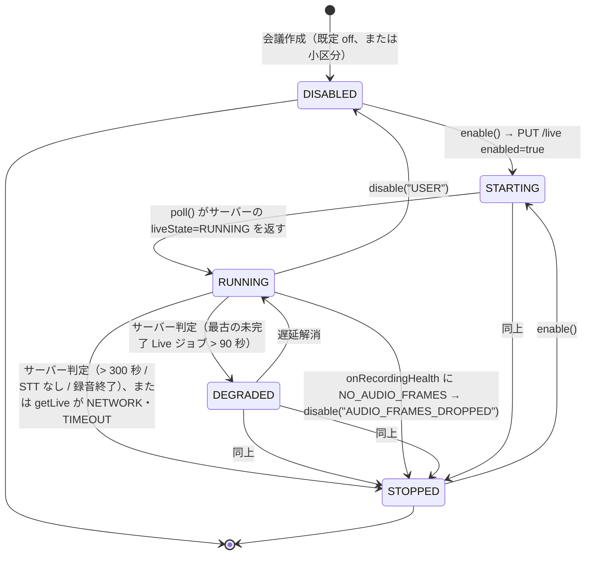

# 議事録Webアプリケーション Phase 3 詳細設計書 ── ブラウザ側（TypeScript）

**対象:** Phase 1・Phase 2 詳細設計のブラウザ側コードに対する Phase 3 の追加・変更。Live Transcript ペイン／話者名の割当／言語バッジ／欠損 Chunk の逆同期／LAN モード（許可ホストと HTTPS）／Live STT の負荷監視。
**上位文書:** Phase 3 詳細設計書 ── サーバー側（`design-local-phase3-server.md`）§2 の設計判断と §20 の API。
**制約:** Phase 1・2 と同じ（ブラウザ標準 API と TypeScript のみ、UI フレームワーク非依存の状態モデル）。
**検証状態:** 本書の全 `typescript` コードブロック（13 ファイル。うち 2 は Phase 1・2 ファイルの全文差し替え）は Phase 1 → Phase 2 → Phase 3 の順に同じツリーへ抽出され、`tsc --noEmit`（strict）を通過し、Phase 1・2 の 34 テストと本書の 11 テスト（計 15 ファイル 45 件）が vitest で全件通過することを設計時点で確認している（§9）。

---

# 1. 目的と範囲、Phase 2 クライアントからの変更一覧

| ファイル | 種別 | 内容 | 本書 |
| --- | --- | --- | --- |
| `src/api/contracts-phase3.ts` | 新規 | Live / 話者 / 言語 / 利用者の契約型 | §2 |
| `src/api/events.ts` | 変更（全文） | SSE の `live_segment` イベントを受け取り、`onLiveSegment` に振り分ける | §3 |
| `src/live/live-transcript.ts` | 新規 | Live Transcript ペインの状態、`GET /live` のカーソル補完、`NO_AUDIO_FRAMES` での自動停止 | §3 |
| `src/ui/speakers.ts` | 新規 | 話者ラベル → 名前の割当状態と表示 | §4 |
| `src/ui/language.ts` | 新規 | 言語バッジと要約言語設定 | §5 |
| `src/recording/resync.ts` | 新規 | `registered=false` の Chunk を IndexedDB から再送 | §6 |
| `src/api/local-saver.ts` | 変更（全文） | 許可ホストを設定可能にし、HTTPS を許可（LAN モード）。既定は loopback のみ | §7 |
| `src/api/lan-settings.ts` | 新規 | サーバー URL・トークンの検証（非 loopback は HTTPS 必須） | §7 |
| `src/types/recording.ts`、`src/recording/*`、`src/storage/idb.ts`、`src/worklet/*`、`src/audio/*`、`src/notes/*`、`src/ui/state.ts`、`src/api/phase2-client.ts`、`src/api/contracts.ts`、`src/api/contracts-phase2.ts`、`src/api/contracts-summary.ts` | 変更なし | — | — |

`src/api/phase2-client.ts` は変更しない。Phase 3 の新エンドポイント（`/live`、`/speakers`、`/users/me`）は `src/api/phase3-client.ts`（§2.2）に置く。

---

# 2. 契約型と API クライアント

## 2.1 `src/api/contracts-phase3.ts`

サーバー側 §20 と 1 対 1。

```typescript
// src/api/contracts-phase3.ts
import type { LocalBackendCapabilitiesV2, MeetingDetailResponse, MeetingEvent, TranscriptSegmentView } from "./contracts-phase2";

export type LiveState = "DISABLED" | "STARTING" | "RUNNING" | "DEGRADED" | "STOPPED";

export interface LiveSegment {
  readonly id: string;
  readonly source: "mic" | "system";
  readonly startMs: number;
  readonly endMs: number;
  readonly text: string;
  readonly language: string | null;
  readonly confidence: number | null;
  readonly createdAt: number;
}

export interface LiveResponse {
  readonly meetingId: string;
  readonly liveState: LiveState;
  readonly segments: ReadonlyArray<LiveSegment>;
  /** 次回の since に渡す created_at */
  readonly cursor: number;
}

export interface LivePutResponse {
  readonly meetingId: string;
  readonly liveSttEnabled: boolean;
  readonly allowed: boolean;
}

export interface SpeakerEntry {
  readonly label: string;
  readonly name: string | null;
}

export interface SpeakersResponse {
  readonly meetingId: string;
  readonly speakers: ReadonlyArray<SpeakerEntry>;
}

export interface MeetingDetailResponseV3 extends MeetingDetailResponse {
  readonly liveState: LiveState;
  readonly liveSttEnabled: boolean;
  readonly languageRatio: Readonly<Record<string, number>>;
  readonly speakers: ReadonlyArray<SpeakerEntry>;
  readonly diarized: boolean;
  readonly codecs: ReadonlyArray<"wav" | "flac" | "fake">;
}

export interface TranscriptSegmentViewV3 extends TranscriptSegmentView {
  readonly speakerName: string | null;
}

export interface LocalBackendCapabilitiesV3 extends LocalBackendCapabilitiesV2 {
  readonly diarizationAvailable: boolean;
  readonly languageDetectionAvailable: boolean;
  readonly codec: string | null;
  readonly multiUser: boolean;
  readonly tls: boolean;
  readonly liveSttAllowed: boolean;
}

export interface UserMeResponse {
  readonly userId: string;
  readonly name: string;
  readonly multiUser: boolean;
}

/** SSE：サーバー側 §21 handle_live_transcribe が publish する */
export interface LiveSegmentEvent {
  readonly type: "live_segment";
  readonly segment: LiveSegment;
}

export type MeetingEventV3 = MeetingEvent | LiveSegmentEvent;

export function isLiveSegmentEvent(value: unknown): value is LiveSegmentEvent {
  if (typeof value !== "object" || value === null) return false;
  const v = value as { type?: unknown; segment?: unknown };
  if (v.type !== "live_segment" || typeof v.segment !== "object" || v.segment === null) return false;
  const s = v.segment as Record<string, unknown>;
  return typeof s.id === "string" && typeof s.startMs === "number" && typeof s.text === "string" && typeof s.createdAt === "number";
}
```

## 2.2 `src/api/phase3-client.ts`

```typescript
// src/api/phase3-client.ts
import { assertLocalHost } from "./local-saver";
import type { ApiResult } from "./phase2-client";
import type { LivePutResponse, LiveResponse, MeetingDetailResponseV3, SpeakerEntry, SpeakersResponse, UserMeResponse } from "./contracts-phase3";

export interface Phase3ClientConfig {
  readonly baseUrl: string;
  readonly token: string;
  readonly timeoutMs: number;
}

export class Phase3Client {
  private readonly base: URL;

  constructor(private readonly config: Phase3ClientConfig, private readonly fetchImpl: typeof fetch = fetch) {
    this.base = new URL(config.baseUrl);
    assertLocalHost(this.base);
  }

  getMeeting(meetingId: string): Promise<ApiResult<MeetingDetailResponseV3>> {
    return this.request("GET", `/v1/meetings/${encodeURIComponent(meetingId)}`);
  }

  getLive(meetingId: string, since: number): Promise<ApiResult<LiveResponse>> {
    return this.request("GET", `/v1/meetings/${encodeURIComponent(meetingId)}/live?since=${since}`);
  }

  setLive(meetingId: string, enabled: boolean): Promise<ApiResult<LivePutResponse>> {
    return this.request("PUT", `/v1/meetings/${encodeURIComponent(meetingId)}/live`, { enabled });
  }

  getSpeakers(meetingId: string): Promise<ApiResult<SpeakersResponse>> {
    return this.request("GET", `/v1/meetings/${encodeURIComponent(meetingId)}/speakers`);
  }

  putSpeakers(meetingId: string, speakers: ReadonlyArray<SpeakerEntry>): Promise<ApiResult<SpeakersResponse>> {
    return this.request("PUT", `/v1/meetings/${encodeURIComponent(meetingId)}/speakers`, { speakers });
  }

  me(): Promise<ApiResult<UserMeResponse>> {
    return this.request("GET", "/v1/users/me");
  }

  private async request<T>(method: string, path: string, body?: unknown): Promise<ApiResult<T>> {
    const url = new URL(path, this.base);
    assertLocalHost(url);
    const controller = new AbortController();
    const timer = setTimeout(() => controller.abort(), this.config.timeoutMs);
    try {
      const headers: Record<string, string> = { Authorization: `Bearer ${this.config.token}` };
      if (body !== undefined) headers["Content-Type"] = "application/json";
      const res = await this.fetchImpl(url, { method, headers, body: body === undefined ? undefined : JSON.stringify(body), signal: controller.signal, credentials: "omit" });
      const json: unknown = res.status === 204 ? null : await res.json().catch(() => null);
      if (res.ok) return { ok: true, value: json as T, status: res.status };
      const err = (typeof json === "object" && json !== null ? json : {}) as { code?: unknown; error?: unknown };
      return { ok: false, status: res.status, code: typeof err.code === "string" ? err.code : "UNKNOWN", message: typeof err.error === "string" ? err.error : `HTTP ${res.status}` };
    } catch (error) {
      if (error instanceof DOMException && error.name === "AbortError") return { ok: false, status: 0, code: "TIMEOUT", message: `timeout after ${this.config.timeoutMs}ms` };
      return { ok: false, status: 0, code: "NETWORK", message: error instanceof Error ? error.message : String(error) };
    } finally {
      clearTimeout(timer);
    }
  }
}
```

---

# 3. Live Transcript ペイン

## 3.1 SSE クライアント `src/api/events.ts`（変更）

`live_segment` を受け取り `onLiveSegment` に渡す。既存の 5 種は Phase 2 と同じ経路。

```typescript
// src/api/events.ts
import { assertLocalHost } from "./local-saver";
import { isMeetingEvent, jobFromServerRow, type JobListResponse, type MeetingEvent } from "./contracts-phase2";
import { isLiveSegmentEvent, type LiveSegmentEvent } from "./contracts-phase3";

export interface EventSourceLike {
  addEventListener(type: string, listener: (event: MessageEvent<string>) => void): void;
  addEventListener(type: "open" | "error", listener: () => void): void;
  close(): void;
}

export interface EventsClientDeps {
  readonly baseUrl: string;
  readonly createEventSource: (url: URL) => EventSourceLike;
  readonly fetchJobs: () => Promise<JobListResponse>;
  readonly onEvent: (event: MeetingEvent) => void;
  /** Phase 3：Live セグメント。未指定なら捨てる */
  readonly onLiveSegment?: (event: LiveSegmentEvent) => void;
  readonly onError: (error: Error) => void;
}

const EVENT_TYPES = ["job", "meeting_status", "transcript_version", "summary_version", "progress", "live_segment"] as const;

export class MeetingEventsClient {
  private source: EventSourceLike | null = null;
  private everConnected = false;
  private disconnected = false;

  constructor(private readonly deps: EventsClientDeps, private readonly meetingId: string) {}

  connect(): void {
    if (this.source !== null) return;
    const url = new URL(`/v1/meetings/${encodeURIComponent(this.meetingId)}/events`, this.deps.baseUrl);
    assertLocalHost(url);
    const es = this.deps.createEventSource(url);
    this.source = es;
    es.addEventListener("open", () => {
      const isReconnect = this.everConnected && this.disconnected;
      this.everConnected = true;
      this.disconnected = false;
      if (isReconnect) void this.backfill();
    });
    es.addEventListener("error", () => {
      this.disconnected = true;
    });
    for (const type of EVENT_TYPES) {
      es.addEventListener(type, (event: MessageEvent<string>) => this.handle(event.data));
    }
  }

  close(): void {
    this.source?.close();
    this.source = null;
  }

  handle(data: string): void {
    let parsed: unknown;
    try {
      parsed = JSON.parse(data);
    } catch (error) {
      this.deps.onError(error instanceof Error ? error : new Error("invalid SSE payload"));
      return;
    }
    if (isLiveSegmentEvent(parsed)) {
      this.deps.onLiveSegment?.(parsed);
      return;
    }
    const normalized = normalizeEvent(parsed);
    if (normalized === null) return;
    this.deps.onEvent(normalized);
  }

  private async backfill(): Promise<void> {
    try {
      const list = await this.deps.fetchJobs();
      for (const job of list.jobs) this.deps.onEvent({ type: "job", job });
    } catch (error) {
      this.deps.onError(error instanceof Error ? error : new Error(String(error)));
    }
  }
}

export function normalizeEvent(value: unknown): MeetingEvent | null {
  if (typeof value !== "object" || value === null) return null;
  const v = value as Record<string, unknown>;
  if (v.type === "job" && typeof v.job === "object" && v.job !== null) {
    const job = jobFromServerRow(v.job as Record<string, unknown>);
    return job === null ? null : { type: "job", job };
  }
  return isMeetingEvent(value) ? value : null;
}

export function defaultCreateEventSource(url: URL): EventSourceLike {
  return new EventSource(url, { withCredentials: false });
}
```

## 3.2 `src/live/live-transcript.ts`

Live セグメントを SSE と `GET /live?since=` の両方から受け取り、重複を `id` で吸収する。State は表示用にサーバーの `liveState` を写し、`NO_AUDIO_FRAMES` が立ったら Live を自動停止する（Invariant 1・8）。



どの遷移も録音経路（Phase 1 §15〜§17）には触れない。`STOPPED` は「Live のプレビューが止まった」状態であり、録音・保存・確定 STT はそのまま進む。

```typescript
// src/live/live-transcript.ts
import type { ApiResult } from "../api/phase2-client";
import type { LivePutResponse, LiveResponse, LiveSegment, LiveSegmentEvent, LiveState } from "../api/contracts-phase3";
import type { DegradedReason } from "../types/recording";

export type LiveStopReason = "SERVER" | "AUDIO_FRAMES_DROPPED" | "USER" | null;

export interface LiveTranscriptState {
  readonly meetingId: string;
  readonly enabled: boolean;
  readonly state: LiveState;
  readonly stopReason: LiveStopReason;
  readonly segments: ReadonlyArray<LiveSegment>;
  readonly cursor: number;
  readonly lastUpdatedAt: number | null;
}

export interface LiveTranscriptDeps {
  readonly getLive: (meetingId: string, since: number) => Promise<ApiResult<LiveResponse>>;
  readonly setLive: (meetingId: string, enabled: boolean) => Promise<ApiResult<LivePutResponse>>;
  readonly now: () => number;
  readonly onChange: (state: LiveTranscriptState) => void;
}

export class LiveTranscriptStore {
  private state: LiveTranscriptState;
  private readonly byId = new Map<string, LiveSegment>();

  constructor(private readonly deps: LiveTranscriptDeps, meetingId: string, initial: { enabled: boolean; state: LiveState }) {
    this.state = { meetingId, enabled: initial.enabled, state: initial.state, stopReason: null, segments: [], cursor: 0, lastUpdatedAt: null };
  }

  get current(): LiveTranscriptState {
    return this.state;
  }

  /** SSE から。 */
  applyEvent(event: LiveSegmentEvent): void {
    this.upsert([event.segment]);
    this.set({ lastUpdatedAt: this.deps.now() });
  }

  /** 再接続後や定期的な補完。cursor 以降だけ取る。 */
  async poll(): Promise<void> {
    const res = await this.deps.getLive(this.state.meetingId, this.state.cursor);
    if (!res.ok) {
      if (res.code === "NETWORK" || res.code === "TIMEOUT") this.set({ state: "STOPPED", stopReason: "SERVER" });
      return;
    }
    this.upsert(res.value.segments);
    this.set({ state: res.value.liveState, cursor: Math.max(this.state.cursor, res.value.cursor), lastUpdatedAt: this.deps.now(),
               stopReason: res.value.liveState === "STOPPED" && this.state.stopReason === null ? "SERVER" : this.state.stopReason });
  }

  async enable(): Promise<boolean> {
    const res = await this.deps.setLive(this.state.meetingId, true);
    if (!res.ok || !res.value.liveSttEnabled) {
      this.set({ enabled: false, state: "DISABLED" });
      return false;
    }
    this.set({ enabled: true, state: "STARTING", stopReason: null });
    return true;
  }

  async disable(reason: LiveStopReason): Promise<void> {
    await this.deps.setLive(this.state.meetingId, false);
    this.set({ enabled: false, state: reason === "USER" ? "DISABLED" : "STOPPED", stopReason: reason });
  }

  /**
   * RecordingHealth の degradedReasons を渡す。NO_AUDIO_FRAMES が立ったら Live を止める。
   * 録音側の判定（Phase 1 §19）はフレーム基準であり、Live の停止は録音に影響しない。
   */
  async onRecordingHealth(reasons: ReadonlyArray<DegradedReason>): Promise<boolean> {
    if (!this.state.enabled) return false;
    if (!reasons.includes("NO_AUDIO_FRAMES")) return false;
    await this.disable("AUDIO_FRAMES_DROPPED");
    return true;
  }

  private upsert(segments: ReadonlyArray<LiveSegment>): void {
    for (const s of segments) this.byId.set(s.id, s);
    const sorted = [...this.byId.values()].sort((a, b) => a.startMs - b.startMs || a.source.localeCompare(b.source));
    this.state = { ...this.state, segments: sorted };
  }

  private set(patch: Partial<LiveTranscriptState>): void {
    this.state = { ...this.state, ...patch };
    this.deps.onChange(this.state);
  }
}

/** ヘッダ表示用。 */
export function liveBanner(state: LiveTranscriptState): string | null {
  switch (state.state) {
    case "DISABLED":
      return null;
    case "STARTING":
      return "Live 文字起こし：開始待ち";
    case "RUNNING":
      return "Live 文字起こし：実行中（プレビュー。確定版は会議終了後）";
    case "DEGRADED":
      return "Live 文字起こし：遅延しています。録音は継続中";
    case "STOPPED":
      return state.stopReason === "AUDIO_FRAMES_DROPPED"
        ? "Live 文字起こしを停止しました（録音への影響を避けるため）。録音は継続中"
        : "Live 文字起こし：停止。録音は継続中";
  }
}
```

BlockNote への直接挿入は行わない（v4.0 §83）。Live ペインは表示専用で、確定 transcript からの「議事録へ追加」操作のみがノートを変更する。

---

# 4. 話者名の割当 `src/ui/speakers.ts`

```typescript
// src/ui/speakers.ts
import type { SpeakerEntry } from "../api/contracts-phase3";

export interface SpeakersState {
  readonly entries: ReadonlyArray<SpeakerEntry>;
  /** 未保存の編集（label → name） */
  readonly drafts: Readonly<Record<string, string>>;
  readonly dirty: boolean;
}

export const INITIAL_SPEAKERS: SpeakersState = { entries: [], drafts: {}, dirty: false };

export type SpeakersAction =
  | { readonly type: "loaded"; readonly entries: ReadonlyArray<SpeakerEntry> }
  | { readonly type: "edit"; readonly label: string; readonly name: string }
  | { readonly type: "saved"; readonly entries: ReadonlyArray<SpeakerEntry> }
  | { readonly type: "discard" };

export function reduceSpeakers(state: SpeakersState, action: SpeakersAction): SpeakersState {
  switch (action.type) {
    case "loaded":
      return { entries: action.entries, drafts: {}, dirty: false };
    case "edit": {
      const current = state.entries.find((e) => e.label === action.label)?.name ?? "";
      const drafts = { ...state.drafts };
      if (action.name.trim() === current) delete drafts[action.label];
      else drafts[action.label] = action.name;
      return { ...state, drafts, dirty: Object.keys(drafts).length > 0 };
    }
    case "saved":
      return { entries: action.entries, drafts: {}, dirty: false };
    case "discard":
      return { ...state, drafts: {}, dirty: false };
  }
}

/** PUT /speakers の本文。空文字は null（名前を外す）。 */
export function toPutBody(state: SpeakersState): SpeakerEntry[] {
  return Object.entries(state.drafts).map(([label, name]) => ({ label, name: name.trim() === "" ? null : name.trim() }));
}

/** transcript 行の話者表示。名前がなければラベルのみ。ラベルもなければ経路（[mic] / [system]）だけ。 */
export function displaySpeaker(speakerId: string | null, speakerName: string | null, drafts: Readonly<Record<string, string>>): string | null {
  if (speakerId === null) return null;
  const draft = drafts[speakerId];
  // 下書きがあればそれを優先する。空文字の下書きは「名前を外す」なのでラベルのみ表示
  const name = draft !== undefined ? (draft.trim() === "" ? null : draft.trim()) : speakerName;
  return name ? `${speakerId}:${name}` : speakerId;
}
```

話者の「名前」は利用者だけが付ける。AI が推定した名前を drafts に流し込む経路は存在しない（Invariant 9）。

---

# 5. 言語バッジと要約言語 `src/ui/language.ts`

```typescript
// src/ui/language.ts
export type Language = "ja" | "en";

export interface LanguageView {
  readonly primary: Language | null;
  readonly primaryShare: number;
  readonly mixed: boolean;
  readonly ratio: Readonly<Record<string, number>>;
}

export const DOMINANT_RATIO = 0.6;

export function languageView(ratio: Readonly<Record<string, number>>, dominant = DOMINANT_RATIO): LanguageView {
  const entries = Object.entries(ratio);
  if (entries.length === 0) return { primary: null, primaryShare: 0, mixed: false, ratio };
  const [lang, share] = entries.reduce((best, cur) => (cur[1] > best[1] ? cur : best));
  const primary = lang === "ja" || lang === "en" ? lang : null;
  return { primary, primaryShare: share, mixed: share < dominant, ratio };
}

/** セグメントごとのバッジ。会議の主言語と同じなら表示しない（混在時のみ目立たせる）。 */
export function languageBadge(segmentLanguage: string | null, view: LanguageView): string | null {
  if (segmentLanguage === null) return null;
  if (!view.mixed && segmentLanguage === view.primary) return null;
  return segmentLanguage.toUpperCase();
}

/** 設定画面：要約言語の選択肢と既定。混在でなければ主言語に固定（サーバー側 §21 _summary_language と同じ規則）。 */
export function summaryLanguageOptions(view: LanguageView, setting: Language): { readonly effective: Language; readonly selectable: boolean } {
  if (view.primary !== null && !view.mixed) return { effective: view.primary, selectable: false };
  return { effective: setting, selectable: true };
}
```

---

# 6. 欠損 Chunk の逆同期 `src/recording/resync.ts`

サーバー側 §20.2 の `registered=false` を見て、IndexedDB に Blob が残っている Chunk を再送する。Phase 1 §26 の Blob 保持期間内に限る。

```typescript
// src/recording/resync.ts
import type { ChunkListResponse } from "../api/contracts";
import { assertLocalHost } from "../api/local-saver";
import type { ChunkStore } from "../storage/idb";
import type { LocalSaveScheduler } from "./local-save-scheduler";
import { makeChunkKey } from "./recording-controller";

export interface ResyncDeps {
  readonly chunkStore: ChunkStore;
  readonly scheduler: LocalSaveScheduler;
  readonly baseUrl: string;
  readonly token: string;
  readonly fetchImpl?: typeof fetch;
}

export interface ResyncReport {
  readonly missingOnServer: number;
  readonly requeued: number;
  /** IndexedDB に Blob がなく再送できない Chunk */
  readonly unavailable: ReadonlyArray<string>;
}

export async function resyncMissingChunks(deps: ResyncDeps, meetingId: string): Promise<ResyncReport> {
  const fetchImpl = deps.fetchImpl ?? fetch;
  const url = new URL(`/v1/meetings/${encodeURIComponent(meetingId)}/chunks`, deps.baseUrl);
  assertLocalHost(url);
  const res = await fetchImpl(url, { headers: { Authorization: `Bearer ${deps.token}` }, credentials: "omit" });
  if (!res.ok) throw new Error(`chunk list HTTP ${res.status}`);
  const list = (await res.json()) as ChunkListResponse;
  const missing = list.chunks.filter((c) => !c.registered);
  let requeued = 0;
  const unavailable: string[] = [];
  for (const c of missing) {
    const key = makeChunkKey(meetingId, c.source, c.sequenceNo);
    const record = await deps.chunkStore.getChunk(key);
    if (record === undefined || record.wav === null) {
      unavailable.push(key);
      continue;
    }
    await deps.chunkStore.updateSaveState(key, (r) => {
      r.save.status = "LOCAL_SAVE_PENDING";
      r.save.savedVia = null;
      r.save.serverPath = null;
    });
    await deps.scheduler.enqueue(key);
    requeued++;
  }
  return { missingOnServer: missing.length, requeued, unavailable };
}
```

再送は Phase 1 の `LocalSaver` と同じ PUT であり、サーバーは同一 sha256 なら `200` で受け入れ `verified` に戻す（サーバー側 §20.2）。Blob がない Chunk は UI に「録音の一部が復元できません」と表示する。

---

# 7. LAN モード：許可ホストと HTTPS

## 7.1 `src/api/local-saver.ts`（変更）

Phase 1 §17.1 の全文に、許可ホストの設定関数を加える。既定は loopback のみで、Phase 1・2 の挙動は変わらない。

```typescript
// src/api/local-saver.ts
import { encodeChunkMetaHeader, isChunkResponse, type ApiErrorBody } from "./contracts";
import type { AudioChunkRecord, LocalSaveError, LocalSaveErrorKind } from "../types/recording";

const LOOPBACK_HOSTS: ReadonlyArray<string> = ["127.0.0.1", "localhost", "[::1]"];
let allowedHosts: ReadonlySet<string> = new Set(LOOPBACK_HOSTS);

/**
 * Phase 3：LAN モードでサーバーのホスト名を許可する。loopback は常に含まれる。
 * 非 loopback は https のみ（トークンを平文で流さない）。設定は起動時に 1 回だけ行う。
 */
export function configureAllowedHosts(extraHosts: ReadonlyArray<string>): void {
  allowedHosts = new Set([...LOOPBACK_HOSTS, ...extraHosts.map((h) => h.trim().toLowerCase()).filter((h) => h !== "")]);
}

export function resetAllowedHosts(): void {
  allowedHosts = new Set(LOOPBACK_HOSTS);
}

export function isLoopback(hostname: string): boolean {
  return LOOPBACK_HOSTS.includes(hostname.toLowerCase());
}

/** 外部ホストへの通信を実装レベルで遮断する（CSP の二重防御、Phase 1 §4.4）。 */
export function assertLocalHost(url: URL): void {
  if (url.protocol !== "http:" && url.protocol !== "https:") {
    throw new Error(`disallowed protocol: ${url.protocol}`);
  }
  const host = url.hostname.toLowerCase();
  if (!allowedHosts.has(host)) {
    throw new Error(`disallowed host: ${url.hostname}`);
  }
  if (!isLoopback(host) && url.protocol !== "https:") {
    throw new Error(`non-loopback host requires https: ${url.hostname}`);
  }
}

export interface LocalSaverConfig {
  readonly baseUrl: string;
  readonly token: string;
  readonly requestTimeoutMs: number;
}

export type SaveOutcome =
  | { readonly ok: true; readonly registered: boolean; readonly serverPath: string; readonly idempotent: boolean }
  | { readonly ok: false; readonly error: LocalSaveError; readonly retryable: boolean };

const RETRYABLE: ReadonlySet<LocalSaveErrorKind> = new Set(["NETWORK", "TIMEOUT", "SERVER", "STORAGE_FULL", "HASH_MISMATCH", "UNKNOWN"]);

export class LocalSaver {
  private readonly base: URL;

  constructor(private readonly config: LocalSaverConfig, private readonly fetchImpl: typeof fetch = fetch) {
    this.base = new URL(config.baseUrl);
    assertLocalHost(this.base);
  }

  async put(record: AudioChunkRecord): Promise<SaveOutcome> {
    if (record.wav === null) {
      return this.fail("VALIDATION", "wav blob already dropped", null);
    }
    const { meetingId, source, sequenceNo } = record.meta;
    const url = new URL(`/v1/meetings/${encodeURIComponent(meetingId)}/chunks/${source}/${sequenceNo}`, this.base);
    assertLocalHost(url);

    const controller = new AbortController();
    const timer = setTimeout(() => controller.abort(), this.config.requestTimeoutMs);
    try {
      const response = await this.fetchImpl(url, {
        method: "PUT",
        headers: {
          Authorization: `Bearer ${this.config.token}`,
          "Content-Type": "audio/wav",
          "X-Chunk-SHA256": record.meta.sha256,
          "X-Chunk-Meta": encodeChunkMetaHeader(record.meta),
        },
        body: record.wav,
        signal: controller.signal,
        credentials: "omit",
      });
      return await this.interpret(response, record);
    } catch (error) {
      if (error instanceof DOMException && error.name === "AbortError") {
        return this.fail("TIMEOUT", `timeout after ${this.config.requestTimeoutMs}ms`, null);
      }
      if (error instanceof TypeError) {
        return this.fail("NETWORK", error.message, null);
      }
      return this.fail("UNKNOWN", error instanceof Error ? error.message : String(error), null);
    } finally {
      clearTimeout(timer);
    }
  }

  private async interpret(response: Response, record: AudioChunkRecord): Promise<SaveOutcome> {
    const status = response.status;
    if (status === 200 || status === 201) {
      const body: unknown = await response.json().catch(() => null);
      if (!isChunkResponse(body)) {
        return this.fail("SERVER", "malformed ChunkResponse", status);
      }
      if (body.sha256 !== record.meta.sha256 || body.sizeBytes !== record.meta.sizeBytes) {
        return this.fail("HASH_MISMATCH", `server=${body.sha256}/${body.sizeBytes} local=${record.meta.sha256}/${record.meta.sizeBytes}`, status);
      }
      return { ok: true, registered: body.registered, serverPath: body.path, idempotent: status === 200 };
    }
    const errBody: unknown = await response.json().catch(() => null);
    const detail = isApiErrorBody(errBody) ? `${errBody.code}: ${errBody.error}` : `HTTP ${status}`;
    if (status === 401 || status === 403) return this.fail("UNAUTHORIZED", detail, status);
    if (status === 409) return this.fail("CONFLICT", detail, status);
    if (status === 400 || status === 422) return this.fail("VALIDATION", detail, status);
    if (status === 507) return this.fail("STORAGE_FULL", detail, status);
    if (status >= 500) return this.fail("SERVER", detail, status);
    return this.fail("UNKNOWN", detail, status);
  }

  private fail(kind: LocalSaveErrorKind, message: string, httpStatus: number | null): SaveOutcome {
    return { ok: false, error: { kind, message, httpStatus, at: performance.now() }, retryable: RETRYABLE.has(kind) };
  }
}

function isApiErrorBody(value: unknown): value is ApiErrorBody {
  if (typeof value !== "object" || value === null) return false;
  const v = value as Record<string, unknown>;
  return typeof v.error === "string" && typeof v.code === "string";
}
```

CSP の `connect-src` は、サーバーがアプリを配信する構成では `'self'` が LAN ホストを含むため変更不要（サーバー側 §2.5）。

## 7.2 `src/api/lan-settings.ts`

```typescript
// src/api/lan-settings.ts
import { configureAllowedHosts, isLoopback } from "./local-saver";

export interface ServerConnection {
  readonly baseUrl: string;
  readonly token: string;
}

export type ConnectionValidation =
  | { readonly ok: true; readonly url: URL; readonly lan: boolean }
  | { readonly ok: false; readonly reason: "INVALID_URL" | "BAD_PROTOCOL" | "LAN_REQUIRES_HTTPS" | "EMPTY_TOKEN" };

/** 設定画面の検証。LAN（非 loopback）は https 必須。 */
export function validateConnection(conn: ServerConnection): ConnectionValidation {
  let url: URL;
  try {
    url = new URL(conn.baseUrl);
  } catch {
    return { ok: false, reason: "INVALID_URL" };
  }
  if (url.protocol !== "http:" && url.protocol !== "https:") return { ok: false, reason: "BAD_PROTOCOL" };
  const lan = !isLoopback(url.hostname);
  if (lan && url.protocol !== "https:") return { ok: false, reason: "LAN_REQUIRES_HTTPS" };
  if (conn.token.trim() === "") return { ok: false, reason: "EMPTY_TOKEN" };
  return { ok: true, url, lan };
}

/** 検証を通った接続先だけを許可ホストに登録する。 */
export function applyConnection(conn: ServerConnection): ConnectionValidation {
  const v = validateConnection(conn);
  if (v.ok) configureAllowedHosts(v.lan ? [v.url.hostname] : []);
  return v;
}
```

---

# 8. Live STT の負荷監視

Live 有効中は `RecordingHealth.degradedReasons` を Chunk 生成イベントごとに `LiveTranscriptStore.onRecordingHealth` へ渡す。`NO_AUDIO_FRAMES`（5 秒以上フレームが来ない、Phase 1 §19）が立ったら Live を止め、録音は継続する。判定はタイマーではなくフレーム基準のままである（Invariant 8）。Live を止めても録音・IndexedDB・保存経路は一切変わらない（Invariant 1）。実測項目：Live 有効時に `NO_AUDIO_FRAMES` が発生する頻度（サーバー側 §3）。

---

# 9. テストコード

Phase 1・2 のハーネスを流用する。

```typescript
// test/live-transcript.test.ts
import { describe, expect, it } from "vitest";
import { LiveTranscriptStore, liveBanner, type LiveTranscriptState } from "../src/live/live-transcript";
import type { LiveResponse, LiveSegment } from "../src/api/contracts-phase3";
import type { ApiResult } from "../src/api/phase2-client";

const seg = (id: string, startMs: number, createdAt: number): LiveSegment =>
  ({ id, source: "mic", startMs, endMs: startMs + 5000, text: id, language: "ja", confidence: 0.8, createdAt });

function build(opts: { serverState?: LiveResponse["liveState"]; offline?: boolean } = {}) {
  let now = 1000;
  const states: LiveTranscriptState[] = [];
  const setCalls: boolean[] = [];
  let served: LiveSegment[] = [];
  const deps = {
    getLive: async (_m: string, since: number): Promise<ApiResult<LiveResponse>> =>
      opts.offline
        ? { ok: false, status: 0, code: "NETWORK", message: "down" }
        : { ok: true, status: 200, value: { meetingId: "m", liveState: opts.serverState ?? "RUNNING", segments: served.filter((s) => s.createdAt > since), cursor: Math.max(since, ...served.map((s) => s.createdAt)) } },
    setLive: async (_m: string, enabled: boolean) => {
      setCalls.push(enabled);
      return { ok: true as const, status: 200, value: { meetingId: "m", liveSttEnabled: enabled, allowed: true } };
    },
    now: () => now,
    onChange: (s: LiveTranscriptState) => states.push(s),
  };
  const store = new LiveTranscriptStore(deps, "m", { enabled: true, state: "STARTING" });
  return { store, states, setCalls, serve: (s: LiveSegment[]) => (served = s), tick: (ms: number) => (now += ms) };
}

describe("LiveTranscriptStore", () => {
  it("SSE と poll の両方から受け取り、id で重複を吸収し startMs 順に並べる", async () => {
    const b = build();
    b.store.applyEvent({ type: "live_segment", segment: seg("b", 5000, 20) });
    b.store.applyEvent({ type: "live_segment", segment: seg("a", 0, 10) });
    b.serve([seg("a", 0, 10), seg("b", 5000, 20), seg("c", 10000, 30)]);
    await b.store.poll();
    expect(b.store.current.segments.map((s) => s.id)).toEqual(["a", "b", "c"]);
    expect(b.store.current.cursor).toBe(30);
    expect(b.store.current.state).toBe("RUNNING");
    b.serve([seg("d", 15000, 40)]);
    await b.store.poll();
    expect(b.store.current.segments).toHaveLength(4);
  });

  it("サーバー不達で STOPPED（SERVER）、有効化に成功すると STARTING", async () => {
    const b = build({ offline: true });
    await b.store.poll();
    expect(b.store.current.state).toBe("STOPPED");
    expect(b.store.current.stopReason).toBe("SERVER");
    expect(await b.store.enable()).toBe(true);
    expect(b.store.current.state).toBe("STARTING");
    expect(b.setCalls).toEqual([true]);
  });

  it("NO_AUDIO_FRAMES で Live を自動停止し、録音側の理由には触れない", async () => {
    const b = build();
    expect(await b.store.onRecordingHealth(["BACKEND_UNREACHABLE"])).toBe(false);
    expect(await b.store.onRecordingHealth(["NO_AUDIO_FRAMES"])).toBe(true);
    expect(b.store.current.enabled).toBe(false);
    expect(b.store.current.stopReason).toBe("AUDIO_FRAMES_DROPPED");
    expect(b.setCalls).toEqual([false]);
    expect(liveBanner(b.store.current)).toMatch(/録音は継続中/);
    expect(await b.store.onRecordingHealth(["NO_AUDIO_FRAMES"])).toBe(false);   // 既に無効なら何もしない
  });

  it("バナー文言", () => {
    const base: LiveTranscriptState = { meetingId: "m", enabled: true, state: "RUNNING", stopReason: null, segments: [], cursor: 0, lastUpdatedAt: null };
    expect(liveBanner({ ...base, state: "DISABLED" })).toBeNull();
    expect(liveBanner({ ...base, state: "DEGRADED" })).toMatch(/遅延/);
    expect(liveBanner({ ...base, state: "STOPPED", stopReason: "SERVER" })).toMatch(/停止/);
  });
});
```

```typescript
// test/events-live.test.ts
import { describe, expect, it } from "vitest";
import { MeetingEventsClient, type EventSourceLike } from "../src/api/events";
import type { LiveSegmentEvent } from "../src/api/contracts-phase3";
import type { MeetingEvent } from "../src/api/contracts-phase2";

class FakeEventSource implements EventSourceLike {
  readonly listeners = new Map<string, Array<(e: MessageEvent<string>) => void>>();
  addEventListener(type: string, listener: (e: MessageEvent<string>) => void): void {
    this.listeners.set(type, [...(this.listeners.get(type) ?? []), listener]);
  }
  close(): void {
    return;
  }
  emit(type: string, data?: string): void {
    for (const l of this.listeners.get(type) ?? []) l({ data } as MessageEvent<string>);
  }
}

describe("SSE live_segment の振り分け", () => {
  it("live_segment は onLiveSegment に、他は onEvent に届く", () => {
    let es: FakeEventSource | null = null;
    const events: MeetingEvent[] = [];
    const live: LiveSegmentEvent[] = [];
    const client = new MeetingEventsClient({
      baseUrl: "http://127.0.0.1:43117",
      createEventSource: () => (es = new FakeEventSource()),
      fetchJobs: async () => ({ meetingId: "m", jobs: [], counts: { pending: 0, leased: 0, processing: 0, retrying: 0, completed: 0, failed: 0, cancelled: 0 } }),
      onEvent: (e) => events.push(e),
      onLiveSegment: (e) => live.push(e),
      onError: (e) => {
        throw e;
      },
    }, "m");
    client.connect();
    const source = es as unknown as FakeEventSource;
    source.emit("live_segment", JSON.stringify({ type: "live_segment", segment: { id: "s1", source: "mic", startMs: 0, endMs: 5000, text: "x", language: "ja", confidence: 0.9, createdAt: 10 } }));
    source.emit("meeting_status", JSON.stringify({ type: "meeting_status", status: "recording" }));
    source.emit("live_segment", JSON.stringify({ type: "live_segment", segment: { id: 1 } }));   // 型不正は捨てる
    expect(live.map((e) => e.segment.id)).toEqual(["s1"]);
    expect(events).toEqual([{ type: "meeting_status", status: "recording" }]);
  });
});
```

```typescript
// test/speakers-language.test.ts
import { describe, expect, it } from "vitest";
import { INITIAL_SPEAKERS, displaySpeaker, reduceSpeakers, toPutBody } from "../src/ui/speakers";
import { languageBadge, languageView, summaryLanguageOptions } from "../src/ui/language";

describe("話者名の割当", () => {
  it("編集は drafts に溜まり、保存本文は変更分だけ。空文字は名前を外す", () => {
    let s = reduceSpeakers(INITIAL_SPEAKERS, { type: "loaded", entries: [{ label: "S1", name: null }, { label: "S2", name: "佐藤" }] });
    s = reduceSpeakers(s, { type: "edit", label: "S1", name: "田中" });
    s = reduceSpeakers(s, { type: "edit", label: "S2", name: "佐藤" });        // 変更なし → draft に入らない
    expect(s.dirty).toBe(true);
    expect(toPutBody(s)).toEqual([{ label: "S1", name: "田中" }]);
    s = reduceSpeakers(s, { type: "edit", label: "S2", name: "" });
    expect(toPutBody(s)).toEqual([{ label: "S1", name: "田中" }, { label: "S2", name: null }]);
    expect(displaySpeaker("S1", null, s.drafts)).toBe("S1:田中");
    expect(displaySpeaker("S2", "佐藤", s.drafts)).toBe("S2");                 // 下書きで名前を外した
    expect(displaySpeaker("S3", null, s.drafts)).toBe("S3");
    expect(displaySpeaker(null, null, s.drafts)).toBeNull();
    s = reduceSpeakers(s, { type: "saved", entries: [{ label: "S1", name: "田中" }, { label: "S2", name: null }] });
    expect(s.dirty).toBe(false);
  });
});

describe("言語バッジと要約言語", () => {
  it("主言語 ≥ 0.6 なら混在でなく、主言語セグメントにはバッジを出さない", () => {
    const v = languageView({ ja: 0.8, en: 0.2 });
    expect(v).toMatchObject({ primary: "ja", mixed: false });
    expect(languageBadge("ja", v)).toBeNull();
    expect(languageBadge("en", v)).toBe("EN");
    expect(summaryLanguageOptions(v, "en")).toEqual({ effective: "ja", selectable: false });
  });
  it("混在なら全セグメントにバッジ、要約言語は設定で選べる", () => {
    const v = languageView({ ja: 0.5, en: 0.5 });
    expect(v.mixed).toBe(true);
    expect(languageBadge("ja", v)).toBe("JA");
    expect(summaryLanguageOptions(v, "en")).toEqual({ effective: "en", selectable: true });
    expect(languageView({})).toEqual({ primary: null, primaryShare: 0, mixed: false, ratio: {} });
  });
});
```

```typescript
// test/resync-lan.test.ts
import { afterEach, describe, expect, it } from "vitest";
import { createHarness, makeChunkRecord, BASE_URL, TOKEN } from "./harness";
import { resyncMissingChunks } from "../src/recording/resync";
import { assertLocalHost, configureAllowedHosts, resetAllowedHosts } from "../src/api/local-saver";
import { applyConnection, validateConnection } from "../src/api/lan-settings";

describe("欠損 Chunk の逆同期", () => {
  it("registered=false の Chunk を IndexedDB の Blob から再送し、Blob がないものは報告する", async () => {
    const h = await createHarness();
    const meetingId = "m-resync";
    const r0 = await makeChunkRecord(meetingId, 0);
    const r1 = await makeChunkRecord(meetingId, 1);
    await h.chunkStore.putChunk(r0);
    await h.chunkStore.putChunk(r1);
    await h.scheduler.enqueue(r0.chunkKey);
    await h.scheduler.enqueue(r1.chunkKey);
    for (let i = 0; i < 10; i++) await h.advance(100);
    await h.chunkStore.dropBlob(r1.chunkKey);                                    // クォータ縮退で Blob 済み
    // サーバー側でファイルが失われた状態を再現：一覧で registered=false を返す
    const original = h.server.fetch;
    const fetchWithMissing: typeof fetch = async (input, init) => {
      const res = await original(input, init);
      const url = typeof input === "string" ? input : input instanceof URL ? input.href : input.url;
      if (url.endsWith("/chunks") && (!init?.method || init.method === "GET")) {
        const body = (await res.json()) as { meetingId: string; chunks: Array<{ sequenceNo: number; registered: boolean }> };
        body.chunks = body.chunks.map((c) => ({ ...c, registered: false }));
        return new Response(JSON.stringify(body), { status: 200 });
      }
      return res;
    };
    const putsBefore = h.server.putCount;
    const report = await resyncMissingChunks({ chunkStore: h.chunkStore, scheduler: h.scheduler, baseUrl: BASE_URL, token: TOKEN, fetchImpl: fetchWithMissing }, meetingId);
    expect(report).toEqual({ missingOnServer: 2, requeued: 1, unavailable: [r1.chunkKey] });
    for (let i = 0; i < 10; i++) await h.advance(100);
    expect(h.server.putCount).toBe(putsBefore + 1);
    expect((await h.chunkStore.getChunk(r0.chunkKey))?.save.status).toBe("DB_REGISTERED");
  });
});

describe("LAN モードの許可ホスト", () => {
  afterEach(() => resetAllowedHosts());

  it("既定は loopback のみ。LAN ホストは設定後、かつ https のみ", () => {
    expect(() => assertLocalHost(new URL("http://127.0.0.1:43117/v1/health"))).not.toThrow();
    expect(() => assertLocalHost(new URL("https://minutes.local:43117/v1/health"))).toThrow(/disallowed host/);
    configureAllowedHosts(["minutes.local"]);
    expect(() => assertLocalHost(new URL("https://minutes.local:43117/v1/health"))).not.toThrow();
    expect(() => assertLocalHost(new URL("http://minutes.local:43117/v1/health"))).toThrow(/requires https/);
    expect(() => assertLocalHost(new URL("https://example.com/"))).toThrow(/disallowed host/);
    expect(() => assertLocalHost(new URL("http://127.0.0.1:43117/"))).not.toThrow();   // loopback は常に可
  });

  it("接続設定の検証：非 loopback は https 必須、トークン必須", () => {
    expect(validateConnection({ baseUrl: "http://127.0.0.1:43117", token: "t" })).toMatchObject({ ok: true, lan: false });
    expect(validateConnection({ baseUrl: "http://192.168.1.10:43117", token: "t" })).toEqual({ ok: false, reason: "LAN_REQUIRES_HTTPS" });
    expect(validateConnection({ baseUrl: "https://192.168.1.10:43117", token: "" })).toEqual({ ok: false, reason: "EMPTY_TOKEN" });
    expect(validateConnection({ baseUrl: "ftp://x", token: "t" })).toEqual({ ok: false, reason: "BAD_PROTOCOL" });
    expect(validateConnection({ baseUrl: "not a url", token: "t" })).toEqual({ ok: false, reason: "INVALID_URL" });
    const applied = applyConnection({ baseUrl: "https://192.168.1.10:43117", token: "t" });
    expect(applied.ok).toBe(true);
    expect(() => assertLocalHost(new URL("https://192.168.1.10:43117/v1/live"))).not.toThrow();
  });
});
```

## 9.1 テストと設計判断の対応

| サーバー側 §2 の判断 | ブラウザ側テスト |
| --- | --- |
| Live は SSE + `GET /live?since=` で補完し、重複は id で吸収 | `live-transcript.test.ts`、`events-live.test.ts` |
| `NO_AUDIO_FRAMES` で Live を自動停止（Invariant 1・8） | `live-transcript.test.ts` |
| 話者名は利用者が付け、AI 由来の名前が入る経路がない | `speakers-language.test.ts` |
| 混在判定 0.6 と要約言語の選択規則 | `speakers-language.test.ts` |
| `registered=false` の逆同期 | `resync-lan.test.ts` |
| LAN は許可ホスト + https 必須、既定は loopback のみ | `resync-lan.test.ts` |
| Phase 1・2 の回帰 | 同じツリーで 34 テストを実行 |

---

# 10. Invariant 対応と Definition of Done（ブラウザ側）

| Invariant | 担保 |
| --- | --- |
| 1 Live STT failure ≠ Recording failure | §3.2 `LiveTranscriptStore` は録音経路（Phase 1 §15〜§17）を参照せず、`disable` は `PUT /live` を呼ぶだけ。`onRecordingHealth` は録音の `degradedReasons` を読むだけで書かない |
| 2 AI failure ≠ Transcript loss | 変更なし |
| 3 STT failure ≠ Recording loss | §6 逆同期は IndexedDB の Blob を再送するだけで削除しない |
| 4 Queue failure ≠ Job metadata loss | 変更なし（§3.1 の再接続補完は Phase 2 と同じ） |
| 5 Duplicate delivery ≠ Duplicate transcript | §3.2 Live セグメントは id で重複排除 |
| 6 AI regeneration ≠ Manual note overwrite | 変更なし。Live ペインはノートに書かない（v4.0 §83） |
| 7 VAD false negative ≠ Original audio loss | 変更なし |
| 8 Browser tab hidden ≠ timer-based recording failure | §8 Live の停止判定はフレーム基準の `NO_AUDIO_FRAMES` に依存し、タイマーを追加しない |
| 9 Speaker source ≠ Speaker identity | §4 `displaySpeaker` はラベルと利用者入力の名前のみを使う |
| 10 Queue ≠ Source of Truth | §6 サーバー側が失った Chunk をブラウザの IndexedDB から復元できる |

| DoD 項目 | 状況 | 担保箇所 |
| --- | --- | --- |
| Live ペインに 30〜60 秒遅れで文字が出る | 設計済・テスト済（統合）・実機（遅延） | §3 |
| Live 有効時に `NO_AUDIO_FRAMES` で自動停止し録音が続く | テスト済（停止）・実機（発生頻度） | §3.2、§8 |
| 話者ラベルに名前を付けて transcript と要約入力に反映 | テスト済 | §4、サーバー側 §23.4 |
| 混在会議で言語バッジと要約言語の選択 | テスト済 | §5 |
| サーバー側で欠損した Chunk を再送して finalize が通る | テスト済 | §6、サーバー側 §23.6 |
| LAN ホストは設定後・https のみ許可、既定は loopback | テスト済・実機（自己署名証明書の受け入れ） | §7 |
| Phase 1・2 のテストが回帰で通る | テスト済 | §9 |

---

*本書のコードは Node 上の vitest で検証済みだが、LAN 越しの `EventSource` 再接続、自己署名証明書のブラウザ受け入れ、Live 有効時の AudioWorklet 負荷は対象ブラウザと 2 台構成の実機でのみ確認できる。§10 の実機項目を通過したものだけを Phase 3 ブラウザ側の完了とする。*
