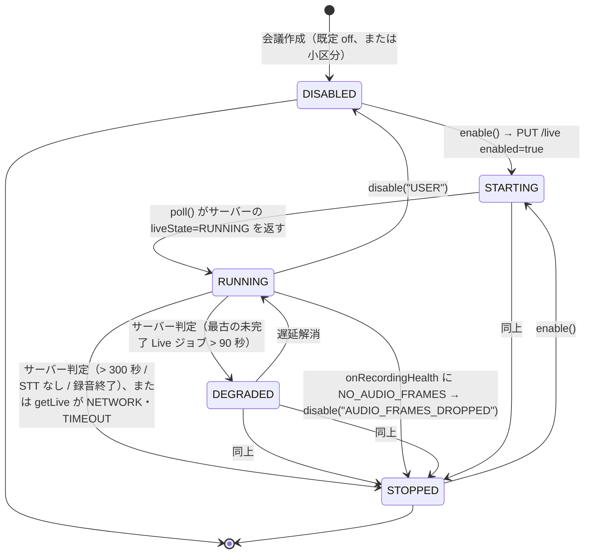

# 議事録Webアプリケーション Phase 3 詳細設計書 ── ブラウザ側（TypeScript）

**対象:** Phase 1・Phase 2 詳細設計のブラウザ側コードに対する Phase 3 の追加・変更。Live Transcript ペイン／話者名の割当／言語バッジ／欠損 Chunk の逆同期／LAN モード（許可ホストと HTTPS）／Live STT の負荷監視。
**上位文書:** Phase 3 詳細設計書 ── サーバー側（`design-local-phase3-server.md`）§2 の設計判断と §20 の API。
**制約:** Phase 1・2 と同じ（ブラウザ標準 API と TypeScript のみ、UI フレームワーク非依存の状態モデル）。
**検証状態:** 本書の全 `typescript` コードブロック（13 ファイル。うち 2 は Phase 1・2 ファイルの全文差し替え）は Phase 1 → Phase 2 → Phase 3 の順に同じツリーへ抽出され、`tsc --noEmit`（strict）を通過し、Phase 1・2 の 41 テストと本書の 18 テスト（計 15 ファイル 59 件）が vitest で全件通過することを設計時点で確認している（§9）。

---

# 1. 目的と範囲、Phase 2 クライアントからの変更一覧

| ファイル | 種別 | 内容 | 本書 |
| --- | --- | --- | --- |
| `src/api/contracts-phase3.ts` | 新規 | Live / 話者 / 言語 / 利用者の契約型 | §2 |
| `src/api/events.ts` | 変更（全文） | SSE の `live_segment` イベントを受け取り、`onLiveSegment` に振り分ける。認証・transport は Phase 2 §8 と同一（`fetch` + Bearer） | §3 |
| `src/live/live-transcript.ts` | 新規 | Live Transcript ペインの状態、`GET /live` のカーソル補完、`NO_AUDIO_FRAMES` での自動停止 | §3 |
| `src/ui/speakers.ts` | 新規 | 話者ラベル → 名前の割当状態と表示 | §4 |
| `src/ui/language.ts` | 新規 | 言語バッジと要約言語設定 | §5 |
| `src/recording/resync.ts` | 新規 | `registered=false` の Chunk を IndexedDB から再送 | §6 |
| `src/api/local-saver.ts` | 変更（全文） | 許可ホストを設定可能にし、HTTPS を許可（LAN モード）。既定は loopback のみ | §7 |
| `src/api/lan-settings.ts` | 新規 | サーバー URL・トークンの検証（非 loopback は HTTPS 必須） | §7 |
| `src/types/recording.ts`、`src/recording/*`、`src/storage/idb.ts`、`src/worklet/*`、`src/audio/*`、`src/notes/*`、`src/ui/state.ts`、`src/api/phase2-client.ts`、`src/api/contracts.ts`、`src/api/contracts-phase2.ts`、`src/api/contracts-summary.ts` | 変更なし | — | — |

`src/api/phase2-client.ts` は変更しない。Phase 3 の新エンドポイント（`/live`、`/speakers`、`/users/me`）は `src/api/phase3-client.ts`（§2.2）に置く。

---

# 2. 契約型と API クライアント

## 2.1 `src/api/contracts-phase3.ts`

サーバー側 §20 と 1 対 1。

```typescript
// src/api/contracts-phase3.ts
import type { LocalBackendCapabilitiesV2, MeetingDetailResponse, MeetingEvent, MeetingStatusV2, TranscriptSegmentView } from "./contracts-phase2";

export type LiveState = "DISABLED" | "STARTING" | "RUNNING" | "DEGRADED" | "STOPPED";

export interface LiveSegment {
  readonly id: string;
  readonly source: "mic" | "system";
  readonly startMs: number;
  readonly endMs: number;
  readonly text: string;
  readonly language: string | null;
  readonly confidence: number | null;
  readonly createdAt: number;
}

export interface LiveResponse {
  readonly meetingId: string;
  readonly liveState: LiveState;
  readonly segments: ReadonlyArray<LiveSegment>;
  /**
   * 次回の since に渡す created_at。サーバー側の検索は since を**含む**（`created_at >= ?`）ため、
   * 境界ミリ秒のセグメントは毎回再送される。
   *
   * created_at は epoch ms であり一意性を保証できない（1 回の live_transcribe ジョブが複数セグメントを
   * 同じ now_ms() で書き込む）。排他境界（`>`）にすると、cursor と同じミリ秒に後から挿入された
   * セグメントを恒久的に取りこぼす。受信側は必ず id で重複排除すること（§3.2 LiveTranscriptStore）。
   */
  readonly cursor: number;
}

export interface LivePutResponse {
  readonly meetingId: string;
  readonly liveSttEnabled: boolean;
  readonly allowed: boolean;
}

export interface SpeakerEntry {
  readonly label: string;
  readonly name: string | null;
}

export interface SpeakersResponse {
  readonly meetingId: string;
  readonly speakers: ReadonlyArray<SpeakerEntry>;
}

export interface MeetingDetailResponseV3 extends MeetingDetailResponse {
  readonly liveState: LiveState;
  readonly liveSttEnabled: boolean;
  readonly languageRatio: Readonly<Record<string, number>>;
  readonly speakers: ReadonlyArray<SpeakerEntry>;
  readonly diarized: boolean;
  readonly codecs: ReadonlyArray<"wav" | "flac" | "fake">;
}

export interface TranscriptSegmentViewV3 extends TranscriptSegmentView {
  readonly speakerName: string | null;
}

export interface LocalBackendCapabilitiesV3 extends LocalBackendCapabilitiesV2 {
  readonly diarizationAvailable: boolean;
  readonly languageDetectionAvailable: boolean;
  readonly codec: string | null;
  readonly multiUser: boolean;
  readonly tls: boolean;
  readonly liveSttAllowed: boolean;
}

export interface UserMeResponse {
  readonly userId: string;
  readonly name: string;
  readonly multiUser: boolean;
}

/** SSE：サーバー側 §21 handle_live_transcribe が publish する */
export interface LiveSegmentEvent {
  readonly type: "live_segment";
  readonly segment: LiveSegment;
}

export type MeetingEventV3 = MeetingEvent | LiveSegmentEvent;

/**
 * LiveSegment の全フィールドを検証する。SSE も GET /live も外部入力であり、
 * 未検証のフィールドは upsert のあと表示や並べ替え（startMs / source）で undefined として現れる。
 * language / confidence は null 可なので「期待する型か null」まで要求し、undefined を通さない。
 */
export function isLiveSegment(value: unknown): value is LiveSegment {
  if (typeof value !== "object" || value === null) return false;
  const s = value as Record<string, unknown>;
  return typeof s.id === "string"
    && (s.source === "mic" || s.source === "system")
    && typeof s.startMs === "number"
    && typeof s.endMs === "number"
    && typeof s.text === "string"
    && (typeof s.language === "string" || s.language === null)
    && (typeof s.confidence === "number" || s.confidence === null)
    && typeof s.createdAt === "number";
}

export function isLiveSegmentEvent(value: unknown): value is LiveSegmentEvent {
  if (typeof value !== "object" || value === null) return false;
  const v = value as { type?: unknown; segment?: unknown };
  return v.type === "live_segment" && isLiveSegment(v.segment);
}

/**
 * エンドポイント別デコーダ。Phase3Client.request() は成功応答をそのまま `as T` で通さず、
 * 必ずここを経由する（§2.2）。とくに segments / speakers は配列であることを確認しないと、
 * 呼び出し側の .filter / .map が TypeError を投げ、結果型で表現したはずの失敗が例外として漏れる。
 * 検証の粒度は「その後の処理が触るフィールド」に合わせ、失敗は null で返す。
 */
function isRecord(value: unknown): value is Record<string, unknown> {
  return typeof value === "object" && value !== null;
}

/**
 * meetingId は「文字列であること」ではなく「**要求した会議のものであること**」を確認する。
 * 型だけを見ると、別会議の応答（サーバー側のルーティング不具合、キャッシュの取り違え、
 * 会議切り替え中に遅れて届いた前の会議の応答）がそのまま通り、LiveTranscriptStore が
 * 別会議のセグメントを表示し、resync が別会議の Chunk 一覧をもとに再送を始める。
 * 呼び出し側は必ず要求時の meetingId を渡す（Phase3Client.request() のクロージャ）。
 */
function isForMeeting(value: Record<string, unknown>, expectedMeetingId: string): boolean {
  return typeof value.meetingId === "string" && value.meetingId === expectedMeetingId;
}

export function decodeLiveResponse(value: unknown, expectedMeetingId: string): LiveResponse | null {
  if (!isRecord(value)) return null;
  if (!isForMeeting(value, expectedMeetingId) || typeof value.cursor !== "number") return null;
  if (!isLiveState(value.liveState)) return null;
  if (!Array.isArray(value.segments) || !value.segments.every(isLiveSegment)) return null;
  return value as unknown as LiveResponse;
}

export function decodeLivePutResponse(value: unknown, expectedMeetingId: string): LivePutResponse | null {
  if (!isRecord(value)) return null;
  if (!isForMeeting(value, expectedMeetingId)) return null;
  if (typeof value.liveSttEnabled !== "boolean" || typeof value.allowed !== "boolean") return null;
  return value as unknown as LivePutResponse;
}

export function decodeSpeakersResponse(value: unknown, expectedMeetingId: string): SpeakersResponse | null {
  if (!isRecord(value) || !isForMeeting(value, expectedMeetingId)) return null;
  if (!Array.isArray(value.speakers) || !value.speakers.every(isSpeakerEntry)) return null;
  return value as unknown as SpeakersResponse;
}

export function decodeUserMeResponse(value: unknown): UserMeResponse | null {
  if (!isRecord(value)) return null;
  if (typeof value.userId !== "string" || typeof value.name !== "string" || typeof value.multiUser !== "boolean") return null;
  return value as unknown as UserMeResponse;
}

/**
 * 会議詳細は Phase 2 の MeetingDetailResponse を継承する。Phase 2 側に型ガードは存在せず、
 * §1 の通り contracts-phase2.ts は変更しないので、ここでは Phase 3 のクライアントコードが
 * 実際に読むフィールドを検証する。`status` と `latestSummaryVersion` は §4 の backfill() が
 * そのまま MeetingEvent に載せて配信するため、未検証のまま通すと壊れた値が
 * イベント経路に入り、失敗地点が受信側まで先送りされる。`chunkCounts` は会議詳細表示が
 * 直接読むので同じ扱いにする。ここを通った値は、これら全フィールドについて形が保証される。
 */
export function decodeMeetingDetailV3(value: unknown, expectedMeetingId: string): MeetingDetailResponseV3 | null {
  if (!isRecord(value)) return null;
  if (!isForMeeting(value, expectedMeetingId) || typeof value.transcriptVersion !== "number") return null;
  if (!isMeetingStatusV2(value.status)) return null;
  if (!(typeof value.latestSummaryVersion === "number" || value.latestSummaryVersion === null)) return null;
  if (!isChunkCounts(value.chunkCounts)) return null;
  if (!isLiveState(value.liveState) || typeof value.liveSttEnabled !== "boolean" || typeof value.diarized !== "boolean") return null;
  if (!isRecord(value.languageRatio) || !Object.values(value.languageRatio).every((n) => typeof n === "number")) return null;
  if (!Array.isArray(value.speakers) || !value.speakers.every(isSpeakerEntry)) return null;
  if (!Array.isArray(value.codecs) || !value.codecs.every((c) => c === "wav" || c === "flac" || c === "fake")) return null;
  return value as unknown as MeetingDetailResponseV3;
}

function isLiveState(value: unknown): value is LiveState {
  return value === "DISABLED" || value === "STARTING" || value === "RUNNING" || value === "DEGRADED" || value === "STOPPED";
}

const MEETING_STATUSES: ReadonlyArray<MeetingStatusV2> =
  ["created", "recording", "finalizing", "finalized", "transcribing", "transcribed", "summarizing", "completed", "failed"];

function isMeetingStatusV2(value: unknown): value is MeetingStatusV2 {
  return typeof value === "string" && (MEETING_STATUSES as ReadonlyArray<string>).includes(value);
}

function isChunkCounts(value: unknown): value is Readonly<Record<"mic" | "system", number>> {
  return isRecord(value) && typeof value.mic === "number" && typeof value.system === "number";
}

function isSpeakerEntry(value: unknown): value is SpeakerEntry {
  if (!isRecord(value)) return false;
  return typeof value.label === "string" && (typeof value.name === "string" || value.name === null);
}
```

## 2.2 `src/api/phase3-client.ts`

```typescript
// src/api/phase3-client.ts
import { assertLocalHost } from "./local-saver";
import type { ApiResult } from "./phase2-client";
import { decodeLivePutResponse, decodeLiveResponse, decodeMeetingDetailV3, decodeSpeakersResponse, decodeUserMeResponse } from "./contracts-phase3";
import type { LivePutResponse, LiveResponse, MeetingDetailResponseV3, SpeakerEntry, SpeakersResponse, UserMeResponse } from "./contracts-phase3";

export interface Phase3ClientConfig {
  readonly baseUrl: string;
  readonly token: string;
  readonly timeoutMs: number;
}

export class Phase3Client {
  private readonly base: URL;

  constructor(private readonly config: Phase3ClientConfig, private readonly fetchImpl: typeof fetch = fetch) {
    this.base = new URL(config.baseUrl);
    assertLocalHost(this.base);
  }

  // デコーダには要求した meetingId を束ねて渡す。応答の meetingId が要求と違う場合は
  // 形が正しくても MALFORMED として落とす（contracts-phase3.ts の isForMeeting）
  getMeeting(meetingId: string): Promise<ApiResult<MeetingDetailResponseV3>> {
    return this.request("GET", `/v1/meetings/${encodeURIComponent(meetingId)}`, (v) => decodeMeetingDetailV3(v, meetingId));
  }

  getLive(meetingId: string, since: number): Promise<ApiResult<LiveResponse>> {
    return this.request("GET", `/v1/meetings/${encodeURIComponent(meetingId)}/live?since=${since}`, (v) => decodeLiveResponse(v, meetingId));
  }

  setLive(meetingId: string, enabled: boolean): Promise<ApiResult<LivePutResponse>> {
    return this.request("PUT", `/v1/meetings/${encodeURIComponent(meetingId)}/live`, (v) => decodeLivePutResponse(v, meetingId), { enabled });
  }

  getSpeakers(meetingId: string): Promise<ApiResult<SpeakersResponse>> {
    return this.request("GET", `/v1/meetings/${encodeURIComponent(meetingId)}/speakers`, (v) => decodeSpeakersResponse(v, meetingId));
  }

  putSpeakers(meetingId: string, speakers: ReadonlyArray<SpeakerEntry>): Promise<ApiResult<SpeakersResponse>> {
    return this.request("PUT", `/v1/meetings/${encodeURIComponent(meetingId)}/speakers`, (v) => decodeSpeakersResponse(v, meetingId), { speakers });
  }

  me(): Promise<ApiResult<UserMeResponse>> {
    return this.request("GET", "/v1/users/me", decodeUserMeResponse);
  }

  /**
   * 成功応答を `json as T` で通すと、サーバーが壊れた本文を返したときに
   * 型だけが通り、実際の失敗は呼び出し側の .filter / .map まで先送りされて TypeError になる。
   * エンドポイントごとのデコーダを必須引数にして、形状不一致をその場で MALFORMED に落とす。
   */
  private async request<T>(method: string, path: string, decode: (value: unknown) => T | null, body?: unknown): Promise<ApiResult<T>> {
    const url = new URL(path, this.base);
    assertLocalHost(url);
    const controller = new AbortController();
    const timer = setTimeout(() => controller.abort(), this.config.timeoutMs);
    try {
      const headers: Record<string, string> = { Authorization: `Bearer ${this.config.token}` };
      if (body !== undefined) headers["Content-Type"] = "application/json";
      const res = await this.fetchImpl(url, { method, headers, body: body === undefined ? undefined : JSON.stringify(body), signal: controller.signal, credentials: "omit", redirect: "error" });
      const json: unknown = res.status === 204 ? null : await res.json().catch(() => null);
      if (res.ok) {
        const value = decode(json);
        if (value === null) return { ok: false, status: res.status, code: "MALFORMED", message: `malformed body for ${method} ${path}` };
        return { ok: true, value, status: res.status };
      }
      const err = (typeof json === "object" && json !== null ? json : {}) as { code?: unknown; error?: unknown };
      return { ok: false, status: res.status, code: typeof err.code === "string" ? err.code : "UNKNOWN", message: typeof err.error === "string" ? err.error : `HTTP ${res.status}` };
    } catch (error) {
      if (error instanceof DOMException && error.name === "AbortError") return { ok: false, status: 0, code: "TIMEOUT", message: `timeout after ${this.config.timeoutMs}ms` };
      return { ok: false, status: 0, code: "NETWORK", message: error instanceof Error ? error.message : String(error) };
    } finally {
      clearTimeout(timer);
    }
  }
}
```

---

# 3. Live Transcript ペイン

## 3.1 SSE クライアント `src/api/events.ts`（変更）

`live_segment` を受け取り `onLiveSegment` に渡す。既存の 5 種は Phase 2 と同じ経路。認証と transport も Phase 2 §8 と同一で、`fetch` + `ReadableStream` に Bearer を載せる。Phase 3 のマルチユーザー（サーバー側 §19）は利用者ごとに別トークンを持つため、Cookie 1 本では表現できず、ヘッダを付けられる transport が前提になる。

```typescript
// src/api/events.ts
import { assertLocalHost } from "./local-saver";
import { isMeetingEvent, jobFromServerRow, type JobListResponse, type MeetingDetailResponse, type MeetingEvent } from "./contracts-phase2";
import { isLiveSegmentEvent, type LiveSegmentEvent } from "./contracts-phase3";

export interface EventSourceLike {
  addEventListener(type: string, listener: (event: MessageEvent<string>) => void): void;
  addEventListener(type: "open" | "error", listener: () => void): void;
  close(): void;
}

export interface EventsClientDeps {
  readonly baseUrl: string;
  /** IndexedDB のトークン。マルチユーザーでは利用者ごとに異なる（サーバー側 §19）。 */
  readonly token: string;
  readonly createEventSource: (url: URL, token: string) => EventSourceLike;
  readonly fetchJobs: () => Promise<JobListResponse>;
  /** 再接続後の補完用。会議の status と各版を取り戻す（Phase 2 §8）。 */
  readonly fetchMeeting: () => Promise<MeetingDetailResponse>;
  readonly onEvent: (event: MeetingEvent) => void;
  /** Phase 3：Live セグメント。未指定なら捨てる */
  readonly onLiveSegment?: (event: LiveSegmentEvent) => void;
  readonly onError: (error: Error) => void;
}

const EVENT_TYPES = ["job", "meeting_status", "transcript_version", "summary_version", "progress", "live_segment"] as const;

export class MeetingEventsClient {
  private source: EventSourceLike | null = null;
  private everConnected = false;
  private disconnected = false;

  constructor(private readonly deps: EventsClientDeps, private readonly meetingId: string) {}

  connect(): void {
    if (this.source !== null) return;
    const url = new URL(`/v1/meetings/${encodeURIComponent(this.meetingId)}/events`, this.deps.baseUrl);
    assertLocalHost(url);
    const es = this.deps.createEventSource(url, this.deps.token);
    this.source = es;
    es.addEventListener("open", () => {
      const isReconnect = this.everConnected && this.disconnected;
      this.everConnected = true;
      this.disconnected = false;
      if (isReconnect) void this.backfill();
    });
    es.addEventListener("error", () => {
      this.disconnected = true;
    });
    for (const type of EVENT_TYPES) {
      es.addEventListener(type, (event: MessageEvent<string>) => this.handle(event.data));
    }
  }

  close(): void {
    this.source?.close();
    this.source = null;
  }

  handle(data: string): void {
    let parsed: unknown;
    try {
      parsed = JSON.parse(data);
    } catch (error) {
      this.deps.onError(error instanceof Error ? error : new Error("invalid SSE payload"));
      return;
    }
    if (isLiveSegmentEvent(parsed)) {
      this.deps.onLiveSegment?.(parsed);
      return;
    }
    const normalized = normalizeEvent(parsed);
    if (normalized === null) return;
    this.deps.onEvent(normalized);
  }

  /**
   * 切断中に落ちたイベントを取り戻す。jobs だけでは meeting_status と各版が復元されない。
   * transcript / summary の本文は取らず、版だけ流して Phase 2 §11 の stale 機構に委ねる。
   * Live セグメントは LiveTranscriptStore.poll() が cursor 以降を取り直すので、ここでは扱わない。
   */
  private async backfill(): Promise<void> {
    try {
      const meeting = await this.deps.fetchMeeting();
      this.deps.onEvent({ type: "meeting_status", status: meeting.status });
      this.deps.onEvent({ type: "transcript_version", transcriptVersion: meeting.transcriptVersion });
      if (meeting.latestSummaryVersion !== null) {
        this.deps.onEvent({ type: "summary_version", version: meeting.latestSummaryVersion });
      }
      const list = await this.deps.fetchJobs();
      for (const job of list.jobs) this.deps.onEvent({ type: "job", job });
    } catch (error) {
      this.deps.onError(error instanceof Error ? error : new Error(String(error)));
    }
  }
}

export function normalizeEvent(value: unknown): MeetingEvent | null {
  if (typeof value !== "object" || value === null) return null;
  const v = value as Record<string, unknown>;
  if (v.type === "job" && typeof v.job === "object" && v.job !== null) {
    const job = jobFromServerRow(v.job as Record<string, unknown>);
    return job === null ? null : { type: "job", job };
  }
  return isMeetingEvent(value) ? value : null;
}

// FetchEventSource の本体は Phase 2 §8 のまま（同一ファイル内にあるので再掲しない）。
// Phase 3 での events.ts の変更は EVENT_TYPES への live_segment 追加と、その振り分けだけ。
export function defaultCreateEventSource(url: URL, token: string): EventSourceLike {
  return new FetchEventSource(url, token);
}
```

## 3.2 `src/live/live-transcript.ts`

Live セグメントを SSE と `GET /live?since=` の両方から受け取り、重複を `id` で吸収する。State は表示用にサーバーの `liveState` を写し、`NO_AUDIO_FRAMES` が立ったら Live を自動停止する（Invariant 1・8）。



どの遷移も録音経路（Phase 1 §15〜§17）には触れない。`STOPPED` は「Live のプレビューが止まった」状態であり、録音・保存・確定 STT はそのまま進む。

`disable()` による遷移は `PUT /live` がサーバーに受け付けられたときだけ起きる。応答を待たずにローカルを落とすと、サーバーが Live ジョブを回したまま UI だけ停止表示になる。**「受け付けられた」の条件は `ok` かつ `allowed=true` かつ `liveSttEnabled=false` の 3 つが揃うことである**——`allowed=false` は要求自体を拒んだ回答、`liveSttEnabled=true` は無効化が反映されなかった回答であり、どちらも 200 で返りうる。状態 `ok` だけを見ると、この 2 つを「停止できた」と誤読する。条件を満たさない応答と失敗応答はいずれも状態を据え置き、`poll()` が返す `liveState` との突き合わせに委ねる。

`enable()` も同じ規律に従う。失敗応答は `code` を問わず（`NETWORK` / `TIMEOUT` も 5xx も）「サーバーが有効化を受け付けたかどうか不明」であって無効の確認ではないため、状態を据え置いて `poll()` に委ねる。`DISABLED` へ落とすのは、サーバーが応答を返したうえで `liveSttEnabled=false` と回答した場合だけである。不明な失敗で `enabled=false` にすると、`onRecordingHealth()` の `!enabled` 早期 return が停止要求まで抑止し、サーバーが Live を回したままの食い違いが自動では戻らなくなる。

**`poll()` は single-flight で、状態同期はサーバーの `liveState` を正とする。** SSE 再接続と定期タイマーが同時に呼びうるため、実行中の 1 本があればその Promise を共有し、`getLive` は常に 1 本だけ飛ばす。並走を許すと先に投げた古い応答が後着して `liveState` / `stopReason` / `cursor` / `lastUpdatedAt` を巻き戻す。`enabled` は `state` と同じ応答から導き、`liveState === "DISABLED"` のときだけ `false`、それ以外（`STOPPED` を含む）は `true` にする。サーバーの `compute_live_state()`（サーバー側 §10）は `live_stt_enabled=false` のときだけ `DISABLED` を返し、`STOPPED` は「有効だが止まっている」を表すためである。片方だけ同期すると `onRecordingHealth()` が有効・無効のどちらにも誤認しうる（無効な会議へ停止要求を投げる／`STOPPED` から `enable()` で再開した会議を無効と見なして停止要求を出せない）。通信失敗で `STOPPED`（`stopReason=SERVER`）に倒すのは `RUNNING` / `DEGRADED` のときだけで、`DISABLED` / `STARTING` / `STOPPED` は据え置く。回っていなかった会議まで停止扱いにすると、偽の停止理由が UI に出る。

**single-flight だけでは足りず、`enable()` / `disable()` との交差も切る。** `inFlightPoll` が防ぐのは poll 同士の後着だけで、飛行中の `getLive` と `enable()` / `disable()` が交差すると、要求より前のサーバー状態を写した応答が確定済みの `enabled` / `state` を巻き戻す。`enable()` / `disable()` がサーバー応答で状態を確定させるたびに世代カウンタ（`opGeneration`）を進め、`pollOnce()` は開始時の世代を捕まえて、応答が戻った時点で進んでいたら応答ごと捨てる。捨てた分は次の `poll()` が同じ `cursor` から取り直すのでセグメントは落ちない。

**`poll()` のカーソルは包括境界である。** サーバーは `since` を含む条件（`created_at >= ?`）でセグメントを返し、クライアントは受け取った最大 `created_at` を次の `since` にする。`created_at` は epoch ms であり、1 回の `live_transcribe_chunk` ジョブが複数セグメントを同じ `now_ms()` の値で書き込むため、一意でも単調増加でもない。ここを排他境界（`>`）にすると、`cursor` と同じミリ秒に後から挿入されたセグメントが次回以降の検索条件から永久に外れ、SSE も取りこぼしていた場合は復元不能になる。

代償は「境界ミリ秒のセグメントが毎回再送される」ことだが、再送量は 1 ミリ秒分に限られ、`LiveTranscriptStore` は SSE との重複吸収のために既に `byId` の Map を持っている。複合カーソル `(createdAt, id)` でも同じ正しさは得られるものの、`LiveResponse.cursor` の型・サーバーの SQL・両側のテストにまたがる契約変更が必要になる一方、この構成では重複排除の実装が増えるわけではない。したがって包括境界 + id 重複排除を採る。

```typescript
// src/live/live-transcript.ts
import type { ApiResult } from "../api/phase2-client";
import type { LivePutResponse, LiveResponse, LiveSegment, LiveSegmentEvent, LiveState } from "../api/contracts-phase3";
import type { DegradedReason } from "../types/recording";

export type LiveStopReason = "SERVER" | "AUDIO_FRAMES_DROPPED" | "USER" | null;

export interface LiveTranscriptState {
  readonly meetingId: string;
  readonly enabled: boolean;
  readonly state: LiveState;
  readonly stopReason: LiveStopReason;
  readonly segments: ReadonlyArray<LiveSegment>;
  readonly cursor: number;
  readonly lastUpdatedAt: number | null;
}

export interface LiveTranscriptDeps {
  readonly getLive: (meetingId: string, since: number) => Promise<ApiResult<LiveResponse>>;
  readonly setLive: (meetingId: string, enabled: boolean) => Promise<ApiResult<LivePutResponse>>;
  readonly now: () => number;
  readonly onChange: (state: LiveTranscriptState) => void;
}

export class LiveTranscriptStore {
  private state: LiveTranscriptState;
  private readonly byId = new Map<string, LiveSegment>();
  private inFlightPoll: Promise<void> | null = null;
  private opGeneration = 0;   // enable() / disable() がサーバー応答で状態を確定させるたびに進む

  constructor(private readonly deps: LiveTranscriptDeps, meetingId: string, initial: { enabled: boolean; state: LiveState }) {
    this.state = { meetingId, enabled: initial.enabled, state: initial.state, stopReason: null, segments: [], cursor: 0, lastUpdatedAt: null };
  }

  get current(): LiveTranscriptState {
    return this.state;
  }

  /** SSE から。 */
  applyEvent(event: LiveSegmentEvent): void {
    this.upsert([event.segment]);
    this.set({ lastUpdatedAt: this.deps.now() });
  }

  /**
   * 再接続後や定期的な補完。cursor 以降だけ取る。
   * SSE 再接続とタイマーから同時に呼ばれうるため single-flight にする。並走を許すと、
   * 先に投げた古い応答が後着して liveState / stopReason / lastUpdatedAt を巻き戻す。
   */
  async poll(): Promise<void> {
    if (this.inFlightPoll !== null) return this.inFlightPoll;   // 実行中の 1 本に相乗りする
    this.inFlightPoll = this.pollOnce().finally(() => { this.inFlightPoll = null; });
    return this.inFlightPoll;
  }

  private async pollOnce(): Promise<void> {
    // single-flight は poll 同士の後着しか防げない。飛行中の getLive と enable() / disable() が
    // 交差すると、要求より前のサーバー状態を写した応答が、確定済みの enabled / state を巻き戻す。
    // 開始時の世代を捕まえ、戻った時点で進んでいたら応答ごと捨てる（次の poll が取り直す）。
    const generation = this.opGeneration;
    const res = await this.deps.getLive(this.state.meetingId, this.state.cursor);
    if (generation !== this.opGeneration) return;   // 応答中に enable() / disable() が状態を確定させた
    if (!res.ok) {
      // NETWORK / TIMEOUT は「回っていたはずの Live が切れた」ときだけ STOPPED に倒す。
      // DISABLED / STARTING / STOPPED まで巻き込むと、無効な会議を停止扱いにして stopReason を汚す。
      const running = this.state.state === "RUNNING" || this.state.state === "DEGRADED";
      if ((res.code === "NETWORK" || res.code === "TIMEOUT") && running) this.set({ state: "STOPPED", stopReason: "SERVER" });
      return;
    }
    this.upsert(res.value.segments);
    // enabled はサーバーの liveState から導く。サーバー側 compute_live_state（サーバー側 §10）は
    // live_stt_enabled=false のときだけ DISABLED を返し、STOPPED は「有効だが止まっている」を表す。
    // したがって DISABLED なら false、それ以外（STOPPED を含む）は true が「サーバーで確認済みの有効状態」。
    // 片方だけ同期すると onRecordingHealth() が有効／無効を誤認し、無効な会議へ停止要求を投げたり、
    // 逆に有効なまま止まった会議へ停止要求を出せなくなる。
    this.set({ state: res.value.liveState, cursor: Math.max(this.state.cursor, res.value.cursor), lastUpdatedAt: this.deps.now(),
               enabled: res.value.liveState !== "DISABLED",
               stopReason: res.value.liveState === "STOPPED" && this.state.stopReason === null ? "SERVER" : this.state.stopReason });
  }

  /**
   * disable() と対称に、サーバーの応答で確認できたことだけをローカル状態に反映する。
   * 失敗応答は code を問わず「サーバーが有効化を受け付けたかどうか不明」であって、無効の確認ではない
   * （5xx や AUTH も同じ。サーバーは既に Live を回しているかもしれない）。
   * ここで DISABLED に落とすと、サーバーが Live を回しているのに UI だけ無効を確信し、
   * さらに onRecordingHealth() の `!enabled` 早期 return が停止要求まで抑止するため、
   * 食い違いが自動では戻らなくなる。状態を据え置けば poll() が実際の liveState に再同期する。
   */
  async enable(): Promise<boolean> {
    const res = await this.deps.setLive(this.state.meetingId, true);
    if (!res.ok) return false;                                              // 状態は変えず poll() に委ねる
    this.opGeneration++;                                                    // 飛行中の poll 応答を無効化する
    if (!res.value.liveSttEnabled) {                                        // サーバーが明示的に無効と回答した
      this.set({ enabled: false, state: "DISABLED" });
      return false;
    }
    this.set({ enabled: true, state: "STARTING", stopReason: null });
    return true;
  }

  /**
   * サーバーが受け付けて初めてローカル状態を落とす。応答を捨てると、
   * サーバーは Live を回したままなのに UI だけ停止表示になり、両者が食い違う。
   * 失敗時は状態を変えずに false を返し、呼び出し側の再試行か poll() の突き合わせに委ねる。
   */
  async disable(reason: LiveStopReason): Promise<boolean> {
    const res = await this.deps.setLive(this.state.meetingId, false);
    if (!res.ok) return false;
    // 200 でも「無効化された」とは限らない。allowed=false は要求そのものが拒まれた回答であり、
    // liveSttEnabled=true は無効化が反映されなかったことを意味する。どちらも据え置いて poll() に委ねる。
    if (!res.value.allowed || res.value.liveSttEnabled) return false;
    this.opGeneration++;                                                    // 飛行中の poll 応答を無効化する
    this.set({ enabled: false, state: reason === "USER" ? "DISABLED" : "STOPPED", stopReason: reason });
    return true;
  }

  /**
   * RecordingHealth の degradedReasons を渡す。NO_AUDIO_FRAMES が立ったら Live を止める。
   * 録音側の判定（Phase 1 §19）はフレーム基準であり、Live の停止は録音に影響しない。
   */
  async onRecordingHealth(reasons: ReadonlyArray<DegradedReason>): Promise<boolean> {
    if (!this.state.enabled) return false;   // enabled は「サーバーで確認済みの有効状態」だけを表す（enable()/disable() 参照）
    if (!reasons.includes("NO_AUDIO_FRAMES")) return false;
    return await this.disable("AUDIO_FRAMES_DROPPED");
  }

  private upsert(segments: ReadonlyArray<LiveSegment>): void {
    for (const s of segments) this.byId.set(s.id, s);
    const sorted = [...this.byId.values()].sort((a, b) => a.startMs - b.startMs || a.source.localeCompare(b.source));
    this.state = { ...this.state, segments: sorted };
  }

  private set(patch: Partial<LiveTranscriptState>): void {
    this.state = { ...this.state, ...patch };
    this.deps.onChange(this.state);
  }
}

/** ヘッダ表示用。 */
export function liveBanner(state: LiveTranscriptState): string | null {
  switch (state.state) {
    case "DISABLED":
      return null;
    case "STARTING":
      return "Live 文字起こし：開始待ち";
    case "RUNNING":
      return "Live 文字起こし：実行中（プレビュー。確定版は会議終了後）";
    case "DEGRADED":
      return "Live 文字起こし：遅延しています。録音は継続中";
    case "STOPPED":
      return state.stopReason === "AUDIO_FRAMES_DROPPED"
        ? "Live 文字起こしを停止しました（録音への影響を避けるため）。録音は継続中"
        : "Live 文字起こし：停止。録音は継続中";
  }
}
```

BlockNote への直接挿入は行わない（v4.0 §83）。Live ペインは表示専用で、確定 transcript からの「議事録へ追加」操作のみがノートを変更する。

---

# 4. 話者名の割当 `src/ui/speakers.ts`

```typescript
// src/ui/speakers.ts
import type { SpeakerEntry } from "../api/contracts-phase3";

export interface SpeakersState {
  readonly entries: ReadonlyArray<SpeakerEntry>;
  /** 未保存の編集（label → name） */
  readonly drafts: Readonly<Record<string, string>>;
  readonly dirty: boolean;
}

export const INITIAL_SPEAKERS: SpeakersState = { entries: [], drafts: {}, dirty: false };

export type SpeakersAction =
  | { readonly type: "loaded"; readonly entries: ReadonlyArray<SpeakerEntry> }
  | { readonly type: "edit"; readonly label: string; readonly name: string }
  | { readonly type: "saved"; readonly entries: ReadonlyArray<SpeakerEntry> }
  | { readonly type: "discard" };

export function reduceSpeakers(state: SpeakersState, action: SpeakersAction): SpeakersState {
  switch (action.type) {
    case "loaded":
      return { entries: action.entries, drafts: {}, dirty: false };
    case "edit": {
      const current = state.entries.find((e) => e.label === action.label)?.name ?? "";
      const drafts = { ...state.drafts };
      if (action.name.trim() === current) delete drafts[action.label];
      else drafts[action.label] = action.name;
      return { ...state, drafts, dirty: Object.keys(drafts).length > 0 };
    }
    case "saved":
      return { entries: action.entries, drafts: {}, dirty: false };
    case "discard":
      return { ...state, drafts: {}, dirty: false };
  }
}

/** PUT /speakers の本文。空文字は null（名前を外す）。 */
export function toPutBody(state: SpeakersState): SpeakerEntry[] {
  return Object.entries(state.drafts).map(([label, name]) => ({ label, name: name.trim() === "" ? null : name.trim() }));
}

/** transcript 行の話者表示。名前がなければラベルのみ。ラベルもなければ経路（[mic] / [system]）だけ。 */
export function displaySpeaker(speakerId: string | null, speakerName: string | null, drafts: Readonly<Record<string, string>>): string | null {
  if (speakerId === null) return null;
  const draft = drafts[speakerId];
  // 下書きがあればそれを優先する。空文字の下書きは「名前を外す」なのでラベルのみ表示
  const name = draft !== undefined ? (draft.trim() === "" ? null : draft.trim()) : speakerName;
  return name ? `${speakerId}:${name}` : speakerId;
}
```

話者の「名前」は利用者だけが付ける。AI が推定した名前を drafts に流し込む経路は存在しない（Invariant 9）。

---

# 5. 言語バッジと要約言語 `src/ui/language.ts`

```typescript
// src/ui/language.ts
export type Language = "ja" | "en";

export interface LanguageView {
  readonly primary: Language | null;
  readonly primaryShare: number;
  readonly mixed: boolean;
  readonly ratio: Readonly<Record<string, number>>;
}

export const DOMINANT_RATIO = 0.6;

export function languageView(ratio: Readonly<Record<string, number>>, dominant = DOMINANT_RATIO): LanguageView {
  const entries = Object.entries(ratio);
  if (entries.length === 0) return { primary: null, primaryShare: 0, mixed: false, ratio };
  const [lang, share] = entries.reduce((best, cur) => (cur[1] > best[1] ? cur : best));
  const primary = lang === "ja" || lang === "en" ? lang : null;
  return { primary, primaryShare: share, mixed: share < dominant, ratio };
}

/** セグメントごとのバッジ。会議の主言語と同じなら表示しない（混在時のみ目立たせる）。 */
export function languageBadge(segmentLanguage: string | null, view: LanguageView): string | null {
  if (segmentLanguage === null) return null;
  if (!view.mixed && segmentLanguage === view.primary) return null;
  return segmentLanguage.toUpperCase();
}

/** 設定画面：要約言語の選択肢と既定。混在でなければ主言語に固定（サーバー側 §21 _summary_language と同じ規則）。 */
export function summaryLanguageOptions(view: LanguageView, setting: Language): { readonly effective: Language; readonly selectable: boolean } {
  if (view.primary !== null && !view.mixed) return { effective: view.primary, selectable: false };
  return { effective: setting, selectable: true };
}
```

---

# 6. 欠損 Chunk の逆同期 `src/recording/resync.ts`

サーバー側 §20.2 の `registered=false` を見て、IndexedDB に Blob が残っている Chunk を再送する。Phase 1 §26 の Blob 保持期間内に限る。

```typescript
// src/recording/resync.ts
import { isChunkResponse } from "../api/contracts";
import type { ChunkListResponse } from "../api/contracts";
import { assertLocalHost } from "../api/local-saver";
import type { ChunkStore } from "../storage/idb";
import type { LocalSaveScheduler } from "./local-save-scheduler";
import { makeChunkKey } from "./recording-controller";

export interface ResyncDeps {
  readonly chunkStore: ChunkStore;
  readonly scheduler: LocalSaveScheduler;
  readonly baseUrl: string;
  readonly token: string;
  /** 既定 10000。LAN 越しでは loopback より遅延が大きく、無期限に待つと UI が戻らない。 */
  readonly timeoutMs?: number;
  readonly fetchImpl?: typeof fetch;
}

export interface ResyncReport {
  readonly missingOnServer: number;
  readonly requeued: number;
  /** IndexedDB に Blob がなく再送できない Chunk */
  readonly unavailable: ReadonlyArray<string>;
}

/** 失敗を例外にすると呼び出し側（設定画面のボタン）が握りつぶしやすいので、結果型で返す。 */
export type ResyncResult =
  | { readonly ok: true; readonly report: ResyncReport }
  | { readonly ok: false; readonly reason: ResyncFailure; readonly detail: string };

export type ResyncFailure =
  | "NETWORK" | "TIMEOUT" | "HTTP" | "MALFORMED"
  /** baseUrl が URL として不正、または許可 origin 外（§7.1 assertLocalHost） */
  | "BAD_CONFIG"
  /** IndexedDB / Scheduler 側の失敗。一覧取得は成功しているので再試行の意味が違う */
  | "STORAGE";

/**
 * 一覧応答を `as ChunkListResponse` で通すと chunks が配列でないときに
 * 直後の .filter が TypeError を投げ、結果型で表現したはずの失敗が例外として漏れる。
 * 要素の検証は Phase 1 §17 で export 済みの isChunkResponse を再利用する
 * （§1 の通り contracts.ts 自体は変更しない）。
 */
function isChunkListResponse(value: unknown, expectedMeetingId: string): value is ChunkListResponse {
  if (typeof value !== "object" || value === null) return false;
  const v = value as { meetingId?: unknown; chunks?: unknown };
  // 別会議の一覧をそのまま使うと、この会議に存在しない Chunk を「未登録」と見なして
  // 再送キューに積む。meetingId は型ではなく要求値との一致で確認する
  if (typeof v.meetingId !== "string" || v.meetingId !== expectedMeetingId) return false;
  return Array.isArray(v.chunks) && v.chunks.every(isChunkResponse);
}

export async function resyncMissingChunks(deps: ResyncDeps, meetingId: string): Promise<ResyncResult> {
  const fetchImpl = deps.fetchImpl ?? fetch;
  const timeoutMs = deps.timeoutMs ?? 10_000;

  // new URL() は baseUrl が不正なら TypeError を、assertLocalHost() は許可 origin 外なら
  // Error を投げる。どちらも「設定画面のボタンから呼ばれる関数は例外を投げない」という
  // この関数の約束の外にあり、未捕捉の例外は「押しても何も起きない」形で表面化する。
  // 設定値の誤りは通信失敗とは再試行の意味が違うので、BAD_CONFIG として区別する。
  let url: URL;
  try {
    url = new URL(`/v1/meetings/${encodeURIComponent(meetingId)}/chunks`, deps.baseUrl);
    assertLocalHost(url);
  } catch (error) {
    return { ok: false, reason: "BAD_CONFIG", detail: error instanceof Error ? error.message : String(error) };
  }

  const controller = new AbortController();
  const timer = setTimeout(() => controller.abort(), timeoutMs);
  // 期限はヘッダ受信までではなく本文読み切りまで掛ける。ヘッダ到着直後に clearTimeout すると、
  // 本文が止まったまま流れてこない応答（TCP は生きているが chunk が来ない）で res.json() が
  // 無期限に待ち、設定画面のボタンが永久に返らない。timer の解除は全処理の完了後に行う。
  let missing: ChunkListResponse["chunks"];
  try {
    const res = await fetchImpl(url, { headers: { Authorization: `Bearer ${deps.token}` }, credentials: "omit", signal: controller.signal, redirect: "error" });
    if (!res.ok) return { ok: false, reason: "HTTP", detail: `chunk list HTTP ${res.status}` };
    let body: unknown;
    try {
      body = await res.json();
    } catch (parseError) {
      // 期限切れによる abort をここで MALFORMED に丸めない。下の catch で TIMEOUT に落とす。
      if (controller.signal.aborted) throw parseError;
      return { ok: false, reason: "MALFORMED", detail: "malformed ChunkListResponse" };
    }
    if (!isChunkListResponse(body, meetingId)) return { ok: false, reason: "MALFORMED", detail: "malformed ChunkListResponse" };
    missing = body.chunks.filter((c) => !c.registered);
  } catch (error) {
    // 本文読み取り中の abort もここへ来る。signal 由来かどうかで TIMEOUT と NETWORK を分ける。
    if (controller.signal.aborted) {
      return { ok: false, reason: "TIMEOUT", detail: `chunk list timeout after ${timeoutMs}ms` };
    }
    return { ok: false, reason: "NETWORK", detail: error instanceof Error ? error.message : String(error) };
  } finally {
    clearTimeout(timer);
  }
  // 一覧取得と同じ理由で、IndexedDB と Scheduler の失敗も結果型に落とす。
  // getChunk / updateSaveState は QuotaExceededError や InvalidStateError（接続が閉じた
  // 後の操作）で reject し、enqueue も内部で IndexedDB を触る。ここを try の外に置くと、
  // 一覧取得だけを保護した意味がなくなり、同じボタンが同じ形で無反応になる。
  let requeued = 0;
  const unavailable: string[] = [];
  try {
    for (const c of missing) {
      const key = makeChunkKey(meetingId, c.source, c.sequenceNo);
      const record = await deps.chunkStore.getChunk(key);
      if (record === undefined || record.wav === null) {
        unavailable.push(key);
        continue;
      }
      await deps.chunkStore.updateSaveState(key, (r) => {
        r.save.status = "LOCAL_SAVE_PENDING";
        r.save.savedVia = null;
        r.save.serverPath = null;
      });
      await deps.scheduler.enqueue(key);
      requeued++;
    }
  } catch (error) {
    // 途中まで積んだ分はそのまま残す。LOCAL_SAVE_PENDING は Phase 1 §16 の通常経路で
    // 拾われるので、巻き戻すより進んだ状態を保つ方が Chunk を失わない。
    // requeued 件数は detail に載せ、UI が「途中まで再送キューに積んだ」ことを言えるようにする。
    return {
      ok: false,
      reason: "STORAGE",
      detail: `local store failed after ${requeued} requeued: ${error instanceof Error ? error.message : String(error)}`,
    };
  }
  return { ok: true, report: { missingOnServer: missing.length, requeued, unavailable } };
}
```

再送は Phase 1 の `LocalSaver` と同じ PUT であり、サーバーは同一 sha256 なら `200` で受け入れ `verified` に戻す（サーバー側 §20.2）。Blob がない Chunk は UI に「録音の一部が復元できません」と表示する。

一覧取得に失敗した場合は `{ ok: false }` を返し、UI は「サーバーに接続できませんでした [再試行]」を出す。例外にしないのは、この関数が設定画面のボタンから呼ばれ、未捕捉の例外が「押しても何も起きない」という形で表面化しやすいためである。IndexedDB 側は何も変更しないので、そのまま再試行できる。

この方針は本文のパースにも適用する。`NETWORK` / `TIMEOUT` / `HTTP` だけを結果型にして本文を `as ChunkListResponse` で通すと、`chunks` が配列でない応答で直後の `.filter` が `TypeError` を投げ、例外にしないという方針がその一点だけ破れる（`res.json()` 自体も本文が JSON でなければ reject する）。`MALFORMED` を失敗理由に加え、パースと形状検証の両方を同じ結果型に落とす。UI の文言は「サーバーの応答を解釈できませんでした [再試行]」とし、接続失敗と区別する。

期限（`timeoutMs`）はヘッダ受信までではなく**本文を読み切るまで**掛ける。`fetch()` の解決直後に `clearTimeout` すると、ヘッダだけ返して本文が流れてこない応答で `res.json()` が無期限に待ち、「無期限に待つと UI が戻らない」という `timeoutMs` の目的がその経路だけ達成されない。本文読み取り中の abort は `MALFORMED` ではなく `TIMEOUT` として返す——原因は応答の形ではなく期限切れであり、UI の文言と再試行の判断が変わるためである。

同じ理由で、**一覧取得の前後にある例外経路も結果型に含める**。`new URL()` は `baseUrl` が不正なら `TypeError` を、`assertLocalHost()` は許可 origin 外なら `Error` を投げ、`getChunk()` / `updateSaveState()` / `enqueue()` は IndexedDB の失敗（容量超過、接続が閉じた後の操作）で reject する。これらを捕捉しないと、保護したのは `fetch` 経路だけで、設定を間違えた場合とストレージが詰まった場合には同じボタンが同じように無反応になる。失敗理由は再試行の意味で分ける。

| reason | 起点 | UI の文言と次の操作 |
| --- | --- | --- |
| `BAD_CONFIG` | `baseUrl` が不正、または許可 origin 外 | 「接続先の設定が正しくありません [設定を開く]」。再試行しても結果は変わらない |
| `NETWORK` / `TIMEOUT` | 一覧取得の通信 | 「サーバーに接続できませんでした [再試行]」 |
| `HTTP` / `MALFORMED` | 一覧取得の応答 | 「サーバーの応答を解釈できませんでした [再試行]」 |
| `STORAGE` | IndexedDB / Scheduler | 「ローカル保存領域にアクセスできませんでした [再試行]」。一覧取得は成功しているので、再試行はサーバーではなくストレージ側の回復を待つ意味になる |

`STORAGE` で返る場合、ループの途中まで積んだ分は巻き戻さない。`LOCAL_SAVE_PENDING` に落ちた Chunk は Phase 1 §16 の通常の保存経路が拾うので、進んだ状態を保つ方が Chunk を失わない。再実行しても、既に登録済みの Chunk は `registered=true` として一覧から外れるため二重に積まれることはない。

---

# 7. LAN モード：許可 origin と HTTPS

## 7.1 `src/api/local-saver.ts`（変更）

Phase 1 §17.1 の全文に、許可 origin の設定関数を加える。既定は loopback のみで、Phase 1・2 の挙動は変わらない。

あわせて、サーバーへ出る `fetch` はすべて `redirect: "error"` にする（`Phase3Client.request()`、`resyncMissingChunks()`、`LocalSaver.put()`）。`assertLocalHost()` が検証するのは最初の URL だけで、既定の `redirect: "follow"` のままだと、リダイレクト応答を返すサーバー（または経路上の代理）に `Authorization` ヘッダと音声本文を検証していない別 origin まで運ばれうる。`"error"` なら `fetch` が `TypeError` で reject し、既存の catch が `NETWORK` として扱う。ローカル API はリダイレクトを返さないので、正常系の挙動は変わらない。

```typescript
// src/api/local-saver.ts
import { encodeChunkMetaHeader, isChunkResponse, type ApiErrorBody } from "./contracts";
import type { AudioChunkRecord, LocalSaveError, LocalSaveErrorKind } from "../types/recording";

const LOOPBACK_HOSTS: ReadonlyArray<string> = ["127.0.0.1", "localhost", "[::1]"];
let allowedOrigins: ReadonlySet<string> = new Set();

/**
 * Phase 3：LAN モードでサーバーの **origin**（scheme + hostname + port）を許可する。
 * loopback は hostname 判定で常に許可されるため、この集合には入れない。
 * 非 loopback は https のみ（トークンを平文で流さない）。設定は起動時に 1 回だけ行う。
 *
 * 許可単位を hostname ではなく origin にしているのは、ホスト名だけを保持すると
 * `https://minutes.local:43117` を許可した時点で、同じホスト上の**別ポートで動く別プロセス**
 * （例：`https://minutes.local:8443`）にもトークンと WAV 本体を送れてしまうためである。
 * LAN の同一ホストに第三者のサービスが同居する構成は珍しくなく、ポートまで固定して初めて
 * 「アプリを配信したサーバーだけに送る」という契約が実装レベルで成立する。
 *
 * 追加できるのは**ページ origin と完全一致する origin だけ**である。LAN モードは「サーバーが
 * 自分自身のアプリを配信する」構成だけを対象とし（サーバー側 §2.5、本書 §7.3）、任意 origin は
 * 設定できない。ここを「https なら何でも可」にすると、`https://example.com` を設定された時点で
 * トークンと WAV 本体が公開ホストへ送られる。ブラウザからは DNS 解決結果を検証できないため、
 * プライベートアドレス判定ではなく origin 一致で担保する（§7.3）。
 * pageOrigin は既定で location.origin。テストから注入できるよう引数にしている。
 */
export function configureAllowedHosts(extraOrigins: ReadonlyArray<string>, pageOrigin: string = location.origin): void {
  const normalize = (value: string): string => {
    try {
      const origin = new URL(value.trim()).origin;
      return origin === "null" ? "" : origin;   // file: など opaque origin は許可しない
    } catch {
      return "";
    }
  };
  const page = normalize(pageOrigin);
  const allowed = extraOrigins.map(normalize).filter((o) => o !== "" && o === page);
  allowedOrigins = new Set(allowed);
}

export function resetAllowedHosts(): void {
  allowedOrigins = new Set();
}

export function isLoopback(hostname: string): boolean {
  return LOOPBACK_HOSTS.includes(hostname.toLowerCase());
}

/** 外部 origin への通信を実装レベルで遮断する（CSP の二重防御、Phase 1 §4.4）。 */
export function assertLocalHost(url: URL): void {
  if (url.protocol !== "http:" && url.protocol !== "https:") {
    throw new Error(`disallowed protocol: ${url.protocol}`);
  }
  if (isLoopback(url.hostname)) return;   // loopback は http でも可（従来どおり）
  if (url.protocol !== "https:") {
    throw new Error(`non-loopback host requires https: ${url.hostname}`);
  }
  if (!allowedOrigins.has(url.origin)) {
    throw new Error(`disallowed host: ${url.origin}`);   // scheme/host/port のいずれかが不一致
  }
}

export interface LocalSaverConfig {
  readonly baseUrl: string;
  readonly token: string;
  readonly requestTimeoutMs: number;
}

export type SaveOutcome =
  | { readonly ok: true; readonly registered: boolean; readonly serverPath: string; readonly idempotent: boolean }
  | { readonly ok: false; readonly error: LocalSaveError; readonly retryable: boolean };

const RETRYABLE: ReadonlySet<LocalSaveErrorKind> = new Set(["NETWORK", "TIMEOUT", "SERVER", "STORAGE_FULL", "HASH_MISMATCH", "UNKNOWN"]);

export class LocalSaver {
  private readonly base: URL;

  constructor(private readonly config: LocalSaverConfig, private readonly fetchImpl: typeof fetch = fetch) {
    this.base = new URL(config.baseUrl);
    assertLocalHost(this.base);
  }

  async put(record: AudioChunkRecord): Promise<SaveOutcome> {
    if (record.wav === null) {
      return this.fail("VALIDATION", "wav blob already dropped", null);
    }
    const { meetingId, source, sequenceNo } = record.meta;
    const url = new URL(`/v1/meetings/${encodeURIComponent(meetingId)}/chunks/${source}/${sequenceNo}`, this.base);
    assertLocalHost(url);

    const controller = new AbortController();
    const timer = setTimeout(() => controller.abort(), this.config.requestTimeoutMs);
    try {
      const response = await this.fetchImpl(url, {
        method: "PUT",
        headers: {
          Authorization: `Bearer ${this.config.token}`,
          "Content-Type": "audio/wav",
          "X-Chunk-SHA256": record.meta.sha256,
          "X-Chunk-Meta": encodeChunkMetaHeader(record.meta),
        },
        body: record.wav,
        signal: controller.signal,
        credentials: "omit",
        redirect: "error",
      });
      return await this.interpret(response, record);
    } catch (error) {
      if (error instanceof DOMException && error.name === "AbortError") {
        return this.fail("TIMEOUT", `timeout after ${this.config.requestTimeoutMs}ms`, null);
      }
      if (error instanceof TypeError) {
        return this.fail("NETWORK", error.message, null);
      }
      return this.fail("UNKNOWN", error instanceof Error ? error.message : String(error), null);
    } finally {
      clearTimeout(timer);
    }
  }

  private async interpret(response: Response, record: AudioChunkRecord): Promise<SaveOutcome> {
    const status = response.status;
    const { meetingId, source, sequenceNo } = record.meta;
    if (status === 200 || status === 201) {
      const body: unknown = await response.json().catch(() => null);
      if (!isChunkResponse(body)) {
        return this.fail("SERVER", "malformed ChunkResponse", status);
      }
      // 応答が「いま送った Chunk のもの」であることを先に確かめる。別の会議・別トラック・別 seq の
      // 応答をそのまま受けると、ハッシュ一致だけを頼りに他 Chunk の path を registered として記録し、
      // 逆同期（§6）が実在しないファイルを正常扱いする。isChunkResponse（Phase 1 §17）は一覧応答と
      // 共用するため sha256 / sizeBytes / registered しか見ない。同一性と path の型はここで確定させる。
      if (body.meetingId !== meetingId || body.source !== source || body.sequenceNo !== sequenceNo || typeof body.path !== "string") {
        return this.fail("SERVER", `ChunkResponse mismatch: server=${body.meetingId}/${body.source}/${body.sequenceNo} local=${meetingId}/${source}/${sequenceNo}`, status);
      }
      if (body.sha256 !== record.meta.sha256 || body.sizeBytes !== record.meta.sizeBytes) {
        return this.fail("HASH_MISMATCH", `server=${body.sha256}/${body.sizeBytes} local=${record.meta.sha256}/${record.meta.sizeBytes}`, status);
      }
      return { ok: true, registered: body.registered, serverPath: body.path, idempotent: status === 200 };
    }
    const errBody: unknown = await response.json().catch(() => null);
    const detail = isApiErrorBody(errBody) ? `${errBody.code}: ${errBody.error}` : `HTTP ${status}`;
    if (status === 401 || status === 403) return this.fail("UNAUTHORIZED", detail, status);
    if (status === 409) return this.fail("CONFLICT", detail, status);
    if (status === 400 || status === 422) return this.fail("VALIDATION", detail, status);
    if (status === 507) return this.fail("STORAGE_FULL", detail, status);
    if (status >= 500) return this.fail("SERVER", detail, status);
    return this.fail("UNKNOWN", detail, status);
  }

  private fail(kind: LocalSaveErrorKind, message: string, httpStatus: number | null): SaveOutcome {
    return { ok: false, error: { kind, message, httpStatus, at: performance.now() }, retryable: RETRYABLE.has(kind) };
  }
}

function isApiErrorBody(value: unknown): value is ApiErrorBody {
  if (typeof value !== "object" || value === null) return false;
  const v = value as Record<string, unknown>;
  return typeof v.error === "string" && typeof v.code === "string";
}
```

## 7.2 `src/api/lan-settings.ts`

```typescript
// src/api/lan-settings.ts
import { configureAllowedHosts, isLoopback } from "./local-saver";

export interface ServerConnection {
  readonly baseUrl: string;
  readonly token: string;
}

export type ConnectionValidation =
  | { readonly ok: true; readonly url: URL; readonly lan: boolean }
  | { readonly ok: false; readonly reason: "INVALID_URL" | "BAD_PROTOCOL" | "LAN_REQUIRES_HTTPS" | "NOT_PAGE_ORIGIN" | "EMPTY_TOKEN" };

/**
 * 設定画面の検証。LAN（非 loopback）は https 必須、かつページ origin と一致すること（§7.3）。
 *
 * https を通過条件にするだけでは不十分で、`https://example.com` のような公開ホストを
 * そのまま許可してしまう。そこにトークンと WAV 本体が送られる以上、TLS であることは
 * 送信先が信頼できることを意味しない。Phase 3 の対象構成では API origin はページ origin と
 * 同一なので、origin 一致を必須にしても正当な設定を弾くことはない。
 */
export function validateConnection(conn: ServerConnection, pageOrigin: string = location.origin): ConnectionValidation {
  let url: URL;
  try {
    url = new URL(conn.baseUrl);
  } catch {
    return { ok: false, reason: "INVALID_URL" };
  }
  if (url.protocol !== "http:" && url.protocol !== "https:") return { ok: false, reason: "BAD_PROTOCOL" };
  const lan = !isLoopback(url.hostname);
  if (lan && url.protocol !== "https:") return { ok: false, reason: "LAN_REQUIRES_HTTPS" };
  if (lan && url.origin !== safeOrigin(pageOrigin)) return { ok: false, reason: "NOT_PAGE_ORIGIN" };
  if (conn.token.trim() === "") return { ok: false, reason: "EMPTY_TOKEN" };
  return { ok: true, url, lan };
}

/** pageOrigin が壊れている場合に「一致」へ倒れないよう、null 相当の値を返す。 */
function safeOrigin(pageOrigin: string): string {
  try {
    return new URL(pageOrigin).origin;
  } catch {
    return "\u0000";
  }
}

/** 検証を通った接続先の origin だけを許可集合に登録する。 */
export function applyConnection(conn: ServerConnection, pageOrigin: string = location.origin): ConnectionValidation {
  const v = validateConnection(conn, pageOrigin);
  if (v.ok) configureAllowedHosts(v.lan ? [v.url.origin] : [], pageOrigin);
  return v;
}
```

## 7.3 origin 契約

**Phase 3 では API origin をページ origin と同一とする。** これは前提条件であって最適化ではない。サーバーが `/` でアプリ自身を配信し（サーバー側 §2.5）、ブラウザはその同じ origin にだけ API を呼ぶ。LAN モードとは「ページ自体を loopback ではなく LAN の https origin から開く」ことを意味し、「loopback から開いたページが別ホストの API を叩く」構成ではない。

この契約から次が従う。

| 項目 | 帰結 |
| --- | --- |
| CSP `connect-src` | `'self'` で足りる。LAN ホストはページ origin そのものなので追加不要（サーバー側 §2.5 の CSP をそのまま使う） |
| CORS | 同一 origin なので API サーバー側の CORS 設定は不要 |
| `validateConnection()` | ページ origin 以外（loopback を除く）を `NOT_PAGE_ORIGIN` で拒否し、契約を実装レベルで強制する（§7.2） |
| `configureAllowedHosts()` | ページ origin と完全一致する origin（scheme + host + port）しか許可集合に入れない。同一ホストの別ポートも拒否する（§7.1） |

**別 origin 構成は対象外**であり、設定画面から指定することもできない。仮に将来対象化する場合は、文書上の記述だけでは足りず、(1) アプリを配信する側の CSP `connect-src` に対象 origin を追加し、(2) API サーバーに当該 origin を許可する CORS 設定（`Authorization` ヘッダを使うので preflight 対応が必須）を入れ、(3) `validateConnection()` の origin 判定をその許可リストに差し替える、の 3 点を揃える必要がある。

> **ブラウザの制約**：許可判定を「プライベートアドレスかどうか」で行うことはできない。ブラウザの JS から DNS 解決結果を参照する API は存在せず、`https://internal.example.com` が LAN の 192.168.x.x に解決されるのか公開 IP に解決されるのかをクライアントは知り得ない。origin 拘束はこの制約下で等価な保証を与える——ページ自体がローカル／LAN のサーバーから配信されている以上、その origin が公開ホストであることはこの構成では起こらない。

---

# 8. Live STT の負荷監視

Live 有効中は `RecordingHealth.degradedReasons` を Chunk 生成イベントごとに `LiveTranscriptStore.onRecordingHealth` へ渡す。`NO_AUDIO_FRAMES`（5 秒以上フレームが来ない、Phase 1 §19）が立ったら Live を止め、録音は継続する。判定はタイマーではなくフレーム基準のままである（Invariant 8）。Live を止めても録音・IndexedDB・保存経路は一切変わらない（Invariant 1）。実測項目：Live 有効時に `NO_AUDIO_FRAMES` が発生する頻度（サーバー側 §3）。

---

# 9. テストコード

Phase 1・2 のハーネスを流用する。

```typescript
// test/live-transcript.test.ts
import { afterEach, describe, expect, it } from "vitest";
import { LiveTranscriptStore, liveBanner, type LiveTranscriptState } from "../src/live/live-transcript";
import type { LivePutResponse, LiveResponse, LiveSegment } from "../src/api/contracts-phase3";
import { Phase3Client } from "../src/api/phase3-client";
import { resetAllowedHosts } from "../src/api/local-saver";
import type { ApiResult } from "../src/api/phase2-client";

const seg = (id: string, startMs: number, createdAt: number): LiveSegment =>
  ({ id, source: "mic", startMs, endMs: startMs + 5000, text: id, language: "ja", confidence: 0.8, createdAt });

function build(opts: { serverState?: LiveResponse["liveState"]; initialState?: LiveResponse["liveState"]; offline?: boolean; setLiveFails?: boolean; setLiveErrors?: boolean; setLiveReturnsDisabled?: boolean; setLiveKeepsEnabled?: boolean; holdGetLive?: boolean } = {}) {
  let now = 1000;
  const states: LiveTranscriptState[] = [];
  const setCalls: boolean[] = [];
  let served: LiveSegment[] = [];
  let getCalls = 0;
  let releaseGetLive: () => void = () => {};
  const deps = {
    getLive: async (_m: string, since: number): Promise<ApiResult<LiveResponse>> => {
      getCalls += 1;                                   // poll() の single-flight を検証するために数える
      if (opts.holdGetLive === true) await new Promise<void>((r) => (releaseGetLive = r));   // 応答を飛行中のまま止める
      if (opts.offline === true) return { ok: false, status: 0, code: "NETWORK", message: "down" };
      // サーバーは since を含む境界で返す（§2.1・サーバー側 live_segments_since）。
      // ここを > にするとダブルだけが取りこぼしのない世界になり、回帰テストが素通りする
      return { ok: true, status: 200, value: { meetingId: "m", liveState: opts.serverState ?? "RUNNING", segments: served.filter((s) => s.createdAt >= since), cursor: Math.max(since, ...served.map((s) => s.createdAt)) } };
    },
    setLive: async (_m: string, enabled: boolean): Promise<ApiResult<LivePutResponse>> => {
      setCalls.push(enabled);
      if (opts.setLiveFails === true) return { ok: false, status: 0, code: "NETWORK", message: "down" };
      // 通信は届いたがサーバー内部で失敗した経路（有効化の可否は不明のまま）
      if (opts.setLiveErrors === true) return { ok: false, status: 500, code: "INTERNAL", message: "boom" };
      // サーバーが要求を受け取ったうえで無効と回答する経路（allowed=false など）
      if (opts.setLiveReturnsDisabled === true) return { ok: true, status: 200, value: { meetingId: "m", liveSttEnabled: false, allowed: false } };
      // 200 だが無効化が反映されていない経路（サーバーは Live を回したまま）
      if (opts.setLiveKeepsEnabled === true) return { ok: true, status: 200, value: { meetingId: "m", liveSttEnabled: true, allowed: true } };
      return { ok: true, status: 200, value: { meetingId: "m", liveSttEnabled: enabled, allowed: true } };
    },
    now: () => now,
    onChange: (s: LiveTranscriptState) => states.push(s),
  };
  const store = new LiveTranscriptStore(deps, "m", { enabled: true, state: opts.initialState ?? "STARTING" });
  return { store, states, setCalls, serve: (s: LiveSegment[]) => (served = s), tick: (ms: number) => (now += ms), getCalls: () => getCalls, release: () => releaseGetLive() };
}

describe("LiveTranscriptStore", () => {
  it("SSE と poll の両方から受け取り、id で重複を吸収し startMs 順に並べる", async () => {
    const b = build();
    b.store.applyEvent({ type: "live_segment", segment: seg("b", 5000, 20) });
    b.store.applyEvent({ type: "live_segment", segment: seg("a", 0, 10) });
    b.serve([seg("a", 0, 10), seg("b", 5000, 20), seg("c", 10000, 30)]);
    await b.store.poll();
    expect(b.store.current.segments.map((s) => s.id)).toEqual(["a", "b", "c"]);
    expect(b.store.current.cursor).toBe(30);
    expect(b.store.current.state).toBe("RUNNING");
    b.serve([seg("d", 15000, 40)]);
    await b.store.poll();
    expect(b.store.current.segments).toHaveLength(4);
  });

  it("同一 createdAt に後から挿入されたセグメントを取りこぼさない", async () => {
    // created_at は epoch ms で一意性がなく、1 ジョブが複数セグメントを同じ値で書く。
    // 排他境界（created_at > cursor）だと、cursor と同じミリ秒の後続挿入が恒久的に消える（§2.1）。
    const b = build();
    b.serve([seg("a", 0, 100), seg("b", 5000, 100)]);
    await b.store.poll();
    expect(b.store.current.cursor).toBe(100);
    expect(b.store.current.segments.map((s) => s.id)).toEqual(["a", "b"]);

    // 同じミリ秒 100 に c が追記される
    b.serve([seg("a", 0, 100), seg("b", 5000, 100), seg("c", 10000, 100)]);
    await b.store.poll();
    expect(b.store.current.segments.map((s) => s.id)).toEqual(["a", "b", "c"]);
    expect(b.store.current.cursor).toBe(100);

    // 境界ミリ秒は毎回再送されるが、id 重複排除で増殖しない
    await b.store.poll();
    expect(b.store.current.segments.map((s) => s.id)).toEqual(["a", "b", "c"]);
  });

  it("RUNNING 中のサーバー不達だけ STOPPED（SERVER）にし、無効な会議は巻き込まない", async () => {
    const b = build({ offline: true, initialState: "RUNNING" });
    await b.store.poll();
    expect(b.store.current.state).toBe("STOPPED");
    expect(b.store.current.stopReason).toBe("SERVER");
    expect(await b.store.enable()).toBe(true);
    expect(b.store.current.state).toBe("STARTING");
    expect(b.setCalls).toEqual([true]);

    // 回っていなかった会議を不達で停止扱いにすると、stopReason=SERVER の偽の停止理由が UI に出る
    const idle = build({ offline: true, initialState: "DISABLED" });
    await idle.store.poll();
    expect(idle.store.current.state).toBe("DISABLED");
    expect(idle.store.current.stopReason).toBeNull();
  });

  it("poll() は single-flight で、多重呼び出しでも getLive は 1 本だけ飛ぶ", async () => {
    // SSE 再接続とタイマーが同時に叩くと、古い応答の後着が liveState や cursor を巻き戻す
    const b = build();
    b.serve([seg("a", 0, 10)]);
    await Promise.all([b.store.poll(), b.store.poll(), b.store.poll()]);
    expect(b.getCalls()).toBe(1);
    await b.store.poll();                            // 完了後は次の 1 本が飛ぶ
    expect(b.getCalls()).toBe(2);
  });

  it("poll() が DISABLED を返したら enabled も落とす", async () => {
    // state だけ同期すると onRecordingHealth() が有効と誤認し、無効な会議へ停止要求を投げる
    const b = build({ serverState: "DISABLED" });
    await b.store.poll();
    expect(b.store.current.state).toBe("DISABLED");
    expect(b.store.current.enabled).toBe(false);
    expect(await b.store.onRecordingHealth(["NO_AUDIO_FRAMES"])).toBe(false);
    expect(b.setCalls).toEqual([]);
  });

  it("poll() の enabled はサーバーの liveState に従い、STOPPED では有効のまま残す", async () => {
    // STOPPED は「有効だが止まっている」（サーバー側 compute_live_state は live_stt_enabled=false の
    // ときだけ DISABLED を返す）。ここで enabled を落とすと onRecordingHealth() の早期 return が
    // 効いてしまい、サーバーが Live を回したままの会議へ停止要求を出せなくなる
    const b = build({ serverState: "STOPPED", initialState: "STARTING" });
    await b.store.poll();
    expect(b.store.current.state).toBe("STOPPED");
    expect(b.store.current.enabled).toBe(true);
    expect(b.store.current.stopReason).toBe("SERVER");
    expect(await b.store.onRecordingHealth(["NO_AUDIO_FRAMES"])).toBe(true);
    expect(b.setCalls).toEqual([false]);
  });

  it("飛行中の poll 応答は disable() を跨いだら捨てる", async () => {
    // single-flight が防ぐのは poll 同士の後着だけ。getLive の飛行中に disable() が確定すると、
    // 後着した古い RUNNING が enabled / state を巻き戻す
    const b = build({ holdGetLive: true, serverState: "RUNNING", initialState: "RUNNING" });
    const inFlight = b.store.poll();
    expect(await b.store.disable("USER")).toBe(true);
    expect(b.store.current.state).toBe("DISABLED");
    b.release();                                     // disable() の後に古い応答が戻る
    await inFlight;
    expect(b.store.current.state).toBe("DISABLED");
    expect(b.store.current.enabled).toBe(false);
  });

  it("disable() は allowed=false や liveSttEnabled=true の 200 応答で状態を変えない", async () => {
    // status だけを見ると、要求を拒んだ回答と反映されなかった回答を「停止できた」と誤読する
    const denied = build({ setLiveReturnsDisabled: true });
    expect(await denied.store.disable("USER")).toBe(false);
    expect(denied.store.current.enabled).toBe(true);
    expect(denied.store.current.state).toBe("STARTING");
    expect(denied.store.current.stopReason).toBeNull();

    const kept = build({ setLiveKeepsEnabled: true });
    expect(await kept.store.disable("USER")).toBe(false);
    expect(kept.store.current.enabled).toBe(true);
    expect(kept.store.current.state).toBe("STARTING");
  });

  it("NO_AUDIO_FRAMES で Live を自動停止し、録音側の理由には触れない", async () => {
    const b = build();
    expect(await b.store.onRecordingHealth(["BACKEND_UNREACHABLE"])).toBe(false);
    expect(await b.store.onRecordingHealth(["NO_AUDIO_FRAMES"])).toBe(true);
    expect(b.store.current.enabled).toBe(false);
    expect(b.store.current.stopReason).toBe("AUDIO_FRAMES_DROPPED");
    expect(b.setCalls).toEqual([false]);
    expect(liveBanner(b.store.current)).toMatch(/録音は継続中/);
    expect(await b.store.onRecordingHealth(["NO_AUDIO_FRAMES"])).toBe(false);   // 既に無効なら何もしない
  });

  it("setLive が失敗したらローカル状態を変えない", async () => {
    const b = build({ setLiveFails: true });
    expect(await b.store.disable("USER")).toBe(false);
    expect(b.store.current.enabled).toBe(true);
    expect(b.store.current.state).toBe("STARTING");
    expect(b.store.current.stopReason).toBeNull();
    // NO_AUDIO_FRAMES 経路も同様に、サーバーが受け付けるまで停止扱いにしない
    expect(await b.store.onRecordingHealth(["NO_AUDIO_FRAMES"])).toBe(false);
    expect(b.store.current.enabled).toBe(true);
  });

  it("enable() は失敗応答で状態を落とさず、サーバーの明示的な無効応答だけで DISABLED にする", async () => {
    // 通信失敗でも 5xx でも DISABLED に落とすと、サーバーが Live を回したままでも
    // onRecordingHealth() の !enabled 早期 return が停止要求を抑止してしまう
    const b = build({ setLiveFails: true });
    expect(await b.store.enable()).toBe(false);
    expect(b.store.current.enabled).toBe(true);      // 直前の状態を保持
    expect(b.store.current.state).toBe("STARTING");
    expect(await b.store.onRecordingHealth(["NO_AUDIO_FRAMES"])).toBe(false);   // setLive はまだ落ちている
    expect(b.store.current.enabled).toBe(true);      // 停止扱いにはしない（poll() が再同期する）

    const errored = build({ setLiveErrors: true });
    expect(await errored.store.enable()).toBe(false);
    expect(errored.store.current.enabled).toBe(true);   // 5xx も「無効の確認」ではない
    expect(errored.store.current.state).toBe("STARTING");

    const denied = build({ setLiveReturnsDisabled: true });
    expect(await denied.store.enable()).toBe(false);
    expect(denied.store.current.enabled).toBe(false);
    expect(denied.store.current.state).toBe("DISABLED");
  });

  it("バナー文言", () => {
    const base: LiveTranscriptState = { meetingId: "m", enabled: true, state: "RUNNING", stopReason: null, segments: [], cursor: 0, lastUpdatedAt: null };
    expect(liveBanner({ ...base, state: "DISABLED" })).toBeNull();
    expect(liveBanner({ ...base, state: "DEGRADED" })).toMatch(/遅延/);
    expect(liveBanner({ ...base, state: "STOPPED", stopReason: "SERVER" })).toMatch(/停止/);
  });
});

describe("Phase3Client の応答検証", () => {
  afterEach(() => resetAllowedHosts());

  const client = (body: string) =>
    new Phase3Client(
      { baseUrl: "http://127.0.0.1:43117", token: "t", timeoutMs: 1000 },
      async () => new Response(body, { status: 200, headers: { "Content-Type": "application/json" } }),
    );

  it("getLive は segments が配列でない応答を MALFORMED として返す", async () => {
    // `json as T` で通すと型だけが通り、LiveTranscriptStore.upsert の for-of で
    // TypeError になる。失敗は ApiResult の失敗分岐で表現する（§2.2）
    const bad = ['{"meetingId":"m","liveState":"RUNNING","segments":{"0":{}},"cursor":1}',
                 '{"meetingId":"m","liveState":"RUNNING","cursor":1}',
                 '{"meetingId":"m","liveState":"BOGUS","segments":[],"cursor":1}',
                 '{"meetingId":"m","liveState":"RUNNING","segments":[{"id":1}],"cursor":1}'];
    for (const body of bad) {
      const res = await client(body).getLive("m", 0);
      expect(res.ok).toBe(false);
      if (!res.ok) expect(res.code).toBe("MALFORMED");
    }
    const good = await client('{"meetingId":"m","liveState":"RUNNING","segments":[],"cursor":7}').getLive("m", 0);
    expect(good.ok).toBe(true);
    if (good.ok) expect(good.value.cursor).toBe(7);
  });

  it("getSpeakers も speakers の配列性を要求する", async () => {
    const res = await client('{"meetingId":"m","speakers":"none"}').getSpeakers("m");
    expect(res.ok).toBe(false);
    if (!res.ok) expect(res.code).toBe("MALFORMED");
  });

  it("要求した meetingId と違う応答は、形が正しくても MALFORMED として返す", async () => {
    // 会議を切り替えた直後に前の会議の応答が遅れて届くと、型検査だけでは通ってしまい、
    // 別会議のセグメントや話者名が現在の会議として表示される
    const live = await client('{"meetingId":"m-other","liveState":"RUNNING","segments":[],"cursor":1}').getLive("m-mine", 0);
    expect(live.ok).toBe(false);
    if (!live.ok) expect(live.code).toBe("MALFORMED");
    const speakers = await client('{"meetingId":"m-other","speakers":[]}').getSpeakers("m-mine");
    expect(speakers.ok).toBe(false);
    const put = await client('{"meetingId":"m-other","liveSttEnabled":true,"allowed":true}').setLive("m-mine", true);
    expect(put.ok).toBe(false);
  });

  it("getMeeting は backfill が読むフィールドまで検証する", async () => {
    // status / latestSummaryVersion は §4 の backfill() がそのまま MeetingEvent に載せる。
    // ここを通すと、壊れた値が失敗地点を受信側まで先送りされた形で現れる
    const base = {
      meetingId: "m", title: "t", status: "recording", chunkCounts: { mic: 1, system: 0 },
      sttStatusCounts: {}, transcriptVersion: 1, latestSummaryVersion: null,
      sttModelUsed: null, llmModelUsed: null, syncDriftMs: null,
      liveState: "RUNNING", liveSttEnabled: true, languageRatio: { ja: 1 },
      speakers: [], diarized: false, codecs: ["wav"],
    };
    const good = await client(JSON.stringify(base)).getMeeting("m");
    expect(good.ok).toBe(true);
    for (const bad of [{ status: "bogus" }, { status: undefined }, { latestSummaryVersion: "1" },
                       { chunkCounts: undefined }, { chunkCounts: { mic: "1", system: 0 } }]) {
      const res = await client(JSON.stringify({ ...base, ...bad })).getMeeting("m");
      expect(res.ok).toBe(false);
      if (!res.ok) expect(res.code).toBe("MALFORMED");
    }
  });
});
```

```typescript
// test/events-live.test.ts
import { describe, expect, it } from "vitest";
import { MeetingEventsClient, type EventSourceLike } from "../src/api/events";
import type { LiveSegmentEvent } from "../src/api/contracts-phase3";
import type { MeetingDetailResponse, MeetingEvent } from "../src/api/contracts-phase2";

const meetingDetail: MeetingDetailResponse = {
  meetingId: "m", title: "t", status: "recording",
  chunkCounts: { mic: 1, system: 0 },
  sttStatusCounts: { pending: 0, queued: 0, processing: 0, completed: 1, skipped: 0, failed: 0 },
  transcriptVersion: 1, latestSummaryVersion: null,
  sttModelUsed: null, llmModelUsed: null, syncDriftMs: null,
};

class FakeEventSource implements EventSourceLike {
  readonly listeners = new Map<string, Array<(e: MessageEvent<string>) => void>>();
  addEventListener(type: string, listener: (e: MessageEvent<string>) => void): void {
    this.listeners.set(type, [...(this.listeners.get(type) ?? []), listener]);
  }
  close(): void {
    return;
  }
  emit(type: string, data?: string): void {
    for (const l of this.listeners.get(type) ?? []) l({ data } as MessageEvent<string>);
  }
}

describe("SSE live_segment の振り分け", () => {
  it("live_segment は onLiveSegment に、他は onEvent に届く", () => {
    let es: FakeEventSource | null = null;
    const events: MeetingEvent[] = [];
    const live: LiveSegmentEvent[] = [];
    const client = new MeetingEventsClient({
      baseUrl: "http://127.0.0.1:43117",
      token: "tok",
      createEventSource: () => (es = new FakeEventSource()),
      fetchJobs: async () => ({ meetingId: "m", jobs: [], counts: { pending: 0, leased: 0, processing: 0, retrying: 0, completed: 0, failed: 0, cancelled: 0 } }),
      fetchMeeting: async () => meetingDetail,
      onEvent: (e) => events.push(e),
      onLiveSegment: (e) => live.push(e),
      onError: (e) => {
        throw e;
      },
    }, "m");
    client.connect();
    const source = es as unknown as FakeEventSource;
    source.emit("live_segment", JSON.stringify({ type: "live_segment", segment: { id: "s1", source: "mic", startMs: 0, endMs: 5000, text: "x", language: "ja", confidence: 0.9, createdAt: 10 } }));
    source.emit("meeting_status", JSON.stringify({ type: "meeting_status", status: "recording" }));
    source.emit("live_segment", JSON.stringify({ type: "live_segment", segment: { id: 1 } }));   // 型不正は捨てる
    // 一部フィールドだけ欠けたものも捨てる（並べ替えや表示で undefined が現れないように）
    const full = { id: "s2", source: "mic", startMs: 0, endMs: 1, text: "y", language: null, confidence: null, createdAt: 11 };
    source.emit("live_segment", JSON.stringify({ type: "live_segment", segment: { ...full, source: "speaker" } }));
    source.emit("live_segment", JSON.stringify({ type: "live_segment", segment: { ...full, endMs: undefined } }));
    source.emit("live_segment", JSON.stringify({ type: "live_segment", segment: { ...full, language: undefined } }));
    expect(live.map((e) => e.segment.id)).toEqual(["s1"]);
    // language / confidence は null なら通る
    source.emit("live_segment", JSON.stringify({ type: "live_segment", segment: full }));
    expect(live.map((e) => e.segment.id)).toEqual(["s1", "s2"]);
    expect(events).toEqual([{ type: "meeting_status", status: "recording" }]);
  });
});
```

```typescript
// test/speakers-language.test.ts
import { describe, expect, it } from "vitest";
import { INITIAL_SPEAKERS, displaySpeaker, reduceSpeakers, toPutBody } from "../src/ui/speakers";
import { languageBadge, languageView, summaryLanguageOptions } from "../src/ui/language";

describe("話者名の割当", () => {
  it("編集は drafts に溜まり、保存本文は変更分だけ。空文字は名前を外す", () => {
    let s = reduceSpeakers(INITIAL_SPEAKERS, { type: "loaded", entries: [{ label: "S1", name: null }, { label: "S2", name: "佐藤" }] });
    s = reduceSpeakers(s, { type: "edit", label: "S1", name: "田中" });
    s = reduceSpeakers(s, { type: "edit", label: "S2", name: "佐藤" });        // 変更なし → draft に入らない
    expect(s.dirty).toBe(true);
    expect(toPutBody(s)).toEqual([{ label: "S1", name: "田中" }]);
    s = reduceSpeakers(s, { type: "edit", label: "S2", name: "" });
    expect(toPutBody(s)).toEqual([{ label: "S1", name: "田中" }, { label: "S2", name: null }]);
    expect(displaySpeaker("S1", null, s.drafts)).toBe("S1:田中");
    expect(displaySpeaker("S2", "佐藤", s.drafts)).toBe("S2");                 // 下書きで名前を外した
    expect(displaySpeaker("S3", null, s.drafts)).toBe("S3");
    expect(displaySpeaker(null, null, s.drafts)).toBeNull();
    s = reduceSpeakers(s, { type: "saved", entries: [{ label: "S1", name: "田中" }, { label: "S2", name: null }] });
    expect(s.dirty).toBe(false);
  });
});

describe("言語バッジと要約言語", () => {
  it("主言語 ≥ 0.6 なら混在でなく、主言語セグメントにはバッジを出さない", () => {
    const v = languageView({ ja: 0.8, en: 0.2 });
    expect(v).toMatchObject({ primary: "ja", mixed: false });
    expect(languageBadge("ja", v)).toBeNull();
    expect(languageBadge("en", v)).toBe("EN");
    expect(summaryLanguageOptions(v, "en")).toEqual({ effective: "ja", selectable: false });
  });
  it("混在なら全セグメントにバッジ、要約言語は設定で選べる", () => {
    const v = languageView({ ja: 0.5, en: 0.5 });
    expect(v.mixed).toBe(true);
    expect(languageBadge("ja", v)).toBe("JA");
    expect(summaryLanguageOptions(v, "en")).toEqual({ effective: "en", selectable: true });
    expect(languageView({})).toEqual({ primary: null, primaryShare: 0, mixed: false, ratio: {} });
  });
});
```

```typescript
// test/resync-lan.test.ts
import { afterEach, describe, expect, it } from "vitest";
import { createHarness, makeChunkRecord, BASE_URL, TOKEN } from "./harness";
import { resyncMissingChunks } from "../src/recording/resync";
import { LocalSaver, assertLocalHost, configureAllowedHosts, resetAllowedHosts } from "../src/api/local-saver";
import { applyConnection, validateConnection } from "../src/api/lan-settings";

describe("欠損 Chunk の逆同期", () => {
  it("registered=false の Chunk を IndexedDB の Blob から再送し、Blob がないものは報告する", async () => {
    const h = await createHarness();
    const meetingId = "m-resync";
    const r0 = await makeChunkRecord(meetingId, 0);
    const r1 = await makeChunkRecord(meetingId, 1);
    await h.chunkStore.putChunk(r0);
    await h.chunkStore.putChunk(r1);
    await h.scheduler.enqueue(r0.chunkKey);
    await h.scheduler.enqueue(r1.chunkKey);
    for (let i = 0; i < 10; i++) await h.advance(100);
    await h.chunkStore.dropBlob(r1.chunkKey);                                    // クォータ縮退で Blob 済み
    // サーバー側でファイルが失われた状態を再現：一覧で registered=false を返す
    const original = h.server.fetch;
    const fetchWithMissing: typeof fetch = async (input, init) => {
      const res = await original(input, init);
      const url = typeof input === "string" ? input : input instanceof URL ? input.href : input.url;
      if (url.endsWith("/chunks") && (!init?.method || init.method === "GET")) {
        const body = (await res.json()) as { meetingId: string; chunks: Array<{ sequenceNo: number; registered: boolean }> };
        body.chunks = body.chunks.map((c) => ({ ...c, registered: false }));
        return new Response(JSON.stringify(body), { status: 200 });
      }
      return res;
    };
    const putsBefore = h.server.putCount;
    const result = await resyncMissingChunks({ chunkStore: h.chunkStore, scheduler: h.scheduler, baseUrl: BASE_URL, token: TOKEN, fetchImpl: fetchWithMissing }, meetingId);
    expect(result.ok).toBe(true);
    if (result.ok) expect(result.report).toEqual({ missingOnServer: 2, requeued: 1, unavailable: [r1.chunkKey] });
    for (let i = 0; i < 10; i++) await h.advance(100);
    expect(h.server.putCount).toBe(putsBefore + 1);
    expect((await h.chunkStore.getChunk(r0.chunkKey))?.save.status).toBe("DB_REGISTERED");
  });

  it("baseUrl が不正／許可 origin 外でも例外を投げず BAD_CONFIG として返す", async () => {
    // new URL() と assertLocalHost() は throw する。設定画面のボタンから呼ばれる以上、
    // ここを結果型の外に置くと「押しても何も起きない」形で表面化する
    const h = await createHarness();
    const neverCalled: typeof fetch = async () => {
      throw new Error("fetch must not be called");
    };
    for (const baseUrl of ["not a url", "https://example.com"]) {
      const result = await resyncMissingChunks(
        { chunkStore: h.chunkStore, scheduler: h.scheduler, baseUrl, token: TOKEN, fetchImpl: neverCalled },
        "m-bad",
      );
      expect(result.ok).toBe(false);
      if (!result.ok) expect(result.reason).toBe("BAD_CONFIG");
    }
  });

  it("別会議の一覧応答は MALFORMED として捨て、再送キューに積まない", async () => {
    // meetingId が文字列であることだけを見ると、この会議に存在しない Chunk を
    // 「未登録」と見なして再送を始める
    const h = await createHarness();
    const otherMeeting: typeof fetch = async () =>
      new Response(JSON.stringify({ meetingId: "m-other", chunks: [] }), { status: 200 });
    const result = await resyncMissingChunks(
      { chunkStore: h.chunkStore, scheduler: h.scheduler, baseUrl: BASE_URL, token: TOKEN, fetchImpl: otherMeeting },
      "m-mine",
    );
    expect(result.ok).toBe(false);
    if (!result.ok) expect(result.reason).toBe("MALFORMED");
  });

  it("IndexedDB の失敗を例外にせず STORAGE として返し、積んだ分は巻き戻さない", async () => {
    const h = await createHarness();
    const meetingId = "m-storage";
    const r0 = await makeChunkRecord(meetingId, 0);
    const r1 = await makeChunkRecord(meetingId, 1);
    await h.chunkStore.putChunk(r0);
    await h.chunkStore.putChunk(r1);
    const entry = (sequenceNo: number) =>
      ({ meetingId, source: "mic" as const, sequenceNo, sha256: "x", sizeBytes: 1, path: "p", registered: false });
    const listAllMissing: typeof fetch = async () =>
      new Response(JSON.stringify({ meetingId, chunks: [entry(0), entry(1)] }), { status: 200 });
    let calls = 0;
    const realEnqueue = h.scheduler.enqueue.bind(h.scheduler);
    h.scheduler.enqueue = async (key: string) => {
      calls++;
      if (calls === 2) throw new DOMException("quota", "QuotaExceededError");
      return await realEnqueue(key);
    };
    const result = await resyncMissingChunks(
      { chunkStore: h.chunkStore, scheduler: h.scheduler, baseUrl: BASE_URL, token: TOKEN, fetchImpl: listAllMissing },
      meetingId,
    );
    expect(result.ok).toBe(false);
    if (!result.ok) {
      expect(result.reason).toBe("STORAGE");
      expect(result.detail).toMatch(/after 1 requeued/);
    }
    // 1 件目は積んだまま残す（巻き戻すより進んだ状態を保つ方が Chunk を失わない）
    expect((await h.chunkStore.getChunk(r0.chunkKey))?.save.status).toBe("LOCAL_SAVE_PENDING");
  });

  it("一覧取得がタイムアウトしても例外を投げず、失敗として返す", async () => {
    const h = await createHarness();
    const hangingFetch: typeof fetch = (_input, init) =>
      new Promise((_resolve, reject) => {
        init?.signal?.addEventListener("abort", () => reject(new DOMException("aborted", "AbortError")));
      });
    const result = await resyncMissingChunks(
      { chunkStore: h.chunkStore, scheduler: h.scheduler, baseUrl: BASE_URL, token: TOKEN, timeoutMs: 20, fetchImpl: hangingFetch },
      "m-timeout",
    );
    expect(result.ok).toBe(false);
    if (!result.ok) expect(result.reason).toBe("TIMEOUT");
  });

  it("ヘッダだけ返って本文が来ない応答も TIMEOUT として返す", async () => {
    // 期限をヘッダ受信までで解除すると、この応答で res.json() が無期限に待ち続ける（§6）
    const h = await createHarness();
    const stalledBodyFetch: typeof fetch = async (_input, init) => {
      const stream = new ReadableStream<Uint8Array>({
        start(controller) {
          controller.enqueue(new TextEncoder().encode('{"meetingId":"m-stall","chunks":['));
          init?.signal?.addEventListener("abort", () => controller.error(new DOMException("aborted", "AbortError")));
          // 以降は何も流さない
        },
      });
      return new Response(stream, { status: 200, headers: { "content-type": "application/json" } });
    };
    const result = await resyncMissingChunks(
      { chunkStore: h.chunkStore, scheduler: h.scheduler, baseUrl: BASE_URL, token: TOKEN, timeoutMs: 20, fetchImpl: stalledBodyFetch },
      "m-stall",
    );
    expect(result.ok).toBe(false);
    if (!result.ok) expect(result.reason).toBe("TIMEOUT");   // MALFORMED でも NETWORK でもない
  });

  it("壊れた一覧応答でも例外を投げず MALFORMED として返す", async () => {
    const h = await createHarness();
    // chunks が配列でない／本文が JSON ですらない場合、as ChunkListResponse では
    // 直後の .filter や res.json() が throw し、結果型を返す約束が破れる（§6）
    const bodies = ['{"meetingId":"m-x","chunks":{"0":{"registered":false}}}', "not json at all", "null"];
    for (const body of bodies) {
      const badFetch: typeof fetch = async () => new Response(body, { status: 200 });
      const result = await resyncMissingChunks(
        { chunkStore: h.chunkStore, scheduler: h.scheduler, baseUrl: BASE_URL, token: TOKEN, fetchImpl: badFetch },
        "m-x",
      );
      expect(result.ok).toBe(false);
      if (!result.ok) expect(result.reason).toBe("MALFORMED");
    }
  });
});

describe("ChunkResponse の同一性検証", () => {
  it("別 Chunk を指す応答は SERVER として捨て、registered として記録しない", async () => {
    // sha256 と sizeBytes は一致しても、meetingId / source / sequenceNo が違えば別 Chunk の応答。
    // そのまま受けると、逆同期（§6）が実在しないファイルを登録済みとして扱う
    const record = await makeChunkRecord("m-1", 0);
    const body = { meetingId: "m-1", source: "mic", sequenceNo: 1, sha256: record.meta.sha256,
                   sizeBytes: record.meta.sizeBytes, path: "/data/m-1/mic/000001.wav", registered: true };
    const saver = new LocalSaver({ baseUrl: BASE_URL, token: TOKEN, requestTimeoutMs: 1000 },
      async () => new Response(JSON.stringify(body), { status: 201, headers: { "Content-Type": "application/json" } }));
    const out = await saver.put(record);
    expect(out.ok).toBe(false);
    if (!out.ok) expect(out.error.kind).toBe("SERVER");
  });

  it("path が欠けた応答は serverPath に undefined を入れず SERVER として捨てる", async () => {
    // isChunkResponse は一覧応答と共用するため path を見ない。ここで型を確かめないと、
    // serverPath が undefined のまま DB_REGISTERED として記録される
    const record = await makeChunkRecord("m-1", 0);
    const body = { meetingId: "m-1", source: "mic", sequenceNo: 0, sha256: record.meta.sha256, sizeBytes: record.meta.sizeBytes, registered: true };
    const saver = new LocalSaver({ baseUrl: BASE_URL, token: TOKEN, requestTimeoutMs: 1000 },
      async () => new Response(JSON.stringify(body), { status: 201, headers: { "Content-Type": "application/json" } }));
    const out = await saver.put(record);
    expect(out.ok).toBe(false);
    if (!out.ok) expect(out.error.kind).toBe("SERVER");
  });
});

describe("LAN モードの許可ホスト", () => {
  afterEach(() => resetAllowedHosts());

  const PAGE = "https://minutes.local:43117";

  it("既定は loopback のみ。LAN ホストは設定後、かつ https のみ", () => {
    expect(() => assertLocalHost(new URL("http://127.0.0.1:43117/v1/health"))).not.toThrow();
    expect(() => assertLocalHost(new URL("https://minutes.local:43117/v1/health"))).toThrow(/disallowed host/);
    configureAllowedHosts([PAGE], PAGE);
    expect(() => assertLocalHost(new URL("https://minutes.local:43117/v1/health"))).not.toThrow();
    expect(() => assertLocalHost(new URL("http://minutes.local:43117/v1/health"))).toThrow(/requires https/);
    expect(() => assertLocalHost(new URL("https://example.com/"))).toThrow(/disallowed host/);
    expect(() => assertLocalHost(new URL("http://127.0.0.1:43117/"))).not.toThrow();   // loopback は常に可
  });

  it("許可は origin 単位。同じホストでもポートが違えば拒否する", () => {
    // ホスト名だけで許可すると、同一ホストに同居する別プロセスへトークンと WAV を送れてしまう（§7.1）
    configureAllowedHosts([PAGE], PAGE);
    expect(() => assertLocalHost(new URL("https://minutes.local:43117/v1/chunks"))).not.toThrow();
    expect(() => assertLocalHost(new URL("https://minutes.local:8443/v1/chunks"))).toThrow(/disallowed host/);
    expect(() => assertLocalHost(new URL("https://minutes.local/v1/chunks"))).toThrow(/disallowed host/);   // 既定ポート 443
    // ページ origin とポートが違う値は、そもそも許可集合に入らない
    configureAllowedHosts(["https://minutes.local:8443"], PAGE);
    expect(() => assertLocalHost(new URL("https://minutes.local:8443/v1/chunks"))).toThrow(/disallowed host/);
    expect(() => assertLocalHost(new URL("https://minutes.local:43117/v1/chunks"))).toThrow(/disallowed host/);
  });

  it("ページ origin 以外は許可集合に入らない（https でも公開ホストへは送らない）", () => {
    // https だからという理由だけで公開ホストを許可すると、トークンと WAV がそこへ送られる（§7.3）
    configureAllowedHosts(["https://example.com", PAGE], PAGE);
    expect(() => assertLocalHost(new URL("https://example.com/v1/health"))).toThrow(/disallowed host/);
    expect(() => assertLocalHost(new URL("https://minutes.local:43117/v1/health"))).not.toThrow();
    // pageOrigin が壊れていても loopback 以外は増やさない
    configureAllowedHosts(["https://example.com"], "not a url");
    expect(() => assertLocalHost(new URL("https://example.com/v1/health"))).toThrow(/disallowed host/);
    expect(() => assertLocalHost(new URL("http://127.0.0.1:43117/"))).not.toThrow();
  });

  it("接続設定の検証：非 loopback は https 必須、ページ origin 必須、トークン必須", () => {
    expect(validateConnection({ baseUrl: "http://127.0.0.1:43117", token: "t" }, PAGE)).toMatchObject({ ok: true, lan: false });
    expect(validateConnection({ baseUrl: "http://192.168.1.10:43117", token: "t" }, PAGE)).toEqual({ ok: false, reason: "LAN_REQUIRES_HTTPS" });
    expect(validateConnection({ baseUrl: "https://192.168.1.10:43117", token: "t" }, PAGE)).toEqual({ ok: false, reason: "NOT_PAGE_ORIGIN" });
    expect(validateConnection({ baseUrl: "https://example.com", token: "t" }, PAGE)).toEqual({ ok: false, reason: "NOT_PAGE_ORIGIN" });
    expect(validateConnection({ baseUrl: PAGE, token: "" }, PAGE)).toEqual({ ok: false, reason: "EMPTY_TOKEN" });
    expect(validateConnection({ baseUrl: "ftp://x", token: "t" }, PAGE)).toEqual({ ok: false, reason: "BAD_PROTOCOL" });
    expect(validateConnection({ baseUrl: "not a url", token: "t" }, PAGE)).toEqual({ ok: false, reason: "INVALID_URL" });
    const applied = applyConnection({ baseUrl: PAGE, token: "t" }, PAGE);
    expect(applied.ok).toBe(true);
    expect(() => assertLocalHost(new URL(`${PAGE}/v1/live`))).not.toThrow();
    // 弾かれた接続先は許可集合に残らない
    expect(applyConnection({ baseUrl: "https://example.com", token: "t" }, PAGE).ok).toBe(false);
    expect(() => assertLocalHost(new URL("https://example.com/v1/live"))).toThrow(/disallowed host/);
  });
});
```

## 9.1 テストと設計判断の対応

| サーバー側 §2 の判断 | ブラウザ側テスト |
| --- | --- |
| Live は SSE + `GET /live?since=` で補完し、重複は id で吸収 | `live-transcript.test.ts`、`events-live.test.ts` |
| `NO_AUDIO_FRAMES` で Live を自動停止（Invariant 1・8） | `live-transcript.test.ts` |
| 話者名は利用者が付け、AI 由来の名前が入る経路がない | `speakers-language.test.ts` |
| 混在判定 0.6 と要約言語の選択規則 | `speakers-language.test.ts` |
| `since` は境界を含み、同一 `createdAt` の後続挿入を取りこぼさない | `live-transcript.test.ts` |
| 成功応答もエンドポイント別デコーダを通し、形状不一致は `MALFORMED` | `live-transcript.test.ts` |
| `enabled` はサーバーの `liveState` から導く（`STOPPED` は有効のまま） | `live-transcript.test.ts` |
| 飛行中の poll 応答は `enable()` / `disable()` の確定を跨いだら捨てる | `live-transcript.test.ts` |
| `disable()` は `allowed=true` かつ `liveSttEnabled=false` でだけ反映 | `live-transcript.test.ts` |
| `ChunkResponse` は同一 Chunk を指すことを検証してから registered 扱い | `resync-lan.test.ts` |
| `registered=false` の逆同期 | `resync-lan.test.ts` |
| 一覧応答の破損を例外にせず結果型で返す | `resync-lan.test.ts` |
| LAN は許可ホスト + https 必須、既定は loopback のみ | `resync-lan.test.ts` |
| API origin はページ origin に限る（§7.3） | `resync-lan.test.ts` |
| Phase 1・2 の回帰 | 同じツリーで 41 テストを実行 |

---

# 10. Invariant 対応と Definition of Done（ブラウザ側）

| Invariant | 担保 |
| --- | --- |
| 1 Live STT failure ≠ Recording failure | §3.2 `LiveTranscriptStore` は録音経路（Phase 1 §15〜§17）を参照せず、`disable` は `PUT /live` を呼ぶだけ。`onRecordingHealth` は録音の `degradedReasons` を読むだけで書かない |
| 2 AI failure ≠ Transcript loss | 変更なし |
| 3 STT failure ≠ Recording loss | §6 逆同期は IndexedDB の Blob を再送するだけで削除しない |
| 4 Queue failure ≠ Job metadata loss | 変更なし（§3.1 の再接続補完は Phase 2 と同じ） |
| 5 Duplicate delivery ≠ Duplicate transcript | §3.2 Live セグメントは id で重複排除 |
| 6 AI regeneration ≠ Manual note overwrite | 変更なし。Live ペインはノートに書かない（v4.0 §83） |
| 7 VAD false negative ≠ Original audio loss | 変更なし |
| 8 Browser tab hidden ≠ timer-based recording failure | §8 Live の停止判定はフレーム基準の `NO_AUDIO_FRAMES` に依存し、タイマーを追加しない |
| 9 Speaker source ≠ Speaker identity | §4 `displaySpeaker` はラベルと利用者入力の名前のみを使う |
| 10 Queue ≠ Source of Truth | §6 サーバー側が失った Chunk をブラウザの IndexedDB から復元できる |

| DoD 項目 | 状況 | 担保箇所 |
| --- | --- | --- |
| Live ペインに 30〜60 秒遅れで文字が出る | 設計済・テスト済（統合）・実機（遅延） | §3 |
| Live 有効時に `NO_AUDIO_FRAMES` で自動停止し録音が続く | テスト済（停止）・実機（発生頻度） | §3.2、§8 |
| 話者ラベルに名前を付けて transcript と要約入力に反映 | テスト済 | §4、サーバー側 §23.4 |
| 混在会議で言語バッジと要約言語の選択 | テスト済 | §5 |
| サーバー側で欠損した Chunk を再送して finalize が通る | テスト済 | §6、サーバー側 §23.6 |
| LAN ホストは設定後・https のみ許可、既定は loopback | テスト済・実機（自己署名証明書の受け入れ） | §7 |
| Phase 1・2 のテストが回帰で通る | テスト済 | §9 |

---

*本書のコードは Node 上の vitest で検証済みだが、LAN 越しの SSE 長時間接続とバックオフ再接続、自己署名証明書のブラウザ受け入れ、Live 有効時の AudioWorklet 負荷は対象ブラウザと 2 台構成の実機でのみ確認できる。§10 の実機項目を通過したものだけを Phase 3 ブラウザ側の完了とする。*
