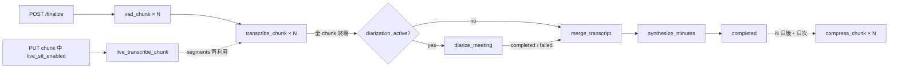

# 議事録Webアプリケーション Phase 3 詳細設計書 ── サーバー側（Python）

**対象:** Phase 2 詳細設計（`design-local-phase2-server.md`）の `minutes_local` パッケージに対する Phase 3 の追加・変更。Live STT（準リアルタイム）／話者分離／日英言語認識／FLAC 事後圧縮と高度な復旧／LAN 共有。
**上位文書:** Phase 2 基本設計書 §20〜§24（Phase 3 概要）。Phase 3 には基本設計が存在しないため、本書 §2 で基本設計相当の判断を先に確定する。
**対となる文書:** Phase 3 詳細設計書 ── ブラウザ側（`design-local-phase3-client.md`）。
**設計方針:** Local-First / Zero External Data Egress / Recording-First / Fault-Tolerant / At-Least-Once / Hardware-Aware Degradation。v4.0 の Recording is Source of Truth と Invariant 1〜10 を継承する。LAN 共有は「利用者自身が管理する LAN 内」に限定し、インターネット公開は対象外。
**検証状態:** 本書の全 `python` コードブロック（37 ファイル。うち 14 は Phase 2 ファイルの全文差し替え）は Phase 2 のパッケージに上書き・追加され、Phase 2 の 34 テストと本書の 20 テスト（計 12 ファイル 54 件）が Fake Provider による pytest で全件通過することを設計時点で確認している（§23）。実モデル（pyannote / faster-whisper の言語判定 / FLAC エンコーダ / 実 TLS 接続）は設計時点では実行していない。

---

# 1. 目的と範囲、Phase 2 からの変更一覧

| 区分 | ファイル | 内容 |
| --- | --- | --- |
| 変更禁止 | `api/routes_jobs.py`、`api/routes_models.py`、`api/sse.py`、`api/common.py`、`db/connection.py`、`db/migrate.py`、`db/repo.py`、`jobs/retry.py`、`jobs/sweeper.py`、`jobs/events.py`、`jobs/context.py` 以外の `jobs/*`、`stt/provider.py`、`stt/fake_provider.py`、`stt/executor.py`、`stt/worker.py`、`stt/faster_whisper_provider.py`、`stt/overlap.py`、`stt/confidence.py`、`vad/*`、`merge/normalize.py`、`merge/dedupe.py`、`llm/*`（`prompts.py` 以外）、`hw/*`、`storage/models_dir.py` | Phase 2 のまま。Phase 1 §12・Phase 2 §14 の API 契約はレスポンス形状を変えない（追加のみ） |
| 変更（全文再掲） | `config.py`、`db/models.py`、`jobs/context.py`、`jobs/pipeline.py`、`jobs/runner.py`、`jobs/handlers.py`、`merge/merger.py`、`llm/prompts.py`、`storage/files.py`、`api/app.py`、`api/routes_phase1.py`、`api/routes_meetings.py`、`bootstrap.py`、`__main__.py` | §4〜§22 で全文を示す |
| 新規 | `db/migrations_phase3.py`、`db/repo_phase3.py`、`jobs/live.py`、`jobs/scheduler.py`、`diarization/*`、`merge/echo.py`、`stt/language.py`、`storage/codec.py`、`storage/backup.py`、`storage/rebuild.py`、`auth/users.py`、`auth/tls.py`、`api/routes_phase3.py` | — |

---

# 2. Phase 3 の設計判断（基本設計相当）

## 2.1 Live STT（準リアルタイム）

| 候補 | 内容 | 採否 |
| --- | --- | --- |
| A. 準リアルタイム | 録音中に PUT された Chunk を finalize を待たず STT し、未マージの生セグメントを Live Transcript ペインに出す。遅延 = 30 秒（Chunk 長）+ STT 時間 | **採用** |
| B. 真のストリーミング | 数百 ms 単位で音声を送りサーバーで逐次 STT | 不採用。録音中の AudioWorklet と GPU/CPU を奪い合い、`NO_AUDIO_FRAMES` を誘発しうる（Invariant 8 の観点）。ブラウザ側の Zero External Data Egress を保ったまま実装するには WebSocket が必要で CSP が広がる |
| C. Web Speech API | ブラウザ組み込み | 不採用。実装がクラウド STT に音声を送る場合があり Zero External Data Egress に反する |

確定事項：

* Live は **Experimental Preview**（v4.0 §81・§100）。Live の失敗・遅延は録音にも確定 STT にも影響しない（Invariant 1）
* `meetings.live_stt_enabled`（作成時に `settings.live_stt_enabled` を写し、`PUT /v1/meetings/{id}/live` で会議単位に切替）
* ジョブ種別 `live_transcribe_chunk`（`priority=80`：`vad_chunk`(50) より後、`transcribe_chunk`(100) より先）。VAD は掛けず、ブラウザ側 `has_voice` を使う（プレビューなので false negative は許容。確定 STT が後から救う）
* 確定 STT（`transcribe_chunk`）は、同一 Chunk の Live セグメントが既にあれば STT を**再利用**（`stt_provider` を呼ばず `completed` にする）。同一モデル・同一入力なので結果は同じ。ただし Live は Overlap を付けないため境界品質が僅かに劣る。利用者が「STT 再実行」を選べば Overlap 付きで撮り直せる
* Live State Machine（v4.0 §82）はサーバー側で算出して `GET /meetings/{id}` の `liveState` に載せる。判定：未有効 `DISABLED`／有効だが Chunk なし `STARTING`／最古の未完了 Live ジョブの経過 < 90 秒 `RUNNING`／90〜300 秒 `DEGRADED`／300 秒超または STT モデルなし `STOPPED`
* ハードウェア区分 `gpu_small` / `cpu_only` では `settings.live_stt_enabled` の既定を false にし、有効化時に警告を返す（強制はしない）

## 2.2 話者分離

| 候補 | 内容 | 採否 |
| --- | --- | --- |
| A. 会議単位のダイアライゼーション（pyannote 系） | finalize 後、確定 STT 完了後に会議全体を処理し、セグメントにラベルを付ける | **採用** |
| B. Chunk 単位 | Chunk ごとに独立処理 | 不採用。Chunk をまたぐ同一話者のラベルが一致しない |
| C. 話者埋め込みのオンライン更新（Live 中） | Live 中に話者を出す | 不採用（Phase 3 でも対象外）。精度・負荷とも実測なしに設計できない |

確定事項：

* ジョブ種別 `diarize_meeting`（`priority=150`：全 `transcribe_chunk` 完了後、`merge_transcript`(200) の前）。依存関係は `transcribe 完了 → diarize → merge → summary` に変わる
* `DiarizationProvider` 抽象 + pyannote 実 Provider（遅延 import、モデルは Phase 2 §7.4 と同じ明示ダウンロード経路）+ Fake
* mic と system は**別々に**ダイアライズし、ラベルに source 接頭辞を付けない代わりに `meeting_speakers` で `(label → 名前)` を利用者が割り当てる。mic 側は通常 1 話者（利用者本人）だが、会議室のマイクで複数人が話す場合もあるため固定しない
* ラベルは `S1..Sn`。名前は AI に推定させない（v4.0 §63、Invariant 9）
* 分離失敗（モデル未配置・OOM 上限到達）は `merge` を止めない。`speaker_id=NULL` のまま続行し、UI に「話者分離なし」を表示
* エコー（system の音声を mic が拾う）は、mic/system 間で時間重なり ≥ 0.5 かつ正規化テキスト類似度 ≥ 0.8 のとき mic 側を `merge_reason='echo_of:<system_id>'` で除外する。話者埋め込みの類似は使わない（Provider 依存を避ける。Phase 2 基本設計 §21 からの変更）

## 2.3 日英の言語認識

Phase 2 では `settings.language` が `ja` / `en` / `auto` で、`auto` は「最初の Chunk で判定し会議単位で固定」だった（Phase 2 基本設計 §10.2）。Phase 3 では次に拡張する。

| 候補 | 内容 | 採否 |
| --- | --- | --- |
| A. Chunk 単位判定 | Chunk ごとに `detect_language` を掛け、その言語で `transcribe` | **採用** |
| B. セグメント単位判定 | Whisper の出力後にテキストから言語を判定 | 補助として採用（Whisper は 1 回の `transcribe` で 1 言語を仮定するため、Chunk 内のコードスイッチは Chunk 主言語で認識される。これは Whisper の制約として明記し、セグメントの `language` 列には Chunk 判定結果を入れる） |
| C. 2 言語で 2 回 STT して良い方を採る | — | 不採用。処理時間が倍になり、選択基準（logprob）も言語間で比較可能でない |

確定事項：

* `LanguageDetector` 抽象（`detect(pcm) -> (language, probability)`）。faster-whisper の `detect_language` を使う実 Provider + Fake
* `settings.language == "auto"` のとき Chunk ごとに判定。確信度 < 0.6（設定値）なら会議の主言語（`meetings.language_ratio_json` の最大）にフォールバック、主言語未確定なら `ja`
* `meetings.language_ratio_json`：セグメントの `language` 列の時間加重比率 `{"ja": 0.7, "en": 0.3}`。STT 完了ごとに更新
* 要約の言語：主言語比率 ≥ 0.6 なら主言語で system prompt を選ぶ。混在（< 0.6）なら `settings.summary_language`（既定 `ja`）に従い、プロンプトに「他言語の発言は原文のまま引用する」注記を加える
* Merger の類似度は既に言語別（文字 / 単語）。エコー検出も同じ関数を使う
* 実測項目：短い Chunk（部分 Chunk）での判定精度、混在 Chunk の認識品質

## 2.4 FLAC 事後圧縮と高度な復旧

確定事項：

* ブラウザ側 WAV 生成は変えない。`compress_chunk` ジョブ（`priority=400`、最低優先）が `completed` から `compress_after_days`（既定 7 日）経過した会議の Chunk を FLAC 化する
* `AudioCodec` 抽象（`encode` / `decode`）。実 Provider は `soundfile`（libsndfile、extras）。Fake は「マジック + 無圧縮 PCM」の自前コンテナで、検証ロジック（復元一致・不一致時の保持）をテストする
* 圧縮の原子性：`.flac.part` に書く → 復元して `build_wav(pcm)` の sha256 が `audio_chunks.sha256`（WAV 値、不変）と一致 → `local_path` / `codec='flac'` / `sha256_flac` 更新 → WAV 削除。不一致は新ファイルを消して `INVALID_AUDIO`（non-retryable）。WAV は残る
* `read_pcm` は拡張子で分岐し、FLAC の場合も WAV sha256 で照合する（`sha256` 列の意味を変えない）
* バックアップ：`VACUUM INTO {dataDir}/backups/minutes-{epoch}.sqlite`。`completed` 遷移ごと + 日次。世代数 `backup_generations`（既定 7）
* 起動時 `PRAGMA integrity_check`。`ok` 以外なら直近バックアップを `minutes.sqlite` に復元してから開く（復元前の壊れたファイルは `minutes.sqlite.corrupt-{epoch}` に退避）
* `doctor --rebuild`：`recordings/` を走査し、`meeting.json`（finalize 時に書く。Phase 1 §13 の規約を Phase 3 で実装）と WAV/FLAC ヘッダから `meetings` / `audio_chunks` の欠損行を再構築する。既存行は上書きしない
* 逆同期：`GET /chunks` は `save_status='missing'` の Chunk を `registered=false` で返す（Phase 1 契約の `registered` フィールドの意味の範囲内）。ブラウザ側が IndexedDB の Blob から再 PUT する（client 文書 §6）

## 2.5 LAN 共有

確定事項：

* 既定は Phase 1〜2 と同じ `127.0.0.1` 単一利用者。`serve --bind 0.0.0.0 --tls` を明示したときだけ LAN モード。`--tls` なしの非 loopback bind は拒否する（トークンが平文で LAN を流れるため）
* TLS：`doctor --init-tls --host <hostname or IP>` で自己署名証明書（`cryptography`、extras `lan`）。ブラウザは初回に証明書の受け入れが必要（断定しない事項 §3）
* 認証：`users` テーブル（`id`, `name`, `token_hash`, `created_at`）。`minutes-local user add <name>` がトークンを 1 回だけ表示する。`users` が空なら従来の `token` ファイルで `local` ユーザーとして動作（後方互換）
* 認可：認証ミドルウェアが `/v1/meetings/{id}/...` と `/v1/jobs/{id}/...` の所有者を照合し、他人の会議は `404`（存在を漏らさない）。`GET /v1/meetings` は自分の会議のみ
* ファイル階層：`recordings/{userId}/{meetingId}/{source}/{seq}.wav`。マイグレーション 011 が既存の `recordings/{meetingId}/` を `recordings/local/{meetingId}/` へ移動し `local_path` を更新する
* ジョブの公平性：`lease_job` を「利用者ごとの実行中ジョブ数が少ない利用者を優先」に変更（`ORDER BY running_per_user, priority, created_at`）。GPU は依然 1 台なので、同時実行数の上限は Phase 2 と同じ
* CSP と origin：**API origin はページ origin と同一とする**（前提契約）。サーバーが `/` でアプリ自身を配信するので `connect-src 'self'` で吸収され変更不要、同一 origin なので CORS 設定も不要。LAN モードとは「ページ自体を LAN の https origin から開く」ことであり、loopback から開いたページが別ホストの API を叩く構成ではない。**別オリジン配信は対象外**で、ブラウザ側 `validateConnection()` がページ origin 以外を `NOT_PAGE_ORIGIN` で拒否して実装レベルでも強制する（クライアント側 §7.3）。将来対象化する場合は CSP `connect-src` への対象 origin 追加と、`Authorization` ヘッダを伴う preflight に対応した CORS 設定の両方が必要になる
* インターネット公開・リバースプロキシ・OS ログイン連携は対象外

---

# 3. 断定してはいけない箇所と実測・監視で担保する箇所

| 事項 | 断定しない理由 | 担保 |
| --- | --- | --- |
| pyannote の話者数推定と精度、必要 VRAM | 会議の話者数・音質・重なり発話で大きく変わる。VRAM は 2〜4 GiB 程度が報告されるが環境依存 | `usage_metrics(diarize_duration_ms, diarize_speakers)` を記録。VRAM 予算は STT と同じ排他規則（Phase 2 §5.2）で `diarize_meeting` を STT 完了後にのみ lease |
| Whisper の言語判定精度（短い Chunk・混在） | `detect_language` は先頭 30 秒の特徴量で判定し、確信度が低いことがある | 確信度をセグメントごとに `usage_metrics(language_prob)` に記録。< 0.6 のフォールバック率を監視 |
| Live STT が録音に影響しない | 同一マシンで STT が走ると CPU/GPU が競合する | ブラウザ側 `NO_AUDIO_FRAMES` 発生時に Live を自動停止（client 文書 §8）。`usage_metrics(live_lag_ms)` を記録 |
| FLAC ライブラリ（libsndfile）の可用性 | OS ごとに配布形態が異なる | extras 未導入なら `compress_chunk` を生成しない（`ctx.codec is None`） |
| 自己署名証明書のブラウザ受け入れ | ブラウザ・OS の証明書ストア設定に依存 | `doctor --init-tls` が受け入れ手順を表示。受け入れ前は `/v1/health` に到達できないため `UNREACHABLE` として扱われる |
| LAN 内の遅延・帯域 | Wi-Fi 品質に依存。1 Chunk 約 1 MB / 30 秒なので帯域は小さいが、遅延はある | ブラウザ側の `LocalSaver` タイムアウト（30 秒）で吸収。`BACKEND_UNAVAILABLE` の頻度を監視 |
| `VACUUM INTO` の所要時間 | DB サイズに比例 | `asyncio.to_thread` で実行し API をブロックしない。所要時間を記録 |
| `INSERT ... SELECT *` によるテーブル再作成の列順一致 | 手作業のマイグレーションで列順がずれると壊れる | §23.1 のマイグレーションテストで Phase 2 DB からの適用を検証 |

---

# 4. SQLite マイグレーション 008〜011 `db/migrations_phase3.py`

Phase 2 の `db/migrate.py` は変更せず、Phase 3 のマイグレーションを別モジュールに置く。`bootstrap.build_context` が `migrate(db)` の直後に `apply_phase3(db, data_dir)` を呼ぶ。011 はファイル移動を伴うため Python で実装する。

```python
# minutes_local/db/migrations_phase3.py
"""Phase 3 のマイグレーション（008〜011）。Phase 2 の migrate.py は変更しない。"""
from __future__ import annotations

import shutil
import sqlite3
from pathlib import Path

from .connection import Database, now_ms
from .migrate import _exec_multi, current_version

# 008: 会議・Chunk の列追加、話者テーブル
M008 = """
ALTER TABLE meetings ADD COLUMN language_ratio_json TEXT;
ALTER TABLE meetings ADD COLUMN live_stt_enabled INTEGER NOT NULL DEFAULT 0;
ALTER TABLE meetings ADD COLUMN summary_language TEXT;
ALTER TABLE audio_chunks ADD COLUMN codec TEXT NOT NULL DEFAULT 'wav';
ALTER TABLE audio_chunks ADD COLUMN sha256_flac TEXT;
CREATE TABLE IF NOT EXISTS meeting_speakers (
  meeting_id TEXT NOT NULL REFERENCES meetings(id) ON DELETE CASCADE,
  label      TEXT NOT NULL,
  name       TEXT,
  updated_at INTEGER NOT NULL,
  PRIMARY KEY (meeting_id, label)
);
"""

# 009: processing_jobs の job_type CHECK 拡張（SQLite は CHECK を ALTER できないため再作成）
M009 = """
CREATE TABLE processing_jobs_new (
  id            TEXT PRIMARY KEY,
  meeting_id    TEXT NOT NULL REFERENCES meetings(id) ON DELETE CASCADE,
  chunk_id      TEXT REFERENCES audio_chunks(id) ON DELETE CASCADE,
  job_type      TEXT NOT NULL
                  CHECK (job_type IN ('vad_chunk','transcribe_chunk','merge_transcript','synthesize_minutes',
                                      'live_transcribe_chunk','diarize_meeting','compress_chunk')),
  status        TEXT NOT NULL DEFAULT 'pending'
                  CHECK (status IN ('pending','leased','processing','retrying','completed','failed','cancelled')),
  priority      INTEGER NOT NULL DEFAULT 100,
  attempts      INTEGER NOT NULL DEFAULT 0,
  max_attempts  INTEGER NOT NULL DEFAULT 5,
  lease_until   INTEGER,
  lease_owner   TEXT,
  next_run_at   INTEGER NOT NULL DEFAULT 0,
  model_name    TEXT,
  error_class   TEXT
                  CHECK (error_class IS NULL OR error_class IN
                    ('OOM','MODEL_MISSING','INVALID_AUDIO','PROVIDER_UNREACHABLE',
                     'SCHEMA_VALIDATION','BUSINESS_VALIDATION','TIMEOUT','INTERNAL')),
  last_error    TEXT,
  duration_ms   INTEGER,
  created_at    INTEGER NOT NULL,
  updated_at    INTEGER NOT NULL
);
INSERT INTO processing_jobs_new SELECT * FROM processing_jobs;
DROP TABLE processing_jobs;
ALTER TABLE processing_jobs_new RENAME TO processing_jobs;
CREATE UNIQUE INDEX IF NOT EXISTS uq_transcribe_job
  ON processing_jobs(meeting_id, chunk_id) WHERE job_type = 'transcribe_chunk';
CREATE UNIQUE INDEX IF NOT EXISTS uq_vad_job
  ON processing_jobs(meeting_id, chunk_id) WHERE job_type = 'vad_chunk';
CREATE UNIQUE INDEX IF NOT EXISTS uq_merge_job
  ON processing_jobs(meeting_id) WHERE job_type = 'merge_transcript';
CREATE UNIQUE INDEX IF NOT EXISTS uq_summary_job
  ON processing_jobs(meeting_id) WHERE job_type = 'synthesize_minutes';
CREATE UNIQUE INDEX IF NOT EXISTS uq_live_job
  ON processing_jobs(meeting_id, chunk_id) WHERE job_type = 'live_transcribe_chunk';
CREATE UNIQUE INDEX IF NOT EXISTS uq_diarize_job
  ON processing_jobs(meeting_id) WHERE job_type = 'diarize_meeting';
CREATE UNIQUE INDEX IF NOT EXISTS uq_compress_job
  ON processing_jobs(meeting_id, chunk_id) WHERE job_type = 'compress_chunk';
CREATE INDEX IF NOT EXISTS idx_jobs_runnable
  ON processing_jobs(status, next_run_at, priority, created_at);
CREATE INDEX IF NOT EXISTS idx_jobs_lease ON processing_jobs(status, lease_until);
"""

# 010: 利用者
M010 = """
CREATE TABLE IF NOT EXISTS users (
  id         TEXT PRIMARY KEY,
  name       TEXT NOT NULL UNIQUE,
  token_hash TEXT NOT NULL UNIQUE,
  created_at INTEGER NOT NULL
);
CREATE INDEX IF NOT EXISTS idx_meetings_user ON meetings(local_user_id, created_at);
"""

PHASE3_SQL: list[tuple[int, str]] = [(8, M008), (9, M009), (10, M010)]


def _migrate_011_move_recordings(conn: sqlite3.Connection, data_dir: Path) -> int:
    """recordings/{meetingId}/ → recordings/local/{meetingId}/。local_path を書き換える。戻り値は移動した Chunk 数。"""
    rows = conn.execute("SELECT id, meeting_id, local_user_id_hint, local_path FROM (SELECT c.id, c.meeting_id, m.local_user_id AS local_user_id_hint, c.local_path FROM audio_chunks c JOIN meetings m ON m.id = c.meeting_id) WHERE local_path LIKE 'recordings/%'").fetchall()
    moved = 0
    for r in rows:
        old_rel = r["local_path"]
        parts = old_rel.split("/")
        if len(parts) == 4:  # recordings/{meetingId}/{source}/{file}
            new_rel = f"recordings/{r['local_user_id_hint']}/{parts[1]}/{parts[2]}/{parts[3]}"
        else:
            continue
        src = data_dir / old_rel
        dst = data_dir / new_rel
        if src.exists():
            dst.parent.mkdir(parents=True, exist_ok=True)
            shutil.move(str(src), str(dst))
        conn.execute("UPDATE audio_chunks SET local_path = ? WHERE id = ?", (new_rel, r["id"]))
        moved += 1
    # meeting.json も移動（存在すれば）
    for m in conn.execute("SELECT id, local_user_id FROM meetings").fetchall():
        old_dir = data_dir / "recordings" / m["id"]
        new_dir = data_dir / "recordings" / m["local_user_id"] / m["id"]
        if old_dir.exists() and not new_dir.exists():
            new_dir.parent.mkdir(parents=True, exist_ok=True)
            shutil.move(str(old_dir), str(new_dir))
        elif old_dir.exists() and new_dir.exists():
            for p in old_dir.rglob("*"):
                if p.is_file():
                    target = new_dir / p.relative_to(old_dir)
                    target.parent.mkdir(parents=True, exist_ok=True)
                    if not target.exists():
                        shutil.move(str(p), str(target))
            shutil.rmtree(old_dir, ignore_errors=True)
    return moved


def apply_phase3(db: Database, data_dir: Path) -> int:
    """未適用の 008〜011 を順に適用する。戻り値は適用数。"""
    applied = 0
    for version, ddl in PHASE3_SQL:
        with db.write_sync() as conn:
            if current_version(conn) >= version:
                continue
            _exec_multi(conn, ddl)
            conn.execute("INSERT INTO schema_version(version, applied_at) VALUES (?, ?)", (version, now_ms()))
            applied += 1
    with db.write_sync() as conn:
        if current_version(conn) < 11:
            _migrate_011_move_recordings(conn, data_dir)
            conn.execute("INSERT INTO schema_version(version, applied_at) VALUES (11, ?)", (now_ms(),))
            applied += 1
    return applied
```

009 で `foreign_keys = ON` のまま `DROP TABLE processing_jobs` を実行できるのは、`processing_jobs` が親テーブルではないためである。`INSERT ... SELECT *` は列順が Phase 2 §7 の DDL と同一であることに依存する（§3 の断定しない事項。§23.1 で検証）。

---

# 5. 設定 `config.py`（変更）

Phase 2 §5 に Phase 3 の設定値を追加した全文。

```python
# minutes_local/config.py
"""サーバー設定。既定値 → 環境変数 → settings テーブル の順で上書きする。Phase 3 で LAN / Live / 圧縮 / 言語の項目を追加。"""
from __future__ import annotations

import os
import sys
from dataclasses import dataclass, field, replace
from pathlib import Path
from typing import Any


def default_data_dir() -> Path:
    if sys.platform == "darwin":
        return Path.home() / "Library" / "Application Support" / "minutes-local"
    if sys.platform.startswith("win"):
        base = os.environ.get("LOCALAPPDATA")
        return Path(base) / "minutes-local" if base else Path.home() / "minutes-local"
    xdg = os.environ.get("XDG_DATA_HOME")
    return Path(xdg) / "minutes-local" if xdg else Path.home() / ".local" / "share" / "minutes-local"


@dataclass(frozen=True)
class Thresholds:
    vad_threshold: float = 0.5
    vad_min_speech_ms: int = 250
    vad_min_voiced_ms: int = 500
    overlap_ms: int = 3000
    merge_window_ms: int = 3500
    merge_time_overlap_ratio: float = 0.5
    merge_text_similarity: float = 0.8
    merge_containment_min_ratio: float = 0.3
    merge_containment_max_ratio: float = 0.95
    confidence_dim_below: float = 0.4
    stt_timeout_factor_gpu: int = 10
    stt_timeout_factor_cpu: int = 60
    llm_connect_timeout_s: float = 10.0
    llm_read_timeout_s: float = 600.0
    llm_ctx_fill_ratio: float = 0.6
    # Phase 3
    language_min_prob: float = 0.6          # これ未満は会議の主言語にフォールバック
    language_dominant_ratio: float = 0.6    # これ以上なら主言語で要約
    echo_time_overlap_ratio: float = 0.5
    echo_text_similarity: float = 0.8
    live_degraded_after_s: int = 90
    live_stopped_after_s: int = 300


@dataclass(frozen=True)
class Settings:
    data_dir: Path = field(default_factory=default_data_dir)
    bind_host: str = "127.0.0.1"
    port: int = 43117
    ollama_base_url: str = "http://127.0.0.1:11434"
    language: str = "ja"              # "ja" | "en" | "auto"
    stt_model: str | None = None
    llm_model: str | None = None
    max_concurrent_stt: int | None = None
    live_stt_enabled: bool = False
    vad_sampling_ratio: float = 0.0
    # Phase 3
    summary_language: str = "ja"      # 混在会議の要約言語
    diarization_enabled: bool = True  # Provider があれば有効
    compress_after_days: int = 7
    backup_generations: int = 7
    tls_enabled: bool = False
    thresholds: Thresholds = field(default_factory=Thresholds)

    @property
    def db_path(self) -> Path:
        return self.data_dir / "minutes.sqlite"

    @property
    def recordings_dir(self) -> Path:
        return self.data_dir / "recordings"

    @property
    def models_dir(self) -> Path:
        return self.data_dir / "models"

    @property
    def backups_dir(self) -> Path:
        return self.data_dir / "backups"

    @property
    def token_path(self) -> Path:
        return self.data_dir / "token"

    @property
    def tls_cert_path(self) -> Path:
        return self.data_dir / "tls" / "cert.pem"

    @property
    def tls_key_path(self) -> Path:
        return self.data_dir / "tls" / "key.pem"

    def with_overrides(self, values: dict[str, Any]) -> "Settings":
        allowed = {
            "language": str, "stt_model": (str, type(None)), "llm_model": (str, type(None)),
            "max_concurrent_stt": (int, type(None)), "live_stt_enabled": bool,
            "vad_sampling_ratio": float, "ollama_base_url": str,
            "summary_language": str, "diarization_enabled": bool, "compress_after_days": int, "backup_generations": int,
        }
        kwargs: dict[str, Any] = {}
        for key, expected in allowed.items():
            if key in values and isinstance(values[key], expected) and not (expected is float and isinstance(values[key], bool)):
                kwargs[key] = values[key]
        return replace(self, **kwargs)


def settings_from_env(base: Settings | None = None) -> Settings:
    s = base or Settings()
    data_dir = os.environ.get("MINUTES_DATA_DIR")
    port = os.environ.get("MINUTES_PORT")
    kwargs: dict[str, Any] = {}
    if data_dir:
        kwargs["data_dir"] = Path(data_dir)
    if port and port.isdigit():
        kwargs["port"] = int(port)
    return replace(s, **kwargs)
```

---

# 6. モデル `db/models.py`（変更）と `db/repo_phase3.py`（新規）

```python
# minutes_local/db/models.py
"""SQLite 行に対応する pydantic モデル。Phase 3 でジョブ種別・列・テーブルを追加。"""
from __future__ import annotations

from typing import Literal

from pydantic import BaseModel

Source = Literal["mic", "system"]
MeetingStatus = Literal[
    "created", "recording", "finalizing", "finalized",
    "transcribing", "transcribed", "summarizing", "completed", "failed",
]
SttStatus = Literal["pending", "queued", "processing", "completed", "skipped", "failed"]
JobType = Literal[
    "vad_chunk", "transcribe_chunk", "merge_transcript", "synthesize_minutes",
    "live_transcribe_chunk", "diarize_meeting", "compress_chunk",
]
JobStatus = Literal["pending", "leased", "processing", "retrying", "completed", "failed", "cancelled"]
ErrorClass = Literal[
    "OOM", "MODEL_MISSING", "INVALID_AUDIO", "PROVIDER_UNREACHABLE",
    "SCHEMA_VALIDATION", "BUSINESS_VALIDATION", "TIMEOUT", "INTERNAL",
]
Codec = Literal["wav", "flac", "fake"]
LiveState = Literal["DISABLED", "STARTING", "RUNNING", "DEGRADED", "STOPPED"]

JOB_PRIORITY: dict[str, int] = {
    "vad_chunk": 50, "live_transcribe_chunk": 80, "transcribe_chunk": 100, "diarize_meeting": 150,
    "merge_transcript": 200, "synthesize_minutes": 300, "compress_chunk": 400,
}


class Meeting(BaseModel):
    id: str
    local_user_id: str = "local"
    title: str
    status: MeetingStatus
    session_start_epoch_ms: int
    native_sample_rate: int
    consent_confirmed_at: int
    ended_at: int | None = None
    total_audio_frames: int | None = None
    transcript_version: int = 0
    stt_model_used: str | None = None
    llm_model_used: str | None = None
    created_at: int
    updated_at: int
    # Phase 3
    language_ratio_json: str | None = None
    live_stt_enabled: bool = False
    summary_language: str | None = None


class AudioChunk(BaseModel):
    id: str
    meeting_id: str
    source: Source
    sequence_no: int
    start_offset_ms: int
    end_offset_ms: int
    duration_ms: int
    sample_count: int
    local_path: str
    size_bytes: int
    sha256: str
    vad_score: float = 0.0
    has_voice: bool = True
    vad_source: Literal["browser_rms", "server_silero"] = "browser_rms"
    server_vad_score: float | None = None
    save_status: Literal["registered", "verified", "missing"] = "registered"
    stt_status: SttStatus = "pending"
    created_at: int
    # Phase 3
    codec: Codec = "wav"
    sha256_flac: str | None = None


class Job(BaseModel):
    id: str
    meeting_id: str
    chunk_id: str | None
    job_type: JobType
    status: JobStatus
    priority: int
    attempts: int
    max_attempts: int
    lease_until: int | None = None
    lease_owner: str | None = None
    next_run_at: int = 0
    model_name: str | None = None
    error_class: ErrorClass | None = None
    last_error: str | None = None
    duration_ms: int | None = None
    created_at: int
    updated_at: int


class Segment(BaseModel):
    id: str
    meeting_id: str
    chunk_id: str
    source: Source
    segment_index: int
    start_ms: int
    end_ms: int
    text: str
    normalized_text: str | None = None
    language: str | None = None
    confidence: float | None = None
    no_speech_prob: float | None = None
    merged_version: int | None = None
    merge_reason: str | None = None
    speaker_id: str | None = None
    speaker_confidence: float | None = None
    created_at: int


class SummaryVersion(BaseModel):
    id: str
    meeting_id: str
    version: int
    transcript_version: int
    model_name: str
    prompt_version: str
    result_json: str
    raw_response_json: str | None = None
    validation_json: str
    generated_at: int


class Notes(BaseModel):
    meeting_id: str
    blocknote_json: str
    revision: int
    last_applied_summary_version: int | None = None
    updated_at: int


class Speaker(BaseModel):
    meeting_id: str
    label: str
    name: str | None = None
    updated_at: int


class User(BaseModel):
    id: str
    name: str
    token_hash: str
    created_at: int
```

```python
# minutes_local/db/repo_phase3.py
"""Phase 3 で追加するクエリ。Phase 2 の repo.py は変更しない。"""
from __future__ import annotations

import json
import sqlite3

from .connection import now_ms
from .models import Job, Meeting, Segment, Speaker
from .repo import _row


# ---- 利用者スコープ ----

def list_meetings_for_user(conn: sqlite3.Connection, user_id: str) -> list[Meeting]:
    rows = conn.execute("SELECT * FROM meetings WHERE local_user_id = ? ORDER BY created_at DESC", (user_id,)).fetchall()
    return [_row(Meeting, r) for r in rows]


def meeting_owner(conn: sqlite3.Connection, meeting_id: str) -> str | None:
    row = conn.execute("SELECT local_user_id FROM meetings WHERE id = ?", (meeting_id,)).fetchone()
    return None if row is None else str(row["local_user_id"])


def job_owner(conn: sqlite3.Connection, job_id: str) -> str | None:
    row = conn.execute(
        "SELECT m.local_user_id AS u FROM processing_jobs j JOIN meetings m ON m.id = j.meeting_id WHERE j.id = ?", (job_id,)
    ).fetchone()
    return None if row is None else str(row["u"])


# ---- 公平 lease（§2.5） ----

def lease_job_fair(conn: sqlite3.Connection, owner: str, allowed_types: list[str], now: int,
                   lease_ms: int = 300_000) -> Job | None:
    """利用者ごとの実行中ジョブ数が少ない利用者を優先する。単一利用者では Phase 2 の lease_job と同じ順序になる。"""
    if not allowed_types:
        return None
    ph = ",".join("?" for _ in allowed_types)
    row = conn.execute(
        f"""UPDATE processing_jobs
            SET status = 'leased', lease_until = ?, lease_owner = ?, attempts = attempts + 1, updated_at = ?
            WHERE id = (
              SELECT j.id FROM processing_jobs j
              JOIN meetings m ON m.id = j.meeting_id
              LEFT JOIN (
                SELECT m2.local_user_id AS uid, COUNT(*) AS running
                FROM processing_jobs j2 JOIN meetings m2 ON m2.id = j2.meeting_id
                WHERE j2.status IN ('leased','processing') GROUP BY m2.local_user_id
              ) r ON r.uid = m.local_user_id
              WHERE j.status IN ('pending','retrying') AND j.next_run_at <= ? AND j.job_type IN ({ph})
              ORDER BY COALESCE(r.running, 0) ASC, j.priority ASC, j.created_at ASC LIMIT 1
            )
            RETURNING *""",
        (now + lease_ms, owner, now, now, *allowed_types),
    ).fetchone()
    return _row(Job, row)


# ---- 話者 ----

def list_speakers(conn: sqlite3.Connection, meeting_id: str) -> list[Speaker]:
    rows = conn.execute("SELECT * FROM meeting_speakers WHERE meeting_id = ? ORDER BY label", (meeting_id,)).fetchall()
    return [_row(Speaker, r) for r in rows]


def upsert_speaker(conn: sqlite3.Connection, meeting_id: str, label: str, name: str | None) -> None:
    conn.execute(
        "INSERT INTO meeting_speakers (meeting_id, label, name, updated_at) VALUES (?,?,?,?) "
        "ON CONFLICT(meeting_id, label) DO UPDATE SET name = excluded.name, updated_at = excluded.updated_at",
        (meeting_id, label, name, now_ms()),
    )


def set_segment_speaker(conn: sqlite3.Connection, segment_id: str, label: str | None, confidence: float | None) -> None:
    conn.execute("UPDATE transcript_segments SET speaker_id = ?, speaker_confidence = ? WHERE id = ?", (label, confidence, segment_id))


# ---- 言語 ----

def language_ratio(conn: sqlite3.Connection, meeting_id: str) -> dict[str, float]:
    """セグメントの時間加重比率。"""
    rows = conn.execute(
        "SELECT language, SUM(end_ms - start_ms) AS d FROM transcript_segments WHERE meeting_id = ? AND language IS NOT NULL GROUP BY language",
        (meeting_id,),
    ).fetchall()
    total = sum(float(r["d"]) for r in rows)
    if total <= 0:
        return {}
    return {str(r["language"]): round(float(r["d"]) / total, 4) for r in rows}


def save_language_ratio(conn: sqlite3.Connection, meeting_id: str, ratio: dict[str, float]) -> None:
    conn.execute("UPDATE meetings SET language_ratio_json = ?, updated_at = ? WHERE id = ?", (json.dumps(ratio), now_ms(), meeting_id))


def primary_language(ratio: dict[str, float]) -> tuple[str | None, float]:
    if not ratio:
        return None, 0.0
    lang = max(ratio, key=lambda k: ratio[k])
    return lang, ratio[lang]


# ---- Live ----

def segments_of_chunk(conn: sqlite3.Connection, chunk_id: str) -> list[Segment]:
    rows = conn.execute("SELECT * FROM transcript_segments WHERE chunk_id = ? ORDER BY segment_index", (chunk_id,)).fetchall()
    return [_row(Segment, r) for r in rows]


def live_segments_since(conn: sqlite3.Connection, meeting_id: str, since_created_at: int) -> list[Segment]:
    """since_created_at を**含む**境界で返す（クライアント側 §2.1・§3.2）。

    created_at は epoch ms で一意でも単調増加でもない。handle_live_transcribe は 1 チャンク分の
    セグメントを同じ now_ms() の値で書き込むため、同一ミリ秒に複数行が並ぶのは常態である。
    排他境界（created_at > ?）にすると、cursor と同じミリ秒に後から挿入された行が次回以降の
    検索条件から永久に外れる。境界ミリ秒の再送は受信側が id で重複排除する契約になっている。
    並びは (created_at, id) で決める。start_ms は一意でなく、同点時の順序が安定しない。
    """
    rows = conn.execute(
        "SELECT * FROM transcript_segments WHERE meeting_id = ? AND created_at >= ? ORDER BY created_at, id",
        (meeting_id, since_created_at),
    ).fetchall()
    return [_row(Segment, r) for r in rows]


def oldest_open_job_age_ms(conn: sqlite3.Connection, meeting_id: str, job_type: str, now: int) -> int | None:
    row = conn.execute(
        "SELECT MIN(created_at) AS c FROM processing_jobs WHERE meeting_id = ? AND job_type = ? AND status IN ('pending','leased','processing','retrying')",
        (meeting_id, job_type),
    ).fetchone()
    if row is None or row["c"] is None:
        return None
    return now - int(row["c"])


# ---- 圧縮 ----

def chunks_to_compress(conn: sqlite3.Connection, completed_before: int) -> list[tuple[str, str]]:
    """(meeting_id, chunk_id)。completed かつ ended_at が閾値より前で codec='wav' の Chunk。"""
    rows = conn.execute(
        """SELECT c.meeting_id AS m, c.id AS c FROM audio_chunks c JOIN meetings mt ON mt.id = c.meeting_id
           WHERE mt.status = 'completed' AND mt.ended_at IS NOT NULL AND mt.ended_at < ? AND c.codec = 'wav' AND c.save_status != 'missing'""",
        (completed_before,),
    ).fetchall()
    return [(str(r["m"]), str(r["c"])) for r in rows]
```

---

# 7. 実行コンテキスト `jobs/context.py`（変更）

Phase 3 の Provider（話者分離・言語判定・コーデック）と LAN モードのフラグを追加した全文。

```python
# minutes_local/jobs/context.py
"""ジョブハンドラと API が共有する依存。Phase 3 で diarization / language / codec / 利用者モードを追加。"""
from __future__ import annotations

from dataclasses import dataclass, field

from ..config import Settings
from ..db.connection import Database
from ..diarization.provider import DiarizationProvider
from ..hw.detect import Hardware
from ..hw.tiers import SttCandidate, Tier
from ..llm.provider import SummaryProvider
from ..storage.codec import AudioCodec
from ..stt.executor import STTExecutor
from ..stt.language import LanguageDetector
from ..vad.provider import VADProvider
from .events import EventBroker


@dataclass
class ModelSelection:
    tier: Tier
    stt: SttCandidate | None
    llm: str | None
    installed_stt: set[str]
    available_llm: list[str]
    ollama_reachable: bool
    max_concurrent_stt: int
    allow_concurrent_stt_and_llm: bool


@dataclass
class AppContext:
    settings: Settings
    db: Database
    hardware: Hardware
    models: ModelSelection
    stt: STTExecutor
    vad: VADProvider | None
    llm: SummaryProvider
    events: EventBroker = field(default_factory=lambda: EventBroker())
    server_version: str = "0.3.0"
    # Phase 3
    diarization: DiarizationProvider | None = None
    language: LanguageDetector | None = None
    codec: AudioCodec | None = None
    multi_user: bool = False       # users テーブルが空でなければ True
    tls_enabled: bool = False

    @property
    def diarization_active(self) -> bool:
        return self.diarization is not None and self.settings.diarization_enabled
```

---

# 8. ジョブ生成規則 `jobs/pipeline.py`（変更）

依存関係を `transcribe 完了 → diarize（任意）→ merge → summary` に変える。`ensure_merge_job` は `diarize` フラグを必須引数に取り、話者分離が有効なら `diarize_meeting` を先に生成する。



```python
# minutes_local/jobs/pipeline.py
"""ジョブ生成規則。Phase 3 で diarize と live を追加。"""
from __future__ import annotations

import sqlite3

from ..db import repo
from ..db.models import AudioChunk, Job

BLOCKING_STT = ("pending", "queued", "processing")


def on_finalized(conn: sqlite3.Connection, meeting_id: str) -> int:
    created = 0
    for chunk in repo.list_chunks(conn, meeting_id):
        if repo.insert_job(conn, meeting_id, "vad_chunk", chunk_id=chunk.id) is not None:
            created += 1
    repo.set_meeting_status(conn, meeting_id, "transcribing")
    return created


def on_vad_completed(conn: sqlite3.Connection, chunk: AudioChunk, has_voice: bool, model_name: str | None, diarize: bool) -> None:
    if has_voice:
        repo.update_chunk(conn, chunk.id, stt_status="queued")
        repo.insert_job(conn, chunk.meeting_id, "transcribe_chunk", chunk_id=chunk.id, model_name=model_name)
    else:
        repo.update_chunk(conn, chunk.id, stt_status="skipped")
    ensure_merge_job(conn, chunk.meeting_id, diarize)


def on_transcribe_completed(conn: sqlite3.Connection, chunk: AudioChunk, diarize: bool) -> None:
    repo.update_chunk(conn, chunk.id, stt_status="completed")
    ensure_merge_job(conn, chunk.meeting_id, diarize)


def on_transcribe_failed(conn: sqlite3.Connection, chunk: AudioChunk) -> None:
    repo.update_chunk(conn, chunk.id, stt_status="failed")


def _all_chunks_terminal(conn: sqlite3.Connection, meeting_id: str) -> bool:
    counts = repo.count_chunks_by_stt(conn, meeting_id)
    if any(counts[s] > 0 for s in BLOCKING_STT):
        return False
    if repo.count_jobs(conn, meeting_id, "vad_chunk", ["pending", "leased", "processing", "retrying"]) > 0:
        return False
    if repo.count_jobs(conn, meeting_id, "transcribe_chunk", ["failed"]) > 0:
        return False
    return True


def ensure_merge_job(conn: sqlite3.Connection, meeting_id: str, diarize: bool) -> bool:
    """全 Chunk が終端なら、話者分離が有効なら diarize_meeting、無効なら merge_transcript を生成する。"""
    if not _all_chunks_terminal(conn, meeting_id):
        return False
    if diarize:
        # diarize が既に終端（completed/failed/cancelled）なら merge へ
        if repo.count_jobs(conn, meeting_id, "diarize_meeting", ["completed", "failed", "cancelled"]) > 0:
            return repo.insert_job(conn, meeting_id, "merge_transcript") is not None
        return repo.insert_job(conn, meeting_id, "diarize_meeting") is not None
    return repo.insert_job(conn, meeting_id, "merge_transcript") is not None


def on_diarize_finished(conn: sqlite3.Connection, meeting_id: str) -> None:
    """成功・失敗いずれでも merge へ進む（分離失敗は transcript を止めない）。"""
    repo.insert_job(conn, meeting_id, "merge_transcript")


def exclude_failed(conn: sqlite3.Connection, meeting_id: str, diarize: bool = False) -> int:
    rows = conn.execute(
        "SELECT id FROM processing_jobs WHERE meeting_id = ? AND job_type = 'transcribe_chunk' AND status = 'failed'",
        (meeting_id,),
    ).fetchall()
    for r in rows:
        conn.execute("UPDATE processing_jobs SET status = 'cancelled' WHERE id = ?", (r["id"],))
    ensure_merge_job(conn, meeting_id, diarize)
    return len(rows)


def on_merge_completed(conn: sqlite3.Connection, meeting_id: str) -> None:
    repo.set_meeting_status(conn, meeting_id, "transcribed")
    repo.insert_job(conn, meeting_id, "synthesize_minutes")


def on_summary_started(conn: sqlite3.Connection, meeting_id: str) -> None:
    repo.set_meeting_status(conn, meeting_id, "summarizing")


def on_summary_completed(conn: sqlite3.Connection, meeting_id: str) -> None:
    repo.set_meeting_status(conn, meeting_id, "completed")


def on_summary_deferred(conn: sqlite3.Connection, meeting_id: str) -> None:
    repo.set_meeting_status(conn, meeting_id, "transcribed")


def on_summary_failed(conn: sqlite3.Connection, meeting_id: str) -> None:
    repo.set_meeting_status(conn, meeting_id, "failed")


def request_regenerate_summary(conn: sqlite3.Connection, meeting_id: str) -> None:
    repo.reset_job_for_rerun(conn, meeting_id, "synthesize_minutes")
    repo.insert_job(conn, meeting_id, "synthesize_minutes")


def request_rerun_stt(conn: sqlite3.Connection, meeting_id: str, stt_model: str | None) -> int:
    conn.execute("DELETE FROM processing_jobs WHERE meeting_id = ?", (meeting_id,))
    for chunk in repo.list_chunks(conn, meeting_id):
        repo.delete_segments_of_chunk(conn, chunk.id)
        repo.update_chunk(conn, chunk.id, stt_status="pending")
    conn.execute("DELETE FROM meeting_speakers WHERE meeting_id = ?", (meeting_id,))
    repo.update_meeting(conn, meeting_id, stt_model_used=stt_model, status="transcribing", language_ratio_json=None)
    return on_finalized(conn, meeting_id)


def job_of_chunk(conn: sqlite3.Connection, job: Job) -> AudioChunk:
    if job.chunk_id is None:
        raise ValueError(f"job {job.id} has no chunk")
    chunk = repo.get_chunk(conn, job.chunk_id)
    if chunk is None:
        raise ValueError(f"chunk {job.chunk_id} not found")
    return chunk
```

---

# 9. Runner `jobs/runner.py`（変更）

変更点：(1) 公平 lease（`repo_phase3.lease_job_fair`）、(2) `allowed_types` に Phase 3 のジョブ種別、(3) `diarize_meeting` は STT と同じ GPU 排他規則、(4) `diarize_meeting` の失敗時に merge へ進む、(5) 完了後フックが `diarize` フラグを渡す。

```python
# minutes_local/jobs/runner.py
"""lease 取得 → ハンドラ実行 → 完了/retry/failed の記録。Phase 3 で公平 lease と新ジョブ種別に対応。"""
from __future__ import annotations

import asyncio
import os
import time
from collections.abc import Awaitable, Callable

from ..db import repo, repo_phase3
from ..db.connection import now_ms
from ..db.models import Job
from . import pipeline
from .context import AppContext
from .retry import JobError, RetryDecision, decide, normalize_exception

Handler = Callable[[AppContext, Job], Awaitable[str | None]]

HEARTBEAT_INTERVAL_S = 60.0
LEASE_MS = 300_000
GPU_HEAVY = ("transcribe_chunk", "live_transcribe_chunk", "diarize_meeting")


class JobRunner:
    def __init__(self, ctx: AppContext, handlers: dict[str, Handler], worker_index: int = 0) -> None:
        self.ctx = ctx
        self.handlers = handlers
        self.owner = f"{os.getpid()}:{worker_index}"
        self._stop = asyncio.Event()

    def allowed_types(self) -> list[str]:
        types = ["vad_chunk", "live_transcribe_chunk", "transcribe_chunk", "merge_transcript", "compress_chunk"]
        with self.ctx.db.read() as conn:
            stt_running = sum(repo.count_jobs(conn, None, t, ["leased", "processing"]) for t in ("transcribe_chunk", "live_transcribe_chunk"))
            diarize_running = repo.count_jobs(conn, None, "diarize_meeting", ["leased", "processing"])
        # diarize は STT 実行中には lease しない（GPU 排他）。STT は diarize 実行中でも動く（diarize は 1 会議 1 ジョブで短い）
        if stt_running == 0:
            types.append("diarize_meeting")
        if (stt_running == 0 and diarize_running == 0) or self.ctx.models.allow_concurrent_stt_and_llm:
            types.append("synthesize_minutes")
        return types

    async def run_once(self) -> bool:
        now = now_ms()
        async with self.ctx.db.write() as conn:
            job = repo_phase3.lease_job_fair(conn, self.owner, self.allowed_types(), now, LEASE_MS)
        if job is None:
            return False
        await self._execute(job)
        return True

    async def run_until_idle(self, max_jobs: int = 10_000) -> int:
        n = 0
        while n < max_jobs and await self.run_once():
            n += 1
        return n

    async def run_forever(self, idle_sleep_s: float = 1.0) -> None:
        while not self._stop.is_set():
            ran = await self.run_once()
            if not ran:
                try:
                    await asyncio.wait_for(self._stop.wait(), timeout=idle_sleep_s)
                except asyncio.TimeoutError:
                    pass

    def stop(self) -> None:
        self._stop.set()

    async def _execute(self, job: Job) -> None:
        handler = self.handlers.get(job.job_type)
        if handler is None:
            async with self.ctx.db.write() as conn:
                repo.finish_job(conn, job.id, self.owner, "failed", error_class="INTERNAL", last_error=f"no handler for {job.job_type}")
            return

        async with self.ctx.db.write() as conn:
            if not repo.mark_processing(conn, job.id, self.owner, job.model_name):
                return
            if job.job_type == "synthesize_minutes":
                pipeline.on_summary_started(conn, job.meeting_id)
        self._publish_job(job.id)

        hb = asyncio.create_task(self._heartbeat(job.id))
        started = time.monotonic()
        try:
            model_used = await handler(self.ctx, job)
        except BaseException as exc:  # noqa: BLE001 - JobError に正規化して記録する
            hb.cancel()
            if isinstance(exc, asyncio.CancelledError):
                raise
            await self._on_failure(job, normalize_exception(exc), int((time.monotonic() - started) * 1000))
            return
        hb.cancel()
        duration = int((time.monotonic() - started) * 1000)
        async with self.ctx.db.write() as conn:
            ok = repo.finish_job(conn, job.id, self.owner, "completed", duration_ms=duration)
            if ok and model_used is not None:
                conn.execute("UPDATE processing_jobs SET model_name = ? WHERE id = ?", (model_used, job.id))
            if ok and job.job_type in ("vad_chunk", "transcribe_chunk"):
                pipeline.ensure_merge_job(conn, job.meeting_id, self.ctx.diarization_active)
            if ok and job.job_type == "diarize_meeting":
                pipeline.on_diarize_finished(conn, job.meeting_id)
        self._publish_job(job.id)

    async def _on_failure(self, job: Job, err: JobError, duration_ms: int) -> None:
        now = now_ms()
        d = decide(err, job.attempts, job.max_attempts, now)
        if job.job_type == "diarize_meeting" and not err.counts_attempt:
            # モデル未配置等の無期限 retry では待たず failed にし、merge へ進める（§2.2）
            d = RetryDecision("failed", None, True)
        async with self.ctx.db.write() as conn:
            ok = repo.finish_job(conn, job.id, self.owner, d.next_status, error_class=err.error_class,
                                 last_error=err.message[:2000], next_run_at=d.next_run_at, duration_ms=duration_ms)
            if not ok:
                return
            if not d.consume_attempt:
                conn.execute("UPDATE processing_jobs SET attempts = attempts - 1 WHERE id = ?", (job.id,))
            if err.error_class == "OOM" and job.job_type in GPU_HEAVY and job.job_type != "diarize_meeting":
                self._downgrade_stt(conn, job.meeting_id)
            if d.next_status == "failed":
                if job.job_type == "transcribe_chunk":
                    pipeline.on_transcribe_failed(conn, pipeline.job_of_chunk(conn, job))
                elif job.job_type == "synthesize_minutes":
                    pipeline.on_summary_failed(conn, job.meeting_id)
                elif job.job_type == "diarize_meeting":
                    # 話者分離の失敗は transcript を止めない（§2.2）
                    pipeline.on_diarize_finished(conn, job.meeting_id)
                # live_transcribe_chunk / compress_chunk の失敗は後続に影響しない
            elif job.job_type == "synthesize_minutes":
                pipeline.on_summary_deferred(conn, job.meeting_id)
            repo.record_metric(conn, f"job_error_{err.error_class.lower()}", 1, meeting_id=job.meeting_id)
        self._publish_job(job.id)

    def _downgrade_stt(self, conn, meeting_id: str) -> None:  # type: ignore[no-untyped-def]
        from ..hw.tiers import downgrade_stt
        m = repo.get_meeting(conn, meeting_id)
        current = (m.stt_model_used if m and m.stt_model_used else (self.ctx.models.stt.name if self.ctx.models.stt else None))
        if current is None:
            return
        nxt = downgrade_stt(current)
        if nxt is None:
            return
        repo.update_meeting(conn, meeting_id, stt_model_used=nxt)
        conn.execute(
            "UPDATE processing_jobs SET model_name = ? WHERE meeting_id = ? AND job_type IN ('transcribe_chunk','live_transcribe_chunk') AND status IN ('pending','retrying')",
            (nxt, meeting_id),
        )
        repo.record_metric(conn, "stt_downgrade", 1, model_name=nxt, meeting_id=meeting_id)

    async def _heartbeat(self, job_id: str) -> None:
        try:
            while True:
                await asyncio.sleep(HEARTBEAT_INTERVAL_S)
                async with self.ctx.db.write() as conn:
                    repo.heartbeat_job(conn, job_id, self.owner, now_ms(), LEASE_MS)
        except asyncio.CancelledError:
            return

    def _publish_job(self, job_id: str) -> None:
        with self.ctx.db.read() as conn:
            job = repo.get_job(conn, job_id)
            meeting = repo.get_meeting(conn, job.meeting_id) if job else None
        if job is None:
            return
        self.ctx.events.publish(job.meeting_id, {"type": "job", "job": job.model_dump()})
        if meeting is not None:
            self.ctx.events.publish(job.meeting_id, {"type": "meeting_status", "status": meeting.status})
```

`diarize_meeting` が `MODEL_MISSING` / `PROVIDER_UNREACHABLE` で無期限 retry になる場合、Phase 2 の規則では 5 分ごとに待ち続け、その間 merge も summary も進まない。話者分離はプレビュー性の機能なので、`_on_failure` の冒頭で `RetryDecision("failed")` に置き換え、merge へ進める（§2.2「分離失敗は merge を止めない」の具体化）。

---

# 10. Live STT `jobs/live.py`

```python
# minutes_local/jobs/live.py
"""録音中の Chunk を finalize を待たず STT する準リアルタイム経路。§2.1。"""
from __future__ import annotations

import sqlite3

from ..db import repo, repo_phase3
from ..db.models import AudioChunk, LiveState, Meeting
from .context import AppContext


def live_allowed(ctx: AppContext) -> bool:
    return ctx.models.stt is not None


def default_live_enabled(ctx: AppContext) -> bool:
    """会議作成時の既定値。gpu_small / cpu_only では settings に関わらず false（§2.1）。"""
    if ctx.models.tier in ("gpu_small", "cpu_only"):
        return False
    return ctx.settings.live_stt_enabled and live_allowed(ctx)


def on_chunk_registered(conn: sqlite3.Connection, ctx: AppContext, meeting: Meeting, chunk: AudioChunk) -> str | None:
    """PUT chunk 直後に呼ぶ。Live 有効かつ has_voice なら live_transcribe_chunk を生成。VAD は掛けない。"""
    if not meeting.live_stt_enabled or meeting.status != "recording" or not live_allowed(ctx):
        return None
    if not chunk.has_voice:
        return None
    model = meeting.stt_model_used or (ctx.models.stt.name if ctx.models.stt else None)
    return repo.insert_job(conn, meeting.id, "live_transcribe_chunk", chunk_id=chunk.id, model_name=model)


def compute_live_state(conn: sqlite3.Connection, ctx: AppContext, meeting: Meeting, now: int) -> LiveState:
    if not meeting.live_stt_enabled:
        return "DISABLED"
    if not live_allowed(ctx):
        return "STOPPED"
    if meeting.status != "recording":
        return "STOPPED"
    chunks = repo.list_chunks(conn, meeting.id)
    if not chunks:
        return "STARTING"
    age = repo_phase3.oldest_open_job_age_ms(conn, meeting.id, "live_transcribe_chunk", now)
    th = ctx.settings.thresholds
    if age is None:
        return "RUNNING"
    if age > th.live_stopped_after_s * 1000:
        return "STOPPED"
    if age > th.live_degraded_after_s * 1000:
        return "DEGRADED"
    return "RUNNING"


def set_live_enabled(conn: sqlite3.Connection, meeting_id: str, enabled: bool) -> None:
    repo.update_meeting(conn, meeting_id, live_stt_enabled=int(enabled))
```

Live で生成されたセグメントは `transcript_segments` に通常どおり挿入され（`merged_version=NULL`）、finalize 後の `transcribe_chunk` が同一 Chunk のセグメント有無を見て STT を省略する（§21 `handle_transcribe`）。Live は Overlap を付けないため、境界品質は確定 STT より僅かに劣る（§2.1）。

---

# 11. 日次スケジューラ `jobs/scheduler.py`

`compress_chunk` の生成とバックアップを日次で行う。Sweeper と同じループ構造。

```python
# minutes_local/jobs/scheduler.py
"""日次処理：compress_chunk の生成、バックアップ世代管理。§2.4。"""
from __future__ import annotations

import asyncio

from ..db import repo, repo_phase3
from ..db.connection import now_ms
from ..storage import backup
from .context import AppContext

DAILY_INTERVAL_S = 24 * 3600.0


async def schedule_compression(ctx: AppContext) -> int:
    """codec が使えるときだけ。戻り値は生成したジョブ数。"""
    if ctx.codec is None:
        return 0
    threshold = now_ms() - ctx.settings.compress_after_days * 24 * 3600 * 1000
    created = 0
    async with ctx.db.write() as conn:
        for meeting_id, chunk_id in repo_phase3.chunks_to_compress(conn, threshold):
            if repo.insert_job(conn, meeting_id, "compress_chunk", chunk_id=chunk_id, max_attempts=2) is not None:
                created += 1
    return created


async def daily_once(ctx: AppContext) -> dict[str, int]:
    compressed = await schedule_compression(ctx)
    path = await asyncio.to_thread(backup.create_backup, ctx.db, ctx.settings.backups_dir)
    pruned = backup.prune_backups(ctx.settings.backups_dir, ctx.settings.backup_generations)
    async with ctx.db.write() as conn:
        repo.record_metric(conn, "backup_created", 1)
    return {"compress_jobs": compressed, "backup": 1 if path else 0, "pruned": pruned}


async def run_forever(ctx: AppContext, stop: asyncio.Event, interval_s: float = DAILY_INTERVAL_S) -> None:
    while not stop.is_set():
        await daily_once(ctx)
        try:
            await asyncio.wait_for(stop.wait(), timeout=interval_s)
        except asyncio.TimeoutError:
            pass
```

---

# 12. 話者分離 `diarization/`

```python
# minutes_local/diarization/provider.py
"""話者分離 Provider 抽象。会議単位・source 別に SpeakerTurn 列を返す。"""
from __future__ import annotations

from dataclasses import dataclass
from typing import Protocol


@dataclass(frozen=True)
class SpeakerTurn:
    source: str          # "mic" | "system"
    start_ms: int        # Session Clock 上の絶対 ms
    end_ms: int
    label: str           # "S1", "S2", ...
    confidence: float


@dataclass(frozen=True)
class DiarizationRequest:
    meeting_id: str
    # source ごとの (絶対開始 ms, PCM16 16kHz) の列。Chunk 順。
    pcm_by_source: dict[str, list[tuple[int, bytes]]]
    models_dir: str
    max_speakers: int | None = None


@dataclass(frozen=True)
class DiarizationResult:
    turns: tuple[SpeakerTurn, ...]
    speaker_count: int
    duration_ms: int = 0


class DiarizationProvider(Protocol):
    def diarize(self, req: DiarizationRequest) -> DiarizationResult: ...
```

```python
# minutes_local/diarization/fake_provider.py
"""テスト用。mic は S1 固定、system は 30 秒ごとに S2 / S3 を交互に割り当てる（決定的）。"""
from __future__ import annotations

from ..jobs.retry import JobError
from .provider import DiarizationProvider, DiarizationRequest, DiarizationResult, SpeakerTurn


class FakeDiarizationProvider(DiarizationProvider):
    def __init__(self, fail_with: JobError | None = None) -> None:
        self.fail_with = fail_with
        self.calls: list[DiarizationRequest] = []

    def diarize(self, req: DiarizationRequest) -> DiarizationResult:
        self.calls.append(req)
        if self.fail_with is not None:
            raise self.fail_with
        turns: list[SpeakerTurn] = []
        labels: set[str] = set()
        for source, chunks in req.pcm_by_source.items():
            for i, (start_ms, pcm) in enumerate(chunks):
                dur = len(pcm) // 32
                label = "S1" if source == "mic" else ("S2" if i % 2 == 0 else "S3")
                labels.add(label)
                turns.append(SpeakerTurn(source, start_ms, start_ms + dur, label, 0.9))
        return DiarizationResult(tuple(turns), len(labels))
```

```python
# minutes_local/diarization/pyannote_provider.py
"""pyannote.audio の実 Provider。遅延 import。モデルは {models_dir}/diarization/ に利用者が配置する（Zero External Data Egress）。"""
from __future__ import annotations

import tempfile
import time
from pathlib import Path
from typing import Any

from ..jobs.retry import ModelMissingError, OOMError
from ..storage.files import build_wav
from .provider import DiarizationProvider, DiarizationRequest, DiarizationResult, SpeakerTurn


class PyannoteDiarizationProvider(DiarizationProvider):
    def __init__(self) -> None:
        self._pipeline: Any = None

    def _load(self, models_dir: Path) -> Any:
        if self._pipeline is not None:
            return self._pipeline
        config = models_dir / "diarization" / "config.yaml"
        if not config.exists():
            raise ModelMissingError("diarization model not installed (models/diarization/config.yaml)")
        try:
            from pyannote.audio import Pipeline  # type: ignore[import-not-found]
        except ImportError as e:
            raise ModelMissingError(f"pyannote.audio not installed: {e}") from e
        try:
            self._pipeline = Pipeline.from_pretrained(str(config))
        except Exception as e:  # noqa: BLE001
            if "out of memory" in str(e).lower():
                raise OOMError(str(e)) from e
            raise
        return self._pipeline

    def diarize(self, req: DiarizationRequest) -> DiarizationResult:
        pipeline = self._load(Path(req.models_dir))
        started = time.monotonic()
        turns: list[SpeakerTurn] = []
        labels: set[str] = set()
        next_label = 1
        label_map: dict[tuple[str, str], str] = {}
        for source, chunks in req.pcm_by_source.items():
            if not chunks:
                continue
            base_ms = chunks[0][0]
            pcm = b"".join(p for _, p in chunks)   # Chunk は連続（欠落は呼び出し側が無音で埋める）
            with tempfile.NamedTemporaryFile(suffix=".wav", delete=True) as f:
                f.write(build_wav(pcm))
                f.flush()
                try:
                    kwargs = {"num_speakers": req.max_speakers} if req.max_speakers else {}
                    annotation = pipeline(f.name, **kwargs)
                except Exception as e:  # noqa: BLE001
                    if "out of memory" in str(e).lower():
                        raise OOMError(str(e)) from e
                    raise
            for turn, _, speaker in annotation.itertracks(yield_label=True):
                key = (source, str(speaker))
                if key not in label_map:
                    label_map[key] = f"S{next_label}"
                    next_label += 1
                label = label_map[key]
                labels.add(label)
                turns.append(SpeakerTurn(source, base_ms + int(turn.start * 1000), base_ms + int(turn.end * 1000), label, 1.0))
        return DiarizationResult(tuple(turns), len(labels), int((time.monotonic() - started) * 1000))
```

セグメントへの割当は `handle_diarize`（§21）で行う。各セグメントに対して同一 source の `SpeakerTurn` のうち時間重なりが最大のものを選び、重なりがなければ `NULL` のままにする。

---

# 13. 言語判定 `stt/language.py`

```python
# minutes_local/stt/language.py
"""Chunk 単位の言語判定。§2.3。"""
from __future__ import annotations

from collections.abc import Callable
from dataclasses import dataclass
from pathlib import Path
from typing import Any, Protocol


@dataclass(frozen=True)
class LanguageGuess:
    language: str      # "ja" | "en" | ...
    probability: float


class LanguageDetector(Protocol):
    def detect(self, pcm: bytes) -> LanguageGuess: ...


class FakeLanguageDetector(LanguageDetector):
    """テスト用。script(pcm) で決める。既定は ja / 0.95。"""

    def __init__(self, script: Callable[[bytes], LanguageGuess] | None = None) -> None:
        self.script = script
        self.calls = 0

    def detect(self, pcm: bytes) -> LanguageGuess:
        self.calls += 1
        return self.script(pcm) if self.script is not None else LanguageGuess("ja", 0.95)


class FasterWhisperLanguageDetector(LanguageDetector):
    """faster-whisper の detect_language。先頭 30 秒の特徴量で判定するため短い Chunk では確信度が下がる（§3）。"""

    def __init__(self, models_dir: Path, model_name: str, compute_type: str) -> None:
        self.models_dir = models_dir
        self.model_name = model_name
        self.compute_type = compute_type
        self._model: Any = None

    def _load(self) -> Any:
        if self._model is not None:
            return self._model
        from faster_whisper import WhisperModel  # type: ignore[import-not-found]
        device = "cuda" if self.compute_type in ("float16", "int8_float16") else "cpu"
        self._model = WhisperModel(str(self.models_dir / "whisper" / self.model_name), device=device, compute_type=self.compute_type)
        return self._model

    def detect(self, pcm: bytes) -> LanguageGuess:
        import numpy as np  # type: ignore[import-not-found]
        model = self._load()
        audio = np.frombuffer(pcm, dtype=np.int16).astype(np.float32) / 32768.0
        lang, prob, _ = model.detect_language(audio)
        return LanguageGuess(str(lang), float(prob))


def resolve_chunk_language(setting: str, guess: LanguageGuess | None, primary: str | None, min_prob: float) -> tuple[str | None, str]:
    """(transcribe に渡す language, 判定理由)。setting が ja/en なら固定。"""
    if setting != "auto":
        return setting, "fixed"
    if guess is not None and guess.probability >= min_prob:
        return guess.language, "detected"
    if primary is not None:
        return primary, "fallback_primary"
    return "ja", "fallback_default"
```

---

# 14. エコー除去 `merge/echo.py` と Merger（変更）

```python
# minutes_local/merge/echo.py
"""mic が system の音声を拾ったセグメントを検出する。§2.2。"""
from __future__ import annotations

from ..db.models import Segment
from .dedupe import Candidate, similarity, time_overlap_ratio
from .normalize import normalize


def _cand(s: Segment) -> Candidate:
    return Candidate(s.id, s.chunk_id, s.start_ms, s.end_ms, s.normalized_text or normalize(s.text), s.confidence or 0.0)


def detect_echo(mic: list[Segment], system: list[Segment], *, overlap_ratio: float, text_similarity: float) -> dict[str, str]:
    """戻り値は mic セグメント id → system セグメント id。時間重なりと正規化テキスト類似度で判定する。"""
    out: dict[str, str] = {}
    sys_c = sorted((_cand(s) for s in system), key=lambda c: c.start_ms)
    for m in mic:
        mc = _cand(m)
        best: tuple[float, str] | None = None
        for sc in sys_c:
            if sc.start_ms > mc.end_ms:
                break
            if sc.end_ms < mc.start_ms:
                continue
            if time_overlap_ratio(mc, sc) < overlap_ratio:
                continue
            sim = similarity(mc.norm, sc.norm)
            if sim >= text_similarity and (best is None or sim > best[0]):
                best = (sim, sc.id)
        if best is not None:
            out[m.id] = best[1]
    return out
```

```python
# minutes_local/merge/merger.py
"""同一 source 内の重複解決 + mic/system 間のエコー除去。決定的・冪等。Phase 3 でエコーと話者名を追加。"""
from __future__ import annotations

import sqlite3
from dataclasses import dataclass

from ..config import Thresholds
from ..db import repo, repo_phase3
from ..db.models import Segment
from .dedupe import Candidate, decide_pair
from .echo import detect_echo
from .normalize import normalize


@dataclass(frozen=True)
class MergeReport:
    transcript_version: int
    kept: int
    dropped: int
    echo: int


def _candidates(segments: list[Segment]) -> list[Candidate]:
    return [Candidate(s.id, s.chunk_id, s.start_ms, s.end_ms, s.normalized_text or normalize(s.text), s.confidence or 0.0) for s in segments]


def resolve_source(segments: list[Segment], th: Thresholds) -> dict[str, str]:
    cands = sorted(_candidates(segments), key=lambda c: (c.start_ms, c.end_ms, c.id))
    reason: dict[str, str] = {c.id: "kept" for c in cands}
    for i, a in enumerate(cands):
        if reason[a.id] != "kept":
            continue
        for b in cands[i + 1:]:
            if b.start_ms > a.end_ms + th.merge_window_ms:
                break
            if reason[b.id] != "kept":
                continue
            d = decide_pair(a, b, overlap_ratio=th.merge_time_overlap_ratio, text_similarity=th.merge_text_similarity,
                            containment_min=th.merge_containment_min_ratio, containment_max=th.merge_containment_max_ratio)
            if d == "keep_a":
                reason[b.id] = f"dup_of:{a.id}"
            elif d == "keep_b":
                reason[a.id] = f"dup_of:{b.id}"
                break
    return reason


def run_merge(conn: sqlite3.Connection, meeting_id: str, th: Thresholds) -> MergeReport:
    meeting = repo.get_meeting(conn, meeting_id)
    if meeting is None:
        raise ValueError(f"meeting not found: {meeting_id}")
    new_version = meeting.transcript_version + 1
    all_segments = repo.list_segments(conn, meeting_id)
    for s in all_segments:
        if s.normalized_text is None:
            s.normalized_text = normalize(s.text)
            conn.execute("UPDATE transcript_segments SET normalized_text = ? WHERE id = ?", (s.normalized_text, s.id))
    kept_by_source: dict[str, list[Segment]] = {"mic": [], "system": []}
    reasons: dict[str, str] = {}
    for source in ("mic", "system"):
        segs = [s for s in all_segments if s.source == source]
        r = resolve_source(segs, th)
        reasons.update(r)
        kept_by_source[source] = [s for s in segs if r[s.id] == "kept"]
    echo = detect_echo(kept_by_source["mic"], kept_by_source["system"], overlap_ratio=th.echo_time_overlap_ratio, text_similarity=th.echo_text_similarity)
    for mic_id, sys_id in echo.items():
        reasons[mic_id] = f"echo_of:{sys_id}"
    kept = dropped = 0
    for sid, reason in reasons.items():
        if reason == "kept":
            repo.set_merge_result(conn, sid, new_version, "kept")
            kept += 1
        else:
            repo.set_merge_result(conn, sid, None, reason)
            dropped += 1
    repo.update_meeting(conn, meeting_id, transcript_version=new_version)
    return MergeReport(new_version, kept, dropped, len(echo))


@dataclass(frozen=True)
class TranscriptLine:
    segment_id: str
    source: str
    start_ms: int
    end_ms: int
    text: str
    speaker_id: str | None = None
    speaker_name: str | None = None
    language: str | None = None


@dataclass(frozen=True)
class Gap:
    source: str
    start_ms: int
    end_ms: int


def render_lines(conn: sqlite3.Connection, meeting_id: str, version: int) -> tuple[list[TranscriptLine], list[Gap]]:
    segs = repo.list_segments(conn, meeting_id, merged_version=version)
    names = {sp.label: sp.name for sp in repo_phase3.list_speakers(conn, meeting_id)}
    lines = [TranscriptLine(s.id, s.source, s.start_ms, s.end_ms, s.text, s.speaker_id,
                            names.get(s.speaker_id) if s.speaker_id else None, s.language) for s in segs]
    gaps = [Gap(c.source, c.start_offset_ms, c.end_offset_ms) for c in repo.list_chunks(conn, meeting_id) if c.stt_status == "failed"]
    return lines, gaps


def format_for_llm(lines: list[TranscriptLine], gaps: list[Gap], id_len: int = 8) -> str:
    """[mm:ss] [source] [S1:名前] [seg:id] text。話者は割当済みのときだけ付ける（Invariant 9）。"""
    rows: list[tuple[int, str]] = []
    for ln in lines:
        speaker = ""
        if ln.speaker_id:
            speaker = f" [{ln.speaker_id}:{ln.speaker_name}]" if ln.speaker_name else f" [{ln.speaker_id}]"
        rows.append((ln.start_ms, f"[{_mmss(ln.start_ms)}] [{ln.source}]{speaker} [seg:{ln.segment_id[:id_len]}] {ln.text}"))
    for g in gaps:
        rows.append((g.start_ms, f"[{_mmss(g.start_ms)}] [{g.source}] [seg:—] （この区間は文字起こしに失敗しました）"))
    rows.sort(key=lambda r: r[0])
    return "\n".join(r[1] for r in rows)


def _mmss(ms: int) -> str:
    s = ms // 1000
    return f"{s // 60:02d}:{s % 60:02d}"
```

---

# 15. プロンプト `llm/prompts.py`（変更）

混在会議と話者ラベルの扱いを追加。`PROMPT_VERSION` を `v2` に上げる（`meeting_summary_versions.prompt_version` で追跡できる）。

```python
# minutes_local/llm/prompts.py
"""prompt_version v2：混在言語と話者ラベルの注記を追加。"""
from __future__ import annotations

PROMPT_VERSION = "v2"

SYSTEM_JA = (
    "あなたは会議の文字起こしから議事録を作成するアシスタントです。"
    "出力は必ず指定された JSON スキーマに従ってください。"
    "文字起こしに書かれていない決定事項・担当者・期限を作ってはいけません。"
    "各項目の sourceSegmentIds には、根拠となる行の [seg:XXXXXXXX] の XXXXXXXX を必ず 1 つ以上入れてください。"
    "話者名を推測してはいけません。行頭の [S1:名前] のように名前が明示されている場合のみ、その名前を担当者に使ってよいです。"
    "名前のないラベル（[S2] など）は担当者として使わず null にしてください。"
)

SYSTEM_EN = (
    "You create meeting minutes from a transcript. Output must follow the given JSON schema. "
    "Never invent decisions, assignees, or deadlines that are not in the transcript. "
    "Every item must cite at least one [seg:XXXXXXXX] id in sourceSegmentIds. "
    "Do not guess speaker names; use a name as assignee only when it appears explicitly as [S1:Name]. "
    "Labels without a name (e.g. [S2]) must not be used as assignees; set assignee to null."
)

MIXED_NOTE_JA = "この会議には日本語と英語が混在しています。議事録は日本語で書き、他言語の発言を引用する場合は原文のまま引用してください。"
MIXED_NOTE_EN = "This meeting mixes Japanese and English. Write the minutes in English; quote utterances in other languages verbatim."


def system_prompt(language: str, mixed: bool = False) -> str:
    base = SYSTEM_EN if language == "en" else SYSTEM_JA
    if not mixed:
        return base
    return base + " " + (MIXED_NOTE_EN if language == "en" else MIXED_NOTE_JA)


def map_prompt(transcript_text: str, window_index: int, window_total: int) -> str:
    head = "" if window_total == 1 else f"（これは会議の {window_index + 1}/{window_total} 番目の区間です）\n"
    return f"{head}以下の文字起こしから議事録 JSON を作成してください。\n\n{transcript_text}"


def reduce_prompt(partials_json: list[str]) -> str:
    joined = "\n\n".join(f"--- 区間 {i + 1} ---\n{p}" for i, p in enumerate(partials_json))
    return (
        "以下は同じ会議を区間ごとに要約した JSON です。重複を統合し、会議全体の議事録 JSON を 1 つ作成してください。"
        "sourceSegmentIds は元の値をそのまま引き継いでください。\n\n" + joined
    )
```

`llm/map_reduce.py` の `synthesize` は `system_prompt(language)` を内部で呼んでいるため、混在注記を渡すには `synthesize` の引数を増やす必要がある。`map_reduce.py` は変更禁止としたので、`handle_summary` は `language` に `"ja"` / `"en"` を渡し、混在注記は `synthesize` の `transcript_text` 先頭に 1 行として前置する（§21）。`system_prompt(language, mixed)` の `mixed` はブラウザ側の表示用と将来の `map_reduce` 改修に備えた拡張点である。

---

# 16. コーデック `storage/codec.py` とファイル入出力 `storage/files.py`（変更）

```python
# minutes_local/storage/codec.py
"""音声コーデック抽象。FLAC は soundfile（libsndfile）を遅延 import。Fake は検証ロジックのテスト用。"""
from __future__ import annotations

import io
import struct
from typing import Protocol


class AudioCodec(Protocol):
    @property
    def name(self) -> str: ...
    @property
    def extension(self) -> str: ...
    def encode(self, pcm: bytes) -> bytes: ...
    def decode(self, data: bytes) -> bytes: ...


class FakeCodec:
    """マジック + サンプル数 + 無圧縮 PCM。corrupt=True で復元不一致を再現する。"""
    name = "fake"
    extension = ".fake"
    MAGIC = b"MLFK"

    def __init__(self, corrupt: bool = False) -> None:
        self.corrupt = corrupt

    def encode(self, pcm: bytes) -> bytes:
        return self.MAGIC + struct.pack("<I", len(pcm)) + pcm

    def decode(self, data: bytes) -> bytes:
        if data[:4] != self.MAGIC:
            raise ValueError("not a fake container")
        n, = struct.unpack_from("<I", data, 4)
        pcm = data[8:8 + n]
        if self.corrupt and pcm:
            return pcm[:-2] + b"\x00\x00"
        return pcm


class FlacCodec:
    name = "flac"
    extension = ".flac"

    def encode(self, pcm: bytes) -> bytes:
        import numpy as np  # type: ignore[import-not-found]
        import soundfile as sf  # type: ignore[import-not-found]
        buf = io.BytesIO()
        sf.write(buf, np.frombuffer(pcm, dtype=np.int16), 16000, format="FLAC", subtype="PCM_16")
        return buf.getvalue()

    def decode(self, data: bytes) -> bytes:
        import numpy as np  # type: ignore[import-not-found]
        import soundfile as sf  # type: ignore[import-not-found]
        audio, sr = sf.read(io.BytesIO(data), dtype="int16")
        if sr != 16000:
            raise ValueError(f"unexpected sample rate {sr}")
        if audio.ndim > 1:
            audio = audio[:, 0]
        return np.asarray(audio, dtype=np.int16).tobytes()


def codec_for_extension(ext: str, codec: AudioCodec | None) -> AudioCodec | None:
    if ext == ".wav":
        return None
    if codec is not None and codec.extension == ext:
        return codec
    return None
```

```python
# minutes_local/storage/files.py
"""録音ファイルの原子的書き込み、sha256、WAV ヘッダ検証。Phase 3 で利用者階層とコーデック分岐を追加。"""
from __future__ import annotations

import hashlib
import os
import struct
from dataclasses import dataclass
from pathlib import Path

from .codec import AudioCodec

WAV_HEADER_BYTES = 44
WAV_SAMPLE_RATE = 16000
WAV_CHANNELS = 1
WAV_BITS = 16


class InvalidWavError(ValueError):
    pass


@dataclass(frozen=True)
class WavHeader:
    data_bytes: int
    sample_count: int


def sha256_hex(data: bytes) -> str:
    return hashlib.sha256(data).hexdigest()


def sha256_file(path: Path) -> str:
    h = hashlib.sha256()
    with path.open("rb") as f:
        for block in iter(lambda: f.read(1024 * 1024), b""):
            h.update(block)
    return h.hexdigest()


def parse_wav_header(data: bytes) -> WavHeader:
    if len(data) < WAV_HEADER_BYTES:
        raise InvalidWavError(f"too short: {len(data)} bytes")
    if data[0:4] != b"RIFF" or data[8:12] != b"WAVE" or data[12:16] != b"fmt " or data[36:40] != b"data":
        raise InvalidWavError("missing RIFF/WAVE/fmt/data markers")
    riff_size, = struct.unpack_from("<I", data, 4)
    fmt_size, audio_format, channels, sample_rate, byte_rate, block_align, bits = struct.unpack_from("<IHHIIHH", data, 16)
    data_bytes, = struct.unpack_from("<I", data, 40)
    if fmt_size != 16 or audio_format != 1:
        raise InvalidWavError(f"not PCM (fmt_size={fmt_size}, format={audio_format})")
    if channels != WAV_CHANNELS or sample_rate != WAV_SAMPLE_RATE or bits != WAV_BITS:
        raise InvalidWavError(f"unexpected format ch={channels} sr={sample_rate} bits={bits}")
    if block_align != 2 or byte_rate != 32000:
        raise InvalidWavError("blockAlign/byteRate mismatch")
    if riff_size != 36 + data_bytes:
        raise InvalidWavError("riff size mismatch")
    if WAV_HEADER_BYTES + data_bytes != len(data):
        raise InvalidWavError(f"data size {data_bytes} != actual {len(data) - WAV_HEADER_BYTES}")
    return WavHeader(data_bytes=data_bytes, sample_count=data_bytes // 2)


def build_wav(pcm: bytes) -> bytes:
    data_bytes = len(pcm)
    header = b"RIFF" + struct.pack("<I", 36 + data_bytes) + b"WAVE" + b"fmt " + struct.pack(
        "<IHHIIHH", 16, 1, WAV_CHANNELS, WAV_SAMPLE_RATE, 32000, 2, WAV_BITS
    ) + b"data" + struct.pack("<I", data_bytes)
    return header + pcm


def chunk_relative_path(meeting_id: str, source: str, sequence_no: int, user_id: str = "local") -> str:
    """Phase 3：recordings/{userId}/{meetingId}/{source}/{seq}.wav（§2.5）。"""
    return f"recordings/{user_id}/{meeting_id}/{source}/{sequence_no:06d}.wav"


def meeting_dir(meeting_id: str, user_id: str = "local") -> str:
    return f"recordings/{user_id}/{meeting_id}"


def write_atomic(data_dir: Path, relative_path: str, data: bytes) -> Path:
    final = data_dir / relative_path
    final.parent.mkdir(parents=True, exist_ok=True)
    part = final.with_suffix(final.suffix + ".part")
    with part.open("wb") as f:
        f.write(data)
        f.flush()
        os.fsync(f.fileno())
    os.replace(part, final)
    return final


def read_pcm(data_dir: Path, relative_path: str, expected_sha256: str | None = None, codec: AudioCodec | None = None) -> bytes:
    """WAV または圧縮ファイルを読み、PCM を返す。expected_sha256 は常に WAV 形式での値（§2.4）。"""
    path = data_dir / relative_path
    if not path.exists():
        raise InvalidWavError(f"file missing: {relative_path}")
    data = path.read_bytes()
    if path.suffix == ".wav":
        if expected_sha256 is not None and sha256_hex(data) != expected_sha256:
            raise InvalidWavError(f"sha256 mismatch: {relative_path}")
        parse_wav_header(data)
        return data[WAV_HEADER_BYTES:]
    if codec is None or codec.extension != path.suffix:
        raise InvalidWavError(f"no codec for {path.suffix}: {relative_path}")
    try:
        pcm = codec.decode(data)
    except ValueError as e:
        raise InvalidWavError(f"decode failed: {relative_path}: {e}") from e
    if expected_sha256 is not None and sha256_hex(build_wav(pcm)) != expected_sha256:
        raise InvalidWavError(f"sha256 mismatch after decode: {relative_path}")
    return pcm
```

---

# 17. バックアップと整合性検査 `storage/backup.py`

```python
# minutes_local/storage/backup.py
"""VACUUM INTO によるバックアップ、世代管理、起動時の integrity_check と復元。§2.4。"""
from __future__ import annotations

import shutil
import sqlite3
import time
from pathlib import Path

from ..db.connection import Database

PREFIX = "minutes-"
SUFFIX = ".sqlite"


def create_backup(db: Database, backups_dir: Path) -> Path:
    backups_dir.mkdir(parents=True, exist_ok=True)
    target = backups_dir / f"{PREFIX}{int(time.time() * 1000)}{SUFFIX}"
    # VACUUM INTO はトランザクション外で実行する。読み取り接続でよい。
    with db.read() as conn:
        conn.execute("VACUUM INTO ?", (str(target),))
    return target


def list_backups(backups_dir: Path) -> list[Path]:
    if not backups_dir.exists():
        return []
    return sorted(p for p in backups_dir.glob(f"{PREFIX}*{SUFFIX}") if p.is_file())


def prune_backups(backups_dir: Path, keep: int) -> int:
    files = list_backups(backups_dir)
    removed = 0
    for p in files[:-keep] if keep > 0 else files:
        p.unlink(missing_ok=True)
        removed += 1
    return removed


def integrity_ok(db_path: Path) -> bool:
    if not db_path.exists():
        return True
    try:
        conn = sqlite3.connect(db_path)
        try:
            row = conn.execute("PRAGMA integrity_check").fetchone()
            return row is not None and row[0] == "ok"
        finally:
            conn.close()
    except sqlite3.DatabaseError:
        return False


def restore_latest(db_path: Path, backups_dir: Path) -> Path | None:
    """壊れた DB を退避し、直近バックアップをコピーする。バックアップがなければ None。"""
    files = list_backups(backups_dir)
    if not files:
        return None
    latest = files[-1]
    if db_path.exists():
        shutil.move(str(db_path), str(db_path.with_name(f"{db_path.name}.corrupt-{int(time.time())}")))
    for extra in (db_path.with_name(db_path.name + "-wal"), db_path.with_name(db_path.name + "-shm")):
        extra.unlink(missing_ok=True)
    shutil.copy2(latest, db_path)
    return latest
```

---

# 18. 再構築 `storage/rebuild.py` と `meeting.json`

finalize 時に `meeting.json` を書き出し（§20.2）、`doctor --rebuild` がそれと音声ファイルから欠損行を復元する。

```python
# minutes_local/storage/rebuild.py
"""recordings/ の走査による meetings / audio_chunks の再構築。既存行は上書きしない。§2.4。"""
from __future__ import annotations

import json
import sqlite3
from dataclasses import dataclass
from pathlib import Path
from typing import Any

from ..db import repo
from ..db.connection import now_ms
from ..db.models import AudioChunk, Meeting
from .codec import AudioCodec
from .files import WAV_HEADER_BYTES, build_wav, parse_wav_header, sha256_hex


@dataclass
class RebuildReport:
    meetings_created: int = 0
    chunks_created: int = 0
    chunks_marked_missing: int = 0
    skipped_files: list[str] | None = None


def write_meeting_json(data_dir: Path, meeting: Meeting, chunks: list[AudioChunk]) -> Path:
    """finalize 時のスナップショット。Phase 1 §13 の規約。"""
    d = data_dir / "recordings" / meeting.local_user_id / meeting.id
    d.mkdir(parents=True, exist_ok=True)
    payload: dict[str, Any] = {
        "meetingId": meeting.id, "localUserId": meeting.local_user_id, "title": meeting.title,
        "sessionStartEpochMs": meeting.session_start_epoch_ms, "nativeSampleRate": meeting.native_sample_rate,
        "consentConfirmedAt": meeting.consent_confirmed_at, "endedAt": meeting.ended_at,
        "totalAudioFrames": meeting.total_audio_frames,
        "chunks": [{"source": c.source, "sequenceNo": c.sequence_no, "startOffsetMs": c.start_offset_ms,
                    "endOffsetMs": c.end_offset_ms, "sampleCount": c.sample_count, "sha256": c.sha256,
                    "vadScore": c.vad_score, "hasVoice": c.has_voice} for c in chunks],
    }
    path = d / "meeting.json"
    tmp = path.with_suffix(".json.part")
    tmp.write_text(json.dumps(payload, ensure_ascii=False, indent=1), encoding="utf-8")
    tmp.replace(path)
    return path


def _chunk_from_file(path: Path, codec: AudioCodec | None) -> tuple[int, str, bytes] | None:
    """(sample_count, wav_sha256, pcm) をファイルから復元。読めなければ None。"""
    data = path.read_bytes()
    if path.suffix == ".wav":
        try:
            h = parse_wav_header(data)
        except ValueError:
            return None
        return h.sample_count, sha256_hex(data), data[WAV_HEADER_BYTES:]
    if codec is not None and codec.extension == path.suffix:
        try:
            pcm = codec.decode(data)
        except ValueError:
            return None
        return len(pcm) // 2, sha256_hex(build_wav(pcm)), pcm
    return None


def rebuild(conn: sqlite3.Connection, data_dir: Path, codec: AudioCodec | None) -> RebuildReport:
    report = RebuildReport(skipped_files=[])
    recordings = data_dir / "recordings"
    if not recordings.exists():
        return report
    for meeting_dir in sorted(p for p in recordings.glob("*/*") if p.is_dir()):
        user_id, meeting_id = meeting_dir.parent.name, meeting_dir.name
        meta: dict[str, Any] = {}
        mj = meeting_dir / "meeting.json"
        if mj.exists():
            try:
                meta = json.loads(mj.read_text(encoding="utf-8"))
            except ValueError:
                meta = {}
        t = now_ms()
        if repo.get_meeting(conn, meeting_id) is None:
            repo.insert_meeting(conn, Meeting(
                id=meeting_id, local_user_id=str(meta.get("localUserId", user_id)), title=str(meta.get("title", "復元された会議")),
                status="finalized", session_start_epoch_ms=int(meta.get("sessionStartEpochMs", 0)),
                native_sample_rate=int(meta.get("nativeSampleRate", 0)), consent_confirmed_at=int(meta.get("consentConfirmedAt", 0)),
                ended_at=meta.get("endedAt"), total_audio_frames=meta.get("totalAudioFrames"), created_at=t, updated_at=t,
            ))
            report.meetings_created += 1
        meta_chunks = {(c["source"], int(c["sequenceNo"])): c for c in meta.get("chunks", []) if "source" in c and "sequenceNo" in c}
        for source in ("mic", "system"):
            sdir = meeting_dir / source
            if not sdir.exists():
                continue
            for f in sorted(sdir.iterdir()):
                if f.suffix not in (".wav", ".flac", ".fake") or not f.stem.isdigit():
                    continue
                seq = int(f.stem)
                if repo.get_chunk_by_key(conn, meeting_id, source, seq) is not None:
                    continue
                restored = _chunk_from_file(f, codec)
                if restored is None:
                    report.skipped_files.append(str(f.relative_to(data_dir)))
                    continue
                sample_count, wav_sha, _ = restored
                mc = meta_chunks.get((source, seq), {})
                if "sha256" in mc and mc["sha256"] != wav_sha:
                    report.skipped_files.append(str(f.relative_to(data_dir)))
                    continue
                start = int(mc.get("startOffsetMs", seq * 30000))
                duration = int(sample_count / 16)
                repo.upsert_chunk(conn, AudioChunk(
                    id=repo.new_id(), meeting_id=meeting_id, source=source, sequence_no=seq,  # type: ignore[arg-type]
                    start_offset_ms=start, end_offset_ms=int(mc.get("endOffsetMs", start + duration)), duration_ms=duration,
                    sample_count=sample_count, local_path=str(f.relative_to(data_dir)), size_bytes=f.stat().st_size, sha256=wav_sha,
                    vad_score=float(mc.get("vadScore", 0.0)), has_voice=bool(mc.get("hasVoice", True)), save_status="verified",
                    created_at=t, codec="wav" if f.suffix == ".wav" else ("flac" if f.suffix == ".flac" else "fake"),
                ))
                report.chunks_created += 1
        # DB にあるがファイルがない Chunk を missing に
        for c in repo.list_chunks(conn, meeting_id):
            if not (data_dir / c.local_path).exists() and c.save_status != "missing":
                repo.update_chunk(conn, c.id, save_status="missing")
                report.chunks_marked_missing += 1
    return report
```

---

# 19. 利用者と TLS `auth/`

```python
# minutes_local/auth/users.py
"""利用者とトークン。users が空なら単一利用者モード（token ファイル、user_id='local'）。§2.5。"""
from __future__ import annotations

import hashlib
import hmac
import secrets
import sqlite3

from ..db.connection import now_ms
from ..db.models import User
from ..db.repo import _row, new_id

LOCAL_USER_ID = "local"


def hash_token(token: str) -> str:
    return hashlib.sha256(token.encode("utf-8")).hexdigest()


def create_user(conn: sqlite3.Connection, name: str) -> tuple[User, str]:
    """戻り値の token は 1 回しか表示しない。"""
    token = secrets.token_urlsafe(32)
    user = User(id=new_id(), name=name, token_hash=hash_token(token), created_at=now_ms())
    conn.execute("INSERT INTO users (id, name, token_hash, created_at) VALUES (?,?,?,?)", (user.id, user.name, user.token_hash, user.created_at))
    return user, token


def list_users(conn: sqlite3.Connection) -> list[User]:
    return [_row(User, r) for r in conn.execute("SELECT * FROM users ORDER BY created_at").fetchall()]


def user_count(conn: sqlite3.Connection) -> int:
    return int(conn.execute("SELECT COUNT(*) AS n FROM users").fetchone()["n"])


def find_user_by_token(conn: sqlite3.Connection, token: str) -> User | None:
    h = hash_token(token)
    for r in conn.execute("SELECT * FROM users").fetchall():
        if hmac.compare_digest(str(r["token_hash"]), h):
            return _row(User, r)
    return None


def delete_user(conn: sqlite3.Connection, user_id: str) -> bool:
    return conn.execute("DELETE FROM users WHERE id = ?", (user_id,)).rowcount == 1
```

```python
# minutes_local/auth/tls.py
"""自己署名証明書の生成。cryptography は extras（lan）。§2.5。"""
from __future__ import annotations

import datetime as dt
import ipaddress
from pathlib import Path


def generate_self_signed(cert_path: Path, key_path: Path, hostnames: list[str], days: int = 825) -> None:
    from cryptography import x509
    from cryptography.hazmat.primitives import hashes, serialization
    from cryptography.hazmat.primitives.asymmetric import ec
    from cryptography.x509.oid import NameOID

    key = ec.generate_private_key(ec.SECP256R1())
    name = x509.Name([x509.NameAttribute(NameOID.COMMON_NAME, hostnames[0] if hostnames else "minutes-local")])
    sans: list[x509.GeneralName] = []
    for h in hostnames:
        try:
            sans.append(x509.IPAddress(ipaddress.ip_address(h)))
        except ValueError:
            sans.append(x509.DNSName(h))
    now = dt.datetime.now(dt.timezone.utc)
    cert = (
        x509.CertificateBuilder()
        .subject_name(name).issuer_name(name).public_key(key.public_key())
        .serial_number(x509.random_serial_number())
        .not_valid_before(now - dt.timedelta(minutes=5)).not_valid_after(now + dt.timedelta(days=days))
        .add_extension(x509.SubjectAlternativeName(sans), critical=False)
        .add_extension(x509.BasicConstraints(ca=False, path_length=None), critical=True)
        .sign(key, hashes.SHA256())
    )
    cert_path.parent.mkdir(parents=True, exist_ok=True)
    key_path.write_bytes(key.private_bytes(serialization.Encoding.PEM, serialization.PrivateFormat.PKCS8, serialization.NoEncryption()))
    key_path.chmod(0o600)
    cert_path.write_bytes(cert.public_bytes(serialization.Encoding.PEM))


def certificate_hostnames(cert_path: Path) -> list[str]:
    from cryptography import x509
    cert = x509.load_pem_x509_certificate(cert_path.read_bytes())
    san = cert.extensions.get_extension_for_class(x509.SubjectAlternativeName).value
    return [str(v) for v in san.get_values_for_type(x509.DNSName)] + [str(v) for v in san.get_values_for_type(x509.IPAddress)]
```

---

# 20. API `api/`

## 20.1 認証と所有者照合 `api/app.py`（変更）

トークンを `user_id` に解決し、`/v1/meetings/{id}/...` と `/v1/jobs/{id}/...` の所有者を照合する。他人の会議は `404`。

```python
# minutes_local/api/app.py
"""FastAPI アプリ。Phase 3 で利用者認証と所有者照合を追加。"""
from __future__ import annotations

import hmac
import re
from collections.abc import Awaitable, Callable

from fastapi import FastAPI, Request, Response
from fastapi.responses import JSONResponse

from ..auth.users import LOCAL_USER_ID, find_user_by_token
from ..db import repo_phase3
from ..jobs.context import AppContext
from .common import error_body

CSP = (
    "default-src 'self'; connect-src 'self' http://127.0.0.1:43117 http://localhost:43117; "
    "worker-src 'self'; script-src 'self'; img-src 'self' data:; style-src 'self' 'unsafe-inline'; frame-ancestors 'none'"
)
MEETING_PATH = re.compile(r"^/v1/meetings/([^/]+)(?:/|$)")
JOB_PATH = re.compile(r"^/v1/jobs/([^/]+)(?:/|$)")


def create_app(ctx: AppContext, token: str) -> FastAPI:
    from . import routes_jobs, routes_meetings, routes_models, routes_phase1, routes_phase3, sse

    app = FastAPI(title="minutes-local", version=ctx.server_version, docs_url=None, redoc_url=None)
    app.state.ctx = ctx
    app.state.token = token

    @app.middleware("http")
    async def auth_and_headers(request: Request, call_next: Callable[[Request], Awaitable[Response]]) -> Response:
        path = request.url.path
        user_id = _resolve_user(request, ctx, token)
        request.state.authenticated = user_id is not None
        request.state.user_id = user_id or LOCAL_USER_ID
        if path.startswith("/v1/") and path != "/v1/health":
            if user_id is None:
                return JSONResponse(error_body("UNAUTHORIZED", "invalid or missing token"), status_code=401)
            denied = _ownership_denied(path, user_id, ctx)
            if denied:
                return JSONResponse(error_body("NOT_FOUND", "meeting not found"), status_code=404)
        response = await call_next(request)
        response.headers["Content-Security-Policy"] = CSP
        response.headers["X-Content-Type-Options"] = "nosniff"
        response.headers["Cache-Control"] = "no-store"
        return response

    app.include_router(routes_phase1.router)
    app.include_router(routes_meetings.router)
    app.include_router(routes_jobs.router)
    app.include_router(routes_models.router)
    app.include_router(routes_phase3.router)
    app.include_router(sse.router)
    return app


def _bearer(request: Request) -> str | None:
    header = request.headers.get("authorization", "")
    if header.startswith("Bearer "):
        return header[7:].strip()
    return request.cookies.get("minutes_token")


def _resolve_user(request: Request, ctx: AppContext, token: str) -> str | None:
    presented = _bearer(request)
    if presented is None:
        return None
    if ctx.multi_user:
        with ctx.db.read() as conn:
            user = find_user_by_token(conn, presented)
        return user.id if user is not None else None
    return LOCAL_USER_ID if hmac.compare_digest(presented, token) else None


def _ownership_denied(path: str, user_id: str, ctx: AppContext) -> bool:
    """存在する会議 / ジョブの所有者が異なるときだけ True。存在しないものはルータに任せる（404 は同じ）。"""
    m = MEETING_PATH.match(path)
    if m is not None:
        with ctx.db.read() as conn:
            owner = repo_phase3.meeting_owner(conn, m.group(1))
        return owner is not None and owner != user_id
    j = JOB_PATH.match(path)
    if j is not None:
        with ctx.db.read() as conn:
            owner = repo_phase3.job_owner(conn, j.group(1))
        return owner is not None and owner != user_id
    return False
```

## 20.2 Phase 1 互換ルート `api/routes_phase1.py`（変更）

変更点：(1) `POST /meetings` が `local_user_id` と `live_stt_enabled` を設定、(2) `PUT chunk` の保存先に利用者階層、登録後に Live フック、(3) `GET /chunks` が `missing` を `registered=false` で返す、(4) `finalize` が `meeting.json` を書く。レスポンス形状は不変。

```python
# minutes_local/api/routes_phase1.py
"""Phase 1 §12 の契約。形状は変更禁止。Phase 3 で利用者階層・Live フック・meeting.json・missing を追加。"""
from __future__ import annotations

import base64
import errno
import json
from typing import Any

from fastapi import APIRouter, Header, Request
from fastapi.responses import JSONResponse
from pydantic import BaseModel

from ..db import repo
from ..db.connection import now_ms
from ..db.models import AudioChunk, Meeting
from ..jobs import live, pipeline
from ..storage.files import InvalidWavError, chunk_relative_path, parse_wav_header, sha256_file, sha256_hex, write_atomic
from ..storage.rebuild import write_meeting_json
from .common import error_body, get_ctx

router = APIRouter(prefix="/v1")


class CreateMeetingRequest(BaseModel):
    meetingId: str
    title: str
    sessionStartEpochMs: int
    nativeSampleRate: int
    consentConfirmedAt: int


class FinalizeRequest(BaseModel):
    expectedChunkCounts: dict[str, int]
    endedAtEpochMs: int
    totalAudioFrames: int


def _capabilities(request: Request) -> dict[str, Any]:
    ctx = get_ctx(request)
    hw, m, s = ctx.hardware, ctx.models, ctx.settings
    return {
        "service": "minutes-local", "version": ctx.server_version, "dataDir": str(s.data_dir),
        "freeDiskBytes": hw.free_disk_bytes,
        "gpu": {"available": hw.gpu.available, "name": hw.gpu.name, "vramBytes": hw.gpu.vram_bytes},
        "cpuCores": hw.cpu_cores, "totalMemoryBytes": hw.total_memory_bytes,
        "sttModel": m.stt.name if m.stt else None, "llmModel": m.llm, "maxConcurrentStt": m.max_concurrent_stt,
        "tier": m.tier,
        "availableSttModels": [{"name": n, "computeType": m.stt.compute_type if m.stt else "int8", "estimatedMemoryBytes": 0, "installed": True}
                               for n in sorted(m.installed_stt)],
        "availableLlmModels": [{"name": n, "parameterSizeB": None, "quantization": None, "estimatedMemoryBytes": None} for n in m.available_llm],
        "ollamaReachable": m.ollama_reachable, "allowConcurrentSttAndLlm": m.allow_concurrent_stt_and_llm,
        # Phase 3
        "diarizationAvailable": ctx.diarization is not None, "languageDetectionAvailable": ctx.language is not None,
        "codec": ctx.codec.name if ctx.codec else None, "multiUser": ctx.multi_user, "tls": ctx.tls_enabled,
        "liveSttAllowed": live.live_allowed(ctx),
    }


@router.get("/health")
async def health(request: Request) -> dict[str, Any]:
    body: dict[str, Any] = {"status": "ok", "service": "minutes-local"}
    if getattr(request.state, "authenticated", False):
        body["capabilities"] = _capabilities(request)
    return body


@router.post("/meetings")
async def create_meeting(req: CreateMeetingRequest, request: Request) -> JSONResponse:
    ctx = get_ctx(request)
    t = now_ms()
    m = Meeting(id=req.meetingId, local_user_id=request.state.user_id, title=req.title, status="recording",
                session_start_epoch_ms=req.sessionStartEpochMs, native_sample_rate=req.nativeSampleRate,
                consent_confirmed_at=req.consentConfirmedAt, created_at=t, updated_at=t)
    async with ctx.db.write() as conn:
        created = repo.insert_meeting(conn, m)
        if created:
            repo.update_meeting(conn, m.id, live_stt_enabled=int(live.default_live_enabled(ctx)))
        current = repo.get_meeting(conn, req.meetingId)
    assert current is not None
    body = {"meetingId": current.id, "status": current.status, "dataPath": f"recordings/{current.local_user_id}/{current.id}"}
    return JSONResponse(body, status_code=201 if created else 200)


def _decode_meta(header: str | None) -> dict[str, Any]:
    if not header:
        return {}
    padded = header + "=" * (-len(header) % 4)
    try:
        return json.loads(base64.urlsafe_b64decode(padded).decode("utf-8"))
    except (ValueError, UnicodeDecodeError):
        return {}


@router.put("/meetings/{meeting_id}/chunks/{source}/{sequence_no}")
async def put_chunk(meeting_id: str, source: str, sequence_no: int, request: Request,
                    x_chunk_sha256: str | None = Header(default=None),
                    x_chunk_meta: str | None = Header(default=None)) -> JSONResponse:
    ctx = get_ctx(request)
    if source not in ("mic", "system"):
        return JSONResponse(error_body("VALIDATION", "source must be mic or system"), status_code=422)
    data = await request.body()
    try:
        header = parse_wav_header(data)
    except InvalidWavError as e:
        return JSONResponse(error_body("VALIDATION", "invalid wav", str(e)), status_code=422)
    sha = sha256_hex(data)
    if x_chunk_sha256 and x_chunk_sha256.lower() != sha:
        return JSONResponse(error_body("VALIDATION", "sha256 header mismatch"), status_code=422)

    with ctx.db.read() as conn:
        meeting = repo.get_meeting(conn, meeting_id)
        if meeting is None:
            return JSONResponse(error_body("NOT_FOUND", "meeting not found"), status_code=404)
        existing = repo.get_chunk_by_key(conn, meeting_id, source, sequence_no)
    if existing is not None:
        if existing.sha256 != sha:
            return JSONResponse(error_body("CONFLICT_HASH_MISMATCH", "chunk exists with different content"), status_code=409)
        if existing.save_status == "missing":
            # 逆同期（§2.4）：ファイルを書き戻して verified に
            write_atomic(ctx.settings.data_dir, existing.local_path, data)
            async with ctx.db.write() as conn:
                repo.update_chunk(conn, existing.id, save_status="verified", codec="wav")
            existing = existing.model_copy(update={"save_status": "verified", "codec": "wav"})
        return JSONResponse(_chunk_response(existing), status_code=200)

    rel = chunk_relative_path(meeting_id, source, sequence_no, meeting.local_user_id)
    try:
        write_atomic(ctx.settings.data_dir, rel, data)
    except OSError as e:
        if e.errno == errno.ENOSPC:
            return JSONResponse(error_body("INSUFFICIENT_STORAGE", "disk full"), status_code=507)
        raise
    meta = _decode_meta(x_chunk_meta)
    duration_ms = int(header.sample_count / 16)
    start = int(meta.get("startOffsetMs", sequence_no * 30000))
    chunk = AudioChunk(
        id=repo.new_id(), meeting_id=meeting_id, source=source, sequence_no=sequence_no,  # type: ignore[arg-type]
        start_offset_ms=start, end_offset_ms=int(meta.get("endOffsetMs", start + duration_ms)),
        duration_ms=duration_ms, sample_count=header.sample_count, local_path=rel, size_bytes=len(data), sha256=sha,
        vad_score=float(meta.get("vadScore", 0.0)), has_voice=bool(meta.get("hasVoice", True)), created_at=now_ms(),
    )
    live_job: str | None = None
    async with ctx.db.write() as conn:
        stored = repo.upsert_chunk(conn, chunk)
        if stored.id == chunk.id:
            live_job = live.on_chunk_registered(conn, ctx, meeting, stored)
    if live_job is not None:
        ctx.events.publish(meeting_id, {"type": "progress", "jobType": "live_transcribe_chunk", "done": 0, "total": 1})
    return JSONResponse(_chunk_response(stored), status_code=201 if stored.id == chunk.id else 200)


def _chunk_response(c: AudioChunk) -> dict[str, Any]:
    return {"meetingId": c.meeting_id, "source": c.source, "sequenceNo": c.sequence_no, "sha256": c.sha256,
            "sizeBytes": c.size_bytes, "path": c.local_path, "registered": c.save_status != "missing"}


@router.get("/meetings/{meeting_id}/chunks")
async def list_chunks(meeting_id: str, request: Request) -> Any:
    ctx = get_ctx(request)
    with ctx.db.read() as conn:
        if repo.get_meeting(conn, meeting_id) is None:
            return JSONResponse(error_body("NOT_FOUND", "meeting not found"), status_code=404)
        chunks = repo.list_chunks(conn, meeting_id)
    return {"meetingId": meeting_id, "chunks": [
        {"source": c.source, "sequenceNo": c.sequence_no, "sha256": c.sha256, "sizeBytes": c.size_bytes,
         "registered": c.save_status != "missing"}      # §2.4 逆同期：missing は registered=false
        for c in chunks]}


@router.post("/meetings/{meeting_id}/finalize")
async def finalize(meeting_id: str, req: FinalizeRequest, request: Request) -> Any:
    ctx = get_ctx(request)
    with ctx.db.read() as conn:
        meeting = repo.get_meeting(conn, meeting_id)
        chunks = repo.list_chunks(conn, meeting_id)
    if meeting is None:
        return JSONResponse(error_body("NOT_FOUND", "meeting not found"), status_code=404)
    counts = {"mic": 0, "system": 0}
    missing: list[str] = []
    for c in chunks:
        path = ctx.settings.data_dir / c.local_path
        ok = path.exists() and (c.codec != "wav" or sha256_file(path) == c.sha256)
        if not ok:
            missing.append(f"{c.source}/{c.sequence_no}")
            continue
        counts[c.source] += 1
    # 件数不一致で 409 を返す前に missing を記録し、GET /chunks が registered=false を返せるようにする（§2.4 逆同期）
    async with ctx.db.write() as conn:
        for c in chunks:
            repo.update_chunk(conn, c.id, save_status="missing" if f"{c.source}/{c.sequence_no}" in missing else "verified")
    for source, expected in req.expectedChunkCounts.items():
        if counts.get(source, 0) != expected:
            return JSONResponse(error_body("CONFLICT_CHUNKS_MISSING", f"{source}: have {counts.get(source, 0)}, expected {expected}",
                                           ", ".join(missing) or None), status_code=409)
    async with ctx.db.write() as conn:
        repo.update_meeting(conn, meeting_id, status="finalized", ended_at=req.endedAtEpochMs, total_audio_frames=req.totalAudioFrames)
        if meeting.status != "finalized":
            pipeline.on_finalized(conn, meeting_id)
        snapshot = repo.get_meeting(conn, meeting_id)
        chunks_now = repo.list_chunks(conn, meeting_id)
    if snapshot is not None:
        write_meeting_json(ctx.settings.data_dir, snapshot, chunks_now)
    ctx.events.publish(meeting_id, {"type": "meeting_status", "status": "transcribing"})
    return {"meetingId": meeting_id, "status": "finalized", "registeredChunkCounts": counts}
```

## 20.3 会議ルート `api/routes_meetings.py`（変更）

変更点：(1) `GET /meetings` を利用者スコープに、(2) `GET /meetings/{id}` に `liveState` / `languageRatio` / `speakers` / `diarized`、(3) transcript に `speakerId` / `speakerName` / `language`、(4) `exclude-failed` は `routes_jobs.py`（変更禁止）が `pipeline.exclude_failed(conn, meeting_id)` を旧シグネチャで呼ぶため、`routes_jobs` を変更せずに済むよう `pipeline.exclude_failed` は `diarize` 引数を省略可にする（§8 のコードでは必須にしたので、§21 の後に示す互換ラッパで吸収する）。

```python
# minutes_local/api/routes_meetings.py
"""会議・transcript・summary・notes・settings。Phase 3 で利用者スコープ・Live 状態・話者・言語を追加。"""
from __future__ import annotations

import json
import shutil
from typing import Any

from fastapi import APIRouter, Header, Request
from fastapi.responses import JSONResponse, Response
from pydantic import BaseModel

from ..db import repo, repo_phase3
from ..db.connection import now_ms
from ..jobs import live, pipeline
from ..storage.files import meeting_dir
from .common import error_body, get_ctx

router = APIRouter(prefix="/v1")


class RerunRequest(BaseModel):
    sttModel: str | None = None


class NotesPutRequest(BaseModel):
    blocknoteJson: Any
    lastAppliedSummaryVersion: int | None = None


class SettingsPutRequest(BaseModel):
    language: str | None = None
    sttModel: str | None = None
    llmModel: str | None = None
    vadSamplingRatio: float | None = None
    liveSttEnabled: bool | None = None
    summaryLanguage: str | None = None
    diarizationEnabled: bool | None = None


@router.get("/meetings")
async def list_meetings(request: Request) -> Any:
    ctx = get_ctx(request)
    with ctx.db.read() as conn:
        ms = repo_phase3.list_meetings_for_user(conn, request.state.user_id)
    return {"meetings": [{"meetingId": m.id, "title": m.title, "status": m.status, "createdAt": m.created_at,
                          "transcriptVersion": m.transcript_version} for m in ms]}


@router.get("/meetings/{meeting_id}")
async def meeting_detail(meeting_id: str, request: Request) -> Any:
    ctx = get_ctx(request)
    with ctx.db.read() as conn:
        m = repo.get_meeting(conn, meeting_id)
        if m is None:
            return JSONResponse(error_body("NOT_FOUND", "meeting not found"), status_code=404)
        chunks = repo.list_chunks(conn, meeting_id)
        stt_counts = repo.count_chunks_by_stt(conn, meeting_id)
        latest = repo.latest_summary(conn, meeting_id)
        live_state = live.compute_live_state(conn, ctx, m, now_ms())
        speakers = repo_phase3.list_speakers(conn, meeting_id)
        diarized = repo.count_jobs(conn, meeting_id, "diarize_meeting", ["completed"]) > 0
    return {
        "meetingId": m.id, "title": m.title, "status": m.status,
        "chunkCounts": {"mic": sum(1 for c in chunks if c.source == "mic"), "system": sum(1 for c in chunks if c.source == "system")},
        "sttStatusCounts": stt_counts, "transcriptVersion": m.transcript_version,
        "latestSummaryVersion": latest.version if latest else None,
        "sttModelUsed": m.stt_model_used, "llmModelUsed": m.llm_model_used, "syncDriftMs": None,
        # Phase 3
        "liveState": live_state, "liveSttEnabled": m.live_stt_enabled,
        "languageRatio": json.loads(m.language_ratio_json) if m.language_ratio_json else {},
        "speakers": [{"label": s.label, "name": s.name} for s in speakers], "diarized": diarized,
        "codecs": sorted({c.codec for c in chunks}),
    }


@router.delete("/meetings/{meeting_id}", status_code=204)
async def delete_meeting(meeting_id: str, request: Request) -> Response:
    ctx = get_ctx(request)
    async with ctx.db.write() as conn:
        m = repo.get_meeting(conn, meeting_id)
        if m is None:
            return JSONResponse(error_body("NOT_FOUND", "meeting not found"), status_code=404)
        repo.delete_meeting(conn, meeting_id)
    shutil.rmtree(ctx.settings.data_dir / meeting_dir(meeting_id, m.local_user_id), ignore_errors=True)
    return Response(status_code=204)


@router.get("/meetings/{meeting_id}/transcript")
async def transcript(meeting_id: str, request: Request, version: int | None = None) -> Any:
    from ..merge.merger import render_lines
    ctx = get_ctx(request)
    with ctx.db.read() as conn:
        m = repo.get_meeting(conn, meeting_id)
        if m is None:
            return JSONResponse(error_body("NOT_FOUND", "meeting not found"), status_code=404)
        v = version if version is not None else m.transcript_version
        lines, gaps = render_lines(conn, meeting_id, v)
        seq_by_chunk = {c.id: c.sequence_no for c in repo.list_chunks(conn, meeting_id)}
        segs = {s.id: s for s in repo.list_segments(conn, meeting_id, merged_version=v)}
    return {
        "meetingId": meeting_id, "transcriptVersion": v,
        "segments": [{"id": ln.segment_id, "source": ln.source, "startMs": ln.start_ms, "endMs": ln.end_ms, "text": ln.text,
                      "confidence": segs[ln.segment_id].confidence, "language": ln.language,
                      "chunkSequenceNo": seq_by_chunk.get(segs[ln.segment_id].chunk_id, -1),
                      "speakerId": ln.speaker_id, "speakerName": ln.speaker_name} for ln in lines],
        "gaps": [{"source": g.source, "startMs": g.start_ms, "endMs": g.end_ms} for g in gaps],
    }


@router.get("/meetings/{meeting_id}/segments")
async def segments(meeting_id: str, request: Request, includeRejected: bool = False) -> Any:
    ctx = get_ctx(request)
    with ctx.db.read() as conn:
        segs = repo.list_segments(conn, meeting_id)
    if not includeRejected:
        segs = [s for s in segs if s.merged_version is not None]
    return {"meetingId": meeting_id, "segments": [s.model_dump() for s in segs]}


@router.get("/meetings/{meeting_id}/summary")
async def summary(meeting_id: str, request: Request, version: int | None = None) -> Any:
    ctx = get_ctx(request)
    with ctx.db.read() as conn:
        s = repo.latest_summary(conn, meeting_id, version)
    if s is None:
        return JSONResponse(error_body("NOT_FOUND", "summary not found"), status_code=404)
    return {"meetingId": meeting_id, "version": s.version, "summary": json.loads(s.result_json), "validation": json.loads(s.validation_json)}


@router.post("/meetings/{meeting_id}/summary/regenerate", status_code=202)
async def regenerate(meeting_id: str, request: Request) -> Any:
    ctx = get_ctx(request)
    async with ctx.db.write() as conn:
        m = repo.get_meeting(conn, meeting_id)
        if m is None or m.transcript_version == 0:
            return JSONResponse(error_body("VALIDATION", "transcript not ready"), status_code=422)
        pipeline.request_regenerate_summary(conn, meeting_id)
        jobs = [j for j in repo.list_jobs(conn, meeting_id) if j.job_type == "synthesize_minutes"]
    return {"jobId": jobs[0].id if jobs else None}


@router.post("/meetings/{meeting_id}/transcript/rerun", status_code=202)
async def rerun(meeting_id: str, req: RerunRequest, request: Request) -> Any:
    ctx = get_ctx(request)
    async with ctx.db.write() as conn:
        if repo.get_meeting(conn, meeting_id) is None:
            return JSONResponse(error_body("NOT_FOUND", "meeting not found"), status_code=404)
        n = pipeline.request_rerun_stt(conn, meeting_id, req.sttModel)
    return {"jobsCreated": n}


@router.get("/meetings/{meeting_id}/notes")
async def get_notes(meeting_id: str, request: Request) -> Any:
    ctx = get_ctx(request)
    with ctx.db.read() as conn:
        n = repo.get_notes(conn, meeting_id)
    if n is None:
        return {"meetingId": meeting_id, "blocknoteJson": None, "revision": 0, "lastAppliedSummaryVersion": None}
    return {"meetingId": meeting_id, "blocknoteJson": json.loads(n.blocknote_json), "revision": n.revision,
            "lastAppliedSummaryVersion": n.last_applied_summary_version}


@router.put("/meetings/{meeting_id}/notes")
async def put_notes(meeting_id: str, req: NotesPutRequest, request: Request, if_match: str | None = Header(default=None)) -> Any:
    ctx = get_ctx(request)
    expected = int(if_match) if if_match and if_match.isdigit() else None
    async with ctx.db.write() as conn:
        if repo.get_meeting(conn, meeting_id) is None:
            return JSONResponse(error_body("NOT_FOUND", "meeting not found"), status_code=404)
        n = repo.put_notes(conn, meeting_id, json.dumps(req.blocknoteJson, ensure_ascii=False), expected, req.lastAppliedSummaryVersion)
    if n is None:
        return JSONResponse(error_body("CONFLICT_HASH_MISMATCH", "revision mismatch"), status_code=409)
    return {"meetingId": meeting_id, "blocknoteJson": json.loads(n.blocknote_json), "revision": n.revision,
            "lastAppliedSummaryVersion": n.last_applied_summary_version}


@router.post("/meetings/{meeting_id}/chunks/{source}/{sequence_no}/transcribe", status_code=202)
async def transcribe_silent_chunk(meeting_id: str, source: str, sequence_no: int, request: Request) -> Any:
    ctx = get_ctx(request)
    async with ctx.db.write() as conn:
        c = repo.get_chunk_by_key(conn, meeting_id, source, sequence_no)
        if c is None:
            return JSONResponse(error_body("NOT_FOUND", "chunk not found"), status_code=404)
        repo.update_chunk(conn, c.id, stt_status="queued", has_voice=True)
        job_id = repo.insert_job(conn, meeting_id, "transcribe_chunk", chunk_id=c.id)
        repo.record_metric(conn, "vad_manual_transcribe", 1, meeting_id=meeting_id)
    return {"jobId": job_id}


@router.put("/settings")
async def put_settings(req: SettingsPutRequest, request: Request) -> Any:
    ctx = get_ctx(request)
    values = {k: v for k, v in {
        "language": req.language, "stt_model": req.sttModel, "llm_model": req.llmModel, "vad_sampling_ratio": req.vadSamplingRatio,
        "live_stt_enabled": req.liveSttEnabled, "summary_language": req.summaryLanguage, "diarization_enabled": req.diarizationEnabled,
    }.items() if v is not None}
    async with ctx.db.write() as conn:
        for k, v in values.items():
            repo.put_setting(conn, k, v)
    ctx.settings = ctx.settings.with_overrides(values)
    warnings: list[str] = []
    if values.get("live_stt_enabled") and ctx.models.tier in ("gpu_small", "cpu_only"):
        warnings.append("この区分では Live STT が録音に影響する可能性があります（§2.1）")
    return {"updated": sorted(values), "warnings": warnings}
```

## 20.4 Phase 3 ルート `api/routes_phase3.py`

```python
# minutes_local/api/routes_phase3.py
"""話者・Live・利用者・復旧。"""
from __future__ import annotations

from typing import Any

from fastapi import APIRouter, Request
from fastapi.responses import JSONResponse
from pydantic import BaseModel

from ..auth.users import list_users
from ..db import repo, repo_phase3
from ..db.connection import now_ms
from ..jobs import live
from .common import error_body, get_ctx

router = APIRouter(prefix="/v1")


class SpeakersPutRequest(BaseModel):
    speakers: list[dict[str, str | None]]   # [{label, name}]


class LivePutRequest(BaseModel):
    enabled: bool


@router.get("/meetings/{meeting_id}/speakers")
async def get_speakers(meeting_id: str, request: Request) -> Any:
    ctx = get_ctx(request)
    with ctx.db.read() as conn:
        if repo.get_meeting(conn, meeting_id) is None:
            return JSONResponse(error_body("NOT_FOUND", "meeting not found"), status_code=404)
        labels = {r["speaker_id"] for r in conn.execute(
            "SELECT DISTINCT speaker_id FROM transcript_segments WHERE meeting_id = ? AND speaker_id IS NOT NULL", (meeting_id,)).fetchall()}
        names = {s.label: s.name for s in repo_phase3.list_speakers(conn, meeting_id)}
    return {"meetingId": meeting_id, "speakers": [{"label": lb, "name": names.get(lb)} for lb in sorted(labels | set(names))]}


@router.put("/meetings/{meeting_id}/speakers")
async def put_speakers(meeting_id: str, req: SpeakersPutRequest, request: Request) -> Any:
    """ラベル → 名前。名前は利用者が付ける（Invariant 9）。"""
    ctx = get_ctx(request)
    async with ctx.db.write() as conn:
        if repo.get_meeting(conn, meeting_id) is None:
            return JSONResponse(error_body("NOT_FOUND", "meeting not found"), status_code=404)
        for sp in req.speakers:
            label = sp.get("label")
            if not label:
                continue
            repo_phase3.upsert_speaker(conn, meeting_id, label, sp.get("name") or None)
        speakers = repo_phase3.list_speakers(conn, meeting_id)
    return {"meetingId": meeting_id, "speakers": [{"label": s.label, "name": s.name} for s in speakers]}


@router.get("/meetings/{meeting_id}/live")
async def get_live(meeting_id: str, request: Request, since: int = 0) -> Any:
    """未マージの生セグメント（Live Transcript ペイン用）。

    since は created_at（epoch ms）で、**境界を含む**（live_segments_since 参照）。
    返す cursor は取得したセグメントの最大 created_at なので、次回の呼び出しでは
    その 1 ミリ秒分が再送される。受信側は id で重複排除すること（クライアント側 §2.1）。
    """
    ctx = get_ctx(request)
    with ctx.db.read() as conn:
        m = repo.get_meeting(conn, meeting_id)
        if m is None:
            return JSONResponse(error_body("NOT_FOUND", "meeting not found"), status_code=404)
        segs = repo_phase3.live_segments_since(conn, meeting_id, since)
        state = live.compute_live_state(conn, ctx, m, now_ms())
    return {"meetingId": meeting_id, "liveState": state,
            "segments": [{"id": s.id, "source": s.source, "startMs": s.start_ms, "endMs": s.end_ms, "text": s.text,
                          "language": s.language, "confidence": s.confidence, "createdAt": s.created_at} for s in segs],
            "cursor": max((s.created_at for s in segs), default=since)}


@router.put("/meetings/{meeting_id}/live")
async def put_live(meeting_id: str, req: LivePutRequest, request: Request) -> Any:
    ctx = get_ctx(request)
    async with ctx.db.write() as conn:
        if repo.get_meeting(conn, meeting_id) is None:
            return JSONResponse(error_body("NOT_FOUND", "meeting not found"), status_code=404)
        live.set_live_enabled(conn, meeting_id, req.enabled and live.live_allowed(ctx))
        m = repo.get_meeting(conn, meeting_id)
    return {"meetingId": meeting_id, "liveSttEnabled": bool(m and m.live_stt_enabled), "allowed": live.live_allowed(ctx)}


@router.get("/users/me")
async def me(request: Request) -> Any:
    ctx = get_ctx(request)
    uid = request.state.user_id
    name = "local"
    if ctx.multi_user:
        with ctx.db.read() as conn:
            names = {u.id: u.name for u in list_users(conn)}
        name = names.get(uid, uid)
    return {"userId": uid, "name": name, "multiUser": ctx.multi_user}
```

---

# 21. ジョブハンドラ `jobs/handlers.py`（変更）

追加：`handle_live_transcribe`、`handle_diarize`、`handle_compress`。変更：`handle_transcribe`（言語判定・Live 結果の再利用・言語比率）、`handle_summary`（要約言語・話者名付き入力）。

```python
# minutes_local/jobs/handlers.py
"""7 種のジョブ本体。ML 処理は db.write() の外で行い、結果の書き込みだけをトランザクションに入れる。"""
from __future__ import annotations

import asyncio
import json
from pathlib import Path

from ..db import repo, repo_phase3
from ..db.connection import now_ms
from ..db.models import AudioChunk, Job, Segment, SummaryVersion
from ..diarization.provider import DiarizationRequest, SpeakerTurn
from ..llm.caveats import caveats_for
from ..llm.map_reduce import synthesize
from ..llm.prompts import MIXED_NOTE_EN, MIXED_NOTE_JA, PROMPT_VERSION
from ..llm.schema import MeetingSummary, SummaryValidationReport
from ..llm.validate import SegmentIndex, validate
from ..merge.merger import format_for_llm, render_lines, run_merge
from ..merge.normalize import normalize
from ..stt.confidence import confidence
from ..stt.language import LanguageGuess, resolve_chunk_language
from ..stt.overlap import build_input, to_absolute
from ..stt.provider import STTRequest, STTResult
from ..storage.files import InvalidWavError, build_wav, read_pcm, sha256_hex, write_atomic
from . import pipeline
from .context import AppContext
from .retry import InvalidAudioError, JobTimeoutError, ModelMissingError, ProviderUnreachableError

DEFAULT_LLM_CTX_TOKENS = 8192


def _stt_model_for(ctx: AppContext, meeting_id: str, conn) -> str | None:  # type: ignore[no-untyped-def]
    m = repo.get_meeting(conn, meeting_id)
    if m is not None and m.stt_model_used:
        return m.stt_model_used
    return ctx.models.stt.name if ctx.models.stt else None


# ---- vad ----

async def handle_vad(ctx: AppContext, job: Job) -> str | None:
    with ctx.db.read() as conn:
        chunk = pipeline.job_of_chunk(conn, job)
    if ctx.vad is None:
        async with ctx.db.write() as conn:
            pipeline.on_vad_completed(conn, chunk, chunk.has_voice, _stt_model_for(ctx, job.meeting_id, conn), ctx.diarization_active)
        return None
    try:
        pcm = read_pcm(ctx.settings.data_dir, chunk.local_path, chunk.sha256, ctx.codec)
    except InvalidWavError as e:
        async with ctx.db.write() as conn:
            repo.update_chunk(conn, chunk.id, save_status="missing")
        raise InvalidAudioError(str(e)) from e
    result = await asyncio.to_thread(ctx.vad.detect, pcm)
    async with ctx.db.write() as conn:
        repo.update_chunk(conn, chunk.id, has_voice=result.has_voice, server_vad_score=result.voiced_ratio, vad_source="server_silero")
        pipeline.on_vad_completed(conn, chunk, result.has_voice, _stt_model_for(ctx, job.meeting_id, conn), ctx.diarization_active)
    return None


# ---- STT 共通 ----

async def _run_stt(ctx: AppContext, job: Job, chunk: AudioChunk, *, with_overlap: bool) -> tuple[STTResult, int, str, str, LanguageGuess | None]:
    """(結果, prefix_ms, モデル名, 使用言語, 判定結果)。"""
    with ctx.db.read() as conn:
        meeting = repo.get_meeting(conn, job.meeting_id)
        prev = repo.get_chunk_by_key(conn, chunk.meeting_id, chunk.source, chunk.sequence_no - 1) if with_overlap else None
    if meeting is None:
        raise InvalidAudioError("meeting missing")
    model_name = job.model_name or meeting.stt_model_used or (ctx.models.stt.name if ctx.models.stt else None)
    if model_name is None:
        raise ModelMissingError("no STT model available")
    compute = ctx.models.stt.compute_type if ctx.models.stt else "int8"
    try:
        pcm = read_pcm(ctx.settings.data_dir, chunk.local_path, chunk.sha256, ctx.codec)
        prev_pcm = read_pcm(ctx.settings.data_dir, prev.local_path, prev.sha256, ctx.codec) if prev is not None else None
    except InvalidWavError as e:
        async with ctx.db.write() as conn:
            repo.update_chunk(conn, chunk.id, save_status="missing")
        raise InvalidAudioError(str(e)) from e

    th = ctx.settings.thresholds
    stt_input, prefix_ms = build_input(prev_pcm, pcm, th.overlap_ms)

    # 言語（§2.3）：auto なら Chunk ごとに判定
    guess: LanguageGuess | None = None
    primary, _ = repo_phase3.primary_language(json.loads(meeting.language_ratio_json) if meeting.language_ratio_json else {})
    if ctx.settings.language == "auto" and ctx.language is not None:
        guess = await asyncio.to_thread(ctx.language.detect, pcm)
    language, _reason = resolve_chunk_language(ctx.settings.language, guess, primary, th.language_min_prob)

    factor = th.stt_timeout_factor_cpu if ctx.models.tier == "cpu_only" else th.stt_timeout_factor_gpu
    timeout_s = max(30.0, chunk.duration_ms / 1000 * factor)
    req = STTRequest(pcm=stt_input, model_name=model_name, compute_type=compute, models_dir=str(ctx.settings.models_dir),
                     language=language, beam_size=1 if ctx.models.tier == "cpu_only" else 5)
    try:
        result = await ctx.stt.transcribe(req, timeout_s)
    except asyncio.TimeoutError as e:
        raise JobTimeoutError(f"stt timeout after {timeout_s:.0f}s") from e
    return result, prefix_ms, model_name, language, guess


def _segments_from(result: STTResult, chunk: AudioChunk, prefix_ms: int, language: str) -> list[Segment]:
    t = now_ms()
    absolute = to_absolute(result.segments, chunk.start_offset_ms, prefix_ms)
    return [
        Segment(id=repo.new_id(), meeting_id=chunk.meeting_id, chunk_id=chunk.id, source=chunk.source, segment_index=i,
                start_ms=a.start_ms, end_ms=a.end_ms, text=a.text, normalized_text=normalize(a.text),
                language=result.language or language, confidence=confidence(a.avg_logprob, a.no_speech_prob),
                no_speech_prob=a.no_speech_prob, created_at=t)
        for i, a in enumerate(absolute)
    ]


async def handle_transcribe(ctx: AppContext, job: Job) -> str | None:
    with ctx.db.read() as conn:
        chunk = pipeline.job_of_chunk(conn, job)
        existing = repo_phase3.segments_of_chunk(conn, chunk.id)
        meeting = repo.get_meeting(conn, job.meeting_id)
    if existing:
        # Live STT の結果を再利用（§2.1）
        async with ctx.db.write() as conn:
            pipeline.on_transcribe_completed(conn, chunk, ctx.diarization_active)
            repo.record_metric(conn, "stt_reused_live", 1, meeting_id=chunk.meeting_id)
        return None
    result, prefix_ms, model_name, language, guess = await _run_stt(ctx, job, chunk, with_overlap=True)
    segments = _segments_from(result, chunk, prefix_ms, language)
    async with ctx.db.write() as conn:
        repo.insert_segments(conn, segments)
        if meeting is not None and meeting.stt_model_used is None:
            repo.update_meeting(conn, chunk.meeting_id, stt_model_used=model_name)
        repo.record_metric(conn, "stt_seconds", chunk.duration_ms / 1000, model_name=model_name, meeting_id=chunk.meeting_id)
        if guess is not None:
            repo.record_metric(conn, "language_prob", guess.probability, meeting_id=chunk.meeting_id)
        repo_phase3.save_language_ratio(conn, chunk.meeting_id, repo_phase3.language_ratio(conn, chunk.meeting_id))
        pipeline.on_transcribe_completed(conn, chunk, ctx.diarization_active)
    return model_name


async def handle_live_transcribe(ctx: AppContext, job: Job) -> str | None:
    """Overlap なし・確定パイプラインに影響しない（chunk.stt_status は触らない）。"""
    with ctx.db.read() as conn:
        chunk = pipeline.job_of_chunk(conn, job)
        if repo_phase3.segments_of_chunk(conn, chunk.id):
            return None
    result, prefix_ms, model_name, language, _ = await _run_stt(ctx, job, chunk, with_overlap=False)
    segments = _segments_from(result, chunk, prefix_ms, language)
    async with ctx.db.write() as conn:
        repo.insert_segments(conn, segments)
        repo.record_metric(conn, "live_lag_ms", now_ms() - chunk.created_at, meeting_id=chunk.meeting_id)
    for s in segments:
        ctx.events.publish(chunk.meeting_id, {"type": "live_segment", "segment": {
            "id": s.id, "source": s.source, "startMs": s.start_ms, "endMs": s.end_ms, "text": s.text,
            "language": s.language, "confidence": s.confidence, "createdAt": s.created_at}})
    return model_name


# ---- 話者分離 ----

def _assign_speakers(segments: list[Segment], turns: tuple[SpeakerTurn, ...]) -> list[tuple[str, str | None, float | None]]:
    out: list[tuple[str, str | None, float | None]] = []
    by_source: dict[str, list[SpeakerTurn]] = {}
    for t in turns:
        by_source.setdefault(t.source, []).append(t)
    for s in segments:
        best: SpeakerTurn | None = None
        best_overlap = 0
        for t in by_source.get(s.source, []):
            ov = min(s.end_ms, t.end_ms) - max(s.start_ms, t.start_ms)
            if ov > best_overlap:
                best, best_overlap = t, ov
        out.append((s.id, best.label if best else None, best.confidence if best else None))
    return out


async def handle_diarize(ctx: AppContext, job: Job) -> str | None:
    if ctx.diarization is None:
        raise ModelMissingError("diarization provider not available")
    with ctx.db.read() as conn:
        chunks = repo.list_chunks(conn, job.meeting_id)
        segments = repo.list_segments(conn, job.meeting_id)
    pcm_by_source: dict[str, list[tuple[int, bytes]]] = {}
    for c in chunks:
        if c.stt_status != "completed":
            continue
        try:
            pcm = read_pcm(ctx.settings.data_dir, c.local_path, c.sha256, ctx.codec)
        except InvalidWavError:
            continue
        pcm_by_source.setdefault(c.source, []).append((c.start_offset_ms, pcm))
    req = DiarizationRequest(meeting_id=job.meeting_id, pcm_by_source=pcm_by_source, models_dir=str(ctx.settings.models_dir))
    result = await asyncio.to_thread(ctx.diarization.diarize, req)
    assignments = _assign_speakers(segments, result.turns)
    async with ctx.db.write() as conn:
        for sid, label, conf in assignments:
            repo_phase3.set_segment_speaker(conn, sid, label, conf)
        for label in sorted({lb for _, lb, _ in assignments if lb}):
            conn.execute("INSERT OR IGNORE INTO meeting_speakers (meeting_id, label, name, updated_at) VALUES (?,?,NULL,?)",
                         (job.meeting_id, label, now_ms()))
        repo.record_metric(conn, "diarize_duration_ms", result.duration_ms, meeting_id=job.meeting_id)
        repo.record_metric(conn, "diarize_speakers", result.speaker_count, meeting_id=job.meeting_id)
    return None


# ---- merge / summary ----

async def handle_merge(ctx: AppContext, job: Job) -> str | None:
    async with ctx.db.write() as conn:
        report = run_merge(conn, job.meeting_id, ctx.settings.thresholds)
        pipeline.on_merge_completed(conn, job.meeting_id)
        repo.record_metric(conn, "merge_echo", report.echo, meeting_id=job.meeting_id)
    ctx.events.publish(job.meeting_id, {"type": "transcript_version", "transcriptVersion": report.transcript_version})
    return None


def _summary_language(ctx: AppContext, ratio: dict[str, float]) -> tuple[str, bool]:
    """(要約言語, 混在フラグ)。§2.3。"""
    primary, share = repo_phase3.primary_language(ratio)
    th = ctx.settings.thresholds
    if primary in ("ja", "en") and share >= th.language_dominant_ratio:
        return primary, False
    if not ratio:
        return ("en" if ctx.settings.language == "en" else "ja"), False
    lang = ctx.settings.summary_language if ctx.settings.summary_language in ("ja", "en") else "ja"
    return lang, True


async def handle_summary(ctx: AppContext, job: Job) -> str | None:
    llm_model = ctx.models.llm
    if llm_model is None:
        if not ctx.models.ollama_reachable:
            raise ProviderUnreachableError("ollama not reachable")
        raise ModelMissingError("no LLM model available")
    with ctx.db.read() as conn:
        meeting = repo.get_meeting(conn, job.meeting_id)
        if meeting is None:
            raise InvalidAudioError("meeting missing")
        lines, gaps = render_lines(conn, job.meeting_id, meeting.transcript_version)
        seg_texts = {ln.segment_id: ln.text for ln in lines}
    ratio = json.loads(meeting.language_ratio_json) if meeting.language_ratio_json else {}
    language, mixed = _summary_language(ctx, ratio)
    text = format_for_llm(lines, gaps)
    if mixed:
        text = (MIXED_NOTE_EN if language == "en" else MIXED_NOTE_JA) + "\n" + text
    th = ctx.settings.thresholds
    synth = await synthesize(ctx.llm, llm_model, language, text, DEFAULT_LLM_CTX_TOKENS, th.llm_ctx_fill_ratio)

    index = SegmentIndex(seg_texts)
    accepted, rejected, unresolved = validate(synth.draft, index)
    total = len(synth.draft.topics) + len(synth.draft.decisions) + len(synth.draft.actionItems)
    t = now_ms()
    summary = MeetingSummary(**accepted.model_dump(), rejected=rejected, modelName=llm_model, promptVersion=PROMPT_VERSION,
                             transcriptVersion=meeting.transcript_version, generatedAt=t,
                             modelCaveats=caveats_for(meeting.stt_model_used, llm_model))
    report = SummaryValidationReport(schemaValid=True, schemaRetries=synth.schema_retries, mapWindows=synth.map_windows,
                                     totalItems=total, rejectedItems=len(rejected), unresolvedSegmentIds=unresolved)
    async with ctx.db.write() as conn:
        version = repo.next_summary_version(conn, job.meeting_id)
        repo.insert_summary(conn, SummaryVersion(
            id=repo.new_id(), meeting_id=job.meeting_id, version=version, transcript_version=meeting.transcript_version,
            model_name=llm_model, prompt_version=PROMPT_VERSION, result_json=summary.model_dump_json(),
            raw_response_json=synth.raw, validation_json=report.model_dump_json(), generated_at=t))
        repo.update_meeting(conn, job.meeting_id, llm_model_used=llm_model, summary_language=language)
        repo.record_metric(conn, "llm_schema_fail", synth.schema_retries, model_name=llm_model, meeting_id=job.meeting_id)
        pipeline.on_summary_completed(conn, job.meeting_id)
    ctx.events.publish(job.meeting_id, {"type": "summary_version", "version": version})
    return llm_model


# ---- 圧縮 ----

async def handle_compress(ctx: AppContext, job: Job) -> str | None:
    """WAV → コーデック。復元して WAV sha256 が一致したときだけ WAV を消す（§2.4）。"""
    codec = ctx.codec
    if codec is None:
        raise ModelMissingError("codec not available")
    with ctx.db.read() as conn:
        chunk = pipeline.job_of_chunk(conn, job)
    if chunk.codec != "wav":
        return codec.name
    wav_path = ctx.settings.data_dir / chunk.local_path
    if not wav_path.exists():
        raise InvalidAudioError(f"wav missing: {chunk.local_path}")
    pcm = read_pcm(ctx.settings.data_dir, chunk.local_path, chunk.sha256, None)
    encoded = await asyncio.to_thread(codec.encode, pcm)
    restored = await asyncio.to_thread(codec.decode, encoded)
    if sha256_hex(build_wav(restored)) != chunk.sha256:
        raise InvalidAudioError("round-trip mismatch; keeping wav")
    new_rel = str(Path(chunk.local_path).with_suffix(codec.extension))
    write_atomic(ctx.settings.data_dir, new_rel, encoded)
    async with ctx.db.write() as conn:
        repo.update_chunk(conn, chunk.id, local_path=new_rel, codec=codec.name, sha256_flac=sha256_hex(encoded), size_bytes=len(encoded))
        repo.record_metric(conn, "compress_saved_bytes", wav_path.stat().st_size - len(encoded), meeting_id=chunk.meeting_id)
    wav_path.unlink(missing_ok=True)
    return codec.name


HANDLERS = {
    "vad_chunk": handle_vad,
    "transcribe_chunk": handle_transcribe,
    "live_transcribe_chunk": handle_live_transcribe,
    "diarize_meeting": handle_diarize,
    "merge_transcript": handle_merge,
    "synthesize_minutes": handle_summary,
    "compress_chunk": handle_compress,
}
```

`routes_jobs.py`（変更禁止）は `pipeline.exclude_failed(conn, meeting_id)` を 2 引数で呼ぶ。§8 の `exclude_failed` は `diarize` を必須にしたため、互換のため既定値を持たせる。§8 のコードは次の 1 行を差し替えたものとする。

```text
def exclude_failed(conn: sqlite3.Connection, meeting_id: str, diarize: bool = False) -> int:
```

`diarize=False` で呼ばれた場合、話者分離が有効でも `merge_transcript` が直接生成される（`INSERT OR IGNORE` で `diarize_meeting` は生成されない）。除外操作は利用者の明示的判断なので、この経路では話者分離を省略する挙動を仕様とする。

---

# 22. 起動処理 `bootstrap.py`（変更）と CLI `__main__.py`（変更）

```python
# minutes_local/bootstrap.py
"""AppContext の組み立て。Phase 3 で integrity_check / Phase 3 マイグレーション / 新 Provider / 利用者モードを追加。"""
from __future__ import annotations

import secrets
from pathlib import Path

from .auth.users import user_count
from .config import Settings
from .db import repo
from .db.connection import Database
from .db.migrate import migrate
from .db.migrations_phase3 import apply_phase3
from .diarization.provider import DiarizationProvider
from .hw import tiers
from .hw.detect import Hardware, detect
from .jobs.context import AppContext, ModelSelection
from .llm.provider import SummaryProvider
from .storage import backup
from .storage.codec import AudioCodec
from .stt.executor import InlineExecutor, PoolExecutor, STTExecutor
from .stt.language import LanguageDetector
from .stt.provider import STTProvider
from .storage.models_dir import installed_whisper_models, silero_model_path
from .vad.provider import VADProvider


def load_or_create_token(path: Path) -> str:
    if path.exists():
        return path.read_text(encoding="utf-8").strip()
    path.parent.mkdir(parents=True, exist_ok=True)
    token = secrets.token_urlsafe(32)
    path.write_text(token, encoding="utf-8")
    path.chmod(0o600)
    return token


def select_models(settings: Settings, hw: Hardware, available_llm: list[str], ollama_reachable: bool) -> ModelSelection:
    tier = tiers.classify(hw)
    installed = installed_whisper_models(settings.models_dir)
    budget = hw.gpu.vram_bytes if hw.gpu.available else hw.total_memory_bytes // 2
    stt = tiers.select_stt(tier, installed, budget, settings.stt_model)
    llm = tiers.select_llm(tier, available_llm, settings.llm_model)
    return ModelSelection(
        tier=tier, stt=stt, llm=llm, installed_stt=installed, available_llm=available_llm, ollama_reachable=ollama_reachable,
        max_concurrent_stt=settings.max_concurrent_stt or tiers.max_concurrent_stt(tier, hw.cpu_cores),
        allow_concurrent_stt_and_llm=tiers.allow_concurrent_stt_and_llm(tier, hw, stt, None),
    )


def open_database_with_recovery(settings: Settings) -> tuple[Database, Path | None]:
    """integrity_check に失敗したら直近バックアップから復元して開く（§2.4）。戻り値の 2 番目は復元元。"""
    restored: Path | None = None
    if not backup.integrity_ok(settings.db_path):
        restored = backup.restore_latest(settings.db_path, settings.backups_dir)
    return Database(settings.db_path), restored


def _default_codec() -> AudioCodec | None:
    try:
        import soundfile  # type: ignore[import-not-found]  # noqa: F401
    except ImportError:
        return None
    from .storage.codec import FlacCodec
    return FlacCodec()


async def build_context(settings: Settings, *, stt_provider: STTProvider | None = None, vad_provider: VADProvider | None = None,
                        llm_provider: SummaryProvider | None = None, hardware: Hardware | None = None,
                        diarization_provider: DiarizationProvider | None = None, language_detector: LanguageDetector | None = None,
                        codec: AudioCodec | None = None, tls_enabled: bool = False) -> AppContext:
    settings.data_dir.mkdir(parents=True, exist_ok=True)
    db, _restored = open_database_with_recovery(settings)
    migrate(db)
    apply_phase3(db, settings.data_dir)
    with db.read() as conn:
        settings = settings.with_overrides(repo.get_settings(conn))
        multi_user = user_count(conn) > 0

    hw = hardware or detect(settings.data_dir)

    if llm_provider is None:
        from .llm.ollama_provider import OllamaProvider
        th = settings.thresholds
        ollama = OllamaProvider(settings.ollama_base_url, th.llm_connect_timeout_s, th.llm_read_timeout_s)
        available_llm = await ollama.list_models()
        llm_provider = ollama
        ollama_reachable = bool(available_llm)
    else:
        available_llm, ollama_reachable = ["fake-llm"], True

    models = select_models(settings, hw, available_llm, ollama_reachable)
    stt: STTExecutor = InlineExecutor(stt_provider) if stt_provider is not None else PoolExecutor(models.max_concurrent_stt)

    vad: VADProvider | None = vad_provider
    if vad is None:
        p = silero_model_path(settings.models_dir)
        if p is not None:
            from .vad.silero_provider import SileroVADProvider
            th = settings.thresholds
            vad = SileroVADProvider(p, th.vad_threshold, th.vad_min_speech_ms, th.vad_min_voiced_ms)

    diarization = diarization_provider
    if diarization is None and (settings.models_dir / "diarization" / "config.yaml").exists():
        from .diarization.pyannote_provider import PyannoteDiarizationProvider
        diarization = PyannoteDiarizationProvider()

    language = language_detector
    if language is None and models.stt is not None and stt_provider is None:
        from .stt.language import FasterWhisperLanguageDetector
        language = FasterWhisperLanguageDetector(settings.models_dir, models.stt.name, models.stt.compute_type)

    return AppContext(settings=settings, db=db, hardware=hw, models=models, stt=stt, vad=vad, llm=llm_provider,
                      diarization=diarization, language=language, codec=codec if codec is not None else _default_codec(),
                      multi_user=multi_user, tls_enabled=tls_enabled)
```

```python
# minutes_local/__main__.py
"""CLI：serve / token / doctor / user。Phase 3 で --tls / --bind / --rebuild / --init-tls / user add を追加。"""
from __future__ import annotations

import argparse
import asyncio
import sys

from .bootstrap import build_context, load_or_create_token
from .config import settings_from_env

LOOPBACK = ("127.0.0.1", "localhost", "::1")


def _cmd_token(args: argparse.Namespace) -> int:
    s = settings_from_env()
    print(load_or_create_token(s.token_path))
    return 0


def _cmd_doctor(args: argparse.Namespace) -> int:
    s = settings_from_env()
    if args.init_tls:
        from .auth.tls import generate_self_signed
        hosts = args.host or ["127.0.0.1"]
        generate_self_signed(s.tls_cert_path, s.tls_key_path, hosts)
        print(f"tls          : generated {s.tls_cert_path} for {hosts}")
        print("               ブラウザで初回に証明書の受け入れが必要です（§3）。")
        return 0
    ctx = asyncio.run(build_context(s))
    if args.rebuild:
        from .storage.rebuild import rebuild
        with ctx.db.write_sync() as conn:
            report = rebuild(conn, s.data_dir, ctx.codec)
        print(f"rebuild      : meetings+{report.meetings_created} chunks+{report.chunks_created} missing={report.chunks_marked_missing} skipped={report.skipped_files}")
    m, hw = ctx.models, ctx.hardware
    print(f"dataDir      : {s.data_dir}")
    print(f"tier         : {m.tier} (gpu={hw.gpu.name or 'none'}, vram={hw.gpu.vram_bytes}, cores={hw.cpu_cores})")
    print(f"stt          : {m.stt.name + '/' + m.stt.compute_type if m.stt else 'NOT AVAILABLE'} installed={sorted(m.installed_stt)}")
    print(f"vad          : {'silero' if ctx.vad else 'NOT INSTALLED (browser VAD only)'}")
    print(f"diarization  : {'available' if ctx.diarization else 'NOT INSTALLED'}")
    print(f"language     : {'available' if ctx.language else 'fixed (' + s.language + ')'}")
    print(f"codec        : {ctx.codec.name if ctx.codec else 'NOT AVAILABLE (wav only)'}")
    print(f"ollama       : {'reachable' if m.ollama_reachable else 'unreachable'} llm={m.llm}")
    print(f"users        : {'multi-user' if ctx.multi_user else 'single (token file)'}")
    ctx.stt.shutdown()
    ctx.db.close()
    return 0


def _cmd_user(args: argparse.Namespace) -> int:
    from .auth.users import create_user, list_users
    from .db.connection import Database
    from .db.migrate import migrate
    from .db.migrations_phase3 import apply_phase3
    s = settings_from_env()
    db = Database(s.db_path)
    migrate(db)
    apply_phase3(db, s.data_dir)
    if args.user_cmd == "add":
        with db.write_sync() as conn:
            user, token = create_user(conn, args.name)
        print(f"user {user.name} ({user.id}) created. token (shown once):\n{token}")
    else:
        with db.read() as conn:
            for u in list_users(conn):
                print(f"{u.id}  {u.name}")
    db.close()
    return 0


def _cmd_serve(args: argparse.Namespace) -> int:
    import uvicorn
    from .api.app import create_app
    from .jobs import scheduler, sweeper
    from .jobs.handlers import HANDLERS
    from .jobs.runner import JobRunner

    s = settings_from_env()
    lan = args.bind not in LOOPBACK
    if lan and not args.tls:
        print("ERROR: non-loopback bind requires --tls (token would be sent in clear text). Run `doctor --init-tls` first.", file=sys.stderr)
        return 2
    if args.tls and not (s.tls_cert_path.exists() and s.tls_key_path.exists()):
        print(f"ERROR: TLS files not found under {s.tls_cert_path.parent}. Run `doctor --init-tls --host <hostname>`.", file=sys.stderr)
        return 2

    async def main() -> None:
        ctx = await build_context(s, tls_enabled=bool(args.tls))
        token = load_or_create_token(s.token_path)
        if not ctx.multi_user:
            print(f"token: {token}")
        app = create_app(ctx, token)
        stop = asyncio.Event()
        await sweeper.sweep_once(ctx.db)
        runners = [JobRunner(ctx, HANDLERS, i) for i in range(ctx.models.max_concurrent_stt)]
        tasks = [asyncio.create_task(r.run_forever()) for r in runners]
        tasks.append(asyncio.create_task(sweeper.run_forever(ctx.db, stop)))
        tasks.append(asyncio.create_task(scheduler.run_forever(ctx, stop)))
        kwargs = {"ssl_certfile": str(s.tls_cert_path), "ssl_keyfile": str(s.tls_key_path)} if args.tls else {}
        config = uvicorn.Config(app, host=args.bind, port=s.port, log_level="info", **kwargs)
        server = uvicorn.Server(config)
        try:
            await server.serve()
        finally:
            stop.set()
            for r in runners:
                r.stop()
            for t in tasks:
                t.cancel()
            ctx.stt.shutdown()
            ctx.db.close()

    asyncio.run(main())
    return 0


def main(argv: list[str] | None = None) -> int:
    parser = argparse.ArgumentParser(prog="minutes-local")
    sub = parser.add_subparsers(dest="cmd", required=True)
    p_serve = sub.add_parser("serve")
    p_serve.add_argument("--bind", default="127.0.0.1")
    p_serve.add_argument("--tls", action="store_true")
    p_serve.set_defaults(fn=_cmd_serve)
    sub.add_parser("token").set_defaults(fn=_cmd_token)
    p_doc = sub.add_parser("doctor")
    p_doc.add_argument("--rebuild", action="store_true")
    p_doc.add_argument("--init-tls", action="store_true")
    p_doc.add_argument("--host", action="append")
    p_doc.set_defaults(fn=_cmd_doctor)
    p_user = sub.add_parser("user")
    user_sub = p_user.add_subparsers(dest="user_cmd", required=True)
    p_add = user_sub.add_parser("add")
    p_add.add_argument("name")
    user_sub.add_parser("list")
    p_user.set_defaults(fn=_cmd_user)
    args = parser.parse_args(argv)
    return int(args.fn(args))


if __name__ == "__main__":
    sys.exit(main())
```

---

# 23. テストコード

## 23.1 ハーネス（変更）と Phase 2 テストの回帰

Phase 2 §23.1 の `tests/conftest.py` を、Phase 3 の Fake（話者分離・言語判定・コーデック）を注入できる `ctx3` / `client3` / `runner3` 付きに差し替える。既定の `ctx` は Phase 2 と同じ構成（Phase 3 の Provider なし）にし、Phase 2 の 34 テストがそのまま通ることを回帰条件とする。唯一の例外は `test_phase1_contract.py` の「ファイルの物理パス」の期待値で、§2.5 の利用者階層に合わせて更新する（API 契約は不変）。

```python
# tests/conftest.py
from __future__ import annotations

import base64
import json
import math
import re
import struct
from collections.abc import AsyncIterator, Callable
from pathlib import Path

import httpx
import pytest

from minutes_local.api.app import create_app
from minutes_local.bootstrap import build_context
from minutes_local.config import Settings
from minutes_local.diarization.fake_provider import FakeDiarizationProvider
from minutes_local.hw.detect import GpuInfo, Hardware
from minutes_local.hw.tiers import SttCandidate
from minutes_local.jobs.context import AppContext
from minutes_local.jobs.handlers import HANDLERS
from minutes_local.jobs.runner import JobRunner
from minutes_local.llm.fake_provider import FakeSummaryProvider
from minutes_local.llm.provider import LLMRequest
from minutes_local.storage.codec import FakeCodec
from minutes_local.stt.fake_provider import FakeSTTProvider
from minutes_local.stt.language import FakeLanguageDetector, LanguageGuess
from minutes_local.storage.files import build_wav, sha256_hex
from minutes_local.vad.fake_provider import FakeVADProvider

TOKEN = "test-token"
BASE = "http://127.0.0.1:43117"
CPU_HW = Hardware(gpu=GpuInfo(False, None, None, None), cpu_cores=4, total_memory_bytes=16 * 1024 ** 3, free_disk_bytes=10 * 1024 ** 3)
GPU_HW = Hardware(gpu=GpuInfo(True, "test-gpu", 16 * 1024 ** 3, "cuda"), cpu_cores=8, total_memory_bytes=32 * 1024 ** 3, free_disk_bytes=10 * 1024 ** 3)


def sine_pcm(seconds: float, freq: float = 440.0, amplitude: float = 0.3) -> bytes:
    n = int(seconds * 16000)
    return struct.pack(f"<{n}h", *(int(amplitude * 32767 * math.sin(2 * math.pi * freq * i / 16000)) for i in range(n)))


def silence_pcm(seconds: float) -> bytes:
    return b"\x00\x00" * int(seconds * 16000)


def valid_summary_response(req: LLMRequest) -> str:
    ids = re.findall(r"\[seg:([0-9a-f]{8,12})\]", req.user)
    first = ids[:1]
    return json.dumps({
        "summary": "テスト会議の要約",
        "topics": [{"title": "話題A", "description": "説明", "sourceSegmentIds": first}],
        "decisions": [{"text": "決定1", "sourceSegmentIds": first}],
        "actionItems": [{"task": "タスク1", "assignee": None, "deadline": None, "sourceSegmentIds": first}],
    }, ensure_ascii=False)


class AlternatingLanguage:
    """呼び出し順に ja / en を交互に返す決定的な判定器。"""

    def __init__(self) -> None:
        self.n = 0

    def __call__(self, pcm: bytes) -> LanguageGuess:
        self.n += 1
        return LanguageGuess("ja" if self.n % 2 == 1 else "en", 0.9)


@pytest.fixture
def settings(tmp_path: Path) -> Settings:
    return Settings(data_dir=tmp_path / "data")


@pytest.fixture
def stt_provider() -> FakeSTTProvider:
    return FakeSTTProvider()


@pytest.fixture
def llm_provider() -> FakeSummaryProvider:
    return FakeSummaryProvider([valid_summary_response] * 10)


@pytest.fixture
def diarization_provider() -> FakeDiarizationProvider:
    return FakeDiarizationProvider()


@pytest.fixture
def language_detector() -> FakeLanguageDetector:
    return FakeLanguageDetector(AlternatingLanguage())


def _pin_stt(c: AppContext) -> None:
    c.models.stt = SttCandidate("small", "int8", 0)
    c.models.installed_stt = {"small", "base", "tiny"}


@pytest.fixture
async def ctx(settings: Settings, stt_provider: FakeSTTProvider, llm_provider: FakeSummaryProvider) -> AsyncIterator[AppContext]:
    """Phase 2 と同じ構成（話者分離・言語判定・コーデックなし）。"""
    c = await build_context(settings, stt_provider=stt_provider, vad_provider=FakeVADProvider(), llm_provider=llm_provider, hardware=CPU_HW)
    _pin_stt(c)
    try:
        yield c
    finally:
        c.stt.shutdown()
        c.db.close()


@pytest.fixture
async def ctx3(settings: Settings, stt_provider: FakeSTTProvider, llm_provider: FakeSummaryProvider,
               diarization_provider: FakeDiarizationProvider, language_detector: FakeLanguageDetector) -> AsyncIterator[AppContext]:
    """Phase 3 構成：GPU 区分（Live 既定有効）、話者分離・言語判定・Fake コーデックあり。"""
    c = await build_context(settings, stt_provider=stt_provider, vad_provider=FakeVADProvider(), llm_provider=llm_provider, hardware=GPU_HW,
                            diarization_provider=diarization_provider, language_detector=language_detector, codec=FakeCodec())
    _pin_stt(c)
    try:
        yield c
    finally:
        c.stt.shutdown()
        c.db.close()


@pytest.fixture
def runner(ctx: AppContext) -> JobRunner:
    return JobRunner(ctx, HANDLERS)


@pytest.fixture
def runner3(ctx3: AppContext) -> JobRunner:
    return JobRunner(ctx3, HANDLERS)


async def _client_for(c: AppContext, token: str = TOKEN) -> httpx.AsyncClient:
    app = create_app(c, token)
    client = httpx.AsyncClient(transport=httpx.ASGITransport(app=app), base_url=BASE)
    client.headers["Authorization"] = f"Bearer {token}"
    return client


@pytest.fixture
async def client(ctx: AppContext) -> AsyncIterator[httpx.AsyncClient]:
    c = await _client_for(ctx)
    try:
        yield c
    finally:
        await c.aclose()


@pytest.fixture
async def client3(ctx3: AppContext) -> AsyncIterator[httpx.AsyncClient]:
    c = await _client_for(ctx3)
    try:
        yield c
    finally:
        await c.aclose()


async def create_meeting(client: httpx.AsyncClient, meeting_id: str = "m-1") -> None:
    r = await client.post("/v1/meetings", json={"meetingId": meeting_id, "title": "t", "sessionStartEpochMs": 0,
                                                "nativeSampleRate": 48000, "consentConfirmedAt": 1})
    assert r.status_code in (200, 201)


async def put_chunk(client: httpx.AsyncClient, meeting_id: str, seq: int, pcm: bytes, source: str = "mic") -> httpx.Response:
    wav = build_wav(pcm)
    duration = len(pcm) // 32
    meta = {"startOffsetMs": seq * 30000, "endOffsetMs": seq * 30000 + duration, "vadScore": 0.5, "hasVoice": True}
    meta_b64 = base64.urlsafe_b64encode(json.dumps(meta).encode()).decode().rstrip("=")
    return await client.put(f"/v1/meetings/{meeting_id}/chunks/{source}/{seq}", content=wav,
                            headers={"Content-Type": "audio/wav", "X-Chunk-SHA256": sha256_hex(wav), "X-Chunk-Meta": meta_b64})


async def finalize(client: httpx.AsyncClient, meeting_id: str, mic: int, system: int = 0) -> httpx.Response:
    return await client.post(f"/v1/meetings/{meeting_id}/finalize",
                             json={"expectedChunkCounts": {"mic": mic, "system": system}, "endedAtEpochMs": 1, "totalAudioFrames": mic * 480000})


ChunkFactory = Callable[[float], bytes]
```

```python
# tests/test_phase1_contract.py
"""Phase 2 §23.3 と同一。Phase 3 の利用者階層に合わせ物理パスの期待値だけ更新（API 契約は不変）。"""
from __future__ import annotations

import httpx

from minutes_local.db import repo
from minutes_local.jobs.context import AppContext
from tests.conftest import BASE, TOKEN, create_meeting, finalize, put_chunk, silence_pcm, sine_pcm


async def test_health_without_token_has_no_capabilities(ctx: AppContext) -> None:
    from minutes_local.api.app import create_app
    app = create_app(ctx, TOKEN)
    async with httpx.AsyncClient(transport=httpx.ASGITransport(app=app), base_url=BASE) as c:
        r = await c.get("/v1/health")
        assert r.status_code == 200
        assert r.json()["service"] == "minutes-local"
        assert "capabilities" not in r.json()
        assert (await c.get("/v1/meetings")).status_code == 401


async def test_health_with_token(client: httpx.AsyncClient) -> None:
    r = await client.get("/v1/health")
    caps = r.json()["capabilities"]
    assert caps["tier"] == "cpu_only" and caps["sttModel"] == "small"
    assert caps["multiUser"] is False and caps["tls"] is False


async def test_create_meeting_idempotent(client: httpx.AsyncClient) -> None:
    body = {"meetingId": "m-x", "title": "t", "sessionStartEpochMs": 0, "nativeSampleRate": 44100, "consentConfirmedAt": 1}
    assert (await client.post("/v1/meetings", json=body)).status_code == 201
    assert (await client.post("/v1/meetings", json=body)).status_code == 200


async def test_put_chunk_idempotent_and_conflict(client: httpx.AsyncClient, ctx: AppContext) -> None:
    await create_meeting(client)
    pcm = sine_pcm(30)
    r1 = await put_chunk(client, "m-1", 0, pcm)
    assert r1.status_code == 201 and r1.json()["registered"] is True and r1.json()["sizeBytes"] == 960044
    r2 = await put_chunk(client, "m-1", 0, pcm)
    assert r2.status_code == 200 and r2.json()["sha256"] == r1.json()["sha256"]
    r3 = await put_chunk(client, "m-1", 0, sine_pcm(30, freq=880))
    assert r3.status_code == 409 and r3.json()["code"] == "CONFLICT_HASH_MISMATCH"
    assert (ctx.settings.data_dir / "recordings/local/m-1/mic/000000.wav").exists()       # Phase 3 §2.5 の階層
    assert not (ctx.settings.data_dir / "recordings/local/m-1/mic/000000.wav.part").exists()


async def test_put_chunk_rejects_invalid_wav_and_bad_hash(client: httpx.AsyncClient) -> None:
    await create_meeting(client)
    r = await client.put("/v1/meetings/m-1/chunks/mic/0", content=b"RIFFxxxx", headers={"Content-Type": "audio/wav"})
    assert r.status_code == 422
    from minutes_local.storage.files import build_wav
    r = await client.put("/v1/meetings/m-1/chunks/mic/0", content=build_wav(sine_pcm(1)),
                         headers={"Content-Type": "audio/wav", "X-Chunk-SHA256": "0" * 64})
    assert r.status_code == 422


async def test_list_and_finalize(client: httpx.AsyncClient, ctx: AppContext) -> None:
    await create_meeting(client)
    for seq in range(3):
        await put_chunk(client, "m-1", seq, sine_pcm(30) if seq != 1 else silence_pcm(30))
    r = await client.get("/v1/meetings/m-1/chunks")
    assert [c["sequenceNo"] for c in r.json()["chunks"]] == [0, 1, 2]
    bad = await finalize(client, "m-1", mic=4)
    assert bad.status_code == 409 and bad.json()["code"] == "CONFLICT_CHUNKS_MISSING"
    ok = await finalize(client, "m-1", mic=3)
    assert ok.status_code == 200 and ok.json()["registeredChunkCounts"] == {"mic": 3, "system": 0}
    with ctx.db.read() as conn:
        assert repo.get_meeting(conn, "m-1").status == "transcribing"
        assert repo.count_jobs(conn, "m-1", "vad_chunk", ["pending"]) == 3
        assert all(c.save_status == "verified" for c in repo.list_chunks(conn, "m-1"))
    assert (ctx.settings.data_dir / "recordings/local/m-1/meeting.json").exists()        # Phase 3 §2.4
    again = await finalize(client, "m-1", mic=3)
    assert again.status_code == 200
    with ctx.db.read() as conn:
        assert repo.count_jobs(conn, "m-1", "vad_chunk", ["pending"]) == 3
```

## 23.2 マイグレーション

```python
# tests/test_migration_phase3.py
"""Phase 2 の DB とファイル配置から 008〜011 を適用する。"""
from __future__ import annotations

from pathlib import Path

from minutes_local.db import repo
from minutes_local.db.connection import Database, now_ms
from minutes_local.db.migrate import current_version, migrate
from minutes_local.db.migrations_phase3 import apply_phase3
from minutes_local.db.models import AudioChunk, Meeting
from minutes_local.storage.files import build_wav
from tests.conftest import sine_pcm


def test_apply_phase3_moves_files_and_extends_job_types(tmp_path: Path) -> None:
    data_dir = tmp_path / "data"
    db = Database(data_dir / "minutes.sqlite")
    migrate(db)
    t = now_ms()
    with db.write_sync() as conn:
        repo.insert_meeting(conn, Meeting(id="m", title="t", status="completed", session_start_epoch_ms=0, native_sample_rate=48000,
                                          consent_confirmed_at=1, created_at=t, updated_at=t))
        old_rel = "recordings/m/mic/000000.wav"
        (data_dir / old_rel).parent.mkdir(parents=True)
        (data_dir / old_rel).write_bytes(build_wav(sine_pcm(1)))
        repo.upsert_chunk(conn, AudioChunk(id="c", meeting_id="m", source="mic", sequence_no=0, start_offset_ms=0, end_offset_ms=1000,
                                           duration_ms=1000, sample_count=16000, local_path=old_rel, size_bytes=1, sha256="x", created_at=t))
        repo.insert_job(conn, "m", "transcribe_chunk", chunk_id="c")
    assert current_version(db._read_conn) == 7

    applied = apply_phase3(db, data_dir)
    assert applied == 4
    with db.read() as conn:
        assert current_version(conn) == 11
        chunk = repo.get_chunk(conn, "c")
        assert chunk.local_path == "recordings/local/m/mic/000000.wav" and chunk.codec == "wav"
        assert (data_dir / chunk.local_path).exists() and not (data_dir / old_rel).exists()
        jobs = repo.list_jobs(conn, "m")
        assert len(jobs) == 1 and jobs[0].job_type == "transcribe_chunk"       # 再作成で行が保たれる
        assert conn.execute("SELECT COUNT(*) AS n FROM users").fetchone()["n"] == 0
    with db.write_sync() as conn:
        assert repo.insert_job(conn, "m", "diarize_meeting") is not None       # 新しい job_type が CHECK を通る
        assert repo.insert_job(conn, "m", "diarize_meeting") is None           # uq_diarize_job
    assert apply_phase3(db, data_dir) == 0                                      # 冪等
    db.close()
```

## 23.3 Live STT

```python
# tests/test_live.py
from __future__ import annotations

import asyncio

import httpx

from minutes_local.db import repo
from minutes_local.db.connection import now_ms
from minutes_local.jobs import live
from minutes_local.jobs.context import AppContext
from minutes_local.jobs.runner import JobRunner
from minutes_local.stt.fake_provider import FakeSTTProvider
from tests.conftest import create_meeting, finalize, put_chunk, sine_pcm


async def test_live_job_created_on_put_and_reused_after_finalize(client3: httpx.AsyncClient, ctx3: AppContext, runner3: JobRunner,
                                                                stt_provider: FakeSTTProvider) -> None:
    await create_meeting(client3)
    detail = (await client3.get("/v1/meetings/m-1")).json()
    assert detail["liveSttEnabled"] is False and detail["liveState"] == "DISABLED"      # settings 既定は off
    r = await client3.put("/v1/meetings/m-1/live", json={"enabled": True})
    assert r.json() == {"meetingId": "m-1", "liveSttEnabled": True, "allowed": True}
    assert (await client3.get("/v1/meetings/m-1")).json()["liveState"] == "STARTING"

    received: list[dict] = []

    async def collect() -> None:
        async for ev in ctx3.events.subscribe("m-1"):
            if ev.get("type") == "live_segment":
                received.append(ev)
                if len(received) >= 6:
                    break

    t = asyncio.create_task(collect())
    await asyncio.sleep(0)
    await put_chunk(client3, "m-1", 0, sine_pcm(30))
    with ctx3.db.read() as conn:
        assert repo.count_jobs(conn, "m-1", "live_transcribe_chunk", ["pending"]) == 1
        assert repo.count_jobs(conn, "m-1", "vad_chunk", ["pending"]) == 0             # Live は VAD を掛けない
    assert (await client3.get("/v1/meetings/m-1")).json()["liveState"] == "RUNNING"
    assert await runner3.run_until_idle() == 1
    await asyncio.wait_for(t, 5)
    assert len(received) == 6 and received[0]["segment"]["startMs"] == 0
    live_view = (await client3.get("/v1/meetings/m-1/live", params={"since": 0})).json()
    assert len(live_view["segments"]) == 6 and live_view["liveState"] == "RUNNING"
    # since は境界を含むので、cursor を渡すと境界ミリ秒の分だけが再送される（新規は増えない）。
    # 排他境界にすると、この 1 ミリ秒に後から追記されたセグメントが永久に取り出せなくなる
    replay = (await client3.get("/v1/meetings/m-1/live", params={"since": live_view["cursor"]})).json()
    assert all(s["createdAt"] == live_view["cursor"] for s in replay["segments"])
    assert {s["id"] for s in replay["segments"]} <= {s["id"] for s in live_view["segments"]}
    with ctx3.db.read() as conn:
        assert repo.get_chunk_by_key(conn, "m-1", "mic", 0).stt_status == "pending"    # 確定パイプラインには触らない

    calls_before = len(stt_provider.calls)
    await finalize(client3, "m-1", mic=1)
    await runner3.run_until_idle()
    with ctx3.db.read() as conn:
        m = repo.get_meeting(conn, "m-1")
        segs = repo.list_segments(conn, "m-1", merged_version=1)
    assert m.status == "completed" and len(segs) == 6
    assert len(stt_provider.calls) == calls_before                                     # Live 結果を再利用し STT を呼ばない
    assert (await client3.get("/v1/meetings/m-1")).json()["liveState"] == "STOPPED"     # recording 終了


async def test_live_state_degrades_with_lag(client3: httpx.AsyncClient, ctx3: AppContext) -> None:
    await create_meeting(client3)
    await client3.put("/v1/meetings/m-1/live", json={"enabled": True})
    await put_chunk(client3, "m-1", 0, sine_pcm(30))
    with ctx3.db.read() as conn:
        m = repo.get_meeting(conn, "m-1")
        now = now_ms()
        assert live.compute_live_state(conn, ctx3, m, now) == "RUNNING"
        assert live.compute_live_state(conn, ctx3, m, now + 120_000) == "DEGRADED"
        assert live.compute_live_state(conn, ctx3, m, now + 400_000) == "STOPPED"


async def test_live_disabled_on_small_tier_by_default(client: httpx.AsyncClient, ctx: AppContext) -> None:
    ctx.settings = ctx.settings.with_overrides({"live_stt_enabled": True})
    await create_meeting(client)
    assert (await client.get("/v1/meetings/m-1")).json()["liveSttEnabled"] is False    # cpu_only は既定 off（§2.1）
    r = await client.put("/v1/settings", json={"liveSttEnabled": True})
    assert r.json()["warnings"]
```

## 23.4 話者分離とエコー

```python
# tests/test_diarization.py
from __future__ import annotations

import hashlib

import httpx

from minutes_local.config import Thresholds
from minutes_local.db import repo
from minutes_local.db.connection import now_ms
from minutes_local.db.models import Segment
from minutes_local.diarization.fake_provider import FakeDiarizationProvider
from minutes_local.jobs.context import AppContext
from minutes_local.jobs.retry import InvalidAudioError, ModelMissingError
from minutes_local.jobs.runner import JobRunner
from minutes_local.merge.merger import format_for_llm, render_lines, run_merge
from minutes_local.merge.normalize import normalize
from minutes_local.stt.fake_provider import FakeSTTProvider
from minutes_local.stt.provider import STTRequest, STTSegment
from tests.conftest import create_meeting, finalize, put_chunk, sine_pcm


def _text_by_pcm(req: STTRequest) -> list[STTSegment]:
    """mic と system で異なるテキストを返す。同一テキストはエコー（§2.2）として除外されるため。"""
    tag = hashlib.md5(req.pcm[-64000:]).hexdigest()[:6]
    step = 5 * 16000 * 2
    return [STTSegment(start / 32000, min(start + step, len(req.pcm)) / 32000, f"{tag}-seg{i}", -0.2, 0.05)
            for i, start in enumerate(range(0, len(req.pcm), step))]


async def _two_source_meeting(client3: httpx.AsyncClient, stt_provider: FakeSTTProvider | None = None) -> None:
    if stt_provider is not None:
        stt_provider.script = _text_by_pcm
    await create_meeting(client3)
    for seq in range(2):
        await put_chunk(client3, "m-1", seq, sine_pcm(30), source="mic")
        await put_chunk(client3, "m-1", seq, sine_pcm(30, freq=660), source="system")
    assert (await finalize(client3, "m-1", mic=2, system=2)).status_code == 200


async def test_diarize_assigns_labels_and_names_are_user_assigned(client3: httpx.AsyncClient, ctx3: AppContext, runner3: JobRunner,
                                                                  diarization_provider: FakeDiarizationProvider, stt_provider: FakeSTTProvider) -> None:
    await _two_source_meeting(client3, stt_provider)
    n = await runner3.run_until_idle()
    assert n == 4 + 4 + 1 + 1 + 1                                                     # vad×4, stt×4, diarize, merge, summary
    with ctx3.db.read() as conn:
        segs = repo.list_segments(conn, "m-1", merged_version=1)
        assert {s.speaker_id for s in segs if s.source == "mic"} == {"S1"}
        assert {s.speaker_id for s in segs if s.source == "system"} == {"S2", "S3"}
        assert all(s.speaker_confidence == 0.9 for s in segs)
    assert len(diarization_provider.calls) == 1 and set(diarization_provider.calls[0].pcm_by_source) == {"mic", "system"}
    detail = (await client3.get("/v1/meetings/m-1")).json()
    assert detail["diarized"] is True and [s["label"] for s in detail["speakers"]] == ["S1", "S2", "S3"]
    assert all(s["name"] is None for s in detail["speakers"])                          # 名前は AI が付けない（Invariant 9）

    r = await client3.put("/v1/meetings/m-1/speakers", json={"speakers": [{"label": "S1", "name": "田中"}]})
    assert r.json()["speakers"][0] == {"label": "S1", "name": "田中"}
    tr = (await client3.get("/v1/meetings/m-1/transcript")).json()
    mic_seg = next(s for s in tr["segments"] if s["source"] == "mic")
    assert mic_seg["speakerId"] == "S1" and mic_seg["speakerName"] == "田中"
    with ctx3.db.read() as conn:
        lines, gaps = render_lines(conn, "m-1", 1)
    text = format_for_llm(lines, gaps)
    assert "[mic] [S1:田中] [seg:" in text and "[system] [S2] [seg:" in text


async def test_diarize_failure_does_not_block_merge(client3: httpx.AsyncClient, ctx3: AppContext, runner3: JobRunner,
                                                    diarization_provider: FakeDiarizationProvider) -> None:
    await _two_source_meeting(client3)
    diarization_provider.fail_with = InvalidAudioError("bad audio")
    await runner3.run_until_idle()
    with ctx3.db.read() as conn:
        m = repo.get_meeting(conn, "m-1")
        segs = repo.list_segments(conn, "m-1", merged_version=1)
        jobs = {j.job_type: j.status for j in repo.list_jobs(conn, "m-1") if j.job_type in ("diarize_meeting", "merge_transcript")}
    assert m.status == "completed" and all(s.speaker_id is None for s in segs)
    assert jobs == {"diarize_meeting": "failed", "merge_transcript": "completed"}


async def test_diarize_model_missing_does_not_wait(client3: httpx.AsyncClient, ctx3: AppContext, runner3: JobRunner,
                                                  diarization_provider: FakeDiarizationProvider) -> None:
    await _two_source_meeting(client3)
    diarization_provider.fail_with = ModelMissingError("no model")
    await runner3.run_until_idle()
    with ctx3.db.read() as conn:
        assert repo.get_meeting(conn, "m-1").status == "completed"                      # 無期限 retry で止まらない（§9）


def _seg(i: str, source: str, chunk: str, s: int, e: int, text: str, index: int = 0) -> Segment:
    return Segment(id=i, meeting_id="m", chunk_id=chunk, source=source, segment_index=index, start_ms=s, end_ms=e, text=text,
                   normalized_text=normalize(text), confidence=0.5, created_at=0)


async def test_echo_from_system_is_dropped_on_mic(ctx3: AppContext) -> None:
    from minutes_local.db.models import AudioChunk, Meeting
    t = now_ms()
    async with ctx3.db.write() as conn:
        repo.insert_meeting(conn, Meeting(id="m", title="t", status="transcribing", session_start_epoch_ms=0, native_sample_rate=16000,
                                          consent_confirmed_at=1, created_at=t, updated_at=t))
        for cid, src in (("c-mic", "mic"), ("c-sys", "system")):
            repo.upsert_chunk(conn, AudioChunk(id=cid, meeting_id="m", source=src, sequence_no=0, start_offset_ms=0, end_offset_ms=30000,
                                               duration_ms=30000, sample_count=480000, local_path="x", size_bytes=1, sha256="x", created_at=t))
        repo.insert_segments(conn, [
            _seg("s1", "system", "c-sys", 1000, 4000, "来週までに対応します"),
            _seg("m1", "mic", "c-mic", 1200, 4100, "来週までに対応します。"),   # エコー
            _seg("m2", "mic", "c-mic", 5000, 8000, "了解しました", index=1),    # 本人の発話
        ])
        report = run_merge(conn, "m", Thresholds())
        rows = {r["id"]: (r["merged_version"], r["merge_reason"]) for r in conn.execute("SELECT id, merged_version, merge_reason FROM transcript_segments").fetchall()}
    assert report.echo == 1 and report.kept == 2
    assert rows["m1"] == (None, "echo_of:s1") and rows["m2"] == (1, "kept") and rows["s1"] == (1, "kept")
```

## 23.5 言語認識

```python
# tests/test_language.py
from __future__ import annotations

import json

import httpx

from minutes_local.db import repo
from minutes_local.jobs.context import AppContext
from minutes_local.jobs.runner import JobRunner
from minutes_local.llm.fake_provider import FakeSummaryProvider
from minutes_local.llm.prompts import MIXED_NOTE_JA, SYSTEM_EN, SYSTEM_JA
from minutes_local.stt.fake_provider import FakeSTTProvider
from minutes_local.stt.language import LanguageGuess, resolve_chunk_language
from tests.conftest import create_meeting, finalize, put_chunk, sine_pcm


def test_resolve_chunk_language_rules() -> None:
    assert resolve_chunk_language("en", LanguageGuess("ja", 0.99), "ja", 0.6) == ("en", "fixed")
    assert resolve_chunk_language("auto", LanguageGuess("en", 0.9), "ja", 0.6) == ("en", "detected")
    assert resolve_chunk_language("auto", LanguageGuess("en", 0.4), "ja", 0.6) == ("ja", "fallback_primary")
    assert resolve_chunk_language("auto", LanguageGuess("en", 0.4), None, 0.6) == ("ja", "fallback_default")
    assert resolve_chunk_language("auto", None, None, 0.6) == ("ja", "fallback_default")


async def test_auto_detects_per_chunk_and_mixed_summary_language(client3: httpx.AsyncClient, ctx3: AppContext, runner3: JobRunner,
                                                                 stt_provider: FakeSTTProvider, llm_provider: FakeSummaryProvider) -> None:
    await client3.put("/v1/settings", json={"language": "auto", "summaryLanguage": "ja"})
    await create_meeting(client3)
    for seq in range(2):
        await put_chunk(client3, "m-1", seq, sine_pcm(30))
    await finalize(client3, "m-1", mic=2)
    await runner3.run_until_idle()
    assert [c.language for c in stt_provider.calls] == ["ja", "en"]                     # Chunk ごとに判定
    with ctx3.db.read() as conn:
        m = repo.get_meeting(conn, "m-1")
        segs = repo.list_segments(conn, "m-1", merged_version=1)
    assert {s.language for s in segs} == {"ja", "en"}
    ratio = json.loads(m.language_ratio_json)
    # Chunk 1 は Overlap 3 秒ぶん長い（33 秒）ため en がやや多い：ja ≈ 30/63、en ≈ 33/63
    assert abs(ratio["ja"] - 30 / 63) < 0.01 and abs(ratio["en"] - 33 / 63) < 0.01
    assert (await client3.get("/v1/meetings/m-1")).json()["languageRatio"] == ratio
    # 混在（主言語比率 < 0.6）→ summary_language=ja、注記付き
    req = llm_provider.requests[0]
    assert req.system == SYSTEM_JA and MIXED_NOTE_JA in req.user        # 注記は map_prompt の見出し行の直後に入る
    assert m.summary_language == "ja"


async def test_dominant_language_selects_prompt(client3: httpx.AsyncClient, ctx3: AppContext, runner3: JobRunner,
                                                llm_provider: FakeSummaryProvider) -> None:
    ctx3.language = None                                                                # 判定器なし → fixed
    await client3.put("/v1/settings", json={"language": "en"})
    await create_meeting(client3)
    await put_chunk(client3, "m-1", 0, sine_pcm(30))
    await finalize(client3, "m-1", mic=1)
    await runner3.run_until_idle()
    req = llm_provider.requests[0]
    assert req.system == SYSTEM_EN and MIXED_NOTE_JA not in req.user
    with ctx3.db.read() as conn:
        assert json.loads(repo.get_meeting(conn, "m-1").language_ratio_json) == {"en": 1.0}
```

## 23.6 圧縮・バックアップ・復旧

```python
# tests/test_codec_recovery.py
from __future__ import annotations

import httpx

from minutes_local.bootstrap import open_database_with_recovery
from minutes_local.db import repo
from minutes_local.db.connection import Database
from minutes_local.jobs import scheduler
from minutes_local.jobs.context import AppContext
from minutes_local.jobs.runner import JobRunner
from minutes_local.storage import backup
from minutes_local.storage.codec import FakeCodec
from minutes_local.storage.files import InvalidWavError, read_pcm
from minutes_local.storage.rebuild import rebuild
from tests.conftest import create_meeting, finalize, put_chunk, sine_pcm


async def _completed_meeting(client3: httpx.AsyncClient, runner3: JobRunner, ctx3: AppContext) -> None:
    await create_meeting(client3)
    for seq in range(2):
        await put_chunk(client3, "m-1", seq, sine_pcm(30))
    await finalize(client3, "m-1", mic=2)
    await runner3.run_until_idle()
    async with ctx3.db.write() as conn:
        conn.execute("UPDATE meetings SET ended_at = 1 WHERE id = 'm-1'")              # 7 日以上前に終了したことにする


async def test_compress_replaces_wav_after_roundtrip(client3: httpx.AsyncClient, ctx3: AppContext, runner3: JobRunner) -> None:
    await _completed_meeting(client3, runner3, ctx3)
    assert await scheduler.schedule_compression(ctx3) == 2
    assert await scheduler.schedule_compression(ctx3) == 0                              # 冪等
    assert await runner3.run_until_idle() == 2
    with ctx3.db.read() as conn:
        chunks = repo.list_chunks(conn, "m-1")
    for c in chunks:
        assert c.codec == "fake" and c.local_path.endswith(".fake") and c.sha256_flac is not None
        assert (ctx3.settings.data_dir / c.local_path).exists()
        assert not (ctx3.settings.data_dir / c.local_path).with_suffix(".wav").exists()
        pcm = read_pcm(ctx3.settings.data_dir, c.local_path, c.sha256, FakeCodec())      # WAV sha256 で照合できる
        assert len(pcm) == 960000
    # 圧縮後も finalize の検証（codec != wav はファイル存在のみ）と transcript 取得が壊れない
    assert (await finalize(client3, "m-1", mic=2)).status_code == 200
    assert (await client3.get("/v1/meetings/m-1/transcript")).status_code == 200


async def test_compress_keeps_wav_when_roundtrip_mismatches(client3: httpx.AsyncClient, ctx3: AppContext, runner3: JobRunner) -> None:
    await _completed_meeting(client3, runner3, ctx3)
    ctx3.codec = FakeCodec(corrupt=True)
    await scheduler.schedule_compression(ctx3)
    await runner3.run_until_idle()
    with ctx3.db.read() as conn:
        chunks = repo.list_chunks(conn, "m-1")
        jobs = [j for j in repo.list_jobs(conn, "m-1") if j.job_type == "compress_chunk"]
    assert all(c.codec == "wav" and (ctx3.settings.data_dir / c.local_path).exists() for c in chunks)
    assert all(j.status == "failed" and j.error_class == "INVALID_AUDIO" for j in jobs)


async def test_backup_prune_and_restore(ctx3: AppContext) -> None:
    s = ctx3.settings
    paths = [backup.create_backup(ctx3.db, s.backups_dir) for _ in range(3)]
    assert all(p.exists() for p in paths) and len(backup.list_backups(s.backups_dir)) == 3
    assert backup.prune_backups(s.backups_dir, keep=2) == 1
    assert backup.list_backups(s.backups_dir) == paths[1:]
    ctx3.db.close()
    s.db_path.write_bytes(b"garbage" * 100)                                             # DB 破損を再現
    assert backup.integrity_ok(s.db_path) is False
    db, restored = open_database_with_recovery(s)
    assert restored == paths[-1] and backup.integrity_ok(s.db_path)
    assert any(p.name.startswith("minutes.sqlite.corrupt-") for p in s.data_dir.iterdir())
    db.close()
    ctx3.db = Database(s.db_path)                                                        # fixture の close 用


async def test_rebuild_from_recordings(client3: httpx.AsyncClient, ctx3: AppContext, runner3: JobRunner) -> None:
    await _completed_meeting(client3, runner3, ctx3)
    with ctx3.db.read() as conn:
        before = {c.sequence_no: c.sha256 for c in repo.list_chunks(conn, "m-1")}
    async with ctx3.db.write() as conn:
        conn.execute("DELETE FROM meetings WHERE id = 'm-1'")                            # CASCADE で chunks も消える
        assert repo.get_meeting(conn, "m-1") is None
    with ctx3.db.write_sync() as conn:
        report = rebuild(conn, ctx3.settings.data_dir, ctx3.codec)
        m = repo.get_meeting(conn, "m-1")
        after = {c.sequence_no: c.sha256 for c in repo.list_chunks(conn, "m-1")}
    assert report.meetings_created == 1 and report.chunks_created == 2 and report.skipped_files == []
    assert m is not None and m.local_user_id == "local" and m.status == "finalized" and m.title == "t"
    assert after == before


async def test_missing_chunk_is_reported_for_resync(client3: httpx.AsyncClient, ctx3: AppContext) -> None:
    await create_meeting(client3)
    pcm = sine_pcm(30)
    await put_chunk(client3, "m-1", 0, pcm)
    with ctx3.db.read() as conn:
        c = repo.get_chunk_by_key(conn, "m-1", "mic", 0)
    (ctx3.settings.data_dir / c.local_path).unlink()                                    # ディスク障害を再現
    r = await finalize(client3, "m-1", mic=1)
    assert r.status_code == 409
    listed = (await client3.get("/v1/meetings/m-1/chunks")).json()["chunks"]
    assert listed[0]["registered"] is False                                             # ブラウザ側が逆同期する契機
    r2 = await put_chunk(client3, "m-1", 0, pcm)                                        # 逆同期（同一内容の再 PUT）
    assert r2.status_code == 200 and r2.json()["registered"] is True
    assert (await finalize(client3, "m-1", mic=1)).status_code == 200
```

## 23.7 LAN 共有

```python
# tests/test_users_lan.py
from __future__ import annotations

from pathlib import Path

import httpx
import pytest

from minutes_local.auth.tls import certificate_hostnames, generate_self_signed
from minutes_local.auth.users import create_user
from minutes_local.db import repo, repo_phase3
from minutes_local.db.connection import now_ms
from minutes_local.jobs.context import AppContext
from tests.conftest import BASE, _client_for, create_meeting, put_chunk, sine_pcm


async def _two_users(ctx3: AppContext) -> tuple[tuple[str, str], tuple[str, str]]:
    async with ctx3.db.write() as conn:
        a, ta = create_user(conn, "alice")
        b, tb = create_user(conn, "bob")
    ctx3.multi_user = True
    return (a.id, ta), (b.id, tb)


async def test_users_are_isolated(ctx3: AppContext) -> None:
    (aid, ta), (bid, tb) = await _two_users(ctx3)
    ca, cb = await _client_for(ctx3, ta), await _client_for(ctx3, tb)
    try:
        assert (await ca.get("/v1/users/me")).json() == {"userId": aid, "name": "alice", "multiUser": True}
        anon = httpx.AsyncClient(transport=ca._transport, base_url=BASE)
        assert (await anon.get("/v1/meetings", headers={"Authorization": "Bearer test-token"})).status_code == 401   # 旧 token は無効
        await create_meeting(ca, "m-a")
        r = await put_chunk(ca, "m-a", 0, sine_pcm(30))
        assert r.json()["path"] == f"recordings/{aid}/m-a/mic/000000.wav"
        assert (ctx3.settings.data_dir / r.json()["path"]).exists()
        assert (await cb.get("/v1/meetings/m-a")).status_code == 404                     # 存在を漏らさない
        assert (await cb.get("/v1/meetings/m-a/chunks")).status_code == 404
        assert (await cb.put("/v1/meetings/m-a/chunks/mic/1", content=b"x")).status_code == 404
        assert [m["meetingId"] for m in (await cb.get("/v1/meetings")).json()["meetings"]] == []
        assert [m["meetingId"] for m in (await ca.get("/v1/meetings")).json()["meetings"]] == ["m-a"]
        assert (await ca.get("/v1/health")).json()["capabilities"]["multiUser"] is True
    finally:
        await ca.aclose()
        await cb.aclose()


async def test_fair_lease_prefers_user_with_fewer_running_jobs(ctx3: AppContext) -> None:
    (aid, _), (bid, _) = await _two_users(ctx3)
    t = now_ms()
    async with ctx3.db.write() as conn:
        for mid, uid in (("m-a", aid), ("m-b", bid)):
            conn.execute("INSERT INTO meetings (id,local_user_id,title,status,session_start_epoch_ms,native_sample_rate,consent_confirmed_at,created_at,updated_at) VALUES (?,?,?,'transcribing',0,16000,1,?,?)", (mid, uid, "t", t, t))
        # alice は既に 1 件実行中、両者に pending が 1 件ずつ（alice の方が先に作られている）
        # 同一会議に同種ジョブは 1 件（部分一意インデックス）なので、alice の実行中と待機は別種にする
        conn.execute("INSERT INTO processing_jobs (id,meeting_id,job_type,status,priority,created_at,updated_at) VALUES ('ja-run','m-a','diarize_meeting','processing',150,?,?)", (t, t))
        conn.execute("INSERT INTO processing_jobs (id,meeting_id,job_type,status,priority,created_at,updated_at) VALUES ('ja-pend','m-a','merge_transcript','pending',200,?,?)", (t - 10, t))
        conn.execute("INSERT INTO processing_jobs (id,meeting_id,job_type,status,priority,created_at,updated_at) VALUES ('jb-pend','m-b','merge_transcript','pending',200,?,?)", (t, t))
        first = repo_phase3.lease_job_fair(conn, "w", ["merge_transcript"], t + 1)
        second = repo_phase3.lease_job_fair(conn, "w", ["merge_transcript"], t + 1)
    assert first is not None and first.id == "jb-pend"                                  # bob（実行中 0 件）が先
    assert second is not None and second.id == "ja-pend"


def test_generate_self_signed_certificate(tmp_path: Path) -> None:
    cert, key = tmp_path / "tls" / "cert.pem", tmp_path / "tls" / "key.pem"
    generate_self_signed(cert, key, ["minutes.local", "192.168.1.10"])
    assert cert.exists() and key.exists()
    assert (key.stat().st_mode & 0o777) == 0o600
    assert set(certificate_hostnames(cert)) == {"minutes.local", "192.168.1.10"}


def test_serve_refuses_lan_bind_without_tls(capsys: pytest.CaptureFixture[str]) -> None:
    from minutes_local.__main__ import main
    assert main(["serve", "--bind", "0.0.0.0"]) == 2
    assert "requires --tls" in capsys.readouterr().err
```

## 23.8 テストと設計判断の対応

| §2 の判断 | テスト |
| --- | --- |
| Live：PUT 直後に生成、VAD なし、確定パイプラインに触れない、finalize 後に再利用 | `test_live_job_created_on_put_and_reused_after_finalize` |
| Live State（RUNNING / DEGRADED / STOPPED） | `test_live_state_degrades_with_lag` |
| Live の小区分既定オフと警告 | `test_live_disabled_on_small_tier_by_default` |
| 話者ラベル割当・名前は利用者・LLM 入力の `[S1:名前]` | `test_diarize_assigns_labels_and_names_are_user_assigned` |
| 分離失敗 / モデル未配置でも merge へ | `test_diarize_failure_does_not_block_merge`、`test_diarize_model_missing_does_not_wait` |
| エコー除去 | `test_echo_from_system_is_dropped_on_mic` |
| Chunk 単位言語判定・比率・混在時の要約言語 | `test_auto_detects_per_chunk_and_mixed_summary_language`、`test_dominant_language_selects_prompt`、`test_resolve_chunk_language_rules` |
| 圧縮の往復検証・不一致時の保持 | `test_compress_replaces_wav_after_roundtrip`、`test_compress_keeps_wav_when_roundtrip_mismatches` |
| バックアップ・整合性・再構築・逆同期 | `test_backup_prune_and_restore`、`test_rebuild_from_recordings`、`test_missing_chunk_is_reported_for_resync` |
| 利用者分離・階層・公平 lease・TLS・LAN bind 拒否 | `test_users_lan.py` |
| マイグレーション 008〜011 | `test_apply_phase3_moves_files_and_extends_job_types` |
| Phase 2 の回帰 | Phase 2 §23 の 34 テスト（`test_phase1_contract.py` は物理パスのみ更新） |

---

# 24. Invariant 対応・DoD・実装順序

## 24.1 Invariant 1〜10（Phase 3 で影響する箇所）

| Invariant | Phase 3 での担保 |
| --- | --- |
| 1 Live STT failure ≠ Recording failure | `live.on_chunk_registered` はジョブを生成するだけで PUT の成否に影響しない（例外は `insert_job` の冪等失敗のみ）。`handle_live_transcribe` は `stt_status` を触らない。Live ジョブの失敗は後続に影響しない（§9 `_on_failure`）。ブラウザ側は `NO_AUDIO_FRAMES` で Live を自動停止（client 文書 §8） |
| 2 AI failure ≠ Transcript loss | Phase 2 と同じ。要約言語の判定（§21 `_summary_language`）は読み取りのみ |
| 3 STT failure ≠ Recording loss | `handle_compress` は往復検証に成功したときだけ WAV を消す。`read_pcm` は FLAC でも WAV sha256 で照合。`rebuild` は既存行を上書きしない |
| 4 Queue failure ≠ Job metadata loss | 009 のテーブル再作成は `INSERT ... SELECT *` で行を保つ（§23.2）。`processing_jobs` が唯一の Job Store である点は不変 |
| 5 Duplicate delivery ≠ Duplicate transcript | `uq_live_job` / `uq_diarize_job` / `uq_compress_job`。`handle_live_transcribe` と `handle_transcribe` は既存セグメントがあれば挿入しない |
| 6 AI regeneration ≠ Manual note overwrite | 変更なし |
| 7 VAD false negative ≠ Original audio loss | Live はブラウザ VAD の `has_voice=false` をスキップするだけで、確定 STT は Phase 2 の経路（サーバー VAD + 手動 STT）で救済できる |
| 8 Browser tab hidden ≠ timer-based recording failure | サーバー側の日次スケジューラ・Sweeper は録音と無関係 |
| 9 Speaker source ≠ Speaker identity | ラベル `S1..Sn` は経路でも人物でもない。名前は `PUT /speakers` で利用者のみが付け、プロンプト v2 は名前付きラベル以外を担当者にしない（§15）。`validate` 段 4 は Phase 2 のまま |
| 10 Queue ≠ Source of Truth | `rebuild` が `recordings/` + `meeting.json` から `meetings` / `audio_chunks` を再構築できる。`backup` は SQLite を再構築可能なメタデータとして扱う |

## 24.2 Definition of Done（Phase 3 サーバー側）

| 項目 | 状況 | 担保箇所 |
| --- | --- | --- |
| Live STT が録音中に段階的に出る（遅延 30〜60 秒） | 設計済・テスト済（生成・再利用）・実機（遅延） | §10、§23.3 |
| Live 有効時に `NO_AUDIO_FRAMES` が増えない | 実機 | client 文書 §8、`usage_metrics(live_lag_ms)` |
| 話者ラベルが付き、名前は利用者が割り当てる | 設計済・テスト済 | §12、§20.4、§23.4 |
| 話者分離なしでも transcript / 要約が完了する | テスト済 | §23.4 |
| 日英混在会議で Chunk ごとに言語が付き、要約言語が規則どおり | 設計済・テスト済・実機（判定精度） | §13、§21、§23.5 |
| FLAC 化後も STT 再実行・transcript 取得・finalize 再実行が動く | テスト済（Fake コーデック）・実機（libsndfile） | §16、§23.6 |
| DB 破損から自動復元、`doctor --rebuild` で行を再構築 | テスト済 | §17、§18、§23.6 |
| 欠損 Chunk が `registered=false` で返り、再 PUT で復旧 | テスト済 | §20.2、§23.6 |
| 利用者ごとの分離、公平 lease、TLS 証明書、LAN bind の TLS 必須 | テスト済（証明書生成）・実機（ブラウザ受け入れ・LAN 遅延） | §19、§20.1、§23.7 |
| Phase 1 §12・Phase 2 §14 の契約が不変 | テスト済 | §23.1（Phase 2 テストの回帰） |
| 外部通信ゼロ（`httpx` は 2 モジュールのみ） | テスト済 | Phase 2 `test_imports.py` が Phase 3 でも通る |

## 24.3 実装順序

| Step | 内容 | 通過すべきテスト |
| --- | --- | --- |
| 3-a | §4 マイグレーション、§5〜§6 設定とモデル、§16 ファイル階層 | `test_migration_phase3.py`、Phase 2 の回帰 |
| 3-b | §7〜§9 パイプラインと Runner、§20 API | Phase 2 の回帰、`test_phase1_contract.py` |
| 3-c | §10 Live + §20.4 | `test_live.py` |
| 3-d | §12 話者分離 + §14 エコー + §15 プロンプト v2 | `test_diarization.py` |
| 3-e | §13 言語判定 + §21 `_summary_language` | `test_language.py` |
| 3-f | §16 コーデック + §11 スケジューラ + §17 バックアップ + §18 再構築 | `test_codec_recovery.py` |
| 3-g | §19 利用者・TLS + §20.1 所有者照合 + §22 CLI | `test_users_lan.py` |
| 3-h | 実機：pyannote / faster-whisper `detect_language` / libsndfile / LAN 2 台構成 | §24.2 の実機項目 |

---

*本書のコードは Fake Provider によるテストで検証済みだが、pyannote の話者分離、Whisper の言語判定、libsndfile の FLAC、自己署名 TLS のブラウザ受け入れ、LAN 越しの遅延は実機でのみ確認できる。§24.2 の実機項目を通過したものだけを Phase 3 サーバー側の完了とする。*
